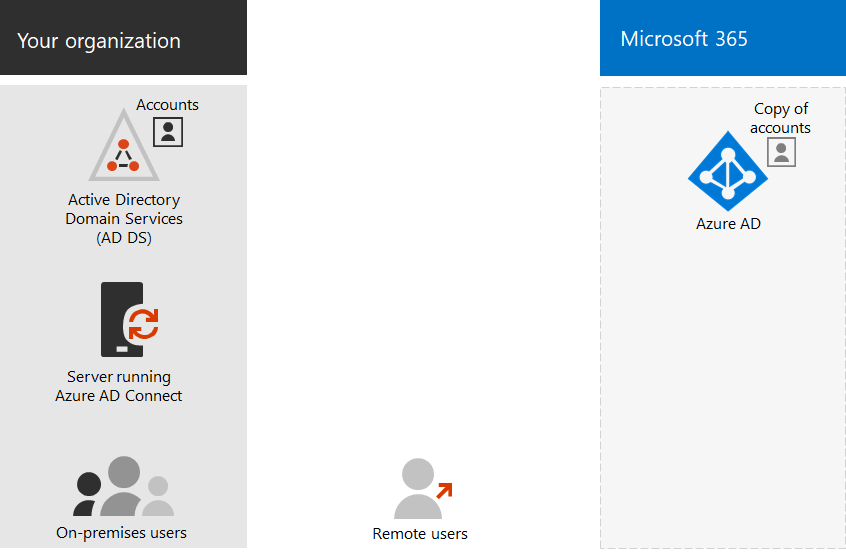

# Modèles d’identité Office 365 et Azure Active Directory

Office 365 utilise Azure Active Directory (Azure AD), un service d’authentification et d’identité d’utilisateur basé sur un nuage inclus dans votre abonnement Office 365, pour gérer les identités et l’authentification pour Office 365. L’obtention de l’infrastructure d’identité configurée correctement est essentielle pour la gestion de l’accès des utilisateurs et des autorisations Office 365 pour votre organisation.

Avant de commencer, regardez cette vidéo pour obtenir une vue d’ensemble des modèles d’identité et de l’authentification pour Office 365 et Microsoft 365.

> [!VIDEO https://www.microsoft.com/videoplayer/embed/RE2Pjwu]

Votre premier choix de planification est le modèle d’identité Office 365.

## Modèles d’identité Office 365

Pour planifier les comptes d’utilisateur, vous devez d’abord comprendre les deux modèles d’identité dans Microsoft 365. Vous pouvez gérer les identités de votre organisation uniquement dans le Cloud, ou vous pouvez conserver vos identités de services de domaine Active Directory (AD DS) sur site et les utiliser pour l’authentification lorsque les utilisateurs accèdent aux services Cloud de Microsoft 365.  

Voici les deux types d’identités, leur meilleur et leurs avantages.

|||
|:-------|:-----|:-----|
|  | **Identité en nuage uniquement** | **Identité hybride** |
| **Définition** | Le compte d’utilisateur existe uniquement dans le client Azure Active Directory (Azure AD) pour votre abonnement Microsoft 365. | Le compte d’utilisateur existe dans AD DS et une copie se trouve également dans le client Azure AD pour votre abonnement Microsoft 365. Le compte d’utilisateur dans Azure AD peut également inclure une version hachée du mot de passe du compte d’utilisateur. |
| **Comment Microsoft 365 authentifie les informations d’identification de l’utilisateur** | Le client Azure AD de votre abonnement Microsoft 365 effectue l’authentification avec le compte d’identité Cloud. | Le client Azure AD de votre abonnement Microsoft 365 gère le processus d’authentification ou redirige l’utilisateur vers un autre fournisseur d’identité. |
| **Recommandé pour** | Organisations qui n’ont pas ou n’ont pas besoin d’un service AD DS local. | Organisations utilisant AD DS ou un autre fournisseur d’identité. |
| **Plus grand avantage** | Simple à utiliser. Aucun outil de répertoire ou serveur supplémentaire n’est requis. | Les utilisateurs peuvent utiliser les mêmes informations d’identification lors de l’accès à des ressources sur site ou en nuage. |
||||

## Identité en nuage uniquement

Une identité en nuage uniquement utilise des comptes d’utilisateur qui existent uniquement dans Azure AD. L’identité Cloud est généralement utilisée par les petites organisations qui n’ont pas de serveurs locaux ou n’utilisent pas AD DS pour gérer les identités locales. 

Voici les composants de base de l’identité en nuage uniquement.
 

Les utilisateurs locaux et distants (en ligne) utilisent leurs comptes d’utilisateur et mots de passe Azure AD pour accéder aux services Cloud Office 365. Azure AD authentifie les informations d’identification de l’utilisateur en fonction de ses comptes et mots de passe utilisateur enregistrés.

### Administration
Étant donné que les comptes d’utilisateur sont stockés uniquement dans Azure AD, vous pouvez gérer les identités Cloud avec des outils tels que le [Centre d’administration Microsoft 365](https://admin.microsoft.com) et Windows PowerShell avec le module Azure Active Directory PowerShell pour Graph. 

## Identité hybride

L’identité hybride utilise des comptes qui proviennent d’un service AD DS local et qui disposent d’une copie dans le client Azure AD d’un abonnement Microsoft 365. Toutefois, la plupart des modifications ne circulent qu’une seule. Les modifications que vous effectuez sur les comptes d’utilisateur AD DS sont synchronisées avec leur copie dans Azure AD. Toutefois, les modifications apportées aux comptes en nuage dans Azure AD, telles que les nouveaux comptes d’utilisateurs, ne sont pas synchronisées avec les services AD DS.

Azure AD Connect assure la synchronisation des comptes en continu. Il s’exécute sur un serveur local, vérifie les modifications apportées aux services de domaine Active Directory et transfère ces modifications à Azure AD. Azure AD Connect offre la possibilité de filtrer les comptes synchronisés et de synchroniser une version hachée des mots de passe des utilisateurs, appelée synchronisation de hachage de mot de passe (hachage).

Lorsque vous implémentez l’identité hybride, votre service AD DS sur site est la source faisant autorité pour les informations de compte. Cela signifie que vous effectuez des tâches d’administration principalement en local, qui sont ensuite synchronisées avec Azure AD. 

Voici les composants de l’identité hybride.

Le client Azure AD dispose d’une copie des comptes AD DS. Dans cette configuration, les utilisateurs locaux et distants accèdent aux services Cloud de Microsoft 365 pour s’authentifier auprès d’Azure AD.

>[!Note]
>Vous devez toujours utiliser Azure AD Connect pour synchroniser les comptes d’utilisateurs pour l’identité hybride. Vous avez besoin des comptes d’utilisateur synchronisés dans Azure AD pour effectuer des attributions de licences et la gestion des groupes, configurer des autorisations et d’autres tâches administratives qui impliquent des comptes d’utilisateur.
>

### Administration

Étant donné que les comptes d’utilisateur d’origine et faisant autorité sont stockés dans le service AD DS local, vous gérez vos identités avec les mêmes outils que les services AD DS, tels que l’outil utilisateurs et ordinateurs Active Directory. 

Vous n’utilisez pas le centre d’administration Microsoft 365 ni Windows PowerShell pour gérer les comptes d’utilisateur synchronisés dans Azure AD.

## Étape suivante

Si vous avez besoin du modèle d’identité Cloud uniquement, consultez la rubrique [identités en nuage uniquement](cloud-only-identities.md).

Si vous avez besoin du modèle d’identité hybride, consultez la rubrique [synchronisation](plan-for-directory-synchronization.md)d’annuaires.
  

## Vidéo de formation

Consultez le cours vidéo [Office 365: gérer les identités à l’aide d’Azure ad Connect](https://support.office.com/article/90991a1d-c0ab-479a-b413-35c9706f6fed.aspx), qui vous a été présenté par LinkedIn Learning.
