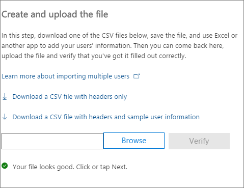

# <a name="add-several-users-at-the-same-time-to-office-365---admin-help"></a>Ajouter plusieurs utilisateurs simultanément à Office 365 - Aide de l’administrateur

[] Les membres de votre équipe ont besoin d'un compte d'utilisateur pour pouvoir se connecter et accéder aux services Office 365, tels que le courrier et Office. Si votre équipe compte de nombreux membres, vous pouvez ajouter tous leurs comptes simultanément à partir d'une feuille de calcul Excel ou d'un autre fichier enregistré au format CSV. [Qu'est-ce que le format CSV ?](add-several-users-at-the-same-time.md#__toc316652088)
  
## <a name="add-multiple-users-to-office-365-in-the-office-365-admin-center"></a>Ajouter plusieurs utilisateurs à Office 365 dans le Centre d'administration Office 365

1. Connectez-vous à Office 365 avec votre compte professionnel ou scolaire. 
    
2. Dans le Centre d'administration Office 365, sélectionnez **Utilisateurs** \> **Utilisateurs actifs**.
    
    
  
3. Dans le menu déroulant **Autres**, choisissez **Importer plusieurs utilisateurs**.
    
4. Dans le panneau **Importer plusieurs utilisateurs**, vous pouvez éventuellement télécharger un exemple de fichier CSV avec ou sans exemple de données inclus. 
    
    
  
    Votre feuille de calcul doit inclure les **mêmes en-têtes de colonne** que ceux de l'exemple (Nom d'utilisateur, Prénom, etc.). Si vous utilisez le modèle, ouvrez-le dans un outil d'édition de texte tel que Notepad, laissez les données de la ligne 1 inchangées et entrez uniquement des données dans la ligne 2 et les lignes suivantes. 
    
    Votre feuille de calcul doit également inclure des valeurs pour le nom d'utilisateur (tel que alexandre@contoso.com) et un nom complet (tel que Alexandre Chauvin) pour chaque utilisateur. 
    
  ```
  User Name,First Name,Last Name,Display Name,Job Title,Department,Office Number,Office Phone,Mobile Phone,Fax,Address,City,State or Province,ZIP or Postal Code,Country or Region
  chris@contoso.com,Chris,Green,Chris Green,IT Manager,Information Technology,123451,123-555-1211,123-555-6641,123-555-9821,1 Microsoft way,Redmond,Wa,98052,United States
  ben@contoso.com,Ben,Andrews,Ben Andrews,IT Manager,Information Technology,123452,123-555-1212,123-555-6642,123-555-9822,1 Microsoft way,Redmond,Wa,98052,United States
  david@contoso.com,David,Longmuir,David Longmuir,IT Manager,Information Technology,123453,123-555-1213,123-555-6643,123-555-9823,1 Microsoft way,Redmond,Wa,98052,United States
  cynthia@contoso.com,Cynthia,Carey,Cynthia Carey,IT Manager,Information Technology,123454,123-555-1214,123-555-6644,123-555-9824,1 Microsoft way,Redmond,Wa,98052,United States
  melissa@contoso.com,Melissa,MacBeth,Melissa MacBeth,IT Manager,Information Technology,123455,123-555-1215,123-555-6645,123-555-9825,1 Microsoft way,Redmond,Wa,98052,United States
  
  ```

5. Entrez un chemin d'accès dans la zone, ou choisissez **Parcourir** pour accéder à l'emplacement du fichier CSV, puis sélectionnez **Vérifier**.
    
    
  
    S'il existe des problèmes avec le fichier, ceux-ci s'affichent dans le panneau. Vous pouvez également télécharger un fichier journal.
    
6. Dans la boîte de dialogue **Définir les options utilisateur**, vous pouvez définir le statut de connexion et choisir la licence produit à affecter à tous les utilisateurs. 
    
7. Dans la boîte de dialogue **Affichez vos résultats**, vous pouvez choisir d'envoyer les résultats à vous-même ou à d'autres utilisateurs (les mots de passe seront au format texte brut). En outre, vous pouvez voir combien d'utilisateurs ont été créés et si vous avez besoin d'acheter des licences supplémentaires pour les attribuer à certains des nouveaux utilisateurs. 
    
## <a name="watch-the-video"></a>Voir la vidéo
<a name="bk_preview"> </a>

 Regardez une courte vidéo qui vous montre comment ajouter des utilisateurs en bloc. 
  
> [!VIDEO https://www.microsoft.com/videoplayer/embed/f4e7f161-8ae6-4264-a429-9297b539a8de?autoplay=false]
  
## <a name="next-steps"></a>Étapes suivantes
<a name="bk_preview"> </a>

- À présent que ces personnes ont des comptes, elles doivent [Télécharger et installer ou réinstaller office 365 ou office 2016 sur un PC ou un Mac](https://support.office.com/article/4414eaaf-0478-48be-9c42-23adc4716658). Chaque membre de votre équipe peut installer Office 365 sur un maximum de 5 PC ou Mac. 
    
- Chaque personne peut également [configurer les applications Office et le courrier électronique sur un appareil mobile sur un](https://support.office.com/article/7dabb6cb-0046-40b6-81fe-767e0b1f014f) maximum de 5 tablettes et 5 téléphones, comme des iPhone, des iPad et des tablettes et tablettes Android. Ainsi, ils peuvent modifier les fichiers Office à partir de n'importe quel endroit. 
    
    Voir [Configurer Office 365 pour les entreprises](https://support.office.com/article/6a3a29a0-e616-4713-99d1-15eda62d04fa) pour obtenir une liste de bout en bout des étapes de configuration. 
    
## <a name="more-information-about-how-to-add-users-to-office-365"></a>Informations complémentaires sur l'ajout d'utilisateurs à Office 365
<a name="bk_preview"> </a>

### <a name="not-sure-what-csv-format-is"></a>Qu'est-ce que le format CSV ?
<a name="__toc316652088"> </a>

Un fichier CSV inclut des valeurs séparées par des virgules. Vous pouvez créer ou modifier un fichier comme celui-ci avec un éditeur de texte ou un tableur comme Excel.
  
Vous pouvez télécharger [cet exemple de feuille de calcul](https://www.microsoft.com/en-us/download/details.aspx?id=45485) pour commencer. Rappelez-vous qu'Office 365 nécessite des en-têtes de colonne dans la première ligne, aussi ne les remplacez pas par d'autres informations. 
  
Enregistrez le fichier avec un nouveau nom et spécifiez le format CSV.
  

  
Une fois le fichier enregistré, il est probable qu'un message indiquant que certaines fonctionnalités de votre classeur seront perdues si vous enregistrez le fichier au format CSV s'affiche. Ceci est normal. Cliquez sur **Oui** pour continuer. 
  

  
### <a name="tips-for-formatting-your-spreadsheet"></a>Conseils pour la mise en forme de votre feuille de calcul
<a name="__toc314595848"> </a>

- **Ai-je besoin des mêmes en-têtes de colonne que dans l'exemple de feuille de calcul ?** Oui. La première ligne de l'exemple de feuille de calcul inclut les en-têtes de colonne. Ces en-têtes sont obligatoires. Pour chaque utilisateur que vous voulez ajouter à Office 365, créez une ligne sous l'en-tête. Si vous ajoutez, modifiez ou supprimez l'un des en-têtes de colonne, il est possible qu'Office 365 ne puisse pas créer des utilisateurs à partir des informations du fichier. 
    
- **Que faire si je n'ai pas toutes les informations requises pour chaque utilisateur ?** Le nom de l'utilisateur et le nom d'affichage sont obligatoires. Vous ne pouvez pas ajouter un nouvel utilisateur sans ces informations. S'il vous manque d'autres informations, par exemple le numéro de télécopie, vous pouvez insérer un espace suivi d'une virgule pour indiquer que le champ est vide. 
    
- ** How small or large can the spreadsheet be? ** The spreadsheet must have at least two rows. One is for the column headings (the user data column label) and one for the user. You cannot have more than 251 rows. If you need to import more than 250 users, you can create more than one spreadsheet. 
    
- ** What languages can I use? ** When you create your spreadsheet, you can enter user data column labels in any language or characters, but you must not change the order of the labels, as shown in the sample. You can then make entries into the fields, using any language or characters, and save your file in a Unicode or UTF-8 format. 
    
- **Que dois-je faire si j'ajoute des utilisateurs de régions ou de pays différents ?** Créez une feuille de calcul distincte pour chaque zone. Vous devez exécuter l'Assistant Ajouter des utilisateurs en bloc avec chaque feuille de calcul, et donner ainsi un seul emplacement à tous les utilisateurs inclus dans le fichier que vous utilisez. 
    
- **Le nombre de caractères que je peux utiliser est-il limité ?** Le tableau suivant indique les étiquettes de colonne des données utilisateur et le nombre maximal de caractères autorisés pour chacune d'elles dans l'exemple de feuille de calcul. 
    
|**Étiquette de colonne des données utilisateur**|**Longueur de caractères maximale**|
|:-----|:-----|
|Nom d'utilisateur (requis)  <br/> |79 avec le symbole arobase (@), au format nom@domaine.\<extension\>. L'alias de l'utilisateur ne peut pas dépasser 30 caractères, et le nom de domaine 48 caractères.  <br/> |
|Prénom  <br/> |64  <br/> |
|Nom  <br/> |64  <br/> |
|Nom d'affichage (requis)  <br/> |256  <br/> |
|Poste  <br/> |64  <br/> |
|Service  <br/> |64  <br/> |
|Numéro du bureau  <br/> |128  <br/> |
|Téléphone (bureau)  <br/> |64  <br/> |
|Téléphone mobile  <br/> |64  <br/> |
|Télécopie  <br/> |64  <br/> |
|Adresse  <br/> |1023  <br/> |
|Ville  <br/> |128  <br/> |
|Département ou région  <br/> |128  <br/> |
|Code postal  <br/> |40  <br/> |
|Pays ou région  <br/> |128  <br/> |
   
### <a name="still-having-problems-when-adding-users-to-office-365"></a>Vous rencontrez encore des problèmes lorsque vous ajoutez des utilisateurs à Office 365 ?

- **Vérifiez que la feuille de calcul est correctement mise en forme.** Examinez les en-têtes des colonnes pour vous assurer qu'ils correspondent à ceux de l'exemple de fichier. Veillez à respecter le nombre de caractères autorisés et assurez-vous que chaque champ est séparé par une virgule. 
    
- ** Si les nouveaux utilisateurs n'apparaissent pas tout de suite dans Office 365, patientez quelques minutes. ** La répercussion des modifications dans tous les services d'Office 365 peut prendre du temps. 
    
## <a name="add-multiple-users-to-office-365-in-the-old-office-365-admin-center"></a>Ajouter plusieurs utilisateurs à Office 365 dans l'ancien Centre d'administration Office 365

1. Téléchargez [cet exemple de feuille de calcul](https://www.microsoft.com/en-us/download/details.aspx?id=45485) et ouvrez-la dans Excel. 
    
    Votre feuille de calcul doit inclure les **mêmes en-têtes de colonne** que ceux de l'exemple (Nom d'utilisateur, Prénom, etc.). Si vous utilisez le modèle, laissez les données de la ligne 1 inchangées et entrez uniquement des données dans la ligne 2 et les lignes suivantes. 
    
    Votre feuille de calcul doit également inclure des valeurs pour le nom d'utilisateur (tel que alexandre@contoso.com) et un nom complet (tel que Alexandre Chauvin) pour chaque utilisateur. Pour laisser les autres champs vides, entrez un espace plus une virgule dans le champ, comme illustré dans la figure suivante. 
    
    
  
    Si des membres de votre organisation travaillent dans différents pays ou régions, vous devez créer une feuille de calcul pour les utilisateurs de chaque pays ou région. Par exemple, une feuille de calcul peut répertorier toutes les personnes travaillant aux États-Unis, tandis que l'autre répertorie celles travaillant au Japon. En effet, la disponibilité des services Office 365 varie selon la région. 
    
    **Conseil :** avant d'ajouter un grand nombre d'utilisateurs à Office 365, vous voudrez peut-être vous exercer avec l'exemple de feuille de calcul. Par exemple, modifiez l'exemple de feuille de calcul avec les données de quelques utilisateurs (5 ou 10 utilisateurs) et enregistrez le fichier avec un nouveau nom. Parcourez les étapes décrites dans cette procédure, consultez les résultats, supprimez les nouveaux comptes et recommencez. Vous pouvez ainsi vous entraîner à recevoir l'ensemble des données adaptées à votre situation. Consultez également la section [Conseils pour la mise en forme de votre feuille de calcul](add-several-users-at-the-same-time.md#__toc314595848).
    
2. Connectez-vous à Office 365 avec votre compte professionnel ou scolaire. 
    
3. Accédez au Centre d’administration Office 365.
    
4. Pour que les personnes puissent utiliser les services Office 365, une licence doit leur être attribuée. Avant de continuer, vous voudrez peut-être vérifier que vous avez suffisamment de licences pour les personnes mentionnées dans votre feuille de calcul. Sélectionnez **Facturation** \> **Abonnements** pour déterminer si vous en avez assez. Si vous avez besoin d'acheter d'autres licences, sélectionnez ** Modifier le nombre de licences **. Vous pouvez également exécuter l'Assistant et attribuer les licences que vous avez, puis acheter d'autres licences plus tard et réexécuter l'Assistant. 
    
5. Accédez ensuite à l'Assistant Ajouter des utilisateurs en bloc : sélectionnez **Utilisateurs** \> **Utilisateurs actifs**. Sélectionnez  comme illustré dans la figure suivante. 
    
    
  
    L'Assistant Ajouter des utilisateurs en bloc apparaît et vous guide dans l'ajout d'un groupe d'utilisateurs à Office 365. 
    
6. Dans l'étape 1 (Sélectionner un fichier CSV), spécifiez votre propre feuille de calcul comme illustré dans la figure suivante.
    
    
  
7. Dans l'étape 2 (Vérification), l'Assistant vous indique si le contenu de la feuille de calcul est correctement mis en forme.
    
    
  
8. Dans l'étape 3 (Paramètres), sélectionnez **Autorisé** de telle sorte que les personnes qui apparaissent dans votre feuille de calcul puissent utiliser Office 365. Sélectionnez également le pays ou la région dans lequel ces personnes utiliseront Office 365. Rappelez-vous que si certains membres de votre organisation utiliseront Office 365 dans un autre pays ou dans une autre région, créez une feuille de calcul distincte avec leurs noms et exécutez l'Assistant Ajouter des utilisateurs en bloc pour les ajouter. 
    
    
  
9. La page Attribuer des licences indique le nombre de licences disponibles. 
    
    
  
    Vous pouvez sélectionner **Acheter de nouvelles licences**, mais vous quitterez alors l'Assistant Ajouter des utilisateurs en bloc et accéderez à la **facturation** dans le portail Centre d'administration Office 365. Après avoir acheté d'autres licences, vous devez patienter quelques minutes que la commande soit traitée, puis réexécuter l'Assistant Ajouter des utilisateurs en bloc depuis le début. 
    
    Si vous n'achetez pas d'autres licences, les comptes ne seront pas créés pour toutes les personnes figurant dans votre feuille de calcul. 
    
    Dans cet exemple, nous n'achetons pas d'autres licences et continuons avec l'Assistant Ajouter des utilisateurs en bloc.
    
10. Dans l'étape 5 (Envoyer les résultats), tapez les adresses de courrier dont vous voulez recevoir un message répertoriant  *tous*  les noms d'utilisateur Office 365 et mots de passe temporaires pour les personnes figurant dans la feuille de calcul. 
    
    
  
    Le message suivant est envoyé à toutes les adresses de courrier que vous avez spécifiées à l'étape 5 (Envoyer les résultats). Ce message indique les comptes qui ont été créés. Notez qu'aucun compte n'a été créé pour certaines personnes, car les licences n'étaient pas suffisantes. 
    
    
  
    Vous pouvez acheter d'autres licences ultérieurement et réexécuter l'Assistant Ajouter des utilisateurs en bloc avec la même feuille de calcul. L'Assistant ignore les utilisateurs qui ont déjà des comptes. Le rapport de résultats inclura la mention « Nom d'utilisateur dupliqué ». Celle-ci indique qu'une personne dotée de ces informations possède déjà un compte.
    
11. La page finale de l'Assistant Ajouter des utilisateurs en bloc répertorie les noms d'utilisateur et mots de passe temporaires, comme illustré dans la figure suivante.
    
    
  
12. Une fois que vous avez ajouté des utilisateurs à Office 365, vous devez leur communiquer leurs informations de compte Office 365. Nous vous conseillons d'utiliser le processus normal pour communiquer les nouveaux mots de passe.
    

