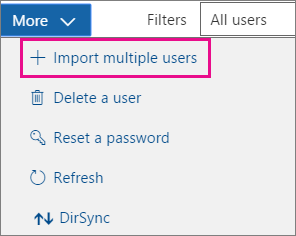

# <a name="add-several-users-at-the-same-time-to-office-365---admin-help"></a>Ajouter plusieurs utilisateurs simultanément à Office 365 - Aide aux administrateurs

Un compte d’utilisateur a besoin de chaque personne de votre équipe avant de pouvoir se connecter et accéder aux services Office 365, tels que le courrier électronique et d’Office. Si vous avez un grand nombre de personnes, vous pouvez ajouter leurs comptes à la fois à partir d’une feuille de calcul Excel ou un autre fichier enregistré au format CSV. [Ne savez pas quel format CSV est ?](add-several-users-at-the-same-time.md#__toc316652088)
  
## <a name="add-multiple-users-to-office-365-in-the-office-365-admin-center"></a>Ajouter plusieurs utilisateurs à Office 365 dans le centre d’administration d’Office 365

1. Connectez-vous à Office 365 avec votre compte professionnel ou scolaire. 
    
2. Dans le centre d’administration Office 365, choisissez **utilisateurs** \> **utilisateurs actifs**.
    
    
  
3. Dans la **plus** liste déroulante, choisissez **importer plusieurs utilisateurs**.
    
4. Dans le panneau **importer plusieurs utilisateurs** , vous pouvez éventuellement télécharger un exemple de fichier CSV avec ou sans données exemple renseignées. 
    
    
  
    Une feuille de calcul doit inclure les **en-têtes de colonne même exacte** que l’exemple 1 (nom d’utilisateur, prénom, etc....). Si vous utilisez le modèle, ouvrez-le dans un outil d’édition de texte, tel que le bloc-notes et prendre en compte en laissant toutes les données dans la ligne 1 décrire et saisie de données uniquement dans les lignes 2 et en dessous. 
    
    Une feuille de calcul doit également inclure des valeurs pour le nom d’utilisateur (par exemple, bob@contoso.com) et un nom d’affichage (par exemple, Bob Kelly) pour chaque utilisateur. 
    
  ```
  User Name,First Name,Last Name,Display Name,Job Title,Department,Office Number,Office Phone,Mobile Phone,Fax,Address,City,State or Province,ZIP or Postal Code,Country or Region
  chris@contoso.com,Chris,Green,Chris Green,IT Manager,Information Technology,123451,123-555-1211,123-555-6641,123-555-9821,1 Microsoft way,Redmond,Wa,98052,United States
  ben@contoso.com,Ben,Andrews,Ben Andrews,IT Manager,Information Technology,123452,123-555-1212,123-555-6642,123-555-9822,1 Microsoft way,Redmond,Wa,98052,United States
  david@contoso.com,David,Longmuir,David Longmuir,IT Manager,Information Technology,123453,123-555-1213,123-555-6643,123-555-9823,1 Microsoft way,Redmond,Wa,98052,United States
  cynthia@contoso.com,Cynthia,Carey,Cynthia Carey,IT Manager,Information Technology,123454,123-555-1214,123-555-6644,123-555-9824,1 Microsoft way,Redmond,Wa,98052,United States
  melissa@contoso.com,Melissa,MacBeth,Melissa MacBeth,IT Manager,Information Technology,123455,123-555-1215,123-555-6645,123-555-9825,1 Microsoft way,Redmond,Wa,98052,United States
  
  ```

5. Entrez un chemin d’accès du fichier dans la zone, ou cliquez sur **Parcourir** pour accéder à l’emplacement de fichier CSV, puis cliquez sur **Vérifier**.
    
    
  
    S’il existe des problèmes avec le fichier, le problème s’affiche dans le panneau de configuration. Vous pouvez également télécharger un fichier journal.
    
6. Dans la boîte de dialogue **définir les options de l’utilisateur** , vous pouvez définir le statut de connexion et choisissez la licence de produit qui est affectée à tous les utilisateurs. 
    
7. Dans la boîte de dialogue **Afficher les résultats** , vous pouvez choisir d’envoyer les résultats à vous-même ou autres utilisateurs (les mots de passe seront en texte brut) et vous pouvez voir combien d’utilisateurs ont été créés, et si vous devez acheter davantage de licences pour attribuer à certains des nouveaux utilisateurs. 
    
## <a name="watch-the-video"></a>Regarder la vidéo
<a name="bk_preview"> </a>

 Regardez une courte vidéo qui montre comment en bloc à ajouter des utilisateurs. 
  
> [!VIDEO https://www.microsoft.com/videoplayer/embed/f4e7f161-8ae6-4264-a429-9297b539a8de?autoplay=false]
  
## <a name="next-steps"></a>Étapes suivantes
<a name="bk_preview"> </a>

- Maintenant que ces utilisateurs disposent de comptes, ils doivent [télécharger et installer ou réinstalle Office 365 ou 2016 Office sur un PC ou un Mac](https://support.office.com/article/4414eaaf-0478-48be-9c42-23adc4716658). Chaque personne de votre équipe permettre installer Office 365 sur jusqu'à 5 PC ou Mac. 
    
- Chaque personne peut également [configurer les applications Office et de messagerie sur un appareil mobile](https://support.office.com/article/7dabb6cb-0046-40b6-81fe-767e0b1f014f) sur des 5 téléphones, tels que les iPhone, tablettes, téléphones Android et des tablettes et les tablettes jusqu'à 5. Ainsi, ils peuvent modifier des fichiers Office depuis n’importe où. 
    
    Pour une liste de bout en bout des étapes d’installation, voir [configurer Office 365 pour entreprises](https://support.office.com/article/6a3a29a0-e616-4713-99d1-15eda62d04fa) . 
    
## <a name="more-information-about-how-to-add-users-to-office-365"></a>Plus d’informations sur la façon d’ajouter des utilisateurs à Office 365
<a name="bk_preview"> </a>

### <a name="not-sure-what-csv-format-is"></a>Ne savez pas quel format CSV est ?
<a name="__toc316652088"> </a>

Un fichier CSV est un fichier de valeurs séparées par des virgules. Vous pouvez créer ou modifier un fichier similaire à celle-ci avec n’importe quel éditeur de texte ou d’un programme de feuille de calcul, telle qu’Excel.
  
Vous pouvez télécharger [cette feuille de calcul exemple](https://www.microsoft.com/en-us/download/details.aspx?id=45485) comme point de départ. N’oubliez pas que Office 365 nécessite des en-têtes de colonne de la première ligne donc ne pas les remplacer par quelque chose d’autre. 
  
Enregistrez le fichier sous un nouveau nom et spécifier le format CSV.
  

  
Lorsque vous enregistrez le fichier, vous aurez probablement une invite de commandes que certaines fonctionnalités de votre classeur seront perdues si vous enregistrez le fichier au format CSV. Il s’agit OK. Cliquez sur **Oui** pour continuer. 
  

  
### <a name="tips-for-formatting-your-spreadsheet"></a>Conseils pour la mise en forme d’une feuille de calcul
<a name="__toc314595848"> </a>

- **dois-je les en-têtes de colonnes de même que dans la feuille de calcul exemple ?** Oui. La feuille de calcul exemple contient les en-têtes de colonne de la première ligne. Les rubriques suivantes sont nécessaires. Pour chaque utilisateur que vous souhaitez ajouter à Office 365, créez une ligne sous le titre. Si vous ajoutez, modifiez ou supprimez des en-têtes de colonne, Office 365 ne peuvent pas être en mesure de créer des utilisateurs à partir des informations dans le fichier. 
    
- **Que se passe-t-il si je n’ai pas toutes les informations requises pour chaque utilisateur ?** Le nom d’utilisateur et le nom d’affichage sont nécessaires, et vous ne pouvez pas ajouter un nouvel utilisateur sans ces informations. Si vous ne disposez pas des autres informations, telles que la télécopie, vous pouvez utiliser un espace et une virgule pour indiquer que le champ doit rester vide. 
    
- ** Comment petites ou grandes peut être la feuille de calcul ? ** La feuille de calcul doit avoir au moins deux lignes. Une est pour les en-têtes de colonne (l’utilisateur colonne étiquette de données) et un pour l’utilisateur. Vous ne pouvez pas 251 plus de lignes. Si vous devez importer plus de 250 utilisateurs, vous pouvez créer plusieurs feuilles de calcul. 
    
- ** Quelles langues puis-je utiliser ? ** Lorsque vous créez votre feuille de calcul, vous pouvez entrer des étiquettes de colonne de données utilisateur dans n’importe quel langage ou les caractères, mais vous ne devez pas modifier l’ordre des étiquettes, comme illustré dans l’exemple. Vous pouvez ensuite effectuer des entrées dans les champs, à l’aide de n’importe quel langage ou les caractères et enregistrer votre fichier au format UTF-8 ou Unicode. 
    
- **Que se passe-t-il si je suis Ajout d’utilisateurs à partir de différents pays ou régions ?** Créer une feuille de calcul séparée pour chaque zone. Vous devez parcourir la majeure partie Assistant Ajout d’utilisateurs le chaque feuille de calcul, en donnant à un seul emplacement de tous les utilisateurs inclus dans le fichier avec lequel vous travaillez. 
    
- **y a-t-il une limite au nombre de caractères puis-je utiliser ?** Le tableau suivant indique les étiquettes de colonne de données utilisateur et le nombre maximal de caractères pour chaque feuille de calcul exemple. 
    
|**Étiquette de colonne de données utilisateur**|**Nombre maximal de caractères**|
|:-----|:-----|
|Nom d’utilisateur (obligatoire)  <br/> |79, y compris l’arobase (@), au format Name@Domain. \<extension\>. Alias de l’utilisateur ne peut pas dépasser 30 caractères et le nom de domaine ne peut pas dépasser 48 caractères.  <br/> |
|Prénom  <br/> |64  <br/> |
|Nom  <br/> |64  <br/> |
|Nom complet (requis)  <br/> |256  <br/> |
|Fonction  <br/> |64  <br/> |
|Service  <br/> |64  <br/> |
|Numéro de bureau  <br/> |128  <br/> |
|Téléphone (bureau)  <br/> |64  <br/> |
|Téléphone mobile  <br/> |64  <br/> |
|Télécopie  <br/> |64  <br/> |
|Adresse  <br/> |1023  <br/> |
|Ville  <br/> |128  <br/> |
|Département ou province  <br/> |128  <br/> |
|ZIP ou le Code Postal  <br/> |40  <br/> |
|Pays ou région  <br/> |128  <br/> |
   
### <a name="still-having-problems-when-adding-users-to-office-365"></a>Vous rencontrez encore des problèmes lors de l’ajout d’utilisateurs à Office 365 ?

- **Vérifiez que la feuille de calcul est correctement formaté.** Vérifiez les en-têtes de colonne pour vous assurer qu’ils correspondent à ceux dans l’exemple de fichier. Assurez-vous que vous êtes suivant les règles de longueur et chaque champ séparé par une virgule. 
    
- ** Si vous ne voyez pas immédiatement les nouveaux utilisateurs dans Office 365, patientez quelques minutes. ** Peut prendre un peu tandis que pour les modifications sur tous les services dans Office 365. 
    
## <a name="add-multiple-users-to-office-365-in-the-old-office-365-admin-center"></a>Ajouter plusieurs utilisateurs à Office 365 dans le centre d’administration Office 365 anciens

1. Télécharger [cette feuille de calcul d’exemple](https://www.microsoft.com/en-us/download/details.aspx?id=45485) et l’ouvrir dans Excel. 
    
    Une feuille de calcul doit inclure les **en-têtes de colonne même exacte** que l’exemple 1 (nom d’utilisateur, prénom, etc....). Si vous utilisez le modèle, prenez en compte en laissant toutes les données dans la ligne 1 décrire et saisie de données uniquement dans les lignes 2 et en dessous. 
    
    Une feuille de calcul doit également inclure des valeurs pour le nom d’utilisateur (par exemple, bob@contoso.com) et un nom d’affichage (par exemple, Bob Kelly) pour chaque utilisateur. Pour laisser les autres champs vides, entrez un espace et une virgule dans le champ comme indiqué dans la figure suivante. 
    
    
  
    Si vous avez des personnes travaillant dans différents pays, vous devez créer une feuille de calcul pour les utilisateurs dans chaque pays. Par exemple, une feuille de calcul qui répertorie tous les employés travaillant aux États-Unis et un autre qui répertorie tous les employés travaillant au Japon. Il s’agit, car la disponibilité des services Office 365 varie selon la région. 
    
    **Conseil :** Avant d’ajouter plusieurs utilisateurs vers Office 365, vous pouvez souhaiter pratique avec la feuille de calcul d’exemple. Par exemple, modifier la feuille de calcul exemple avec des données de certains de vos utilisateurs, par exemple 5 ou 10 et enregistrez le fichier sous un nouveau nom. Exécutez les étapes décrites dans cette procédure, vérifiez les résultats, puis supprimer les nouveaux comptes et recommencer. Ainsi, vous pouvez entraîner l’obtention de toutes le données directement à votre situation. Vérifiez également des [conseils pour la mise en forme d’une feuille de calcul](add-several-users-at-the-same-time.md#__toc314595848).
    
2. Connectez-vous à Office 365 avec votre compte professionnel ou scolaire. 
    
3. Accédez au Centre d’administration Office 365.
    
4. Pour les personnes à utiliser les services Office 365, ils doivent être attribué une licence. Avant de continuer, vous pouvez souhaiter vérifier que vous disposez de suffisamment de licences pour tout le monde répertoriées dans une feuille de calcul. Choisissez la **facturation** \> **abonnements** pour voir si vous disposez de suffisamment. Si vous devez acheter des licences supplémentaires, choisissez ** Modifier le nombre de licences **. Ou bien, vous pouvez exécuter l’Assistant et attribuer les licences que vous avez, puis achetez des licences supplémentaires plus loin et réexécutez l’Assistant. 
    
5. Accédez à la majeure partie Assistant Ajout d’utilisateurs à présent : choisir **les utilisateurs** \> **Utilisateurs actifs**. Choisissez  comme le montre la figure suivante. 
    
    
  
    La majeure partie ajouter des utilisateurs Assistant s’affiche et vous guide à travers l’ajout d’un groupe d’utilisateurs vers Office 365. 
    
6. À l’étape 1 : sélectionner un fichier CSV, spécifiez votre propre feuille de calcul, comme le montre la figure suivante.
    
    
  
7. À l’étape 2 : vérification, l’Assistant vous indique si le contenu de la feuille de calcul est correctement mis en forme.
    
    
  
8. À l’étape 3 - paramètres, choisissez **autorisé** afin que les personnes figurant dans votre feuille de calcul sera en mesure d’utiliser Office 365. Également choisir le pays dans lequel ces personnes utiliseront Office 365. N’oubliez pas si certaines personnes de votre organisation doivent utiliser Office 365 dans un autre pays, de créer une feuille de calcul séparée avec leurs noms et exécuter la majeure partie Assistant Ajout d’utilisateurs afin de les ajouter. 
    
    
  
9. La page attribuer des licences vous indique le nombre de licences disponible. 
    
    
  
    Vous pouvez choisir **d’acheter des licences supplémentaires**, mais laissez la majeure partie Assistant Ajout d’utilisateurs et accédez à la **facturation** dans le centre d’administration d’Office 365. Après avoir acheté des licences, vous devrez attendre quelques minutes pour l’ordre de traitement et puis démarrer la majeure partie Assistant Ajout d’utilisateurs à partir du début. 
    
    Si vous n’achetez davantage de licences, les comptes ne sont pas créés pour toutes les entrées dans une feuille de calcul. 
    
    Dans cet exemple, nous ne pas acheter des licences supplémentaires et poursuivre la majeure partie Assistant Ajout d’utilisateurs.
    
10. À l’étape 5 : envoyer les résultats, tapez les adresses de messagerie des personnes que vous souhaitez obtenir un message électronique qui répertorie *tous les* mots de passe temporaire et noms d’utilisateur Office 365 pour les personnes figurant dans la feuille de calcul. 
    
    
  
    Le message électronique suivant est envoyé à toutes les adresses de messagerie que vous avez spécifié à l’étape 5 - envoyer des résultats. Ce message indique que les comptes qui ont été créées. Notez que les comptes n’ont pas été créés pour certaines personnes, car il n’ont pas été suffisamment de licences. 
    
    
  
    Vous pouvez acheter plusieurs licences ultérieurement et réexécuter la majeure partie ajouter Assistant d’utilisateurs avec la même feuille de calcul. L’Assistant ignore les utilisateurs ayant déjà des comptes ; l’état des résultats, elle indique « nom d’utilisateur en double » pour indiquer la personne possédant déjà ces informations dispose d’un compte.
    
11. La page finale dans la majeure partie ajouter Assistant utilisateurs répertorie les noms d’utilisateur et mots de passe temporaires, comme le montre la figure suivante.
    
    
  
12. Une fois que vous avez ajouté des utilisateurs vers Office 365, vous devez les informer leurs informations de compte Office 365. Utilisez votre processus normal pour communiquer les nouveaux mots de passe.
    

