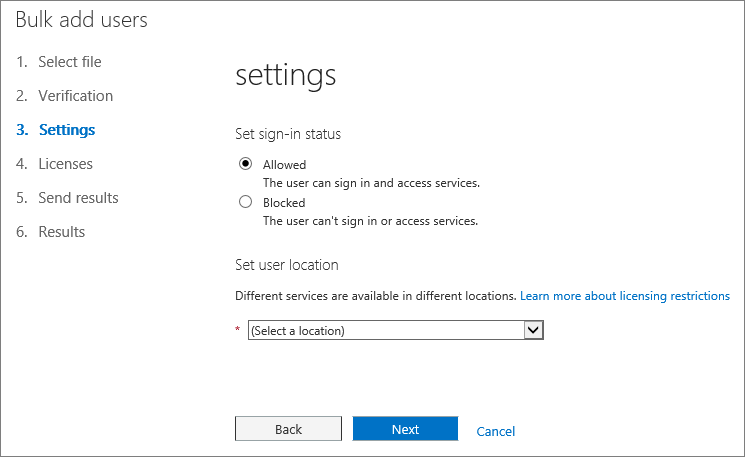
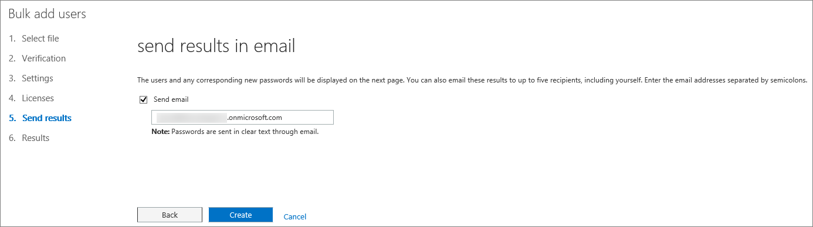
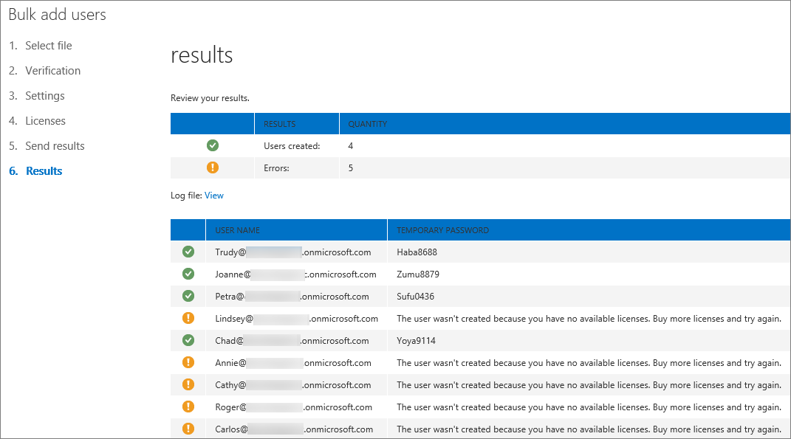

# <a name="add-several-users-at-the-same-time-to-office-365---admin-help"></a><span data-ttu-id="a7b09-105">Ajouter plusieurs utilisateurs simultanément à Office 365 - Aide aux administrateurs</span><span class="sxs-lookup"><span data-stu-id="a7b09-105">Add several users at the same time to Office 365 - Admin Help</span></span>

<span data-ttu-id="a7b09-p102">Un compte d’utilisateur a besoin de chaque personne de votre équipe avant de pouvoir se connecter et accéder aux services Office 365, tels que le courrier électronique et d’Office. Si vous avez un grand nombre de personnes, vous pouvez ajouter leurs comptes à la fois à partir d’une feuille de calcul Excel ou un autre fichier enregistré au format CSV. [Ne savez pas quel format CSV est ?](add-several-users-at-the-same-time.md#__toc316652088)</span><span class="sxs-lookup"><span data-stu-id="a7b09-p102">Each person on your team needs a user account before they can sign in and access Office 365 services, such as email and Office. If you have a lot of people, you can add their accounts all at once from an Excel spreadsheet or other file saved in CSV format. [Not sure what CSV format is?](add-several-users-at-the-same-time.md#__toc316652088)</span></span>
  
## <a name="add-multiple-users-to-office-365-in-the-office-365-admin-center"></a><span data-ttu-id="a7b09-109">Ajouter plusieurs utilisateurs à Office 365 dans le centre d’administration d’Office 365</span><span class="sxs-lookup"><span data-stu-id="a7b09-109">Add multiple users to Office 365 in the Office 365 admin center</span></span>

1. <span data-ttu-id="a7b09-110">Connectez-vous à Office 365 avec votre compte professionnel ou scolaire.</span><span class="sxs-lookup"><span data-stu-id="a7b09-110">Sign in to Office 365 with your work or school account.</span></span> 
    
2. <span data-ttu-id="a7b09-111">Dans le centre d’administration Office 365, choisissez **utilisateurs** \> **utilisateurs actifs**.</span><span class="sxs-lookup"><span data-stu-id="a7b09-111">In the Office 365 admin center, choose **Users** \> **Active users**.</span></span>
    
    
  
3. <span data-ttu-id="a7b09-113">Dans la **plus** liste déroulante, choisissez **importer plusieurs utilisateurs**.</span><span class="sxs-lookup"><span data-stu-id="a7b09-113">In the **More** drop-down, choose **Import multiple users**.</span></span>
    
4. <span data-ttu-id="a7b09-114">Dans le panneau **importer plusieurs utilisateurs** , vous pouvez éventuellement télécharger un exemple de fichier CSV avec ou sans données exemple renseignées.</span><span class="sxs-lookup"><span data-stu-id="a7b09-114">On the **Import multiple users** panel, you can optionally download a sample CSV file with or without sample data filled in.</span></span> 
    
    
  
    <span data-ttu-id="a7b09-116">Une feuille de calcul doit inclure les **en-têtes de colonne même exacte** que l’exemple 1 (nom d’utilisateur, prénom, etc....). Si vous utilisez le modèle, ouvrez-le dans un outil d’édition de texte, tel que le bloc-notes et prendre en compte en laissant toutes les données dans la ligne 1 décrire et saisie de données uniquement dans les lignes 2 et en dessous.</span><span class="sxs-lookup"><span data-stu-id="a7b09-116">Your spreadsheet needs to include the **exact same column headings** as the sample one (User Name, First Name, etc...). If you use the template, open it in a text editing tool, like Notepad, and consider leaving all the data in row 1 alone, and only entering data in rows 2 and below.</span></span> 
    
    <span data-ttu-id="a7b09-117">Une feuille de calcul doit également inclure des valeurs pour le nom d’utilisateur (par exemple, bob@contoso.com) et un nom d’affichage (par exemple, Bob Kelly) pour chaque utilisateur.</span><span class="sxs-lookup"><span data-stu-id="a7b09-117">Your spreadsheet also needs to include values for the user name (like bob@contoso.com) and a display name (like Bob Kelly) for each user.</span></span> 
    
  ```
  User Name,First Name,Last Name,Display Name,Job Title,Department,Office Number,Office Phone,Mobile Phone,Fax,Address,City,State or Province,ZIP or Postal Code,Country or Region
  chris@contoso.com,Chris,Green,Chris Green,IT Manager,Information Technology,123451,123-555-1211,123-555-6641,123-555-9821,1 Microsoft way,Redmond,Wa,98052,United States
  ben@contoso.com,Ben,Andrews,Ben Andrews,IT Manager,Information Technology,123452,123-555-1212,123-555-6642,123-555-9822,1 Microsoft way,Redmond,Wa,98052,United States
  david@contoso.com,David,Longmuir,David Longmuir,IT Manager,Information Technology,123453,123-555-1213,123-555-6643,123-555-9823,1 Microsoft way,Redmond,Wa,98052,United States
  cynthia@contoso.com,Cynthia,Carey,Cynthia Carey,IT Manager,Information Technology,123454,123-555-1214,123-555-6644,123-555-9824,1 Microsoft way,Redmond,Wa,98052,United States
  melissa@contoso.com,Melissa,MacBeth,Melissa MacBeth,IT Manager,Information Technology,123455,123-555-1215,123-555-6645,123-555-9825,1 Microsoft way,Redmond,Wa,98052,United States
  
  ```

5. <span data-ttu-id="a7b09-118">Entrez un chemin d’accès du fichier dans la zone, ou cliquez sur **Parcourir** pour accéder à l’emplacement de fichier CSV, puis cliquez sur **Vérifier**.</span><span class="sxs-lookup"><span data-stu-id="a7b09-118">Enter a file path into the box, or choose **Browse** to browse to the CSV file location, then choose **Verify**.</span></span>
    
    
  
    <span data-ttu-id="a7b09-p103">S’il existe des problèmes avec le fichier, le problème s’affiche dans le panneau de configuration. Vous pouvez également télécharger un fichier journal.</span><span class="sxs-lookup"><span data-stu-id="a7b09-p103">If there are problems with the file, the problem is displayed in the panel. You can also download a log file.</span></span>
    
6. <span data-ttu-id="a7b09-122">Dans la boîte de dialogue **définir les options de l’utilisateur** , vous pouvez définir le statut de connexion et choisissez la licence de produit qui est affectée à tous les utilisateurs.</span><span class="sxs-lookup"><span data-stu-id="a7b09-122">On the **Set user options** dialog you can set the sign-in status and choose the product license that will be assigned to all users.</span></span> 
    
7. <span data-ttu-id="a7b09-123">Dans la boîte de dialogue **Afficher les résultats** , vous pouvez choisir d’envoyer les résultats à vous-même ou autres utilisateurs (les mots de passe seront en texte brut) et vous pouvez voir combien d’utilisateurs ont été créés, et si vous devez acheter davantage de licences pour attribuer à certains des nouveaux utilisateurs.</span><span class="sxs-lookup"><span data-stu-id="a7b09-123">On the **View your result** dialog you can choose to send the results to either yourself or other users (passwords will be in plain text) and you can see how many users were created, and if you need to purchase more licenses to assign to some of the new users.</span></span> 
    
## <a name="watch-the-video"></a><span data-ttu-id="a7b09-124">Regarder la vidéo</span><span class="sxs-lookup"><span data-stu-id="a7b09-124">Watch the video</span></span>
<span data-ttu-id="a7b09-125"><a name="bk_preview"> </a></span><span class="sxs-lookup"><span data-stu-id="a7b09-125"></span></span>

 <span data-ttu-id="a7b09-126">Regardez une courte vidéo qui montre comment en bloc à ajouter des utilisateurs.</span><span class="sxs-lookup"><span data-stu-id="a7b09-126">Watch a short video that shows you how to bulk add users.</span></span> 
  
> [!VIDEO https://www.microsoft.com/videoplayer/embed/f4e7f161-8ae6-4264-a429-9297b539a8de?autoplay=false]
  
## <a name="next-steps"></a><span data-ttu-id="a7b09-127">Étapes suivantes</span><span class="sxs-lookup"><span data-stu-id="a7b09-127">Next steps</span></span>
<span data-ttu-id="a7b09-128"><a name="bk_preview"> </a></span><span class="sxs-lookup"><span data-stu-id="a7b09-128"></span></span>

- <span data-ttu-id="a7b09-p104">Maintenant que ces utilisateurs disposent de comptes, ils doivent [télécharger et installer ou réinstalle Office 365 ou 2016 Office sur un PC ou un Mac](https://support.office.com/article/4414eaaf-0478-48be-9c42-23adc4716658). Chaque personne de votre équipe permettre installer Office 365 sur jusqu'à 5 PC ou Mac.</span><span class="sxs-lookup"><span data-stu-id="a7b09-p104">Now that these people have accounts, they need to [Download and install or reinstall Office 365 or Office 2016 on a PC or Mac](https://support.office.com/article/4414eaaf-0478-48be-9c42-23adc4716658). Each person on your team can install Office 365 on up to 5 PCs or Macs.</span></span> 
    
- <span data-ttu-id="a7b09-p105">Chaque personne peut également [configurer les applications Office et de messagerie sur un appareil mobile](https://support.office.com/article/7dabb6cb-0046-40b6-81fe-767e0b1f014f) sur des 5 téléphones, tels que les iPhone, tablettes, téléphones Android et des tablettes et les tablettes jusqu'à 5. Ainsi, ils peuvent modifier des fichiers Office depuis n’importe où.</span><span class="sxs-lookup"><span data-stu-id="a7b09-p105">Each person can also [Set up Office apps and email on a mobile device](https://support.office.com/article/7dabb6cb-0046-40b6-81fe-767e0b1f014f) on up to 5 tablets and 5 phones, such as iPhones, iPads, and Android phones and tablets. This way they can edit Office files from anywhere.</span></span> 
    
    <span data-ttu-id="a7b09-133">Pour une liste de bout en bout des étapes d’installation, voir [configurer Office 365 pour entreprises](https://support.office.com/article/6a3a29a0-e616-4713-99d1-15eda62d04fa) .</span><span class="sxs-lookup"><span data-stu-id="a7b09-133">See [Set up Office 365 for business](https://support.office.com/article/6a3a29a0-e616-4713-99d1-15eda62d04fa) for an end-to-end list of the setup steps.</span></span> 
    
## <a name="more-information-about-how-to-add-users-to-office-365"></a><span data-ttu-id="a7b09-134">Plus d’informations sur la façon d’ajouter des utilisateurs à Office 365</span><span class="sxs-lookup"><span data-stu-id="a7b09-134">More information about how to add users to Office 365</span></span>
<span data-ttu-id="a7b09-135"><a name="bk_preview"> </a></span><span class="sxs-lookup"><span data-stu-id="a7b09-135"></span></span>

### <a name="not-sure-what-csv-format-is"></a><span data-ttu-id="a7b09-136">Ne savez pas quel format CSV est ?</span><span class="sxs-lookup"><span data-stu-id="a7b09-136">Not sure what CSV format is?</span></span>
<span data-ttu-id="a7b09-137"><a name="__toc316652088"> </a></span><span class="sxs-lookup"><span data-stu-id="a7b09-137"></span></span>

<span data-ttu-id="a7b09-p106">Un fichier CSV est un fichier de valeurs séparées par des virgules. Vous pouvez créer ou modifier un fichier similaire à celle-ci avec n’importe quel éditeur de texte ou d’un programme de feuille de calcul, telle qu’Excel.</span><span class="sxs-lookup"><span data-stu-id="a7b09-p106">A CSV file is a file with comma separated values. You can create or edit a file like this with any text editor or spreadsheet program, such as Excel.</span></span>
  
<span data-ttu-id="a7b09-p107">Vous pouvez télécharger [cette feuille de calcul exemple](https://www.microsoft.com/en-us/download/details.aspx?id=45485) comme point de départ. N’oubliez pas que Office 365 nécessite des en-têtes de colonne de la première ligne donc ne pas les remplacer par quelque chose d’autre.</span><span class="sxs-lookup"><span data-stu-id="a7b09-p107">You can download [this sample spreadsheet](https://www.microsoft.com/en-us/download/details.aspx?id=45485) as a starting point. Remember that Office 365 requires column headings in the first row so don't replace them with something else.</span></span> 
  
<span data-ttu-id="a7b09-142">Enregistrez le fichier sous un nouveau nom et spécifier le format CSV.</span><span class="sxs-lookup"><span data-stu-id="a7b09-142">Save the file with a new name, and specify CSV format.</span></span>
  

  
<span data-ttu-id="a7b09-p108">Lorsque vous enregistrez le fichier, vous aurez probablement une invite de commandes que certaines fonctionnalités de votre classeur seront perdues si vous enregistrez le fichier au format CSV. Il s’agit OK. Cliquez sur **Oui** pour continuer.</span><span class="sxs-lookup"><span data-stu-id="a7b09-p108">When you save the file, you'll probably get a prompt that some features in your workbook will be lost if you save the file in CSV format. This is okay. Click **Yes** to continue.</span></span> 
  

  
### <a name="tips-for-formatting-your-spreadsheet"></a><span data-ttu-id="a7b09-148">Conseils pour la mise en forme d’une feuille de calcul</span><span class="sxs-lookup"><span data-stu-id="a7b09-148">Tips for formatting your spreadsheet</span></span>
<span data-ttu-id="a7b09-149"><a name="__toc314595848"> </a></span><span class="sxs-lookup"><span data-stu-id="a7b09-149"></span></span>

- <span data-ttu-id="a7b09-p109">**dois-je les en-têtes de colonnes de même que dans la feuille de calcul exemple ?** Oui. La feuille de calcul exemple contient les en-têtes de colonne de la première ligne. Les rubriques suivantes sont nécessaires. Pour chaque utilisateur que vous souhaitez ajouter à Office 365, créez une ligne sous le titre. Si vous ajoutez, modifiez ou supprimez des en-têtes de colonne, Office 365 ne peuvent pas être en mesure de créer des utilisateurs à partir des informations dans le fichier.</span><span class="sxs-lookup"><span data-stu-id="a7b09-p109">**Do I need the same column headings as in the sample spreadsheet?** Yes. The sample spreadsheet contains column headings in the first row. These headings are required. For each user you want to add to Office 365, create a row under the heading. If you add, change, or delete any of the column headings, Office 365 might not be able to create users from the information in the file.</span></span> 
    
- <span data-ttu-id="a7b09-p110">**Que se passe-t-il si je n’ai pas toutes les informations requises pour chaque utilisateur ?** Le nom d’utilisateur et le nom d’affichage sont nécessaires, et vous ne pouvez pas ajouter un nouvel utilisateur sans ces informations. Si vous ne disposez pas des autres informations, telles que la télécopie, vous pouvez utiliser un espace et une virgule pour indiquer que le champ doit rester vide.</span><span class="sxs-lookup"><span data-stu-id="a7b09-p110">**What if I don't have all the information required for each user?** The user name and display name are required, and you cannot add a new user without this information. If you don't have some of the other information, such as the fax, you can use a space plus a comma to indicate that the field should remain blank.</span></span> 
    
- <span data-ttu-id="a7b09-p111">** Comment petites ou grandes peut être la feuille de calcul ? ** La feuille de calcul doit avoir au moins deux lignes. Une est pour les en-têtes de colonne (l’utilisateur colonne étiquette de données) et un pour l’utilisateur. Vous ne pouvez pas 251 plus de lignes. Si vous devez importer plus de 250 utilisateurs, vous pouvez créer plusieurs feuilles de calcul.</span><span class="sxs-lookup"><span data-stu-id="a7b09-p111">** How small or large can the spreadsheet be? ** The spreadsheet must have at least two rows. One is for the column headings (the user data column label) and one for the user. You cannot have more than 251 rows. If you need to import more than 250 users, you can create more than one spreadsheet.</span></span> 
    
- <span data-ttu-id="a7b09-p112">** Quelles langues puis-je utiliser ? ** Lorsque vous créez votre feuille de calcul, vous pouvez entrer des étiquettes de colonne de données utilisateur dans n’importe quel langage ou les caractères, mais vous ne devez pas modifier l’ordre des étiquettes, comme illustré dans l’exemple. Vous pouvez ensuite effectuer des entrées dans les champs, à l’aide de n’importe quel langage ou les caractères et enregistrer votre fichier au format UTF-8 ou Unicode.</span><span class="sxs-lookup"><span data-stu-id="a7b09-p112">** What languages can I use? ** When you create your spreadsheet, you can enter user data column labels in any language or characters, but you must not change the order of the labels, as shown in the sample. You can then make entries into the fields, using any language or characters, and save your file in a Unicode or UTF-8 format.</span></span> 
    
- <span data-ttu-id="a7b09-p113">**Que se passe-t-il si je suis Ajout d’utilisateurs à partir de différents pays ou régions ?** Créer une feuille de calcul séparée pour chaque zone. Vous devez parcourir la majeure partie Assistant Ajout d’utilisateurs le chaque feuille de calcul, en donnant à un seul emplacement de tous les utilisateurs inclus dans le fichier avec lequel vous travaillez.</span><span class="sxs-lookup"><span data-stu-id="a7b09-p113">**What if I'm adding users from different countries or regions?** Create a separate spreadsheet for each area. You'll need to step through the Bulk add users wizard which each spreadsheet, giving a single location of all users included in the file that you're working with.</span></span> 
    
- <span data-ttu-id="a7b09-p114">**y a-t-il une limite au nombre de caractères puis-je utiliser ?** Le tableau suivant indique les étiquettes de colonne de données utilisateur et le nombre maximal de caractères pour chaque feuille de calcul exemple.</span><span class="sxs-lookup"><span data-stu-id="a7b09-p114">**Is there a limit to the number of characters I can use?** The following table shows the user data column labels and the maximum character length for each in the sample spreadsheet.</span></span> 
    
|<span data-ttu-id="a7b09-172">**Étiquette de colonne de données utilisateur**</span><span class="sxs-lookup"><span data-stu-id="a7b09-172">**User data column label**</span></span>|<span data-ttu-id="a7b09-173">**Nombre maximal de caractères**</span><span class="sxs-lookup"><span data-stu-id="a7b09-173">**Maximum character length**</span></span>|
|:-----|:-----|
|<span data-ttu-id="a7b09-174">Nom d’utilisateur (obligatoire)</span><span class="sxs-lookup"><span data-stu-id="a7b09-174">User Name (Required)</span></span>  <br/> |<span data-ttu-id="a7b09-p115">79, y compris l’arobase (@), au format Name@Domain. \<extension\>. Alias de l’utilisateur ne peut pas dépasser 30 caractères et le nom de domaine ne peut pas dépasser 48 caractères.</span><span class="sxs-lookup"><span data-stu-id="a7b09-p115">79 including the at sign (@), in the format name@domain.\<extension\>. The user's alias cannot exceed 30 characters, and the domain name cannot exceed 48 characters.</span></span>  <br/> |
|<span data-ttu-id="a7b09-177">Prénom</span><span class="sxs-lookup"><span data-stu-id="a7b09-177">First Name</span></span>  <br/> |<span data-ttu-id="a7b09-178">64</span><span class="sxs-lookup"><span data-stu-id="a7b09-178">64</span></span>  <br/> |
|<span data-ttu-id="a7b09-179">Nom</span><span class="sxs-lookup"><span data-stu-id="a7b09-179">Last Name</span></span>  <br/> |<span data-ttu-id="a7b09-180">64</span><span class="sxs-lookup"><span data-stu-id="a7b09-180">64</span></span>  <br/> |
|<span data-ttu-id="a7b09-181">Nom complet (requis)</span><span class="sxs-lookup"><span data-stu-id="a7b09-181">Display Name (required)</span></span>  <br/> |<span data-ttu-id="a7b09-182">256</span><span class="sxs-lookup"><span data-stu-id="a7b09-182">256</span></span>  <br/> |
|<span data-ttu-id="a7b09-183">Fonction</span><span class="sxs-lookup"><span data-stu-id="a7b09-183">Job Title</span></span>  <br/> |<span data-ttu-id="a7b09-184">64</span><span class="sxs-lookup"><span data-stu-id="a7b09-184">64</span></span>  <br/> |
|<span data-ttu-id="a7b09-185">Service</span><span class="sxs-lookup"><span data-stu-id="a7b09-185">Department</span></span>  <br/> |<span data-ttu-id="a7b09-186">64</span><span class="sxs-lookup"><span data-stu-id="a7b09-186">64</span></span>  <br/> |
|<span data-ttu-id="a7b09-187">Numéro de bureau</span><span class="sxs-lookup"><span data-stu-id="a7b09-187">Office Number</span></span>  <br/> |<span data-ttu-id="a7b09-188">128</span><span class="sxs-lookup"><span data-stu-id="a7b09-188">128</span></span>  <br/> |
|<span data-ttu-id="a7b09-189">Téléphone (bureau)</span><span class="sxs-lookup"><span data-stu-id="a7b09-189">Office Phone</span></span>  <br/> |<span data-ttu-id="a7b09-190">64</span><span class="sxs-lookup"><span data-stu-id="a7b09-190">64</span></span>  <br/> |
|<span data-ttu-id="a7b09-191">Téléphone mobile</span><span class="sxs-lookup"><span data-stu-id="a7b09-191">Mobile Phone</span></span>  <br/> |<span data-ttu-id="a7b09-192">64</span><span class="sxs-lookup"><span data-stu-id="a7b09-192">64</span></span>  <br/> |
|<span data-ttu-id="a7b09-193">Télécopie</span><span class="sxs-lookup"><span data-stu-id="a7b09-193">Fax</span></span>  <br/> |<span data-ttu-id="a7b09-194">64</span><span class="sxs-lookup"><span data-stu-id="a7b09-194">64</span></span>  <br/> |
|<span data-ttu-id="a7b09-195">Adresse</span><span class="sxs-lookup"><span data-stu-id="a7b09-195">Address</span></span>  <br/> |<span data-ttu-id="a7b09-196">1023</span><span class="sxs-lookup"><span data-stu-id="a7b09-196">1023</span></span>  <br/> |
|<span data-ttu-id="a7b09-197">Ville</span><span class="sxs-lookup"><span data-stu-id="a7b09-197">City</span></span>  <br/> |<span data-ttu-id="a7b09-198">128</span><span class="sxs-lookup"><span data-stu-id="a7b09-198">128</span></span>  <br/> |
|<span data-ttu-id="a7b09-199">Département ou province</span><span class="sxs-lookup"><span data-stu-id="a7b09-199">State or Province</span></span>  <br/> |<span data-ttu-id="a7b09-200">128</span><span class="sxs-lookup"><span data-stu-id="a7b09-200">128</span></span>  <br/> |
|<span data-ttu-id="a7b09-201">ZIP ou le Code Postal</span><span class="sxs-lookup"><span data-stu-id="a7b09-201">ZIP or Postal Code</span></span>  <br/> |<span data-ttu-id="a7b09-202">40</span><span class="sxs-lookup"><span data-stu-id="a7b09-202">40</span></span>  <br/> |
|<span data-ttu-id="a7b09-203">Pays ou région</span><span class="sxs-lookup"><span data-stu-id="a7b09-203">Country or Region</span></span>  <br/> |<span data-ttu-id="a7b09-204">128</span><span class="sxs-lookup"><span data-stu-id="a7b09-204">128</span></span>  <br/> |
   
### <a name="still-having-problems-when-adding-users-to-office-365"></a><span data-ttu-id="a7b09-205">Vous rencontrez encore des problèmes lors de l’ajout d’utilisateurs à Office 365 ?</span><span class="sxs-lookup"><span data-stu-id="a7b09-205">Still having problems when adding users to Office 365?</span></span>

- <span data-ttu-id="a7b09-p116">**Vérifiez que la feuille de calcul est correctement formaté.** Vérifiez les en-têtes de colonne pour vous assurer qu’ils correspondent à ceux dans l’exemple de fichier. Assurez-vous que vous êtes suivant les règles de longueur et chaque champ séparé par une virgule.</span><span class="sxs-lookup"><span data-stu-id="a7b09-p116">**Double-check that the spreadsheet is formatted correctly.** Check the column headings to make sure they match the headings in the sample file. Make sure you're following the rules for character lengths and that each field is separated by a comma.</span></span> 
    
- <span data-ttu-id="a7b09-p117">** Si vous ne voyez pas immédiatement les nouveaux utilisateurs dans Office 365, patientez quelques minutes. ** Peut prendre un peu tandis que pour les modifications sur tous les services dans Office 365.</span><span class="sxs-lookup"><span data-stu-id="a7b09-p117">** If you don't see the new users in Office 365 right away, wait a few minutes. ** It can take a little while for changes to go across all the services in Office 365.</span></span> 
    
## <a name="add-multiple-users-to-office-365-in-the-old-office-365-admin-center"></a><span data-ttu-id="a7b09-211">Ajouter plusieurs utilisateurs à Office 365 dans le centre d’administration Office 365 anciens</span><span class="sxs-lookup"><span data-stu-id="a7b09-211">Add multiple users to Office 365 in the old Office 365 admin center</span></span>

1. <span data-ttu-id="a7b09-212">Télécharger [cette feuille de calcul d’exemple](https://www.microsoft.com/en-us/download/details.aspx?id=45485) et l’ouvrir dans Excel.</span><span class="sxs-lookup"><span data-stu-id="a7b09-212">Download [this sample spreadsheet](https://www.microsoft.com/en-us/download/details.aspx?id=45485) and open it in Excel.</span></span> 
    
    <span data-ttu-id="a7b09-213">Une feuille de calcul doit inclure les **en-têtes de colonne même exacte** que l’exemple 1 (nom d’utilisateur, prénom, etc....). Si vous utilisez le modèle, prenez en compte en laissant toutes les données dans la ligne 1 décrire et saisie de données uniquement dans les lignes 2 et en dessous.</span><span class="sxs-lookup"><span data-stu-id="a7b09-213">Your spreadsheet needs to include the **exact same column headings** as the sample one (User Name, First Name, etc...). If you use the template, consider leaving all the data in row 1 alone, and only entering data in rows 2 and below.</span></span> 
    
    <span data-ttu-id="a7b09-p118">Une feuille de calcul doit également inclure des valeurs pour le nom d’utilisateur (par exemple, bob@contoso.com) et un nom d’affichage (par exemple, Bob Kelly) pour chaque utilisateur. Pour laisser les autres champs vides, entrez un espace et une virgule dans le champ comme indiqué dans la figure suivante.</span><span class="sxs-lookup"><span data-stu-id="a7b09-p118">Your spreadsheet also needs to include values for the user name (like bob@contoso.com) and a display name (like Bob Kelly) for each user. To leave other fields blank, enter a space plus a comma in the field as shown in the following figure.</span></span> 
    
    
  
    <span data-ttu-id="a7b09-p119">Si vous avez des personnes travaillant dans différents pays, vous devez créer une feuille de calcul pour les utilisateurs dans chaque pays. Par exemple, une feuille de calcul qui répertorie tous les employés travaillant aux États-Unis et un autre qui répertorie tous les employés travaillant au Japon. Il s’agit, car la disponibilité des services Office 365 varie selon la région.</span><span class="sxs-lookup"><span data-stu-id="a7b09-p119">If you have people working in different countries, you'll need to create one spreadsheet for users in each country. For example, one spreadsheet that lists everyone who works in the US, and another that lists everyone who works in Japan. This is because the availability of Office 365 services varies by region.</span></span> 
    
    <span data-ttu-id="a7b09-p120">**Conseil :** Avant d’ajouter plusieurs utilisateurs vers Office 365, vous pouvez souhaiter pratique avec la feuille de calcul d’exemple. Par exemple, modifier la feuille de calcul exemple avec des données de certains de vos utilisateurs, par exemple 5 ou 10 et enregistrez le fichier sous un nouveau nom. Exécutez les étapes décrites dans cette procédure, vérifiez les résultats, puis supprimer les nouveaux comptes et recommencer. Ainsi, vous pouvez entraîner l’obtention de toutes le données directement à votre situation. Vérifiez également des [conseils pour la mise en forme d’une feuille de calcul](add-several-users-at-the-same-time.md#__toc314595848).</span><span class="sxs-lookup"><span data-stu-id="a7b09-p120">**Tip:** Before you add many users to Office 365, you might want to practice with the sample spreadsheet. For example, edit the sample spreadsheet with data for a few of your users, say 5 or 10, and save the file with a new name. Run through steps described in this procedure, check the results, and then delete the new accounts and start over again. This way you can practice getting all of the data right for your situation. Also check out [Tips for formatting your spreadsheet](add-several-users-at-the-same-time.md#__toc314595848).</span></span>
    
2. <span data-ttu-id="a7b09-225">Connectez-vous à Office 365 avec votre compte professionnel ou scolaire.</span><span class="sxs-lookup"><span data-stu-id="a7b09-225">Sign in to Office 365 with your work or school account.</span></span> 
    
3. <span data-ttu-id="a7b09-226">Accédez au Centre d’administration Office 365.</span><span class="sxs-lookup"><span data-stu-id="a7b09-226">Go to the Office 365 admin center.</span></span>
    
4. <span data-ttu-id="a7b09-p121">Pour les personnes à utiliser les services Office 365, ils doivent être attribué une licence. Avant de continuer, vous pouvez souhaiter vérifier que vous disposez de suffisamment de licences pour tout le monde répertoriées dans une feuille de calcul. Choisissez la **facturation** \> **abonnements** pour voir si vous disposez de suffisamment. Si vous devez acheter des licences supplémentaires, choisissez ** Modifier le nombre de licences **. Ou bien, vous pouvez exécuter l’Assistant et attribuer les licences que vous avez, puis achetez des licences supplémentaires plus loin et réexécutez l’Assistant.</span><span class="sxs-lookup"><span data-stu-id="a7b09-p121">For people to use Office 365 services, they need to be assigned a license. Before continuing, you might want to check that you have enough licenses for everyone listed in your spreadsheet. Choose **Billing** \> **Subscriptions** to see if you have enough. If you need to buy more licenses, choose ** Change license quantity **. Or, you can run the wizard and assign the licenses you have, then buy more licenses later and rerun the wizard.</span></span> 
    
5. <span data-ttu-id="a7b09-p122">Accédez à la majeure partie Assistant Ajout d’utilisateurs à présent : choisir **les utilisateurs** \> **Utilisateurs actifs**. Choisissez  comme le montre la figure suivante.</span><span class="sxs-lookup"><span data-stu-id="a7b09-p122">Now go to the Bulk add users wizard: choose **Users** \> **Active Users**. Choose  as shown in the following figure.</span></span> 
    
    
  
    <span data-ttu-id="a7b09-235">La majeure partie ajouter des utilisateurs Assistant s’affiche et vous guide à travers l’ajout d’un groupe d’utilisateurs vers Office 365.</span><span class="sxs-lookup"><span data-stu-id="a7b09-235">The Bulk add users wizard appears and steps you through adding a group of users to Office 365.</span></span> 
    
6. <span data-ttu-id="a7b09-236">À l’étape 1 : sélectionner un fichier CSV, spécifiez votre propre feuille de calcul, comme le montre la figure suivante.</span><span class="sxs-lookup"><span data-stu-id="a7b09-236">In Step 1 - Select a CSV file, specify your own spreadsheet as shown in the following figure.</span></span>
    
    
  
7. <span data-ttu-id="a7b09-238">À l’étape 2 : vérification, l’Assistant vous indique si le contenu de la feuille de calcul est correctement mis en forme.</span><span class="sxs-lookup"><span data-stu-id="a7b09-238">In Step 2 - Verification, the wizard tells you whether the content in the spreadsheet is formatted correctly.</span></span>
    
    
  
8. <span data-ttu-id="a7b09-p123">À l’étape 3 - paramètres, choisissez **autorisé** afin que les personnes figurant dans votre feuille de calcul sera en mesure d’utiliser Office 365. Également choisir le pays dans lequel ces personnes utiliseront Office 365. N’oubliez pas si certaines personnes de votre organisation doivent utiliser Office 365 dans un autre pays, de créer une feuille de calcul séparée avec leurs noms et exécuter la majeure partie Assistant Ajout d’utilisateurs afin de les ajouter.</span><span class="sxs-lookup"><span data-stu-id="a7b09-p123">In Step 3 - Settings, choose **Allowed** so that the people listed in your spreadsheet will be able to use Office 365. Also choose the country in which these people will use Office 365. Remember if some people in your organization are going to use Office 365 in a different country, create a separate spreadsheet with their names and run the Bulk add users wizard again to add them.</span></span> 
    
    
  
9. <span data-ttu-id="a7b09-244">La page attribuer des licences vous indique le nombre de licences disponible.</span><span class="sxs-lookup"><span data-stu-id="a7b09-244">The assign licenses page tells you how many licenses are available.</span></span> 
    
    
  
    <span data-ttu-id="a7b09-p124">Vous pouvez choisir **d’acheter des licences supplémentaires**, mais laissez la majeure partie Assistant Ajout d’utilisateurs et accédez à la **facturation** dans le centre d’administration d’Office 365. Après avoir acheté des licences, vous devrez attendre quelques minutes pour l’ordre de traitement et puis démarrer la majeure partie Assistant Ajout d’utilisateurs à partir du début.</span><span class="sxs-lookup"><span data-stu-id="a7b09-p124">You can choose **Buy more licenses**, but you'll leave the Bulk add users wizard and go to **Billing** in the Office 365 admin center. After buying more licenses, you'll have to wait a few minutes for the order to be processed and then start the Bulk add users wizard from the beginning.</span></span> 
    
    <span data-ttu-id="a7b09-248">Si vous n’achetez davantage de licences, les comptes ne sont pas créés pour toutes les entrées dans une feuille de calcul.</span><span class="sxs-lookup"><span data-stu-id="a7b09-248">If you don't buy more licenses, accounts won't be created for everyone listed in your spreadsheet.</span></span> 
    
    <span data-ttu-id="a7b09-249">Dans cet exemple, nous ne pas acheter des licences supplémentaires et poursuivre la majeure partie Assistant Ajout d’utilisateurs.</span><span class="sxs-lookup"><span data-stu-id="a7b09-249">In this example, we don't buy any more licenses and continue with the Bulk add users wizard.</span></span>
    
10. <span data-ttu-id="a7b09-250">À l’étape 5 : envoyer les résultats, tapez les adresses de messagerie des personnes que vous souhaitez obtenir un message électronique qui répertorie *tous les* mots de passe temporaire et noms d’utilisateur Office 365 pour les personnes figurant dans la feuille de calcul.</span><span class="sxs-lookup"><span data-stu-id="a7b09-250">In Step 5 - Send Results, type the email addresses of the people who you want to get an email that lists  *all*  of the Office 365 user names and temporary passwords for the people in the spreadsheet.</span></span> 
    
    
  
    <span data-ttu-id="a7b09-p125">Le message électronique suivant est envoyé à toutes les adresses de messagerie que vous avez spécifié à l’étape 5 - envoyer des résultats. Ce message indique que les comptes qui ont été créées. Notez que les comptes n’ont pas été créés pour certaines personnes, car il n’ont pas été suffisamment de licences.</span><span class="sxs-lookup"><span data-stu-id="a7b09-p125">The following email is sent to all the email addresses you specified in Step 5 - Send results. This email indicates which accounts were created. Notice that accounts weren't created for some people because there weren't enough licenses.</span></span> 
    
    
  
    <span data-ttu-id="a7b09-p126">Vous pouvez acheter plusieurs licences ultérieurement et réexécuter la majeure partie ajouter Assistant d’utilisateurs avec la même feuille de calcul. L’Assistant ignore les utilisateurs ayant déjà des comptes ; l’état des résultats, elle indique « nom d’utilisateur en double » pour indiquer la personne possédant déjà ces informations dispose d’un compte.</span><span class="sxs-lookup"><span data-stu-id="a7b09-p126">You can buy more licenses later and rerun the Bulk add users wizard with the same spreadsheet. The wizard skips over the users that already have accounts; on the results report, it will say "duplicate user name" to indicate someone with that information already has an account.</span></span>
    
11. <span data-ttu-id="a7b09-258">La page finale dans la majeure partie ajouter Assistant utilisateurs répertorie les noms d’utilisateur et mots de passe temporaires, comme le montre la figure suivante.</span><span class="sxs-lookup"><span data-stu-id="a7b09-258">The final page in the Bulk add users wizard lists the user names and temporary passwords, as shown in the following figure.</span></span>
    
    
  
12. <span data-ttu-id="a7b09-p127">Une fois que vous avez ajouté des utilisateurs vers Office 365, vous devez les informer leurs informations de compte Office 365. Utilisez votre processus normal pour communiquer les nouveaux mots de passe.</span><span class="sxs-lookup"><span data-stu-id="a7b09-p127">After you've added users to Office 365, you need to tell them about their Office 365 account information. Use your normal process for communicating new passwords.</span></span>
    

