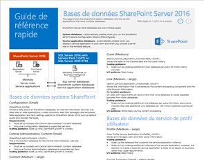
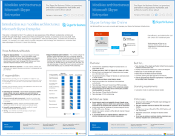
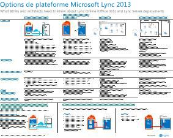
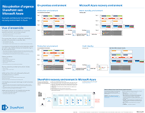

# Modèles architecturaux pour SharePoint, Exchange, Skype Entreprise et Lync

 **Résumé :** Obtenir les posters de l’informatique qui décrivent les modèles architecturaux, déploiement et les options de plate-forme pour SharePoint, Exchange, Skype pour les entreprises et Lync.
  
Ces affiches décrivent les modèles architecturaux et les options de déploiement de SharePoint, Exchange, Skype Entreprise et Lync, et fournissent des informations de conception pour le déploiement de SharePoint dans Microsoft Azure.
  
Avec Office 365, vous pouvez fournir les services de collaboration et de communication que vos utilisateurs connaissent sous la forme d’un service en nuage. À quelques exceptions près, l’expérience utilisateur reste la même si vous la maintenance d’un déploiement sur site ou à l’aide d’Office 365. Cette expérience utilisateur unifié, ce qui la rend beaucoup moins simples déterminer où placer chaque charge de travail et soulève des questions telles que :
  
- Comment déterminer l’option de plateforme à utiliser pour les charges de travail individuelles ?
    
- Est-il judicieux de conserver tous les services en local ?
    
- Dans quel scénario un déploiement hybride est-il approprié ?
    
- Comment Microsoft Azure ne tient pas dans l’image ?
    
- Quelles sont les configurations prises en charge pour les charges de travail d’Office Server dans Azure ?
    
> [!TIP]
> La plupart des affiches sur cette page sont disponibles dans plusieurs langues, notamment en chinois, anglais, français, allemand, italien, japonais, coréen, portugais, russe et espagnol. Pour télécharger une affiche dans l'une de ces langues, cliquez sur le lien **Plus de langues** correspondant à cette affiche.
  
Faites-nous savoir ce que vous en pensez ! Envoyez-nous des courriers électroniques à l’adresse [cloudadopt@microsoft.com](mailto:cloudadopt@microsoft.com). 
  
Cette page renvoie aux affiches suivantes :
  
- **Architecture modèles d’affiches** Vous pouvez utiliser ces ressources pour déterminer votre plate-forme idéale et la configuration de SharePoint 2016 et Skype pour entreprise 2015.
    
  - [Modèles architecturaux de Microsoft SharePoint 2016](architectural-models-for-sharepoint-exchange-skype-for-business-and-lync.md#SP2016_ArchModel)
    
  - [Aperçu de multi-Geo pour OneDrive dans Office 365](architectural-models-for-sharepoint-exchange-skype-for-business-and-lync.md#MultiGeoO365ODB)
    
  - [Bases de données SharePoint Server 2016](architectural-models-for-sharepoint-exchange-skype-for-business-and-lync.md#SP2016_Databases)
    
  - [Skype Microsoft pour Business 2015 des modèles architecturaux](architectural-models-for-sharepoint-exchange-skype-for-business-and-lync.md#SfB2015_ArchModel)
    
- **Affiches d’options de plate-forme** Vous pouvez utiliser ces ressources pour déterminer votre plate-forme idéale et la configuration de SharePoint 2013, Exchange 2013 et Lync 2013.
    
  - [Options de plate-forme SharePoint 2013](architectural-models-for-sharepoint-exchange-skype-for-business-and-lync.md#SP2013_Options)
    
  - [Options de plate-forme Exchange 2013](architectural-models-for-sharepoint-exchange-skype-for-business-and-lync.md#Exch2013_options)
    
  - [Options de plate-forme Lync 2013](architectural-models-for-sharepoint-exchange-skype-for-business-and-lync.md#Lync2013_Options)
    
- **SharePoint Server 2013 dans les posters de solutions Azure** Vous pouvez utiliser ces affiches informatique afin de déterminer la conception et la configuration de SharePoint Server 2013 de charges de travail dans les services d’infrastructure Azure.
    
  - [Sites Internet de Microsoft Azure à l’aide de SharePoint Server 2013](architectural-models-for-sharepoint-exchange-skype-for-business-and-lync.md#Azure_sharepoint2013)
    
  - [Exemple de conception : sites Internet de Microsoft Azure pour SharePoint 2013](architectural-models-for-sharepoint-exchange-skype-for-business-and-lync.md#DesignSampleInternetSites)
    
  - [Récupération d’urgence de SharePoint Microsoft Azure](architectural-models-for-sharepoint-exchange-skype-for-business-and-lync.md#sharepoint_recovery_Azure)
    
## Affiches des modèles architecturaux

Ces nouvelles affiches de systèmes informatiques pour SharePoint 2016 et Skype Entreprise 2015 permettent de comparer les différentes méthodes de déploiement dans un format facile à imprimer. Chaque affiche fournit une liste de toutes les configurations ou options de plateforme disponibles et vous donne les informations suivantes pour chaque option :
  
- **Vue d’ensemble** Un bref résumé de la plate-forme, y compris un diagramme conceptuel.
    
- **Meilleure pour** Scénarios courants qui sont parfaitement adaptées à la plate-forme.
    
- **Conditions de licence** Les licences que vous avez besoin pour le déploiement.
    
- **Tâches de l’architecture** Les décisions que vous devez faire en tant qu’architecte.
    
- **Professionnels de l’informatique des tâches ou des responsabilités** Les responsabilités quotidiennes que votre personnel informatique doit planifier.
    
### Modèles architecturaux Microsoft SharePoint 2016

|**Élément**|**Description**|
|:-----|:-----|
|[          ](https://www.microsoft.com/download/details.aspx?id=52650)   [PDF](https://download.microsoft.com/download/4/F/A/4FA0F94B-EE2F-41DB-A047-D9864FEF41E9/SharePoint2016ArchitecturalModels.pdf)  \| [Visio](https://download.microsoft.com/download/4/F/A/4FA0F94B-EE2F-41DB-A047-D9864FEF41E9/SharePoint2016ArchitecturalModels.vsdx)  \| [Plus de langues](https://www.microsoft.com/download/details.aspx?id=52650)   | Cette affiche décrit les configurations locales SharePoint Online, Microsoft Azure et SharePoint que les décideurs et les concepteurs de solutions dans les entreprises doivent connaître.    - **SharePoint Online (SaaS)** - SharePoint de consommer via un logiciel en tant que Service (SaaS) abonnement modèle.   - **Hybride de SharePoint** - déplacer vos sites SharePoint et les applications dans le nuage à votre propre rythme.   - **SharePoint dans Azure (IaaS)** - étendre votre environnement local dans Microsoft Azure et de déployer les serveurs SharePoint 2016 il. (Cela est recommandé pour les environnements haute disponibilité/récupération d’urgence et de développement/test).  - **SharePoint sur site** - vous planifier, déployer, gérer et personnaliser votre environnement SharePoint dans un centre de données que vous gérez.   |
   
### Aperçu de multi-Geo pour OneDrive dans Office 365

|**Élément**|**Description**|
|:-----|:-----|
|[          ](http://download.microsoft.com/download/0/5/9/0594634F-7893-4201-938A-C2FF2F21B655/Multi-Geo-ODB.pdf)   [PDF](http://download.microsoft.com/download/0/5/9/0594634F-7893-4201-938A-C2FF2F21B655/Multi-Geo-ODB.pdf)  \| [Visio](http://download.microsoft.com/download/0/5/9/0594634F-7893-4201-938A-C2FF2F21B655/Multi-Geo-ODB.vsdx)   | Ce modèle est une vue d’ensemble d’une page de OneDrive Multi-Geo dans Office 365, qui est en cours d’aperçu privé. Ce modèle inclut :   -Avantages   -Les étapes de déploiement   -Un exemple de configuration     Pour plus d’informations sur l’aperçu de Multi-Geo pour OneDrive dans Office 365, cliquez [ici](https://aka.ms/onedrivemultigeo).    |
   
### Bases de données SharePoint Server 2016

|**Élément**|**Description**|
|:-----|:-----|
|[          ](https://www.microsoft.com/download/details.aspx?id=55041)   [PDF](https://download.microsoft.com/download/D/5/D/D5DC1121-8BC5-4953-834F-1B5BB03EB691/DBrefguideSPS2016_tabloid.pdf)  \| [Visio](https://download.microsoft.com/download/D/5/D/D5DC1121-8BC5-4953-834F-1B5BB03EB691/DBrefguideSPS2016_tabloid.vsdx)  \| [Plus de langues](https://www.microsoft.com/download/details.aspx?id=55041)   | Cette affiche informatique est un guide de référence rapide pour les bases de données SharePoint Server 2016. Chaque base de données comporte les informations suivantes :   -Taille   -Guide mise à l’échelle   -Les modèles e/s   -Configuration requise     La première page contient des bases de données système SharePoint et les applications de service qui ont plusieurs bases de données. La seconde page affiche toutes les applications de service qui ont des bases de données individuelles.    Pour plus d’informations sur les bases de données SharePoint Server 2016, consultez [types de base de données et de descriptions dans SharePoint Server 2016](https://technet.microsoft.com/en-us/library/cc678868%28v=office.16%29.aspx)   |
   
### Modèles architecturaux Microsoft Skype Entreprise 2015

|**Élément**|**Description**|
|:-----|:-----|
|[          ](https://www.microsoft.com/download/details.aspx?id=55022)   [PDF](https://download.microsoft.com/download/7/7/4/7741262C-A60D-41F7-863B-99BF5964FBFE/Skype%20for%20Business%20Architectural%20Models.pdf)  \| [Visio](https://download.microsoft.com/download/7/7/4/7741262C-A60D-41F7-863B-99BF5964FBFE/Skype%20for%20Business%20Architectural%20Models.vsd)  \| [Plus de langues](https://www.microsoft.com/download/details.aspx?id=55022)   |Ce poster décrit le Skype pour professionnels en ligne, sur site, hybride, nuage PBX et l’intégration avec les configurations Exchange et SharePoint que les décideurs et les architectes de solutions doivent savoir sur.    Il est destiné à l’assistance de professionnels de l’informatique à sensibiliser les différents modèles d’architecturales fondamentales qui peuvent être consommés Skype pour Business Online et Skype pour les entreprises dans les locaux.   Démarrer avec quelle configuration les adaptée aux besoins de votre organisation et les plans futurs. Prendre en compte et utilisez d’autres selon vos besoins. Par exemple, vous pouvez souhaiter intégration avec Exchange et SharePoint ou une solution qui tire parti de l’offre de Microsoft Cloud PBX.    |
   
## Affiches des options de plateforme

Ces affiches pour SharePoint 2013, Exchange  2013 et Lync 2013 permettent de comparer les différentes méthodes de déploiement en un clin d’œil et en grand format. Chaque affiche fournit une liste de toutes les configurations ou options de plateforme disponibles et vous donne les informations suivantes pour chaque option :
  
- **Vue d’ensemble** Un bref résumé de la plate-forme, y compris un diagramme conceptuel.
    
- **Meilleure pour** Scénarios courants qui sont parfaitement adaptées à la plate-forme.
    
- **Conditions de licence** Les licences que vous avez besoin pour le déploiement.
    
- **Tâches de l’architecture** Les décisions que vous devez faire en tant qu’architecte.
    
- **Professionnels de l’informatique des tâches ou des responsabilités** Les responsabilités quotidiennes que votre personnel informatique doit planifier.
    
## Options de plateforme SharePoint 2013

****

|**Élément**|**Description**|
|:-----|:-----|
|[          ](https://www.microsoft.com/download/details.aspx?id=40332)   [PDF](http://go.microsoft.com/fwlink/p/?LinkId=324594)  \| [Visio](https://go.microsoft.com/fwlink/p/?LinkId=324593)  \| [Plus de langues](https://www.microsoft.com/download/details.aspx?id=40332)   |Pour les architectes et les décideurs d’entreprise (BDM), ce modèle illustre les options de plate-forme pour SharePoint 2013, SharePoint dans Office 365, hybride sur site avec Office 365, Azure et les déploiements sur site d’uniquement. Il inclut une vue d’ensemble de chaque architecture, recommandations, des conditions de licence et des listes d’architecte et tâches IT Pro pour chaque plate-forme. Plusieurs solutions SharePoint sur Azure sont mis en surbrillance.  Pour une version texte accessible de ce poster, consultez [le diagramme Accessible - Options de plate-forme Microsoft SharePoint 2013](accessible-diagrammicrosoft-sharepoint-2013-platform-options.md).    |
   
## Options de plateforme Exchange 2013

****

|**Élément**|**Description**|
|:-----|:-----|
|[          ](https://www.microsoft.com/download/details.aspx?id=42676)   [PDF](https://go.microsoft.com/fwlink/p/?LinkID=398740)  \| [Visio](https://go.microsoft.com/fwlink/p/?LinkID=398742)  \| [Plus de langues](https://www.microsoft.com/download/details.aspx?id=42676)   |Pour les architectes et les décideurs, ce modèle décrit les options de plate-forme disponible pour Exchange 2013. Les clients peuvent choisir à partir d’Exchange en ligne avec Office 365, hybride, Exchange Server sur site et Exchange hébergeant Exchange. L’affiche inclut les détails de chaque option architecturale, y compris les scénarios plus idéales pour chacun, les exigences de licence et les responsabilités de professionnels de l’informatique.  Pour une version texte accessible de ce poster, consultez [le diagramme Accessible - Options de plate-forme Microsoft Exchange 2013](accessible-diagrammicrosoft-exchange-2013-platform-options.md).    |
   
## Options de plateforme Lync 2013

****

|**Élément**|**Description**|
|:-----|:-----|
|[          ](https://www.microsoft.com/download/details.aspx?id=41677)   [PDF](https://go.microsoft.com/fwlink/p/?LinkID=391837)  \| [Visio](https://go.microsoft.com/fwlink/p/?LinkID=391839)  \| [Plus de langues](https://www.microsoft.com/download/details.aspx?id=41677)   |Pour les décideurs d’entreprise (BDM) et les architectes, ce modèle décrit les options de plateforme disponibles pour Lync 2013. Les clients peuvent choisir entre Lync Online avec Office 365, Lync hybride, Lync Server local et Lync hébergé. L’affiche inclut les détails de chaque option d’architecture, y compris les scénarios idéaux pour chacune, les exigences de licence et les responsabilités des professionnels de l’informatique.    |
   
## Affiches des solutions SharePoint dans Azure

Ces affiches informatique affichent Azure-des solutions à l’aide de SharePoint Server 2013 dans un format grand poster.
  
### Sites Internet dans Microsoft Azure utilisant SharePoint Server 2013

****

|**Élément**|**Description**|
|:-----|:-----|
|[          ](https://www.microsoft.com/download/details.aspx?id=41992)   [PDF](https://go.microsoft.com/fwlink/p/?LinkId=392552)  \| [Visio](https://go.microsoft.com/fwlink/p/?LinkId=392551)  \| [Plus de langues](https://www.microsoft.com/download/details.aspx?id=41992)   |Ce poster présente les activités de conception clé et recommandé des choix d’architecture pour des sites pour Internet dans Azure. Pour obtenir une version texte accessible de ce poster, consultez le [diagramme Accessible - sites Internet de Microsoft Azure pour SharePoint 2013](accessible-diagraminternet-sites-in-microsoft-azure-for-sharepoint-2013.md).   Pour plus d’informations, voir les articles suivants :     - [Sites Internet de Microsoft Azure à l’aide de SharePoint Server 2013](internet-sites-in-microsoft-azure-using-sharepoint-server-2013.md)   - [Architectures de Microsoft Azure pour SharePoint 2013](microsoft-azure-architectures-for-sharepoint-2013.md)   - [À l’aide de Microsoft Azure Active Directory pour l’authentification de SharePoint 2013](using-microsoft-azure-active-directory-for-sharepoint-2013-authentication.md)   |
   
### Exemple de conception : sites Internet dans Microsoft Azure pour SharePoint 2013

****

|**Élément**|**Description**|
|:-----|:-----|
|[          ](https://www.microsoft.com/download/details.aspx?id=41991)   [PDF](https://go.microsoft.com/fwlink/p/?LinkId=392549)  \| [Visio](https://go.microsoft.com/fwlink/p/?LinkId=392548)  \| [Plus de langues](https://www.microsoft.com/download/details.aspx?id=41991)   |Utilisez cet exemple de conception comme point de départ pour votre propre site de côté Internet architecture dans Azure à l’aide de SharePoint Server 2013. Pour obtenir une version texte accessible de cette affiche, reportez-vous à la section [diagramme Accessible - exemple de conception : sites Internet de Microsoft Azure pour SharePoint 2013](accessible-diagramdesign-sample-internet-sites-in-microsoft-azure-for-sharepoint.md).   Pour plus d’informations, voir les articles suivants :     - [Sites Internet de Microsoft Azure à l’aide de SharePoint Server 2013](internet-sites-in-microsoft-azure-using-sharepoint-server-2013.md)   - [Architectures de Microsoft Azure pour SharePoint 2013](microsoft-azure-architectures-for-sharepoint-2013.md)   - [À l’aide de Microsoft Azure Active Directory pour l’authentification de SharePoint 2013](using-microsoft-azure-active-directory-for-sharepoint-2013-authentication.md)   |
   
### Récupération d’urgence SharePoint vers Microsoft Azure

****

|**Élément**|**Description**|
|:-----|:-----|
|[          ](https://www.microsoft.com/download/details.aspx?id=41993)   [PDF](https://go.microsoft.com/fwlink/p/?LinkId=392555)  \| [Visio](https://go.microsoft.com/fwlink/p/?LinkId=392554)  \| [Plus de langues](https://www.microsoft.com/download/details.aspx?id=41993)   |Ce poster informatique illustre les principes d’architecture pour un environnement de reprise après sinistre dans Azure. Pour une version texte accessible de ce poster, consultez [le diagramme Accessible - récupération d’urgence SharePoint Microsoft Azure](accessible-diagramsharepoint-disaster-recovery-to-microsoft-azure.md).   Pour plus d’informations, voir les articles suivants :     - [Récupération d’urgence de SharePoint Server 2013 dans Microsoft Azure](sharepoint-server-2013-disaster-recovery-in-microsoft-azure.md)   - [Architectures de Microsoft Azure pour SharePoint 2013](microsoft-azure-architectures-for-sharepoint-2013.md)   |
   
## Voir aussi

[Adoption du cloud et solutions hybrides](cloud-adoption-and-hybrid-solutions.md)
  
[Ressources relatives à l'architecture informatique du cloud Microsoft](microsoft-cloud-it-architecture-resources.md)
  
[Guides de laboratoire de test d'adoption cloud](cloud-adoption-test-lab-guides-tlgs.md)
  
[Solutions hybrides](hybrid-solutions.md)

