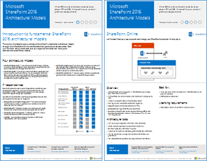
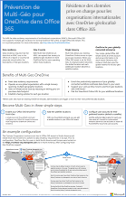
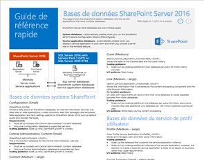
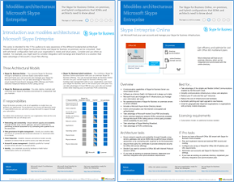
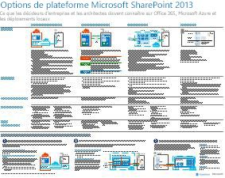
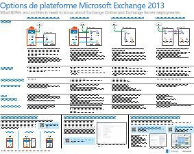
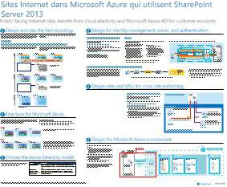
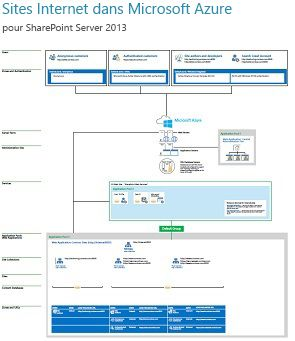

# Modèles architecturaux pour SharePoint, Exchange, Skype Entreprise et LyncArchitectural models for SharePoint, Exchange, Skype for Business, and Lync

 **Résumé :** Obtenez les affiches qui décrivent les modèles d’architecte, le déploiement et les options de plateforme de SharePoint, Exchange, Skype Entreprise et Lync.**Summary: ** Get the IT posters that describe the architectural models, deployment, and platform options for SharePoint, Exchange, Skype for Business, and Lync.
  
Ces affiches décrivent les modèles architecturaux et les options de déploiement de SharePoint, Exchange, Skype Entreprise et Lync, et fournissent des informations de conception pour le déploiement de SharePoint dans Microsoft Azure.These IT posters describe the architectural models and deployment options for SharePoint, Exchange, Skype for Business, and Lync, and they provide design information for deploying SharePoint in Microsoft Azure.
  
Avec Office 365, vous pouvez fournir aux utilisateurs les services de collaboration et de communication qu’ils connaissent sous forme de services cloud. À quelques exceptions près, l’expérience utilisateur reste la même, que vous gériez un déploiement en local ou que vous utilisiez Office 365. Cette expérience utilisateur unifiée complique quelque peu le choix d’emplacement de chaque charge de travail et soulève des questions telles que :With Union_Std_2nd, you can provide the collaboration and communication services your users are familiar with as a cloud-based service. With a few exceptions, the user experience remains the same whether you are maintaining an on-premises deployment or using Union_Std_2nd. This unified user experience makes it less straightforward to decide where to place each workload and raises questions such as:
  
- Comment déterminer l’option de plateforme à utiliser pour les charges de travail individuelles ?How do you determine which platform option to choose for your individual workloads?
    
- Est-il judicieux de conserver tous les services en local ?Does it make sense to keep any service on-premises?
    
- Dans quel scénario un déploiement hybride est-il approprié ?What is a scenario where a hybrid deployment is appropriate?
    
- Comment Microsoft Azure s’intègre-t-il ?How does Azure_1st fit in the picture?
    
- Quelles sont les configurations prises en charge pour les charges de travail d’Office Server dans Azure ?What are the supported configurations for Office Server workloads in Azure?
    
> [!TIP]
> La plupart des affiches sur cette page sont disponibles dans plusieurs langues, notamment en chinois, anglais, français, allemand, italien, japonais, coréen, portugais, russe et espagnol. Pour télécharger une affiche dans l’une de ces langues, cliquez sur le lien **Plus de langues** correspondant à cette affiche.Most of the posters on this page are available in multiple languages, including Chinese, English, French, German, Italian, Japanese, Korean, Portuguese, Russian, and Spanish. To download a poster in one of these languages, click the **More languages** link for that poster.
  
Faites-nous savoir ce que vous en pensez ! Écrivez-nous à l’adresse [cloudadopt@microsoft.com](mailto:cloudadopt@microsoft.com).Let us know what you think! Send us email at [cloudadopt@microsoft.com](mailto:cloudadopt@microsoft.com). 
  
Cette page renvoie aux affiches suivantes :This page links you to the following posters:
  
- **Affiches de modèles architecturaux** Vous pouvez utiliser ces ressources pour déterminer votre plate-forme et votre configuration idéales pour SharePoint 2016 et Skype Entreprise 2015.**Architectural models posters**   You can use these resources to determine your ideal platform and configuration for SharePoint 2016 and Skype for Business 2015.
    
  - [Modèles architecturaux Microsoft SharePoint 2016Microsoft SharePoint 2016 Architectural Models](architectural-models-for-sharepoint-exchange-skype-for-business-and-lync.md#SP2016_ArchModel)
    
  - [Fonctionnalités Multi-Géo dans OneDrive et SharePoint Online dans Office 365Multi-Geo Capabilities in OneDrive and SharePoint Online in Office 365](architectural-models-for-sharepoint-exchange-skype-for-business-and-lync.md#MultiGeoO365ODB)
    
  - [Bases de données SharePoint Server 2016SharePoint Server 2016 Databases](architectural-models-for-sharepoint-exchange-skype-for-business-and-lync.md#SP2016_Databases)
    
  - [Modèles architecturaux Microsoft Skype Entreprise 2015Microsoft Skype for Business 2015 Architectural Models](architectural-models-for-sharepoint-exchange-skype-for-business-and-lync.md#SfB2015_ArchModel)
    
- **Affiches des options de plateforme** Vous pouvez utiliser ces ressources pour déterminer votre plate-forme et votre configuration idéales pour SharePoint 2013, Exchange 2013 et Lync 2013.**Platform options posters**   You can use these resources to determine your ideal platform and configuration for SharePoint 2013, Exchange 2013, and Lync 2013.
    
  - [Options de plateforme SharePoint 2013SharePoint 2013 Platform Options](architectural-models-for-sharepoint-exchange-skype-for-business-and-lync.md#SP2013_Options)
    
  - [Options de plateforme Exchange 2013Exchange 2013 Platform Options](architectural-models-for-sharepoint-exchange-skype-for-business-and-lync.md#Exch2013_options)
    
  - [Options de plateforme Lync 2013Lync 2013 Platform Options](architectural-models-for-sharepoint-exchange-skype-for-business-and-lync.md#Lync2013_Options)
    
- **Affiches des solutions SharePoint Server 2013 dans Azure** Vous pouvez utiliser ces affiches pour déterminer la conception et la configuration des charges de travail SharePoint Server 2013 dans les services d’infrastructure Azure.**SharePoint in Azure solutions posters**   You can use these IT posters to determine the design and configuration for SharePoint workloads in Azure infrastructure services.
    
  - [Sites Internet dans Microsoft Azure qui utilisent SharePoint Server 2013Internet Sites in Microsoft Azure using SharePoint Server 2013](architectural-models-for-sharepoint-exchange-skype-for-business-and-lync.md#Azure_sharepoint2013)
    
  - [Exemple de conception : sites Internet dans Microsoft Azure pour SharePoint 2013Design sample: Internet sites in Microsoft Azure for SharePoint 2013](architectural-models-for-sharepoint-exchange-skype-for-business-and-lync.md#DesignSampleInternetSites)
    
  - [Récupération d’urgence SharePoint vers Microsoft AzureSharePoint Disaster Recovery to Microsoft Azure](architectural-models-for-sharepoint-exchange-skype-for-business-and-lync.md#sharepoint_recovery_Azure)
    
## Affiches des modèles architecturauxArchitectural models posters

Ces nouvelles affiches de systèmes informatiques pour SharePoint 2016 et Skype Entreprise 2015 permettent de comparer les différentes méthodes de déploiement dans un format facile à imprimer. Chaque affiche fournit une liste de toutes les configurations ou options de plateforme disponibles et vous donne les informations suivantes pour chaque option :These new IT posters for SharePoint 2016 and Skype for Business 2015 provide a way to compare the various deployment methods in an easy-to-print format. Each poster provides a list of all the configurations or platform options available and gives you the following information for each option:
  
- **Vue d’ensemble** Bref résumé de la plateforme, accompagné d’un diagramme conceptuel.**Overview**   A brief summary of the platform, including a conceptual diagram.
    
- **Recommandé pour** les scénarios courants qui conviennent à la plateforme en particulier.**Best for**   Common scenarios that are ideally suited for the particular platform.
    
- **Licences nécessaires** Licences dont vous avez besoin pour le déploiement.**License requirements**   The licenses you need for deployment.
    
- **Tâches d’architecture** Décisions que vous devez prendre en tant qu’architecte.**Architecture tasks**   The decisions you need to make as an architect.
    
- **Responsabilités ou tâches des professionnels de l’informatique** Les responsabilités quotidiennes que votre personnel informatique doit planifier.**IT Pro tasks or responsibilities**   The daily responsibilities that your IT staff needs to plan for.
    

### Modèles architecturaux Microsoft SharePoint 2016Microsoft SharePoint 2016 Architectural Models

|**Élément****Item**|**Description****Description**|
|:-----|:-----|
|[          ](https://www.microsoft.com/download/details.aspx?id=52650)   [PDF](https://download.microsoft.com/download/4/F/A/4FA0F94B-EE2F-41DB-A047-D9864FEF41E9/SharePoint2016ArchitecturalModels.pdf)  \| [Visio](https://download.microsoft.com/download/4/F/A/4FA0F94B-EE2F-41DB-A047-D9864FEF41E9/SharePoint2016ArchitecturalModels.vsdx) \| [Autres langues](https://www.microsoft.com/download/details.aspx?id=52650)[PDF](https://download.microsoft.com/download/4/F/A/4FA0F94B-EE2F-41DB-A047-D9864FEF41E9/SharePoint2016ArchitecturalModels.pdf)  \| [Visio](https://download.microsoft.com/download/4/F/A/4FA0F94B-EE2F-41DB-A047-D9864FEF41E9/SharePoint2016ArchitecturalModels.vsdx)  \| [More languages](https://www.microsoft.com/download/details.aspx?id=52650)   | Cette affiche décrit les configurations locales SharePoint Online, Microsoft Azure et SharePoint que les décideurs et les concepteurs de solutions dans les entreprises doivent connaître.This IT poster describes the SharePoint Online, Microsoft Azure, and SharePoint on-premises configurations that business decision makers and solutions architects need to know about.    - **SharePoint Online (SaaS)**: vous utilisez SharePoint via un modèle d’abonnement Software as a Service (SaaS).SharePoint Online (SaaS) –  Consume SharePoint through a Software as a Service (SaaS) subscription model.   - **SharePoint Hybride** : vous déplacez vos sites et applications SharePoint dans le cloud à votre rythme.SharePoint Hybrid - Move your SharePoint sites and apps to the cloud at your own pace.   - **SharePoint dans Azure (IaaS)**  : vous étendez votre environnement local dans Microsoft Azure et vous déployez les serveurs SharePoint 2016 à cet emplacement (recommandé pour les environnements de test/développement et de haute disponibilité/récupération d’urgence).SharePoint in Azure (IaaS) - You extend your on-premises environment into Microsoft Azure and deploy SharePoint 2016 Servers there. (This is recommended for High Availability/Disaster Recovery and dev/test environments.)  - **SharePoint en local** : vous planifiez, déployez, gérez et personnalisez votre environnement SharePoint dans un centre de données que vous gérez.SharePoint On-premises - You plan, deploy, maintain and customize your SharePoint environment in a datacenter that you maintain.   |
   

### Fonctionnalités Multi-Géo dans OneDrive et SharePoint Online dans Office 365Multi-Geo Capabilities in OneDrive and SharePoint Online in Office 365

|**Élément****Item**|**Description****Description**|
|:-----|:-----|
|   [PDF](https://github.com/MicrosoftDocs/OfficeDocs-Enterprise/raw/live/Enterprise/media/Multi-Geo-ODB.pdf)  \| [Visio](https://github.com/MicrosoftDocs/OfficeDocs-Enterprise/raw/live/Enterprise/media/Multi-Geo-ODB.vsdx)[PDF](https://github.com/MicrosoftDocs/OfficeDocs-Enterprise/raw/live/Enterprise/media/Multi-Geo-ODB.pdf)  \| [Visio](https://github.com/MicrosoftDocs/OfficeDocs-Enterprise/raw/live/Enterprise/media/Multi-Geo-ODB.vsdx)   | Ce poster constitue une vue d’ensemble d’une page de fonctionnalités géo multiple dans OneDrive et SharePoint Online dans Office 365. Ce modèle inclut : This poster is a one-page overview of Multi-Geo Capabilities in OneDrive and SharePoint Online in Office 365. This model includes:    - Avantages- Benefits   - Étapes de déploiement- Steps for deployment   - Un exemple de configuration- An example configuration     Pour plus d’informations sur les fonctionnalités de géo multiple dans OneDrive et SharePoint Online dans Office 365, cliquez [ici](https://aka.ms/onedrivemultigeo).For more information about Multi-Geo Capabilities in OneDrive and SharePoint Online in Office 365, click [here](https://aka.ms/onedrivemultigeo).    |
   

### Bases de données SharePoint Server 2016SharePoint Server 2016 Databases

|**Élément****Item**|**Description****Description**|
|:-----|:-----|
|[          ](https://www.microsoft.com/download/details.aspx?id=55041)[          ](https://www.microsoft.com/download/details.aspx?id=55041)   [PDF](https://download.microsoft.com/download/D/5/D/D5DC1121-8BC5-4953-834F-1B5BB03EB691/DBrefguideSPS2016_tabloid.pdf)  \| [Visio](https://download.microsoft.com/download/D/5/D/D5DC1121-8BC5-4953-834F-1B5BB03EB691/DBrefguideSPS2016_tabloid.vsdx) \| [Autres langues](https://www.microsoft.com/download/details.aspx?id=55041)[PDF](https://download.microsoft.com/download/D/5/D/D5DC1121-8BC5-4953-834F-1B5BB03EB691/DBrefguideSPS2016_tabloid.pdf)  \| [Visio](https://download.microsoft.com/download/D/5/D/D5DC1121-8BC5-4953-834F-1B5BB03EB691/DBrefguideSPS2016_tabloid.vsdx)  \| [More languages](https://www.microsoft.com/download/details.aspx?id=55041)   | Cette affiche informatique est un guide de référence rapide pour les bases de données SharePoint Server 2016. Chaque base de données comporte les informations suivantes : This IT poster is a quick reference guide for SharePoint Server 2016 databases. Each database has the following details:    -Taille- Size   - Conseils mise à l’échelle- Scaling guidance   - Modèles d’E/S- I/O patterns   - Conditions requises :- Requirements     La première page contient les bases de données système SharePoint et les applications de service ayant plusieurs bases de données. La deuxième page affiche toutes les applications de service ayant des bases de données uniques. The first page contains the SharePoint system databases and the service applications that have multiple databases. The second page shows all of the service applications that have single databases.     Pour plus d'informations sur les bases de données SharePoint Server 2016, voir [Types et descriptions des bases de données dans SharePoint Server 2016](https://technet.microsoft.com/fr-FR/library/cc678868%28v=office.16%29.aspx)For more information about the SharePoint Server 2016 databases, see [Database types and descriptions in SharePoint Server 2016](https://technet.microsoft.com/fr-FR/library/cc678868%28v=office.16%29.aspx)   |
   

### Modèles architecturaux Microsoft Skype Entreprise 2015Microsoft Skype for Business 2015 Architectural Models

|**Élément****Item**|**Description****Description**|
|:-----|:-----|
|   [PDF](https://download.microsoft.com/download/7/7/4/7741262C-A60D-41F7-863B-99BF5964FBFE/Skype%20for%20Business%20Architectural%20Models.pdf)  \| [Visio](https://download.microsoft.com/download/7/7/4/7741262C-A60D-41F7-863B-99BF5964FBFE/Skype%20for%20Business%20Architectural%20Models.vsd) \| [Autres langues](https://www.microsoft.com/download/details.aspx?id=55022)[PDF](https://download.microsoft.com/download/7/7/4/7741262C-A60D-41F7-863B-99BF5964FBFE/Skype%20for%20Business%20Architectural%20Models.pdf)  \| [Visio](https://download.microsoft.com/download/7/7/4/7741262C-A60D-41F7-863B-99BF5964FBFE/Skype%20for%20Business%20Architectural%20Models.vsd)  \| [More languages](https://www.microsoft.com/download/details.aspx?id=55022)   |Cette affiche décrit les configurations Skype Entreprise Online locales, hybrides, PBX cloud et d’intégration avec Exchange et SharePoint que les décideurs et les concepteurs de solutions dans les entreprises doivent connaître.This poster describes the Skype for Business Online, on-premises, hybrid, cloud PBX,  and integration with  Exchange and SharePoint configurations that business decision makers and solutions architects need to know about.    Cette série d’affiches est destinée aux professionnels de l’informatique pour mieux leur faire connaître les différents modèles architecturaux fondamentaux par le biais desquels Skype Entreprise Online et Skype Entreprise en local peuvent être utilisés.It is intended for the IT Pro audience to raise awareness of the different fundamental architectural models through which Skype for Business Online and Skype for Business on premises can be consumed.   Commencez par définir quelle configuration correspond aux futurs plans et besoins de votre organisation. Envisagez et utilisez d’autres selon vos besoins. Par exemple, vous souhaiterez peut-être prendre en considération l’intégration avec Exchange et SharePoint ou une solution basée sur une offre PBX Microsoft Cloud.This poster series is intended for the IT Pro audience to raise awareness of the different fundamental architectural models through which Skype for Business Online and Skype for Business on premises can be consumed. Start with whichever configuration best suits your organization’s needs and future plans. Consider and use others as needed. For example, you might want to consider integration with Exchange and SharePoint or a solution that takes advantage of Microsoft’s Cloud PBX offering.    |
   
## Affiches des options de plateformePlatform options posters

Ces affiches pour SharePoint 2013, Exchange  2013 et Lync 2013 permettent de comparer les différentes méthodes de déploiement en un clin d’œil et en grand format. Chaque affiche fournit une liste de toutes les configurations ou options de plateforme disponibles et vous donne les informations suivantes pour chaque option :These IT posters for SharePoint 2013, Exchange 2013, and Lync 2013 provide a way to compare the various deployment methods at a single glance in a large poster format. Each poster provides a list of all the configurations or platform options available and gives you the following information for each option:
  
- **Vue d’ensemble** Bref résumé de la plateforme, accompagné d’un diagramme conceptuel.**Overview**   A brief summary of the platform, including a conceptual diagram.
    
- **Recommandé pour** les scénarios courants qui conviennent à la plateforme en particulier.**Best for**   Common scenarios that are ideally suited for the particular platform.
    
- **Licences nécessaires** Licences dont vous avez besoin pour le déploiement.**License requirements**   The licenses you need for deployment.
    
- **Tâches d’architecture** Décisions que vous devez prendre en tant qu’architecte.**Architecture tasks**   The decisions you need to make as an architect.
    
- **Responsabilités ou tâches des professionnels de l’informatique** Les responsabilités quotidiennes que votre personnel informatique doit planifier.**IT Pro tasks or responsibilities**   The daily responsibilities that your IT staff needs to plan for.
    

## Options de plateforme SharePoint 2013SharePoint 2013 Platform Options

****

|**Élément****Item**|**Description****Description**|
|:-----|:-----|
|   [PDF](http://go.microsoft.com/fwlink/p/?LinkId=324594)  \| [Visio](https://go.microsoft.com/fwlink/p/?LinkId=324593) \| [Autres langues](https://www.microsoft.com/download/details.aspx?id=40332)[PDF](http://go.microsoft.com/fwlink/p/?LinkId=324594)  \| [Visio](https://go.microsoft.com/fwlink/p/?LinkId=324593)  \| [More languages](https://www.microsoft.com/download/details.aspx?id=40332)   |Pour les décideurs d’entreprise et les architectes, ce modèle décrit les options de plateforme pour SharePoint 2013 : SharePoint dans Office 365, environnement hybride sur site avec Office 365, Windows Azure et déploiements sur site uniquement. Il présente une vue d’ensemble de chaque architecture, des recommandations, les exigences de licence, et répertorie les tâches des architectes et des professionnels de l’informatique pour chaque plateforme. Plusieurs solutions SharePoint sur Windows Azure sont mises en avant.For business decision makers (BDMs) and architects, this model illustrates the platform options for SharePoint 2013, SharePoint in Office 365, on-premises hybrid with Office 365, Windows_Azure, and on-premises only deployments. It includes an overview of each architecture, recommendations, license requirements, and lists of architect and IT Pro tasks for each platform. Several SharePoint solutions on Windows_Azure are highlighted. For an accessible text version of this poster, see Accessible diagram - Microsoft SharePoint 2013 Platform Options.  Pour une version texte de ce poster, voir [diagramme accessible : Options de la plateforme Microsoft SharePoint 2013](accessible-diagrammicrosoft-sharepoint-2013-platform-options.md).For an accessible text version of this poster, see [Accessible diagram - Microsoft SharePoint 2013 Platform Options](accessible-diagrammicrosoft-sharepoint-2013-platform-options.md).    |
   

## Options de plateforme Exchange 2013Exchange 2013 Platform Options

****

|**Élément****Item**|**Description****Description**|
|:-----|:-----|
|    [PDF](https://go.microsoft.com/fwlink/p/?LinkID=398740)  \| [Visio](https://go.microsoft.com/fwlink/p/?LinkID=398742) \| [Autres langues](https://www.microsoft.com/download/details.aspx?id=42676)[PDF](https://go.microsoft.com/fwlink/p/?LinkID=398740)  \| [Visio](https://go.microsoft.com/fwlink/p/?LinkID=398742)  \| [More languages](https://www.microsoft.com/download/details.aspx?id=42676)   |Pour les décideurs d’entreprise (BDM) et les architectes, ce modèle décrit les options de plateforme disponibles pour Exchange 2013. Les clients peuvent choisir entre Exchange Online avec Office 365, Exchange hybride, Exchange Server local et Exchange hébergé. L’affiche inclut les détails de chaque option d’architecture, y compris les scénarios idéaux pour chacune, les exigences de licence et les responsabilités des professionnels de l’informatique.For BDMs and architects, this model describes the available platform options for Exchange 2013. Customers can choose from Exchange Online with Office 365, Hybrid Exchange, Exchange Server on-premises and Hosted Exchange. The poster includes details of each architectural option, including the most ideal scenarios for each, the license requirements and IT Pro responsibilities. For an accessible text version of this poster, see Accessible diagram - Microsoft Exchange 2013 Platform Options.  Pour une version texte de ce poster, voir [diagramme accessible : Options de la plateforme Microsoft Exchange 2013](accessible-diagrammicrosoft-exchange-2013-platform-options.md).For an accessible text version of this poster, see [Accessible diagram - Microsoft Exchange 2013 Platform Options](accessible-diagrammicrosoft-exchange-2013-platform-options.md).    |
   

## Options de plateforme Lync 2013Lync 2013 Platform Options

****

|**Élément****Item**|**Description****Description**|
|:-----|:-----|
|   [PDF](https://go.microsoft.com/fwlink/p/?LinkID=391837)  \| [Visio](https://go.microsoft.com/fwlink/p/?LinkID=391839) \| [Autres langues](https://www.microsoft.com/download/details.aspx?id=41677)[PDF](https://go.microsoft.com/fwlink/p/?LinkID=391837)  \| [Visio](https://go.microsoft.com/fwlink/p/?LinkID=391839)  \| [More languages](https://www.microsoft.com/download/details.aspx?id=41677)   |Pour les décideurs d’entreprise (BDM) et les architectes, ce modèle décrit les options de plateforme disponibles pour Lync 2013. Les clients peuvent choisir entre Lync Online avec Office 365, Lync hybride, Lync Server local et Lync hébergé. L’affiche inclut les détails de chaque option d’architecture, y compris les scénarios idéaux pour chacune, les exigences de licence et les responsabilités des professionnels de l’informatique.For BDMs and architects, this model describes the available platform options for Lync 2013. Customers can choose from Lync Online with Office 365, Hybrid Lync, Lync Server on-premises and Hosted Lync. The IT poster includes details of each architectural option, including the most ideal scenarios for each, the license requirements and IT Pro responsibilities.    |
   

## Affiches des solutions SharePoint dans AzureSharePoint in Azure solutions posters

Ces affiches présentent les solutions Azure utilisant SharePoint Server 2013 en grand format.These IT posters show  Azure-based solutions using SharePoint Server 2013 in a large poster format.
  

### Sites Internet dans Microsoft Azure utilisant SharePoint Server 2013Internet sites in Microsoft Azure using SharePoint Server 2013

****

|**Élément****Item**|**Description****Description**|
|:-----|:-----|
|[          ](https://www.microsoft.com/download/details.aspx?id=41992)[          ](https://www.microsoft.com/download/details.aspx?id=41992)   [PDF](https://go.microsoft.com/fwlink/p/?LinkId=392552)  \| [Visio](https://go.microsoft.com/fwlink/p/?LinkId=392551) \| [Autres langues](https://www.microsoft.com/download/details.aspx?id=41992)[PDF](https://go.microsoft.com/fwlink/p/?LinkId=392552)  \| [Visio](https://go.microsoft.com/fwlink/p/?LinkId=392551)  \| [More languages](https://www.microsoft.com/download/details.aspx?id=41992)   |Cette affiche décrit les activités de conception clés et les choix d’architecture recommandés pour les sites accessibles sur Internet dans Azure. Pour une version texte accessible de cette affiche, voir [diagramme accessible : sites internet dans Microsoft Azure pour SharePoint 2013](accessible-diagraminternet-sites-in-microsoft-azure-for-sharepoint-2013.md). This poster outlines key design activities and recommended architecture choices for Internet-facing sites in Windows_Azure. For an accessible text version of this poster, see Accessible diagram - Internet sites in Microsoft Azure for SharePoint 2013.   Pour plus d’informations, voir les articles suivants :For more information, see the following articles:     - [Sites Internet dans Microsoft Azure qui utilisent SharePoint Server 2013](internet-sites-in-microsoft-azure-using-sharepoint-server-2013.md)Internet Sites in Microsoft Azure using SharePoint Server 2013   - [Architectures Microsoft Azure pour SharePoint 2013](microsoft-azure-architectures-for-sharepoint-2013.md)Microsoft Azure Architectures for SharePoint 2013   |
   

### Exemple de conception : sites Internet dans Microsoft Azure pour SharePoint 2013Design sample: Internet sites in Microsoft Azure for SharePoint 2013

****

|**Élément****Item**|**Description****Description**|
|:-----|:-----|
|[          ](https://www.microsoft.com/download/details.aspx?id=41991)[          ](https://www.microsoft.com/download/details.aspx?id=41991)   [PDF](https://go.microsoft.com/fwlink/p/?LinkId=392549)  \| [Visio](https://go.microsoft.com/fwlink/p/?LinkId=392548) \| [Autres langues](https://www.microsoft.com/download/details.aspx?id=41991)[PDF](https://go.microsoft.com/fwlink/p/?LinkId=392549)  \| [Visio](https://go.microsoft.com/fwlink/p/?LinkId=392548)  \| [More languages](https://www.microsoft.com/download/details.aspx?id=41991)   |Utilisez cet exemple de conception comme point de départ pour l’architecture de votre propre site accessible sur Internet dans Azure à l’aide de SharePoint Server 2013. Pour une version texte accessible de cette affiche, voir [ diagramme accessible : Design sample: Internet sites in Microsoft Azure for SharePoint 2013](accessible-diagramdesign-sample-internet-sites-in-microsoft-azure-for-sharepoint.md).  Use this design sample as a starting point for your own architecture Internet-facing site in Windows_Azure using MOSS_2nd_CurrentVer. For an accessible text version of this poster, see Accessible diagram - Design sample: Internet sites in Microsoft Azure for SharePoint 2013.   Pour plus d’informations, voir les articles suivants :For more information, see the following articles:     - [Sites Internet dans Microsoft Azure qui utilisent SharePoint Server 2013](internet-sites-in-microsoft-azure-using-sharepoint-server-2013.md)Internet Sites in Microsoft Azure using SharePoint Server 2013   - [Architectures Microsoft Azure pour SharePoint 2013](microsoft-azure-architectures-for-sharepoint-2013.md)Microsoft Azure Architectures for SharePoint 2013   |
   

### Récupération d’urgence SharePoint vers Microsoft AzureSharePoint Disaster Recovery to Microsoft Azure

****

|**Élément****Item**|**Description****Description**|
|:-----|:-----|
|   [PDF](https://go.microsoft.com/fwlink/p/?LinkId=392555)  \| [Visio](https://go.microsoft.com/fwlink/p/?LinkId=392554) \| [Autres langues](https://www.microsoft.com/download/details.aspx?id=41993)[PDF](https://go.microsoft.com/fwlink/p/?LinkId=392555)  \| [Visio](https://go.microsoft.com/fwlink/p/?LinkId=392554)  \| [More languages](https://www.microsoft.com/download/details.aspx?id=41993)   |Cette affiche illustre les principes d’architecture d’un environnement de récupération d’urgence dans Windows_Azure. Pour une version texte accessible de cette affiche, voir [ diagramme accessible : Récupération d’urgence SharePoint vers Microsoft Azure](accessible-diagramsharepoint-disaster-recovery-to-microsoft-azure.md). This IT poster illustrates architecture principles for a disaster recovery environment in Windows_Azure. For an accessible text version of this poster, see Accessible diagram - SharePoint Disaster Recovery to Microsoft Azure.   Pour plus d’informations, voir les articles suivants :For more information, see the following articles:     - [Récupération d’urgence SharePoint Server 2013 dans Microsoft Azure](sharepoint-server-2013-disaster-recovery-in-microsoft-azure.md)SharePoint Server 2013 Disaster Recovery in Microsoft Azure   - [Architectures Microsoft Azure pour SharePoint 2013](microsoft-azure-architectures-for-sharepoint-2013.md)Microsoft Azure Architectures for SharePoint 2013   |
   

## Voir aussiSee Also

[Adoption du cloud et solutions hybridesCloud adoption and hybrid solutions](cloud-adoption-and-hybrid-solutions.md)
  
[Ressources relatives à l'architecture informatique du cloud MicrosoftMicrosoft Cloud IT architecture resources](microsoft-cloud-it-architecture-resources.md)
  
[Guides de laboratoire de test d’adoption cloudCloud adoption Test Lab Guides (TLGs)](cloud-adoption-test-lab-guides-tlgs.md)
  
[Solutions hybridesHybrid solutions](hybrid-solutions.md)

