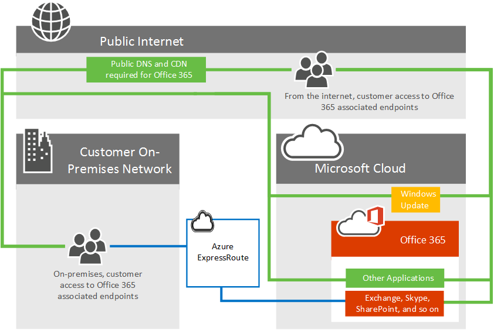

# Azure ExpressRoute pour Office 365Azure ExpressRoute for Office 365

Découvrez comment ExpressRoute Azure est utilisé avec Office 365 et comment planifier le projet d’implémentation réseau qui est requis si vous déployez ExpressRoute Azure pour une utilisation avec Office 365. Services d’infrastructure et de plateforme en cours d’exécution dans Azure bénéficieront souvent en évitant les considérations relatives à l’architecture et les performances réseau. Nous vous recommandons de ExpressRoute pour Azure dans ces cas. Logiciel en tant qu’un offres de services tels que Office 365 et Dynamics 365 ont été conçus pour être accessibles en toute sécurité et de manière fiable via Internet. En conséquence, nous ne recommandons que ExpressRoute pour ces applications dans des scénarios spécifiques. Vous pouvez lire sur la sécurité et les performances d’Internet et lorsque vous pouvez envisager ExpressRoute Azure pour Office 365 dans l’article de la [connectivité réseau vers Office 365](network-connectivity.md).Learn how Azure ExpressRoute is used with Office 365 and how to plan the network implementation project that will be required if you are deploying Azure ExpressRoute for use with Office 365. Infrastructure and platform services running in Azure will often benefit by addressing network architecture and performance considerations. We recommend ExpressRoute for Azure in these cases. Software as a Service offerings like Office 365 and Dynamics 365 have been built to be accessed securely and reliably via the Internet. Accordingly, we only recommend ExpressRoute for these applications in specific scenarios. You can read about Internet performance and security and when you might consider Azure ExpressRoute for Office 365 in the article [Network connectivity to Office 365](network-connectivity.md).

> [!NOTE]
> Démarrage du 31 juillet 2017, vous pouvez activer Microsoft Peering directement à partir de la console d’administration Azure ou à l’aide de PowerShell. Après avoir activé Microsoft Peering, vous pouvez créer des filtres d’itinéraires pour recevoir des annonces d’itinéraires BGP spécifiques. Vous aurez besoin d’autorisation pour créer des filtres pour Office 365 et que vous pouvez créer des filtres d’applications (anciennement appelé CRM Online) Dynamics 365 client Engagement à tout moment. Parler à votre équipe Microsoft Account pour obtenir l’autorisation de créer des filtres de routage Office 365. Abonnements non autorisés tente de créer des filtres d’itinéraires pour Office 365 reçoit un [message d’erreur](https://support.microsoft.com/kb/3181709)Starting July 31st, 2017, you can enable Microsoft Peering directly from the Azure Administrative console or using PowerShell. After enabling Microsoft Peering, you can create route filters to receive specific BGP route advertisements. You'll need authorization to create filters for Office 365 and can create Dynamics 365 Customer Engagement applications (formerly known as CRM Online) filters at any time. Talk to your Microsoft Account team about the process to obtain authorization to create Office 365 route filters. Unauthorized subscriptions trying to create route filters for Office 365 will receive an [error message](https://support.microsoft.com/kb/3181709)

Vous pouvez maintenant ajouter une connexion réseau directe vers Office 365 pour le trafic réseau Office 365 sélectionné. ExpressRoute Azure offre une connexion directe, des performances prévisibles et est fourni avec un SLA de 99,95 % de disponibilité pour les composants réseau Microsoft. Vous allez toujours besoin d’une connexion internet pour les services qui ne sont pas pris en charge sur Azure ExpressRoute.You can now add a direct network connection to Office 365 for selected Office 365 network traffic. Azure ExpressRoute offers a direct connection, predictable performance, and comes with an uptime SLA of 99.95% for the Microsoft networking components. You'll still require an internet connection for services that aren't supported over Azure ExpressRoute.

## Planification ExpressRoute Azure pour Office 365Planning Azure ExpressRoute for Office 365

Outre la connectivité internet, vous pouvez choisir de router un sous-ensemble d’Office 365 le trafic réseau via une connexion directe offrant prévisibilité et un SLA de disponibilité 99,95 % pour les composants réseau Microsoft. ExpressRoute Azure fournit cette connexion réseau dédié à Office 365 et d’autres services de cloud Microsoft.In addition to internet connectivity, you may choose to route a subset of their Office 365 network traffic over a direct connection that offers predictability and a 99.95% uptime SLA for the Microsoft networking components. Azure ExpressRoute provides you with this dedicated network connection to Office 365 and other Microsoft cloud services.

Que vous ayez un WAN MPLS existant, ExpressRoute peut être ajouté à votre architecture de réseau de trois façons ; via un fournisseur de colocalisation pris en charge dans le nuage exchange, un fournisseur de connexion point à point Ethernet, ou via un fournisseur de connexion MPLS. Voir quels [fournisseurs sont disponibles dans votre région](https://azure.microsoft.com/documentation/articles/expressroute-locations/). La connexion directe ExpressRoute activera connectivité aux applications décrites dans [services qu’Office 365 sont incluses ?](azure-expressroute.md#BKMK_WhatDoIGet) ci-dessous. Le trafic réseau pour toutes les autres applications et services continuera à parcourir internet.Regardless of whether you have an existing MPLS WAN, ExpressRoute can be added to your network architecture in one of three ways; through a supported cloud exchange co-location provider, an Ethernet point-to-point connection provider, or through an MPLS connection provider. See what [providers are available in your region](https://azure.microsoft.com/documentation/articles/expressroute-locations/). The direct ExpressRoute connection will enable connectivity to the applications outlined in [What Office 365 services are included?](azure-expressroute.md#BKMK_WhatDoIGet) below. Network traffic for all other applications and services will continue to traverse the internet.

Envisagez le diagramme de réseau de haut niveau suivant qui affiche un client Office 365 type connexion vers les centres de données de Microsoft via internet pour accéder à toutes les applications Microsoft telles que Office 365, Windows Update et TechNet. Les clients utiliser un chemin d’accès réseau similaire indépendamment si elles vous connectez à partir d’un réseau local ou d’une connexion internet indépendants.Consider the following high level network diagram which shows a typical Office 365 customer connecting to Microsoft's datacenters over the internet for access to all Microsoft applications such as Office 365, Windows Update, and TechNet. Customers use a similar network path regardless of whether they're connecting from an on-premises network or from an independent internet connection.

Observez le diagramme mis à jour qui représente un client Office 365 qui utilise internet et ExpressRoute pour se connecter à Office 365. Notez que certaines connexions telles que les nœuds DNS Public et Content Delivery Network nécessitent toujours la connexion internet publique. Notez également les utilisateurs du client qui ne se trouvent pas dans leur ExpressRoute construction connectée se connectent via Internet.Now look at the updated diagram which depicts an Office 365 customer who uses both the internet and ExpressRoute to connect to Office 365. Notice that some connections such as Public DNS and Content Delivery Network nodes still require the public internet connection. Also notice the customer's users who are not located in their ExpressRoute connected building are connecting over the Internet.

Vraiment plus d’informations ? Découvrez comment [gérer le trafic réseau avec ExpressRoute Azure pour Office 365](https://support.office.com/article/e1da26c6-2d39-4379-af6f-4da213218408) et découvrez comment [configurer ExpressRoute Azure pour Office 365](https://azure.microsoft.com/documentation/articles/expressroute-faqs/). Nous avons également enregistré une série 10 [ExpressRoute Azure pour Office 365 formation](https://channel9.msdn.com/series/aer) sur Channel 9 pour vous aider à comprendre les concepts plus en détail.Still want more information? Learn how to [manage your network traffic with Azure ExpressRoute for Office 365](https://support.office.com/article/e1da26c6-2d39-4379-af6f-4da213218408) and learn how to [configure Azure ExpressRoute for Office 365](https://azure.microsoft.com/documentation/articles/expressroute-faqs/). We've also recorded a 10 part [Azure ExpressRoute for Office 365 Training](https://channel9.msdn.com/series/aer) series on Channel 9 to help explain the concepts more thoroughly.

([ExpressRoute azure pour Office 365](azure-expressroute.md#BKMK_HOME))([Azure ExpressRoute for Office 365](azure-expressroute.md#BKMK_HOME))

## Les services Office 365 sont inclus ?What Office 365 services are included?

Le tableau suivant répertorie les services Office 365 sont pris en charge via ExpressRoute. Consultez l' [article de points de terminaison Office 365](https://aka.ms/o365endpoints) pour comprendre les demandes du réseau pour ces applications requièrent une connectivité internet.The following table lists the Office 365 services that are supported over ExpressRoute. Please review the [Office 365 endpoints article](https://aka.ms/o365endpoints) to understand which network requests for these applications require internet connectivity.

|**Applications incluses****Applications included**|
|:-----|
|Exchange Online1Exchange Online1   Exchange Online Protection1Exchange Online Protection1   Entrez1Delve1   |
|Skype pour Business en ligne1Skype for Business Online1   |
|SharePoint Online1SharePoint Online1   OneDrive entreprise1OneDrive for Business1   Project Online1Project Online1   |
|Portail et partagé1Portal and shared1   Azure Active Directory1Azure Active Directory1   DAS connecter1AAD Connect1   Office Online1Office Online1   |

1 Chacune de ces applications ont des exigences de connectivité internet non pris en charge sur ExpressRoute, consultez l' [article de points de terminaison Office 365](https://aka.ms/o365endpoints) pour plus d’informations.1Each of these applications have internet connectivity requirements not supported over ExpressRoute, see the [Office 365 endpoints article](https://aka.ms/o365endpoints) for more information.

Les services qui ne sont pas inclus avec ExpressRoute pour Office 365 sont les téléchargements de client Office 365 ProPlus, On-premises identité fournisseur de connexion et service Office 365 (exploité par 21 Vianet) en Chine.The services that aren't included with ExpressRoute for Office 365 are Office 365 ProPlus client downloads, On-premises Identity Provider Sign-In, and Office 365 (operated by 21 Vianet) service in China.

([ExpressRoute azure pour Office 365](azure-expressroute.md#BKMK_HOME))([Azure ExpressRoute for Office 365](azure-expressroute.md#BKMK_HOME))

## Implémentation d’ExpressRoute pour Office 365Implementing ExpressRoute for Office 365

L’implémentation ExpressRoute requiert la participation des propriétaires de réseau et des applications et une planification pour déterminer la nouvelle [architecture de routage réseau](https://support.office.com/article/e1da26c6-2d39-4379-af6f-4da213218408), les besoins en bande passante, où la sécurité sera mis en œuvre, une haute disponibilité, et ainsi de suite. Pour mettre en œuvre ExpressRoute, vous devez :Implementing ExpressRoute requires the involvement of network and application owners and requires careful planning to determine the new [network routing architecture](https://support.office.com/article/e1da26c6-2d39-4379-af6f-4da213218408), bandwidth requirements, where security will be implemented, high availability, and so on. To implement ExpressRoute, you'll need to:

1. Comprendre le besoin Qu'expressroute satisfait dans votre planification de connectivité Office 365. Comprendre les applications utiliseront internet ou ExpressRoute et entièrement planifier la capacité de votre réseau, sécurité et une haute disponibilité doivent dans le contexte de l’utilisation d’internet et ExpressRoute pour Office 365 le trafic.Fully understand the need ExpressRoute satisfies in your Office 365 connectivity planning. Understand what applications will use the internet or ExpressRoute and fully plan your network capacity, security, and high availability needs in the context of using both the internet and ExpressRoute for Office 365 traffic.

2. Déterminer les emplacements homologation pour internet et du trafic ExpressRoute1sortant.Determine the egress and peering locations for both internet and ExpressRoute traffic1.

3. Déterminer la capacité requise sur internet et les connexions ExpressRoute.Determine the capacity required on the internet and ExpressRoute connections.

4. Disposer d’un plan en place pour l’implémentation de la sécurité et autres contrôles de périmètre standard1.Have a plan in place for implementing security and other standard perimeter controls1.

5. Posséder un compte Microsoft Azure valid pour vous abonner au ExpressRoute.Have a valid Microsoft Azure account to subscribe to ExpressRoute.

6. Sélectionnez un modèle de connectivité et un [approuvé fournisseur](https://azure.microsoft.com/documentation/articles/expressroute-locations/). N’oubliez pas, les clients peuvent sélectionner plusieurs modèles de connectivité ou partenaires et le partenaire ne doit pas être identique à votre fournisseur de réseau existant.Select a connectivity model and an [approved provider](https://azure.microsoft.com/documentation/articles/expressroute-locations/). Keep in mind, customers can select multiple connectivity models or partners and the partner doesn't need to be the same as your existing network provider.

7. Valider le déploiement avant de diriger le trafic vers ExpressRoute.Validate deployment prior to directing traffic to ExpressRoute.

8. Vous pouvez [implémenter QoS](https://support.office.com/article/ExpressRoute-and-QoS-in-Skype-for-Business-Online-20c654da-30ee-4e4f-a764-8b7d8844431d) et évaluer le développement régional.Optionally [implement QoS](https://support.office.com/article/ExpressRoute-and-QoS-in-Skype-for-Business-Online-20c654da-30ee-4e4f-a764-8b7d8844431d) and evaluate regional expansion.

1 Considérations en matière de performances. Décisions ici peuvent affecter considérablement la latence qui est essentiel pour les applications telles que Skype pour les entreprises.1Important performance considerations. Decisions here can dramatically impact latency which is a critical for applications such as Skype for Business.

Pour des références supplémentaires, utilisez notre [guide de routage](https://support.office.com/article/Routing-with-ExpressRoute-for-Office-365-e1da26c6-2d39-4379-af6f-4da213218408) en plus de la [documentation ExpressRoute](https://azure.microsoft.com/documentation/articles/expressroute-introduction/).For additional references, use our [routing guide](https://support.office.com/article/Routing-with-ExpressRoute-for-Office-365-e1da26c6-2d39-4379-af6f-4da213218408) in addition to the [ExpressRoute documentation](https://azure.microsoft.com/documentation/articles/expressroute-introduction/).

Pour acheter ExpressRoute pour Office 365, vous devez travailler avec un ou plusieurs [approuvé fournisseurs](https://azure.microsoft.com/documentation/articles/expressroute-locations/) pour mettre en service le numéro de votre choix et circuits de taille avec un abonnement ExpressRoute Premium. Il n’existe aucune licence supplémentaire sur l’achat d’Office 365.To purchase ExpressRoute for Office 365, you'll need to work with one or more [approved providers](https://azure.microsoft.com/documentation/articles/expressroute-locations/) to provision the desired number and size circuits with an ExpressRoute Premium subscription. There are no additional licenses to purchase from Office 365.

Voici un lien court, que vous pouvez utiliser pour revenir :[https://aka.ms/expressrouteoffice365](https://aka.ms/expressrouteoffice365)Here's a short link you can use to come back: [https://aka.ms/expressrouteoffice365](https://aka.ms/expressrouteoffice365)

Prêts à d’inscription [ExpressRoute pour Office 365](https://aka.ms/ert)?Ready to sign-up for [ExpressRoute for Office 365](https://aka.ms/ert)?

([ExpressRoute azure pour Office 365](azure-expressroute.md#BKMK_HOME))([Azure ExpressRoute for Office 365](azure-expressroute.md#BKMK_HOME))

## Voir aussiRelated Topics

[Connectivité réseau à Office 365Network connectivity to Office 365](network-connectivity.md)

[Gestion d’ExpressRoute pour la connectivité d’Office 365Managing ExpressRoute for Office 365 connectivity](managing-expressroute-for-connectivity.md)

[Routage avec ExpressRoute pour Office 365Routing with ExpressRoute for Office 365](routing-with-expressroute.md)

[Planification de réseau avec ExpressRoute pour Office 365Network planning with ExpressRoute for Office 365](network-planning-with-expressroute.md)

[Implémentation d’ExpressRoute pour Office 365Implementing ExpressRoute for Office 365](implementing-expressroute.md)

[Utilisation de communautés BGP dans ExpressRoute pour les scénarios d’Office 365 (preview)Using BGP communities in ExpressRoute for Office 365 scenarios (preview)](bgp-communities-in-expressroute.md)

[La qualité des médias et des performances pour la connectivité réseau dans Skype pour les entreprises en ligneMedia Quality and Network Connectivity Performance in Skype for Business Online](https://support.office.com/article/5fe3e01b-34cf-44e0-b897-b0b2a83f0917)

[Réglage des performances Office 365 à l’aide du planning de référence et de l’historique des performancesOffice 365 performance tuning using baselines and performance history](performance-tuning-using-baselines-and-history.md)

[Plan de résolution des problèmes de performances pour Office 365Performance troubleshooting plan for Office 365](performance-troubleshooting-plan.md)

[URL et plages d’adresses IP Office 365Office 365 URLs and IP address ranges](https://support.office.com/article/8548a211-3fe7-47cb-abb1-355ea5aa88a2)

[Réseau Office 365 et réglage des performancesOffice 365 network and performance tuning](network-planning-and-performance.md)
