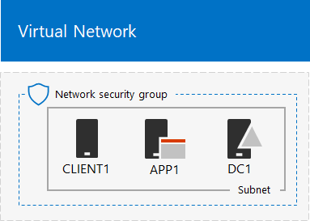
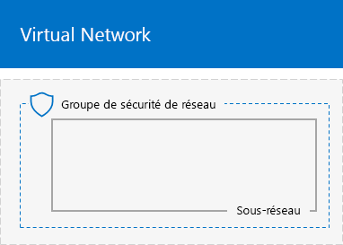
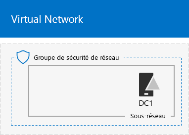
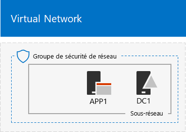

# <a name="base-configuration-devtest-environment"></a><span data-ttu-id="93588-103">Environnement de développement/test de configuration de base</span><span class="sxs-lookup"><span data-stu-id="93588-103">Base Configuration dev/test environment</span></span>

 <span data-ttu-id="93588-104">**Résumé :** Découvrez comment créer un intranet simplifié comme environnement de développement/test dans Microsoft Azure.</span><span class="sxs-lookup"><span data-stu-id="93588-104">**Summary:** Create a simplified intranet as a dev/test environment in Microsoft Azure.</span></span>
  
<span data-ttu-id="93588-105">Cet article vous fournit des instructions pour créer l’environnement suivant de développement/test de configuration de base dans Azure :</span><span class="sxs-lookup"><span data-stu-id="93588-105">This article provides you with instructions to create the following Base Configuration dev/test environment in Azure:</span></span>
  

  
<span data-ttu-id="93588-107">**Figure 1 : Environnement de développement/test de configuration de base**</span><span class="sxs-lookup"><span data-stu-id="93588-107">**Figure 1: The Base Configuration dev/test environment**</span></span>

<span data-ttu-id="93588-108">L’environnement de développement/test de configuration de base de la figure 1 est constitué du sous-réseau du réseau d’entreprise dans un réseau virtuel Azure de type « cloud uniquement » nommé TestLab, qui simule un intranet simplifié et privé connecté à Internet.</span><span class="sxs-lookup"><span data-stu-id="93588-108">The Base Configuration dev/test environment in Figure 1 consists of the Corpnet subnet in a cloud-only Azure virtual network named TestLab that simulates a simplified, private intranet connected to the Internet.</span></span> <span data-ttu-id="93588-109">Il comporte trois machines virtuelles Azure exécutant Windows Server 2016 :</span><span class="sxs-lookup"><span data-stu-id="93588-109">It has three Azure virtual machines running Windows Server 2016:</span></span>
  
- <span data-ttu-id="93588-110">DC1 est configuré comme un contrôleur de domaine intranet et un serveur DNS (Domain Name System)</span><span class="sxs-lookup"><span data-stu-id="93588-110">DC1 is configured as an intranet domain controller and Domain Name System (DNS) server</span></span>
    
- <span data-ttu-id="93588-111">APP1 est configuré comme un serveur web et une application générale</span><span class="sxs-lookup"><span data-stu-id="93588-111">APP1 is configured as a general application and web server</span></span>
    
- <span data-ttu-id="93588-112">CLIENT1 se comporte comme un client intranet</span><span class="sxs-lookup"><span data-stu-id="93588-112">CLIENT1 acts as an intranet client</span></span>
    
<span data-ttu-id="93588-113">Cette configuration permet aux DC1, APP1, CLIENT1 et autres ordinateurs de sous-réseau du réseau d’entreprise d’être :</span><span class="sxs-lookup"><span data-stu-id="93588-113">This configuration lets DC1, APP1, CLIENT1, and additional Corpnet subnet computers to be:</span></span> 
  
- <span data-ttu-id="93588-114">Connectés à Internet pour installer des mises à jour, accéder aux ressources Internet en temps réel et participer à des technologies de cloud public comme Office 365 et d’autres services Azure.</span><span class="sxs-lookup"><span data-stu-id="93588-114">Connected to the Internet to install updates, access Internet resources in real time, and participate in public cloud technologies such as Microsoft Office 365 and other Azure services.</span></span>
    
- <span data-ttu-id="93588-115">Gérés à distance à l’aide de connexions de bureau à distance depuis votre ordinateur qui est connecté à Internet ou au réseau de votre organisation.</span><span class="sxs-lookup"><span data-stu-id="93588-115">Remotely managed using Remote Desktop connections from your computer that is connected to the Internet or your organization network.</span></span>
    
<span data-ttu-id="93588-116">Vous pouvez utiliser l’environnement de test résultant :</span><span class="sxs-lookup"><span data-stu-id="93588-116">You can use the resulting test environment:</span></span>
  
- <span data-ttu-id="93588-117">Pour le développement d’applications et le test.</span><span class="sxs-lookup"><span data-stu-id="93588-117">For application development and testing.</span></span>
    
- <span data-ttu-id="93588-118">En tant que configuration initiale d’un environnement de test étendu de votre propre conception, qui inclut des machines virtuelles supplémentaires, des services Azure ou d’autres offres de cloud Microsoft telles qu’Office 365 et Enterprise Mobility + Security (EMS).</span><span class="sxs-lookup"><span data-stu-id="93588-118">As the initial configuration of an extended test environment of your own design that includes additional virtual machines, Azure services, or other Microsoft cloud offerings such as Office 365 and Enterprise Mobility + Security (EMS).</span></span>
    
<span data-ttu-id="93588-119">Il existe deux méthodes pour la création de cet environnement :</span><span class="sxs-lookup"><span data-stu-id="93588-119">There are two methods to creating this environment:</span></span>

1. <span data-ttu-id="93588-120">Un modèle Azure Resource Manager</span><span class="sxs-lookup"><span data-stu-id="93588-120">An Azure Resource Manager template</span></span>
2. <span data-ttu-id="93588-121">Azure Powershell</span><span class="sxs-lookup"><span data-stu-id="93588-121">Azure Powershell</span></span>

## <a name="method-1-build-your-simulated-intranet-with-an-azure-resource-manager-template"></a><span data-ttu-id="93588-122">Méthode 1 : Créer votre intranet simulé avec un modèle Azure Resource Manager</span><span class="sxs-lookup"><span data-stu-id="93588-122">Method 1: Build your simulated intranet with an Azure Resource Manager template</span></span>

<span data-ttu-id="93588-p102">Dans cette méthode, vous utilisez un modèle Azure Resource Manager (ARM) pour créer l’intranet simulé. Les modèles ARM contiennent toutes les instructions nécessaires pour créer et configurer l’infrastructure réseau Azure et les machines virtuelles.</span><span class="sxs-lookup"><span data-stu-id="93588-p102">In this method, you use an Azure Resource Manager (ARM) template to build out the simulated intranet. ARM templates contain all of the instructions to create and configure the Azure networking infrastructure and the virtual machines.</span></span>

<span data-ttu-id="93588-125">Avant de déployer le modèle, parcourez la [page README du modèle](https://github.com/maxskunkworks/TLG/tree/master/tlg-base-config_3-vm) et veillez à avoir les informations suivantes à portée de main :</span><span class="sxs-lookup"><span data-stu-id="93588-125">Prior to deploying the template, read through the [template README page](https://github.com/maxskunkworks/TLG/tree/master/tlg-base-config_3-vm) and have the following information ready:</span></span>

- <span data-ttu-id="93588-p103">Nom de l’abonnement Azure. Vous devez saisir ce texte dans le champ **Abonnement** de la page **Déploiement personnalisé**.</span><span class="sxs-lookup"><span data-stu-id="93588-p103">The Azure subscription name. You’ll need to enter this label in the **Subscription** field of the **Custom deployment** page.</span></span>
- <span data-ttu-id="93588-p104">Le nom du groupe de ressources Azure. Vous devez saisir ce texte dans le champ **Groupe de ressources** de la page **Déploiement personnalisé**.</span><span class="sxs-lookup"><span data-stu-id="93588-p104">The Azure resource group name. You’ll need to enter this label in the **Resource group** field of the **Custom deployment** page.</span></span>
- <span data-ttu-id="93588-p105">Un préfixe d’étiquette DNS pour les URL d’adresses IP publiques de vos machines virtuelles. Vous devez entrer cette étiquette dans le**préfixe d’étiquette Dns** champ de la page**déploiement Personnalisé**.</span><span class="sxs-lookup"><span data-stu-id="93588-p105">A DNS label prefix for the URLs of the public IP addresses of your virtual machines. You’ll need to enter this label in the **Dns Label Prefix** field of the **Custom deployment** page.</span></span>

<span data-ttu-id="93588-132">Après avoir lu via les instructions, cliquez sur **déployer vers Azure** sur la [page modèle LISEZMOI](https://github.com/maxskunkworks/TLG/tree/master/tlg-base-config_3-vm) pour commencer.</span><span class="sxs-lookup"><span data-stu-id="93588-132">After reading through the instructions, click **Deploy to Azure** on the [template README page](https://github.com/maxskunkworks/TLG/tree/master/tlg-base-config_3-vm) to get started.</span></span>

>[!Note]
><span data-ttu-id="93588-133">L’Intranet simulé créé par le modèle GRA nécessite un abonnement payant à Azure.</span><span class="sxs-lookup"><span data-stu-id="93588-133">The simulated intranet built by the ARM template requires a paid Azure subscription.</span></span>
>

<span data-ttu-id="93588-134">Voici votre configuration une fois le modèle terminé.</span><span class="sxs-lookup"><span data-stu-id="93588-134">Here is your configuration after the template is complete.</span></span>


## <a name="method-2-build-your-simulated-intranet-with-azure-powershell"></a><span data-ttu-id="93588-136">Méthode 2 : Créer votre intranet simulé avec Azure PowerShell</span><span class="sxs-lookup"><span data-stu-id="93588-136">Method 2: Build your simulated intranet with Azure PowerShell</span></span>

<span data-ttu-id="93588-137">En utilisant cette méthode, vous utilisez Windows PowerShell et le module Azure PowerShell afin de créer l’infrastructure de réseau, les machines virtuelles et leur configuration.</span><span class="sxs-lookup"><span data-stu-id="93588-137">In this method, you use Windows PowerShell and the Azure PowerShell module to build out the networking infrastructure, the virtual machines, and their configuration.</span></span>

<span data-ttu-id="93588-p106">Utilisez cette méthode si vous voulez acquérir de l’expérience en créant des éléments d’infrastructure Azure, un bloc de commande après l’autre, avec PowerShell. Vous pouvez alors personnaliser les blocs de commande PowerShell pour votre propre déploiement d’autres machines virtuelles dans Azure.</span><span class="sxs-lookup"><span data-stu-id="93588-p106">Use this method if you want to get experience creating elements of Azure infrastructure one command block at a time with PowerShell. You can then customize the PowerShell command blocks for your own deployment of other virtual machines in Azure.</span></span>

<span data-ttu-id="93588-140">Il existe quatre étapes pour configurer l’environnement de test de configuration de base à l’aide d’Azure PowerShell :</span><span class="sxs-lookup"><span data-stu-id="93588-140">There are four steps to setting up the Base Configuration test environment using Azure PowerShell:</span></span>
  
1. <span data-ttu-id="93588-141">Créer le réseau virtuel</span><span class="sxs-lookup"><span data-stu-id="93588-141">Create the virtual network.</span></span>
    
2. <span data-ttu-id="93588-142">Configurer DC1</span><span class="sxs-lookup"><span data-stu-id="93588-142">Configure DC1.</span></span>
    
3. <span data-ttu-id="93588-143">Configurer APP1</span><span class="sxs-lookup"><span data-stu-id="93588-143">Configure APP1.</span></span>
    
4. <span data-ttu-id="93588-144">	Configurer CLIENT1</span><span class="sxs-lookup"><span data-stu-id="93588-144">Configure CLIENT1.</span></span>
    
<span data-ttu-id="93588-p107">Si vous n’avez pas encore d’abonnement Azure, vous pouvez créer un compte d’essai gratuit sur la page [Azure](https://azure.microsoft.com/pricing/free-trial/). Si vous avez un abonnement MSDN ou Visual Studio, consultez la page [Crédit Azure mensuel pour les abonnés Visual Studio](https://azure.microsoft.com/pricing/member-offers/msdn-benefits-details/).</span><span class="sxs-lookup"><span data-stu-id="93588-p107">If you do not already have an Azure subscription, you can sign up for a free trial at [Try Azure](https://azure.microsoft.com/pricing/free-trial/). If you have an MSDN or Visual Studio subscription, see [Monthly Azure credit for Visual Studio subscribers](https://azure.microsoft.com/pricing/member-offers/msdn-benefits-details/).</span></span>
  
> [!NOTE]
> <span data-ttu-id="93588-p108">Les machines virtuelles dans Azure occasionnent un coût monétaire continu quand elles sont utilisées. Ce coût est facturé en fonction de votre essai gratuit, de votre abonnement MSDN ou de votre abonnement payé. Pour en savoir plus sur les coûts d’utilisation des machines virtuelles Azure, consultez les pages [Tarification des machines virtuelles](https://azure.microsoft.com/pricing/details/virtual-machines/) et [Calculatrice de prix](https://azure.microsoft.com/pricing/calculator/). Pour maîtriser vos coûts, consultez la section [Réduire les coûts des machines virtuelles d’environnement de test dans Azure](base-configuration-dev-test-environment.md#mincost).</span><span class="sxs-lookup"><span data-stu-id="93588-p108">Virtual machines in Azure incur an ongoing monetary cost when they are running. This cost is billed against your free trial, MSDN subscription, or paid subscription. For more information about the costs of running Azure virtual machines, see [Virtual Machines Pricing Details](https://azure.microsoft.com/pricing/details/virtual-machines/) and [Azure Pricing Calculator](https://azure.microsoft.com/pricing/calculator/). To keep costs down, see [Minimizing the costs of test environment virtual machines in Azure](base-configuration-dev-test-environment.md#mincost).</span></span> 
  

  
> [!TIP]
> <span data-ttu-id="93588-152">Cliquez sur[ici](https://aka.ms/catlgstack) pour afficher le plan de tous les articles dans le Guide de Laboratoire Test Office 365.</span><span class="sxs-lookup"><span data-stu-id="93588-152">Click [here](https://aka.ms/catlgstack) for a visual map to all the articles in the Office 365 Test Lab Guide stack.</span></span>
  
### <a name="step-1-create-the-virtual-network"></a><span data-ttu-id="93588-153">Étape 1 : Créer le réseau virtuel</span><span class="sxs-lookup"><span data-stu-id="93588-153">Step 1: Create the virtual network</span></span>

<span data-ttu-id="93588-154">Dans cette étape, vous créez le réseau virtuel TestLab dans Azure.</span><span class="sxs-lookup"><span data-stu-id="93588-154">In this step, you the TestLab virtual network in Azure.</span></span>

<span data-ttu-id="93588-155">Tout d’abord, ouvrez une invite Azure PowerShell.</span><span class="sxs-lookup"><span data-stu-id="93588-155">First, start an Azure PowerShell prompt.</span></span>
  
> [!NOTE]
> <span data-ttu-id="93588-p109">Les ensembles de commandes suivants utilisent la dernière version d’Azure PowerShell. Consultez l’article [Vue d’ensemble d’Azure PowerShell](https://docs.microsoft.com/powershell/azureps-cmdlets-docs/).</span><span class="sxs-lookup"><span data-stu-id="93588-p109">The following command sets use the latest version of Azure PowerShell. See [Get started with Azure PowerShell cmdlets](https://docs.microsoft.com/powershell/azureps-cmdlets-docs/).</span></span> 
  
<span data-ttu-id="93588-158">Connectez-vous à votre compte Azure avec la commande suivante.</span><span class="sxs-lookup"><span data-stu-id="93588-158">Sign in to your Azure account with the following command.</span></span>
  
```
Connect-AzAccount
```

> [!TIP]
> <span data-ttu-id="93588-159">Pour accéder à un fichier texte qui contient toutes les commandes PowerShell décrites dans cet article, cliquez [ici](https://gallery.technet.microsoft.com/PowerShell-commands-for-ba957d3d).</span><span class="sxs-lookup"><span data-stu-id="93588-159">Click [here](https://gallery.technet.microsoft.com/PowerShell-commands-for-ba957d3d) to get a text file that has all the PowerShell commands in this article.</span></span>

<span data-ttu-id="93588-160">Obtenez le nom de votre abonnement à l’aide de la commande suivante.</span><span class="sxs-lookup"><span data-stu-id="93588-160">Get your subscription name using the following command.</span></span>
  
```
Get-AzSubscription | Sort Name | Select Name
```

<span data-ttu-id="93588-p110">Définissez votre abonnement Azure. Remplacez tout le texte entre guillemets, y compris les caractères < et >, avec le nom correct.</span><span class="sxs-lookup"><span data-stu-id="93588-p110">Set your Azure subscription. Replace everything within the quotes, including the < and > characters, with the correct name.</span></span>
  
```
$subscrName="<subscription name>"
Select-AzSubscription -SubscriptionName $subscrName
```

<span data-ttu-id="93588-p111">Ensuite, créez un nouveau groupe de ressources pour votre laboratoire de test de configuration de base. Pour déterminer un nom de groupe de ressources unique, utilisez cette commande pour répertorier vos groupes de ressources existants.</span><span class="sxs-lookup"><span data-stu-id="93588-p111">Next, create a new resource group for your Base Configuration test lab. To determine a unique resource group name, use this command to list your existing resource groups.</span></span>
  
```
Get-AzResourceGroup | Sort ResourceGroupName | Select ResourceGroupName
```

<span data-ttu-id="93588-p112">Créez votre nouveau groupe de ressources avec ces commandes. Remplacez tout le texte entre guillemets, y compris les caractères < et >, par les noms corrects.</span><span class="sxs-lookup"><span data-stu-id="93588-p112">Create your new resource group with these commands. Replace everything within the quotes, including the < and > characters, with the correct names.</span></span>
  
```
$rgName="<resource group name>"
$locName="<location name, such as West US>"
New-AzResourceGroup -Name $rgName -Location $locName
```

<span data-ttu-id="93588-167">Ensuite, créez le réseau virtuel TestLab qui hébergera le sous-réseau du réseau d’entreprise de la configuration de base et protégez-le avec un groupe de sécurité réseau.</span><span class="sxs-lookup"><span data-stu-id="93588-167">Next, you create the TestLab virtual network that will host the Corpnet subnet of the base configuration and protect it with a network security group.</span></span>
  
```
$rgName="<name of your new resource group>"
$locName=(Get-AzResourceGroup -Name $rgName).Location
$corpnetSubnet=New-AzVirtualNetworkSubnetConfig -Name Corpnet -AddressPrefix 10.0.0.0/24
New-AzVirtualNetwork -Name TestLab -ResourceGroupName $rgName -Location $locName -AddressPrefix 10.0.0.0/8 -Subnet $corpnetSubnet -DNSServer 10.0.0.4
$rule1=New-AzNetworkSecurityRuleConfig -Name "RDPTraffic" -Description "Allow RDP to all VMs on the subnet" -Access Allow -Protocol Tcp -Direction Inbound -Priority 100 -SourceAddressPrefix Internet -SourcePortRange * -DestinationAddressPrefix * -DestinationPortRange 3389
New-AzNetworkSecurityGroup -Name Corpnet -ResourceGroupName $rgName -Location $locName -SecurityRules $rule1
$vnet=Get-AzVirtualNetwork -ResourceGroupName $rgName -Name TestLab
$nsg=Get-AzNetworkSecurityGroup -Name Corpnet -ResourceGroupName $rgName
Set-AzVirtualNetworkSubnetConfig -VirtualNetwork $vnet -Name Corpnet -AddressPrefix "10.0.0.0/24" -NetworkSecurityGroup $nsg
$vnet | Set-AzVirtualNetwork
```

<span data-ttu-id="93588-168">Il s’agit de votre configuration actuelle.</span><span class="sxs-lookup"><span data-stu-id="93588-168">This is your current configuration.</span></span>
  

  
### <a name="step-2-configure-dc1"></a><span data-ttu-id="93588-170">Étape 2 : Configurer DC1</span><span class="sxs-lookup"><span data-stu-id="93588-170">Step 2: Configure DC1</span></span>

<span data-ttu-id="93588-171">Dans cette étape, nous créons la machine virtuelle DC1 et la configurons en tant que contrôleur de domaine pour le domaine AD DS (Active Directory Domain Services) corp.contoso.com et un serveur DNS pour les machines virtuelles du réseau virtuel TestLab.</span><span class="sxs-lookup"><span data-stu-id="93588-171">In this step, we create the DC1 virtual machine and configure it as a domain controller for the corp.contoso.com Active Directory Domain Services (AD DS) domain and a DNS server for the virtual machines of the TestLab virtual network.</span></span>

> [!NOTE]
> <span data-ttu-id="93588-p113">Avant d’exécuter le bloc de commandes suivant, vérifiez que la région Azure (emplacement) que vous avez choisie prend en charge la taille de la machine virtuelle Azure, qui est définie par défaut sur Standard_A1. Cliquez [ici](https://azure.microsoft.com/global-infrastructure/services/?products=virtual-machines) pour voir les dernières informations sur les tailles et les emplacements des machines virtuelles Azure.</span><span class="sxs-lookup"><span data-stu-id="93588-p113">Before executing the following command block, ensure that the Azure region (location) that you have chosen supports the Azure virtual machine size, which by default is set to Standard_A1. Click [here](https://azure.microsoft.com/global-infrastructure/services/?products=virtual-machines) to see the latest information on Azure virtual machine sizes and locations.</span></span>
  
<span data-ttu-id="93588-174">Pour créer une machine virtuelle Azure pour DC1, indiquez d’abord le nom de votre groupe de ressources, puis exécutez ces commandes à l’invite de commande Azure PowerShell sur votre ordinateur local.</span><span class="sxs-lookup"><span data-stu-id="93588-174">To create an Azure virtual machine for DC1, fill in the name of your resource group and run these commands at the Azure PowerShell command prompt on your local computer.</span></span>
  
```
$rgName="<resource group name>"
$locName=(Get-AzResourceGroup -Name $rgName).Location
$vnet=Get-AzVirtualNetwork -Name TestLab -ResourceGroupName $rgName
$pip=New-AzPublicIpAddress -Name DC1-PIP -ResourceGroupName $rgName -Location $locName -AllocationMethod Dynamic
$nic=New-AzNetworkInterface -Name DC1-NIC -ResourceGroupName $rgName -Location $locName -SubnetId $vnet.Subnets[0].Id -PublicIpAddressId $pip.Id -PrivateIpAddress 10.0.0.4
$vm=New-AzVMConfig -VMName DC1 -VMSize Standard_A1
$cred=Get-Credential -Message "Type the name and password of the local administrator account for DC1."
$vm=Set-AzVMOperatingSystem -VM $vm -Windows -ComputerName DC1 -Credential $cred -ProvisionVMAgent -EnableAutoUpdate
$vm=Set-AzVMSourceImage -VM $vm -PublisherName MicrosoftWindowsServer -Offer WindowsServer -Skus 2016-Datacenter -Version "latest"
$vm=Add-AzVMNetworkInterface -VM $vm -Id $nic.Id
$vm=Set-AzVMOSDisk -VM $vm -Name "DC1-OS" -DiskSizeInGB 128 -CreateOption FromImage -StorageAccountType "Standard_LRS"
$diskConfig=New-AzDiskConfig -AccountType "Standard_LRS" -Location $locName -CreateOption Empty -DiskSizeGB 20
$dataDisk1=New-AzDisk -DiskName "DC1-DataDisk1" -Disk $diskConfig -ResourceGroupName $rgName
$vm=Add-AzVMDataDisk -VM $vm -Name "DC1-DataDisk1" -CreateOption Attach -ManagedDiskId $dataDisk1.Id -Lun 1
New-AzVM -ResourceGroupName $rgName -Location $locName -VM $vm
```

<span data-ttu-id="93588-p114">Vous serez invité à indiquer un nom d’utilisateur et un mot de passe pour le compte d’administrateur local sur DC1. Utilisez un mot de passe et enregistrez le nom et le mot de passe dans un endroit sûr.</span><span class="sxs-lookup"><span data-stu-id="93588-p114">You will be prompted for a user name and password for the local administrator account on DC1. Use a strong password and record both the name and password in a secure location.</span></span>
  
<span data-ttu-id="93588-177">Ensuite, connectez-vous à la machine virtuelle DC1.</span><span class="sxs-lookup"><span data-stu-id="93588-177">Next, connect to the DC1 virtual machine.</span></span>
  
1. <span data-ttu-id="93588-178">Dans le [Portail Azure](https://portal.azure.com), cliquez sur **Groupes de Ressources >** [nom de votre nouveau groupe de ressources] **> DC1 > Se connecter**.</span><span class="sxs-lookup"><span data-stu-id="93588-178">In the [Azure portal](https://portal.azure.com), click **Resource Groups >** [the name of your new resource group] **> DC1 > Connect**.</span></span>
    
2. <span data-ttu-id="93588-p115">Dans le volet ouvert, cliquez sur **Télécharger le fichier RDP**. Ouvrez le fichier DC1.rdp qui est téléchargé, puis cliquez sur **Se connecter**.</span><span class="sxs-lookup"><span data-stu-id="93588-p115">In the open pane, click **Download RDP file**. Open the DC1.rdp file that is downloaded, and then click **Connect**.</span></span>
    
3. <span data-ttu-id="93588-181">Spécifiez le nom du compte Administrateur local DC1 :</span><span class="sxs-lookup"><span data-stu-id="93588-181">Specify the DC1 local administrator account name:</span></span>
    
  - <span data-ttu-id="93588-182">Pour Windows 7 :</span><span class="sxs-lookup"><span data-stu-id="93588-182">For Windows 7:</span></span>
    
    <span data-ttu-id="93588-p116">Dans la boîte de dialogue **Sécurité Windows**, cliquez sur **Utiliser un autre compte**. Dans **Nom d’utilisateur**, tapez **DC1\\**[nom du compte Administrateur local].</span><span class="sxs-lookup"><span data-stu-id="93588-p116">In the **Windows Security** dialog box, click **Use another account**. In **User name**, type **DC1\\**[Local administrator account name].</span></span>
    
  - <span data-ttu-id="93588-185">Pour Windows 8 ou Windows 10 :</span><span class="sxs-lookup"><span data-stu-id="93588-185">For Windows 8 or Windows 10:</span></span>
    
    <span data-ttu-id="93588-p117">Dans la boîte de dialogue **Sécurité Windows**, cliquez sur **Autres choix**, puis cliquez sur **Utiliser un autre compte**. Dans **Nom d’utilisateur**, tapez **DC1\\**[nom de compte Administrateur local].</span><span class="sxs-lookup"><span data-stu-id="93588-p117">In the **Windows Security** dialog box, click **More choices**, and then click **Use a different account**. In **User name**, type **DC1\\**[Local administrator account name].</span></span>
    
4. <span data-ttu-id="93588-188">Dans **Mot de passe**, tapez le mot de passe du compte Administrateur local, puis cliquez sur **OK**.</span><span class="sxs-lookup"><span data-stu-id="93588-188">In **Password**, type the password of the local administrator account, and then click **OK**.</span></span>
    
5. <span data-ttu-id="93588-189">Quand vous y êtes invité, cliquez sur **Oui**.</span><span class="sxs-lookup"><span data-stu-id="93588-189">When prompted, click **Yes**.</span></span>
    
<span data-ttu-id="93588-190">Ensuite, ajoutez un disque de données supplémentaire en tant que nouveau volume avec la lettre de lecteur F:, à l’aide de la commande suivante, dans l’invite de commande Windows PowerShell au niveau administrateur sur DC1.</span><span class="sxs-lookup"><span data-stu-id="93588-190">Next, add an extra data disk as a new volume with the drive letter F: with this command at an administrator-level Windows PowerShell command prompt on DC1.</span></span>
  
```
Get-Disk | Where PartitionStyle -eq "RAW" | Initialize-Disk -PartitionStyle MBR -PassThru | New-Partition -AssignDriveLetter -UseMaximumSize | Format-Volume -FileSystem NTFS -NewFileSystemLabel "WSAD Data"
```

<span data-ttu-id="93588-p118">Ensuite, configurez DC1 comme un contrôleur de domaine et un serveur DNS pour le domaine corp.contoso.com. Exécutez ces commandes à l’invite de commande Windows PowerShell de niveau administrateur.</span><span class="sxs-lookup"><span data-stu-id="93588-p118">Next, configure DC1 as a domain controller and DNS server for the corp.contoso.com domain. Run these commands at an administrator-level Windows PowerShell command prompt.</span></span>
  
```
Install-WindowsFeature AD-Domain-Services -IncludeManagementTools
Install-ADDSForest -DomainName corp.contoso.com -DatabasePath "F:\NTDS" -SysvolPath "F:\SYSVOL" -LogPath "F:\Logs"
```
<span data-ttu-id="93588-p119">Vous devez spécifier un mot de passe administrateur en mode sans échec. Conservez ce mot de passe dans un endroit sûr.</span><span class="sxs-lookup"><span data-stu-id="93588-p119">You will need to specify a safe mode administrator password. Store this password in a secure location.</span></span>
  
<span data-ttu-id="93588-195">Notez que l’exécution de ces commandes peut prendre quelques minutes.</span><span class="sxs-lookup"><span data-stu-id="93588-195">Note that these commands can take a few minutes to complete.</span></span>
  
<span data-ttu-id="93588-196">Après le redémarrage de DC1, reconnectez-vous à la machine virtuelle DC1 à l’aide des informations d’identification de domaine.</span><span class="sxs-lookup"><span data-stu-id="93588-196">After DC1 restarts, reconnect to the DC1 virtual machine using domain credentials.</span></span>
  
1. <span data-ttu-id="93588-197">Dans le [Portail Azure](https://portal.azure.com), cliquez sur **Groupes de Ressources >** [nom de votre groupe de ressources] **> DC1 > Se connecter**.</span><span class="sxs-lookup"><span data-stu-id="93588-197">In the [Azure portal](https://portal.azure.com), click **Resource Groups >** [your resource group name] **> DC1 > Connect**.</span></span>
    
2. <span data-ttu-id="93588-198">Exécutez le fichier DC1.rdp qui est téléchargé, puis cliquez sur **Se connecter**.</span><span class="sxs-lookup"><span data-stu-id="93588-198">Run the DC1.rdp file that is downloaded, and then click **Connect**.</span></span>
    
3. <span data-ttu-id="93588-p120">Dans **Sécurité Windows**, cliquez sur **Utiliser un autre compte**. Dans **Nom d’utilisateur**, tapez **CORP\\**[nom du compte Administrateur local].</span><span class="sxs-lookup"><span data-stu-id="93588-p120">In **Windows Security**, click **Use another account**. In **User name**, type **CORP\\**[Local administrator account name].</span></span>
    
4. <span data-ttu-id="93588-201">Dans **Mot de passe**, tapez le mot de passe du compte Administrateur local, puis cliquez sur **OK**.</span><span class="sxs-lookup"><span data-stu-id="93588-201">In **Password**, type the password of the local administrator account, and then click **OK**.</span></span>
    
5. <span data-ttu-id="93588-202">Quand vous y êtes invité, cliquez sur **Oui**.</span><span class="sxs-lookup"><span data-stu-id="93588-202">When prompted, click **Yes**.</span></span>
    
<span data-ttu-id="93588-p121">Ensuite, créez un compte d’utilisateur dans Active Directory qui sera utilisé lors de la connexion aux ordinateurs membres du domaine CORP. Exécutez cette commande à l’invite de commande Windows PowerShell de niveau administrateur.</span><span class="sxs-lookup"><span data-stu-id="93588-p121">Next, create a user account in Active Directory that will be used when logging in to CORP domain member computers. Run this command at an administrator-level Windows PowerShell command prompt.</span></span>
  
```
New-ADUser -SamAccountName User1 -AccountPassword (read-host "Set user password" -assecurestring) -name "User1" -enabled $true -PasswordNeverExpires $true -ChangePasswordAtLogon $false
```

<span data-ttu-id="93588-p122">Notez que cette commande vous invite à indiquer le mot de passe du compte Utilisateur 1. Étant donné que ce compte est utilisé pour les connexions de bureau à distance pour tous les ordinateurs membres du domaine CORP, choisissez un mot de passe fort. Enregistrez le mot de passe du compte Utilisateur 1 et stockez-le dans un endroit sûr.</span><span class="sxs-lookup"><span data-stu-id="93588-p122">Note that this command prompts you to supply the User1 account password. Because this account will be used for remote desktop connections for all CORP domain member computers, choose a strong password. Record the User1 account password and store it in a secured location.</span></span>
  
<span data-ttu-id="93588-p123">Ensuite, configurez le nouveau compte Utilisateur 1 en tant qu’Administrateur Entreprise. Exécutez cette commande à l’invite de commande Windows PowerShell de niveau administrateur.</span><span class="sxs-lookup"><span data-stu-id="93588-p123">Next, configure the new User1 account as an Enterprise Administrator. Run this command at the administrator-level Windows PowerShell command prompt.</span></span>
  
```
Add-ADPrincipalGroupMembership -Identity "CN=User1,CN=Users,DC=corp,DC=contoso,DC=com" -MemberOf "CN=Enterprise Admins,CN=Users,DC=corp,DC=contoso,DC=com","CN=Domain Admins,CN=Users,DC=corp,DC=contoso,DC=com","CN=Schema Admins,CN=Users,DC=corp,DC=contoso,DC=com"
```

<span data-ttu-id="93588-210">Fermez la session Bureau à distance avec DC1 et reconnectez-vous à l’aide du compte CORP\\Utilisateur1.</span><span class="sxs-lookup"><span data-stu-id="93588-210">Close the Remote Desktop session with DC1 and then reconnect using the CORP\\User1 account.</span></span>
  
<span data-ttu-id="93588-211">Puis, pour autoriser le trafic pour l’outil Ping, exécutez cette commande à l’invite de commande Windows PowerShell de niveau administrateur.</span><span class="sxs-lookup"><span data-stu-id="93588-211">Next, to allow traffic for the Ping tool, run this command at an administrator-level Windows PowerShell command prompt.</span></span>
  
```
Set-NetFirewallRule -DisplayName "File and Printer Sharing (Echo Request - ICMPv4-In)" -enabled True
```

<span data-ttu-id="93588-212">Il s’agit de votre configuration actuelle.</span><span class="sxs-lookup"><span data-stu-id="93588-212">This is your current configuration.</span></span>
  

  
### <a name="step-3-configure-app1"></a><span data-ttu-id="93588-214">Étape 3 : Configurer APP1</span><span class="sxs-lookup"><span data-stu-id="93588-214">Step 3: Configure APP1</span></span>

<span data-ttu-id="93588-215">Dans cette étape, vous créez et configurez APP1, qui fournit des services web et de partage de fichiers.</span><span class="sxs-lookup"><span data-stu-id="93588-215">In this step, you create and configure APP1, which provides web and file sharing services.</span></span>

> [!NOTE]
> <span data-ttu-id="93588-p124">Avant d’exécuter le bloc de commandes suivant, vérifiez que la région Azure (emplacement) que vous avez choisie prend en charge la taille de la machine virtuelle Azure, qui est définie par défaut sur Standard_A1. Cliquez [ici](https://azure.microsoft.com/global-infrastructure/services/?products=virtual-machines) pour voir les dernières informations sur les tailles et les emplacements des machines virtuelles Azure.</span><span class="sxs-lookup"><span data-stu-id="93588-p124">Before executing the following command block, ensure that the Azure region (location) that you have chosen supports the Azure virtual machine size, which by default is set to Standard_A1. Click [here](https://azure.microsoft.com/global-infrastructure/services/?products=virtual-machines) to see the latest information on Azure virtual machine sizes and locations.</span></span>
  
<span data-ttu-id="93588-218">Pour créer une machine virtuelle Azure pour APP1, indiquez d’abord le nom de votre groupe de ressources, puis exécutez ces commandes à l’invite de commande Azure PowerShell sur votre ordinateur local .</span><span class="sxs-lookup"><span data-stu-id="93588-218">To create an Azure Virtual Machine for APP1, fill in the name of your resource group and run these commands at the Azure PowerShell command prompt on your local computer.</span></span>
  
```
$rgName="<resource group name>"
$locName=(Get-AzResourceGroup -Name $rgName).Location
$vnet=Get-AzVirtualNetwork -Name TestLab -ResourceGroupName $rgName
$pip=New-AzPublicIpAddress -Name APP1-PIP -ResourceGroupName $rgName -Location $locName -AllocationMethod Dynamic
$nic=New-AzNetworkInterface -Name APP1-NIC -ResourceGroupName $rgName -Location $locName -SubnetId $vnet.Subnets[0].Id -PublicIpAddressId $pip.Id
$vm=New-AzVMConfig -VMName APP1 -VMSize Standard_A1
$cred=Get-Credential -Message "Type the name and password of the local administrator account for APP1."
$vm=Set-AzVMOperatingSystem -VM $vm -Windows -ComputerName APP1 -Credential $cred -ProvisionVMAgent -EnableAutoUpdate
$vm=Set-AzVMSourceImage -VM $vm -PublisherName MicrosoftWindowsServer -Offer WindowsServer -Skus 2016-Datacenter -Version "latest"
$vm=Add-AzVMNetworkInterface -VM $vm -Id $nic.Id
$vm=Set-AzVMOSDisk -VM $vm -Name "APP1-OS" -DiskSizeInGB 128 -CreateOption FromImage -StorageAccountType "Standard_LRS"
New-AzVM -ResourceGroupName $rgName -Location $locName -VM $vm
```

<span data-ttu-id="93588-219">Ensuite, connectez-vous à la machine virtuelle APP1 en utilisant le nom du compte Administrateur local APP1 et le mot de passe, et ouvrez une invite de commande Windows PowerShell.</span><span class="sxs-lookup"><span data-stu-id="93588-219">Next, connect to the APP1 virtual machine using the APP1 local administrator account name and password, and then open a Windows PowerShell command prompt.</span></span>
  
<span data-ttu-id="93588-220">Pour vérifier la résolution du nom et la communication réseau entre APP1 et DC1, exécutez la commande **ping dc1.corp.contoso.com** et vérifiez qu’il y a quatre réponses.</span><span class="sxs-lookup"><span data-stu-id="93588-220">To check name resolution and network communication between APP1 and DC1, run the **ping dc1.corp.contoso.com** command and check that there are four replies.</span></span>
  
<span data-ttu-id="93588-221">Ensuite, associez la machine virtuelle APP1 au domaine CORP avec ces commandes à l’invite Windows PowerShell.</span><span class="sxs-lookup"><span data-stu-id="93588-221">Next, join the APP1 virtual machine to the CORP domain with these commands at the Windows PowerShell prompt.</span></span>
  
```
Add-Computer -DomainName corp.contoso.com
Restart-Computer
```

<span data-ttu-id="93588-222">Les informations d’identification du compte de domaine CORP\\Utilisateur1 doivent être fournies après l’exécution de la commande **Add-Computer**.</span><span class="sxs-lookup"><span data-stu-id="93588-222">Note that you must supply the CORP\\User1 domain account credentials after running the **Add-Computer** command.</span></span>
  
<span data-ttu-id="93588-223">Après le redémarrage d’APP1, connectez-vous en utilisant le compte CORP\\Utilisateur1 et ouvrez une invite de commande Windows PowerShell de niveau administrateur.</span><span class="sxs-lookup"><span data-stu-id="93588-223">After APP1 restarts, connect to it using the CORP\\User1 account, and then open an administrator-level Windows PowerShell command prompt.</span></span>
  
<span data-ttu-id="93588-224">Transformez APP1 en serveur web avec cette commande à l’invite de commande Windows PowerShell sur APP1.</span><span class="sxs-lookup"><span data-stu-id="93588-224">Next, make APP1 a web server with this command at the Windows PowerShell command prompt on APP1.</span></span>
  
```
Install-WindowsFeature Web-WebServer -IncludeManagementTools
```

<span data-ttu-id="93588-225">Ensuite, créez un dossier partagé et un fichier de texte dans le dossier sur APP1 avec ces commandes PowerShell.</span><span class="sxs-lookup"><span data-stu-id="93588-225">Next, create a shared folder and a text file within the folder on APP1 with these PowerShell commands.</span></span>
  
```
New-Item -path c:\files -type directory
Write-Output "This is a shared file." | out-file c:\files\example.txt
New-SmbShare -name files -path c:\files -changeaccess CORP\User1
```

<span data-ttu-id="93588-226">Il s’agit de votre configuration actuelle.</span><span class="sxs-lookup"><span data-stu-id="93588-226">This is your current configuration.</span></span>
  

  
### <a name="step-4-configure-client1"></a><span data-ttu-id="93588-228">Étape 4 : Configurer CLIENT1</span><span class="sxs-lookup"><span data-stu-id="93588-228">Step 4: Configure CLIENT1</span></span>

<span data-ttu-id="93588-229">Durant cette étape, vous créez et configurez CLIENT1, qui se comporte comme un ordinateur portable, une tablette ou un ordinateur de bureau classique sur l’intranet Contoso.</span><span class="sxs-lookup"><span data-stu-id="93588-229">In this step, you create and configure CLIENT1, which acts as a typical laptop, tablet, or desktop computer on the Contoso intranet.</span></span>

> [!NOTE]  
> <span data-ttu-id="93588-p125">Le jeu de commandes suivant crée CLIENT1 en exécutant Windows Server 2016 Datacenter, pour tous les types d’abonnements Azure. Si vous avez un abonnement Azure basé sur Visual Studio, vous pouvez créer CLIENT1 en exécutant Windows 10, avec le [portail Azure](https://portal.azure.com).</span><span class="sxs-lookup"><span data-stu-id="93588-p125">The following command set creates CLIENT1 running Windows Server 2016 Datacenter, which can be done for all types of Azure subscriptions. If you have an Visual Studio-based Azure subscription, you can create CLIENT1 running Windows 10 with the [Azure portal](https://portal.azure.com).</span></span> 
  

> [!NOTE]
> <span data-ttu-id="93588-p126">Avant d’exécuter le bloc de commandes suivant, vérifiez que la région Azure (emplacement) que vous avez choisie prend en charge la taille de la machine virtuelle Azure, qui est définie par défaut sur Standard_A1. Cliquez [ici](https://azure.microsoft.com/global-infrastructure/services/?products=virtual-machines) pour voir les dernières informations sur les tailles et les emplacements des machines virtuelles Azure.</span><span class="sxs-lookup"><span data-stu-id="93588-p126">Before executing the following command block, ensure that the Azure region (location) that you have chosen supports the Azure virtual machine size, which by default is set to Standard_A1. Click [here](https://azure.microsoft.com/global-infrastructure/services/?products=virtual-machines) to see the latest information on Azure virtual machine sizes and locations.</span></span>
  
<span data-ttu-id="93588-234">Pour créer une machine virtuelle Azure pour CLIENT1, indiquez d’abord le nom de votre groupe de ressources, puis exécutez ces commandes à l’invite de commande Azure PowerShell sur votre ordinateur local .</span><span class="sxs-lookup"><span data-stu-id="93588-234">To create an Azure Virtual Machine for CLIENT1, fill in the name of your resource group and run these commands at the Azure PowerShell command prompt on your local computer.</span></span>
  
```
$rgName="<resource group name>"
$locName=(Get-AzResourceGroup -Name $rgName).Location
$vnet=Get-AzVirtualNetwork -Name TestLab -ResourceGroupName $rgName
$pip=New-AzPublicIpAddress -Name CLIENT1-PIP -ResourceGroupName $rgName -Location $locName -AllocationMethod Dynamic
$nic=New-AzNetworkInterface -Name CLIENT1-NIC -ResourceGroupName $rgName -Location $locName -SubnetId $vnet.Subnets[0].Id -PublicIpAddressId $pip.Id
$vm=New-AzVMConfig -VMName CLIENT1 -VMSize Standard_A1
$cred=Get-Credential -Message "Type the name and password of the local administrator account for CLIENT1."
$vm=Set-AzVMOperatingSystem -VM $vm -Windows -ComputerName CLIENT1 -Credential $cred -ProvisionVMAgent -EnableAutoUpdate
$vm=Set-AzVMSourceImage -VM $vm -PublisherName MicrosoftWindowsServer -Offer WindowsServer -Skus 2016-Datacenter -Version "latest"
$vm=Add-AzVMNetworkInterface -VM $vm -Id $nic.Id
$vm=Set-AzVMOSDisk -VM $vm -Name "CLIENT1-OS" -DiskSizeInGB 128 -CreateOption FromImage -StorageAccountType "Standard_LRS"
New-AzVM -ResourceGroupName $rgName -Location $locName -VM $vm
```

<span data-ttu-id="93588-235">Ensuite, connectez-vous à la machine virtuelle CLIENT1 en utilisant le nom du compte Administrateur local CLIENT1 et le mot de passe, et ouvrez une invite de commande Windows PowerShell de niveau administrateur.</span><span class="sxs-lookup"><span data-stu-id="93588-235">Next, connect to the CLIENT1 virtual machine using the CLIENT1 local administrator account name and password, and then open an administrator-level Windows PowerShell command prompt.</span></span>
  
<span data-ttu-id="93588-236">Pour vérifier la résolution du nom et la communication réseau entre CLIENT1 et DC1, exécutez la commande **ping dc1.corp.contoso.com** à l’invite de commande Windows PowerShell et vérifiez qu’il y a quatre réponses.</span><span class="sxs-lookup"><span data-stu-id="93588-236">To check name resolution and network communication between CLIENT1 and DC1, run the **ping dc1.corp.contoso.com** command at a Windows PowerShell command prompt and check that there are four replies.</span></span>
  
<span data-ttu-id="93588-237">Ensuite, associez la machine virtuelle CLIENT1 au domaine CORP avec ces commandes à l’invite Windows PowerShell.</span><span class="sxs-lookup"><span data-stu-id="93588-237">Next, join the CLIENT1 virtual machine to the CORP domain with these commands at the Windows PowerShell prompt.</span></span>
  
```
Add-Computer -DomainName corp.contoso.com
Restart-Computer
```

<span data-ttu-id="93588-238">Les informations d’identification de votre compte de domaine CORP\\Utilisateur1 doivent être fournies après l’exécution de la commande **Add-Computer**.</span><span class="sxs-lookup"><span data-stu-id="93588-238">Note that you must supply your CORP\\User1 domain account credentials after running the **Add-Computer** command.</span></span>
  
<span data-ttu-id="93588-239">Après le redémarrage de CLIENT1, connectez-vous en utilisant le mot de passe et le nom du compte CORP\\Utilisateur1 et ouvrez une invite de commande Windows PowerShell de niveau administrateur.</span><span class="sxs-lookup"><span data-stu-id="93588-239">After CLIENT1 restarts, connect to it using the CORP\\User1 account name and password, and then open an administrator-level Windows PowerShell command prompt.</span></span>
  
<span data-ttu-id="93588-240">Ensuite, vérifiez que vous pouvez accéder aux ressources web et de partage de fichiers sur APP1 de CLIENT1.</span><span class="sxs-lookup"><span data-stu-id="93588-240">Next, check that you can access web and file share resources on APP1 from CLIENT1.</span></span>
  
1. <span data-ttu-id="93588-241">Dans le Gestionnaire de Serveur, dans le volet de l’arborescence, cliquez sur **Serveur Local**.</span><span class="sxs-lookup"><span data-stu-id="93588-241">In Server Manager, in the tree pane, click **Local Server**.</span></span>
    
2. <span data-ttu-id="93588-242">Dans **Propriétés pour CLIENT1**, cliquez sur **Activer** à côté de **Configuration de sécurité renforcée d’Internet Explorer**.</span><span class="sxs-lookup"><span data-stu-id="93588-242">In **Properties for CLIENT1**, click **On** next to **IE Enhanced Security Configuration**.</span></span>
    
3. <span data-ttu-id="93588-243">Dans **Configuration de sécurité renforcée d’Internet Explorer**, cliquez sur **Désactiver** pour **Administrateurs** et **Utilisateurs**, puis cliquez sur **OK**.</span><span class="sxs-lookup"><span data-stu-id="93588-243">In **Internet Explorer Enhanced Security Configuration**, click **Off** for **Administrators** and **Users**, and then click **OK**.</span></span>
    
4. <span data-ttu-id="93588-244">Sur l’écran d’accueil, cliquez sur **Internet Explorer**, puis sur **OK**.</span><span class="sxs-lookup"><span data-stu-id="93588-244">From the Start screen, click **Internet Explorer**, and then click **OK**.</span></span>
    
5. <span data-ttu-id="93588-p127">Dans la barre d’adresses, saisissez **http:\//app1.corp.contoso.com/**, puis appuyez sur ENTRÉE. La page web Internet Information Services par défaut pour APP1 s’affiche.</span><span class="sxs-lookup"><span data-stu-id="93588-p127">In the Address bar, type **http:\//app1.corp.contoso.com/**, and then press ENTER. You should see the default Internet Information Services web page for APP1.</span></span>
    
6. <span data-ttu-id="93588-247">Dans la barre des tâches du bureau, cliquez sur l’icône de l’Explorateur de fichiers.</span><span class="sxs-lookup"><span data-stu-id="93588-247">From the desktop taskbar, click the File Explorer icon.</span></span>
    
7. <span data-ttu-id="93588-p128">Dans la barre d’adresses, tapez **\\\\app1\\Files**, puis appuyez sur ENTRÉE. Une fenêtre de dossiers avec le contenu du dossier partagé Fichiers apparaît.</span><span class="sxs-lookup"><span data-stu-id="93588-p128">In the address bar, type **\\\\app1\\Files**, and then press ENTER. You should see a folder window with the contents of the Files shared folder.</span></span>
    
8. <span data-ttu-id="93588-p129">Dans la fenêtre du dossier partagé **Fichiers**, double-cliquez sur le fichier **Exemple.txt**. Le contenu du fichier Exemple.txt s’affiche.</span><span class="sxs-lookup"><span data-stu-id="93588-p129">In the **Files** shared folder window, double-click the **Example.txt** file. You should see the contents of the Example.txt file.</span></span>
    
9. <span data-ttu-id="93588-252">Fermez les fenêtres de dossiers partagés **Exemple.txt - Bloc-notes** et **Fichiers**.</span><span class="sxs-lookup"><span data-stu-id="93588-252">Close the **example.txt - Notepad** and the **Files** shared folder windows.</span></span>
    
<span data-ttu-id="93588-253">Il s’agit de votre configuration finale.</span><span class="sxs-lookup"><span data-stu-id="93588-253">This is your final configuration.</span></span>
  

  
<span data-ttu-id="93588-255">Votre configuration de base dans Azure est maintenant prête pour le développement et le test d’applications ou pour générer des environnements de test supplémentaires.</span><span class="sxs-lookup"><span data-stu-id="93588-255">Your Base Configuration in Azure is now ready for application development and testing or for building additional test environments.</span></span> 
  
> [!TIP]
> <span data-ttu-id="93588-256">Cliquez sur[ici](https://aka.ms/catlgstack) pour afficher le plan de tous les articles dans le Guide de Laboratoire Test Office 365.</span><span class="sxs-lookup"><span data-stu-id="93588-256">Click [here](https://aka.ms/catlgstack) for a visual map to all of the articles in the Office 365 Test Lab Guide stack.</span></span>
  
<span data-ttu-id="93588-257"><a name="mincost"> </a></span><span class="sxs-lookup"><span data-stu-id="93588-257"><a name="mincost"> </a></span></span>
## <a name="minimizing-the-costs-of-test-environment-virtual-machines-in-azure"></a><span data-ttu-id="93588-258">Réduire les coûts des machines virtuelles d’environnement de test dans Azure</span><span class="sxs-lookup"><span data-stu-id="93588-258">Minimizing the costs of test environment virtual machines in Azure</span></span>

<span data-ttu-id="93588-259">Pour réduire les coûts d’utilisation des machines virtuelles d’environnement de test, vous pouvez effectuer l’une des opérations suivantes :</span><span class="sxs-lookup"><span data-stu-id="93588-259">To minimize the cost of running the test environment virtual machines, you can do one of the following:</span></span>
  
- <span data-ttu-id="93588-p130">Créez l’environnement de test et exécutez les tests et démonstrations nécessaires aussi rapidement que possible. Lorsque vous avez terminé, supprimez le groupe de ressources pour l’environnement de test.</span><span class="sxs-lookup"><span data-stu-id="93588-p130">Create the test environment and perform your needed testing and demonstration as quickly as possible. When complete, delete the resource group for the test environment.</span></span>
    
- <span data-ttu-id="93588-262">Arrêtez vos machines virtuelles d’environnement de test et mettez-les dans un état déchargé.</span><span class="sxs-lookup"><span data-stu-id="93588-262">Shut down your test environment virtual machines into a deallocated state.</span></span>
    
<span data-ttu-id="93588-263">Pour arrêter les machines virtuelles avec Azure PowerShell, indiquez le nom du groupe de ressources et exécutez ces commandes.</span><span class="sxs-lookup"><span data-stu-id="93588-263">To shut down the virtual machines with Azure PowerShell, fill in the resource group name and run these commands.</span></span>
  
```
$rgName="<your resource group name>"
Stop-AzVM -ResourceGroupName $rgName -Name "CLIENT1" -Force
Stop-AzVM -ResourceGroupName $rgName -Name "APP1" -Force
Stop-AzVM -ResourceGroupName $rgName -Name "DC1" -Force
```

<span data-ttu-id="93588-264">Pour vérifier que vos machines virtuelles fonctionnent correctement lorsque vous les démarrez toutes depuis l’état arrêté (déchargé), vous devez les démarrer dans l’ordre suivant :</span><span class="sxs-lookup"><span data-stu-id="93588-264">To ensure that your virtual machines work properly when starting all of them from the Stopped (Deallocated) state, you should start them in the following order:</span></span>
  
1. <span data-ttu-id="93588-265">DC1</span><span class="sxs-lookup"><span data-stu-id="93588-265">DC1</span></span>
2. <span data-ttu-id="93588-266">APP1</span><span class="sxs-lookup"><span data-stu-id="93588-266">APP1</span></span>
3. <span data-ttu-id="93588-267">CLIENT1</span><span class="sxs-lookup"><span data-stu-id="93588-267">CLIENT1</span></span>
    
<span data-ttu-id="93588-268">Pour démarrer les machines virtuelles dans l’ordre dans Azure PowerShell, indiquez le nom du groupe de ressources et exécutez ces commandes.</span><span class="sxs-lookup"><span data-stu-id="93588-268">To start the virtual machines in order with Azure PowerShell, fill in the resource group name and run these commands.</span></span>
  
```
$rgName="<your resource group name>"
Start-AzVM -ResourceGroupName $rgName -Name "DC1"
Start-AzVM -ResourceGroupName $rgName -Name "APP1"
Start-AzVM -ResourceGroupName $rgName -Name "CLIENT1"
```

## <a name="see-also"></a><span data-ttu-id="93588-269">Voir aussi</span><span class="sxs-lookup"><span data-stu-id="93588-269">See Also</span></span>

- [<span data-ttu-id="93588-270">Environnement de développement/test Office 365</span><span class="sxs-lookup"><span data-stu-id="93588-270">Office 365 dev/test environment</span></span>](office-365-dev-test-environment.md)
- [<span data-ttu-id="93588-271">DirSync pour votre environnement de développement/test Office 365</span><span class="sxs-lookup"><span data-stu-id="93588-271">DirSync for your Office 365 dev/test environment</span></span>](dirsync-for-your-office-365-dev-test-environment.md)
- [<span data-ttu-id="93588-272">Protection avancée contre les menaces pour votre environnement de développement/test Office 365</span><span class="sxs-lookup"><span data-stu-id="93588-272">Advanced Threat Protection for your Office 365 dev/test environment</span></span>](advanced-threat-protection-for-your-office-365-dev-test-environment.md)
- [<span data-ttu-id="93588-273">Adoption du cloud et solutions hybrides</span><span class="sxs-lookup"><span data-stu-id="93588-273">Cloud adoption and hybrid solutions</span></span>](cloud-adoption-and-hybrid-solutions.md)
