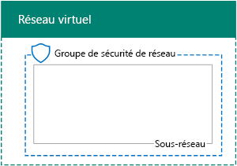
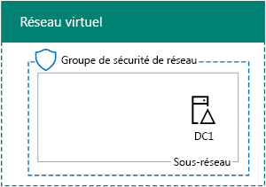
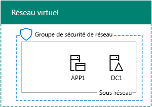

# <a name="base-configuration-devtest-environment"></a>Environnement de développement/test de configuration de base

 **Résumé :** Créer un intranet simplifié comme environnement de développement/test dans Microsoft Azure.
  
Cet article fournit des instructions détaillées pour créer l’environnement suivant de développement/test de configuration de base dans Azure :
  
**Figure 1 : L’environnement de développement/test Configuration de Base**


  
L’environnement de développement/test de Configuration de Base dans la Figure 1 se compose du sous-réseau de réseau d’entreprise dans un réseau de virtuel Azure cloud seule nommé labo de test qui simule un intranet simplifié, privé connecté à Internet. Il contient trois ordinateurs virtuels Azure exécutant WIndows Server 2016 :
  
- DC1 est configuré comme un contrôleur de domaine intranet et un serveur DNS (Domain Name System)
    
- APP1 est configuré comme un serveur web et une application générale
    
- 	CLIENT1 se comporte comme un client intranet
    
Cette configuration permet aux DC1, APP1, CLIENT1 et autres ordinateurs de sous-réseau du réseau d’entreprise d’être :  
  
- Connecté à Internet pour installer les mises à jour, accéder aux ressources Internet en temps réel et participer à des technologies de cloud public comme Microsoft Office 365 et d’autres services Azure.
    
- 	Gérés à distance à l’aide de connexions de bureau à distance depuis votre ordinateur qui est connecté à Internet ou au réseau de votre organisation.
    
Vous pouvez utiliser l’environnement de test résultant :
  
- Pour le développement d’applications et le test.
    
- Comme la configuration initiale d’un environnement de test de l’étendue de votre propre conception, qui inclut des ordinateurs virtuels supplémentaires, services Azure ou autres offres de nuage de Microsoft telles que Office 365 et sécurité d’entreprise + mobilité (EMS).
    
Il existe quatre phases de configuration de l’environnement de test de configuration de base dans Azure :
  
1. 	Créer le réseau virtuel
    
2. 	Configurer DC1
    
3. 	Configurer APP1
    
4. 	Configurer CLIENT1
    
Si vous ne disposez pas déjà d’un abonnement Azure, vous pouvez vous inscrire pour une évaluation gratuite sur [Azure d’essayer](https://azure.microsoft.com/pricing/free-trial/). Si vous avez un abonnement MSDN ou Visual Studio, reportez-vous à la section [crédit mensuel Azure pour les abonnés de Visual Studio](https://azure.microsoft.com/pricing/member-offers/msdn-benefits-details/).
  
> [!NOTE]
> Les machines virtuelles dans Azure entraînent un coût en cours lors de l’exécution. Ce coût est facturé par rapport à votre libre, MSDN d’essai ou payants. Pour plus d’informations sur les coûts de l’exécution des machines virtuelles Azure, consultez [Détails de la tarification des Machines virtuelles](https://azure.microsoft.com/pricing/details/virtual-machines/) et la [Calculatrice de tarification Azure](https://azure.microsoft.com/pricing/calculator/). Pour réduire les coûts, reportez-vous à la section [en minimisant les coûts de machines virtuelles environnement dans Azure](base-configuration-dev-test-environment.md#mincost). 
  

  
> [!TIP]
> Cliquez [ici](http://aka.ms/catlgstack) pour une carte visuelle de tous les articles dans la pile d’un Guide de laboratoire de Test Microsoft Cloud.
  
## <a name="phase-1-create-the-virtual-network"></a>Phase 1 : Créer le réseau virtuel

Tout d’abord, ouvrez une invite PowerShell Azure.
  
> [!NOTE]
> La commande suivante définit utiliser la dernière version de PowerShell d’Azure. Reportez-vous à la section [mise en route avec les applets de commande PowerShell d’Azure](https://docs.microsoft.com/en-us/powershell/azureps-cmdlets-docs/). 
  
Connectez-vous à votre compte Azure avec la commande suivante.
  
```
Login-AzureRMAccount
```

> [!TIP]
> Cliquez [ici](https://gallery.technet.microsoft.com/PowerShell-commands-for-ba957d3d) pour obtenir un fichier texte qui contient toutes les commandes de PowerShell dans cet article.
  
Obtenez le nom de votre abonnement à l’aide de la commande suivante.
  
```
Get-AzureRMSubscription | Sort Name | Select Name
```

Définissez votre abonnement Azure. Remplacez tout le texte entre guillemets, y compris les caractères < et >, avec le nom correct.
  
```
$subscr="<subscription name>"
Get-AzureRmSubscription -SubscriptionName $subscr | Select-AzureRmSubscription
```

Ensuite, créez un nouveau groupe de ressources pour votre laboratoire de test de configuration de base. Pour déterminer un nom de groupe de ressources unique, utilisez cette commande pour répertorier vos groupes de ressources existants.
  
```
Get-AzureRMResourceGroup | Sort ResourceGroupName | Select ResourceGroupName
```

Créez votre nouveau groupe de ressources avec ces commandes. Remplacez tout le texte entre guillemets, y compris les caractères < et >, par les noms corrects.
  
```
$rgName="<resource group name>"
$locName="<location name, such as West US>"
New-AzureRMResourceGroup -Name $rgName -Location $locName
```

Ensuite, créez le réseau virtuel TestLab qui hébergera le sous-réseau du réseau d’entreprise de la configuration de base et protégez-le avec un groupe de sécurité réseau.
  
```
$rgName="<name of your new resource group>"
$locName=(Get-AzureRmResourceGroup -Name $rgName).Location
$corpnetSubnet=New-AzureRMVirtualNetworkSubnetConfig -Name Corpnet -AddressPrefix 10.0.0.0/24
New-AzureRMVirtualNetwork -Name TestLab -ResourceGroupName $rgName -Location $locName -AddressPrefix 10.0.0.0/8 -Subnet $corpnetSubnet -DNSServer 10.0.0.4
$rule1=New-AzureRMNetworkSecurityRuleConfig -Name "RDPTraffic" -Description "Allow RDP to all VMs on the subnet" -Access Allow -Protocol Tcp -Direction Inbound -Priority 100 -SourceAddressPrefix Internet -SourcePortRange * -DestinationAddressPrefix * -DestinationPortRange 3389
New-AzureRMNetworkSecurityGroup -Name Corpnet -ResourceGroupName $rgName -Location $locName -SecurityRules $rule1
$vnet=Get-AzureRMVirtualNetwork -ResourceGroupName $rgName -Name TestLab
$nsg=Get-AzureRMNetworkSecurityGroup -Name Corpnet -ResourceGroupName $rgName
Set-AzureRMVirtualNetworkSubnetConfig -VirtualNetwork $vnet -Name Corpnet -AddressPrefix "10.0.0.0/24" -NetworkSecurityGroup $nsg
```

Il s’agit de votre configuration actuelle.
  

  
## <a name="phase-2-configure-dc1"></a>Phase 2 : Configurer DC1

Dans cette phase, nous créons la machine virtuelle DC1 et la configurons en tant que contrôleur de domaine pour le domaine Windows Server Active Directory (AD) corp.contoso.com et un serveur DNS pour les machines virtuelles du réseau virtuel TestLab.
  
Pour créer un ordinateur virtuel Azure pour DC1, indiquez le nom de votre groupe de ressources et exécuter ces commandes à l’invite de commande PowerShell de Azure sur votre ordinateur local.
  
```
$rgName="<resource group name>"
$locName=(Get-AzureRmResourceGroup -Name $rgName).Location
$vnet=Get-AzureRMVirtualNetwork -Name TestLab -ResourceGroupName $rgName
$pip=New-AzureRMPublicIpAddress -Name DC1-PIP -ResourceGroupName $rgName -Location $locName -AllocationMethod Dynamic
$nic=New-AzureRMNetworkInterface -Name DC1-NIC -ResourceGroupName $rgName -Location $locName -SubnetId $vnet.Subnets[0].Id -PublicIpAddressId $pip.Id -PrivateIpAddress 10.0.0.4
$vm=New-AzureRMVMConfig -VMName DC1 -VMSize Standard_A1
$cred=Get-Credential -Message "Type the name and password of the local administrator account for DC1."
$vm=Set-AzureRMVMOperatingSystem -VM $vm -Windows -ComputerName DC1 -Credential $cred -ProvisionVMAgent -EnableAutoUpdate
$vm=Set-AzureRMVMSourceImage -VM $vm -PublisherName MicrosoftWindowsServer -Offer WindowsServer -Skus 2016-Datacenter -Version "latest"
$vm=Add-AzureRMVMNetworkInterface -VM $vm -Id $nic.Id
$vm=Set-AzureRmVMOSDisk -VM $vm -Name "DC1-OS" -DiskSizeInGB 128 -CreateOption FromImage -StorageAccountType "StandardLRS"
$diskConfig=New-AzureRmDiskConfig -AccountType "StandardLRS" -Location $locName -CreateOption Empty -DiskSizeGB 20
$dataDisk1=New-AzureRmDisk -DiskName "DC1-DataDisk1" -Disk $diskConfig -ResourceGroupName $rgName
$vm=Add-AzureRmVMDataDisk -VM $vm -Name "DC1-DataDisk1" -CreateOption Attach -ManagedDiskId $dataDisk1.Id -Lun 1
New-AzureRMVM -ResourceGroupName $rgName -Location $locName -VM $vm
```

Vous serez invité à indiquer un nom d’utilisateur et un mot de passe pour le compte d’administrateur local sur DC1. Utilisez un mot de passe et enregistrez le nom et le mot de passe dans un endroit sûr.
  
Ensuite, connectez-vous à la machine virtuelle DC1.
  
### <a name="connect-to-dc1-using-local-administrator-account-credentials"></a>Se connecter à DC1 à l’aide des informations d’identification de compte Administrateur

1. Dans le [portail Azure](https://portal.azure.com), cliquez sur **les groupes de ressources >** [le nom de votre nouveau groupe de ressources] **> DC1 > Connect**.
    
2. Ouvrez le fichier DC1.rdp téléchargé, puis cliquez sur **se connecter**.
    
3. Spécifiez le nom du compte administrateur local DC1 :
    
  - Pour Windows 7 :
    
    Dans la boîte de dialogue **Sécurité de Windows** , cliquez sur **utiliser un autre compte**. Dans la zone **nom d’utilisateur**, tapez **DC1\\**[nom du compte administrateur Local].
    
  - Pour Windows 8 ou Windows 10 :
    
    Dans la boîte de dialogue **Sécurité de Windows** , cliquez sur **plus de choix**, puis cliquez sur **utiliser un compte différent**. Dans la zone **nom d’utilisateur**, tapez **DC1\\**[nom du compte administrateur Local].
    
4. Dans **mot de passe**, tapez le mot de passe du compte administrateur local, puis cliquez sur **OK**.
    
5. Lorsque vous y êtes invité, cliquez sur **Oui**.
    
Ensuite, ajoutez un disque de données supplémentaires sous la forme d’un nouveau volume avec la lettre de lecteur F: avec cette commande à une invite de commande Windows PowerShell au niveau de l’administrateur sur DC1.
  
```
Get-Disk | Where PartitionStyle -eq "RAW" | Initialize-Disk -PartitionStyle MBR -PassThru | New-Partition -AssignDriveLetter -UseMaximumSize | Format-Volume -FileSystem NTFS -NewFileSystemLabel "WSAD Data"
```

Ensuite, configurez DC1 comme un contrôleur de domaine et un serveur DNS pour le domaine corp.contoso.com. Exécutez ces commandes à l’invite de commande Windows PowerShell de niveau administrateur.
  
```
Install-WindowsFeature AD-Domain-Services -IncludeManagementTools
Install-ADDSForest -DomainName corp.contoso.com -DatabasePath "F:\NTDS" -SysvolPath "F:\SYSVOL" -LogPath "F:\Logs"
```

Vous devez spécifier un mot de passe administrateur en mode sans échec. Conservez ce mot de passe dans un endroit sûr.
  
Notez que l’exécution de ces commandes peut prendre quelques minutes.
  
Après le redémarrage de DC1, reconnectez-vous à la machine virtuelle DC1.
  
### <a name="connect-to-dc1-using-domain-credentials"></a>Se connecter à DC1 à l’aide des informations d’identification de domaine

1. Dans le [portail Azure](https://portal.azure.com), cliquez sur **les groupes de ressources >** [nom de votre groupe de ressources] **> DC1 > Connect**.
    
2. Exécutez le fichier DC1.rdp téléchargé, puis cliquez sur **se connecter**.
    
3. Dans la **Sécurité de Windows**, cliquez sur **utiliser un autre compte**. Dans la zone **nom d’utilisateur**, tapez **CORP\\**[nom du compte administrateur Local].
    
4. Dans **mot de passe**, tapez le mot de passe du compte administrateur local, puis cliquez sur **OK**.
    
5. Lorsque vous y êtes invité, cliquez sur **Oui**.
    
Ensuite, créez un compte d’utilisateur dans Active Directory qui sera utilisé lors de la connexion aux ordinateurs membres du domaine CORP. Exécutez cette commande à l’invite de commande Windows PowerShell de niveau administrateur.
  
```
New-ADUser -SamAccountName User1 -AccountPassword (read-host "Set user password" -assecurestring) -name "User1" -enabled $true -PasswordNeverExpires $true -ChangePasswordAtLogon $false
```

Notez que cette commande vous invite à indiquer le mot de passe du compte Utilisateur 1. Étant donné que ce compte est utilisé pour les connexions de bureau à distance pour tous les ordinateurs membres du domaine CORP, choisissez un mot de passe fort. Enregistrez le mot de passe du compte Utilisateur 1 et stockez-le dans un endroit sûr.
  
Ensuite, configurez le nouveau compte Utilisateur 1 en tant qu’Administrateur Entreprise. Exécutez cette commande à l’invite de commande Windows PowerShell de niveau administrateur.
  
```
Add-ADPrincipalGroupMembership -Identity "CN=User1,CN=Users,DC=corp,DC=contoso,DC=com" -MemberOf "CN=Enterprise Admins,CN=Users,DC=corp,DC=contoso,DC=com","CN=Domain Admins,CN=Users,DC=corp,DC=contoso,DC=com","CN=Schema Admins,CN=Users,DC=corp,DC=contoso,DC=com"
```

Fermez la session Bureau à distance avec DC1 et se reconnecter en utilisant le CORP\\compte utilisateur1.
  
Puis, pour autoriser le trafic pour l’outil Ping, exécutez cette commande à l’invite de commande Windows PowerShell de niveau administrateur.
  
```
Set-NetFirewallRule -DisplayName "File and Printer Sharing (Echo Request - ICMPv4-In)" -enabled True
```

Il s’agit de votre configuration actuelle.
  

  
## <a name="phase-3-configure-app1"></a>Phase 3 : Configurer APP1

APP1 fournit des services de partage de fichiers et des services web.

-> [!NOTE]  
-> Suivantes de commandes crée CLIENT1 exécutant Windows Server Datacenter 2016, qui peut être réalisé pour tous les types d’abonnements Azure. Si vous avez un abonnement Azure basé sur Visual Studio, vous pouvez créer le CLIENT1 10 de Windows en cours d’exécution avec le [portail Azure](https://portal.azure.com). 

Pour créer un ordinateur virtuel de Azure pour APP1, indiquez le nom de votre groupe de ressources et exécuter ces commandes à l’invite de commande PowerShell de Azure sur votre ordinateur local.
  
```
$rgName="<resource group name>"
$locName=(Get-AzureRmResourceGroup -Name $rgName).Location
$vnet=Get-AzureRMVirtualNetwork -Name TestLab -ResourceGroupName $rgName
$pip=New-AzureRMPublicIpAddress -Name APP1-PIP -ResourceGroupName $rgName -Location $locName -AllocationMethod Dynamic
$nic=New-AzureRMNetworkInterface -Name APP1-NIC -ResourceGroupName $rgName -Location $locName -SubnetId $vnet.Subnets[0].Id -PublicIpAddressId $pip.Id
$vm=New-AzureRMVMConfig -VMName APP1 -VMSize Standard_A1
$cred=Get-Credential -Message "Type the name and password of the local administrator account for APP1."
$vm=Set-AzureRMVMOperatingSystem -VM $vm -Windows -ComputerName APP1 -Credential $cred -ProvisionVMAgent -EnableAutoUpdate
$vm=Set-AzureRMVMSourceImage -VM $vm -PublisherName MicrosoftWindowsServer -Offer WindowsServer -Skus 2016-Datacenter -Version "latest"
$vm=Add-AzureRMVMNetworkInterface -VM $vm -Id $nic.Id
$vm=Set-AzureRmVMOSDisk -VM $vm -Name "APP1-OS" -DiskSizeInGB 128 -CreateOption FromImage -StorageAccountType "StandardLRS"
New-AzureRMVM -ResourceGroupName $rgName -Location $locName -VM $vm
```

Ensuite, connectez-vous à la machine virtuelle APP1 en utilisant le nom du compte Administrateur local APP1 et le mot de passe, et ouvrez une invite de commande Windows PowerShell.
  
Pour vérifier la communication réseau et la résolution de nom entre APP1 et DC1, exécutez la commande **ping dc1.corp.contoso.com** et vérifiez qu’il y a quatre réponses.
  
Ensuite, associez la machine virtuelle APP1 au domaine CORP avec ces commandes à l’invite Windows PowerShell.
  
```
Add-Computer -DomainName corp.contoso.com
Restart-Computer
```

Remarquez que vous devez fournir le CORP\\informations d’identification du compte de domaine utilisateur1 après l’exécution de la commande **Ajouter à un ordinateur** .
  
Après le redémarrage de APP1, se connecter à l’aide de l’entreprise\\compte utilisateur1 et puis ouvrez un Windows PowerShell de niveau administrateur invite de commande.
  
Transformez APP1 en serveur web avec cette commande à l’invite de commande Windows PowerShell sur APP1.
  
```
Install-WindowsFeature Web-WebServer -IncludeManagementTools
```

Ensuite, créez un dossier partagé et un fichier de texte dans le dossier sur APP1 avec ces commandes PowerShell.
  
```
New-Item -path c:\files -type directory
Write-Output "This is a shared file." | out-file c:\files\example.txt
New-SmbShare -name files -path c:\files -changeaccess CORP\User1
```

Il s’agit de votre configuration actuelle.
  

  
## <a name="phase-4-configure-client1"></a>Phase 4 : Configurer CLIENT1

CLIENT1 se comporte comme un ordinateur portable, une tablette ou un ordinateur de bureau classique sur l’intranet de Contoso.
  
Pour créer un ordinateur virtuel de Azure pour CLIENT1, indiquez le nom de votre groupe de ressources et exécuter ces commandes à l’invite de commande PowerShell de Azure sur votre ordinateur local.
  
```
$rgName="<resource group name>"
$locName=(Get-AzureRmResourceGroup -Name $rgName).Location
$vnet=Get-AzureRMVirtualNetwork -Name TestLab -ResourceGroupName $rgName
$pip=New-AzureRMPublicIpAddress -Name CLIENT1-PIP -ResourceGroupName $rgName -Location $locName -AllocationMethod Dynamic
$nic=New-AzureRMNetworkInterface -Name CLIENT1-NIC -ResourceGroupName $rgName -Location $locName -SubnetId $vnet.Subnets[0].Id -PublicIpAddressId $pip.Id
$vm=New-AzureRMVMConfig -VMName CLIENT1 -VMSize Standard_A1
$cred=Get-Credential -Message "Type the name and password of the local administrator account for CLIENT1."
$vm=Set-AzureRMVMOperatingSystem -VM $vm -Windows -ComputerName CLIENT1 -Credential $cred -ProvisionVMAgent -EnableAutoUpdate
$vm=Set-AzureRMVMSourceImage -VM $vm -PublisherName MicrosoftWindowsServer -Offer WindowsServer -Skus 2016-Datacenter -Version "latest"
$vm=Add-AzureRMVMNetworkInterface -VM $vm -Id $nic.Id
$vm=Set-AzureRmVMOSDisk -VM $vm -Name "CLIENT1-OS" -DiskSizeInGB 128 -CreateOption FromImage -StorageAccountType "StandardLRS"
New-AzureRMVM -ResourceGroupName $rgName -Location $locName -VM $vm
```

Ensuite, connectez-vous à la machine virtuelle CLIENT1 en utilisant le nom du compte Administrateur local CLIENT1 et le mot de passe, et ouvrez une invite de commande Windows PowerShell de niveau administrateur.
  
Pour vérifier la communication réseau et la résolution de nom entre CLIENT1 et DC1, exécutez la commande **ping dc1.corp.contoso.com** à l’invite de commande Windows PowerShell et vérifiez qu’il y a quatre réponses.
  
Ensuite, associez la machine virtuelle CLIENT1 au domaine CORP avec ces commandes à l’invite Windows PowerShell.
  
```
Add-Computer -DomainName corp.contoso.com
Restart-Computer
```

Remarquez que vous devez fournir votre CORP\\informations d’identification du compte de domaine utilisateur1 après l’exécution de la commande **Ajouter à un ordinateur** .
  
Après le redémarrage de CLIENT1, se connecter à l’aide de l’entreprise\\utilisateur1, nom de compte et mot de passe et puis ouvrez une invite de commandes Windows PowerShell au niveau de l’administrateur.
  
Ensuite, vérifiez que vous pouvez accéder aux ressources web et de partage de fichiers sur APP1 de CLIENT1.
  
### <a name="verify-client-access-to-app1"></a>Vérifier l’accès de CLIENT à APP1

1. Dans le Gestionnaire de serveur, dans le volet d’arborescence, cliquez sur **Le serveur Local**.
    
2. Dans **Propriétés de CLIENT1**, cliquez **sur** en regard de **La Configuration de sécurité renforcée d’Internet Explorer**.
    
3. Dans **La Configuration de sécurité renforcée d’Internet Explorer**, cliquez sur **désactivé** pour **les administrateurs** et **les utilisateurs**, puis cliquez sur **OK**.
    
4. À partir de l’écran de démarrage, cliquez sur **Internet Explorer**, puis cliquez sur **OK**.
    
5. Dans la barre d’adresses, tapez **http://app1.corp.contoso.com/**, puis appuyez sur ENTRÉE. Vous devez voir la page web de services Internet (IIS) par défaut pour APP1.
    
6. Dans la barre des tâches du bureau, cliquez sur l’icône de l’Explorateur de fichiers.
    
7. Dans la barre d’adresses, tapez ** \\ \\app1\\fichiers**, puis appuyez sur ENTRÉE. Vous devriez voir une fenêtre de dossier avec le contenu du dossier fichiers partagé.
    
8. Dans la fenêtre de dossier partagé **les fichiers** , double-cliquez sur le fichier **exemple.txt** . Vous devriez voir le contenu du fichier exemple.txt.
    
9. Fermez **exemple.txt - Bloc-notes** et les fenêtres de dossier de **fichiers** partagés.
    
Il s’agit de votre configuration finale.
  

  
Votre configuration de base dans Azure est maintenant prête pour le développement et le test d’applications ou pour générer des environnements de test supplémentaires. 
  
> [!TIP]
> Cliquez [ici](http://aka.ms/catlgstack) pour afficher le plan de tous les articles du jeu de guides de laboratoire de test de Microsoft Cloud.
  
<a name="mincost"> </a>
## <a name="minimizing-the-costs-of-test-environment-virtual-machines-in-azure"></a>Réduire les coûts des machines virtuelles d’environnement de test dans Azure

Pour réduire les coûts d’utilisation des machines virtuelles d’environnement de test, vous pouvez effectuer l’une des opérations suivantes :
  
- Créez l’environnement de test et exécutez les tests et démonstrations nécessaires aussi rapidement que possible. Lorsque vous avez terminé, supprimez le groupe de ressources pour l’environnement de test.
    
- 	Arrêtez vos machines virtuelles d’environnement de test et mettez-les dans un état déchargé.
    
Pour arrêter les machines virtuelles avec Azure PowerShell, indiquez le nom du groupe de ressources et exécutez ces commandes.
  
```
$rgName="<your resource group name>"
Stop-AzureRMVM -ResourceGroupName $rgName -Name "CLIENT1" -Force
Stop-AzureRMVM -ResourceGroupName $rgName -Name "APP1" -Force
Stop-AzureRMVM -ResourceGroupName $rgName -Name "DC1" -Force
```

Pour vérifier que vos machines virtuelles fonctionnent correctement lorsque vous les démarrez toutes depuis l’état arrêté (déchargé), vous devez les démarrer dans l’ordre suivant :
  
1. DC1
2. APP1
3. CLIENT1
    
Pour démarrer les machines virtuelles dans l’ordre dans Azure PowerShell, indiquez le nom du groupe de ressources et exécutez ces commandes.
  
```
$rgName="<your resource group name>"
Start-AzureRMVM -ResourceGroupName $rgName -Name "DC1"
Start-AzureRMVM -ResourceGroupName $rgName -Name "APP1"
Start-AzureRMVM -ResourceGroupName $rgName -Name "CLIENT1"
```

## <a name="see-also"></a>Voir aussi

- [Environnement de développement/test Office 365](office-365-dev-test-environment.md)
- [DirSync pour votre environnement de développement/test Office 365](dirsync-for-your-office-365-dev-test-environment.md)
- [Application du nuage sécurité pour votre environnement de développement/test d’Office 365](cloud-app-security-for-your-office-365-dev-test-environment.md)
- [Avancées de protection contre les menaces pour votre environnement de développement/test d’Office 365](advanced-threat-protection-for-your-office-365-dev-test-environment.md)
- [Adoption du cloud et solutions hybrides](cloud-adoption-and-hybrid-solutions.md)
