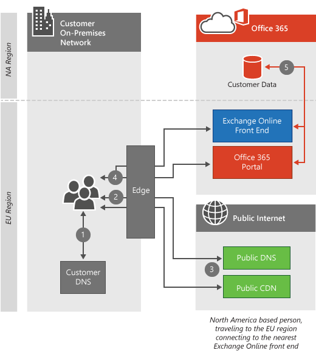

# Connectivité client

 **Résumé :** Explique comment les ordinateurs clients se connectent aux clients Office 365, en fonction de l’emplacement de l’ordinateur client et du centre de donnes client Office 365.
  
Office 365 réside dans les centres de connaissances Microsoft dans le monde entier, ce qui permet de maintenir le service opérationnel même en cas de problème majeur dans une région, comme un tremblement de terre ou une coupure de courant. Lorsque vous vous connectez à votre client Office 365, la connexion client est dirigée vers le centre de donnée approprié où votre client est hébergé. Les règles qui déterminent l’emplacement où votre client peut être hébergé sont définies par votre accord avec Microsoft. Les règles qui déterminent la façon dont votre client acquiert les données à partir de cet emplacement de centre de données dépendent de l’architecture du service que vous utilisez.
  
Par exemple, lorsque vous vous connectez au portail Office 365, vous êtes généralement connecté au centre de services le plus proche sur le client, puis dirigé en fonction du service que vous utilisez ensuite. Si vous lancez le courrier électronique, la connexion initiale pour afficher l’interface utilisateur peut toujours provenir du centre de données le plus proche, mais une seconde connexion peut être ouverte entre le centre de données le plus proche et le centre de données où votre client est situé pour vous montrer ce qui se trouve dans les messages électroniques que vous lisez. Microsoft agit de l’un des dix réseaux les plus fréquents dans le monde entier, ce qui se traduit par des connexions très rapides.
  
Une fois que vous avez lu l’article, vous comprendrez probablement pourquoi nous ne fournissons pas d' [URL et de plages d’adresses IP Office 365](https://support.office.com/article/8548a211-3fe7-47cb-abb1-355ea5aa88a2) par centre de contenu, mais ils sont tout simplement interconnectés et tributaires les uns des autres pour rendre cela possible.
  
Si vous utilisez Azure ExpressRoute pour Office 365, dans la plupart des cas, votre connectivité passe par une connexion privée à Office 365 au lieu de la connexion publique décrite ici. Les principes de connexion des clients sont toujours précis. En savoir plus sur [Azure ExpressRoute pour Office 365](azure-expressroute.md).
  
Pour plus de détails sur les demandes de réseau Skype entreprise, lisez l’article [Media Quality and Network Connectivity performance in Skype for Business Online](https://support.office.com/article/Media-Quality-and-Network-Connectivity-Performance-in-Skype-for-Business-Online-5fe3e01b-34cf-44e0-b897-b0b2a83f0917).

||
|:-----|
| Cet article fait partie de la [planification réseau et du réglage des performances pour Office 365](https://aka.ms/tune).|

> [!NOTE]
> Nous sommes très vigilants pour gérer les données client afin qu’elles soient sécurisées et confidentielles dans nos centres de données. Des détails sur les étapes nécessaires à la gestion de la confidentialité sont inclus dans le [Centre](https://go.microsoft.com/fwlink/?LinkID=397383)de gestion de la confidentialité.
  
## Connexion au centre de centre le plus proche

Il s’agit du type de connexion le plus courant, qui est utilisé par le portail Office 365 et Exchange Online. Dans ce cas, lorsque les clients tentent de se connecter à Office 365, la requête DNS de leur ordinateur détermine la région du monde à partir duquel provient son ordinateur et Office 365 redirige la demande vers le centre de contenu le plus proche.
  
Les connexions au portail s’arrêtent au centre de données le plus proche et l’ordinateur client reçoit des informations sur le client à partir de cet emplacement.
  
Exchange Online va plus en avant. Une fois que l’ordinateur client est connecté au centre de centre le plus proche, un serveur Exchange Server de ce centre de contenu se connecte au centre de contenu où se trouve réellement le client, comme illustré dans la *section How do this work* . Les serveurs Exchange Online situés dans le centre de services le plus proche transversent les requêtes de l’ordinateur client vers le serveur de boîtes aux lettres. Cela accélère l’expérience de l’ordinateur client en démontant le travail important d’extraction des courriers électroniques et des éléments de calendrier vers le réseau Microsoft.
  
## Comment cela fonctionne-t-il pour les offres Cloud standard ?

Ce processus de connexion est standard pour le trafic élevé, les applications Web à valeur élevée comme Office 365. Dans cette section, nous allons décrire et illustrer les étapes du processus. Lorsque l’ordinateur client ne se trouve pas dans la même région que le client, la connexion semble très différente en fonction du service auquel le client se connecte.
  
 Ce diagramme illustre un client utilisant une offre Office 365 standard avec un client en Amérique du Nord. Dans ce scénario, la personne à l’origine de la demande est parcourue en Europe et utilise Office 365 à partir de cet emplacement.
  
1. L’ordinateur client demande aux serveurs DNS locaux l’adresse IP associée à Office 365.

2. Les serveurs DNS locaux de l’ordinateur client demandent aux serveurs DNS de Microsoft l’adresse IP associée à Office 365.

3. Les serveurs DNS de Microsoft renvoient le nom du serveur régional (en fonction de l’emplacement des serveurs DNS du client), et l’ordinateur client répète les étapes 1 et 2 pour obtenir l’adresse IP du centre de ressources Office 365.

4. L’ordinateur client se connecte à l’adresse IP de datacenter régional.

5. Les serveurs Exchange Online établissent une connexion au centre de gestion actif où réside le client du client.

  
## Comment cela fonctionne-t-il pour les offres de cloud Souverain ?

Cette connexion est légèrement différente pour les offres de cloud Souverain telles qu’Office 365 géré par 21 VIANET. Avec le client dans une instance souveraine d’Office 365, les serveurs Office 365 les plus proches qui accepteront les connexions du portail sont les serveurs de la région souverain où réside le client. De même, les clients qui accèdent à SharePoint Online dans notre Cloud souverain ou nos offres standard seront dirigés vers les serveurs frontaux où réside le client. Consultez la rubrique connexion à Active Datacenter ci-dessous.
  
1. L’ordinateur client demande aux serveurs DNS locaux l’adresse IP associée à Office 365.

2. Les serveurs DNS locaux de l’ordinateur client demandent aux serveurs DNS de Microsoft l’adresse IP associée à Office 365.

3. Les serveurs DNS de Microsoft renvoient le nom du serveur régional (en fonction de l’emplacement des serveurs DNS du client), et l’ordinateur client répète les étapes 1 et 2 pour obtenir l’adresse IP du centre de ressources Office 365.

4. L’ordinateur client se connecte à l’adresse IP de datacenter régional.

5. Les serveurs Exchange Online établissent une connexion au centre de gestion actif où réside le client du client.

  
## Connexion au centre de centre actif

La connexion au centre de données actif est conçue pour les charges de travail de transfert de données plus lourdes et est actuellement utilisée par SharePoint Online. Dans ce cas, lorsque les clients tentent de se connecter à Office 365, leur navigateur est redirigé vers le centre de contenu actif pour leur client SharePoint Online.
  
## Comment cela fonctionne-t-il ?

Lorsque l’ordinateur client se connecte à SharePoint Online à partir d’une autre région, la connexion est redirigée vers le centre de contenu SharePoint Online actif. Dans ce scénario, le client utilise une offre standard, ce qui entraîne le reste de la connexion au portail local et la direction des connexions SharePoint Online vers le centre de contenu actif.
  
1. L’ordinateur client demande aux serveurs DNS locaux l’adresse IP associée à Office 365.

2. Les serveurs DNS locaux de l’ordinateur client demandent aux serveurs DNS de Microsoft l’adresse IP associée à Office 365.

3. Les serveurs DNS de Microsoft renvoient le nom de serveur du centre de ressources SharePoint Online actif (en fonction de l’emplacement du client Office 365 client), et l’ordinateur client répète les étapes 1 et 2 pour obtenir l’adresse IP du centre de ressources Office 365 actif.

4. L’ordinateur client se connecte à l’adresse IP du centre de de l’activité active.

  
## Connexion sur des réseaux privés virtuels (VPN)

Ce type de connexion s’applique uniquement lorsqu’un réseau privé virtuel (VPN) est utilisé par des ordinateurs clients. En réalité, le comportement d’Office 365 n’est pas modifié simplement en raison de l’utilisation d’un VPN, mais les VPN sont généralement utilisés pour contrôler la façon dont les ordinateurs clients établissent des connexions à Office 365 et entraînent généralement une dégradation de l’expérience, c’est pourquoi il est important de les aborder.
  
## Comment cela fonctionne-t-il ?

Lorsque l’ordinateur client établit une connexion VPN à un bureau d’entreprise situé dans une autre région, les serveurs DNS de ce bureau sont utilisés à la place des serveurs DNS de l’emplacement de l’ordinateur client. Dans la plupart des cas, cette connexion supplémentaire sur le réseau privé virtuel (VPN) dégradera l’expérience Office 365. Les services Office 365 sont optimisés pour traiter les connexions des clients aussi près que possible de l’utilisateur final. De nombreux services exploitent le réseau Edge Azure, les réseaux de distribution de contenu et la capacité réseau fiable sur le réseau Microsoft pour offrir une expérience utilisateur optimale lorsque des demandes réseau pour les services Office 365 sont apportées à proximité de l’ordinateur client. que possible.
  
1. L’ordinateur client demande aux serveurs DNS VPN l’adresse IP associée à Office 365.

2. Les serveurs DNS VPN de l’ordinateur client demandent aux serveurs DNS de Microsoft l’adresse IP associée à Office 365.

3. Les serveurs DNS de Microsoft renvoient le nom du serveur régional (en fonction de l’emplacement des serveurs DNS VPN) et l’ordinateur client répète les étapes 1 et 2 pour obtenir les informations d’adresse IP du centre de données Office 365 régional.

4. L’ordinateur client se connecte à l’adresse IP du centre de contenu le plus proche du Bureau d’entreprise auprès duquel il a établi une connexion VPN.

  
Voici un bref lien que vous pouvez utiliser pour revenir : [https://aka.ms/o365clientconnectivity](https://aka.ms/o365clientconnectivity)
  
## Voir aussi

[Gestion des points de terminaison Office 365](https://support.office.com/article/99cab9d4-ef59-4207-9f2b-3728eb46bf9a)
  
[Évaluation de la connectivité réseau Office 365](assessing-network-connectivity.md)
