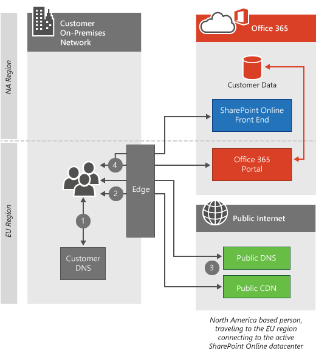

# Connectivité client

 **Résumé :** Explique comment les ordinateurs clients se connectent aux clients Office 365, selon l’emplacement de l’ordinateur client et du centre de données client d’Office 365.
  
Office 365 réside dans les centres de données Microsoft dans le monde entier qui assurent le service et en cours d’exécution même lorsqu’il existe un problème majeur dans une région, par exemple un séisme ou une panne de courant. Lorsque vous vous connectez à votre client Office 365, la connexion du client est redirigée vers le centre de données appropriée hébergeant votre client. Les règles qui déterminent l’hébergement de votre client sont définis par votre contrat avec Microsoft. Les règles qui déterminent la façon dont votre client acquiert les données à partir de cet emplacement du centre de données dépendent de l’architecture du service que vous utilisez.
  
Par exemple, lorsque vous ouvrez une session sur le portail Office 365, vous êtes généralement connecté au centre de données le plus proche pour le client et dirigées selon le service que vous utilisez suivant. Si vous lancez le courrier électronique, la connexion initiale à afficher l’interface utilisateur peut quand même provenir du centre de données le plus proche, mais une deuxième connexion peut être ouvert entre le centre de données le plus proche et le centre de données où se trouve votre client à afficher est dans les courriers électroniques lire. Microsoft dirige l’un des dix réseaux principales dans le monde résultant dans Connexions très rapide de centre de données-datacenter rapides.
  
Après avoir lu l’article, vous aurez probablement comprendre pourquoi nous ne fournissent pas [les plages d’adresses IP et Office 365 URL](https://support.office.com/article/8548a211-3fe7-47cb-abb1-355ea5aa88a2) par centre de données, ils sont simplement trop interconnexion et dépend de l’autre pour être que possible.
  
Si vous utilisez ExpressRoute Azure pour Office 365, dans la plupart des cas, votre connectivity est acheminés via une connexion privée Office 365 au lieu de la connexion publique décrite ici. Les principes sur le mode de connexion des clients sont toujours précis. En savoir plus sur [ExpressRoute Azure pour Office 365](azure-expressroute.md).
  
Pour approfondir sur Skype pour les demandes de réseau d’entreprise, consultez l’article de [la qualité des médias et des performances pour la connectivité réseau dans Skype pour Business Online](https://support.office.com/article/Media-Quality-and-Network-Connectivity-Performance-in-Skype-for-Business-Online-5fe3e01b-34cf-44e0-b897-b0b2a83f0917).

||
|:-----|
| Cet article fait partie de la [planification de réseau et de réglage des performances pour Office 365](https://aka.ms/tune).|

> [!NOTE]
> Nous prenons précaution pour gérer les données du client afin qu’il soit sécurisé et privées dans nos centres de données. Plus d’informations sur les étapes à que réaliser pour gérer la confidentialité sont inclus dans le [Centre de gestion de la confidentialité](https://go.microsoft.com/fwlink/?LinkID=397383).
  
## Connexion au centre de données le plus proche

Il s’agit du type de connexion les plus courantes, et il est utilisé par le portail Office 365 et Exchange Online. Dans ce cas, lorsque les clients tentent de se connecter à Office 365, requête DNS de leur ordinateur détermine la région du monde que provenant de leur ordinateur et Office 365 redirige la demande vers le centre de données le plus proche.
  
Connexions au portail arrêtez au centre de données plus proche, et l’ordinateur client est présenté avec des informations sur le client du client à partir de cet emplacement.
  
Exchange Online est une étape supplémentaire. Une fois l’ordinateur client est connecté au centre de données le plus proche, un serveur Exchange dans ce centre de données se connecte au centre de données où se trouve comme illustré dans le client le *comment cela fonctionne section* ci-dessous. Les serveurs Exchange Online dans le centre de données le plus proche puis proxy les demandes à partir de l’ordinateur client au serveur de boîtes aux lettres. Cela accélère l’expérience de l’ordinateur client en déplaçant l’essentiel de la récupération des messages électroniques et les éléments de calendrier pour le réseau Microsoft.
  
## Comment cela fonctionne pour les offres de cloud standard ?

Ce processus de connexion est standard pour un trafic élevé, les applications web haute valeur comme Office 365. Dans cette section, nous hiérarchique et illustrent les étapes du processus. Lorsque l’ordinateur client n’est pas dans la même région en tant que le client, la connexion de recherche très différente en fonction du service que client se connecte.
  
 Ce diagramme illustre un client à l’aide d’une offre Office 365 standard avec un client en Amérique du Nord. Dans ce scénario, la personne qui effectue la demande de déplacement pour l’Europe et utilise Office 365 à partir de cet emplacement.
  
1. L’ordinateur client demande aux serveurs DNS locaux l’adresse IP associée à Office 365.

2. Serveurs DNS locaux de l’ordinateur client demandent aux serveurs DNS de Microsoft pour l’adresse IP associée à Office 365.

3. Les serveurs DNS de Microsoft renvoient le nom du serveur local (basé sur l’emplacement des serveurs DNS du client) et l’ordinateur client répète les étapes 1 et 2 pour obtenir l’adresse IP du centre de données Office 365 régionaux.

4. L’ordinateur client se connecte à l’adresse IP du centre de données régional.

5. Les serveurs Exchange Online établissent une connexion au centre de données actif où réside le client du client.

  
## Comment ce travail pour souverains cloud des offres ?

Cette connexion est légèrement différente pour les offres de cloud souverains, tels qu’Office 365 exploité par 21 Vianet. Avec client dans une instance souverain d’Office 365, les serveurs Office 365 le plus proche qui acceptent les connexions portails sont les serveurs dans la région souveraine où réside le client. De même, les clients de l’accès à SharePoint Online dans notre souverains ou offres standards seront redirigés vers les serveurs frontaux où réside le client. Voir connexion au centre de données active ci-dessous.
  
1. L’ordinateur client demande aux serveurs DNS locaux l’adresse IP associée à Office 365.

2. Serveurs DNS locaux de l’ordinateur client demandent aux serveurs DNS de Microsoft pour l’adresse IP associée à Office 365.

3. Les serveurs DNS de Microsoft renvoient le nom du serveur local (basé sur l’emplacement des serveurs DNS du client) et l’ordinateur client répète les étapes 1 et 2 pour obtenir l’adresse IP du centre de données Office 365 régionaux.

4. L’ordinateur client se connecte à l’adresse IP du centre de données régional.

5. Les serveurs Exchange Online établissent une connexion au centre de données actif où réside le client du client.

  
## Connexion au centre de données actif

Connexion au centre de données active est conçu pour les charges de transfert de données plus importante et actuellement utilisé par SharePoint Online. Dans ce cas, lorsque les clients tentent de se connecter à Office 365, son navigateur est redirigé vers le centre de données active pour leurs clients SharePoint Online.
  
## Comment cela fonctionne-t-il ?

Lorsque l’ordinateur client se connecte à SharePoint Online à partir d’une région différente, la connexion est redirigée vers le centre de données SharePoint Online active. Dans ce scénario, le client utilise une norme offrant, ce qui les connexions portails restant local et les connexions de SharePoint Online est dirigées vers le centre de données active.
  
1. L’ordinateur client demande aux serveurs DNS locaux l’adresse IP associée à Office 365.

2. Serveurs DNS locaux de l’ordinateur client demandent aux serveurs DNS de Microsoft pour l’adresse IP associée à Office 365.

3. Les serveurs DNS de Microsoft renvoient le nom du serveur de SharePoint Online Centre de données actif (basé sur l’emplacement du client d’Office 365 du client) et l’ordinateur client répète les étapes 1 et 2 pour obtenir l’adresse IP du centre de données Office 365 active.

4. L’ordinateur client se connecte à l’adresse IP du centre de données actif.

  
## Connexion sur des réseaux privés virtuels (VPN)

Ce type de connexion s’applique uniquement lorsqu’un réseau privé virtuel (VPN) est utilisé par les ordinateurs clients. En réalité, le comportement d’Office 365 n’est pas modifié simplement comme un VPN est utilisé, mais VPN sont couramment utilisés pour contrôler comment les ordinateurs clients établissent des connexions vers Office 365 et généralement les résultats dans une expérience de dégradé, il est donc important couvrir.
  
## Comment cela fonctionne-t-il ?

Lorsque l’ordinateur client établit une connexion VPN avec un réseau d’entreprise dans une région différente, les serveurs DNS qu’office sont utilisés au lieu des serveurs DNS de l’emplacement de l’ordinateur client. Dans la plupart des cas, cette connexion supplémentaire sur le réseau privé virtuel entraîne une dégradation l’expérience Office 365. Les services Office 365 sont optimisées pour les connexions client de service en tant que proche de l’utilisateur final que possible. Tirer parti de nombreux services du réseau de périphérie Azure, les réseaux de distribution de contenu et la capacité du réseau fiable sur le réseau Microsoft pour fournir la meilleure expérience possible lorsque des requêtes de réseau pour les services Office 365 aussi proche de l’ordinateur client que possible.
  
1. L’ordinateur client demande des serveurs DNS VPN pour l’adresse IP associée à Office 365.

2. Serveurs DNS VPN de l’ordinateur client demandent aux serveurs DNS de Microsoft pour l’adresse IP associée à Office 365.

3. Les serveurs DNS de Microsoft renvoient le nom du serveur local (basé sur l’emplacement des serveurs DNS VPN) et l’ordinateur client répète les étapes 1 et 2 pour obtenir les informations d’adresse IP du centre de données Office 365 régionaux.

4. L’ordinateur client connecte au centre de données adresse IP qui est le plus proche du siège que lequel il a établi une connexion VPN.

  
Voici un lien court, que vous pouvez utiliser pour revenir :[https://aka.ms/o365clientconnectivity](https://aka.ms/o365clientconnectivity)
  
## Voir aussi

[Gestion des points de terminaison Office 365](https://support.office.com/article/99cab9d4-ef59-4207-9f2b-3728eb46bf9a)
  
[Connectivité réseau à Office 365](network-connectivity.md)
