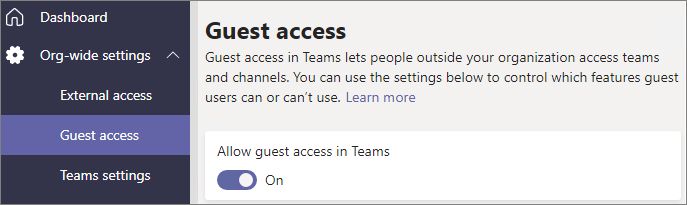

# Collaborer avec des invités dans une équipeCollaborate with guests in a team

Si vous avez besoin de collaborer avec des invités dans des documents, des tâches et des conversations, nous vous recommandons d’utiliser Microsoft Teams.If you need to collaborate with guests across documents, tasks, and conversations, we recommend using Microsoft Teams. Teams fournit toutes les fonctionnalités de collaboration disponibles dans Office et SharePoint avec conversation permanente et un ensemble d’outils de collaboration personnalisable et extensible dans une expérience utilisateur unifiée.Teams provides all of the collaboration features available in Office and SharePoint with persistent chat and a customizable and extensible set of collaboration tools in a unified user experience.

Dans cet article, nous allons passer en revue les étapes de configuration de Microsoft 365 nécessaires pour configurer une équipe de collaboration avec des invités.In this article, we'll walk through the Microsoft 365 configuration steps necessary to set up a team for collaboration with guests.

## Paramètres Azure de relations organisationnellesAzure Organizational relationships settings

Le partage dans Microsoft 365 est régi par les paramètres de relations organisationnelles dans Azure Active Directory.Sharing in Microsoft 365 is governed at its highest level by the organizational relationships settings in Azure Active Directory. Si le partage d’invités est désactivé ou restreint dans Azure AD, cela remplace tous les paramètres de partage que vous configurez dans Microsoft 365.If guest sharing is disabled or restricted in Azure AD, this will override any sharing settings that you configure in Microsoft 365.

Vérifiez les paramètres de relations organisationnelles pour vous assurer que le partage avec des invités n’est pas bloqué.Check the organizational relationships settings to ensure that sharing with guests is not blocked.

Pour définir les paramètres de relation organisationnelleTo set organizational relationship settings

1. Connectez-vous à Microsoft Azure [https://portal.azure.com](https://portal.azure.com)à l’adresse.Log in to Microsoft Azure at [https://portal.azure.com](https://portal.azure.com).
2. Dans le volet de navigation de gauche, cliquez sur **Azure Active Directory**.In the left navigation, click **Azure Active Directory**.
3. Dans le volet de **vue d’ensemble** , cliquez sur **relations organisationnelles**.In the **Overview** pane, click **Organizational relationships**.
4. Dans le volet **relations organisationnelles** , cliquez sur **paramètres**.In the **Organizational relationships** pane, click **Settings**.
5. Assurez-vous que les **administrateurs et les utilisateurs du rôle d’invité invité peuvent inviter** et que les **membres peuvent inviter** sont tous deux la valeur **Oui**.Ensure that **Admins and users in the guest inviter role can invite** and **Members can invite** are both set to **Yes**.
6. Si vous avez apporté des modifications, cliquez sur **Enregistrer**.If you made changes, click **Save**.

Notez les paramètres dans la section **restrictions de collaboration** .Note the settings in the **Collaboration restrictions** section. Assurez-vous que les domaines des invités avec lesquels vous souhaitez collaborer ne sont pas bloqués.Make sure that the domains of the guests that you want to collaborate with aren't blocked.

## Paramètres d’accès invité de teamsTeams guest access settings

Teams dispose d’un commutateur maître/inactif pour l’accès invité et de divers paramètres permettant de contrôler ce que les invités peuvent faire dans une équipe.Teams has a master on/off switch for guest access and a variety of settings available to control what guests can do in a team. Le commutateur maître, **autoriser l’accès invité dans teams** doit être **activé** pour que l’accès invité fonctionne dans Teams.The master switch, **Allow guest access in Teams** must be **On** for guest access to work in Teams.

Vérifiez que l’accès invité est activé dans teams et effectuez les ajustements nécessaires aux paramètres invités en fonction des besoins de votre entreprise.Check to ensure that guest access is enabled in Teams and make any adjustment to the guest settings based on your business needs. N’oubliez pas que ces paramètres affectent toutes les équipes.Keep in mind that these settings affect all teams.

Pour définir les paramètres d’accès invité aux équipesTo set Teams guest access settings

1. Connectez-vous au centre d’administration Microsoft 365 [https://admin.microsoft.com](https://admin.microsoft.com)à l’adresse.Log in to the Microsoft 365 admin center at [https://admin.microsoft.com](https://admin.microsoft.com).
2. Dans le volet de navigation de gauche, cliquez sur **Afficher tout**.In the left navigation, click **Show all**.
3. Sous **centres d’administration**, cliquez sur **équipes**.Under **Admin centers**, click **Teams**.
4. Dans le centre d’administration Teams, dans le volet de navigation de gauche, développez Paramètres à l’échelle de l' **organisation** , puis cliquez sur **accès invité**.In the Teams admin center, in the left navigation, expand **Org-wide settings** and click **Guest access**.
5. Assurez-vous que **l’autorisation autoriser l’accès invité dans teams** est **activée.**Ensure that **Allow guest access in Teams** is set to **On**.
6. Effectuez toutes les modifications souhaitées dans les paramètres d’invité supplémentaires, puis cliquez sur **Enregistrer**.Make any desired changes to the additional guest settings, and then click **Save**.

> [!NOTE]
> Le paramètre invité de teams peut prendre jusqu’à vingt-quatre heures après son activation.It may take up to twenty-four hours for the Teams guest setting to become active after you turn it on.

## Les paramètres invités des groupes Office 365Office 365 Groups guest settings

Teams utilise les groupes Office 365 pour les membres de l’équipe.Teams uses Office 365 Groups for team membership. Les paramètres invités des groupes Office 365 doivent être activés pour que l’accès invité dans teams puisse fonctionner.The Office 365 Groups guest settings must be turned on in order for guest access in Teams to work.

Pour définir les paramètres invités des groupes Office 365To set Office 365 Groups guest settings

1. Dans le centre d’administration Microsoft 365, dans le volet de navigation de gauche, développez **paramètres**.In the Microsoft 365 admin center, in the left navigation, expand **Settings**.
2. Cliquez sur **Services & compléments**.Click **Services & add-ins**.
3. Dans la liste, cliquez sur **groupes Office 365**.In the list, click **Office 365 Groups**.
4. Assurez-vous que les **membres de groupe Let en dehors de votre organisation accèdent au contenu de groupe** et que les **propriétaires de groupes ajoutent des personnes en dehors de votre organisation aux** cases à cocher sont activées.Ensure that the **Let group members outside your organization access group content** and **Let group owners add people outside your organization to groups** check boxes are both checked.
5. Si vous avez apporté des modifications, cliquez sur **enregistrer les modifications**.If you made changes, click **Save changes**.

## Paramètres de partage au niveau de l’organisation SharePointSharePoint organization level sharing settings

Pour que les invités aient accès aux fichiers dans Teams, les paramètres de partage au niveau de l’organisation SharePoint doivent autoriser le partage avec des invités.In order for guests to have access to files in Teams, the SharePoint organization-level sharing settings must allow for sharing with guests.

Les paramètres au niveau de l’organisation déterminent les paramètres disponibles pour des sites individuels, y compris les sites associés à Teams.The organization-level settings determine what settings are available for individual sites, including sites associated with teams. Les paramètres de site ne peuvent pas être plus permissants que les paramètres au niveau de l’organisation.Site settings cannot be more permissive than the organization-level settings.

Si vous souhaitez autoriser le partage de fichiers et de dossiers avec des utilisateurs anonymes, sélectionnez **tout le monde**.If you want to allow file and folder sharing with anonymous users, choose **Anyone**. Si vous souhaitez vous assurer que tous les invités doivent s’authentifier, choisissez **nouveau et invités existants**.If you want to ensure that all guests have to authenticate, choose **New and existing guests**. Choisissez le paramètre le plus permissif qui sera nécessaire pour tous les sites de votre organisation.Choose the most permissive setting that will be needed by any site in your organization.

Pour définir les paramètres de partage au niveau de l’organisation SharePointTo set SharePoint organization level sharing settings

1. Dans le centre d’administration 365 de Microsoft, dans le volet de navigation de gauche, sous **centres d’administration**, cliquez sur **SharePoint**.In the Microsoft 365 admin center, in the left navigation, under **Admin centers**, click **SharePoint**.
2. Dans le centre d’administration SharePoint, dans le volet de navigation de gauche, cliquez sur **partage**.In the SharePoint admin center, in the left navigation, click **Sharing**.
3. Assurez-vous que le partage externe pour SharePoint est défini sur **tout le monde** ou sur **des invités nouveaux et existants**.Ensure that external sharing for SharePoint is set to **Anyone** or **New and existing guests**.
4. Si vous avez apporté des modifications, cliquez sur **Enregistrer**.If you made changes, click **Save**.

## Paramètres de lien par défaut au niveau de l’organisation SharePointSharePoint organization level default link settings

Les paramètres de lien de fichier et de dossier par défaut déterminent l’option de lien qui est présentée par défaut à l’utilisateur lorsqu’il partage un fichier ou un dossier.The default file and folder link settings determine which link option is shown to the user by default when they share a file or folder. Les utilisateurs peuvent remplacer le type de lien par l’une des autres options avant de procéder au partage si vous le souhaitez.Users can change the link type to one of the other options before sharing if desired.

N’oubliez pas que ce paramètre affecte toutes les équipes et tous les sites SharePoint de votre organisation.Keep in mind that this setting affects all teams and SharePoint sites in your organization.

Choisissez le type de lien sélectionné par défaut lorsque les utilisateurs partagent des fichiers et des dossiers :Choose the type of link that's selected by default when users share files and folders:

- **Toute personne disposant du lien** : choisissez cette option si vous envisagez de partager un grand nombre de fichiers et de dossiers avec des utilisateurs anonymes.**Anyone with the link** - Choose this option if you expect to share a lot of files and folders with anonymous users. Si vous souhaitez autoriser les liens de *tous les utilisateurs* mais s’inquiète du partage anonyme accidentel, envisagez l’une des autres options par défaut.If you want to allow *Anyone* links but are concerned about accidental anonymous sharing, consider one of the other options as the default. Ce type de lien n’est disponible que si vous avez activé le partage d’un **utilisateur** .This link type is only available if you've enabled **Anyone** sharing.
- **Uniquement les personnes de votre organisation** : choisissez cette option si vous pensez que le partage de fichiers et de dossiers doit être associé à des personnes au sein de votre organisation.**Only people in your organization** - Choose this option if you expect most file and folder sharing to be with people inside your organization.
- **Personnes spécifiques** : envisagez cette option si vous envisagez de faire beaucoup de partage de fichiers et de dossiers avec des invités.**Specific people** - Consider this option if you expect to do a lot of file and folder sharing with guests. Ce type de lien fonctionne avec les invités et les requiert pour s’authentifier.This type of link works with guests and requires them to authenticate.
 

Pour définir les paramètres de liaison par défaut au niveau de l’organisation SharePointTo set the SharePoint organization level default link settings

1. Accédez à la page de partage dans le centre d’administration SharePoint.Navigate to the Sharing page in the SharePoint admin center.
2. Sous **liens de fichiers et de dossiers**, sélectionnez le lien de partage par défaut à utiliser.Under **File and folder links**, select the default sharing link that you want to use.
3. Si vous avez apporté des modifications, cliquez sur **Enregistrer**.If you made changes, click **Save**.

## Créer une équipeCreate a team

L’étape suivante consiste à créer l’équipe que vous envisagez d’utiliser pour collaborer avec des invités.The next step is to create the team that you plan to use for collaborating with guests.

Pour créer une équipeTo create a team
1. Dans Teams, sous l’onglet **teams** , cliquez sur **rejoindre ou créer une équipe** en bas du volet de gauche.In Teams, on the **Teams** tab, click **Join or create a team** at the bottom of the left pane.
2. Cliquez sur **créer une équipe**.Click **Create a team**.
3. Cliquez sur **créer une équipe de toutes pièces**.Click **Build a team from scratch**.
4. Choisissez **privé** ou **public**.Choose **Private** or **Public**.
5. Tapez un nom et une description pour l’équipe, puis cliquez sur **créer**.Type a name and description for the team, and then click **Create**.
6. Cliquez sur **Ignorer**.Click **Skip**.

Nous allons inviter les utilisateurs ultérieurement.We'll invite users later. Ensuite, il est important de vérifier les paramètres de partage au niveau du site pour le site SharePoint qui est associé à l’équipe.Next, it's important to check the site-level sharing settings for the SharePoint site that is associated with the team.

## Paramètres de partage au niveau du site SharePointSharePoint site level sharing settings

Vérifiez les paramètres de partage au niveau du site pour vous assurer qu’ils autorisent le type d’accès que vous souhaitez pour cette équipe.Check the site-level sharing settings to make sure that they allow the type of access that you want for this team. Par exemple, si vous définissez les paramètres au niveau de l’organisation sur tous les **utilisateurs**, mais que vous souhaitez que tous les invités s’authentifient pour cette équipe, assurez-vous que les paramètres de partage au niveau du site sont définis sur **nouveaux et invités existants**.For example, if you set the organization-level settings to **Anyone**, but you want all guests to authenticate for this team, then make sure the site-level sharing settings are set to **New and existing guests**.

Pour définir les paramètres de partage au niveau du siteTo set site-level sharing settings
1. Dans le centre d’administration SharePoint, dans le volet de navigation de gauche, développez **sites** , puis cliquez sur **sites actifs**.In the SharePoint admin center, in the left navigation, expand **Sites** and click **Active sites**.
2. Sélectionnez le site de l’équipe que vous venez de créer.Select the site for the team that you just created.
3. Dans le ruban, cliquez sur **partage**.In the ribbon, click **Sharing**.
4. Assurez-vous que le partage est défini sur **tout le monde** ou sur **des invités nouveaux et existants**.Ensure that sharing is set to **Anyone** or **New and existing guests**.
5. Si vous avez apporté des modifications, cliquez sur **Enregistrer**.If you made changes, click **Save**.

## Inviter des utilisateursInvite users

Les paramètres de partage des invités sont désormais configurés, de sorte que vous pouvez commencer à ajouter des utilisateurs et des invités internes à votre équipe.Guest sharing settings are now configured, so you can start adding internal users and guests to your team. 

Pour inviter des utilisateurs internes à une équipeTo invite internal users to a team
1. Dans l’équipe, cliquez sur plus d'**\*\*** **options** (), puis sur **Ajouter un membre**.In the team, click **More options** (**\*\*\***), and then click **Add member**.
2. Tapez le nom de la personne que vous souhaitez inviter.Type the name of the person who you want to invite.
3. Cliquez sur **Ajouter**, puis sur **Fermer**.Click **Add**, and then click **Close**.

Pour inviter des invités à une équipeTo invite guests to a team
1. Dans l’équipe, cliquez sur plus d'**\*\*** **options** (), puis sur **Ajouter un membre**.In the team, click **More options** (**\*\*\***), and then click **Add member**.
2. Tapez l’adresse de messagerie de l’invité que vous souhaitez inviter.Type the email address of the guest who you want to invite.
3. Cliquez sur **modifier les informations invité**.Click **Edit guest information**.
4. Tapez le nom complet de l’invité et cliquez sur la coche.Type the guest's full name and click the check mark.
5. Cliquez sur **Ajouter**, puis sur **Fermer**.Click **Add**, and then click **Close**.

## Voir aussiSee Also

