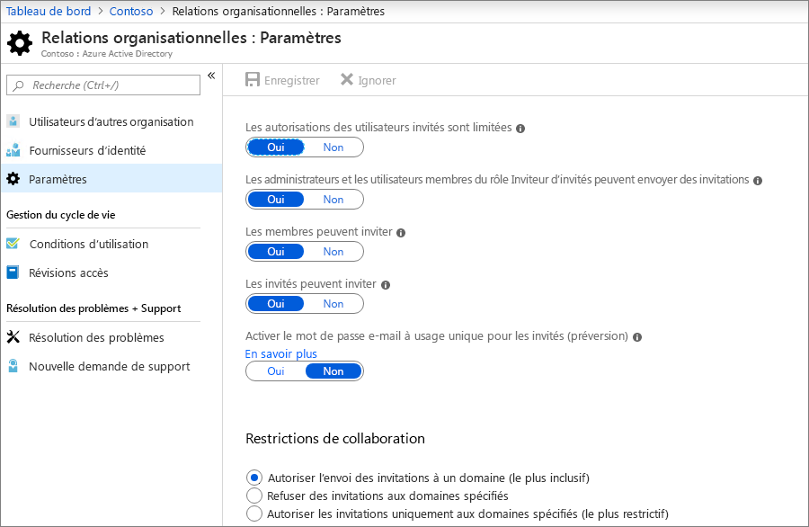
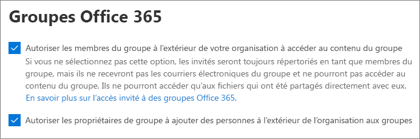
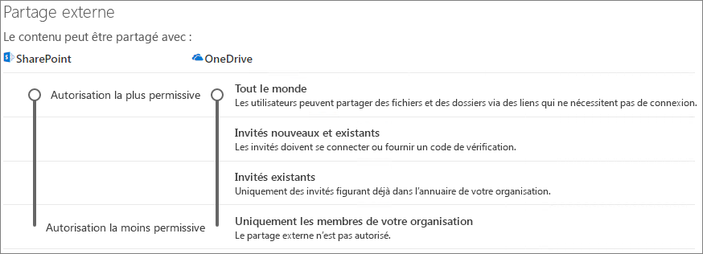
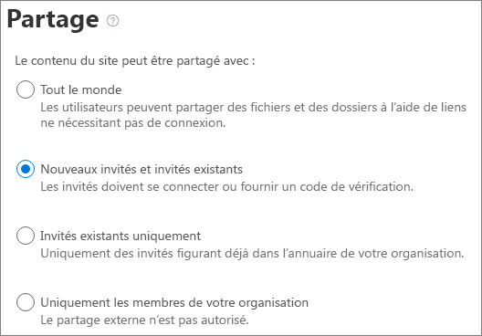

# Collaborer avec des invités dans un siteCollaborate with guests in a site

Si vous avez besoin de collaborer avec des invités dans des documents, des données et des listes, vous pouvez utiliser un site SharePoint.If you need to collaborate with guests across documents, data, and lists, you can use a SharePoint site. Les sites SharePoint modernes sont connectés aux groupes Office 365 qui peuvent gérer l’appartenance à un site et fournir des outils de collaboration supplémentaires tels qu’une boîte aux lettres et un calendrier partagés.Modern SharePoint sites are connected to Office 365 Groups which can manage the site membership and provide additional collaboration tools such as a shared mailbox and calendar.

Dans cet article, nous allons passer en revue les étapes de configuration de Microsoft 365 nécessaires pour configurer un site SharePoint en vue de la collaboration avec des invités.In this article, we'll walk through the Microsoft 365 configuration steps necessary to set up a SharePoint site for collaboration with guests.

## Paramètres Azure de relations organisationnellesAzure Organizational relationships settings

Le partage dans Microsoft 365 est régi par les paramètres de relations organisationnelles dans Azure Active Directory.Sharing in Microsoft 365 is governed at its highest level by the organizational relationships settings in Azure Active Directory. Si le partage d’invités est désactivé ou restreint dans Azure AD, cela remplace tous les paramètres de partage que vous configurez dans Microsoft 365.If guest sharing is disabled or restricted in Azure AD, this will override any sharing settings that you configure in Microsoft 365.

Vérifiez les paramètres de relations organisationnelles pour vous assurer que le partage avec des invités n’est pas bloqué.Check the organizational relationships settings to ensure that sharing with guests is not blocked.

Pour définir les paramètres de relation organisationnelleTo set organizational relationship settings

1. Connectez-vous à Microsoft Azure [https://portal.azure.com](https://portal.azure.com)à l’adresse.Log in to Microsoft Azure at [https://portal.azure.com](https://portal.azure.com).
2. Dans le volet de navigation de gauche, cliquez sur **Azure Active Directory**.In the left navigation, click **Azure Active Directory**.
3. Dans le volet de **vue d’ensemble** , cliquez sur **relations organisationnelles**.In the **Overview** pane, click **Organizational relationships**.
4. Dans le volet **relations organisationnelles** , cliquez sur **paramètres**.In the **Organizational relationships** pane, click **Settings**.
5. Assurez-vous que les **administrateurs et les utilisateurs du rôle d’invité invité peuvent inviter** et que les **membres peuvent inviter** sont tous deux la valeur **Oui**.Ensure that **Admins and users in the guest inviter role can invite** and **Members can invite** are both set to **Yes**.
6. Si vous avez apporté des modifications, cliquez sur **Enregistrer**.If you made changes, click **Save**.

Notez les paramètres dans la section **restrictions de collaboration** .Note the settings in the **Collaboration restrictions** section. Assurez-vous que les domaines des invités avec lesquels vous souhaitez collaborer ne sont pas bloqués.Make sure that the domains of the guests that you want to collaborate with aren't blocked.

## Les paramètres invités des groupes Office 365Office 365 Groups guest settings

Les sites SharePoint modernes utilisent les groupes Office 365 pour contrôler l’accès au site.Modern SharePoint sites use Office 365 Groups to control site access. Les paramètres invités des groupes Office 365 doivent être activés pour que l’accès invité dans les sites SharePoint fonctionne.The Office 365 Groups guest settings must be turned on in order for guest access in SharePoint sites to work.

Pour définir les paramètres invités des groupes Office 365To set Office 365 Groups guest settings

1. Dans le centre d’administration Microsoft 365, dans le volet de navigation de gauche, développez **paramètres**.In the Microsoft 365 admin center, in the left navigation, expand **Settings**.
2. Cliquez sur **Services & compléments**.Click **Services & add-ins**.
3. Dans la liste, cliquez sur **groupes Office 365**.In the list, click **Office 365 Groups**.
4. Assurez-vous que les **membres de groupe Let en dehors de votre organisation accèdent au contenu de groupe** et que les **propriétaires de groupes ajoutent des personnes en dehors de votre organisation aux** cases à cocher sont activées.Ensure that the **Let group members outside your organization access group content** and **Let group owners add people outside your organization to groups** check boxes are both checked.
5. Si vous avez apporté des modifications, cliquez sur **enregistrer les modifications**.If you made changes, click **Save changes**.

## Paramètres de partage au niveau de l’organisation SharePointSharePoint organization level sharing settings

Pour que les invités aient accès aux sites SharePoint, les paramètres de partage au niveau de l’organisation SharePoint doivent autoriser le partage avec des invités.In order for guests to have access to SharePoint sites, the SharePoint organization-level sharing settings must allow for sharing with guests.

Les paramètres au niveau de l’organisation déterminent les paramètres disponibles pour des sites individuels.The organization-level settings determine what settings are available for individual sites. Les paramètres de site ne peuvent pas être plus permissants que les paramètres au niveau de l’organisation.Site settings cannot be more permissive than the organization-level settings.

Si vous souhaitez autoriser le partage de fichiers et de dossiers avec des utilisateurs anonymes, sélectionnez **tout le monde**.If you want to allow file and folder sharing with anonymous users, choose **Anyone**. Si vous souhaitez vous assurer que tous les invités doivent s’authentifier, choisissez **nouveau et invités existants**.If you want to ensure that all guests have to authenticate, choose **New and existing guests**. Choisissez le paramètre le plus permissif qui sera nécessaire pour tous les sites de votre organisation.Choose the most permissive setting that will be needed by any site in your organization.

Pour définir les paramètres de partage au niveau de l’organisation SharePointTo set SharePoint organization level sharing settings

1. Dans le centre d’administration 365 de Microsoft, dans le volet de navigation de gauche, sous **centres d’administration**, cliquez sur **SharePoint**.In the Microsoft 365 admin center, in the left navigation, under **Admin centers**, click **SharePoint**.
2. Dans le centre d’administration SharePoint, dans le volet de navigation de gauche, cliquez sur **partage**.In the SharePoint admin center, in the left navigation, click **Sharing**.
3. Assurez-vous que le partage externe pour SharePoint est défini sur **tout le monde** ou sur **des invités nouveaux et existants**.Ensure that external sharing for SharePoint is set to **Anyone** or **New and existing guests**.
4. Si vous avez apporté des modifications, cliquez sur **Enregistrer**.If you made changes, click **Save**.

## Paramètres de lien par défaut au niveau de l’organisation SharePointSharePoint organization level default link settings

Les paramètres de lien de fichier et de dossier par défaut déterminent l’option de lien qui est présentée par défaut à l’utilisateur lorsqu’il partage un fichier ou un dossier.The default file and folder link settings determine which link option is shown to the user by default when they share a file or folder. Les utilisateurs peuvent remplacer le type de lien par l’une des autres options avant de procéder au partage si vous le souhaitez.Users can change the link type to one of the other options before sharing if desired.

N’oubliez pas que ce paramètre affecte toutes les équipes et tous les sites SharePoint de votre organisation.Keep in mind that this setting affects all teams and SharePoint sites in your organization.

Choisissez le type de lien sélectionné par défaut lorsque les utilisateurs partagent des fichiers et des dossiers :Choose the type of link that's selected by default when users share files and folders:

- **Toute personne disposant du lien** : choisissez cette option si vous envisagez de partager un grand nombre de fichiers et de dossiers avec des utilisateurs anonymes.**Anyone with the link** - Choose this option if you expect to share a lot of files and folders with anonymous users. Si vous souhaitez autoriser les liens de *tous les utilisateurs* mais s’inquiète du partage anonyme accidentel, envisagez l’une des autres options par défaut.If you want to allow *Anyone* links but are concerned about accidental anonymous sharing, consider one of the other options as the default. Ce type de lien n’est disponible que si vous avez activé le partage d’un **utilisateur** .This link type is only available if you've enabled **Anyone** sharing.
- **Uniquement les personnes de votre organisation** : choisissez cette option si vous pensez que le partage de fichiers et de dossiers doit être associé à des personnes au sein de votre organisation.**Only people in your organization** - Choose this option if you expect most file and folder sharing to be with people inside your organization.
- **Personnes spécifiques** : envisagez cette option si vous envisagez de faire beaucoup de partage de fichiers et de dossiers avec des invités.**Specific people** - Consider this option if you expect to do a lot of file and folder sharing with guests. Ce type de lien fonctionne avec les invités et les requiert pour s’authentifier.This type of link works with guests and requires them to authenticate.
 

Pour définir les paramètres de liaison par défaut au niveau de l’organisation SharePointTo set the SharePoint organization level default link settings

1. Accédez à la page de partage dans le centre d’administration SharePoint.Navigate to the Sharing page in the SharePoint admin center.
2. Sous **liens de fichiers et de dossiers**, sélectionnez le lien de partage par défaut à utiliser.Under **File and folder links**, select the default sharing link that you want to use.
3. Si vous avez apporté des modifications, cliquez sur **Enregistrer**.If you made changes, click **Save**.

## Créer un siteCreate a site

L’étape suivante consiste à créer le site que vous envisagez d’utiliser pour collaborer avec des invités.The next step is to create the site that you plan to use for collaborating with guests.

Pour créer un siteTo create a site
1. Dans le centre d’administration SharePoint, sous **sites**, cliquez sur **sites actifs**.In the SharePoint admin center, under **Sites**, click **Active sites**.
2. Cliquez sur **Créer**.Click **Create**.
3. Cliquez sur **site d’équipe**.Click **Team site**.
4. Tapez un nom de site et entrez un nom pour le propriétaire du groupe (propriétaire du site).Type a site name and enter a name for the Group owner (site owner).
5. Sous **Paramètres avancés**, choisissez si vous souhaitez qu’il s’agit d’un site public ou privé.Under **Advanced settings**, choose if you want this to be a public or private site.
6. Cliquez sur **Suivant**.Click **Next**.
7. Cliquez sur **Terminer**.Click **Finish**.

Nous allons inviter les utilisateurs ultérieurement.We'll invite users later. Ensuite, il est important de vérifier les paramètres de partage au niveau du site pour ce site.Next, it's important to check the site-level sharing settings for this site.

## Paramètres de partage au niveau du site SharePointSharePoint site level sharing settings

Vérifiez les paramètres de partage au niveau du site pour vous assurer qu’ils autorisent le type d’accès souhaité pour ce site.Check the site-level sharing settings to make sure that they allow the type of access that you want for this site. Par exemple, si vous définissez les paramètres au niveau de l’organisation sur tous les **utilisateurs**, mais que vous souhaitez que tous les invités s’authentifient pour ce site, assurez-vous que les paramètres de partage au niveau du site sont définis sur **nouveaux et invités existants**.For example, if you set the organization-level settings to **Anyone**, but you want all guests to authenticate for this site, then make sure the site-level sharing settings are set to **New and existing guests**.

Notez que le site ne peut pas être partagé avec des utilisateurs anonymes (paramètre**tout le monde** ), mais avec des fichiers et des dossiers individuels.Note that the site cannot be shared with anonymous users (**Anyone** setting), but individual files and folders can.

Pour définir les paramètres de partage au niveau du siteTo set site-level sharing settings
1. Dans le centre d’administration SharePoint, dans le volet de navigation de gauche, développez **sites** , puis cliquez sur **sites actifs**.In the SharePoint admin center, in the left navigation, expand **Sites** and click **Active sites**.
2. Sélectionnez le site que vous venez de créer.Select the site that you just created.
3. Dans le ruban, cliquez sur **partage**.In the ribbon, click **Sharing**.
4. Assurez-vous que le partage est défini sur **tout le monde** ou sur **des invités nouveaux et existants**.Ensure that sharing is set to **Anyone** or **New and existing guests**.
5. Si vous avez apporté des modifications, cliquez sur **Enregistrer**.If you made changes, click **Save**.

## Inviter des utilisateursInvite users

Les paramètres de partage des invités sont désormais configurés, de sorte que vous pouvez commencer à ajouter des utilisateurs et des invités internes à votre site.Guest sharing settings are now configured, so you can start adding internal users and guests to your site. L’accès au site est contrôlé par le biais du groupe Office 365 associé, c’est pourquoi nous allons y ajouter des utilisateurs.Site access is controlled through the associated Office 365 Group, so we'll be adding users there.

Pour inviter des utilisateurs internes à un groupeTo invite internal users to a group
1. Accédez au site où vous souhaitez ajouter des utilisateurs.Navigate to the site where you want to add users.
2. Cliquez sur **membres** dans le coin supérieur droit.Click **Members** in the upper right.
3. Cliquez sur **Ajouter des membres**.Click **Add members**.
4. Tapez les noms ou les adresses de messagerie des utilisateurs que vous souhaitez inviter sur le site, puis cliquez sur **Enregistrer**.Type the names or email addresses of the users that you want to invite to the site, and then click **Save**.

Les utilisateurs invités ne peuvent pas être ajoutés à partir du site.Guest users can't be added from the site. Vous devez les ajouter à l’aide d’Outlook sur le Web.You need to add them using Outlook on the web.

Pour inviter des invités à un siteTo invite guests to a site
1. Dans Outlook sur le Web, sous **groupes**, cliquez sur le groupe dans lequel vous souhaitez ajouter des membres.In Outlook on the web, under **Groups**, click the group where you want to add members.
2. Ouvrez la carte de visite de groupe, puis, sous **autres options** (...), cliquez sur **Ajouter des membres**.Open the group contact card, and then, under **More options** (...), click **Add members**.
3. Tapez les adresses de messagerie des invités que vous souhaitez inviter, puis cliquez sur **Ajouter**.Type the email addresses of the guests that you want to invite, and then click **Add**.
4. Cliquez sur **Fermer**.Click **Close**.

## Voir aussiSee Also
