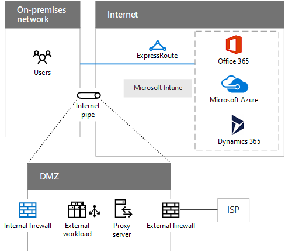

# Éléments communs de la connectivité au cloud MicrosoftCommon elements of Microsoft cloud connectivity

 **Résumé :** Comprendre les éléments communs d'infrastructure réseau et comment préparer votre réseau.**Summary:** Understand the common elements of networking infrastructure and how to prepare your network.
  
L’intégration de votre réseau avec le cloud Microsoft fournit un accès optimal à une large gamme de services.Integrating your networking with the Microsoft cloud provides optimal access to a broad range of services.
  
## Étapes pour préparer votre réseau pour les services cloud de MicrosoftSteps to prepare your network for Microsoft cloud services

Pour votre réseau local, procédez comme suit :For your on-premises network:
  
1. Analysez les ordinateurs de vos clients et optimisez le matériel réseau, les pilotes logiciels, les paramètres du protocole et les navigateurs Internet.Analyze your client computers and optimize for network hardware, software drivers, protocol settings, and Internet browsers.
    
2. Analysez votre réseau local pour la latence du trafic et le routage optimal vers le périphérique du périmètre Internet.Analyze your on-premises network for traffic latency and optimal routing to the Internet edge device.
    
3. Analysez la capacité et les performances du périphérique du périmètre Internet et optimisez les niveaux supérieurs de trafic.Analyze the capacity and performance of your Internet edge device and optimize for higher levels of traffic.
    
Pour votre connexion Internet, procédez comme suit :For your Internet connection:
  
1. Analysez la latence entre le périphérique du périmètre Internet (par exemple, votre pare-feu externe) et les emplacements régionaux du service cloud de Microsoft auquel vous vous connectez.Analyze the latency between your Internet edge device (such as your external firewall) and the regional locations of the Microsoft cloud service to which you are connecting.
    
2. Analysez la capacité et l’utilisation de votre connexion Internet actuelle et augmentez la capacité si nécessaire. Vous pouvez également ajouter une connexion ExpressRoute.Analyze the capacity and utilization of your current Internet connection and add capacity if needed. Alternately, add an ExpressRoute connection.
    
## Options de connectivité au cloud de MicrosoftMicrosoft cloud connectivity options

Utilisez votre canal Internet existant ou une connexion ExpressRoute à Office 365, Azure et Dynamics 365.Use your existing Internet pipe or an ExpressRoute connection to Office 365, Azure, and Dynamics 365.
  
**Figure 1 : Options pour la connectivité cloud Microsoft****Figure 1: Options for Microsoft cloud connectivity**

  
La figure 1 indique la façon dont un réseau local peut être connecté aux offres de cloud de Microsoft à l’aide de son canal Internet existant ou d’ExpressRoute. Le canal Internet représente une zone DMZ et peut avoir les composants suivants :Figure 1 shows how an on-premises network can be connected to Microsoft cloud offerings using their existing Internet pipe or ExpressRoute. The Internet pipe represents a DMZ and can have the following components:
  
- **Pare-feu interne :** Barrière entre votre réseau approuvé et un réseau non approuvé. Effectue le filtrage (en fonction des règles) et la surveillance du trafic.**Internal firewall:** A barrier between your trusted network and an untrusted one. Performs traffic filtering (based on rules) and monitoring.
    
- **Charge de travail externe :** Sites web ou autres charges de travail mis à la disposition des utilisateurs externes sur Internet.**External workload:** Web sites or other workloads made available to external users on the Internet.
    
- **Serveur proxy :** Demandes de services pour le contenu web au nom des utilisateurs de l'intranet.**Proxy server:** Services requests for web content on behalf of intranet users. Un proxy inverse autorise les demandes entrantes non sollicitées.A reverse proxy permits unsolicited inbound requests.
    
- **Pare-feu externe :** Autorise le trafic sortant et le trafic entrant spécifié.**External firewall:** Allows outbound traffic and specified inbound traffic. Peut effectuer la traduction d'adresse, l'inspection de paquets, l'interruption et l'inspection de SSL, ou la protection contre la perte de données.Can perform address translation, packet inspection, SSL Break and Inspect, or data loss prevention.
    
- **Connexion WAN à ISP :** Connexion basée sur un opérateur à un fournisseur de services Internet, qui est homologuée avec Internet pour la connectivité et le routage.**WAN connection to ISP:** A carrier-based connection to an ISP, who peers with the Internet for connectivity and routing.
    
## Zones de réseau communes à tous les services cloud de MicrosoftAreas of networking common to all Microsoft cloud services

Vous devez prendre en considération ces zones de réseau lors de l’adoption des services cloud de Microsoft.You need to consider these areas of networking when adopting any of Microsoft's cloud services.
  
- **Performances intranet :** Les performances des ressources basées sur Internet seront réduites si votre intranet, y compris les ordinateurs des clients, n'est pas optimisé.**Intranet performance:** Performance to Internet-based resources will suffer if your intranet, including client computers, is not optimized.
    
- **Périphériques du périmètre :** Les périphériques dans le périmètre de votre réseau sont des points de sortie et peuvent inclure des traducteurs d'adresses réseau (NAT), des serveurs proxy (y compris les proxys inverses), des pare-feux, des périphériques de détection des intrusions ou une combinaison.**Edge devices:** Devices at the edge of your network are egress points and can include Network Address Translators (NATs), proxy servers (including reverse proxies), firewalls, intrusion detection devices, or a combination.
    
- **Connexion à Internet :** Votre connexion WAN à votre fournisseur de services Internet et Internet doivent avoir une capacité suffisante pour gérer les charges de pointe. Vous pouvez également utiliser une connexion ExpressRoute.**Internet connection:** Your WAN connection to your ISP and the Internet should have enough capacity to handle peak loads. You can also use an ExpressRoute connection.
    
- **Internet DNS :** A, AAAA, CNAME, MX, PTR et les autres enregistrements pour localiser le cloud de Microsoft ou les services hébergés dans le cloud. Par exemple, vous pouvez avoir besoin d’un enregistrement CNAME pour votre application hébergée dans Azure PaaS.**Internet DNS:** A, AAAA, CNAME, MX, PTR and other records to locate Microsoft cloud or your services hosted in the cloud. For example, you might need a CNAME record for your app hosted in Azure PaaS.
    

## Étape suivanteNext step

[ExpressRoute pour la connectivité au cloud de MicrosoftExpressRoute for Microsoft cloud connectivity](expressroute-for-microsoft-cloud-connectivity.md)

## Voir aussiSee also

[Mise en réseau cloud Microsoft pour les architectes d'entrepriseMicrosoft Cloud Networking for Enterprise Architects](microsoft-cloud-networking-for-enterprise-architects.md)
  
[Ressources relatives à l’architecture informatique du cloud MicrosoftMicrosoft Cloud IT architecture resources](microsoft-cloud-it-architecture-resources.md)

