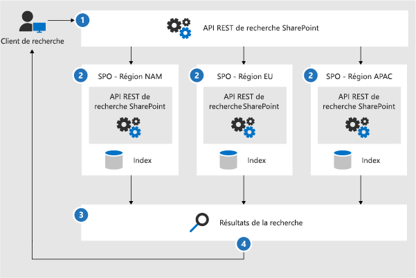
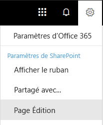
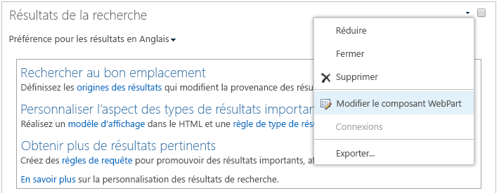

# Configurer la recherche pour Microsoft 365 Multi-GeoConfigure Search for Microsoft 365 Multi-Geo

Dans un environnement multigéographique, chaque emplacement géographique comporte son propre index de recherche et son centre de recherche.In a multi-geo environment, each geo location has its own search index and Search Center. Lorsqu’un utilisateur effectue une recherche, la requête est distribuée à tous les index et les résultats renvoyés sont fusionnés.When a user searches, the query is fanned out to all the indexes, and the returned results are merged.

Par exemple, un utilisateur d’un emplacement géographique peut rechercher du contenu stocké dans un autre emplacement géographique ou du contenu sur un site SharePoint limité à un emplacement géographique différent.For example, a user in one geo location can search for content stored in another geo location, or for content on a SharePoint site that's restricted to a different geo location. Si l’utilisateur a accès à ce contenu, la recherche affiche le résultat.If the user has access to this content, search will show the result.

## Quels sont les clients de recherche qui fonctionnent dans un environnement Multi-Géo ?Which search clients work in a multi-geo environment?

Ces clients peuvent renvoyer des résultats de tous les emplacements géographiques :These clients can return results from all geo locations:

-   OneDrive EntrepriseOneDrive for Business

-   DelveDelve

-   Page d’accueil SharePointThe SharePoint home page

-   Centre de rechercheThe Search Center

-   Applications de recherche personnalisée qui utilisent l’API de recherche SharePointCustom search applications that use the SharePoint Search API

### OneDrive EntrepriseOneDrive for Business

Dès que l’environnement Multi-Géo est configuré, les utilisateurs qui effectuent des recherches dans OneDrive obtiennent des résultats de tous les emplacements géographiques.As soon as the multi-geo environment has been set up, users that search in OneDrive get results from all geo locations.

### DelveDelve

Dès que l’environnement Multi-Géo est configuré, les utilisateurs qui effectuent des recherches dans Delve obtiennent des résultats de tous les emplacements géographiques.As soon as the multi-geo environment has been set up, users that search in Delve get results from all geo locations.

Le flux Delve et la fiche de profil n’affichent que les aperçus de fichiers stockés dans l’emplacement central.The Delve feed and the profile card only show previews of files that are stored in the central location. Pour les fichiers stockés dans des emplacements satellites, l’icône du type de fichier apparaît à la place.For files that are stored in satellite locations, the icon for the file type is shown instead.

### Page d’accueil SharePointThe SharePoint home page

Dès que l’environnement Multi-Géo est configuré, les utilisateurs voient les actualités, les sites récents et les sites suivis de plusieurs emplacements géographiques sur leur page d’accueil SharePoint. S’ils utilisent la zone de recherche sur la page d’accueil SharePoint, ils obtiennent des résultats fusionnés provenant de plusieurs emplacements géographiques.As soon as the multi-geo environment has been set up, users will see news, recent and followed sites from multiple geo locations on their SharePoint home page. If they use the search box on the SharePoint home page, they'll get merged results from multiple geo locations.

### Centre de rechercheThe Search Center

Une fois que l’environnement Multi-Géo est configuré, chaque centre de recherche continue à afficher uniquement les résultats de son propre emplacement géographique. Les administrateurs doivent [modifier les paramètres de chaque centre de recherche](#_Set_up_a_1) pour obtenir des résultats de tous les emplacements géographiques. Par la suite, les utilisateurs qui effectuent une recherche dans le centre de recherche obtiennent des résultats de tous les emplacements géographiques.After the multi-geo environment has been set up, each Search Center continues to only show results from their own geo location. Admins must [change the settings of each Search Center](#_Set_up_a_1) to get results from all geo locations. Afterwards, users that search in the Search Center get results from all geo locations.

### Applications de recherche personnaliséeCustom search applications

Comme d’habitude, les applications de recherche personnalisée interagissent avec les index de recherche en utilisant les API REST de recherche SharePoint existantes. Pour obtenir des résultats de tous les emplacements géographiques (ou une partie), l’application doit [appeler l’API et inclure les nouveaux paramètres de requête Multi-Géo](#_Get_custom_search) dans la demande. Cela déclenche une distribution ramifiée de la requête à tous les emplacements géographiques.As usual, custom search applications interact with the search indexes by using the existing SharePoint Search REST APIs. To get results from all, or some geo locations, the application must [call the API and include the new Multi-Geo query parameters](#_Get_custom_search) in the request. This triggers a fan out of the query to all geo locations.

## Quelles différences la recherche présente-t-elle dans un environnement multigéographique ?What's different about search in a multi-geo environment?

Certaines fonctionnalités de recherche auxquelles vous êtes habitué fonctionnent différemment dans un environnement multigéographique.Some search features you might be familiar with, work differently in a multi-geo environment.

<table>
<thead>
<tr class="header">
<th align="left"><strong>Fonctionnalité</strong><strong>Feature</strong></th>
<th align="left"><strong>Fonctionnement</strong><strong>How it works</strong></th>
<th align="left"><strong>Solution de contournement</strong><strong>Workaround</strong></th>
</tr>
</thead>
<tbody>
<tr class="odd">
<td align="left">Résultats promusPromoted results</td>
<td align="left">Vous pouvez créer des règles de requête avec des résultats promus à différents niveaux : pour le client entier, pour une collection de sites ou pour un site.You can create query rules with promoted results at different levels: for the whole tenant, for a site collection, or for a site. Dans un environnement multigéographique, définissez les résultats promus au niveau du client pour promouvoir les résultats aux centres de recherche de tous les emplacements géographiques.In a multi-geo environment, define promoted results at the tenant level to promote the results to the Search Centers in all geo locations. Si vous souhaitez seulement promouvoir les résultats dans le centre de recherche qui se trouve dans l’emplacement géographique de la collection de sites ou du site, définissez les résultats promus au niveau de la collection de sites ou du site.If you only want to promote results in the Search Center that's in the geo location of the site collection or site, define the promoted results at the site collection or site level. Ces résultats ne sont pas promus dans d’autres emplacements géographiques.These results are not promoted in other geo locations.</td>
<td align="left">Si vous n’avez pas besoin d’autres résultats promus par emplacement géographique (par exemple, des règles différentes pour les déplacements), nous vous recommandons de définir les résultats promus au niveau du client.If you don't need different promoted results per geo location, for example different rules for traveling, we recommend defining promoted results at the tenant level.</td>
</tr>
<tr class="even">
<td align="left">Affinements de la rechercheSearch refiners</td>
<td align="left">La recherche renvoie des affinements de tous les emplacements géographiques d’un client puis les regroupe. Le regroupement est ce qu’il y a de mieux, ce qui signifie que le nombre d’affinements peut ne pas être précis à 100 %. Pour la plupart des scénarios de recherche, cette précision est suffisante. Search returns refiners from all the geo locations of a tenant and then aggregates them. The aggregation is a best effort, meaning that the refiner counts might not be 100% accurate. For most search-driven scenarios, this accuracy is sufficient. </td>
<td align="left">Pour les applications basées sur la recherche qui dépendent de l’intégralité de l’affinement, effectuez une requête indépendante sur chaque emplacement géographique.For search-driven applications that depend on refiner completeness, query each geo location independently.</td>
</tr>
<tr class="odd">
<td align="left"></td>
<td align="left">La recherche multigéographique ne prend pas en charge la création dynamique de compartiments pour les affinements numériques.Multi-geo search doesn't support dynamic bucketing for numerical refiners.</td>
<td align="left">Utilisez le <a href="https://docs.microsoft.com/sharepoint/dev/general-development/query-refinement-in-sharepoint">paramètre « Discretize »</a> pour les affinements numériques.Use the <a href="https://docs.microsoft.com/sharepoint/dev/general-development/query-refinement-in-sharepoint">“Discretize” parameter</a> for numerical refiners.</td>
</tr>
<tr class="even">
<td align="left">ID de documentDocument IDs</td>
<td align="left">Si vous développez une application basée sur la recherche qui dépend des ID de document, notez que les ID de document d’un environnement multigéographique ne sont pas uniques parmi les emplacements géographiques, mais le sont par emplacement géographique.If you're developing a search-driven application that depends on document IDs, note that document IDs in a multi-geo environment aren't unique across geo locations, they are unique per geo location.</td>
<td align="left">Nous avons ajouté une colonne qui identifie l’emplacement géographique.We've added a column that identifies the geo location. Utilisez cette colonne pour atteindre l’unicité.Use this column to achieve uniqueness. Cette colonne s’intitule « GeoLocationSource ».This column is named “GeoLocationSource”.</td>
</tr>
<tr class="odd">
<td align="left">Nombre de résultatsNumber of results</td>
<td align="left">La page des résultats de recherche affiche les résultats combinés des emplacements géographiques, mais il n’est pas possible d’afficher plus de 500 résultats par page.The search results page shows combined results from the geo locations, but it's not possible to page beyond 500 results.</td>
<td align="left"></td>
</tr>
<tr class="even">
<td align="left">Recherche hybrideHybrid search</td>
<td align="left">Dans un environnement SharePoint hybride avec <a href="https://docs.microsoft.com/sharepoint/hybrid/learn-about-cloud-hybrid-search-for-sharepoint">recherche hybride dans le cloud</a>, le contenu local est ajouté à l’index Microsoft 365 de l’emplacement central.In a hybrid SharePoint environment with <a href="https://docs.microsoft.com/sharepoint/hybrid/learn-about-cloud-hybrid-search-for-sharepoint">cloud hybrid search</a>,  on-premises content is added to the Microsoft 365 index of the central location.</td>
<td align="left"></td>
</tr>
</tbody>
</table>

## Quels sont les éléments qui ne sont pas pris en charge par la recherche dans un environnement multigéographique ?What's not supported for search in a multi-geo environment?

Certaines fonctionnalités de recherche auxquelles vous êtes habitué ne sont pas prises en charge dans un environnement multigéographique.Some of the search features you might be familiar with, aren't supported in a multi-geo environment.

<table>
<thead>
<tr class="header">
<th align="left"><strong>Fonctionnalité de recherche</strong><strong>Search feature</strong></th>
<th align="left"><strong>Remarque</strong><strong>Note</strong></th>
</tr>
</thead>
<tbody>
<tr class="odd">
<td align="left">Authentification d’application uniquementApp-only authentication</td>
<td align="left">L’authentification d’application uniquement (accès privilégié depuis les services) n’est pas prise en charge dans la recherche multigéographique.App-only authentication (privileged access from services) isn't supported in multi-geo search.</td>
</tr>
<tr class="even">
<td align="left">Utilisateurs invitésGuest users</td>
<td align="left">Les utilisateurs invités obtiennent uniquement les résultats de l’emplacement géographique à partir duquel ils effectuent leur recherche.Guest users only get results from the geo location that they're searching from.</td>
</tr>
</tbody>
</table>

## Comment fonctionne la recherche dans un environnement multigéographique ?How does search work in a multi-geo environment?

Tous les clients de recherche utilisent les API REST de recherche SharePoint existantes pour interagir avec les index de recherche.All the search clients use the existing SharePoint Search REST APIs to interact with the search indexes.

1. Un client de recherche appelle le point de terminaison REST de recherche avec la propriété de requête EnableMultiGeoSearch= true.A search client calls the Search REST endpoint with the query property EnableMultiGeoSearch= true.
2. La requête est envoyée à tous les emplacements géographiques dans le client.The query is sent to all geo locations in the tenant.
3. Les résultats de recherche de chaque emplacement géographique sont fusionnés et classés.Search results from each geo location are merged and ranked.
4. Le client obtient des résultats de recherche unifiés.The client gets unified search results.

Notez que nous ne fusionnons pas les résultats de recherche avant d’avoir reçu les résultats de tous les emplacements géographiques.Notice that we don't merge the search results until we've received results from all the geo locations. Cela signifie que les recherches géographiques multiples souffrent d’une latence supplémentaire par rapport aux recherches dans un environnement ne comportant qu’un seul emplacement géographique.This means that multi-geo searches have additional latency compared to searches in an environment with only one geo location.

## Obtenir un centre de recherche pour afficher les résultats de tous les emplacements géographiquesGet a Search Center to show results from all geo locations

Chaque centre de recherche possède plusieurs secteurs verticaux et vous devez configurer chaque secteur vertical individuellement.Each Search Center has several verticals and you have to set up each vertical individually.

1.  Vérifiez que vous effectuez ces étapes avec un compte doté d’autorisations pour modifier la page des résultats de la recherche et le composant WebPart Search Result.Ensure that you perform these steps with an account that has permission to edit the search results page and the Search Result Web Part.

2.  Accédez à la page des résultats de la recherche (reportez-vous à la [liste](https://support.office.com/article/174d36e0-2f85-461a-ad9a-8b3f434a4213) des pages des résultats de la recherche)Navigate to the search results page (see the [list](https://support.office.com/article/174d36e0-2f85-461a-ad9a-8b3f434a4213) of search results pages)

3.  Sélectionnez le secteur vertical à configurer, cliquez sur l’icône d’engrenage **Paramètres** située en haut à droite, puis cliquez sur **Modifier la page**. La page des résultats de la recherche s’ouvre en mode Édition.Select the vertical to set up, click **Settings** gear icon in the upper, right corner, and then click **Edit Page**. The search results page opens in Edit mode.

     
1.  Dans le composant WebPart de résultats de recherche, déplacez le pointeur vers le coin supérieur droit et cliquez sur la flèche, puis sur **Modifier le composant WebPart** dans le menu.In the Search Results Web Part, move the pointer to the upper, right corner of the web part, click the arrow, and then click **Edit Web Part** on the menu. Le volet des outils du composant WebPart des résultats de recherche s’ouvre sous le ruban en haut à droite de la page.The Search Results Web Part tool pane opens under the ribbon in the top right of the page. 

1.  Dans le volet des outils du composant WebPart, dans la section **Paramètres**, sous **Paramètres de contrôle des résultats**, sélectionnez **Afficher les résultats multigéographiques** pour que le composant WebPart Résultats de la recherche affiche les résultats de tous les emplacements géographiques.In the Web Part tool pane, in the **Settings** section, under **Results control settings**, select **Show Multi-Geo results** to get the Search Results Web Part to show results from all geo locations.

2.  Cliquez sur **OK** pour enregistrer vos changements et fermer le volet des outils du composant WebPart.Click **OK** to save your change and close the Web Part tool pane.

3.  Vérifiez les changements que vous avez apportés au composant WebPart Résultats de la recherche en cliquant sur **Archiver** sur l’onglet Page du menu principal.Check your changes to the Search Results Web Part by clicking **Check-In** on the Page tab of the main menu.

4.  Publiez les changements en utilisant le lien fourni dans la note en haut de la page.Publish the changes by using the link provided in the note at the top of the page.

## Configurer des applications de recherche personnalisée pour qu’elles affichent les résultats de l’ensemble ou d’une partie des emplacements géographiquesGet custom search applications to show results from all or some geo locations

Les applications de recherche personnalisée obtiennent les résultats de l’ensemble (ou d’une partie) des emplacements géographiques en spécifiant des paramètres de requête avec la demande à l’API REST de recherche SharePoint. Selon les paramètres, la requête est distribuée à tous les emplacements géographiques ou à certains emplacements géographiques. Par exemple, si vous devez seulement interroger un sous-ensemble des emplacements géographiques pour rechercher des informations pertinentes, vous pouvez contrôler la distribution ramifiée à ces derniers uniquement. Si la demande fonctionne, l’API REST de recherche SharePoint renvoie des données de réponse.Custom search applications get results from all, or some, geo locations by specifying query parameters with the request to the SharePoint Search REST API. Depending on the query parameters, the query is fanned out to all geo locations, or to some geo locations. For example, if you only need to query a subset of geo locations to find relevant information, you can control the fan out to only these. If the request succeeds, the SharePoint Search REST API returns response data.

**Configuration requise****Requirement**

Pour chaque emplacement géographique, vous devez vous assurer que tous les utilisateurs de l’organisation ont reçu l’autorisation de **lecture** du site web racine (par exemple contoso**APAC**.sharepoint.com/ et contoso**EU**.sharepoint.com/).For each geo location, you must ensure that all users in the organization have been granted the **Read** permission level for the root website (for example contoso**APAC**.sharepoint.com/ and contoso**EU**.sharepoint.com/). [En savoir plus sur les autorisations](https://support.office.com/article/understanding-permission-levels-in-sharepoint-87ecbb0e-6550-491a-8826-c075e4859848).[Learn about permissions](https://support.office.com/article/understanding-permission-levels-in-sharepoint-87ecbb0e-6550-491a-8826-c075e4859848).

### Paramètres de requêteQuery parameters

EnableMultiGeoSearch : il s’agit une valeur booléenne qui spécifie si la requête doit être étendue aux index des autres emplacements géographiques du client multigéographique.EnableMultiGeoSearch - This is a Boolean value that specifies whether the query shall be fanned out to the indexes of other geo locations of the multi-geo tenant. Définissez-la sur **true** pour étendre la requête et sur **false** pour ne pas l’étendre.Set it to **true** to fan out the query; **false** to not fan out the query. Si vous n’incluez pas ce paramètre, la valeur par défaut est **false**, sauf lorsque vous effectuez un appel de l’API REST contre un site qui utilise le modèle Centre de recherche d’entreprise, dans ce cas, la valeur par défaut est **true**.If you don't include this parameter, the default value is **false**, except when making a REST API call against a site which uses the Enterprise Search Center template, in this case the default value is **true**. Si vous utilisez ce paramètre dans un environnement qui n’est pas multigéographique, le paramètre est ignoré.If you use the parameter in an environment that isn't multi-geo, the parameter is ignored.

TypeClient : il s’agit d’une chaîne.ClientType - This is a string. Entrez un nom de client unique pour chaque application de recherche.Enter a unique client name for each search application. Si vous n’incluez pas ce paramètre, la requête n’est pas étendue à d’autres emplacements géographiques.If you don't include this parameter, the query is not fanned out to other geo locations.

MultiGeoSearchConfiguration : il s’agit d’une liste facultative d’emplacements géographiques dans le client multigéographique pour étendre la requête lorsque **EnableMultiGeoSearch** est défini sur **true**.MultiGeoSearchConfiguration - This is an optional list of which geo locations in the multi-geo tenant to fan the query out to when **EnableMultiGeoSearch** is **true**. Si vous n’incluez pas ce paramètre ou que vous le laissez vide, la requête est étendue à d’autres emplacements géographiques.If you don't include this parameter, or leave it blank, the query is fanned out to all geo locations. Pour chaque emplacement géographique, entrez les éléments suivants au format JSON :For each geo location, enter the following items, in JSON format:

<table>
<thead>
<tr class="header">
<th align="left">OptionItem</th>
<th align="left">DescriptionDescription</th>
</tr>
</thead>
<tbody>
<tr class="odd">
<td align="left">DataLocationDataLocation</td>
<td align="left">L’emplacement géographique, par exemple NAM.The geo location, for example NAM.</td>
</tr>
<tr class="even">
<td align="left">EndPointEndPoint</td>
<td align="left">Le point de terminaison auquel se connecter, par exemple https://contoso.sharepoint.comThe endpoint to connect to, for example https://contoso.sharepoint.com</td>
</tr>
<tr class="odd">
<td align="left">SourceIdSourceId</td>
<td align="left">GUID de l’origine des résultats, par exemple B81EAB55-3140-4312-B0F4-9459D1B4FFEE.The GUID of the result source, for example B81EAB55-3140-4312-B0F4-9459D1B4FFEE.</td>
</tr>
</tbody>
</table>

Si vous omettez DataLocation ou EndPoint, ou si une DataLocation est dupliquée, la demande échoue. [Vous pouvez obtenir des informations sur le point de terminaison des emplacements géographiques d’un client à l’aide de Microsoft Graph](https://docs.microsoft.com/sharepoint/dev/solution-guidance/multigeo-discovery).If you omit DataLocation or EndPoint, or if a DataLocation is duplicated, the request fails. [You can get information about the endpoint of a tenant's geo locations by using Microsoft Graph](https://docs.microsoft.com/sharepoint/dev/solution-guidance/multigeo-discovery).

### Données de réponseResponse data

MultiGeoSearchStatus : il s’agit d’une propriété renvoyée par l’API de recherche SharePoint en réponse à une demande. La valeur de la propriété est une chaîne et fournit les informations suivantes sur les résultats renvoyés par l’API de recherche SharePoint :MultiGeoSearchStatus – This is a property that the SharePoint Search API returns in response to a request. The value of the property is a string and gives the following information about the results that the SharePoint Search API returns:

<table>
<thead>
<tr class="header">
<th align="left">ValeurValue</th>
<th align="left">DescriptionDescription</th>
</tr>
</thead>
<tbody>
<tr class="odd">
<td align="left">CompletFull</td>
<td align="left">Résultats complets de <strong>tous</strong> les emplacements géographiques.Full results from <strong>all</strong> the geo locations.</td>
</tr>
<tr class="even">
<td align="left">PartiellePartial</td>
<td align="left">Résultats partiels d’un ou plusieurs emplacements géographiques. Les résultats sont incomplets en raison d’une erreur temporaire.Partial results from one or more geo locations. The results are incomplete due to a transient error.</td>
</tr>

</tbody>
</table>

### Requête à l’aide du service RESTQuery using the REST service

Avec une demande GET, spécifiez les paramètres de la requête dans l’URL. Avec une demande POST, vous transmettez les paramètres de la requête dans le corps au format JSON (JavaScript Object Notation).With a GET request, you specify the query parameters in the URL. With a POST request, you pass the query parameters in the body in JavaScript Object Notation (JSON) format.

#### En-têtes de demandeRequest headers

<table>
<thead>
<tr class="header">
<th align="left">NomName</th>
<th align="left">ValeurValue</th>
</tr>
</thead>
<tbody>
<tr class="odd">
<td align="left">Content-TypeContent-Type</td>
<td align="left">application/json;odata=verboseapplication/json;odata=verbose</td>
</tr>
</tbody>
</table>

#### Exemple de demande GET étendue à **tous** les emplacements géographiquesSample GET request that's fanned out to **all** geo locations

https:// \<tenant\>/\_api/search/query?querytext=’sharepoint’&Properties=’EnableMultiGeoSearch:true’&ClientType=’my\_client\_id’https:// \<tenant\>/\_api/search/query?querytext='sharepoint'&Properties='EnableMultiGeoSearch:true'&ClientType='my\_client\_id'

#### Exemple de demande GET à distribuer à **certains** emplacements géographiquesSample GET request to fan out to **some** geo locations

https:// \<tenant\>/\_api/search/query?querytext='site'&ClientType='my_client_id'&Properties='EnableMultiGeoSearch:true, MultiGeoSearchConfiguration:[{DataLocation\\:"NAM"\\,Endpoint\\:"https\\://contosoNAM.sharepoint.com"\\,SourceId\\:"B81EAB55-3140-4312-B0F4-9459D1B4FFEE"}\\,{DataLocation\\:"CAN"\\,Endpoint\\:"https\\://contosoCAN.sharepoint-df.com"}]'https:// \<tenant\>/\_api/search/query?querytext='site'&ClientType='my_client_id'&Properties='EnableMultiGeoSearch:true, MultiGeoSearchConfiguration:[{DataLocation\\:"NAM"\\,Endpoint\\:"https\\://contosoNAM.sharepoint.com"\\,SourceId\\:"B81EAB55-3140-4312-B0F4-9459D1B4FFEE"}\\,{DataLocation\\:"CAN"\\,Endpoint\\:"https\\://contosoCAN.sharepoint-df.com"}]'

> [!NOTE]
> Les symboles virgule et deux-points de la liste des emplacements géographiques pour la propriété MultiGeoSearchConfiguration sont précédés par le caractère **barre oblique inverse**,Commas and colons in the list of geo locations for the MultiGeoSearchConfiguration property are preceded by the **backslash** character. car les demandes GET utilisent des syboles deux-points pour séparer les propriétés, et des virgules pour séparer les arguments des propriétés.This is because GET requests use colons to separate properties and commas to separate arguments of properties. Sans barre oblique inverse comme caractère d’échappement, la propriété MultiGeoSearchConfiguration est interprétée de façon erronée.Without the backslash as an escape character, the MultiGeoSearchConfiguration property is interpreted wrongly.

#### Exemple de demande POST étendue à **tous** les emplacements géographiquesSample POST request that's fanned out to **all** geo locations

    {
        "request": {
            "__metadata": {
            "type": "Microsoft.Office.Server.Search.REST.SearchRequest"
        },
        "Querytext": "sharepoint",
        "Properties": {
            "results": [
                {
                    "Name": "EnableMultiGeoSearch",
                    "Value": {
                        "QueryPropertyValueTypeIndex": 3,
                        "BoolVal": true
                    }
                }
            ]
        },
        "ClientType": "my_client_id"
        }
    }

#### Exemple de demande POST étendue à **certains** emplacements géographiquesSample POST request that's fanned out to **some** geo locations

    {
        "request": {
            "Querytext": "SharePoint",
            "ClientType": "my_client_id",
            "Properties": {
                "results": [
                    {
                        "Name": "EnableMultiGeoSearch",
                        "Value": {
                            "QueryPropertyValueTypeIndex": 3,
                            "BoolVal": true
                        }
                    },
                    {
                        "Name": "MultiGeoSearchConfiguration",
                        "Value": {
                        "StrVal": "[{\"DataLocation\":\"NAM\",\"Endpoint\":\"https://contoso.sharepoint.com\",\"SourceId\":\"B81EAB55-3140-4312-B0F4-9459D1B4FFEE\"},{\"DataLocation\":\"CAN\",\"Endpoint\":\"https://contosoCAN.sharepoint.com\"}]",
                            "QueryPropertyValueTypeIndex": 1
                        }
                    }
                ]
            }
        }
    }

### Requête utilisant CSOMQuery using CSOM

Voici un exemple de requête CSOM étendue à **tous** les emplacements géographiques :Here's a sample CSOM query that's fanned out to **all** geo locations:

    var keywordQuery = new KeywordQuery(ctx);
    keywordQuery.QueryText = query.SearchQueryText;
    keywordQuery.ClientType = <enter a string here>;
    keywordQuery["EnableMultiGeoSearch"] = true;

