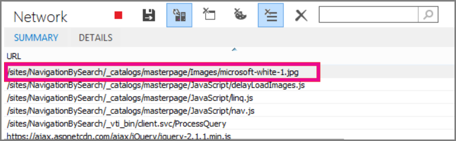

# <a name="delay-loading-images-and-javascript-in-sharepoint-online"></a><span data-ttu-id="88338-103">Différer le chargement des images et des éléments JavaScript dans SharePoint Online</span><span class="sxs-lookup"><span data-stu-id="88338-103">Delay loading images and JavaScript in SharePoint Online</span></span>

<span data-ttu-id="88338-104">Cet article explique comment vous pouvez réduire le temps de chargement des pages SharePoint Online à l’aide de JavaScript à retarder le chargement des images et également en charge non essentiels JavaScript jusqu'à après le chargement de la page en attente.</span><span class="sxs-lookup"><span data-stu-id="88338-104">This article describes how you can decrease the load time for SharePoint Online pages by using JavaScript to delay loading images and also by waiting to load non-essential JavaScript until after the page loads.</span></span> 
  
<span data-ttu-id="88338-p101">Les images peuvent réduire la vitesse de chargement des pages sur SharePoint Online. Par défaut, la plupart des navigateurs Internet modernes extraient à l’avance des images lors du chargement d’une page HTML. Cela peut entraîner un ralentissement inutile du chargement de la page, notamment si les images ne sont pas visibles à l’écran tant que l’utilisateur ne fait pas défiler vers le bas. Les images peuvent empêcher le navigateur de charger la partie visible de la page. Pour contourner ce problème, vous pouvez vous servir de JavaScript pour ignorer le chargement préalable des images. En outre, le chargement d’éléments JavaScript superflus peut ralentir le chargement de vos pages SharePoint également. Cette rubrique décrit quelques-unes des méthodes que vous pouvez utiliser pour améliorer le temps de chargement des pages avec JavaScript dans SharePoint Online.</span><span class="sxs-lookup"><span data-stu-id="88338-p101">Images can negatively affect page load speeds on SharePoint Online. By default, most modern Internet browsers pre-fetch images when loading an HTML page. This can cause the page to be unnecessarily slow to load if the images are not visible on the screen until the user scrolls down. The images can block the browser from loading the visible part of the page. To work around this problem, you can use JavaScript to skip loading the images first. Also, loading non-essential JavaScript can slow down load times on your SharePoint pages too. This topic describes some methods you can use to improve page load times with JavaScript in SharePoint Online.</span></span> 
  
## <a name="improve-page-load-times-by-delaying-image-loading-in-sharepoint-online-pages-by-using-javascript"></a><span data-ttu-id="88338-112">Réduire le temps de chargement des pages en différant le chargement des images dans les pages SharePoint Online à l’aide de JavaScript</span><span class="sxs-lookup"><span data-stu-id="88338-112">Improve page load times by delaying image loading in SharePoint Online pages by using JavaScript</span></span>

<span data-ttu-id="88338-p102">Vous pouvez utiliser JavaScript pour empêcher un navigateur web à partir d’images lisant au préalable. Cela accélère l’ensemble du rendu document. Pour ce faire, vous supprimez la valeur de l’attribut src de le \ tag et remplacez-la par le chemin d’accès à un fichier dans un attribut de données, telles que : données-src. Par exemple :</span><span class="sxs-lookup"><span data-stu-id="88338-p102">You can use JavaScript to prevent a web browser from pre-fetching images. This speeds up overall document rendering. To do this you remove the value of the src attribute from the \ tag and replace it with the path to a file in a data attribute such as: data-src. For example:</span></span>
  
```

```

<span data-ttu-id="88338-p103">À l’aide de cette méthode, le navigateur ne télécharger immédiatement les images. Si l’image est déjà dans la fenêtre d’affichage, JavaScript indique au navigateur pour récupérer l’URL de l’attribut de données et l’insérer en tant que la valeur de l’attribut src. L’image charge uniquement en tant que l’utilisateur défile et il est fourni dans la vue.</span><span class="sxs-lookup"><span data-stu-id="88338-p103">By using this method, the browser doesn't download the images immediately. If the image is already in the viewport, JavaScript tells the browser to retrieve the URL from the data attribute and insert it as the value for the src attribute. The image only loads as the user scrolls and it comes into view.</span></span>
  
<span data-ttu-id="88338-119">Pour faire tout cela se produit, vous devrez utiliser JavaScript.</span><span class="sxs-lookup"><span data-stu-id="88338-119">To make all of this happen, you'll need to use JavaScript.</span></span>
  
<span data-ttu-id="88338-120">Dans un fichier texte, définissez la fonction **isElementInViewport()** afin qu’elle vérifie si un élément se trouve ou non dans la partie du navigateur que l’utilisateur peut voir.</span><span class="sxs-lookup"><span data-stu-id="88338-120">In a text file, define the **isElementInViewport()** function to check whether or not an element is in the part of the browser that is visible to the user.</span></span> 
  
```
function isElementInViewport(el) {
  if (!el)
    return false;
  var rect = el.getBoundingClientRect();
  return (
    rect.top >= 0 &amp;&amp;
    rect.left >= 0 &amp;&amp;
    rect.bottom <= (window.innerHeight || document.documentElement.clientHeight) &amp;&amp;
    rect.right <= (window.innerWidth || document.documentElement.clientWidth) 
  );
}

```

<span data-ttu-id="88338-p104">Ensuite, utilisez **isElementInViewport()** dans la fonction **loadItemsInView()**. La fonction **loadItemsInView()** charge toutes les images possédant une valeur pour l’attribut data-src si elles se trouvent dans la partie du navigateur que l’utilisateur peut voir. Dans le fichier texte, ajoutez la fonction suivante :</span><span class="sxs-lookup"><span data-stu-id="88338-p104">Next, use **isElementInViewport()** in the **loadItemsInView()** function. The **loadItemsInView()** function will load all images that have a value for the data-src attribute if they are in the part of the browser that is visible to the user. Add the following function to the text file:</span></span> 
  
```
function loadItemsInView() {
  //Select elements by the row id.
  $("#row [data-src]").each(function () {
      var isVisible = isElementInViewport(this);
      if (isVisible) {
          if ($(this).attr("src") == undefined) {
              $(this).attr("src", $(this).data("src"));
          }
      }
  });
}
```

<span data-ttu-id="88338-p105">Enfin, appelez **loadItemsInView()** depuis **window.onscroll()** comme indiqué dans l’exemple suivant. Cette procédure garantit que toutes les images qui se trouvent dans la fenêtre d’affichage sont chargées lorsque l’utilisateur a besoin, mais pas avant. Ajoutez le code suivant au fichier texte :</span><span class="sxs-lookup"><span data-stu-id="88338-p105">Finally, call **loadItemsInView()** from within **window.onscroll()** as shown in the following example. This ensures that any images that are in the viewport are loaded as the user needs them, but not before. Add the following to the text file:</span></span> 
  
```
//Example of calling loadItemsInView() from within window.onscroll()
$(window).on("scroll", function () {
    loadItemsInView();
});

```

<span data-ttu-id="88338-p106">Pour SharePoint Online, vous devez lier la fonction suivante à l’événement de défilement sur le s4-workspace # \<div\> balise. Il s’agit, car les événements de fenêtre sont remplacées pour garantir que le ruban reste attaché au haut de la page.</span><span class="sxs-lookup"><span data-stu-id="88338-p106">For SharePoint Online, you need to attach the following function to the scroll event on the #s4-workspace \<div\> tag. This is because the window events are overridden in order to ensure the ribbon remains attached to the top of the page.</span></span>
  
```
//Keep the ribbon at the top of the page
$('#s4-workspace').on("scroll", function () {
    loadItemsInView();
});
```

<span data-ttu-id="88338-129">Enregistrez le fichier texte en tant que fichier JavaScript avec l’extension .js, par exemple delayLoadImages.js.</span><span class="sxs-lookup"><span data-stu-id="88338-129">Save the text file as a JavaScript file with the extension .js, for example delayLoadImages.js.</span></span>
  
<span data-ttu-id="88338-p107">Une fois que vous avez terminé d’écrire delayLoadImages.js, vous pouvez ajouter le contenu du fichier à une page maître dans SharePoint Online. Pour cela, en ajoutant un lien de script à l’en-tête de la page maître. Une fois qu’il se trouve dans une page maître, le code JavaScript sera appliqué à toutes les pages de votre site SharePoint Online qui utilisent cette mise en page maître. Autrement, si vous envisagez d’utiliser uniquement sur une page de votre site, utilisez le composant WebPart Éditeur de script pour incorporer le code JavaScript dans la page. Voir les rubriques suivantes pour plus d’informations :</span><span class="sxs-lookup"><span data-stu-id="88338-p107">Once you've finished writing delayLoadImages.js, you can add the contents of the file to a master page in SharePoint Online. You do this by adding a script link to the header in the master page. Once it's in a master page, the JavaScript will be applied to all pages in your SharePoint Online site that use that master page layout. Alternatively, if you intend to only use this on one page of your site, use the script editor Web Part to embed the JavaScript into the page. See these topics for more information:</span></span>
  
- [<span data-ttu-id="88338-135">Procédure : appliquer une page maître à un site dans SharePoint 2013</span><span class="sxs-lookup"><span data-stu-id="88338-135">How to: Apply a master page to a site in SharePoint 2013</span></span>](https://go.microsoft.com/fwlink/p/?LinkId=525627)
    
- [<span data-ttu-id="88338-136">Comment : créer une mise en page dans SharePoint 2013</span><span class="sxs-lookup"><span data-stu-id="88338-136">How to: Create a page layout in SharePoint 2013</span></span>](https://go.microsoft.com/fwlink/p/?LinkId=525628)
    
 <span data-ttu-id="88338-137">**Exemple : référencement du fichier JavaScript delayLoadImages.js à partir d’une page maître dans SharePoint Online**</span><span class="sxs-lookup"><span data-stu-id="88338-137">**Example: Referencing the JavaScript delayLoadImages.js file from a master page in SharePoint Online**</span></span>
  
<span data-ttu-id="88338-p108">Pour ce faire, vous devez également référencer jQuery dans la page maître. Dans l’exemple suivant, vous pouvez voir que dans le chargement initial de la page, une seule image est chargée, mais qu’il en existe plusieurs sur la page.</span><span class="sxs-lookup"><span data-stu-id="88338-p108">In order for this to work, you also need to reference jQuery in the master page. In the following example, you can see in the initial page load that there is only one image loaded but there are several more on the page.</span></span>
  

  
<span data-ttu-id="88338-141">La capture d’écran suivante montre le reste des images qui sont téléchargées lorsqu’elles apparaissent, à mesure du défilement de la page.</span><span class="sxs-lookup"><span data-stu-id="88338-141">The following screen shot shows the rest of the images that are downloaded after they scroll into view.</span></span>
  

  
<span data-ttu-id="88338-p109">Le fait de différer le chargement des images à l’aide de JavaScript peut permettre d’augmenter efficacement les performances ; toutefois, si cette technique est appliquée sur un site web public, les moteurs de recherche ne pourront pas analyser les images de la même manière que pour une image normalement formée. Cette méthode peut avoir un impact négatif sur les classements des moteurs de recherche, car les métadonnées de l’image ne sont pas vraiment présentes tant que la page n’est pas chargée. Les robots de recherche de lecture ne font que lire le code HTML et ne considéreront donc pas les images comme du contenu de la page. Les images font partie des facteurs utilisés pour classer les pages dans les résultats de recherche. Pour contourner ce problème, vous pouvez insérer un texte d’introduction pour vos images.</span><span class="sxs-lookup"><span data-stu-id="88338-p109">Delaying image loading by using JavaScript can be an effective technique in increasing performance; however, if the technique is applied on a public website then search engines are not able to crawl the images in the same way they would crawl a regularly formed image. This can affect rankings on search engines because metadata on the image itself is not really there until the page loads. Search engine crawlers only read the HTML and therefore will not see the images as content on the page. Images are one of the factors used to rank pages in search results. One way to work around this is to use introductory text for your images.</span></span>
  
## <a name="github-code-sample-injecting-javascript-to-improve-performance"></a><span data-ttu-id="88338-148">Exemple de code GitHub : injection de code JavaScript pour améliorer les performances</span><span class="sxs-lookup"><span data-stu-id="88338-148">GitHub code sample: Injecting JavaScript to improve performance</span></span>

<span data-ttu-id="88338-149">Ne manquez pas l’article et exemple de code sur [injection de code JavaScript](https://go.microsoft.com/fwlink/p/?LinkId=524759) fourni dans les référentiels.</span><span class="sxs-lookup"><span data-stu-id="88338-149">Don't miss the article and code sample on [JavaScript injection](https://go.microsoft.com/fwlink/p/?LinkId=524759) provided on GitHub.</span></span> 
  
## <a name="see-also"></a><span data-ttu-id="88338-150">Voir aussi</span><span class="sxs-lookup"><span data-stu-id="88338-150">See also</span></span>

[<span data-ttu-id="88338-151">Navigateurs pris en charge dans Office 2013 et Office 365 ProPlus</span><span class="sxs-lookup"><span data-stu-id="88338-151">Supported browsers in Office 2013 and Office 365 ProPlus</span></span>](https://support.office.com/article/57342811-0dc4-4316-b773-20082ced8a82)
  
[<span data-ttu-id="88338-152">Procédure : appliquer une page maître à un site dans SharePoint 2013</span><span class="sxs-lookup"><span data-stu-id="88338-152">How to: Apply a master page to a site in SharePoint 2013</span></span>](https://go.microsoft.com/fwlink/p/?LinkId=525627)
  
[<span data-ttu-id="88338-153">Comment : créer une mise en page dans SharePoint 2013</span><span class="sxs-lookup"><span data-stu-id="88338-153">How to: Create a page layout in SharePoint 2013</span></span>](https://go.microsoft.com/fwlink/p/?LinkId=525628)

