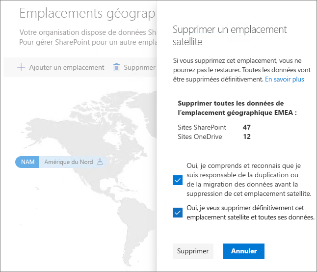

# Supprimer un emplacement satellite dans Microsoft 365 Multi-GeoDelete a satellite location in Microsoft 365 Multi-Geo

Si vous n’avez plus besoin d’un emplacement satellite, vous pouvez le supprimer de votre locataire via le Centre d’administration SharePoint.If you no longer need a satellite location, you can delete it from your tenant from the SharePoint admin center.

> [!WARNING]
> Toutes les données utilisateur dans l’emplacement satellite sont supprimées définitivement.All user data in the satellite location will be permanently deleted. Cela inclut le contenu OneDrive Entreprise, les sites SharePoint et les boîtes aux lettres Exchange, y compris les boîtes aux lettres de groupe Microsoft 365.This includes all OneDrive for Business content, SharePoint sites and Exchange mailboxes including Microsoft 365 Group mailboxes. Vous devez migrer toutes les données vers un autre emplacement satellite ou l’emplacement central avant de supprimer l’emplacement satellite.You must migrate any data to another satellite location or the central location before you delete the satellite location. Cette action ne peut pas être annulée.This action cannot be undone.

Seuls les administrateurs généraux peuvent supprimer des emplacements satellites.Only global administrators can delete satellite locations.

Pour supprimer un emplacement satelliteTo delete a satellite location

1. Ouvrez le Centre d’administration SharePointOpen the SharePoint admin center

2. Accédez à l’onglet **Emplacements géographiques**.Navigate to the **Geo locations** tab.

3. Sur la carte, cliquez sur l’emplacement géographique à supprimer.On the map, click the geo location that you want to delete.

4. Cliquez sur **Supprimer l’emplacement**.Click **Delete location**.

5. Confirmez la suppression en sélectionnant les cases à cocher de confirmation.Confirm the deletion by selecting the confirmation check boxes.

6. Cliquez sur **Supprimer**.Click **Delete**.
