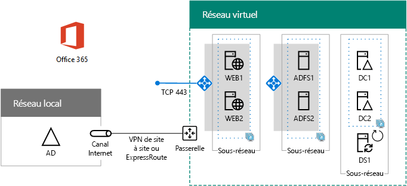

# Déployer une authentification fédérée haute disponibilité pour Office 365 dans Azure

 **Résumé :** Configurer l'authentification fédérée haute disponibilité pour votre abonnement Office 365 dans Microsoft Azure.
  
Cet article contient des liens vers les instructions détaillées de déploiement de l’authentification fédérée haute disponibilité pour Microsoft Office 365 dans les services d’infrastructure Azure avec ces machines virtuelles :
  
- Deux serveurs proxy d’application web
    
- Deux serveurs de services ADFS (Active Directory Federation Services)
    
- Deux contrôleurs de domaine répliqués
    
- Un serveur de synchronisation d’annuaire (DirSync) exécutant Azure AD Connect
    
Voici la configuration, avec les noms d’espace réservé pour chaque serveur.
  
**Une authentification fédérée haute disponibilité pour l'infrastructure Office 365 dans Azure**

  
Toutes les machines virtuelles sont dans un réseau virtuel intersites unique Azure. 
  
> [!NOTE]
> L'authentification fédérée d'utilisateurs individuels n'utilise aucune ressource locale. Toutefois, si la connexion entre différents locaux devient indisponible, les contrôleurs de domaine du réseau virtuel ne reçoivent plus les mises à jour des comptes d'utilisateurs et des groupes apportées dans l'instance Active Directory Domain Services locale. Pour l’éviter, vous pouvez configurer une haute disponibilité pour votre connexion entre différents locaux. Pour plus d'informations, consultez [Configuration haute disponibilité pour la connectivité entre les réseaux locaux et la connectivité entre deux réseaux virtuels](https://docs.microsoft.com/azure/vpn-gateway/vpn-gateway-highlyavailable)
  
Chaque paire de machines virtuelles utilisée pour un rôle spécifique est dans son propre sous-réseau et son propre groupe à haute disponibilité.
  
> [!NOTE]
> Étant donné que ce réseau virtuel est connecté au réseau local, cette configuration n'inclut pas de machines virtuelles jumpbox ou de machines virtuelles de surveillance sur un sous-réseau de gestion. Pour plus d'informations, voir l'article relatif à l'[exécution de machines virtuelles Windows pour une architecture n-tiers](https://docs.microsoft.com/azure/guidance/guidance-compute-n-tier-vm). 
  
Cette configuration met en place une authentification fédérée pour tous vos utilisateurs Office 365, qui peuvent ainsi utiliser leurs informations d'identification Active Directory Windows Server pour se connecter au lieu de leur compte Office 365. L'infrastructure d'authentification fédérés utilise un ensemble redondant de serveurs qui sont plus faciles à déployer dans les services d'infrastructure Azure que dans votre réseau de périmètre en local.
  
## Nomenclature

Cette configuration de base requiert l’ensemble de composants et services Azure suivant :
  
- Sept machines virtuelles
    
- Un réseau virtuel intersites avec quatre sous-réseaux.
    
- Quatre groupes de ressources
    
- Trois groupes à haute disponibilité
    
- Un abonnement Azure
    
Voici les machines virtuelles et leurs tailles par défaut pour cette configuration.
  
|**Élément**|**Description de la machine virtuelle**|**Image de la galerie Azure**|**Taille par défaut**|
|:-----|:-----|:-----|:-----|
|1.    |Premier contrôleur de domaine    |Windows Server 2016 Datacenter    |D2    |
|2.    |Deuxième contrôleur de domaine    |Windows Server 2016 Datacenter    |D2    |
|3.    |Serveur Azure AD Connect    |Windows Server 2016 Datacenter    |D2    |
|4.    |Premier serveur AD FS    |Windows Server 2016 Datacenter    |D2    |
|5.    |Deuxième serveur AD FS    |Windows Server 2016 Datacenter    |D2    |
|6.    |Premier serveur proxy d’application web    |Windows Server 2016 Datacenter    |D2    |
|7.    |Deuxième serveur proxy d’application web    |Windows Server 2016 Datacenter    |D2    |
   
Pour calculer les coûts estimés pour cette configuration, utilisez la [calculatrice de prix Azure](https://azure.microsoft.com/pricing/calculator/)
  
## Phases de déploiement

Vous déployez cette charge de travail au cours des phases suivantes :
  
- [Phase 1 : Configuration Azure](high-availability-federated-authentication-phase-1-configure-azure.md). Créez des groupes de ressources, des comptes de stockage, des groupes à haute disponibilité et un réseau virtuel intersites.
    
- [Phase 2 : Configuration des contrôleurs de domaine](high-availability-federated-authentication-phase-2-configure-domain-controllers.md). Créez et configurez des contrôleurs de domaine réplica d’Active Directory Domain Services (AD DS) et du serveur DirSync.
    
- [Phase 3 : Configuration des serveurs AD FS](high-availability-federated-authentication-phase-3-configure-ad-fs-servers.md). Créez et configurez les deux serveurs AD FS.
    
- [Phase 4 : Configuration des proxys d’application web](high-availability-federated-authentication-phase-4-configure-web-application-pro.md). Créez et configurez les deux serveurs proxy d’application web.
    
- [Phase 5 : Configuration de l’authentification fédérée pour Office 365](high-availability-federated-authentication-phase-5-configure-federated-authentic.md). Configurez l’authentification fédérée pour votre abonnement Office 365.
    
Ces articles fournissent un guide normatif phase par phase pour créer une authentification fédérée haute disponibilité fonctionnelle pour Office 365 dans les services d’infrastructure Azure à partir d’une architecture prédéfinie. Gardez les éléments suivants à l’esprit :
  
- Si vous êtes un implémenteur d’AD FS expérimenté, n’hésitez pas à adapter les instructions des étapes 3 à 4 et à créer l’ensemble de serveurs qui correspond le mieux à vos besoins. 
    
- Si vous disposez déjà d’un déploiement de cloud hybride Azure avec un réseau virtuel entre différents locaux, n’hésitez pas à adapter ou à ignorer les instructions des phases 1 et 2 et placez les serveurs proxy AD FS et d’application web dans les sous-réseaux appropriés.
    
Pour créer un environnement de développement/test ou une preuve de concept de cette configuration, voir [Identité fédérée pour votre environnement de développement/test Office 365](federated-identity-for-your-office-365-dev-test-environment.md).
  
## Étape suivante

Commencez la configuration de cette charge de travail avec [Authentification fédérée haute disponibilité, phase 1 : Configurer Azure](high-availability-federated-authentication-phase-1-configure-azure.md). 
  
<!--
> [!TIP]
> For a set of files to more quickly deploy your high availability federated authentication for Office 365 in Azure, see the [Federated Authentication for Office 365 in Azure Deployment Kit](https://gallery.technet.microsoft.com/Federated-Authentication-8a9f1664). 
--> 

