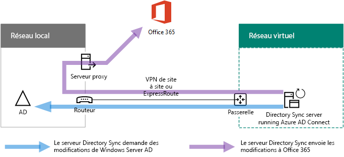
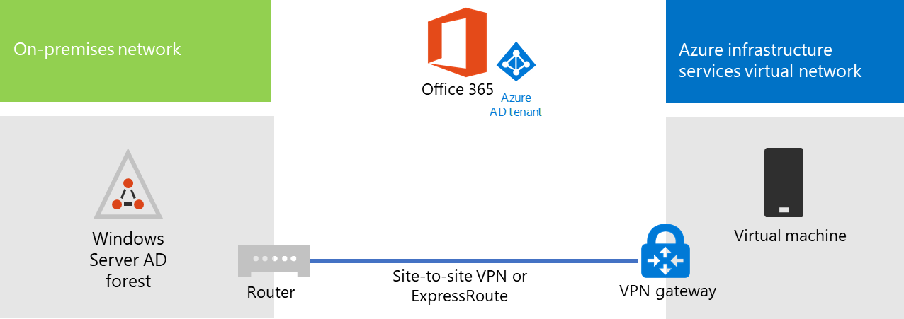

# Déploiement de la synchronisation d’annuaires Microsoft 365 dans Microsoft Azure

Azure Active Directory (Azure AD) Connect (anciennement appelé l’outil de synchronisation d’annuaires, l’outil de synchronisation d’annuaires ou l’outil de DirSync.exe) est une application que vous installez sur un serveur lié à un domaine pour synchroniser vos utilisateurs des services de domaine Active Directory (AD DS) sur site avec le client Azure AD de votre abonnement Microsoft 365. Microsoft 365 utilise Azure AD pour son service d’annuaire. Votre abonnement Microsoft 365 inclut un client Azure AD. Ce client peut également être utilisé pour la gestion des identités de votre organisation avec d’autres charges de travail de cloud, y compris d’autres applications SaaS et des applications dans Azure.

Vous pouvez installer Azure AD Connect sur un serveur local, mais également sur une machine virtuelle dans Azure, pour les raisons suivantes :
  
- Vous pouvez mettre en service et configurer les serveurs cloud plus rapidement, les rendant ainsi disponibles plus tôt pour vos utilisateurs.
- Azure offre une meilleure disponibilité de site avec moins d'efforts.
- Vous pouvez réduire le nombre de serveurs locaux de votre organisation.

Cette solution exige une connectivité entre votre réseau local et votre réseau virtuel Azure. Pour plus d’informations, reportez-vous à [Connecter un réseau local à Microsoft Azure Virtual Network](connect-an-on-premises-network-to-a-microsoft-azure-virtual-network.md). 
  
> [!NOTE]
> Cet article décrit la synchronisation d'un domaine unique dans une forêt unique. Azure AD Connect synchronise tous les domaines AD DS de votre forêt Active Directory avec Microsoft 365. Si vous disposez de plusieurs forêts Active Directory à synchroniser avec Microsoft 365, reportez-vous à la rubrique [synchronisation d’annuaires de forêts multiples avec un scénario d’authentification unique](https://go.microsoft.com/fwlink/p/?LinkId=393091). 
  
## Vue d’ensemble du déploiement de la synchronisation d’annuaires Microsoft 365 dans Azure

Le diagramme suivant montre Azure AD Connect en cours d’exécution sur une machine virtuelle dans Azure (le serveur de synchronisation d’annuaires) qui synchronise une forêt AD DS locale avec un abonnement Microsoft 365.
  

  
In the diagram, there are two networks connected by a site-to-site VPN or ExpressRoute connection. There is an on-premises network where AD DS domain controllers are located, and there is an Azure virtual network with a directory sync server, which is a virtual machine running [Azure AD Connect](https://www.microsoft.com/download/details.aspx?id=47594). There are two main traffic flows originating from the directory sync server:
  
-  Azure AD Connect interroge un contrôleur de domaine sur le réseau local concernant les modifications apportées aux comptes et aux mots de passe.
-  Azure AD Connect envoie les modifications apportées aux comptes et aux mots de passe à l’instance Azure AD de votre abonnement Microsoft 365. Étant donné que le serveur de synchronisation d’annuaires est dans une partie étendue de votre réseau local, ces modifications sont envoyées via le serveur proxy du réseau local.
    
> [!NOTE]
> Cette solution décrit la synchronisation d’un domaine Active Directory unique dans une forêt Active Directory unique. Azure AD Connect synchronise tous les domaines Active Directory de votre forêt Active Directory avec Microsoft 365. Si vous disposez de plusieurs forêts Active Directory à synchroniser avec Microsoft 365, reportez-vous à la rubrique [synchronisation d’annuaires de forêts multiples avec un scénario d’authentification unique](https://go.microsoft.com/fwlink/p/?LinkId=393091). 
  
Le déploiement de cette solution comporte deux étapes principales :
  
1. Create an Azure virtual network and establish a site-to-site VPN connection to your on-premises network. For more information, see [Connect an on-premises network to a Microsoft Azure virtual network](connect-an-on-premises-network-to-a-microsoft-azure-virtual-network.md).
    
2. Installez [Azure ad Connect](https://www.microsoft.com/download/details.aspx?id=47594) sur une machine virtuelle jointe à un domaine dans Azure, puis synchronisez l’AD DS sur site avec Microsoft 365. Cela implique les étapes suivantes :
    
    Création d'un Ordinateur virtuel Azure pour exécuter Azure AD Connect.
    
    Installation et configuration d'[Azure AD Connect](https://www.microsoft.com/download/details.aspx?id=47594).
    
    La configuration d’Azure AD Connect nécessite les informations d’identification (nom d’utilisateur et mot de passe) d’un compte d’administrateur Azure AD et d’un compte d’administrateur d’entreprise AD DS. Azure AD Connect s’exécute immédiatement et de manière continue pour synchroniser la forêt AD DS locale avec Microsoft 365.
    
Avant de déployer cette solution en production, vous pouvez utiliser les instructions de [la configuration de base de l’entreprise simulée](https://docs.microsoft.com/microsoft-365/enterprise/simulated-ent-base-configuration-microsoft-365-enterprise) pour définir cette configuration comme preuve de concept, pour les démonstrations ou pour l’expérimentation.
  
> [!IMPORTANT]
> Une fois la configuration d’Azure AD Connect terminée, les informations d’identification de compte d’administrateur d’entreprise AD DS ne sont pas enregistrées. 
  
> [!NOTE]
> Cette solution décrit la synchronisation d’une forêt AD DS unique avec Microsoft 365. La topologie décrite dans cet article ne représente qu'un seul moyen de mettre en œuvre cette solution. La topologie de votre organisation peut-être différer en fonction de vos besoins réseau unique et les considérations sur la sécurité. 
  
## Planification de l’hébergement d’un serveur de synchronisation d’annuaires pour Microsoft 365 dans Azure

### Conditions préalables

Avant de commencer, passez en revue les conditions préalables suivantes pour cette solution :
  
- Examinez le contenu de planification associé dans[Planifier votre réseau virtuel Azure](connect-an-on-premises-network-to-a-microsoft-azure-virtual-network.md#plan-your-azure-virtual-network). 
    
- Veillez à respecter toutes les[conditions préalables](connect-an-on-premises-network-to-a-microsoft-azure-virtual-network.md#prerequisites) relatives à la configuration du réseau virtuel Azure.
    
- Disposer d’un abonnement Microsoft 365 qui inclut la fonctionnalité d’intégration d’Active Directory. Pour plus d’informations sur les abonnements Microsoft 365, accédez à la [page d’abonnement microsoft 365](https://products.office.com/compare-all-microsoft-office-products?tab=2).
    
- Configurez un ordinateur virtuel Azure qui exécute Azure AD Connect pour synchroniser votre forêt AD DS locale avec Microsoft 365.
    
    Vous devez disposer des informations d’identification (noms et mots de passe) d’un compte d’administrateur d’entreprise AD DS et d’un compte d’administrateur Active Directory Azure.
    
### Hypothèses en matière de conception de l’architecture de la solution

La liste suivante décrit les choix de conception effectués pour cette solution.
  
- Cette solution utilise un réseau virtuel Azure unique avec une connexion VPN de site à site. Le réseau virtuel Azure héberge un sous-réseau unique qui possède un serveur, le serveur de synchronisation d’annuaires qui exécute Azure AD Connect. 
    
- Sur le réseau local, un contrôleur de domaine et des serveurs DNS existent.
    
- Azure AD Connect performs password hash synchronization instead of single sign-on. You do not have to deploy an Active Directory Federation Services (AD FS) infrastructure. To learn more about password hash synchronization and single sign-on options, see [Choosing the right authentication method for your Azure Active Directory hybrid identity solution](https://aka.ms/auth-options).
    
There are additional design choices that you might consider when you deploy this solution in your environment. These include the following:
  
- Si un réseau virtuel Azure existant comporte des serveurs DNS, déterminez si vous voulez que votre serveur de synchronisation d’annuaires les utilise pour la résolution de noms à la place des serveurs DNS sur le réseau local.
    
- If there are domain controllers in an existing Azure virtual network, determine whether configuring Active Directory Sites and Services may be a better option for you. The directory sync server can query the domain controllers in the Azure virtual network for changes in accounts and passwords instead of domain controllers on the on-premises network.
    
## Feuille de route de déploiement

Le déploiement d'Azure AD Connect sur une machine virtuelle dans Azure consiste en trois phases :
  
- Phase 1 : créer et configurer le réseau virtuel Azure
    
- Phase 2 : créer et configurer les machines virtuelles Azure
    
- Phase 3 : installer et configurer Azure AD Connect
    
Après le déploiement, vous devez également attribuer des emplacements et des licences pour les nouveaux comptes d’utilisateur dans Microsoft 365.

### Phase 1 : créer et configurer le réseau virtuel Azure

Pour créer et configurer le réseau virtuel Azure, effectuez la [phase 1 en préparant votre réseau local](connect-an-on-premises-network-to-a-microsoft-azure-virtual-network.md#phase-1-prepare-your-on-premises-network) et la [phase 2 en créant le réseau virtuel entre différents locaux dans Azure](connect-an-on-premises-network-to-a-microsoft-azure-virtual-network.md#phase-2-create-the-cross-premises-virtual-network-in-azure) décrites dans la feuille de route de déploiement de l’article [Connecter un réseau local à Microsoft Azure Virtual Network](connect-an-on-premises-network-to-a-microsoft-azure-virtual-network.md).
  
Voici la configuration finale.
  

  
Cette illustration montre un réseau local connecté à un réseau virtuel Azure via une connexion VPN ou ExpressRoute de site à site.
  
### Phase 2 : créer et configurer les machines virtuelles Azure

Create the virtual machine in Azure using the instructions [Create your first Windows virtual machine in the Azure portal](https://go.microsoft.com/fwlink/p/?LinkId=393098). Use the following settings:
  
- On the **Basics** pane, select the same subscription, location, and resource group as your virtual network. Record the user name and password in a secure location. You will need these later to connect to the virtual machine.
    
- Dans le volet **Choisir une taille**, choisissez la taille **A2 Standard**.
    
- On the **Settings** pane, in the **Storage** section, select the **Standard** storage type. In the **Network** section, select the name of your virtual network and the subnet for hosting the directory sync server (not the GatewaySubnet). Leave all other settings at their default values.
    
Vérifiez que votre serveur de synchronisation d’annuaires utilise correctement DNS en vérifiant votre DNS interne pour vous assurer qu’un enregistrement d’adresse (A) a été ajouté pour la machine virtuelle avec son adresse IP. 
  
Use the instructions in [Connect to the virtual machine and sign on](https://docs.microsoft.com/azure/virtual-machines/windows/connect-logon) to connect to the directory sync server with a Remote Desktop Connection. After signing in, join the virtual machine to the on-premises AD DS domain.
  
For Azure AD Connect to gain access to Internet resources, you must configure the directory sync server to use the on-premises network's proxy server. You should contact your network administrator for any additional configuration steps to perform.
  
Voici la configuration finale.
  

  
Cette illustration montre la machine virtuelle du serveur de synchronisation d’annuaires dans le réseau virtuel Azure.
  
### Phase 3 : installer et configurer Azure AD Connect

Procédez comme suit :
  
1. Connect to the directory sync server using a Remote Desktop Connection with an AD DS domain account that has local administrator privileges. See [Connect to the virtual machine and sign on](https://docs.microsoft.com/azure/virtual-machines/windows/connect-logon).
    
2. À partir du serveur de synchronisation d’annuaires, ouvrez l’article [configurer la synchronisation d’annuaires pour Microsoft 365](set-up-directory-synchronization.md) et suivez les instructions pour la synchronisation d’annuaires avec la synchronisation de hachage de mot de passe.
    
> [!CAUTION]
> Setup creates the **AAD_xxxxxxxxxxxx** account in the Local Users organizational unit (OU). Do not move or remove this account or synchronization will fail.
  
Voici la configuration finale.
  

  
Cette illustration montre le serveur de synchronisation d’annuaires avec Azure AD Connect dans le réseau virtuel Azure entre différents locaux.
  
### Attribuer des emplacements et des licences aux utilisateurs dans Microsoft 365

Azure AD Connect ajoute des comptes à votre abonnement Microsoft 365 à partir du service AD DS local, mais pour que les utilisateurs puissent se connecter à Microsoft 365 et utiliser ses services, les comptes doivent être configurés avec un emplacement et des licences. Utilisez ces étapes pour ajouter l’emplacement et activer les licences pour les comptes d’utilisateur appropriés :
  
1. Connectez-vous au [Centre d’administration Microsoft 365](https://admin.microsoft.com), puis cliquez sur **administrateur**.
    
2. Dans la navigation de gauche, cliquez sur **Utilisateurs > Utilisateurs actifs**.
    
3. Dans la liste des comptes d’utilisateur, sélectionnez la case à cocher en regard de l’utilisateur que vous souhaitez activer.
    
4. Sur la page de l'utilisateur, cliquez sur **Modifier** pour **Licences de produits**.
    
5. Sur la page **Licences de produit**, sélectionnez un emplacement pour l'utilisateur pour **Emplacement**, puis activez les licences appropriées pour l'utilisateur.
    
6. Lorsque vous avez terminé, cliquez sur **Enregistrer**, puis sur **Fermer** deux fois.
    
7. Revenez à l’étape 3 pour d’autres utilisateurs.
    
## Voir aussi

[Adoption du cloud et solutions hybrides](cloud-adoption-and-hybrid-solutions.yml)
  
[Connecter un réseau local à Microsoft Azure Virtual Network](connect-an-on-premises-network-to-a-microsoft-azure-virtual-network.md)

[Télécharger Azure AD Connect](https://www.microsoft.com/download/details.aspx?id=47594)
  
[Configurer la synchronisation d’annuaires pour Microsoft 365](set-up-directory-synchronization.md)
  
