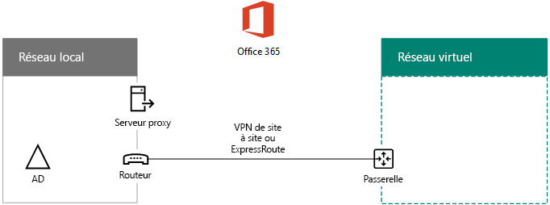

# Déployer Office 365 la synchronisation d’annuaire dans Microsoft Azure

 **Résumé :** Déployer Azure AD se connecter sur une machine virtuelle dans Azure pour synchroniser les comptes entre votre répertoire local et le locataire Azure AD de votre abonnement à Office 365.
  
Azure Active Directory (AD) Connect (auparavant appelé outil de synchronisation d'annuaires ou outil DirSync.exe) est une application serveur à installer sur un serveur appartenant à un domaine pour synchroniser vos utilisateurs Windows Server Active Directory locaux sur le client Azure Active Directory de votre abonnement Office 365. Vous pouvez installer Azure AD Connect sur un serveur local, mais également sur une machine virtuelle dans Azure, pour les raisons suivantes :
  
- Vous pouvez mettre en service et configurer les serveurs cloud plus rapidement, les rendant ainsi disponibles plus tôt pour vos utilisateurs.
    
- Azure offre une meilleure disponibilité de site avec moins d'efforts.
    
- Vous pouvez réduire le nombre de serveurs locaux de votre organisation.
    
> [!IMPORTANT]
> Cette solution exige une connectivité entre votre réseau local et votre réseau virtuel Azure. Pour plus d'informations, voir [Connecter un réseau local à Microsoft Azure Virtual Network](connect-an-on-premises-network-to-a-microsoft-azure-virtual-network.md). 
  
> [!IMPORTANT]
> Cet article décrit la synchronisation d'un domaine unique dans une forêt unique. Azure AD Connect synchronise tous les domaines Windows Server AD dans votre forêt Active Directory avec Office 365. Si vous avez plusieurs forêts Active Directory à synchroniser avec Office 365, voir l'article sur le [scénario de synchronisation d'annuaires à plusieurs forêts avec authentification unique](https://go.microsoft.com/fwlink/p/?LinkId=393091). 
  
> [!NOTE]
> Office 365 utilise Azure Active Directory (Azure AD) pour son service d'annuaire. Votre abonnement à Office 365 comprend un client Azure AD. Ce client peut également être utilisé pour la gestion des identités de votre organisation avec d'autres charges de travail de cloud, y compris d'autres applications SaaS et des applications dans Azure. 
  
## Vue d’ensemble du déploiement de la synchronisation d’annuaires Office 365 dans Azure

Le diagramme suivant montre Azure connexion AD en cours d’exécution sur une machine virtuelle dans Azure (le serveur de synchronisation d’annuaire) qui synchronise une forêt de Windows Server, Active Directory local à anOffice 365 abonnement.
  

  
Dans le diagramme, il y a deux réseaux reliés par une connexion de site à site VPN ou ExpressRoute. Il existe un réseau local où se trouvent les contrôleurs de domaine Windows Server Active Directory et un réseau virtuel est Azure avec un serveur de synchronisation d’annuaire, qui est une machine virtuelle exécutant [Azure Connect d’Active Directory](https://www.microsoft.com/download/details.aspx?id=47594). Il existe deux flux de trafic principal à partir du serveur de synchronisation d’annuaire d’origine :
  
-  Azure AD Connect interroge un contrôleur de domaine sur le réseau local concernant les modifications apportées aux comptes et aux mots de passe.
    
-  Azure AD connexion envoie les modifications à des comptes et des mots de passe à l’instance d’Azure AD de votre abonnement à Office 365. Puisque le serveur de synchronisation d’annuaire est une partie étendue du réseau local, ces modifications sont envoyées via le serveur proxy du réseau local.
    
> [!NOTE]
> Cette solution décrit la synchronisation d'un domaine Active Directory unique dans une forêt Active Directory unique. Azure AD Connect synchronise tous les domaines Active Directory dans votre forêt Active Directory avec Office 365. Si vous avez plusieurs forêts Active Directory à synchroniser avec Office 365, reportez-vous à l'article sur le [scénario de synchronisation d'annuaires à plusieurs forêts avec authentification unique](https://go.microsoft.com/fwlink/p/?LinkId=393091). 
  
Dans les deux cas, le trafic provenant d'Azure AD Connect en cours d'exécution sur la machine virtuelle Azure est transféré vers une passerelle sur le réseau virtuel dans Azure, qui transfert ensuite le trafic via la connexion VPN ou ExpressRoute de site à site au périphérique de passerelle VPN sur le réseau local. L'infrastructure de routage du réseau local transfert par la suite le trafic à sa destination, par exemple un contrôleur de domaine ou un serveur proxy.
  
Le déploiement de cette solution comporte deux étapes principales :
  
1. La création d'un réseau virtuel Azure et l'établissement d'une connexion VPN de site à site vers votre réseau local. Pour plus d'informations, voir [Connecter un réseau local à Microsoft Azure Virtual Network](connect-an-on-premises-network-to-a-microsoft-azure-virtual-network.md).
    
2. L'installation d'[Azure AD Connect](https://www.microsoft.com/download/details.aspx?id=47594) sur une machine virtuelle appartenant à un domaine dans Azure, puis la synchronisation de Windows Server AD local avec Office 365. Cela implique les étapes suivantes :
    
    Création d'un Ordinateur virtuel Azure pour exécuter Azure AD Connect.
    
    Installation et configuration d'[Azure AD Connect](https://www.microsoft.com/download/details.aspx?id=47594).
    
    La configuration d'Azure AD Connect exige les informations d'identification (nom d'utilisateur et mot de passe) d'un compte d'administrateur Azure AD et d'un compte d'administrateur d'entreprise Windows Server AD. Azure AD Connect est exécuté immédiatement et régulièrement pour synchroniser la forêt Windows Server AD locale avec Office 365.
    
Avant de déployer cette solution en production, suivez les instructions de la [synchronisation](dirsync-for-your-office-365-dev-test-environment.md) d’annuaire pour votre environnement de développement/test Office 365 pour définir cette configuration comme une preuve de concept, de démonstrations ou d’expérimentation.
  
> [!IMPORTANT]
> Une fois la configuration d’Azure AD Connect terminée, les informations d’identification de compte d’administrateur d’entreprise Windows Server AD ne sont pas enregistrées. 
  
> [!NOTE]
> Cette solution décrit la synchronisation d'une seule forêt Active Directory de Windows Server à Office 365. La topologie décrite dans cet article ne représente qu'un seul moyen de mettre en œuvre cette solution. La topologie de votre organisation peut-être différer en fonction de vos besoins réseau unique et les considérations sur la sécurité. 
  
## Plan de l’hébergement d’un serveur de synchronisation d’annuaire pour Office 365 dans Azure

### Conditions préalables

Avant de commencer, passez en revue les conditions préalables suivantes pour cette solution :
  
- Examinez le contenu de planification associé dans [Planification de votre réseau Azure Virtual Network](connect-an-on-premises-network-to-a-microsoft-azure-virtual-network.md#PlanningVirtual).
    
- Veillez à respecter toutes les [conditions préalables](connect-an-on-premises-network-to-a-microsoft-azure-virtual-network.md#Prerequisites) pour la configuration du réseau virtuel Azure.
    
- Vous devez disposer d'un abonnement Office 365 qui inclut la fonctionnalité d'intégration Active Directory. Pour plus d'informations sur les abonnements Office 365, accédez à la [page d'abonnement Office 365](https://go.microsoft.com/fwlink/p/?LinkId=394278).
    
- Vous devez configurer un Ordinateur virtuel Azure qui exécute Azure AD Connect pour synchroniser votre forêt Windows Server AD locale avec Office 365.
    
    Vous devez disposer des informations d'identification (noms et mots de passe) d'un compte d'administrateur d'entreprise Windows Server AD et d'un compte d'administrateur Active Directory Azure.
    
### Hypothèses en matière de conception de l’architecture de la solution

La liste suivante décrit les choix de conception effectués pour cette solution.
  
- Cette solution utilise un seul réseau virtuel Azure avec une connexion VPN de site à site. Le réseau virtuel Azure héberge un seul sous-réseau contenant un seul serveur, le serveur de synchronisation d’annuaire Azure Connect d’Active Directory est en cours d’exécution. 
    
- Sur le réseau local, un contrôleur de domaine et des serveurs DNS existent.
    
- Azure Connect d’Active Directory effectue la synchronisation de hachage de mot de passe au lieu de l’ouverture de session unique. Vous n’êtes pas obligé de déployer une infrastructure de Services de fédération Active Directory (Active Directory Federation Services). Pour plus d’informations sur la synchronisation de hachage de mot de passe et les options d’ouverture de session unique, reportez-vous à la section [choix de la méthode d’authentification de droite pour votre solution d’identité hybride Azure Active Directory](http://aka.ms/auth-options).
    
Il existe des choix de conception supplémentaires que vous pourriez envisager lorsque vous déployez cette solution dans votre environnement. Ceux-ci incluent notamment :
  
- S’il existe des serveurs DNS dans un réseau virtuel Azure, déterminez si vous voulez que votre serveur de synchronisation d’annuaire à utiliser pour la résolution de noms plutôt que des serveurs DNS sur le réseau local.
    
- S’il existe des contrôleurs de domaine dans un réseau virtuel Azure, déterminez si la configuration de Services et Sites Active Directory peut être une meilleure solution pour vous. Le serveur de synchronisation d’annuaire peut interroger les contrôleurs de domaine dans le réseau virtuel Azure des modifications dans les comptes et mots de passe au lieu de contrôleurs de domaine sur le réseau local.
    
## Feuille de route de déploiement

Le déploiement d'Azure AD Connect sur une machine virtuelle dans Azure se compose de trois phases :
  
- Phase 1 : créer et configurer le réseau virtuel Azure
    
- Phase 2 : créer et configurer les machines virtuelles Azure
    
- Phase 3 : installer et configurer Azure AD Connect
    
Après le déploiement, vous devez également affecter des emplacements et des licences pour les nouveaux comptes d’utilisateur dans Office 365.
  
> [!TIP]
> Le [Serveur de synchronisation d’annuaire dans le Kit de déploiement d’Azure](https://gallery.technet.microsoft.com/DirSync-Server-in-Azure-32cb2ded) contient tous les blocs d’Azure PowerShell pour développer cette solution, les diagrammes au format Microsoft PowerPoint et Visio et un classeur Microsoft Excel configuration génère Blocs de commande PowerShell Azure personnalisés pour vos paramètres.
  
### Phase 1 : créer et configurer le réseau virtuel Azure

Pour créer et configurer le réseau virtuel Azure, effectuez la [phase 1 en préparant votre réseau local](connect-an-on-premises-network-to-a-microsoft-azure-virtual-network.md#Phase1) et la [phase 2 en créant le réseau virtuel entre différents locaux dans Azure](connect-an-on-premises-network-to-a-microsoft-azure-virtual-network.md#Phase2) décrites dans la feuille de route de déploiement de l’article [Connecter un réseau local à Microsoft Azure Virtual Network](connect-an-on-premises-network-to-a-microsoft-azure-virtual-network.md).
  
Voici la configuration finale.
  

  
Cette illustration montre un réseau local connecté à un réseau virtuel Azure via une connexion VPN ou ExpressRoute de site à site.
  
### Phase 2 : créer et configurer les machines virtuelles Azure

Créez la machine virtuelle dans Azure en suivant les instructions décrites dans [Créer votre première machine virtuelle Windows dans le portail Azure](https://go.microsoft.com/fwlink/p/?LinkId=393098). Utilisez les paramètres suivants :
  
- Dans le volet **De base**, sélectionnez le même abonnement, le même emplacement et le même groupe de ressources que votre réseau virtuel. Enregistrez le nom d'utilisateur et le mot de passe dans un emplacement sécurisé. Vous en aurez besoin ultérieurement pour vous connecter à la machine virtuelle.
    
- Dans le volet **Choisir une taille**, choisissez la taille **A2 Standard**.
    
- Dans le volet **paramètres** , dans la section de **stockage** , sélectionnez le type de stockage **Standard** . Dans la section **réseau** , sélectionnez le nom du réseau virtuel et le sous-réseau pour héberger le serveur de synchronisation d’annuaire (pas le GatewaySubnet). Laissez tous les autres paramètres à leurs valeurs par défaut.
    
Vérifiez que votre serveur de synchronisation d’annuaire utilise DNS correctement en vérifiant votre DNS interne afin de vous assurer qu’un enregistrement d’adresse (A) a été ajouté pour l’ordinateur virtuel avec son adresse IP. 
  
Suivez les instructions de [se connecter à la machine virtuelle et le signe sur](https://docs.microsoft.com/azure/virtual-machines/virtual-machines-windows-hero-tutorial?toc=%2fazure%2fvirtual-machines%2fwindows%2ftoc.json#connect-to-the-virtual-machine-and-sign-on) se pour connecter au serveur de synchronisation d’annuaire avec une connexion Bureau à distance. Après l’ouverture de session, joindre l’ordinateur virtuel au domaine Windows Active Directory du serveur local.
  
Pour Azure AD se connecter accéder à des ressources Internet, vous devez configurer le serveur de synchronisation d’annuaire pour utiliser le serveur proxy du réseau local. Vous devez contacter votre administrateur réseau pour toutes les étapes de configuration supplémentaires à effectuer.
  
Voici la configuration finale.
  

  
Cette figure illustre la serveur directory synchronisation machine virtuelle dans la coexistence Azure réseau virtuel.
  
### Phase 3 : installer et configurer Azure AD Connect

Procédez comme suit :
  
1. Se connecter au serveur de synchronisation d’annuaire à l’aide d’une connexion Bureau à distance avec un compte de domaine Windows Server Active Directory qui possède des privilèges d’administrateur local. Voir [se connecter à la machine virtuelle et l’ouverture de session](https://docs.microsoft.com/azure/virtual-machines/virtual-machines-windows-hero-tutorial?toc=%2fazure%2fvirtual-machines%2fwindows%2ftoc.json#connect-to-the-virtual-machine-and-sign-on).
    
2. Depuis le serveur de synchronisation d’annuaire, ouvrez l’article [configurer la synchronisation d’annuaire dans Office 365](https://support.office.com/article/Set-up-directory-synchronization-in-Office-365-1b3b5318-6977-42ed-b5c7-96fa74b08846) et suivez les instructions pour la synchronisation d’annuaire avec synchronisation de hachage de mot de passe.
    
> [!CAUTION]
> Le programme d'installation crée le compte **AAD_xxxxxxxxxxxx** dans l'unité d'organisation (UO) Utilisateurs locaux. Ne déplacez pas ou ne supprimez pas ce compte, ou la synchronisation échouera.
  
Voici la configuration finale.
  

  
Cette figure illustre le serveur de synchronisation d’annuaire avec Azure Connect de publicité dans la coexistence Azure réseau virtuel.
  
### Affectation d’emplacements et de licences à des utilisateurs dans Office 365

Azure AD Connect ajoute des comptes à votre abonnement Office 365 à partir de Windows Server AD en local, mais pour que les utilisateurs se connectent à Office 365 et utilisent ses services, les comptes doivent être configurés avec un emplacement et des licences. Utilisez ces étapes pour ajouter l’emplacement et activer les licences pour les comptes d’utilisateur appropriés :
  
1. Connectez-vous à la [page du portail Office 365](https://portal.office.com), puis cliquez sur **Administrateur**.
    
2. Dans la navigation de gauche, cliquez sur **Utilisateurs > Utilisateurs actifs**.
    
3. Dans la liste des comptes d’utilisateur, sélectionnez la case à cocher en regard de l’utilisateur que vous souhaitez activer.
    
4. Sur la page de l'utilisateur, cliquez sur **Modifier** pour **Licences de produits**.
    
5. Sur la page **Licences de produit**, sélectionnez un emplacement pour l'utilisateur pour **Emplacement**, puis activez les licences appropriées pour l'utilisateur.
    
6. Lorsque vous avez terminé, cliquez sur **Enregistrer**, puis sur **Fermer** deux fois.
    
7. Revenez à l’étape 3 pour d’autres utilisateurs.
    
## Voir aussi

[Adoption du cloud et solutions hybrides](cloud-adoption-and-hybrid-solutions.md)
  
[Connecter un réseau local à Microsoft Azure Virtual Network](connect-an-on-premises-network-to-a-microsoft-azure-virtual-network.md)

[Télécharger Azure AD Connect](https://www.microsoft.com/download/details.aspx?id=47594)
  
[Configurer la synchronisation d'annuaires pour Office 365](https://support.office.com/article/Set-up-directory-synchronization-in-Office-365-1b3b5318-6977-42ed-b5c7-96fa74b08846)
  
[Serveur de synchronisation d’annuaire dans le Kit de déploiement d’Azure](https://gallery.technet.microsoft.com/DirSync-Server-in-Azure-32cb2ded)

