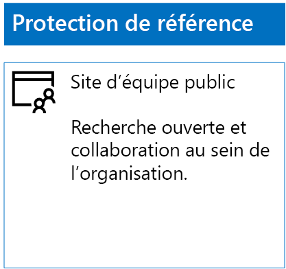
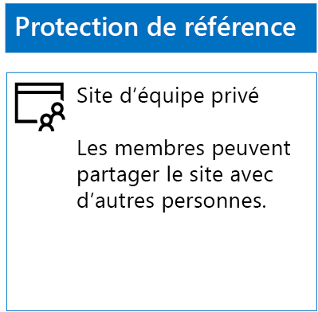
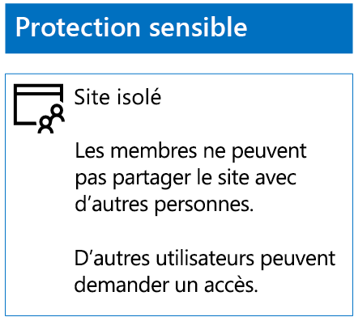
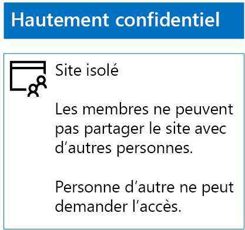

# Déploiement de sites SharePoint Online à trois niveaux de protection

 **Résumé :** Créer et configurer des sites d’équipe SharePoint Online pour différents niveaux de protection des informations.
  
Utilisez les étapes de cet article pour concevoir et déployer la base, sensibles et hautement confidentielles SharePoint Online sites d’équipe. Pour plus d’informations sur ces trois niveaux de protection, voir les [fichiers et les sites SharePoint Online de la sécuriser](secure-sharepoint-online-sites-and-files.md).
  
## Sites d’équipe SharePoint Online de référence

La protection de référence concerne les sites d’équipe publics et privés. Les sites publics peuvent être recherchés par toute personne de l’organisation. Seules ces personnes peuvent y accéder. Les sites privés peuvent uniquement être recherchés par les membres du groupe Office 365 associé au site d’équipe et seuls ces derniers peuvent y accéder. Ces deux types de sites d’équipe autorisent les membres à partager le site avec d’autres personnes.
  
### Public

Pour créer un site d’équipe SharePoint Online de référence avec des autorisations et un accès publics, suivez les étapes suivantes :
  
1. Connectez-vous au portail Office 365 avec un compte qui sera également utilisé pour administrer le site d’équipe SharePoint Online (un administrateur SharePoint Online). Pour de l’aide, consultez la rubrique [pour vous connecter à Office 365](https://support.office.com/Article/Where-to-sign-in-to-Office-365-e9eb7d51-5430-4929-91ab-6157c5a050b4).
    
2. Dans la liste des mosaïques, cliquez sur **SharePoint**.
    
3. Dans l’onglet nouveau **SharePoint** dans votre navigateur, cliquez sur **+ créer le site**.
    
4. Dans la page **créer un site** , cliquez sur **site d’équipe**.
    
5. Dans la zone **nom du Site**, tapez un nom pour le site d’équipe public. 
    
6. Dans la **description de site d’équipe**, tapez une description de l’objet du site.
    
7. Dans les **paramètres de confidentialité**, sélectionnez **Public - tout le monde dans l’organisation peut accéder à ce site**, puis cliquez sur **suivant**.
    
8. Sur le **qui voulez-vous ajouter ?** volet, cliquez sur **Terminer**.
    
Voici la configuration finale.
  

  
### Privé

Pour créer un site d’équipe SharePoint Online de référence avec des autorisations et un accès privés, suivez les étapes suivantes :
  
1. Connectez-vous au portail Office 365 avec un compte qui sera également utilisé pour administrer le site d’équipe SharePoint Online (un administrateur SharePoint Online). Pour de l’aide, consultez la rubrique [pour vous connecter à Office 365](https://support.office.com/Article/Where-to-sign-in-to-Office-365-e9eb7d51-5430-4929-91ab-6157c5a050b4).
    
2. Dans la liste des mosaïques, cliquez sur **SharePoint**.
    
3. Dans l’onglet nouveau **SharePoint** dans votre navigateur, cliquez sur **+ créer le site**.
    
4. Dans la page **créer un site** , cliquez sur **site d’équipe**.
    
5. Dans la zone **nom du Site**, tapez un nom pour le site d’équipe privé. 
    
6. Dans la **description de site d’équipe,** tapez une description de l’objet du site.
    
7. Dans **les paramètres de confidentialité**, sélectionnez **privé - uniquement les membres peuvent accéder à ce site**, puis cliquez sur **suivant**.
    
8. Sur le **qui voulez-vous ajouter ?** volet, dans la zone **Ajouter des membres**, tapez les noms des comptes d’utilisateurs qui ont accès à ce site d’équipe privé.
    
9. Lorsque vous avez terminé l’ajout de l’ensemble initial de membres au site, cliquez sur **Terminer**
    
Voici la configuration finale.
  

  
## Sites d’équipe SharePoint Online sensibles

Un site d’équipe SharePoint Online sensible est un site d’équipe isolé. En d’autres termes, les autorisations sont contrôlées selon l’appartenance de l’utilisateur à des groupes SharePoint, et non selon son appartenance au groupe Office 365 associé au site d’équipe.
  
La création d’un site d’équipe isolé se déroule en deux étapes.
  
### Étape 1 : conception du site isolé

Pour concevoir votre site d’équipe isolé, vous devez choisir :
  
- vos groupes SharePoint et les niveaux d’autorisation ;
    
- les groupes d’accès qui seront membres de vos groupes SharePoint.
    
     Le jeu de groupes d’accès recommandé est un des membres du site, un pour les visiteurs du site affichent et un pour les administrateurs de site.
    
- si vous allez utiliser des groupes imbriqués au sein de vos groupes d’accès.
    
Voici à quoi peuvent ressembler les niveaux d’autorisation et de structure du groupe recommandés :
  
|**Groupe SharePoint**|**Niveau d’autorisation**|**Groupe d’accès (exemples)**|
|:-----|:-----|:-----|
|[nom de site] Membres    |Modification    |[nom de site] Membres    |
|[nom de site] Visiteurs    |Lecture    |[nom de site] Afficheurs    |
|[nom de site] Propriétaires    |Contrôle total    |[nom de site] Administrateurs    |
   
Les groupes SharePoint et les niveaux d’autorisation sont créés par défaut pour un site d’équipe. Vous devez nommer vos groupes d’accès.
  
Pour les détails du processus de conception, consultez [conception d’un site d’équipe SharePoint Online isolé](design-an-isolated-sharepoint-online-team-site.md).
  
### Étape 2 : déploiement du site isolé

Pour déployer votre site isolé, vous devez d’abord :
  
- déterminer les comptes d’utilisateurs et les groupes à ajouter à chacun de vos groupes d’accès ;
    
- créer les groupes d’accès et ajouter les utilisateurs et les membres du groupe.
    
Pour obtenir la procédure détaillée, voir la **Phase 1** de [déployer un site d’équipe SharePoint Online isolé](deploy-an-isolated-sharepoint-online-team-site.md).
  
Ensuite, vous devez créer le site d’équipe SharePoint Online en suivant ces étapes.
  
1. Connectez-vous au portail Office 365 avec un compte qui sera également utilisé pour administrer le site d’équipe SharePoint Online (un administrateur SharePoint Online). Pour de l’aide, consultez la rubrique [pour vous connecter à Office 365](https://support.office.com/Article/Where-to-sign-in-to-Office-365-e9eb7d51-5430-4929-91ab-6157c5a050b4).
    
2. Dans la liste des mosaïques, cliquez sur **SharePoint**.
    
3. Dans le nouvel onglet **SharePoint** de votre navigateur, cliquez sur **+ créer le site**.
    
4. Dans la page **créer un site** , cliquez sur **site d’équipe**.
    
5. Dans la zone **nom du Site**, tapez un nom pour le site d’équipe privé.
    
6. Dans la **description de site d’équipe**, tapez une description facultative.
    
7. Dans **les paramètres de confidentialité**, sélectionnez **privé - uniquement les membres peuvent accéder à ce site**, puis cliquez sur **suivant**.
    
8. Sur le **qui voulez-vous ajouter ?** volet, cliquez sur **Terminer**.
    
Ensuite, dans le nouveau site d’équipe SharePoint Online, configurez les autorisations en suivant ces étapes.
  
1. Choisissez le Nom d’utilisateur principal (UPN) de l’administrateur informatique ou d’une autre personne qui sera chargée de répondre aux demandes d’accès au site (belindan@contoso.com est un exemple d’UPN). Notez cet UPN ici : _________________________________________.
    
2. Dans la barre d’outils, cliquez sur l’icône de paramètres, puis cliquez sur **autorisations du Site**.
    
3. Dans le volet **autorisations de Site** , cliquez sur **autorisations avancées**.
    
4. Dans l’onglet **autorisations** de nouveau de votre navigateur, cliquez sur **Paramètres de demande d’accès**.
    
5. Dans la boîte de dialogue **Paramètres de demandes d’accès** :
    
  - Désactivez les cases à cocher **Autoriser les membres à inviter d’autres personnes au groupe de membres du site** et de **permettre aux membres de partager le site et les fichiers et dossiers individuels** .
    
  - Dans la zone **Envoyer toutes les demandes d’accès**, tapez le nom UPN de l’administrateur de l’étape 1.
    
  - Cliquez sur **OK**.
    
6. Dans l’onglet **autorisations** de votre navigateur, cliquez sur **membres de [nom de site]** dans la liste.
    
7. **Personnes et groupes**, cliquez sur **Nouveau**.
    
8. Dans la boîte de dialogue de **partage** , tapez le nom de votre groupe d’accès de membres de site pour ce site, sélectionnez-le, puis cliquez sur **partage**.
    
9. Cliquez sur le bouton de retour de votre navigateur.
    
10. Dans la liste, cliquez sur **[nom de site] propriétaires** .
    
11. **Personnes et groupes**, cliquez sur **Nouveau**.
    
12. Dans la boîte de dialogue de **partage** , tapez le nom du groupe de l’accès aux administrateurs du site pour ce site, sélectionnez-le, puis cliquez sur **partage**.
    
13. Cliquez sur le bouton de retour de votre navigateur.
    
14. Dans la liste, cliquez sur **les visiteurs de [nom de site]** .
    
15. **Personnes et groupes**, cliquez sur **Nouveau**.
    
16. Dans la boîte de dialogue de **partage** , tapez le nom du groupe d’accès site visionneuses pour ce site, sélectionnez-le, puis cliquez sur **partage**.
    
17. Fermez l’onglet **autorisations** de votre navigateur.
    
Voici les résultats que vous devez escompter :
  
- Le groupe SharePoint **propriétaires de [nom de site]** contient le groupe Administrateurs l’accès, dans laquelle tous les membres ont le niveau d’autorisation **contrôle total** .
    
- Le groupe SharePoint **des membres de [nom de site]** contient le groupe membres de l’accès, dans laquelle tous les membres ont le niveau d’autorisation **Modifier** .
    
- Le groupe SharePoint **visiteurs de [nom de site]** contient le groupe d’accès site visionneuses, dans lequel tous les membres ont le niveau d’autorisation **lecture** .
    
- La capacité des membres à inviter d’autres membres est désactivée.
    
- La possibilité pour les États non membres demander l’accès est activée.
    
Voici la configuration finale.
  

  
En étant membres de l’un des groupes d’accès, les membres du site peuvent désormais travailler avec les ressources du site en toute sécurité.
  
## Sites d’équipe SharePoint Online hautement confidentiels

Un site d’équipe SharePoint Online hautement confidentiel est un site d’équipe isolé. En d’autres termes, les autorisations sont contrôlées selon l’appartenance de l’utilisateur à des groupes SharePoint, et non selon son appartenance au groupe Office 365 associé au site d’équipe.
  
Pour créer un site d’équipe isolé pour protéger le travail et les informations hautement confidentielles partagées sur le site, vous devez suivre deux étapes.
  
### Étape 1 : conception du site isolé

Pour concevoir votre site d’équipe isolé, vous devez choisir :
  
- vos groupes SharePoint et les niveaux d’autorisation ;
    
- les groupes d’accès qui seront membres de vos groupes SharePoint.
    
     Le jeu de groupes d’accès recommandé est un des membres du site, un pour les visiteurs du site affichent et un pour les administrateurs de site.
    
- si vous allez utiliser des groupes imbriqués au sein de vos groupes d’accès.
    
Voici à quoi peuvent ressembler les niveaux d’autorisation et de structure du groupe recommandés :
  
|**Groupe SharePoint**|**Niveau d’autorisation**|**Groupe d’accès (exemples)**|
|:-----|:-----|:-----|
|[nom de site] Membres    |Modification    |[nom de site] Membres    |
|[nom de site] Visiteurs    |Lecture    |[nom de site] Afficheurs    |
|[nom de site] Propriétaires    |Contrôle total    |[nom de site] Administrateurs    |
   
Les groupes SharePoint et les niveaux d’autorisation sont créés par défaut pour un site d’équipe. Vous devez nommer vos groupes d’accès.
  
Pour les détails du processus de conception, consultez [conception d’un site d’équipe SharePoint Online isolé](design-an-isolated-sharepoint-online-team-site.md).
  
### Étape 2 : déploiement du site isolé

Pour déployer votre site isolé, vous devez d’abord :
  
- déterminer les utilisateurs et les membres du groupe de chacun de vos groupes d’accès ;
    
- créer les groupes d’accès et ajouter les utilisateurs et les membres du groupe ;
    
- créer un site d’équipe isolé qui utilise vos groupes d’accès.
    
Pour obtenir la procédure détaillée, voir [déploiement d’un site d’équipe SharePoint Online isolé](deploy-an-isolated-sharepoint-online-team-site.md).
  
Voici les résultats que vous devez escompter :
  
- Le groupe SharePoint **propriétaires de [nom de site]** contient le groupe Administrateurs l’accès, dans laquelle tous les membres ont le niveau d’autorisation **contrôle total** .
    
- Le groupe SharePoint **des membres de [nom de site]** contient le groupe membres de l’accès, dans laquelle tous les membres ont le niveau d’autorisation **Modifier** .
    
- Le groupe SharePoint **visiteurs de [nom de site]** contient le groupe d’accès site visionneuses, dans lequel tous les membres ont le niveau d’autorisation **lecture** .
    
- La capacité des membres à inviter d’autres membres est désactivée.
    
- La possibilité pour les États non membres demander l’accès est désactivée.
    
Voici la configuration finale.
  

  
En étant membres de l’un des groupes d’accès, les membres du site peuvent désormais travailler avec les ressources du site en toute sécurité.
  
## Étape suivante

[Protéger les fichiers SharePoint Online avec les étiquettes d’Office 365 et DLP](protect-sharepoint-online-files-with-office-365-labels-and-dlp.md)
    
## Voir aussi

[Sécuriser les fichiers et sites SharePoint Online](secure-sharepoint-online-sites-and-files.md)
  
[Sécuriser les sites SharePoint Online dans un environnement de développement/test](secure-sharepoint-online-sites-in-a-dev-test-environment.md)
  
[Conseils de sécurité Microsoft pour les campagnes électorales, les organisations à but non lucratif et d’autres organisations flexibles](microsoft-security-guidance-for-political-campaigns-nonprofits-and-other-agile-o.md)
  
[Adoption du cloud et solutions hybrides](cloud-adoption-and-hybrid-solutions.md)

