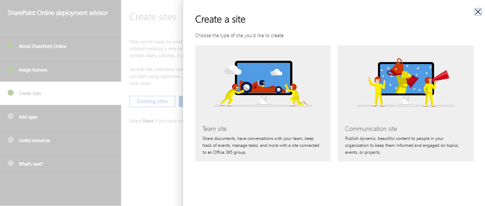

# Conseillers de déploiement pour les services Office 365 ou Microsoft 365Deployment advisors for Office 365 or Microsoft 365 services

Les conseillers de déploiement pour Office 365 ou Microsoft 365 fournissent une prise en charge auto-guidée pour la configuration d’Office 365 pour votre organisation.The deployment advisors for Office 365 or Microsoft 365 provide self-guided support for setting up Office 365 for your organization. Pour y accéder :To access them:

1. Connectez-vous en tant qu’administrateur client dans le [Centre d’administration 365 de Microsoft](https://admin.microsoft.com).Sign in as a tenant administrator in the [Microsoft 365 admin center](https://admin.microsoft.com).
2. Sélectionnez l’un des conseillers ou des guides de déploiement ci-dessous.Select one of the deployment advisors or guides listed below.

Si vous ne vous connectez pas en tant qu’administrateur client, vous verrez finalement un message vous devez disposer des autorisations d’administrateur de client.If you don't sign in as a tenant admin, you will eventually see a message that you need to have tenant administrator permissions.

Chaque conseiller est un assistant qui vous guide tout au long des différentes fonctionnalités et options que vous souhaitez déployer.Each advisor is a wizard that guides you through your choices for the features and options you want to deploy. Dans certains cas, vous pouvez utiliser l’Assistant pour configurer un paramètre ou activer un paramètre.In some cases, you can use the wizard to configure something or activate a setting. Voici un exemple.Here is an example.

Le conseiller vous guide à travers les décisions de personnalisation de vos besoins.The advisor steps you through decisions for customization to your needs. Tout au long de la procédure, vous obtiendrez des instructions, des scripts et d’autres ressources pour apporter les modifications de configuration.Along the way, you'll get instructions, scripts, and other resources to make the configuration changes.

À la fin, vous obtiendrez des liens vers des vidéos et des Articles de référence.At the end, you'll get links to videos and reference articles. Voici un exemple.Here is an example.

Vous pouvez utiliser ces conseillers à tout moment pour en savoir plus sur les fonctionnalités et les options d’Office 365.You can use these advisors anytime to learn more about Office 365 features and options. Cela inclut lors de la planification ou après que vous avez déjà configuré les services.This includes during planning or after you've already set up the services.
  
## Microsoft 365 : Windows 10 avec Office 365Microsoft 365: Windows 10 with Office 365

Microsoft 365 est une solution complète et intelligente qui inclut Office 365, Windows 10 et Enterprise Mobility + Security (EMS).Microsoft 365 is a complete, intelligent solution that includes Office 365, Windows 10, and Enterprise Mobility + Security (EMS). Microsoft 365 permet à tout le monde d’être créatif et de collaborer en toute sécurité.Microsoft 365 empowers everyone to be creative and work together, securely. 

Utilisez ce conseiller pour configurer des appareils Windows 10 ou mettre à niveau les ordinateurs des utilisateurs vers Windows 10, avec un déploiement facultatif d’applications Office, Windows Analytics et Windows Defender Advanced Threat Protection (ATP) (Microsoft 365 Enterprise E5 plan only).Use this advisor to set up Windows 10 devices or upgrade users' computers to Windows 10, with optional deployment of Office apps, Windows Analytics, and Windows Defender Advanced Threat Protection (ATP) (Microsoft 365 Enterprise E5 plan only).

|||
|:-------|:-----|
| **Générer****Run:** | [Conseiller de déploiement Microsoft 365Microsoft 365 deployment advisor](https://aka.ms/microsoft365setupguide) |
|||

## Préparer votre environnement Office 365Prepare your Office 365 environment 

Vous devrez nous faire part de vos objectifs de déploiement pour vous assurer que vous ajoutez des domaines, créez des utilisateurs et attribuez des licences dans le bon ordre.You'll need to tell us your deployment goals to make sure you add domains, create users, and assign licenses in the proper order. 

|||
|:-------|:-----|
| **Générer****Run:** | [Guide de préparation de votre environnementPrepare your environment guide](https://go.microsoft.com/fwlink/?linkid=2005213) |
| **Visualisez****Watch:** | [Préparer votre environnementPrepare your environment](https://go.microsoft.com/fwlink/?linkid=2043822) |
||||

### Verify your domainVerify your domain

Vous devez personnaliser Office 365 en ajoutant votre propre nom de domaine (également appelé nom de votre site Web).You need to customize Office 365 by adding your own domain name (also known as your website name).

|||
|:-------|:-----|
| **Générer****Run:** |  [Vérifier votre domaine dans Office 365 AdvisorVerify your domain in Office 365 advisor](https://aka.ms/verifyyourdomaino365) |
|||

<!--
+++++++++++++++++++++++++++++++++++++++++++++++++++++++++++++++

OLD SECTION

The deployment advisors for Office 365 provide self-guided support for setting up Office 365 for your organization. To access them for your Office 365 or Microsoft 365 subscription:

1. Sign in as a tenant administrator in the [Microsoft 365 admin center](https://admin.microsoft.com).
2. Select one of the deployment advisors or guides listed in this article.

>[!Note]
>If you do not sign in as a tenant admin, you will eventually see a message that you need to have tenant administrator permissions.
>

Within each advisor, select the features and options you want to deploy. Here is an example.

The advisor builds a step-by-step setup plan that's customized to your needs. Along the way, you'll get a full set of instructions, scripts, and other resources to make the configuration changes.

At the end, you'll get links to videos and reference articles. Here is an example.

Some advisors have automation that will change some of your settings, while in other areas of the advisor you change your settings and data, using the advisor to guide you. 

You can use these advisors anytime to learn more about Office 365 features and options. This includes during planning or after you've already set up the services.
  
## Microsoft 365: Windows 10 with Office 365

Microsoft 365 is a complete, intelligent solution that includes Office 365, Windows 10, and Enterprise Mobility + Security (EMS). Microsoft 365 empowers everyone to be creative and work together, securely. 

Use this advisor to set up Windows 10 devices or upgrade users' computers to Windows 10, with optional deployment of Office apps, Windows Analytics, and Windows Defender Advanced Threat Protection (Microsoft 365 Enterprise E5 plan only).

|||
|:-------|:-----|
| **Run:** | Run the [Microsoft 365 deployment advisor](https://aka.ms/microsoft365setupguide) |
|||

## Prepare your Office 365 environment 

You'll need to tell us your deployment goals to make sure you add domains, create users, and assign licenses in the proper order. 

Watch the [Prepare your environment](https://go.microsoft.com/fwlink/?linkid=2043822) video for an overview.

|||
|:-------|:-----|
| **Run:** | Run the [Prepare your environment guide](https://go.microsoft.com/fwlink/?linkid=2005213) |
|||

+++++++++++++++++++++++++++++++++++++++++++++++++++++++++++++++
-->

## Protection et migration de messagerieEmail migration and protection

### Conseil sur la migration ExchangeExchange migration advisor

Vous devrez déplacer des boîtes aux lettres à partir de votre système de messagerie actuel vers Exchange Online dans Office 365 avec des outils automatisés et des instructions étape par étape.You'll need to you move mailboxes from your current mail system to Exchange Online in Office 365 with automated tools and step-by-step guidance. Nous vous recommandons de choisir le meilleur chemin de migration pour votre organisation en fonction de votre système de messagerie actuel, le nombre de boîtes aux lettres que vous souhaitez migrer et la manière dont vous prévoyez de gérer les utilisateurs et l’accès des utilisateurs.We'll recommend the best migration path for your organization based on your current mail system, the number of mailboxes you want to migrate, and how you plan to manage users and user access.

|||
|:-------|:-----|
| **Générer****Run:** | [Office 365 mail migration AdvisorOffice 365 mail migration advisor](https://aka.ms/office365setup) |
| **Visualisez****Watch:** | [Préparer votre environnementPrepare your environment](https://go.microsoft.com/fwlink/?linkid=2043822)   [Présentation et configuration d’Outlook pour iOSOutlook for iOS introduction and setup](https://aka.ms/mpuwwm)   [Présentation et configuration d’Outlook pour AndroidOutlook for Android introduction and setup](https://aka.ms/qrbfm3)   [Présentation et configuration d’Outlook pour Windows PhoneOutlook for Windows Phone introduction and setup](https://aka.ms/kkw96x) |
|||
  
Si vous disposez de Gmail, vous devez migrer vos contacts gmail et vos éléments de calendrier Google vers Office 365.If you have Gmail, you'll need to migrate your Gmail contacts and Google Calendar items to Office 365. Lorsque vous migrez la boîte aux lettres gmail d’un utilisateur vers Office 365, les messages électroniques sont migrés, mais pas les contacts et les éléments de calendrier.When you migrate a user's Gmail mailbox to Office 365, email messages are migrated, but contacts and calendar items are not. Ce guide décrit les étapes à suivre pour importer des contacts gmail et des éléments de calendrier Google vers Office 365.This guide provides the steps for importing Gmail contacts and Google Calendar items to Office 365.

|||
|:-------|:-----|
| **Générer****Run:** |  [Assistant de calendrier et contacts gmailGmail contacts and calendar assistant](https://aka.ms/gmailcontactscalendar)   |
|||

## Création, stockage et partage de fichiersFile creation, storage, and sharing

### Microsoft 365 Apps for enterpriseMicrosoft 365 Apps for enterprise

Microsoft 365 apps pour entreprises (précédemment nommé Office 365 ProPlus) permet à vos utilisateurs de fonctionner sur les versions les plus récentes d’Office et de les maintenir à jour.Microsoft 365 Apps for enterprise (previously named Office 365 ProPlus) gets your users up and running on the latest versions of Office and keeps them updated.

Pour savoir comment installer Office sur un PC ou un Mac pour votre entreprise, reportez-vous à ce guide, y compris des conseils pour faire démarrer tous les utilisateurs avec Office.See this guide for the steps to install Office on either a PC or a Mac for your company, including tips for getting everyone started with Office.

|||
|:-------|:-----|
| **Générer****Run:** |  [Guide de démarrage rapide pour les applications Microsoft 365 EnterpriseMicrosoft 365 Apps for enterprise quick start guide](https://aka.ms/OPPquickstartguide)   |
|||

Le conseiller en déploiement Office décrit les étapes à suivre pour aider les utilisateurs à installer directement les applications Microsoft 365 pour l’entreprise directement à partir du portail Office 365 Portal Online ou pour déployer des applications Microsoft 365 pour l’entreprise auprès de vos utilisateurs à partir d’un emplacement local.The Office deployment advisor walks through the steps for helping users install Microsoft 365 Apps for enterprise directly from the Office 365 portal online or for deploying Microsoft 365 Apps for enterprise to your users from an on-premises location. Les instructions relatives à l’utilisation du gestionnaire de configuration de point de terminaison Microsoft, un script de démarrage de stratégie de groupe, une image de disque du système d’exploitation ou l’activation partagée des services Bureau à distance (RDS).Included are instructions for using Microsoft Endpoint Configuration Manager, a Group Policy startup script, an operating system disk image, or Remote Desktop Services (RDS) shared activation.

|||
|:-------|:-----|
| **Générer****Run:** | [Conseiller en matière de déploiement d’OfficeOffice deployment advisor ](https://aka.ms/o365proplusdeploy) | 
| **Visualisez****Watch:** | [Expérience Office en tant que service d’abonnementOffice experience as a subscription service](https://aka.ms/qo45jf)   [Vue d’ensemble des applications Microsoft 365 pour les entreprisesOverview of Microsoft 365 Apps for enterprise](https://aka.ms/r359zr) | 
|||

  

### OneDrive EntrepriseOneDrive for Business

Pour démarrer rapidement avec OneDrive entreprise pour le stockage, le partage et la synchronisation de fichiers, utilisez ce guide.To get started quickly with OneDrive for Business for file storage, sharing, and syncing, use this guide.

|||
|:-------|:-----|
| **Générer****Run:** | [Conseiller en matière de déploiement d’OfficeOffice deployment advisor ](https://aka.ms/o365proplusdeploy) | 
| **Visualisez****Watch:** | [Avantages intégrés de OneDrive entrepriseOneDrive for Business Integrated Advantage](https://aka.ms/f66hqa)   [Bienvenue dans OneDrive : en provenance d’un autre fournisseur de stockage cloudWelcome to OneDrive: Coming from another cloud storage provider](https://videoplayercdn.osi.office.net/embed/6b11f30b-725a-4145-8b72-45a41793a432) | 
|||

### SharePoint OnlineSharePoint Online
  
Si vous ne disposez pas d’une grande quantité de données à migrer ou d’un serveur SharePoint Server local que vous souhaitez continuer à exécuter dans une installation hybride, reportez-vous à ce guide pour configurer SharePoint Online pour le stockage de documents et la gestion de contenu.If you don't have a large amount of data to migrate or an on-premises SharePoint Server that you want to continue running in a hybrid setup, see this guide to set up SharePoint Online for document storage and content management.

|||
|:-------|:-----|
| **Générer****Run:** |[Démarrage rapide de SharePoint OnlineSharePoint Online quick start](https://aka.ms/SPOquickstartguide) |
|||

  
Vous devez choisir l’option de déploiement qui convient le mieux à votre organisation et effectuer les étapes de configuration des fonctionnalités de SharePoint Online pour répondre aux besoins de votre entreprise.You'll need to choose the deployment option that works best for your organization and go through the steps for configuring SharePoint Online features to meet your business needs. Choisir entre un déploiement sur le Cloud, un déploiement hybride ou une migration locale vers le Cloud.Choose from cloud deployment, hybrid deployment, or on-premises-to-cloud migration. Vous allez ensuite suivre les étapes de configuration des fonctionnalités SharePoint Online, telles que le stockage et le partage de fichiers, le partage de fichiers externe, les collections de sites, les paramètres globaux et les profils utilisateur, ainsi que votre site d’équipe Office 365.You'll then follow the steps for configuring SharePoint Online features, like file storage and sharing, external file sharing, site collections, global settings, and user profiles, and your Office 365 team site.

|||
|:-------|:-----|
| **Générer****Run:** | [Conseiller de déploiement SharePoint OnlineSharePoint Online deployment advisor](https://aka.ms/spoguidance) |
| **Visualisez****Watch:** | [SharePoint : vue d’ensembleSharePoint: Overview](https://go.microsoft.com/fwlink/?linkid=2005315)   [SharePoint : hybrideSharePoint: Hybrid](https://go.microsoft.com/fwlink/?linkid=2005219)   [SharePoint : résolution des problèmesSharePoint: Troubleshooting](https://go.microsoft.com/fwlink/?linkid=2005220) |
|||

## Sécurité et identitéSecurity and Identity

### Identité hybride avec Azure Active Directory Connect (Azure AD Connect)Hybrid identity with Azure Active Directory Connect (Azure AD Connect)

Le conseiller Azure AD Connect vous montre comment ajouter des informations de compte d’utilisateur à Office 365 sans créer manuellement chaque utilisateur.The Azure AD Connect advisor shows you how to add user account information to Office 365 without manually creating each user. Il explique également comment configurer la synchronisation de hachage de mot de passe ou l’authentification directe, afin que les utilisateurs puissent se connecter à leur messagerie et à votre domaine à l’aide du même mot de passe.It also shows you how to configure password hash synchronization or pass-through authentication, so users can sign into their email and your domain using the same password. 

Si vous choisissez de configurer la connexion fédérée avec Active Directory Federation Services (AD FS), ce guide vous permet également de déployer AD FS sur un nouveau serveur ou dans une batterie de serveurs Windows Server 2012 R2 existante.If you choose to set up federated sign-in with Active Directory Federation Services (AD FS), this guide also gives you steps for deploying AD FS on a new server or in an existing Windows Server 2012 R2 farm. 

|||
|:-------|:-----|
| **Générer****Run:** |  [Conseiller Azure AD ConnectAzure AD Connect advisor](https://aka.ms/aadconnectpwsync) |
|||
  

>[!Note]
>Azure AD Connect remplace les versions plus anciennes des outils d’intégration des identités, tels que DirSync et Azure AD Sync, et sert principalement à ajouter des utilisateurs et d’autres données à Azure AD pour Office 365.Azure AD Connect replaces older versions of identity integration tools, such as DirSync and Azure AD Sync, and is primarily used for adding users and other data to Azure AD for Office 365.
>

### Azure ADAzure AD

Pour configurer des fonctionnalités, telles que la gestion des accès basée sur un groupe, la réinitialisation du mot de passe en libre-service pour les applications Cloud et le proxy d’application Azure AD pour la publication d’applications Web locales, utilisez ce guide de configuration.To set up features, like group-based access management, self-service password reset for cloud applications, and Azure AD Application Proxy for publishing on-premises web applications, use this set up guide.
  
|||
|:-------|:-----|
| **Générer****Run:** |  [Guide de configuration d’Azure AD BasicAzure AD Basic setup guide](https://aka.ms/azureadbasic) |
|||

Pour activer les nombreuses fonctionnalités d’Azure AD Premium, qui fournit des fonctionnalités de gestion des identités comme l’authentification multifacteur, l’authentification unique (SSO), l’inscription de l’appareil, la gestion des groupes et le mot de passe en libre-service, ainsi que la surveillance de la sécurité, utilisez ce guide.To enable the many features of Azure AD Premium, which provides identity management capabilities like multi-factor authentication, single sign-on (SSO), device registration, self-service password and group management, and security monitoring, use this guide.
  
|||
|:-------|:-----|
| **Générer****Run:** |  [Guide de configuration d’Azure AD PremiumAzure AD Premium setup guide](https://aka.ms/aadpguidance) |
|||

### Exchange Online ProtectionExchange Online Protection
Microsoft Exchange Online Protection (EOP) est un service de filtrage du courrier basé sur le Cloud qui permet de protéger votre organisation contre le courrier indésirable et les programmes malveillants et inclut des fonctionnalités permettant de protéger votre organisation des violations de stratégie de messagerie.Microsoft Exchange Online Protection (EOP) is a cloud-based email filtering service that helps protect your organization against spam and malware and includes features to safeguard your organization from messaging policy violations.

|||
|:-------|:-----|
| **Générer****Run:** |  [Guide de configuration d’Exchange Online Protection (EOP)Exchange Online Protection (EOP) setup guide](https://aka.ms/EOPguidance) |
|||
  
## Communication et conférence en ligneCommunication and online conferencing

### Groupes Office 365Office 365 Groups

Les groupes Office 365 sont un espace de travail partagé pour les messages électroniques, les conversations, les fichiers et les événements où les membres du groupe peuvent effectuer des opérations collectives.Office 365 Groups are a shared workspace for email, conversations, files, and events where group members can collectively get stuff done. Les groupes dans Office 365 vous permettent de choisir un ensemble de personnes avec lesquelles vous souhaitez collaborer et de configurer facilement une collection de ressources à partager pour ces personnes.Groups in Office 365 lets you choose a set of people that you wish to collaborate with and easily set up a collection of resources for those people to share. Vous n’avez pas à vous soucier de l’affectation manuelle d’autorisations à toutes ces ressources, car l’ajout de membres au groupe leur accorde automatiquement les autorisations dont ils ont besoin pour les outils fournis par votre groupe.You don't have to worry about manually assigning permissions to all those resources, because adding members to the group automatically gives them the permissions they need to the tools your group provides.

|||
|:-------|:-----|
| **Générer****Run:** |[Guide de configuration des groupes Office 365Office 365 Groups setup guide](https://aka.ms/groupsguide) |
|||
  
### Microsoft TeamsMicrosoft Teams

Microsoft teams est le service de collaboration basé sur la conversation dans Office 365 qui fournit des espaces de travail d’équipe pour les conversations, les appels, les réunions et les messages privés.Microsoft Teams is the chat-based collaboration service in Office 365 that provides team workspaces for chats, calls, meetings, and private messages. Le conseiller de déploiement de teams vous permet de configurer et de configurer l’expérience de teams optimale avec Exchange Online, SharePoint Online, OneDrive entreprise et les groupes Office 365.The deployment advisor for Teams helps you set up and configure the optimal Teams experience with Exchange Online, SharePoint Online, OneDrive for Business, and Office 365 Groups. Elle comprend des informations sur la configuration des paramètres de client, des équipes et des canaux pour vos projets, des appels et des réunions, la messagerie, des onglets pour accéder rapidement aux applications, les robots d’information et les connecteurs vers des services tiers.It includes information about configuring tenant settings, Teams and Channels for your projects, Calls and Meetings, Messaging, Tabs for quick access to apps, informational Bots, and Connectors to third-party services.

|||
|:-------|:-----|
| **Générer****Run:** | [Conseiller en matière de déploiement de teamsTeams deployment advisor](https://aka.ms/teamsguidance) |
| **Visualisez****Watch:** | [Prise en main de teamsGetting started with Teams](https://youtu.be/ENEQzM2u_vA)|
||||

### Skype EntrepriseSkype for Business

Pour que vous soyez rapidement opérationnel avec Skype entreprise pour la messagerie instantanée, la présence, les réunions en ligne et le partage d’écran, vous devez disposer de cette configuration de base si vous n’avez pas besoin de fonctionnalités avancées.To get going fast with Skype for Business for instant messaging (IM), presence, online meetings, and screen sharing, this basic setup is all you need if you don't need advanced features.

|||
|:-------|:-----|
| **Générer****Run:** | [Guide de démarrage rapide de Skype entrepriseSkype for Business quick start guide](https://aka.ms/SfBquickstartguide) |
|||
  
Pour une assistance plus approfondie, le conseiller de déploiement Skype entreprise vous permet de vous familiariser avec Skype entreprise online.For more in-depth assistance, the Skype for Business deployment advisor helps you get up and running with Skype for Business Online. Ce conseiller vous montre comment configurer les fonctionnalités de Skype entreprise, comme la messagerie instantanée, les réunions en ligne, la vidéoconférence, la Conférence sur le réseau téléphonique commuté (RTC), le cloud privé (PBX) et la diffusion de réunion Skype.This advisor shows you how to set up Skype for Business features, like instant messaging (IM), online meetings, video conferencing, public switched telephone network (PSTN) conferencing, cloud private brand exchange (PBX), and Skype Meeting Broadcast. Les étapes incluent la configuration d’un environnement hybride, où vous connectez Skype entreprise Online à votre déploiement Skype entreprise local.Steps include setting up a hybrid environment, where you connect Skype for Business Online to your on-premises Skype for Business deployment.

|||
|:-------|:-----|
| **Générer****Run:** |  [Conseiller de déploiement Skype entrepriseSkype for Business deployment advisor](https://aka.ms/skypeguidance) |
| **Visualisez****Watch:** |  [Démarrage rapide de l’activation de Skype entrepriseSkype for Business Enablement quick start](https://aka.ms/cjfutd)   [Prise en main de SkypeGetting started with Skype](https://aka.ms/ofg77x) |
|||

  
### YammerYammer

Si vous ne disposez pas de réseaux Yammer existants pour consolider ou migrer, ce guide de configuration de base vous suffit pour déployer avec succès Yammer dans votre organisation.If you don't have existing Yammer networks to consolidate or migrate, this basic setup guide is all you need to successfully roll out Yammer in your organization.

|||
|:-------|:-----|
| **Générer****Run:** |  [Guide de démarrage rapide YammerYammer quick start guide](https://aka.ms/yamquickstartguide) |
|||
  
Le Guide de configuration de Yammer Enterprise vous aide à faire fonctionner votre organisation avec Yammer Enterprise.The Yammer Enterprise setup guide helps you get your organization up and running with Yammer Enterprise. Elle inclut des instructions sur la connexion de réseaux Yammer existants dont vous pouvez avoir besoin pour Office 365 ou la configuration d’un nouveau domaine Yammer.It includes guidance on connecting existing Yammer networks you might have to Office 365 or setting up a new Yammer domain. Si vous disposez de plusieurs réseaux Yammer, il décrit également comment consolider les réseaux yammer en un seul réseau d’entreprise Yammer.If you have multiple Yammer networks, it also describes how to consolidate Yammer networks into a single Yammer Enterprise network.

|||
|:-------|:-----|
| **Générer****Run:** |  [Guide de configuration Yammer EnterpriseYammer Enterprise setup guide](https://aka.ms/yammerdeploy) |
|||
  
## StaffHubStaffHub

Microsoft StaffHub est une plateforme basée sur le Cloud qui fonctionne sur tous vos appareils.Microsoft StaffHub is a cloud-based platform that works across all your devices. Elle permet aux utilisateurs terrain (employés avec des rôles qui n’ont pas besoin d’un ordinateur) et à leurs responsables de gérer les planifications d’équipes, de communiquer avec leurs équipes et de partager du contenu.It enables firstline workers (employees with roles that don't require a computer) and their managers to manage shift schedules, communicate with their teams, and share content.

|||
|:-------|:-----|
| **Générer****Run:** |  [Guide de configuration de Microsoft StaffHubMicrosoft StaffHub setup guide](https://aka.ms/staffhubguide) |
|||

  
## Vidéos supplémentairesAdditional videos

### Centre d’administration Microsoft 365Microsoft 365 admin center

- [Orientation du centre d’administrationAdmin center orientation](https://www.microsoft.com/videoplayer/embed/RWfMut)

- [Créer des utilisateurs dans le centre d’administrationCreate users in the admin center](https://aka.ms/ac-createusers)

- [Enregistrements DNS et centre d’administrationDNS records and the admin center](https://aka.ms/ac-dnsrecords)

- [Vérifier votre domaine dans le centre d’administrationVerify your domain in the admin center](https://aka.ms/ac-verifydns)

### Sécurité de l’appareilDevice security

- [IntuneIntune](https://go.microsoft.com/fwlink/?linkid=2054124)

