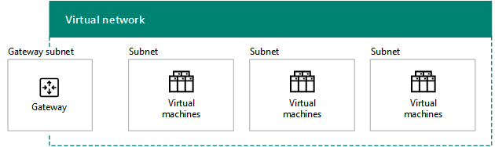
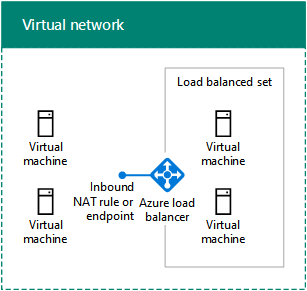
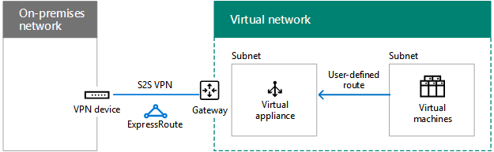
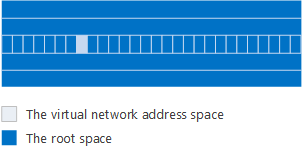

# Conception de réseaux pour Microsoft Azure IaaSDesigning networking for Microsoft Azure IaaS

 **Résumé:** Découvrez comment concevoir une mise en réseau optimisée pour les charges de travail dans Microsoft Azure IaaS.**Summary:** Understand how to design optimized networking for workloads in Microsoft Azure IaaS.
  
L’optimisation du réseau pour les charges de travail informatiques hébergées dans Azure IaaS demande une bonne compréhension des réseaux virtuels Azure (VNets), des espaces d’adressage, du routage, de DNS et de l’équilibrage de charge.Optimizing networking for IT workloads hosted in Azure IaaS requires an understanding of Azure virtual networks (VNets), address spaces, routing, DNS, and load balancing.
  
## Étapes de préparation pour un réseau virtuelPlanning steps for any VNet

Suivez la procédure ci-dessous pour tout type de réseau virtuel (VNet).Follow these steps for any type of VNet.
  
### Étape 1 : préparez votre intranet pour les services de cloud computing Microsoft.Step 1: Prepare your intranet for Microsoft cloud services.

Consultez les **étapes de préparation de votre réseau pour services de cloud Microsoft** fournies dans la section [Éléments communs de la connectivité au cloud Microsoft](common-elements-of-microsoft-cloud-connectivity.md).Go through the **Steps to prepare your network for Microsoft cloud services** section in [Common elements of Microsoft cloud connectivity](common-elements-of-microsoft-cloud-connectivity.md).
  
### Étape 2 : optimisez votre bande passante Internet.Step 2: Optimize your Internet bandwidth.

Optimisez votre bande passante Internet en suivant les étapes 2 à 4 de la **procédure de préparation de votre réseau pour les services Microsoft SaaS** fournie dans [Conception de réseaux pour Microsoft SaaS](designing-networking-for-microsoft-saas.md).Optimize your Internet bandwidth using steps 2 - 4 of the **Steps to prepare your network for Microsoft SaaS services** section in [Designing networking for Microsoft SaaS](designing-networking-for-microsoft-saas.md).
  
### Étape 3 : déterminez le type du réseau virtuel (cloud uniquement ou intersites).Step 3: Determine the type of VNet (cloud-only or cross-premises).

Un réseau virtuel de type « cloud uniquement » n’a aucune connexion avec un réseau local. Voici un exemple.A cloud-only VNet has no connection to an on-premises network. Here is an example.
  
**Figure 1 : Réseau virtuel de type « cloud uniquement »****Figure 1: A cloud-only VNet**

  
La figure 1 présente un ensemble de machines virtuelles placées dans un réseau virtuel de type « cloud uniquement ».Figure 1 shows a set of virtual machines in a cloud-only VNet.
  
Un réseau virtuel entre sites dispose d’une connexion VPN de site à site (S2S) ou ExpressRoute à un réseau local via une passerelle Azure. Voici un exemple.A cross-premises VNet has a site-to-site (S2S) VPN or ExpressRoute connection to an on-premises network through an Azure gateway. Here is an example.
  
**Figure 2 : Réseau virtuel entre différents locaux****Figure 2: A cross-premises VNet**

  
La figure 2 présente un ensemble de machines virtuelles placées dans un réseau virtuel intersites, lequel est connecté à un réseau local.Figure 2 shows a set of virtual machines in a cross-premises VNet, which is connected to an on-premises network.
  
Reportez-vous à la section [Étapes préparatoires pour un réseau virtuel intersites](designing-networking-for-microsoft-azure-iaas.md#cross_prem) de cet article.See the additional [Planning steps for a cross-premises VNet](designing-networking-for-microsoft-azure-iaas.md#cross_prem) section in this article.
  
### Étape 4 : déterminez l’espace d’adressage du réseau virtuel.Step 4: Determine the address space of the VNet.

Le tableau 1 présente les espaces d’adressage correspondant aux différents types de réseaux virtuels.Table 1 shows the address spaces for the different types of VNets.
  
|**Type de réseau virtuel****Type of VNet**|**Espace d’adressage du réseau virtuel****Virtual network address space**|
|:-----|:-----|
|Cloud uniquementCloud-only    |Espace d’adressage privé arbitraireArbitrary private address space    |
|Cloud uniquement interconnectéInterconnected cloud-only    |Privé arbitraire, mais sans chevauchement avec les autres réseaux virtuels connectésArbitrary private, but not overlapping with other connected VNets    |
|IntersitesCross-premises    |Privé, mais sans chevauchement avec les réseaux locauxPrivate, but not overlapping with on-premises    |
|Intersites interconnectéInterconnected cross-premises    |Privé, mais sans chevauchement avec les autres réseaux virtuels connectés et les réseaux locauxPrivate, but not overlapping with on-premises and other connected VNets    |
   
 **Tableau 1 : types de réseaux virtuels et espaces d’adressage correspondants****Table 1: Types of VNets and their corresponding address space**
  
Une configuration d’adresse issue de l’espace d’adressage du sous-réseau est attribuée aux machines virtuelles par DHCP :Virtual machines are assigned an address configuration from the address space of the subnet by DHCP:
  
- Adresse/masque de sous-réseauAddress/subnet mask
    
- Passerelle par défautDefault gateway
    
- Adresses IP du serveur DNSDNS server IP addresses
    
Vous pouvez également réserver une adresse IP statique.You can also reserve a static IP address.
  
Une adresse IP publique peut également être attribuée aux machines virtuelles, individuellement ou à partir du service de cloud qui les contient (pour les ordinateurs avec déploiement classique uniquement).Virtual machines can also be assigned a public IP address, either individually or from the containing cloud service (for classic deployment machines only).
  
### Étape 5 : déterminez les sous-réseaux au sein du réseau virtuel et les espaces d’adressage affectés à chacun.Step 5: Determine the subnets within the VNet and the address spaces assigned to each.

Il existe deux types de sous-réseaux dans un réseau virtuel : un sous-réseau de passerelle et un sous-réseau qui héberge les machines virtuelles.There are two types of subnets in a VNet, a gateway subnet and a virtual machine-hosting subnet.
  
**Figure 3 : les deux types de sous-réseaux dans Azure****Figure 3: The two types of subnets in Azure**

  
La figure 3 présente un réseau virtuel contenant un sous-réseau de passerelle doté d'une passerelle Azure et d'un ensemble de sous-réseaux hébergeant des machines virtuelles contenant des machines virtuelles.Figure 3 shows a VNet containing a gateway subnet that has an Azure gateway and a set of virtual machine-hosting subnets containing virtual machines.
  
Le sous-réseau de passerelle Azure est requis par Azure pour héberger les deux machines virtuelles de votre passerelle Azure.The Azure gateway subnet is needed by Azure to host the two virtual machines of your Azure gateway. Spécifiez un espace d’adressage avec une longueur de préfixe d’au moins 29 bits (exemple : 192.168.15.248/29).Specify an address space with at least a 29-bit prefix length (example: 192.168.15.248/29). Une longueur de préfixe de 27 bits ou plus petite est recommandée, en particulier si vous envisagez d'utiliser ExpressRoute.A 27-bit or smaller prefix length is recommended, especially if you are planning to use ExpressRoute.
  
Pour déterminer l'espace d'adressage du sous-réseau de la passerelle Azure, il est recommandé de procéder comme suit:A best practice for determining the address space of the Azure gateway subnet is:
  
1. Décidez de la taille du sous-réseau de passerelle.Decide on the size of the gateway subnet.
    
2. Dans la variable bits de l’espace d’adressage du réseau virtuel, définissez la valeur de bits utilisée pour le sous-réseau de passerelle sur 0 et définissez les autres sur 1.In the variable bits in the address space of the VNet, set the bits used for the gateway subnet to 0 and set the remaining bits to 1.
    
3. Convertissez les valeurs en nombres décimaux et exprimez-les sous forme d’espace d’adressage, en définissant la longueur du préfixe sur une valeur équivalente à la taille du sous-réseau de passerelle.Convert to decimal and express as an address space with the prefix length set to the size of the gateway subnet.
    
Avec cette méthode, l’espace d’adressage du sous-réseau de passerelle est toujours à l’extrémité de l’espace d’adressage du réseau virtuel.With this method, the address space for the gateway subnet is always at the farthest end of the VNet address space.
  
Vous avez ci-dessous un exemple de définition du préfixe d’adresse pour le sous-réseau de passerelle : l’espace d’adressage du réseau virtuel est 10.119.0.0/16. L’organisation utilisera initialement une connexion VPN de site à site, mais emploiera ensuite ExpressRoute. Le tableau 2 indique les étapes pour déterminer le préfixe d’adresse pour le sous-réseau de passerelle, ainsi que leur résultat, dans la notation de préfixe réseau (également connue sous le nom de CIDR).Here is an example of defining the address prefix for the gateway subnet: The address space of the VNet is 10.119.0.0/16. The organization will initially use a site-to-site VPN connection, but will eventually get ExpressRoute. Table 2 shows the steps and results of determining the gateway subnet address prefix in network prefix notation (also known as CIDR).

Voici les étapes et l'exemple de la détermination du préfixe d'adresse de sous-réseau de passerelle:Here are the steps and example of determining the gateway subnet address prefix:

1. Décidez de la taille du sous-réseau de passerelle.Decide on the size of the gateway subnet. Pour notre exemple, nous avons choisi/28.For our example, we chose /28.
2. Définissez les bits dans la partie variable de l'espace d'adressage de réseau virtuel (b) sur 0 pour les bits de sous-réseau de passerelle (G), sinon 1 (V).Set the bits in the variable portion of the VNet address space (b) to 0 for the gateway subnet bits (G), otherwise 1 (V). Pour notre exemple, nous utilisons l'espace d'adressage 10.119.0.0/16 pour le réseau virtuel.For our example, we are using the 10.119.0.0/16 address space for the VNet.
 
 10,119.10.119. bbbbbbbb.bbbbbbbb . bbbbbbbbbbbbbbbb
 10,119.10.119. VVVVVVVV.VVVVVVVV . VVVVGGGGVVVVGGGG
 10,119.10.119. 11111111.11111111 . 1111000011110000
  
3. Convertissez le résultat de l'étape 2 en Decimal et Express en tant qu'espace d'adressage.Convert the result from step 2 to decimal and express as an address space. Pour notre exemple, 10,119.For our example, 10.119. 11111111.11111111 . 11110000 est 10.119.255.240, et avec la longueur de préfixe de l'étape 1 (28 dans notre exemple), le préfixe d'adresse de sous-réseau de passerelle résultant est 10.119.255.240/28.11110000 is 10.119.255.240, and with the prefix length from step 1, (28 in our example), the resulting gateway subnet address prefix is 10.119.255.240/28.
  
Pour plus d'informations, voir [calculatrice d'espace d'adressage pour les sous-réseaux de la passerelle Azure](https://gallery.technet.microsoft.com/scriptcenter/Address-prefix-calculator-a94b6eed) .See [Address space calculator for Azure gateway subnets](https://gallery.technet.microsoft.com/scriptcenter/Address-prefix-calculator-a94b6eed) for more information.
  
Les machines virtuelles Azure doivent être placées dans des sous-réseaux dédiés à l’hébergement des machines virtuelles. Pour cela, vous pouvez suivre les consignes standard pour les configurations locales, par exemple, en fonction d’un rôle ou d’un niveau d’application commun ou de manière à isoler les sous-réseaux.Virtual machine-hosting subnets are where you place Azure virtual machines, which you can do according to typical on-premises guidelines, such as a common role or tier of an application or for subnet isolation.
  
Azure utilise les trois premières adresses sur chaque sous-réseau.Azure uses the first 3 addresses on each subnet. Par conséquent, le nombre d'adresses possibles sur un sous-réseau Azure est 2n -5, où n est le nombre de bits d'hôte.Therefore, the number of possible addresses on an Azure subnet is 2n - 5, where n is the number of host bits. Le tableau 3 indique la plage de machines virtuelles requises, le nombre de bits nécessaires pour l’hôte et la taille de sous-réseau correspondante.Table 3 shows the range of virtual machines required, the number of hosts bits needed, and the corresponding subnet size.
  
|**Machines virtuelles requises****Virtual machines required**|**Bits hôte****Host bits**|**Taille sous-réseau****Subnet size**|
|:-----|:-----|:-----|
|1-31-3    |33    |/29/29    |
|4-114-11    |44    |/28/28    |
|12-2712-27    |disque5    |/27/27    |
|28-5928-59    |6.x6    |/26/26    |
|60-12360-123    |7j/77    |/25/25    |
   
 **Tableau 3 : Configuration requise pour les machines virtuelles et tailles de sous-réseau correspondantes****Table 3: Virtual machine requirements and their subnet sizes**
  
Pour plus d'informations sur la quantité maximale de machines virtuelles sur un sous-réseau ou un réseau virtuel, voir [limites de mise en réseau](https://docs.microsoft.com/azure/azure-subscription-service-limits#networking-limits).For more information about the maximum amount of virtual machines on a subnet or VNet, see [Networking Limits](https://docs.microsoft.com/azure/azure-subscription-service-limits#networking-limits).
  
Pour plus d'informations, voir [planifier et concevoir des réseaux virtuels Azure](https://azure.microsoft.com/documentation/articles/virtual-network-vnet-plan-design-arm/).For more information, see [Plan and design Azure Virtual Networks](https://azure.microsoft.com/documentation/articles/virtual-network-vnet-plan-design-arm/).
  
### Étape 6 : déterminez la configuration du serveur DNS et les adresses des serveurs DNS à affecter aux machines virtuelles dans le réseau virtuel.Step 6: Determine the DNS server configuration and the addresses of the DNS servers to assign to VMs in the VNet.

Azure attribue aux machines virtuelles les adresses des serveurs DNS par DHCP. Les serveurs DNS peuvent être :Azure assigns virtual machines the addresses of DNS servers by DHCP. DNS servers can be:
  
- Fournis par Azure : fournit l’enregistrement du nom en local, ainsi que la résolution des noms sur Internet et en localSupplied by Azure: Provides local name registration and local and Internet name resolution
    
- Fournis par vous : fournit l’inscription des noms en local ou sur l’intranet, ainsi que la résolution des noms sur Internet ou l’intranetProvided by you: Provides local or intranet name registration and either intranet or Internet name resolution
    
Le tableau 4 présente les différentes configurations des serveurs DNS pour chaque type de réseau virtuel.Table 4 shows the different configurations of DNS servers for each type of VNet.
    
|**Type de réseau virtuel****Type of VNet**|**Serveur DNS****DNS server**|
|:-----|:-----|
|Cloud uniquementCloud-only    |Fourni par Azure pour la résolution des noms sur Internet et en localAzure-supplied for local and Internet name resolution    Machine virtuelle Azure pour la résolution des noms sur Internet et en local (transfert DNS)Azure virtual machine for local and Internet name resolution (DNS forwarding)    |
|IntersitesCross-premises    |En local pour la résolution des noms sur l’intranet et en localOn-premises for local and intranet name resolution    Machine virtuelle Azure pour la résolution des noms sur l’intranet et en local (réplication et transfert DNS)Azure virtual machine for local and intranet name resolution (DNS replication and forwarding)    |
   
 **Tableau 4 : Options de serveur DNS pour les deux types de réseaux virtuels****Table 4: DNS server options for the two different types of VNets**
  
Pour plus d'informations, consultez la rubrique [résolution de noms pour les machines virtuelles et les instances de rôles](https://docs.microsoft.com/azure/virtual-network/virtual-networks-name-resolution-for-vms-and-role-instances).For more information, see [Name Resolution for VMs and Role Instances](https://docs.microsoft.com/azure/virtual-network/virtual-networks-name-resolution-for-vms-and-role-instances).
  
### Étape 7 : déterminez la configuration d’équilibrage de charge (connectée à Internet ou interne).Step 7: Determine the load balancing configuration (Internet-facing or internal).

Dans certains cas, vous devez distribuer le trafic entrant vers un ensemble de serveurs qui ont le même rôle. Le service IaaS Azure dispose d’une fonction intégrée permettant d’effectuer cette action pour les charges de trafic Internet ou internes.In some cases, you want to distribute incoming traffic to a set of servers that have the same role. Azure IaaS has a built-in facility to do this for Internet-facing and internal traffic loads.
  
L’équilibrage de charge Azure pour Internet distribue le trafic entrant non sollicité de façon aléatoire d’Internet vers les membres d’un jeu d’équilibrage de charge. Azure Internet-facing load balancing randomly distributes unsolicited incoming traffic from the Internet to the members of a load-balanced set.
  
**Figure 4 : Équilibrage de charge externe dans Azure****Figure 4: An external load balancer in Azure**

  
La figure 4 illustre un programme d'équilibrage de la charge externe dans Azure qui distribue le trafic entrant sur une règle NAT entrante ou un point de terminaison à un ensemble de machines virtuelles dans un ensemble à charge équilibrée.Figure 4 shows an external load balancer in Azure that distributes incoming traffic on an inbound NAT rule or endpoint to a set of virtual machines in a load-balanced set.
  
L’équilibrage de charge interne d’Azure répartit le trafic entrant non sollicité de façon aléatoire des machines virtuelles Azure vers les membres d’un jeu d’équilibrage de charge. Azure internal load balancing randomly distributes unsolicited incoming traffic from other Azure VMs or from intranet computers to the members of a load-balanced set. 
  
**Figure 5 : Équilibrage de charge interne dans Azure****Figure 5: An internal load balancer in Azure**

  
La figure 5 illustre un programme d'équilibrage de charge interne dans Azure qui distribue le trafic entrant sur une règle NAT entrante ou un point de terminaison à un ensemble de machines virtuelles dans un ensemble à charge équilibrée.Figure 5 shows an internal load balancer in Azure that distributes incoming traffic on an inbound NAT rule or endpoint to a set of virtual machines in a load-balanced set.
  
Pour plus d'informations, consultez la rubrique relative à l'équilibreur de [charge Azure](https://docs.microsoft.com/azure/load-balancer/load-balancer-overview).For more information, see [Azure Load Balancer](https://docs.microsoft.com/azure/load-balancer/load-balancer-overview).
  
### Étape 8 : déterminez l’utilisation des appliances virtuelles et des itinéraires définis par l’utilisateur.Step 8: Determine the use of virtual appliances and user-defined routes.

Si vous devez transmettre du trafic vers des appliances virtuelles dans votre réseau virtuel, vous devrez peut-être ajouter un ou plusieurs itinéraires définis par l’utilisateur à un sous-réseau.If you need to forward traffic to virtual appliances in your VNet, you may need to add one or more user-defined routes to a subnet.
  
**Figure 6 : Appliances virtuelles et itinéraires définis par l’utilisateur dans Azure****Figure 6: Virtual appliances and user-defined routes in Azure**

  
La figure 6 présente un réseau virtuel intersites et un itinéraire définis par l’utilisateur affecté à un sous-réseau hébergeant des machines virtuelles qui pointe vers une appliance virtuelle.Figure 6 shows a cross-premises VNet and a user-defined route assigned to a virtual machine-hosting subnet that points to a virtual appliance.
  
Pour plus d'informations, consultez la rubrique [itinéraires définis par l'utilisateur et transfert IP](https://docs.microsoft.com/azure/virtual-network/virtual-networks-udr-overview).For more information, see [User Defined Routes and IP Forwarding](https://docs.microsoft.com/azure/virtual-network/virtual-networks-udr-overview).
  
### Étape 9 : déterminez le mode de connexion aux machines virtuelles des ordinateurs sur Internet.Step 9: Determine how computers from the Internet will connect to virtual machines.

Il existe plusieurs méthodes pour fournir un accès Internet aux machines virtuelles sur un réseau virtuel, qui inclut l’accès à partir du réseau de votre entreprise via votre serveur proxy ou un autre appareil Edge.There are multiple ways to provide Internet access to the virtual machines on a VNet, which includes access from your organization network through your proxy server or other edge device.
  
Le tableau 5 présente les méthodes de filtrage ou de contrôle du trafic entrant non sollicité.Table 5 lists the methods for filtering or inspecting unsolicited incoming traffic.
  
|**Méthode****Method**|**Modèle de déploiement****Deployment model**|
|:-----|:-----|
|1. Points de terminaison et listes de contrôle d’accès configurés sur les services de cloud1. Endpoints and ACLs configured on cloud services    |ClassiquesClassic    |
|2. Groupes de sécurité réseau2. Network security groups    |Resource Manager et classiqueResource Manager and classic    |
|3. Équilibrage de charge connecté à Internet avec règles NAT de trafic entrant3. Internet-facing load balancer with inbound NAT rules    |Responsable de ressourcesResource Manager    |
|4. appliances de sécurité réseau sur Azure Marketplace (non illustré)4. Network security appliances in the Azure Marketplace (not shown)    |Resource Manager et classiqueResource Manager and classic    |
   
 **Tableau 5 : Méthodes de connexion aux machines virtuelles et modèles de déploiement Azure correspondantes****Table 5: Methods of connecting to virtual machines and their corresponding Azure deployment models**
  
**Figure 7 : Connexion à des machines virtuelles Azure via Internet****Figure 7: Connecting to Azure virtual machines over the Internet**

  
La figure 7 présente un ordinateur connecté à Internet qui se connecte à une machine virtuelle dans un service cloud à l’aide d’un point de terminaison, à une machine virtuelle dans un sous-réseau à l’aide d’un groupe de sécurité réseau et à une machine virtuelle dans un sous-réseau en utilisant un programme d’équilibrage de charge externe et des règles NAT de trafic entrant.Figure 7 shows an Internet-connected computer connecting to a virtual machine in a cloud service using an endpoint, a virtual machine on a subnet using a network security group, and a virtual machine on a subnet using an external load balancer and inbound NAT rules.
  
Les éléments suivants offrent un degré de sécurité supplémentaire :Additional security is provided by:
  
- Connexions de bureau à distance et SSH, authentifiées et chiffrées.Remote Desktop and SSH connections, which are authenticated and encrypted.
    
- Sessions Remote PowerShell, authentifiées et chiffrées.Remote PowerShell sessions, which are authenticated and encrypted.
    
- Mode de transport IPsec, que vous pouvez utiliser pour le chiffrement de bout en bout.IPsec transport mode, which you can use for end-to-end encryption.
    
- Protection par déni de service distribué Azure, qui permet d’éviter les attaques internes et externesAzure DDOS protection, which helps prevent external and internal attacks
    
Pour plus d'informations, consultez la rubrique [sécurité Cloud Microsoft pour les architectes d'entreprise](https://aka.ms/cloudarchsecurity) et [Azure Network Security](https://azure.microsoft.com/blog/azure-network-security/).For more information, see [Microsoft Cloud Security for Enterprise Architects](https://aka.ms/cloudarchsecurity) and [Azure Network Security](https://azure.microsoft.com/blog/azure-network-security/).
  
### Étape 10 : pour plusieurs réseaux virtuels, déterminez la topologie de connexion de réseau virtuel à réseau virtuelStep 10: For multiple VNets, determine the VNet-to-VNet connection topology.

Les réseaux virtuels peuvent être connectés à l’aide de topologies semblables à celles utilisées pour connecter les sites d’une organisation.VNets can be connected to each other using topologies similar to those used for connecting the sites of an organization.
  
Une configuration en série connecte les réseaux virtuels les uns après les autres.A daisy chain configuration connects the VNets in a series.
  
**Figure 8 : Configuration en série pour des réseaux virtuels****Figure 8: A daisy-chained configuration for VNets**

  
La figure 8 illustre cinq réseaux virtuels connectés en série à l'aide d'une configuration en cascade.Figure 8 shows five VNets connected in series using a daisy-chained configuration.
  
Une configuration « Hub and Spoke » connecte plusieurs réseaux virtuels à un ensemble de réseaux virtuels centraux, qui sont eux-mêmes connectés entre eux.A spoke and hub configuration connects multiple VNets to a set of central VNets, which are themselves connected to each other.
  
**Figure 9 : Configuration Hub and Spoke pour réseaux virtuels****Figure 9: A spoke and hub configuration for VNets**

  
La figure 9 présente six réseaux virtuels, dont deux sont des hubs centraux connectés l’un à l’autre, chacun étant également connecté à deux autres réseaux virtuels périphériques.Figure 9 shows six VNets, two VNets are hubs that are connected to each other and also two other spoke VNets.
  
Une configuration en maille complète connecte chaque réseau virtuel entre eux.A full mesh configuration connects every VNet to each other.
  
**Figure 10 : Configuration en maille complète pour réseaux virtuels****Figure 10: A full mesh configuration for VNets**

  
La figure 10 présente quatre réseaux virtuels connectés les uns aux autres, pour un total de six connexions de réseau virtuel à réseau virtuel.Figure 10 shows four VNets that are all connected to each other, using a total of six VNet-to-VNet connections.
  
## Étapes préparatoires pour un réseau virtuel intersitesPlanning steps for a cross-premises VNet

Suivez la procédure ci-dessous pour un réseau virtuel intersites.Follow these steps for a cross-premises VNet.
  
> [!TIP]
> Pour créer un environnement de développement/test intersites, voir [Simulated cross-premises virtual network in Azure](simulated-cross-premises-virtual-network-in-azure.md).To create a simulated cross-premises dev/test environment, see [Simulated cross-premises virtual network in Azure](simulated-cross-premises-virtual-network-in-azure.md). 
  
### Étape 1 : déterminez la connexion intersites au réseau virtuel (VPN S2S ou ExpressRoute).Step 1: Determine the cross-premises connection to the VNet (S2S VPN or ExpressRoute).

Le tableau 6 présente les différents types de connexions.Table 6 lists the different types of connections.
  
|**Type de connexion****Type of connection**|**Objectif****Purpose**|
|:-----|:-----|
|VPN de site à site (S2S)Site-to-Site (S2S) VPN    |Connectez les sites 1-10 (y compris les autres réseaux virtuels) à un seul réseau virtuel.Connect 1-10 sites (including other VNets) to a single VNet.    |
|ExpressRouteExpressRoute    |Lien privé sécurisé à Azure via un fournisseur d’échange Internet (IXP) ou un fournisseur de service réseau (NSP).A private, secure link to Azure via an Internet Exchange Provider (IXP) or a Network Service Provider (NSP).    |
|VPN de point à site (P2S)Point-to-Site (P2S) VPN    |Connecte un seul ordinateur à un réseau virtuel.Connects a single computer to a VNet.    |
|VPN de réseau virtuel à réseau virtuel (V2V) ou homologation de réseau virtuel VNet peering or VNet-to-VNet (V2V) VPN    |Connecte un réseau virtuel à un autre réseau virtuel.Connects a VNet to another VNet.    |
   
 **Tableau 6 : Types de connexions pour les réseaux virtuels intersites****Table 6: The types of connections for cross-premises VNets**
  
Pour plus d'informations sur le nombre maximal de connexions, voir [limites de mise en réseau](https://docs.microsoft.com/azure/azure-subscription-service-limits#networking-limits).For more information on the maximum number of connections, see [Networking Limits](https://docs.microsoft.com/azure/azure-subscription-service-limits#networking-limits).
  
Pour plus d'informations sur les périphériques VPN, consultez [la rubrique périphériques VPN pour les connexions de réseau virtuel de site à site](https://docs.microsoft.com/azure/vpn-gateway/vpn-gateway-about-vpn-devices).For more information about VPN devices, see [VPN devices for site-to-site virtual network connections](https://docs.microsoft.com/azure/vpn-gateway/vpn-gateway-about-vpn-devices).
  
Pour plus d'informations sur l'homologation VNet, voir [vnet peering](https://docs.microsoft.com/azure/virtual-network/virtual-network-peering-overview).For more information about VNet peering, see [VNet peering](https://docs.microsoft.com/azure/virtual-network/virtual-network-peering-overview).
  
**Figure 11 : Les quatre méthodes de connexion à un réseau virtuel entre différents locaux****Figure 11: The four ways to connect to a cross-premises VNet**

  
La figure 11 illustre un réseau virtuel avec quatre types de connexions: une connexion P2S à partir d'un ordinateur, une connexion VPN S2S à partir d'un réseau local, une connexion ExpressRoute à partir d'un réseau local et une connexion de réseau virtuel à réseau virtuel à partir d'un autre réseau virtuel.Figure 11 shows a VNet with the four types of connections: a P2S connection from a computer, an S2S VPN connection from an on-premises network, an ExpressRoute connection from an on-premises network, and a VNet-to-VNet connection from another VNet. 
  
Vous pouvez vous connecter aux machines virtuelles dans un réseau virtuel des façons suivantes :You can connect to VMs in a VNet in the following ways:
  
- Administration des machines virtuelles de réseau virtuel à partir de votre réseau local ou d’InternetAdministration of VNet VMs from your on-premises network or the Internet
    
- Accès aux charges de travail informatique à partir de votre réseau localIT workload access from your on-premises network
    
- Extension de votre réseau via des réseaux virtuels supplémentairesExtension of your network through additional VNets
    
La sécurité des connexions est assurée des façons suivantes :Security for connections is provided by the following:
  
- Les connexions P2S utilisent le protocole SSTP (Secure Socket Tunneling Protocol) P2S uses the Secure Socket Tunneling Protocol (SSTP) 
    
- Les connexions VPN de réseau virtuel à réseau virtuel et S2S utilisent le mode de tunnel IPsec avec AES256.S2S and VNet-to-VNet VPN connections use IPsec tunnel mode with AES256
    
- ExpressRoute est une connexion WAN privéeExpressRoute is a private WAN connection
    
Pour plus d'informations, consultez la rubrique [sécurité Cloud Microsoft pour les architectes d'entreprise](https://aka.ms/cloudarchsecurity) et [Azure Network Security](https://azure.microsoft.com/blog/azure-network-security/).For more information, see [Microsoft Cloud Security for Enterprise Architects](https://aka.ms/cloudarchsecurity) and [Azure Network Security](https://azure.microsoft.com/blog/azure-network-security/).
  
### Étape 2 : déterminez le routeur ou le périphérique VPN local.Step 2: Determine the on-premises VPN device or router.

Votre routeur ou votre périphérique VPN local fait office :Your on-premises VPN device or router acts as:
  
- D’homologue IPsec, qui termine la connexion VPN S2S à partir de la passerelle Azure.An IPsec peer, terminating the S2S VPN connection from the Azure gateway.
    
- D’homologue BPG et de point de terminaison pour la connexion ExpressRoute à homologation privée.The BPG peer and termination point for the private peering ExpressRoute connection.
    
**Figure 12 : Routeur ou appareil VPN****Figure 12: The on-premises VPN router or device**

  
La figure 12 présente un réseau virtuel intersites connecté à un routeur ou périphérique VPN local.Figure 12 shows a cross-premises VNet connected to an on-premises VPN router or device.
  
Pour plus d'informations, consultez la rubrique [à propos de la passerelle VPN](https://docs.microsoft.com/azure/vpn-gateway/vpn-gateway-about-vpngateways).For more information, see [About VPN gateway](https://docs.microsoft.com/azure/vpn-gateway/vpn-gateway-about-vpngateways).
  
### Étape 3: ajouter des itinéraires à votre intranet pour que l'espace d'adressage du réseau virtuel soit accessible.Step 3: Add routes to your intranet to make the address space of the VNet reachable.

La configuration de routage vers des réseaux virtuels à partir de l’environnement local comprend les éléments suivants :Routing to VNets from on-premises consists of the following:
  
1. Un itinéraire pour l’espace d’adressage de réseau virtuel qui pointe vers votre périphérique VPN.A route for the VNet address space that points toward your VPN device.
    
2. Un itinéraire pour l’espace d’adressage de réseau virtuel sur votre périphérique VPN qui pointe vers la connexion VPN S2S ou ExpressRoute.A route for the VNet address space on your VPN device that points across the S2S VPN or ExpressRoute connection
    
**Figure 13 : Itinéraires locaux nécessaires pour rendre un réseau virtuel accessible****Figure 13: The on-premises routes needed to make a VNet reachable**

  
La figure 13 présente les informations de routage requises par les routeurs locaux et le routeur ou le périphérique VPN qui représente l’espace d’adressage du réseau virtuel.Figure 13 shows the routing information needed by the on-premises routers and the VPN router or device that represents the address space of the VNet.
  
### Étape 4 : pour ExpressRoute, préparez la nouvelle connexion avec l’aide de votre fournisseur.Step 4: For ExpressRoute, plan for the new connection with your provider.

Il existe trois méthodes pour créer une connexion ExpressRoute avec homologation privée entre votre réseau local et le cloud Microsoft :You can create an ExpressRoute connection with private peering between your on-premises network and the Microsoft cloud in three different ways:
  
- Colocation sur un échange cloudCo-located at a cloud exchange
    
- Connexions Ethernet de point à pointPoint-to-point Ethernet connections
    
- Réseaux à connectivité complète (IP VPN)Any-to-any (IP VPN) networks
    
**Figure 14 : Utilisation d’ExpressRoute pour établir une connexion vers un réseau virtuel entre différents locaux****Figure 14: Using ExpressRoute to connect to a cross-premises VNet**

  
La figure 14 présente un réseau virtuel intersites et une connexion ExpressRoute d’un routeur local vers Microsoft Azure.Figure 14 shows a cross-premises VNet and an ExpressRoute connection from an on-premises router to Microsoft Azure.
  
Pour plus d'informations, voir [ExpressRoute pour la connectivité au cloud de Microsoft](expressroute-for-microsoft-cloud-connectivity.md).For more information, see [ExpressRoute for Microsoft cloud connectivity](expressroute-for-microsoft-cloud-connectivity.md).
  
### Étape 5 : déterminez l’espace d’adressage du réseau Local pour la passerelle Azure.Step 5: Determine the Local Network address space for the Azure gateway.

Pour le routage vers des réseaux locaux ou d’autres réseaux virtuels à partir d’un réseau virtuel, Azure transfère le trafic via une passerelle Azure qui utilise l’espace d’adressage de réseau local affecté à la passerelle.For the routing to on-premises or other VNets from a VNet, Azure forwards traffic across an Azure gateway that matches the Local Network address space assigned to the gateway.
  
**Figure 15 : Espace d’adressage de réseau local pour un réseau virtuel entre différents locaux****Figure 15: The Local Network address space for a cross-premises VNet**

  
La figure 15 présente un réseau virtuel intersites et l’espace d’adressage du réseau local sur la passerelle Azure, qui représente l’espace d’adressage accessible sur le réseau local. Figure 15 shows a cross-premises VNet and the Local Network address space on the Azure gateway, which represents the reachable address space on the on-premises network. 
  
Vous pouvez définir l'espace d'adressage du réseau local de l'une des manières suivantes:You can define the Local Network address space in these ways:
  
- Option 1 : liste des préfixes pour l’espace d’adressage actuellement nécessaire ou utilisé (des mises à jour peuvent être nécessaire lorsque vous ajoutez de nouveaux sous-réseaux).Option 1: The list of prefixes for the address space currently needed or in use (updates might be needed when you add new subnets).
    
- Option 2 : intégralité de votre espace d’adressage local (des mises à jour sont uniquement nécessaires lorsque vous ajoutez le nouvel espace d’adressage).Option 2: Your entire on-premises address space (updates only needed when you add new address space).
    
Étant donné que la passerelle Azure n’autorise pas les itinéraires résumés, vous devez définir l’espace d’adressage du réseau local pour l’option 2 afin qu’il n’inclue pas l’espace d’adressage de réseau virtuel.Because the Azure gateway does not allow summarized routes, you must define the Local Network address space for option 2 so that it does not include the VNet address space.
  
**Figure 16 : Trou dans l’espace d’adressage, créé par l’espace d’adressage réseau virtuel****Figure 16: The address space hole created by the VNet address space**

  
La figure 16 est une représentation d’un espace d’adressage, avec l’espace racine et l’espace d’adressage du réseau virtuel.Figure 16 shows a representation of an address space, with the root space and the VNet address space.
  
Voici un exemple de définition des préfixes pour l'espace d'adressage du réseau local entourant l'espace d'adressage «Hole» créé par le réseau virtuel:Here is an example of defining the prefixes for the Local Network address space around the address space "hole" created by the VNet:
  
- Une organisation utilise des parties de l’espace d’adressage privé (10.0.0.0/8, 172.16.0.0/12 et 192.168.0.0/16) sur son réseau local. Elle choisit l’option 2 et utilise 10.100.100.0/24 comme espace d’adressage de réseau virtuel.An organization uses portions of the private address space (10.0.0.0/8, 172.16.0.0/12, and 192.168.0.0/16) across their on-premises network. They chose option 2 and 10.100.100.0/24 as their VNet address space.
    
Le tableau 7 présente les étapes de définition de l’espace d’adressage du réseau local pour cet exemple, avec les préfixes obtenus.Table 7 shows the steps and resulting prefixes that define the Local Network address space for this example.
  
|**Étape****Step**|**Results****Results**|
|:-----|:-----|
|1. Répertorier les préfixes qui ne correspondent pas à l’espace racine pour l’espace d’adressage du réseau virtuel.1. List the prefixes that are not the root space for the VNet address space.    |172.16.0.0/12 et 192.168.0.0/16172.16.0.0/12 and 192.168.0.0/16    |
|2. répertoriez les préfixes qui ne se chevauchent pas pour des octets variables jusqu'au dernier octet utilisé (non compris) dans l'espace d'adressage de réseau virtuel.2. List the non-overlapping prefixes for variable octets up to but not including the last used octet in the VNet address space.    |10.0.0.0/16, 10.1.0.0/16... 10.99.0.0/16, 10.101.0.0/16... 10.254.0.0/16, 10.255.0.0/16 (préfixes 255, ignorer 10.100.0.0/16)10.0.0.0/16, 10.1.0.0/16…10.99.0.0/16, 10.101.0.0/16…10.254.0.0/16, 10.255.0.0/16 (255 prefixes, skipping 10.100.0.0/16)    |
|3. répertoriez les préfixes qui ne se chevauchent pas dans le dernier octet utilisé de l'espace d'adressage de réseau virtuel.3. List the non-overlapping prefixes within the last used octet of the VNet address space.    |10.100.0.0/24, 10.100.1.0/24... 10.100.99.0/24, 10.100.101.0/24... 10.100.254.0/24, 10.100.0.255.0/24 (préfixes 255, ignorer 10.100.100.0/24)10.100.0.0/24, 10.100.1.0/24…10.100.99.0/24, 10.100.101.0/24…10.100.254.0/24, 10.100.0.255.0/24 (255 prefixes, skipping 10.100.100.0/24)    |
   
 **Tableau 7 : Exemple d’espace d’adressage du réseau local****Table 7: Example Local Address network space**
  
### Étape 6 : configurez les serveurs DNS locaux pour la réplication DNS avec des serveurs DNS hébergés dans Azure.Step 6: Configure on-premises DNS servers for DNS replication with DNS servers hosted in Azure.

Pour vous assurer que les ordinateurs locaux peuvent résoudre les noms des serveurs Azure et que ces derniers peuvent résoudre les noms des ordinateurs locaux, procédez comme suit :To ensure that on-premises computers can resolve the names of Azure-based servers and Azure-based servers can resolve the names of on-premises computers, configure:
  
- Configurez les serveurs DNS de votre réseau virtuel pour le transfert vers des serveurs DNS locauxThe DNS servers in your VNet to forward to on-premises DNS servers
    
- Configurez la réplication DNS des zones appropriées entre les serveurs DNS locaux et ceux du réseau virtuelDNS replication of the appropriate zones between DNS servers on-premises and in the VNet
    
**Figure 17 : Réplication et transfert DNS pour un serveur DNS d’un réseau virtuel entre différents locaux****Figure 17: DNS replication and forwarding for a DNS server in a cross-premises VNet**

  
La figure 17 présente un réseau virtuel intersites avec des serveurs DNS sur le réseau local et sur un sous-réseau du réseau virtuel. Le transfert et la réplication DNS ont été configurés entre les deux serveurs DNS.Figure 17 shows a cross-premises VNet with DNS servers in the on-premises network and on a subnet in the VNet. DNS replication and forwarding has been configured between the two DNS servers.
  
### Étape 7 : déterminez l’utilisation du tunneling forcé.Step 7: Determine the use of forced tunneling.

L'itinéraire système par défaut pour les sous-réseaux Azure pointe vers Internet.The default system route for Azure subnets points to the Internet. Pour vous assurer que tout le trafic provenant des machines virtuelles circule sur la connexion intersite, créez une table de routage avec l'itinéraire par défaut qui utilise la passerelle Azure comme adresse de tronçon suivant.To ensure that all traffic from virtual machines travels across the cross-premises connection, create a routing table with the default route that uses the Azure gateway as its next-hop address. Vous associez ensuite la table d'itinéraires au sous-réseau.You then associate the route table with the subnet. C’est ce qu’on appelle le tunneling forcé.This is known as forced tunneling. Pour plus d'informations, consultez la rubrique Configure Forced tunneling.For more information, see [Configure forced tunneling](https://docs.microsoft.com/azure/vpn-gateway/vpn-gateway-forced-tunneling-rm).
  
**Figure 18 : Itinéraires définis par l’utilisateur et tunneling forcé pour un réseau virtuel entre différents locaux****Figure 18: User-defined routes and forced tunneling for a cross-premises VNet**

  
La figure 18 illustre un réseau virtuel intersites avec un itinéraire défini par l'utilisateur pour un sous-réseau pointant vers la passerelle Azure.Figure 18 shows a cross-premises VNet with a user-defined route for a subnet pointing to the Azure gateway.
  
## Batterie SharePoint Server 2016 dans AzureSharePoint Server 2016 farm in Azure

Un exemple de charge de travail informatique intranet hébergée dans Azure IaaS est une batterie de serveurs SharePoint Server 2016 à plusieurs niveaux hautement disponible.An example of an intranet IT workload hosted in Azure IaaS is a highly-available, multi-tier SharePoint Server 2016 farm.
  
**Figure 19 : Batterie de serveurs SharePoint Server 2016 intranet hautement disponible dans Azure IaaS****Figure 19: A highly-available intranet SharePoint Server 2016 farm in Azure IaaS**

  
La figure 19 illustre les neuf serveurs d'une batterie de serveurs SharePoint Server 2016 déployée dans un réseau virtuel intersites qui utilise des programmes d'équilibrage de charge interne pour les niveaux de données frontaux et de données.Figure 19 shows the nine servers of a SharePoint Server 2016 farm deployed in a cross-premises VNet that uses internal load balancers for the front-end and data tiers. Pour plus d'informations, y compris des instructions étape par étape de conception et de déploiement, voir [SharePoint Server 2016 dans Microsoft Azure](https://docs.microsoft.com/SharePoint/administration/sharepoint-server-2016-in-microsoft-azure).For more information, including step-by-step design and deployment instructions, see [SharePoint Server 2016 in Microsoft Azure](https://docs.microsoft.com/SharePoint/administration/sharepoint-server-2016-in-microsoft-azure).
  
> [!TIP]
> Pour créer une batterie de serveurs SharePoint Server 2016 à un seul serveur dans un réseau virtuel intersites simulé, voir [Intranet SharePoint server 2016 dans un environnement de développement/test Azure](https://docs.microsoft.com/SharePoint/administration/intranet-sharepoint-server-2016-in-azure-dev-test-environment).To create a single-server SharePoint Server 2016 farm in a simulated cross-premises VNet, see [Intranet SharePoint Server 2016 in Azure dev/test environment](https://docs.microsoft.com/SharePoint/administration/intranet-sharepoint-server-2016-in-azure-dev-test-environment). 
  
Pour obtenir des exemples supplémentaires de charges de travail informatiques déployées sur des machines virtuelles dans un réseau virtuel Azure entre différents locaux, consultez la rubrique [scénarios de Cloud hybride pour Azure IaaS](https://docs.microsoft.com/office365/enterprise/hybrid-cloud-scenarios-for-azure-iaas).For additional examples of IT workloads deployed on virtual machines in a cross-premises Azure virtual network, see [Hybrid cloud scenarios for Azure IaaS](https://docs.microsoft.com/office365/enterprise/hybrid-cloud-scenarios-for-azure-iaas).
  
## Voir aussiSee also

[Mise en réseau cloud Microsoft pour les architectes d’entrepriseMicrosoft Cloud Networking for Enterprise Architects](microsoft-cloud-networking-for-enterprise-architects.md)
  
[Ressources relatives à l’architecture informatique du cloud MicrosoftMicrosoft Cloud IT architecture resources](microsoft-cloud-it-architecture-resources.md)

