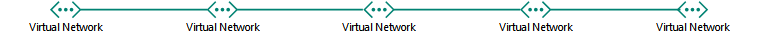

# Conception de réseaux pour Microsoft Azure IaaS

 **Résumé :** Comprendre comment concevoir réseau optimisé pour les charges de travail dans Microsoft Azure IaaS.
  
L’optimisation du réseau pour les charges de travail informatiques hébergées dans Azure IaaS demande une bonne compréhension des réseaux virtuels Azure (VNets), des espaces d’adressage, du routage, de DNS et de l’équilibrage de charge.
  
## Étapes de préparation pour un réseau virtuel

Suivez la procédure ci-dessous pour tout type de réseau virtuel (VNet).
  
### Étape 1 : préparez votre intranet pour les services de cloud computing Microsoft.

Consultez les **étapes de préparation de votre réseau pour services de cloud Microsoft** fournies dans la section [Éléments communs de la connectivité au cloud Microsoft](common-elements-of-microsoft-cloud-connectivity.md).
  
### Étape 2 : optimisez votre bande passante Internet.

Optimisez votre bande passante Internet en suivant les étapes 2 à 4 de la **procédure de préparation de votre réseau pour les services Microsoft SaaS** fournie dans [Conception de réseaux pour Microsoft SaaS](designing-networking-for-microsoft-saas.md).
  
### Étape 3 : déterminez le type du réseau virtuel (cloud uniquement ou intersites).

Un réseau virtuel de type « cloud uniquement » n’a aucune connexion avec un réseau local. Voici un exemple.
  
**Figure 1 : Réseau virtuel de type « cloud uniquement »**

  
La figure 1 présente un ensemble de machines virtuelles placées dans un réseau virtuel de type « cloud uniquement ».
  
Un réseau virtuel entre sites dispose d’une connexion VPN de site à site (S2S) ou ExpressRoute à un réseau local via une passerelle Azure. Voici un exemple.
  
**Figure 2 : Réseau virtuel entre différents locaux**

  
La figure 2 présente un ensemble de machines virtuelles placées dans un réseau virtuel intersites, lequel est connecté à un réseau local.
  
Reportez-vous à la section [Étapes préparatoires pour un réseau virtuel intersites](designing-networking-for-microsoft-azure-iaas.md#cross_prem) de cet article.
  
### Étape 4 : déterminez l’espace d’adressage du réseau virtuel.

Le tableau 1 présente les espaces d’adressage correspondant aux différents types de réseaux virtuels.
  
|**Type de réseau virtuel**|**Espace d’adressage du réseau virtuel**|
|:-----|:-----|
|Cloud uniquement    |Espace d’adressage privé arbitraire    |
|Cloud uniquement interconnecté    |Private arbitraire, mais ne se chevauchent ne pas avec les autres connecté VNets    |
|Intersites    |Privé, mais sans chevauchement avec les réseaux locaux    |
|Intersites interconnecté    |Privé, mais sans chevauchement avec les autres réseaux virtuels connectés et les réseaux locaux    |
   
 **Tableau 1 : types de réseaux virtuels et espaces d’adressage correspondants**
  
Une configuration d’adresse issue de l’espace d’adressage du sous-réseau est attribuée aux machines virtuelles par DHCP :
  
- Adresse/masque de sous-réseau
    
- Passerelle par défaut
    
- Adresses IP du serveur DNS
    
Vous pouvez également réserver une adresse IP statique.
  
Une adresse IP publique peut également être attribuée aux machines virtuelles, individuellement ou à partir du service de cloud qui les contient (pour les ordinateurs avec déploiement classique uniquement).
  
### Étape 5 : déterminez les sous-réseaux au sein du réseau virtuel et les espaces d’adressage affectés à chacun.

Il existe deux types de sous-réseaux dans un réseau virtuel : un sous-réseau de passerelle et un sous-réseau qui héberge les machines virtuelles.
  
**Figure 3 : les deux types de sous-réseaux dans Azure**

  
La figure 3 présente un réseau virtuel contenant un sous-réseau de passerelle qui contient lui-même une passerelle Azure et un ensemble de sous-réseaux hébergeant des machines virtuelles.
  
Le sous-réseau de passerelle Azure est requis par Azure pour héberger les deux machines virtuelles de votre passerelle Azure. Spécifiez un espace d’adressage avec une longueur de préfixe d’au moins 29 bits (exemple : 192.168.15.248/29). Une longueur de préfixe de 28 bits ou moins est recommandée, en particulier si vous envisagez d’utiliser ExpressRoute.
  
Pour déterminer l’espace d’adressage du sous-réseau Azure de passerelle, il est recommandé de procéder comme suit :
  
1. Décidez de la taille du sous-réseau de passerelle.
    
2. Dans la variable bits de l’espace d’adressage du réseau virtuel, définissez la valeur de bits utilisée pour le sous-réseau de passerelle sur 0 et définissez les autres sur 1.
    
3. Convertissez les valeurs en nombres décimaux et exprimez-les sous forme d’espace d’adressage, en définissant la longueur du préfixe sur une valeur équivalente à la taille du sous-réseau de passerelle.
    
Avec cette méthode, l’espace d’adressage du sous-réseau de passerelle est toujours à l’extrémité de l’espace d’adressage du réseau virtuel.
  
Vous avez ci-dessous un exemple de définition du préfixe d’adresse pour le sous-réseau de passerelle : l’espace d’adressage du réseau virtuel est 10.119.0.0/16. L’organisation utilisera initialement une connexion VPN de site à site, mais emploiera ensuite ExpressRoute. Le tableau 2 indique les étapes pour déterminer le préfixe d’adresse pour le sous-réseau de passerelle, ainsi que leur résultat, dans la notation de préfixe réseau (également connue sous le nom de CIDR).

Voici les étapes et un exemple pour déterminer le préfixe d’adresse de passerelle sous-réseau :

1. Déterminez la taille du sous-réseau passerelle. Pour notre exemple, nous avons choisi /28.
2. Définir les fichiers binaires dans la partie variable de l’espace d’adressage VNet (b) 0 pour la passerelle sous-réseau bits (G), 1 dans le cas contraire (V). Pour notre exemple, nous utilisons l’espace d’adressage 10.119.0.0/16 pour la VNet. 
 10.119. bbbbbbbb. bbbbbbbb 10.119. VVVVVVVV. VVVVGGGG 10.119. 11111111. 11110000  
3. Convertir le résultat de l’étape 2 décimal et express en tant qu’un espace d’adressage. Pour notre exemple, 10.119. 11111111. 11110000 est 10.119.255.240 et la longueur du préfixe de l’étape 1, (28 dans notre exemple), le préfixe d’adresse de sous-réseau passerelle qui en résulte est 10.119.255.240/28.
  
Pour plus d’informations, voir [calculateur d’espace d’adresse pour les sous-réseaux passerelle Azure](https://gallery.technet.microsoft.com/scriptcenter/Address-prefix-calculator-a94b6eed) .
  
Les machines virtuelles Azure doivent être placées dans des sous-réseaux dédiés à l’hébergement des machines virtuelles. Pour cela, vous pouvez suivre les consignes standard pour les configurations locales, par exemple, en fonction d’un rôle ou d’un niveau d’application commun ou de manière à isoler les sous-réseaux.
  
Azure utilise les 3 adresses sur chaque sous-réseau. Par conséquent, le nombre d’adresses possibles sur un sous-réseau Azure est 2n - 5, où n est le nombre de bits de l’hôte. Tableau 3 affiche la plage des ordinateurs virtuels requis, le nombre de héberge bits nécessaires et la taille de sous-réseau correspondant.
  
|**Machines virtuelles requises**|**Bits hôte**|**Taille sous-réseau**|
|:-----|:-----|:-----|
|1-3    |3    |/29    |
|4-11    |4    |/28    |
|12-27    |5    |/27    |
|28-59    |6    |/26    |
|60-123    |7    |/25    |
   
 **Tableau 3 : Configuration requise pour les machines virtuelles et tailles de sous-réseau correspondantes**
  
Pour plus d’informations sur la quantité maximale de machines virtuelles sur un sous-réseau ou de VNet, voir [Limites du réseau](https://docs.microsoft.com/azure/azure-subscription-service-limits#networking-limits).
  
Pour plus d’informations, voir [planifier et concevoir des réseaux virtuels Azure](https://azure.microsoft.com/documentation/articles/virtual-network-vnet-plan-design-arm/).
  
### Étape 6 : déterminez la configuration du serveur DNS et les adresses des serveurs DNS à affecter aux machines virtuelles dans le réseau virtuel.

Azure attribue aux machines virtuelles les adresses des serveurs DNS par DHCP. Les serveurs DNS peuvent être :
  
- Fournis par Azure : fournit l’enregistrement du nom en local, ainsi que la résolution des noms sur Internet et en local
    
- Fournis par vous : fournit l’inscription des noms en local ou sur l’intranet, ainsi que la résolution des noms sur Internet ou l’intranet
    
Le tableau 4 présente les différentes configurations des serveurs DNS pour chaque type de réseau virtuel.
    
|**Type de réseau virtuel**|**Serveur DNS**|
|:-----|:-----|
|Cloud uniquement    |Fourni par Azure pour la résolution des noms sur Internet et en local    Machine virtuelle Azure pour la résolution des noms sur Internet et en local (transfert DNS)    |
|Intersites    |En local pour la résolution des noms sur l’intranet et en local    Machine virtuelle Azure pour la résolution des noms sur l’intranet et en local (réplication et transfert DNS)    |
   
 **Tableau 4 : Options de serveur DNS pour les deux types de réseaux virtuels**
  
Pour plus d’informations, voir [Résolution de noms pour les ordinateurs virtuels et des Instances de rôle](https://docs.microsoft.com/azure/virtual-network/virtual-networks-name-resolution-for-vms-and-role-instances).
  
### Étape 7 : déterminez la configuration d’équilibrage de charge (connectée à Internet ou interne).

Dans certains cas, vous devez distribuer le trafic entrant vers un ensemble de serveurs qui ont le même rôle. Le service IaaS Azure dispose d’une fonction intégrée permettant d’effectuer cette action pour les charges de trafic Internet ou internes.
  
L’équilibrage de charge Azure pour Internet distribue le trafic entrant non sollicité de façon aléatoire d’Internet vers les membres d’un jeu d’équilibrage de charge. 
  
**Figure 4 : Équilibrage de charge externe dans Azure**

  
La figure 4 illustre un équilibreur de charge externe dans Azure qui répartit le trafic entrant sur une règle de trafic entrant NAT ou un point de terminaison à un ensemble d’ordinateurs virtuels dans un jeu à charge équilibrée.
  
L’équilibrage de charge interne d’Azure répartit le trafic entrant non sollicité de façon aléatoire des machines virtuelles Azure vers les membres d’un jeu d’équilibrage de charge.  
  
**Figure 5 : Équilibrage de charge interne dans Azure**

  
La figure 5 illustre un équilibreur de charge interne dans Azure qui répartit le trafic entrant sur une règle de trafic entrant NAT ou un point de terminaison à un ensemble d’ordinateurs virtuels dans un jeu à charge équilibrée.
  
Pour plus d’informations, voir [Équilibrage de charge Azure](https://docs.microsoft.com/azure/load-balancer/load-balancer-overview).
  
### Étape 8 : déterminez l’utilisation des appliances virtuelles et des itinéraires définis par l’utilisateur.

Si vous devez transmettre du trafic vers des appliances virtuelles dans votre réseau virtuel, vous devrez peut-être ajouter un ou plusieurs itinéraires définis par l’utilisateur à un sous-réseau.
  
**Figure 6 : Appliances virtuelles et itinéraires définis par l’utilisateur dans Azure**

  
La figure 6 présente un réseau virtuel intersites et un itinéraire définis par l’utilisateur affecté à un sous-réseau hébergeant des machines virtuelles qui pointe vers une appliance virtuelle.
  
Pour plus d’informations, voir [itinéraires de définies par l’utilisateur et le routage IP](https://docs.microsoft.com/azure/virtual-network/virtual-networks-udr-overview).
  
### Étape 9 : déterminez le mode de connexion aux machines virtuelles des ordinateurs sur Internet.

Il existe plusieurs méthodes pour fournir un accès Internet aux machines virtuelles sur un réseau virtuel, qui inclut l’accès à partir du réseau de votre entreprise via votre serveur proxy ou un autre appareil Edge.
  
Le tableau 5 présente les méthodes de filtrage ou de contrôle du trafic entrant non sollicité.
  
|**Méthode**|**Modèle de déploiement**|
|:-----|:-----|
|1. Points de terminaison et listes de contrôle d’accès configurés sur les services de cloud    |Classique    |
|2. Groupes de sécurité réseau    |Resource Manager et classique    |
|3. Équilibrage de charge connecté à Internet avec règles NAT de trafic entrant    |Responsable de ressources    |
|4. appareils de sécurité réseau dans Azure Marketplace (non illustré)    |Resource Manager et classique    |
   
 **Tableau 5 : Méthodes de connexion aux machines virtuelles et modèles de déploiement Azure correspondantes**
  
**Figure 7 : connexion aux machines virtuelles Azure via Internet**

  
La figure 7 présente un ordinateur connecté à Internet qui se connecte à une machine virtuelle dans un service cloud à l’aide d’un point de terminaison, à une machine virtuelle dans un sous-réseau à l’aide d’un groupe de sécurité réseau et à une machine virtuelle dans un sous-réseau en utilisant un programme d’équilibrage de charge externe et des règles NAT de trafic entrant.
  
Les éléments suivants offrent un degré de sécurité supplémentaire :
  
- Connexions de bureau à distance et SSH, authentifiées et chiffrées.
    
- Sessions Remote PowerShell, authentifiées et chiffrées.
    
- Mode de transport IPsec, que vous pouvez utiliser pour le chiffrement de bout en bout.
    
- Protection par déni de service distribué Azure, qui permet d’éviter les attaques internes et externes
    
Pour plus d’informations, voir [Sécurité de Cloud Microsoft pour les architectes de l’entreprise](https://aka.ms/cloudarchsecurity) et [Azure réseau](https://azure.microsoft.com/blog/azure-network-security/).
  
### Étape 10 : pour plusieurs réseaux virtuels, déterminez la topologie de connexion de réseau virtuel à réseau virtuel

Les réseaux virtuels peuvent être connectés à l’aide de topologies semblables à celles utilisées pour connecter les sites d’une organisation.
  
Une configuration en série connecte les réseaux virtuels les uns après les autres.
  
**Figure 8 : Configuration en série pour des réseaux virtuels**

  
La figure 8 illustre cinq VNets connectés dans la série à l’aide d’une configuration cascade.
  
Une configuration « Hub and Spoke » connecte plusieurs réseaux virtuels à un ensemble de réseaux virtuels centraux, qui sont eux-mêmes connectés entre eux.
  
**Figure 9 : Configuration Hub and Spoke pour réseaux virtuels**

  
La figure 9 présente six réseaux virtuels, dont deux sont des hubs centraux connectés l’un à l’autre, chacun étant également connecté à deux autres réseaux virtuels périphériques.
  
Une configuration en maille complète connecte chaque réseau virtuel entre eux.
  
**Figure 10 : Configuration en maille complète pour réseaux virtuels**

  
La figure 10 présente quatre réseaux virtuels connectés les uns aux autres, pour un total de six connexions de réseau virtuel à réseau virtuel.
  
## Étapes préparatoires pour un réseau virtuel intersites

Suivez la procédure ci-dessous pour un réseau virtuel intersites.
  
> [!TIP]
> Pour créer un environnement de développement/test intersites, voir [Simulated cross-premises virtual network in Azure](simulated-cross-premises-virtual-network-in-azure.md). 
  
### Étape 1 : déterminez la connexion intersites au réseau virtuel (VPN S2S ou ExpressRoute).

Le tableau 6 présente les différents types de connexions.
  
|**Type de connexion**|**Objectif**|
|:-----|:-----|
|VPN de site à site (S2S)    |Se connecter à des sites de 1 à 10 (y compris les autres VNets) à un seul VNet.    |
|ExpressRoute    |Lien privé sécurisé à Azure via un fournisseur d’échange Internet (IXP) ou un fournisseur de service réseau (NSP).    |
|VPN de point à site (P2S)    |Connecte un seul ordinateur à un réseau virtuel.    |
|VPN de réseau virtuel à réseau virtuel (V2V) ou homologation de réseau virtuel     |Connecte un réseau virtuel à un autre réseau virtuel.    |
   
 **Tableau 6 : Types de connexions pour les réseaux virtuels intersites**
  
Pour plus d’informations sur le nombre maximal de connexions, voir [Limites du réseau](https://docs.microsoft.com/azure/azure-subscription-service-limits#networking-limits).
  
Pour plus d’informations sur les périphériques VPN, voir [périphériques VPN pour les connexions de réseau virtuel de site à site](https://docs.microsoft.com/azure/vpn-gateway/vpn-gateway-about-vpn-devices).
  
Pour plus d’informations sur VNet peering, consultez [peering VNet](https://docs.microsoft.com/azure/virtual-network/virtual-network-peering-overview).
  
**Figure 11 : Les quatre méthodes de connexion à un réseau virtuel entre différents locaux**

  
La figure 11 montre un VNet avec les quatre types de connexions : une connexion P2S à partir d’un ordinateur, une connexion VPN S2S à partir d’un réseau local, une connexion ExpressRoute à partir d’un réseau local et une connexion VNet-à-VNet à partir d’une autre VNet. 
  
Vous pouvez vous connecter aux machines virtuelles dans un réseau virtuel des façons suivantes :
  
- Administration des machines virtuelles de réseau virtuel à partir de votre réseau local ou d’Internet
    
- Accès aux charges de travail informatique à partir de votre réseau local
    
- Extension de votre réseau via des réseaux virtuels supplémentaires
    
La sécurité des connexions est assurée des façons suivantes :
  
- Les connexions P2S utilisent le protocole SSTP (Secure Socket Tunneling Protocol)  
    
- Les connexions VPN de réseau virtuel à réseau virtuel et S2S utilisent le mode de tunnel IPsec avec AES256.
    
- ExpressRoute est une connexion WAN privée
    
Pour plus d’informations, voir [Sécurité de Cloud Microsoft pour les architectes de l’entreprise](https://aka.ms/cloudarchsecurity) et [Azure réseau](https://azure.microsoft.com/blog/azure-network-security/).
  
### Étape 2 : déterminez le routeur ou le périphérique VPN local.

Votre routeur ou votre périphérique VPN local fait office :
  
- D’homologue IPsec, qui termine la connexion VPN S2S à partir de la passerelle Azure.
    
- D’homologue BPG et de point de terminaison pour la connexion ExpressRoute à homologation privée.
    
**Figure 12 : Routeur ou appareil VPN**

  
La figure 12 présente un réseau virtuel intersites connecté à un routeur ou périphérique VPN local.
  
Pour plus d’informations, voir [passerelle sur VPN](https://docs.microsoft.com/azure/vpn-gateway/vpn-gateway-about-vpngateways).
  
### Étape 3 : Ajouter des itinéraires à votre intranet pour rendre l’espace d’adressage de la VNet accessibles.

La configuration de routage vers des réseaux virtuels à partir de l’environnement local comprend les éléments suivants :
  
1. Un itinéraire pour l’espace d’adressage de réseau virtuel qui pointe vers votre périphérique VPN.
    
2. Un itinéraire pour l’espace d’adressage de réseau virtuel sur votre périphérique VPN qui pointe vers la connexion VPN S2S ou ExpressRoute.
    
**Figure 13 : Itinéraires locaux nécessaires pour rendre un réseau virtuel accessible**

  
La figure 13 présente les informations de routage requises par les routeurs locaux et le routeur ou le périphérique VPN qui représente l’espace d’adressage du réseau virtuel.
  
### Étape 4 : pour ExpressRoute, préparez la nouvelle connexion avec l’aide de votre fournisseur.

Il existe trois méthodes pour créer une connexion ExpressRoute avec homologation privée entre votre réseau local et le cloud Microsoft :
  
- Colocation sur un échange cloud
    
- Connexions Ethernet de point à point
    
- Réseaux à connectivité complète (IP VPN)
    
**Figure 14 : Utilisation d’ExpressRoute pour établir une connexion vers un réseau virtuel entre différents locaux**

  
La figure 14 présente un réseau virtuel intersites et une connexion ExpressRoute d’un routeur local vers Microsoft Azure.
  
Pour plus d'informations, voir [ExpressRoute pour la connectivité au cloud de Microsoft](expressroute-for-microsoft-cloud-connectivity.md).
  
### Étape 5 : déterminez l’espace d’adressage du réseau Local pour la passerelle Azure.

Pour le routage vers des réseaux locaux ou d’autres réseaux virtuels à partir d’un réseau virtuel, Azure transfère le trafic via une passerelle Azure qui utilise l’espace d’adressage de réseau local affecté à la passerelle.
  
**Figure 15 : Espace d’adressage de réseau local pour un réseau virtuel entre différents locaux**

  
La figure 15 présente un réseau virtuel intersites et l’espace d’adressage du réseau local sur la passerelle Azure, qui représente l’espace d’adressage accessible sur le réseau local.  
  
Vous pouvez définir l’espace d’adressage du réseau local des façons suivantes :
  
- Option 1 : liste des préfixes pour l’espace d’adressage actuellement nécessaire ou utilisé (des mises à jour peuvent être nécessaire lorsque vous ajoutez de nouveaux sous-réseaux).
    
- Option 2 : intégralité de votre espace d’adressage local (des mises à jour sont uniquement nécessaires lorsque vous ajoutez le nouvel espace d’adressage).
    
Étant donné que la passerelle Azure n’autorise pas les itinéraires résumés, vous devez définir l’espace d’adressage du réseau local pour l’option 2 afin qu’il n’inclue pas l’espace d’adressage de réseau virtuel.
  
**Figure 16 : Trou dans l’espace d’adressage, créé par l’espace d’adressage réseau virtuel**

  
La figure 16 est une représentation d’un espace d’adressage, avec l’espace racine et l’espace d’adressage du réseau virtuel.
  
Voici un exemple de définition des préfixes de l’espace d’adressage de réseau Local autour de l’espace d’adressage « trous » créée par le VNet :
  
- Une organisation utilise des parties de l’espace d’adressage privé (10.0.0.0/8, 172.16.0.0/12 et 192.168.0.0/16) sur son réseau local. Elle choisit l’option 2 et utilise 10.100.100.0/24 comme espace d’adressage de réseau virtuel.
    
Le tableau 7 présente les étapes de définition de l’espace d’adressage du réseau local pour cet exemple, avec les préfixes obtenus.
  
|**Étape**|**Résultats**|
|:-----|:-----|
|1. Répertorier les préfixes qui ne correspondent pas à l’espace racine pour l’espace d’adressage du réseau virtuel.    |172.16.0.0/12 et 192.168.0.0/16    |
|2. liste les préfixes sans chevauchement des octets variables jusqu'à, mais non compris le dernier octet utilisé dans l’espace d’adressage VNet.    |10.0.0.0/16, 10.1.0.0/16... 10.99.0.0/16, 10.101.0.0/16... 10.254.0.0/16, 10.255.0.0/16 (255 préfixes, en ignorant 10.100.0.0/16)    |
|3. liste des préfixes non qui se chevauchent dans le dernier octet utilisé de l’espace d’adressage VNet.    |10.100.0.0/24, 10.100.1.0/24... 10.100.99.0/24, 10.100.101.0/24... 10.100.254.0/24, 10.100.0.255.0/24 (255 préfixes, en ignorant 10.100.100.0/24)    |
   
 **Tableau 7 : Exemple d’espace d’adressage du réseau local**
  
### Étape 6 : configurez les serveurs DNS locaux pour la réplication DNS avec des serveurs DNS hébergés dans Azure.

Pour vous assurer que les ordinateurs locaux peuvent résoudre les noms des serveurs Azure et que ces derniers peuvent résoudre les noms des ordinateurs locaux, procédez comme suit :
  
- Configurez les serveurs DNS de votre réseau virtuel pour le transfert vers des serveurs DNS locaux
    
- Configurez la réplication DNS des zones appropriées entre les serveurs DNS locaux et ceux du réseau virtuel
    
**Figure 17 : Réplication et transfert DNS pour un serveur DNS d’un réseau virtuel entre différents locaux**

  
La figure 17 présente un réseau virtuel intersites avec des serveurs DNS sur le réseau local et sur un sous-réseau du réseau virtuel. Le transfert et la réplication DNS ont été configurés entre les deux serveurs DNS.
  
### Étape 7 : déterminez l’utilisation du tunneling forcé.

L’itinéraire du système par défaut pour les sous-réseaux Azure pointe vers Internet. Pour vous assurer que tout le trafic des machines virtuelles parcourt la connexion entre différents locaux, créez une table de routage avec l’itinéraire par défaut qui utilise la passerelle Azure en tant que son adresse de tronçon suivant. Puis associer la table de routage du sous-réseau. Il s’agit comme forcée tunnel. Pour plus d’informations, voir [Configure forcée tunnel](https://docs.microsoft.com/azure/vpn-gateway/vpn-gateway-forced-tunneling-rm).
  
**Figure 18 : Itinéraires définis par l’utilisateur et tunneling forcé pour un réseau virtuel entre différents locaux**

  
La figure 18 montre un VNet entre différents locaux avec un itinéraire défini par l’utilisateur pour un sous-réseau pointant vers la passerelle Azure.
  
## Batterie SharePoint Server 2016 dans Azure

Un exemple d’un charge de travail informatique hébergée dans Azure IaaS intranet est une batterie de serveurs SharePoint Server 2016 hautement disponible, à plusieurs niveaux.
  
**Figure 19 : Batterie de serveurs SharePoint Server 2016 intranet hautement disponible dans Azure IaaS**

  
La figure 19 représente les neuf serveurs d’une batterie de serveurs SharePoint Server 2016 déployé dans un VNet entre différents locaux qui utilise des équilibreurs de charge interne pour les niveaux frontal et données. Pour plus d’informations, y compris la conception détaillée et des instructions de déploiement, voir [SharePoint Server 2016 dans Microsoft Azure](https://technet.microsoft.com/library/mt779107%28v=office.16%29.aspx).
  
> [!TIP]
> Pour créer une batterie de serveurs SharePoint Server 2016 serveur unique dans un VNet simulé intersite, voir [Intranet SharePoint Server 2016 dans l’environnement de développement/test Azure](https://technet.microsoft.com/library/mt806351%28v=office.16%29.aspx). 
  
Pour obtenir des exemples supplémentaires des charges de travail informatique déployés sur des ordinateurs virtuels dans un Azure intersite virtuel réseau, voir les [scénarios de cloud hybride pour Azure IaaS](https://technet.microsoft.com/library/mt750502.aspx).
  
## Voir aussi

[Mise en réseau cloud Microsoft pour les architectes d'entreprise](microsoft-cloud-networking-for-enterprise-architects.md)
  
[Ressources relatives à l'architecture informatique du cloud Microsoft](microsoft-cloud-it-architecture-resources.md)

[Feuille de route Enterprise Cloud de Microsoft : ressources pour les décideurs (en anglais)](https://sway.com/FJ2xsyWtkJc2taRD)

