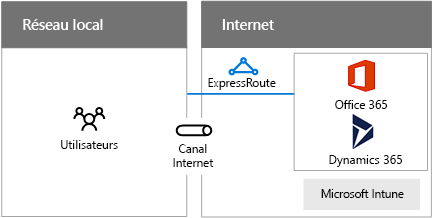

# Conception de réseaux pour Microsoft SaaS

 **Résumé :** Comprendre comment optimiser votre réseau pour accéder aux services SaaS de Microsoft, notamment Office 365, Microsoft Intune et Dynamics 365.
  
L'optimisation de votre réseau pour les services SaaS de Microsoft nécessite une analyse approfondie de votre périmètre Internet, de vos périphériques client et de vos opérations informatiques standard.
  
## Étapes pour préparer votre réseau aux services SaaS de Microsoft

Procédez comme suit pour optimiser votre réseau pour les services SaaS de Microsoft :
  
1. Consultez les **étapes de préparation de votre réseau pour services de cloud computing Microsoft** fournies dans[Éléments communs de la connectivité au cloud Microsoft](common-elements-of-microsoft-cloud-connectivity.md).
    
2. Optimisez votre sortie Internet pour les services SaaS de Microsoft en utilisant les recommandations de serveur proxy.
    
3. Optimisez votre débit Internet en utilisant les recommandations en matière de proximité et d'emplacement.
    
4. Optimisez les performances des ordinateurs de vos clients et de l'intranet sur lequel ils se trouvent à l'aide des considérations relatives à l'utilisation du client.
    
5. Le cas échéant, optimisez les performances des migrations des données et de la synchronisation à l'aide des considérations relatives aux opérations informatiques.
    
## Considérations relatives au périmètre Internet

Voici quelques éléments à prendre en considération pour l'optimisation de votre périmètre Internet et du débit vers les services SaaS de Microsoft.
  
**Figure 1 : Options de connexion pour les services SaaS de Microsoft**

  
La figure 1 présente un réseau local qui se connecte aux services SaaS de Microsoft via un canal Internet ou ExpressRoute.
  
Voici quelques recommandations pour optimiser votre serveur proxy :
  
- Configurez les clients web à l'aide du protocole WPAD, du certificat PAC ou de l'objet de stratégie de groupe
    
- N'utilisez pas interception SSL
    
- Utilisez un fichier PAC pour contourner le proxy pour les noms DNS de service SaaS de Microsoft
    
- Autorisez le trafic pour la vérification de la liste de révocation de certificats/du protocole OCSP
    
Voici quelques goulots d'étranglement de serveur proxy à vérifier :
  
- Connexions persistantes insuffisantes (Outlook)
    
- Capacité insuffisante
    
- Réalisation de l'évaluation hors réseau
    
- Demande d'authentification
    
- Aucune prise en charge pour le trafic UDP (Skype Entreprise)
    
Voici quelques recommandations en matière de proximité et d'emplacement :
  
- N'acheminez pas le trafic Internet sur le réseau étendu privé
    
- Utilisez le flux de trafic DNS et Internet dans la région pour les utilisateurs à l'extérieur de la région
    
- Utilisez ExpressRoute pour une large bande passante vers Office 365 et une connectivité simultanée avec les services Azure
    
Voici les ports de sortie nécessaires pour le trafic Office 365 :
  
- TCP 80 (pour les vérifications de liste de révocation de certificats/de protocole OCSP)
    
- TCP 443
    
- UDP 3478
    
- TCP 5223
    
- TCP 50000-59999
    
- UDP 50000-59999
    
## Considérations relative à l'utilisation client

Tout d'abord, configurez l'ensemble des services que vos clients utiliseront, tels que :
  
- Azure Active Directory
    
- Office 365
    
  - Applications client Office
    
  - SharePoint Online
    
  - Exchange Online
    
  - Skype Entreprise
    
- Microsoft Intune
    
- Dynamics 365
    
Pour les ordinateurs de vos clients, déterminez les éléments suivants :
  
- Nombre maximal à chaque fois (heure du jour, saisonnier, pics et creux d'utilisation)
    
- Bande passante totale nécessaire pour les pics
    
- Latence vers le périphérique de sortie Internet
    
- Pays d'origine et pays de colocalisation des centres de données
    
Pour chaque type de client (PC, smartphone ou tablette), vérifiez les éléments suivants actuels :
  
- Système d'exploitation
    
- Navigateur Internet
    
- Pile TCP/IP
    
- Matériel réseau
    
- Pilotes du système d'exploitation du matériel réseau
    
- Installation des mises à jour et des correctifs
    
En outre, optimisez le débit de connexion intranet (par câble, sans fil ou VPN).
  
Pour plus d'informations, voir l'article [Prise en charge NAT avec Office 365](https://support.office.com/fr-fr/article/NAT-support-with-Office-365-170e96ea-d65d-4e51-acac-1de56abe39b9).
  
Pour obtenir les dernières recommandations sur l'utilisation d'ExpressRoute avec Office 365, voir [ExpressRoute pour Office 365](https://support.office.com/article/Azure-ExpressRoute-for-Office-365-6d2534a2-c19c-4a99-be5e-33a0cee5d3bd).
  
Pour optimiser les performances de votre intranet, procédez comme suit :
  
- Utilisez des outils pour évaluer la durée approximative des boucles sur vos périphériques du périmètre Internet (PsPing, Ping, Tracert, TraceTCP, Moniteur réseau)
    
- Effectuez l'analyse de chemin de sortie à l'aide des protocoles de flux
    
- Effectuez l'analyse des périphériques intermédiaires (âge, intégrité, etc.)
    
Pour plus d'informations, voir l'article concernant l'[outil PsPing](https://technet.microsoft.com/fr-fr/sysinternals/jj729731.aspx).
  
## Considérations relatives aux opérations informatiques

Voici quelques éléments à prendre en considération lors de l'exploitation d'une charge de travail informatique dans un service SaaS de Microsoft.
  
### Migrations exceptionnelles

Le transfert de données en bloc pour les applications basées sur le cloud ou le stockage d'archives représentent des exemples de migrations exceptionnelles.
  
Afin d'optimiser votre réseau pour les migrations exceptionnelles, procédez comme suit :
  
- Évitez l'utilisation maximale du réseau et les heures de correctifs de l'ordinateur
    
- En cas de ligne de base et de guidage, évaluez l'intégrité du réseau et résolvez les problèmes avant d'essayer la migration réelle
    
- Effectuez un post-mortem pour les prochaines migrations
    
### Synchronisations en cours

Les informations du répertoire, les paramètres ou les fichiers sont des exemples de synchronisations en cours.
  
Pour optimiser votre réseau pour les synchronisations en cours, procédez comme suit :
  
- Assurez-vous qu'un système de suivi de la bande passante réseau est en place, et résolvez ou ignorez les erreurs collectées
    
- Utilisez les résultats du suivi de la bande passante pour déterminer les modifications de réseau nécessaires (monter en puissance/en charge, nouveaux circuits ou ajouter des périphériques)
    
Pour plus d'informations, voir :
  
- [Planification réseau et de migration pour Office 365](https://aka.ms/tune)
    
- [Cours Microsoft Virtual Academy concernant la gestion des performances pour Office 365](https://aka.ms/o365perf)
    
- [ExpressRoute pour Office 365](https://aka.ms/expressrouteoffice365)
    
## See Also

#### 

[Mise en réseau cloud Microsoft pour les architectes d'entreprise](microsoft-cloud-networking-for-enterprise-architects.md)
  
[Ressources relatives à l'architecture informatique du cloud Microsoft](microsoft-cloud-it-architecture-resources.md)
#### 

[Feuille de route Enterprise Cloud de Microsoft relative aux ressources pour les décideurs en matière d'informatique](https://sway.com/FJ2xsyWtkJc2taRD)

