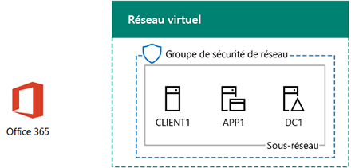

# <a name="directory-synchronization-for-your-office-365-devtest-environment"></a>Synchronisation d’annuaire pour votre environnement de développement/test d’Office 365

 **Résumé :** Configurer la synchronisation d’annuaire pour votre environnement de développement/test d’Office 365.
  
De nombreuses entreprises choisissent d’utiliser Azure Connect de publicité et de la synchronisation d’annuaire à synchroniser l’ensemble des comptes dans leur forêt de Windows Server Active Directory (AD) sur site à l’ensemble des comptes dans Office 365. Cet article explique comment vous pouvez ajouter la synchronisation d’annuaire avec synchronisation de hachage de mot de passe à l’environnement de développement/test Office 365, résultant dans la configuration suivante.
  

  
Cette configuration se compose des éléments suivants :  
  
- Un abonnement d’évaluation Office 365 E5, qui arrive à expiration 30 jours après sa création.
- Un intranet d’organisation simplifié connecté à Internet, qui se compose de trois machines virtuelles sur un sous-réseau d’un réseau virtuel Azure (DC1, APP1 et CLIENT1). Azure AD Connect s’exécute sur APP1 pour synchroniser le domaine Windows Server AD avec Office 365.
    
Les deux phases de configuration de cet environnement de développement/test sont les suivantes :
  
1. Créez l’environnement de développement/test Office 365 (les machines virtuelles DC1, APP1 et CLIENT1 dans un réseau virtuel Azure avec un abonnement d’évaluation Office 365 E5).
2. Installez et configurez Azure AD Connect sur APP1.
    
> [!TIP]
> Cliquez [ici](http://aka.ms/catlgstack) pour une carte visuelle de tous les articles dans la pile d’un Guide de laboratoire de Test Microsoft Cloud.
  
## <a name="phase-1-create-an-office-365-devtest-environment"></a>Phase 1 : création d’un environnement de développement/test Office 365

Suivez les instructions affichées dans les étapes 1, 2 et 3 de l’article de [l’environnement de développement/test d’Office 365](office-365-dev-test-environment.md) . Voici la configuration obtenue.
  

  
Cette configuration se compose des éléments suivants :  
  
- Un abonnement d’évaluation Office 365 E5.
- Un intranet d’organisation simplifié connecté à Internet, qui se compose des machines virtuelles DC1, APP1 et CLIENT1 sur un sous-réseau d’un réseau virtuel Azure.
    
## <a name="phase-2-install-azure-ad-connect-on-app1"></a>Phase 2 : installation d’Azure AD Connect sur APP1

Une fois installé et configuré, Azure AD Connect synchronise l’ensemble de comptes dans le domaine CORP Windows Server AD avec l’ensemble de comptes dans votre abonnement d’évaluation Office 365. La procédure suivante vous guide tout au long de l’installation d’Azure AD Connect sur APP1 et de la vérification de son fonctionnement.
  
### <a name="install-and-configure-azure-ad-connect-on-app1"></a>Installer et configurer Azure AD Connect dans APP1

1. Dans le [portail Azure](https://portal.azure.com), connectez-vous à APP1 avec le CORP\\compte utilisateur1.
    
2. À partir d’APP1, ouvrez une invite de commande Windows PowerShell de niveau administrateur, puis exécutez les commandes suivantes :
    
  ```
  Set-ItemProperty -Path "HKLM:\\SOFTWARE\\Microsoft\\Active Setup\\Installed Components\\{A509B1A7-37EF-4b3f-8CFC-4F3A74704073}" -Name "IsInstalled" -Value 0
Set-ItemProperty -Path "HKLM:\\SOFTWARE\\Microsoft\\Active Setup\\Installed Components\\{A509B1A8-37EF-4b3f-8CFC-4F3A74704073}" -Name "IsInstalled" -Value 0
Stop-Process -Name Explorer -Force

  ```

3. À partir de la barre des tâches, cliquez sur **Internet Explorer** et accédez à [https://aka.ms/aadconnect](https://aka.ms/aadconnect).
    
4. Sur la page Microsoft Azure Active Directory se connecter, cliquez sur **Télécharger**, puis cliquez sur **exécuter**.
    
5. Dans la page **Bienvenue dans Azure Connect d’Active Directory** , cliquez sur **J’accepte**, puis cliquez sur **Continuer**.
    
6. Dans la page **Paramètres Express** , cliquez sur **utiliser les paramètres express**.
    
7. Sur la page de **connexion à Azure AD** , tapez votre nom de compte administrateur global dans le type de **nom d’utilisateur,** son mot de passe **mot de passe**, puis cliquez sur **suivant**.
    
8. Sur la page de **connexion aux services AD DS** , tapez **CORP\\utilisateur1** dans **nom d’utilisateur,** tapez son mot de passe **mot de passe**, puis cliquez sur **suivant**.
    
9. Sur la page de **configuration de connexion AD Azure** , cliquez sur **Continuer sans vérifié tous les domaines**, puis cliquez sur **suivant**.
    
10. Sur la page **Prêt à configurer**, cliquez sur **Installer**.
    
11. Dans la page **Configuration terminée** , cliquez sur **Quitter**.
    
12. Dans Internet Explorer, accédez au portail Office 365 ([https://portal.office.com](https://portal.office.com)) et connectez-vous à votre abonnement d’évaluation d’Office 365 avec votre compte d’administrateur global.
    
13. À partir de la page principale du portail, cliquez sur **Admin**.
    
14. Dans la navigation de gauche, cliquez sur **Utilisateurs > Utilisateurs actifs**.
    
    Notez le compte nommé **utilisateur1**. Ce compte est dans le domaine CORP Windows Server Active Directory et la preuve que la synchronisation d’annuaire a travaillé.
    
15. Cliquez sur le compte **d’utilisateur1** . Pour les licences de produit, cliquez sur **Modifier**.
    
16. Dans **les licences de produit**, sélectionnez votre pays, puis cliquez sur le contrôle **hors** d' **Office 365 entreprise E5** (commutation **on**). Cliquez sur **Enregistrer** en bas de la page, puis cliquez sur **Fermer**.
    
Voici la configuration obtenue.
  

  
Cette configuration se compose des éléments suivants :  
  
- Un abonnement d’évaluation Office 365 E5.
- Un intranet d’organisation simplifié connecté à Internet, qui se compose des machines virtuelles DC1, APP1 et CLIENT1 sur un sous-réseau d’un réseau virtuel Azure. Azure AD Connect s’exécute sur APP1 pour synchroniser le domaine CORP Windows Server AD avec Office 365 toutes les 30 minutes.
    
## <a name="next-step"></a>Étape suivante

Lorsque vous êtes prêt à déployer la synchronisation d’annuaire de votre organisation, voir [déployer Office 365 la synchronisation d’annuaire dans Microsoft Azure](deploy-office-365-directory-synchronization-dirsync-in-microsoft-azure.md).

## <a name="see-also"></a>Voir aussi

[Cloud adoption Guides de laboratoires de Test (TLGs)](cloud-adoption-test-lab-guides-tlgs.md)
[environnement de développement/test de Configuration de Base de](base-configuration-dev-test-environment.md)
[environnement de développement/test Office 365](office-365-dev-test-environment.md)
[Sécurité d’application Cloud pour votre environnement de développement/test Office 365](cloud-app-security-for-your-office-365-dev-test-environment.md) 
 [ Avancées de protection contre les menaces pour votre environnement de développement/test Office 365](advanced-threat-protection-for-your-office-365-dev-test-environment.md)
[adoption du nuage et les solutions hybride](cloud-adoption-and-hybrid-solutions.md)


