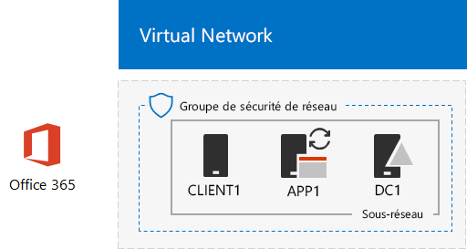
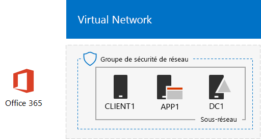

# <a name="directory-synchronization-for-your-office-365-devtest-environment"></a>Synchronisation d’annuaires pour votre environnement de développement/test Office 365

 **Résumé :** Configurez la synchronisation d’annuaires pour votre environnement de développement/test Office 365.
  
De nombreuses organisations utilisent Azure AD Connect et la synchronisation d’annuaires pour synchroniser l’ensemble des comptes dans leur forêt Active Directory Domain Services (AD DS) en local avec l’ensemble des comptes dans Office 365. Cet article explique la procédure d’ajout de la synchronisation d’annuaires avec synchronisation de hachage de mot de passe à l’environnement de développement/test Office 365, ce qui entraîne la configuration suivante.
  

  
Cette configuration se compose des éléments suivants :  
  
- Un abonnement d’évaluation Office 365 E5, qui arrive à expiration 30 jours après sa création.
- Un intranet d’organisation simplifié connecté à Internet, qui se compose de trois machines virtuelles dans un sous-réseau d’un réseau virtuel Azure (DC1, APP1 et CLIENT1). Azure AD Connect s’exécute sur APP1 pour synchroniser le domaine AD DS avec Office 365.
    
Les deux phases de configuration de cet environnement de développement/test sont les suivantes :
  
1. Créez l’environnement de développement/test Office 365 (les machines virtuelles DC1, APP1 et CLIENT1 dans un réseau virtuel Azure avec un abonnement d’évaluation Office 365 E5).
2. Installez et configurez Azure AD Connect sur APP1.
    
> [!TIP]
> Cliquez sur[ici](http://aka.ms/catlgstack) pour afficher le plan de tous les articles dans le Guide de Laboratoire Test Office 365.
  
## <a name="phase-1-create-an-office-365-devtest-environment"></a>Phase 1 : création d’un environnement de développement/test Office 365

Suivez les instructions des phases 1, 2 et 3 de l’article relatif à l’[environnement de développement/test Office 365](office-365-dev-test-environment.md). Voici la configuration obtenue.
  

  
Cette configuration se compose des éléments suivants :  
  
- Un abonnement d’évaluation Office 365 E5.
- Un intranet d’organisation simplifié connecté à Internet, qui se compose des machines virtuelles DC1, APP1 et CLIENT1 sur un sous-réseau d’un réseau virtuel Azure.
    
## <a name="phase-2-install-azure-ad-connect-on-app1"></a>Phase 2 : installation d’Azure AD Connect sur APP1

Une fois installé et configuré, Azure AD Connect synchronise l’ensemble des comptes dans le domaine CORP AD DS avec l’ensemble des comptes dans votre abonnement d’essai Office 365. La procédure suivante vous guide tout au long de l’installation d’Azure AD Connect sur APP1 et du contrôle de son fonctionnement.
  
### <a name="install-and-configure-azure-ad-connect-on-app1"></a>Installation et configuration d’Azure AD Connect sur APP1

1. À partir du [portail Azure](https://portal.azure.com), connectez-vous à APP1 avec le compte CORP\\Utilisateur1.
    
2. À partir d’APP1, ouvrez une invite de commande Windows PowerShell de niveau administrateur, puis exécutez les commandes suivantes :
    
  ```
  Set-ItemProperty -Path "HKLM:\SOFTWARE\Microsoft\Active Setup\Installed Components\{A509B1A7-37EF-4b3f-8CFC-4F3A74704073}" -Name "IsInstalled" -Value 0
Set-ItemProperty -Path "HKLM:\SOFTWARE\Microsoft\Active Setup\Installed Components\{A509B1A8-37EF-4b3f-8CFC-4F3A74704073}" -Name "IsInstalled" -Value 0
Stop-Process -Name Explorer -Force

  ```

3. Dans la barre des tâches, cliquez sur **Internet Explorer** et accédez à [https://aka.ms/aadconnect](https://aka.ms/aadconnect).
    
4. Sur la page de Microsoft Azure Active Directory Connect, cliquez sur **Télécharger**, puis cliquez sur **Exécuter**.
    
5. Sur la page **Bienvenue dans Azure AD Connect**, cliquez sur **J’accepte**, puis sur **Continuer**.
    
6. Sur la page **Configuration rapide**, cliquez sur **Utiliser la configuration rapide**.
    
7. Sur la page **Connexion à Azure AD**, saisissez le nom de votre compte d’administrateur général sous **Nom d’utilisateur** et le mot de passe correspondant sous **Mot de passe**, puis cliquez sur **Suivant**.
    
8. Sur la page **Connexion à AD DS**, saisissez **CORP\\Utilisateur** sous **Nom d’utilisateur,** entrez le mot de passe correspondant sous **Mot de passe**, puis cliquez sur **Suivant**.
    
9. Sur la page **Configuration de la connexion à Azure AD**, cliquez sur **Continuer sans aucun domaine vérifié**, puis cliquez sur **Suivant**.
    
10. Sur la page **Prêt à configurer**, cliquez sur **Installer**.
    
11. Sur la page **Configuration terminée**, cliquez sur **Quitter**.
    
12. Dans Internet Explorer, accédez au Centre d’administration Microsoft 365 ([https://admin.microsoft.com](https://admin.microsoft.com)) et connectez-vous à votre abonnement d’évaluation Office 365 avec votre compte d’administrateur général.
    
13. Sur la page principale du portail, cliquez sur **Administrateur**.
    
14. Dans la navigation de gauche, cliquez sur **Utilisateurs > Utilisateurs actifs**.
    
    Prenez note du compte nommé **Utilisateur1**. Ce compte provient du domaine CORP AD DS et prouve que la synchronisation d’annuaires a fonctionné.
    
15. Cliquez sur le compte **Utilisateur1**. Pour les licences de produits, cliquez sur **Modifier**.
    
16. Dans **Licences de produits**, sélectionnez votre pays, puis cliquez sur le contrôle **Inactif** pour **Office 365 Entreprise E5** (en le définissant sur **Actif**). Cliquez sur **Enregistrer** en bas de la page, puis cliquez sur **Fermer**.
    
Voici la configuration obtenue.
  

  
Cette configuration se compose des éléments suivants :  
  
- un abonnement d’évaluation Office 365 E5.
- Un intranet d’organisation simplifié connecté à Internet, qui se compose des machines virtuelles DC1, APP1 et CLIENT1 dans un sous-réseau d’un réseau virtuel Azure. Azure AD Connect s’exécute dans APP1 pour synchroniser le domaine CORP AD DS avec Office 365 toutes les 30 minutes.
    
## <a name="next-step"></a>Étape suivante

Lorsque vous êtes prêt à déployer la synchronisation d'annuaires pour votre organisation, consultez la rubrique[Déploiement de la Synchronisation d'annuaires Office 365 dans Microsoft Azure](deploy-office-365-directory-synchronization-dirsync-in-microsoft-azure.md).

## <a name="see-also"></a>Voir aussi

[Guides de laboratoire de test d’adoption cloud](cloud-adoption-test-lab-guides-tlgs.md)

[Environnement de développement/test de configuration de base](base-configuration-dev-test-environment.md)

[Environnement de développement/test Office 365](office-365-dev-test-environment.md)

[Sécurité des applications cloud pour votre environnement de développement/test Office 365](cloud-app-security-for-your-office-365-dev-test-environment.md)

[Protection avancée contre les menaces pour votre environnement de développement/test Office 365](advanced-threat-protection-for-your-office-365-dev-test-environment.md)

[Adoption du cloud et solutions hybrides](cloud-adoption-and-hybrid-solutions.md)


