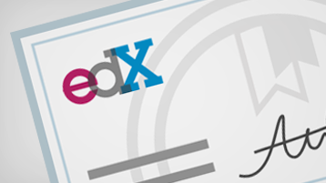

# Organisations d’entreprise et Office 365

En tant que plus grande organisation avec des professionnels de l’informatique, vous avez des exigences et des normes spécifiques pour la maintenance de votre environnement. Voici les informations dont vous avez besoin pour planifier et gérer Office 365 pour votre entreprise.
  

> [!VIDEO https://www.microsoft.com/videoplayer/embed/d08b637c-66dc-4f0e-afc2-56da92e99589?autoplay=false]
  
## Ressources clés

  
 **Obtenir de l’aide de FastTrack**
  
Planifiez, configurez et migrez les données vers Office 365 avec l’aide de FastTrack.
  
[Obtenir sur FastTrack](https://go.microsoft.com/fwlink/?linkid=238431)
  

  
 **Conformité &amp; de la sécurité**
  
Protégez vos données et respectez les normes légales ou réglementaires.
  
[Vue d’ensemble &amp; de la conformité de sécurité dans Office 365](https://support.office.com/article/dcb83b2c-ac66-4ced-925d-50eb9698a0b2)
  

  
 **Comprendre l’architecture Cloud**
  
Explorez les affiches de l’architecture sur le Cloud d’entreprise.
  
[Obtenir des affiches](https://aka.ms/cloudarch)
  

  
 **En savoir plus sur les attaques courantes**
  
Découvrez comment Microsoft peut vous aider à protéger votre organisation.
  
[Télécharger l’affiche](https://aka.ms/commonattacks)
  
## Formation pour les professionnels de l’informatique

  
 **Formation pour les professionnels de l’informatique**
  
Découvrez les cours vidéo gratuits proposés par LinkedIn Learning.
  
[Formation avancée](https://support.office.com/article/68cc9b95-0bdc-491e-a81f-ee70b3ec63c5.aspx)
  

  
 **Microsoft Learning**
  
Office 365 formation et certification pour les professionnels de l’informatique.
  
[Formation populaire](https://go.microsoft.com/fwlink/?linkid=826247)
  

  
 **Académie virtuelle**
  
Découvrez les experts de Microsoft Virtual Academy.
  
[Parcourir les cours](https://go.microsoft.com/fwlink/?linkid=826248)
  

  
 **Université edX**
  
Des expériences d’apprentissage en ligne autonomes pour les professionnels de l’informatique Office 365.
  
[Inscrivez-vous maintenant](https://go.microsoft.com/fwlink/?linkid=852994)
  
## Articles proposés

[Contacter le support relatif aux produits d’entreprises- Aide de l’administrateur](https://support.office.com/article/32a17ca7-6fa0-4870-8a8d-e25ba4ccfd4b)
  
[Déployer le nouveau client de synchronisation OneDrive pour Windows](https://support.office.com/article/3f3a511c-30c6-404a-98bf-76f95c519668)
  
[Méthodes de migration des comptes de courrier vers Office 365](https://support.office.com/article/0a4913fe-60fb-498f-9155-a86516418842)
  
[Mise à niveau à partir des serveurs et clients Office 2010](upgrade-from-office-2010-servers-and-products.md)
  
[Conseillers de déploiement pour les services Office 365](deployment-advisors-for-office-365.md)
  
 **Formation pour les utilisateurs finaux**
  
[Formation sur la productivité Office 365](https://support.office.com/article/af07cb6b-980d-4f33-8599-322582767408)
  
[Vidéo: qu’est-ce que Office 365?](https://support.office.com/article/847caf12-2589-452c-8aca-1c009797678b)
  
 **Ressources de développement**
  
[Centre de développement Office](https://go.microsoft.com/fwlink/?linkid=615418)
  

