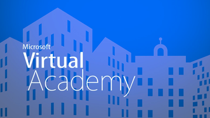

# Organisations d’entreprise et Office 365Enterprise organizations and Office 365

En tant que plus grande organisation avec des professionnels de l’informatique, vous avez des exigences et des normes spécifiques pour la maintenance de votre environnement.As a larger organization with IT professionals on staff, you have specific requirements and standards for maintaining your environment. Voici les informations dont vous avez besoin pour planifier et gérer Office 365 pour votre entreprise.Here's the information you need to plan for and manage Office 365 for your enterprise.
  

> [!VIDEO https://www.microsoft.com/videoplayer/embed/d08b637c-66dc-4f0e-afc2-56da92e99589?autoplay=false]
  
## Ressources clésKey resources

  
 **Obtenir de l’aide de FastTrack****Get assistance from FastTrack**
  
Planifiez, configurez et migrez les données vers Office 365 avec l’aide de FastTrack.Plan, setup, and migrate data to Office 365 with help from FastTrack.
  
[Obtenir sur FastTrackGet on the FastTrack](https://go.microsoft.com/fwlink/?linkid=238431)
  

  
 **Conformité &amp; de la sécurité****Security &amp; Compliance**
  
Protégez vos données et respectez les normes légales ou réglementaires.Protect your data and comply with legal or regulatory standards.
  
[Vue d’ensemble &amp; de la conformité de sécurité dans Office 365Overview of security &amp; compliance in Office 365](https://support.office.com/article/dcb83b2c-ac66-4ced-925d-50eb9698a0b2)
  

  
 **Comprendre l’architecture Cloud****Understand cloud architecture**
  
Explorez les affiches de l’architecture sur le Cloud d’entreprise.Explore architecture posters about the Enterprise Cloud.
  
[Obtenir des affichesGet posters](https://aka.ms/cloudarch)
  

  
 **En savoir plus sur les attaques courantes****Learn about common attacks**
  
Découvrez comment Microsoft peut vous aider à protéger votre organisation.Learn how Microsoft can help protect your organization.
  
[Télécharger l’afficheDownload the poster](https://aka.ms/commonattacks)
  
## Formation pour les professionnels de l’informatiqueTraining for IT Pros

  
 **Formation pour les professionnels de l’informatique****IT Pro training**
  
Découvrez les cours vidéo gratuits proposés par LinkedIn Learning.Discover free video courses brought to you by LinkedIn Learning.
  
[Formation avancéeAdvanced training](https://support.office.com/article/68cc9b95-0bdc-491e-a81f-ee70b3ec63c5.aspx)
  

  
 **Microsoft Learning****Microsoft Learning**
  
Office 365 formation et certification pour les professionnels de l’informatique.Office 365 training and certification for IT Professionals.
  
[Formation populairePopular training](https://go.microsoft.com/fwlink/?linkid=826247)
  

  
 **Académie virtuelle****Virtual Academy**
  
Découvrez les experts de Microsoft Virtual Academy.Learn from the experts at Microsoft Virtual Academy.
  
[Parcourir les coursBrowse courses](https://go.microsoft.com/fwlink/?linkid=826248)
  

  
 **Université edX****edX University**
  
Des expériences d’apprentissage en ligne autonomes pour les professionnels de l’informatique Office 365.Self-paced online learning experiences for Office 365 IT Pros.
  
[Inscrivez-vous maintenantEnroll now](https://go.microsoft.com/fwlink/?linkid=852994)
  
## Articles proposésFeatured articles

[Contacter le support relatif aux produits d’entreprises- Aide de l’administrateurContact support for business products - Admin Help](https://support.office.com/article/32a17ca7-6fa0-4870-8a8d-e25ba4ccfd4b)
  
[Déployer le nouveau client de synchronisation OneDrive pour WindowsDeploy the new OneDrive sync client for Windows](https://support.office.com/article/3f3a511c-30c6-404a-98bf-76f95c519668)
  
[Méthodes de migration des comptes de courrier vers Office 365Ways to migrate multiple email accounts to Office 365](https://support.office.com/article/0a4913fe-60fb-498f-9155-a86516418842)
  
[Mettre à niveau des serveurs et clients Office 2010Upgrade from Office 2010 servers and clients](upgrade-from-office-2010-servers-and-products.md)
  
[Conseillers de déploiement pour les services Office 365Deployment advisors for Office 365 services](deployment-advisors-for-office-365.md)
  
 **Formation pour les utilisateurs finaux****Training for end users**
  
[Formation sur la productivité Office 365Office 365 productivity training](https://support.office.com/article/af07cb6b-980d-4f33-8599-322582767408)
  
[Vidéo : qu’est-ce que Office 365 ?Video: What is Office 365?](https://support.office.com/article/847caf12-2589-452c-8aca-1c009797678b)
  
 **Ressources de développement****Development resources**
  
[Centre de développement OfficeOffice Dev Center](https://go.microsoft.com/fwlink/?linkid=615418)
  

