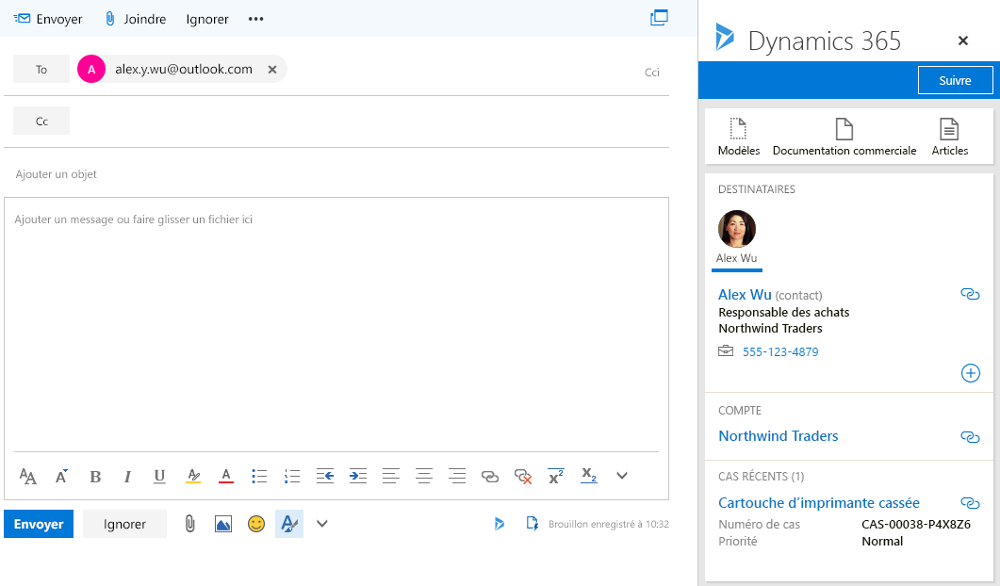

# Intégration d’Exchange Online pour votre environnement de développement/test Office 365 et Dynamics 365Exchange Online integration for your Office 365 and Dynamics 365 dev/test environment

 **Résumé :** Utilisez ce Guide de laboratoire de test pour activer l'intégration de Dynamics 365 pour Exchange Online dans votre abonnement à la version d'évaluation d'Office 365.**Summary:** Use this Test Lab Guide to enable Dynamics 365 integration for Exchange Online in your Office 365 trial subscription.
  
Un aspect utile de Microsoft Dynamics 365 est le stockage de toutes les communications client en un seul endroit, afin que toute personne disposant des autorisations appropriées puisse voir l'ensemble des enregistrements client pertinents. Par exemple, afficher tous les e-mails associés à un contact, un compte, une opportunité ou une demande de devis en particulier.A valuable use of Microsoft Dynamics 365 is to store all customer communications in one place, so anyone with the appropriate permissions can see all relevant customer records. For example, view all email associated with a particular contact, account, opportunity, or case.
  
Pour stocker les e-mails et autres enregistrements de messagerie dans Dynamics 365, vous devez synchroniser votre système de messagerie avec Dynamics 365. La synchronisation côté serveur est la méthode de prédilection pour la synchronisation de la messagerie.To store email and other messaging records in Dynamics 365, you need to synchronize your email system with Dynamics 365. Server-side synchronization is the method of choice for email synchronization.
  
Utilisez ce Guide de laboratoire de test pour configurer et montrer la façon dont Exchange Online et le client Outlook Online peuvent exploiter les informations stockées dans Dynamics 365.Use this Test Lab Guide to configure and demonstrate how Exchange Online and the Outlook Online client can leverage the information stored in Dynamics 365. 
  
## Phase 1 : créer l’environnement de développement/test Office 365 et Dynamics 365Phase 1: Build out the Office 365 and Dynamics 365 dev/test environment

Suivez les instructions figurant dans la rubrique [Environnement de développement/test Office 365 et Dynamics 365](office-365-and-dynamics-365-dev-test-environment.md) pour créer une version en mode léger ou pour entreprise simulée d'un environnement de développement/test Office 365 et Dynamics 365.Use the instructions in [Office 365 and Dynamics 365 dev/test environment](office-365-and-dynamics-365-dev-test-environment.md) to create either a lightweight or simulated enterprise version of an Office 365 and Dynamics 365 dev/test environment.
  
> [!NOTE]
> La configuration décrite dans cet article ne requiert pas l’environnement de développement/test en entreprise simulée, qui utilise un intranet simulé connecté à Internet et la synchronisation d’annuaires pour une forêt Windows Server Active Directory (AD). Il est proposé comme option dans cet article afin que vous puissiez tester Office 365 et Dynamics 365 dans un environnement qui représente une organisation classique.The configuration in this article does not require the simulated enterprise dev/test environment, which includes a simulated intranet connected to the Internet and directory synchronization for a Windows Server Active Directory (AD) forest. It is provided here as an option so that you can experiment with Office 365 and Dynamics 365 in an environment that represents a typical organization 
  
## Phase 2 : configurer et montrer l'intégration Dynamics 365 dans Exchange OnlinePhase 2: Configure and demonstrate Dynamics 365 integration in Exchange Online

Suivez ces étapes pour configurer la boîte aux lettres de l'administrateur général pour l'intégration de Dynamics 365 et Exchange Online :Use these steps to configure the global administrator's mailbox for Dynamics 365 and Exchange Online integration:
  
1. À l’aide d’une session privée de votre navigateur, accédez à [(http://portal.office.com)]((http://portal.office.com)) et connectez-vous à l’aide de votre compte d’administrateur général Office 365.Using a private session of your browser, go to [((http://portal.office.com))]((http://portal.office.com)) and sign in using your Office 365 global administrator account.
    
2. Sur la page **Accueil Microsoft Office**, cliquez sur la mosaïque **Messagerie**.On the **Microsoft Office Home** page, click the **Mail** tile.
    
3. Dans le nouvel onglet **Messagerie** de votre navigateur, cliquez sur **Nouveau** et notez que la partie inférieure du volet en dessous de la zone de saisie d'un message contient une icône pour Mes modèles.On the new **Mail** tab in your browser, click **New** and notice how the bottom corner of the pane below the box for typing a message contains an icon for My Templates.
    
     
  
4. Cliquez sur **Abandonner** et laissez l'onglet **Messagerie** ouvert.Click **Discard** and leave the **Mail** tab open.
    
5. Cliquez sur l'onglet **Accueil Microsoft Office** de votre navigateur, puis cliquez sur la mosaïque **Administration**.Click the **Microsoft Office Home** tab in your browser, and then click the **Admin** tile.
    
6. Dans le volet de navigation gauche de l'onglet **Centre d'administration Office**, cliquez sur **Centres d'administration > Dynamics 365**.In the left navigation of the **Office Admin center** tab, click **Admin centers > Dynamics 365**.
    
7. Dans le nouvel onglet **Dynamics 365** de votre navigateur, dans la liste des instances de Dynamics 365, cliquez sur **Ouvrir**.On the new **Dynamics 365** tab in your browser, in the list of Dynamics 365 instances, click **Open**.
    
8. Dans le nouvel onglet **Administration** de votre navigateur, dans la barre de navigation, cliquez sur la flèche vers le bas en regard de **Paramètres**, puis cliquez sur **Configuration de la messagerie** sous **Système**.On the new **Administration** tab in your browser, on the navigation bar, click the down arrow next to **Settings**, and then click **Email Configuration** under **System**.
    
9.  Sur la page **Configuration de la messagerie**, cliquez sur **Paramètres de configuration de la messagerie**.On the **Email Configuration** page, click **Email Configuration Settings**.
    
10. Dans l'onglet **Messagerie** de la boîte de dialogue **Paramètres du système**, remplacez **Rendez-vous, contacts et tâches** par **Synchronisation côté serveur**, puis cliquez sur **OK**.In the **Email** tab on the **System Settings** dialog box, change **Appointments, Contacts, and Tasks** to **Server-Side Synchronization**, and then click **OK**.
    
11. Sur la page **Configuration de la messagerie**, cliquez sur **Boîtes aux lettres**.On the **Email Configuration** page, click **Mailboxes**.
    
12. Sélectionnez le nom de l'administrateur général Office 365 dans la colonne de gauche, cliquez sur **Appliquer les paramètres de courrier électronique par défaut** dans la barre d'outils, puis cliquez sur **OK**.Select the Office 365 global administrator name in the left check mark column, click **Apply Default Email Settings** in the tool bar, and then click **OK**.
    
13. Cliquez sur **Approuver l'adresse de messagerie** dans la barre d'outils, puis cliquez sur **OK**.Click **Approve Email** in the tool bar, and then click **OK**.
    
14. Sélectionnez le nom de l’administrateur général Office 365 dans la colonne de gauche, cliquez sur **Tester&amp; Activer les boîtes aux lettres** dans la barre d’outils, puis cliquez sur **OK**.Select the Office 365 global administrator name in the left check mark column, click **Test &amp; Enable Mailboxes** in the tool bar, and then click **OK**.
    
15. Cliquez sur l'onglet **Messagerie** ouvert et vérifiez que l'administrateur général a reçu un message de test.Click the open **Mail** tab and confirm that the global administrator received a test message.
    
16. Revenez à l'onglet **Boîtes aux lettres - Boîtes aux lettres actives** de votre navigateur, puis actualisez la page. Les colonnes **Statut des courriers électroniques entrants** et **Statut des courriers électroniques sortants** doivent être définies sur **Succès** pour le nom de compte d'administrateur général. Notez qu'il faut compter jusqu'à 15 minutes pour exécuter les deux tests.Return to the **Mailboxes My Active Mailboxes** tab in your browser and refresh the page. The **Incoming Email Status** and **Outgoing Email Status** columns should be set to **Success** for the global administrator account name. Note that it can take up to 15 minutes to complete both tests.
    
Suivez ces étapes pour installer l'application Dynamics 365 pour Outlook et montrer les fonctionnalités de Dynamics 365 au sein de la boîte aux lettres de l'administrateur général :Use these steps to install the Dynamics 365 App for Outlook and demonstrate Dynamics 365 features within the global administrator's mailbox:
  
1. Dans l'onglet **Boîtes aux lettres - Boîtes aux lettres actives** de votre navigateur, cliquez sur la flèche vers le bas en regard de **Paramètres**, puis cliquez sur **Application Dynamics 365 pour Outlook** sous **Système**.On the **Mailboxes My Active Mailboxes** tab in your browser, click the down arrow next to **Settings**, and then click **Dynamics 365 App for Outlook** under **System**.
    
2. Sur la page **Prise en main de l'application Microsoft Dynamics 365 pour Outlook**, cliquez sur le nom de l'administrateur général, puis cliquez sur **Ajouter l'application à Outlook**. La colonne **Statut** indique **En attente**.On the **Getting Started with Microsoft Dynamics 365 App for Outlook** page, click the global administrator name, and then click **Add App to Outlook**. The **Status** column changes to **Pending**.
    
3. Actualisez la page jusqu'à ce que le statut devienne **Ajouté à Outlook**. Notez qu'il faut compter jusqu'à 15 minutes pour exécuter cette configuration.Refresh the page until the status changes to **Added to Outlook**. Note that it can take up to 15 minutes to complete this configuration.
    
4. Cliquez sur l'onglet **Messagerie** de votre navigateur et fermez-le.Click on the **Mail** tab in your browser and then close it.
    
5. Cliquez sur l'onglet **Accueil Microsoft Office** de votre navigateur, puis cliquez sur la mosaïque **Messagerie**.Click the **Microsoft Office Home** tab in your browser, and then click the **Mail** tile.
    
6. Dans le nouvel **Messagerie** de votre navigateur, cliquez sur **Nouveau**. Vous pouvez remarquer que la partie inférieure du volet en dessous de la zone de saisie d'un message contient maintenant une icône pour Dynamics 365.On the new **Mail** tab in your browser, click **New**. Notice that the bottom corner of the pane below the box for typing a message now contains an icon for Dynamics 365.
    
     
  
7. Cliquez sur l'icône Dynamics 365. Vous devriez voir un volet **Dynamics 365**, à partir duquel vous pouvez suivre ces modèles de messagerie ou d'accès, de la documentation commerciale ou des articles.Click the Dynamics 365 icon. You should see a **Dynamics 365** pane, from which you can track this email or access templates, sales literature, or articles.
    
8. Dans le champ **À** de l'e-mail, tapez **alex.y.wu@outlook.com**, puis cliquez sur **Réessayer**dans le volet **Dynamics 365**. Vous devriez voir une section **Destinataires** dans le volet **Dynamics 365** avec des informations sur Alex Wu, un contact de l'application de vente qui a été fournie avec les exemples de données pour votre abonnement à la version d'évaluation.In the **To** field of the email message, type **alex.y.wu@outlook.com**, and then click **Retry** in the **Dynamics 365** pane. You should see a **Recipients** section in the **Dynamics 365** pane with information on Alex Wu, a contact from the sales application that was provided with the sample data for your trial subscription.
    
     
  
9. Cliquez sur **Abandonner**.Click **Discard**.

> [!TIP]
> Cliquez [ici]((http://aka.ms/catlgstack)) pour afficher le plan de tous les articles du jeu de guides de laboratoire de test de Microsoft Cloud.Click [here]((http://aka.ms/catlgstack)) for a visual map to all of the articles in the One Microsoft Cloud Test Lab Guide stack.
    
## Voir aussiSee Also

[Environnement de développement/test Office 365 et Dynamics 365Office 365 and Dynamics 365 dev/test environment](office-365-and-dynamics-365-dev-test-environment.md)
  
[Guides de laboratoire de test d'adoption cloudCloud adoption Test Lab Guides (TLGs)](cloud-adoption-test-lab-guides-tlgs.md)
  
[Environnement de développement/test de configuration de baseBase Configuration dev/test environment](base-configuration-dev-test-environment.md)
  
[Environnement de développement/test Office 365Office 365 dev/test environment](office-365-dev-test-environment.md)
  
[DirSync pour votre environnement de développement/test Office 365DirSync for your Office 365 dev/test environment](dirsync-for-your-office-365-dev-test-environment.md)

[Gestion des abonnements pour Dynamics 365 (en ligne)]((https://technet.microsoft.com/library/jj679903.aspx))[Subscription Management for Dynamics 365 (online)]((https://technet.microsoft.com/library/jj679903.aspx))
  
[Administration de Dynamics 365]((https://technet.microsoft.com/library/dn531101.aspx))[Administering Dynamics 365]((https://technet.microsoft.com/library/dn531101.aspx))

