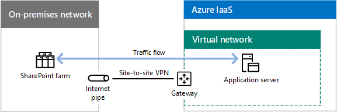

# ExpressRoute pour la connectivité au cloud de Microsoft

 **Résumé :** Comprendre comment ExpressRoute peut garantir des connexions plus fiables et plus rapides aux services et aux plateformes cloud de Microsoft.
  
ExpressRoute fournit une connexion réseau privée dédiée à haut débit au cloud Microsoft.
  
## ExpressRoute vers le cloud de Microsoft

Voici le chemin d’accès au réseau sur le cloud de Microsoft sans connexion ExpressRoute.
  
**Figure 1 : chemin de mise en réseau sans ExpressRoute**

  
La figure 1 présente le chemin d'accès standard entre un réseau local et le cloud de Microsoft. Le périmètre du réseau local se connecte à Internet via un lien WAN vers un fournisseur de services Internet. Ensuite, le trafic circule à travers Internet vers le périmètre cloud de Microsoft. Les offres de cloud au sein du cloud de Microsoft incluent Office 365, Microsoft Azure, Microsoft Intune et Dynamics 365. Les utilisateurs d'une organisation peuvent se trouver sur le réseau local ou sur Internet.
  
Sans une connexion ExpressRoute, la seule partie du chemin d’accès au trafic vers le cloud de Microsoft que vous pouvez contrôler (et ayant une relation avec le fournisseur de services) est le lien entre le périmètre du réseau local et votre fournisseur de services Internet. 
  
Le chemin d’accès entre votre fournisseur de services Internet et le périmètre du cloud de Microsoft représente le système de remise optimal sur Internet soumis à des interruptions, à des congestions du trafic et à la surveillance par des utilisateurs malveillants.
  
Les utilisateurs sur Internet, tels que les utilisateurs itinérants ou distants, envoient leur trafic vers le cloud de Microsoft via Internet.
  
Voici les chemins d’accès au réseau vers le cloud de Microsoft avec une connexion ExpressRoute.
  
**Figure 2 : chemins de mise en réseau avec ExpressRoute**

  
La figure 2 présente deux chemins d’accès au réseau. Le trafic vers Microsoft Intune utilise le même chemin que le trafic Internet normal. Le trafic vers Office 365, Microsoft Azure et Dynamics  365 circule à travers la connexion ExpressRoute, un chemin d’accès dédié entre le périmètre du réseau local et le périmètre du cloud Microsoft.
  
Avec une connexion ExpressRoute, vous pouvez désormais ont un contrôle, via une relation avec votre fournisseur de services, sur le chemin d’accès du trafic entière à partir de votre serveur edge Microsoft cloud edge. Cette connexion peut offrir des performances prévisibles et un [SLA de disponibilité 99,95 %](https://azure.microsoft.com/support/legal/sla/expressroute/v1_3/).
  
Vous pouvez maintenant compter sur un débit et une latence prévisibles, en fonction de la connexion de votre fournisseur de services, pour les services Office 365, Azure et Dynamics 365. Les connexions ExpressRoute à Microsoft Intune ne sont pas prises en charge pour l’instant.
  
Le trafic transmis par la connexion ExpressRoute n’est plus soumis aux interruptions Internet, aux congestions du trafic et à la surveillance.
  
Les utilisateurs sur Internet, tels que les utilisateurs itinérants ou distants, envoient toujours leur le trafic vers le cloud de Microsoft via Internet. Une exception existe pour le trafic vers une ligne intranet d’une application métier hébergée dans Azure IaaS, qui est transmis par la connexion ExpressRoute via une connexion d’accès à distance au réseau local.
  
Même avec une connexion ExpressRoute, le trafic est toujours transmis par Internet, comme les requêtes DNS, la vérification de la liste de révocation de certificats et les demandes de réseau de distribution de contenu (CDN).
  
Consultez les ressources supplémentaires suivantes pour plus d’informations :
  
- [ExpressRoute pour Office 365](https://aka.ms/expressrouteoffice365)
    
- [ExpressRoute pour Azure](https://azure.microsoft.com/services/expressroute/)
    
## Avantages d’ExpressRoute pour Azure

Voici quelques avantages liés à l’utilisation des services cloud basés sur ExpressRoute pour Azure :
  
- **Performances prévisibles :** Avec un chemin d'accès dédié vers le périmètre du cloud de Microsoft, vos performances ne sont pas soumises aux interruptions du fournisseur Internet et aux pics du trafic Internet. Vous pouvez déterminer un SLA concernant le débit et la latence vers le cloud de Microsoft dont vos fournisseurs seront tenus responsables.
    
- **Confidentialité des données de votre trafic :** Le trafic transmis via votre connexion ExpressRoute dédiée n'est pas soumis à la surveillance Internet ou à la capture de paquet et à l'analyse par des utilisateurs malveillants. Il est aussi sécurisé que les liens WAN basés sur la fonctionnalité MPLS (Multiprotocol Label Switching).
    
- **Connexions à haut débit :** Avec l'importante prise en charge des connexions ExpressRoute par les fournisseurs d'échange et les fournisseurs de services de réseau, vous pouvez obtenir un lien de 10 Gbits/s au maximum dans le cloud de Microsoft.
    
- **Coût moins élevé pour certaines configurations :** Bien que les connexions ExpressRoute représentent un coût supplémentaire, dans certains cas, une seule connexion ExpressRoute peut constituer un coût moins élevé que l'augmentation de votre capacité Internet dans plusieurs emplacements de votre organisation afin de fournir un débit suffisant pour les services cloud de Microsoft.
    
Une connexion ExpressRoute ne garantit pas de meilleures performances dans chaque configuration. Il est possible d’avoir des performances inférieures en utilisant une connexion ExpressRoute avec une faible bande passante au lieu d’une connexion Internet avec une bande passante élevée qui se trouve seulement à quelques sauts d’un centre de données Microsoft régional.
  
Pour obtenir les dernières recommandations sur l'utilisation d'ExpressRoute avec Office 365, voir [ExpressRoute pour Office 365](https://support.office.com/article/Azure-ExpressRoute-for-Office-365-6d2534a2-c19c-4a99-be5e-33a0cee5d3bd).
  
## Modèles de connectivité ExpressRoute

Le tableau 1 affiche les trois principaux modèles de connectivité pour les connexions ExpressRoute.
  
|**Même emplacement au niveau d'un échange de cloud**|**Ethernet de point à point**|**Connectivité complète (IP VPN)**|
|:-----|:-----|:-----|
||||
|Si votre centre de données se trouve au même emplacement dans une installation comprenant un échange de cloud, vous pouvez organiser une connexion croisée virtuelle au cloud de Microsoft via l’échange Ethernet du fournisseur de la colocalisation.    |Si votre centre de données se trouve sur votre site, vous pouvez utiliser une liaison Ethernet de point à point pour vous connecter au cloud de Microsoft.    |Si vous utilisez déjà un fournisseur IP VPN (MPLS) pour connecter les sites de votre organisation, une connexion ExpressRoute au cloud de Microsoft fonctionnera comme un autre emplacement sur votre réseau étendu privé.    |
   
 **Tableau 1 : Modèles de connectivité ExpressRoute**
  
## Relations d’homologation ExpressRoute avec les services cloud de Microsoft

Une seule connexion ExpressRoute prend en charge jusqu'à deux relations homologation protocole BGP (Border Gateway) différentes pour différents composants du cloud Microsoft. BPG utilise les relations homologation pour établir l’approbation et échanger des informations de routage.
  
**La figure 3 : Les deux différentes BGP relations dans une seule connexion ExpressRoute**

  
La figure 3 illustre une connexion ExpressRoute à partir d’un réseau local. La connexion ExpressRoute a deux relations homologation logiques. Une relation d’homologation Microsoft accède aux services Microsoft SaaS, y compris les services Office 365 et Azure PaaS 365 Dynamcs. Une relation d’homologation privée passe à Azure IaaS et une passerelle de réseau virtuel qui héberge des ordinateurs virtuels.
  
Relation BGP d’homologation de Microsoft : 
  
- Provient d’un routeur de votre zone DMZ aux adresses publics des services Azure, Dynamics 365 et Office 365. 
    
- Prend en charge la communication initiée de manière bidirectionnelle.
    
Relation BGP d’homologation privée :
  
- Provient d’un routeur situé sur le périmètre du réseau de votre organisation et se dirige vers les adresses IP privées attribuées à Azure VNets.
    
- Prend en charge la communication initiée de manière bidirectionnelle.
    
- Est une extension du réseau de votre organisation vers le cloud de Microsoft, comprenant un adressage et un routage cohérents en interne.

>[!Note]
>La relation BGP homologation publique décrite dans les versions précédentes de cet article a été abandonnée.
>
    
## Exemple de déploiement d’application et de flux de trafic avec ExpressRoute

La manière dont le trafic circule à travers les connexions ExpressRoute et au sein du cloud de Microsoft est une fonction des itinéraires au niveau des sauts du chemin d’accès entre la source et la destination et le comportement de l’application. Voici un exemple d’application en cours d’exécution sur une machine virtuelle Azure qui accède à une batterie de serveurs SharePoint locale sur une connexion VPN de site à site.
  
**Figure 4 : application sur une machine virtuelle Azure accédant à une batterie de serveurs SharePoint locale**

  
La figure 4 montre une batterie de serveurs SharePoint locale, une connexion VPN de site à site entre le réseau local et un réseau virtuel dans Azure IaaS, un serveur d’applications exécuté en tant que machine virtuelle Azure IaaS et le flux de trafic entre le serveur d’applications et la batterie de serveurs SharePoint.
  
L’application localise l’adresse IP de la batterie de serveurs SharePoint à l’aide du DNS local et tout le trafic bascule sur la connexion VPN de site à site.
  
Cette organisation a migré sa batterie de serveurs SharePoint locale vers SharePoint Online dans Office 365 et a déployé une connexion ExpressRoute.
  
**Figure 5 : Déplacement de la batterie de serveurs SharePoint locale vers SharePoint Online**

  
La figure 5 indique l’ajout d’une connexion ExpressRoute avec des relations d’homologation à Microsoft SaaS, à Office 365 et à Azure IaaS contenant le serveur d’applications sur un réseau virtuel. La batterie de serveurs SharePoint locale a été migrée vers Office 365.
  
Avec les relations d’homologation privées et de Microsoft, procédez comme suit :
  
- À partir de la passerelle de réseau virtuel Azure, les emplacements locaux sont disponibles sur la connexion ExpressRoute.
    
- À partir de l’abonnement à Office 365, les adresses IP publiques des périphériques de périmètre, tels que les serveurs proxy, sont disponibles sur la connexion ExpressRoute.
    
- À partir du périmètre du réseau local, les adresses IP privées d’Azure VNet et les adresses IP publiques d’Office 365 sont disponibles sur la connexion ExpressRoute.
    
Lorsque l’application accède aux URL de SharePoint Online, elle transfère son trafic sur la connexion ExpressRoute à un serveur proxy du périmètre. 
  
Lorsque le serveur proxy localise l’adresse IP de SharePoint Online, il transfère à nouveau le trafic sur la connexion ExpressRoute. Le trafic de réponse utilise le chemin d’accès inverse.
  
**Figure 6 flux de trafic lorsque la batterie de serveurs SharePoint a été migrée vers SharePoint Online dans Office 365**

  
La figure 6 indique comment le trafic entre le serveur d'applications et SharePoint Online dans Office 365 circule sur la relation d'homologation privée à partir du serveur d'applications vers le périmètre du réseau local, puis à partir du périmètre sur la relation d'homologation Microsoft vers Office 365.
  
Le résultat est un branchement en épingle en raison du routage et du comportement de l’application.
  
## ExpressRoute et réseau cloud de Microsoft

Les connexions ExpressRoute sont disponibles dans deux versions différentes : ExpressRoute et ExpressRoute Premium.
  
### ExpressRoute

La manière dont le trafic se déplace entre le réseau de votre organisation et un centre de données Microsoft constitue une combinaison des éléments suivants :
  
- Vos emplacements.
    
- Emplacements d’homologation cloud de Microsoft (emplacements physiques pour se connecter au périmètre de Microsoft).
    
- Emplacements du centre de données Microsoft.
    
Le centre de données Microsoft et les emplacements d’homologation cloud sont tous connectés au réseau cloud de Microsoft.
  
Lorsque vous créez une connexion ExpressRoute vers un emplacement d'homologation cloud de Microsoft, vous êtes connecté au réseau cloud de Microsoft et à tous les emplacements de centre de données Microsoft sur le même continent. Le trafic entre l'emplacement d'homologation cloud et le centre de données Microsoft de destination est exécuté sur le réseau cloud de Microsoft.
  
Cela peut entraîner une remise non optimale dans les centres de données Microsoft locaux pour le modèle de connectivité complète.
  
**La figure 7 : Exemple d’une organisation qui utilise une seule connexion ExpressRoute géographiquement**

  
La figure 7 illustre une organisation avec deux emplacements : l’emplacement 1 est situé dans le nord-ouest des États-Unis et l’emplacement 2 dans le nord-est du pays. Ils sont connectés par un fournisseur de réseau étendu complet. Cette organisation possède également une connexion ExpressRoute vers un emplacement d’homologation Microsoft sur la côte ouest. Le trafic de l’emplacement 2 dans le nord-est destiné à un centre de données de la côte est doit emprunter l’ensemble du réseau étendu de l’organisation jusqu’à la côte ouest où se trouve l’emplacement d’homologation Microsoft, puis traverser le pays sur le réseau cloud de Microsoft pour revenir au centre de données de la côte est.
  
Pour une remise optimale, utilisez plusieurs connexions ExpressRoute aux emplacements d’homologation cloud de Microsoft régionaux. 
  
**Figure 8 : Utilisation de plusieurs connexions ExpressRoute pour un transfert optimal vers les centres de données régionaux**

  
La figure 8 montre la même organisation avec deux connexions ExpressRoute, une pour chaque emplacement, à des emplacements d'homologation Microsoft locaux à l'échelle de la région. Dans cette configuration, le trafic de l'emplacement 2 dans le nord-est destiné à un centre de données de la côte est accède directement à un emplacement d'homologation de la côte est, au réseau cloud de Microsoft, puis au centre de données de la côte est.
  
Plusieurs connexions ExpressRoute peuvent fournir les résultats suivants :
  
- Meilleures performances pour les emplacements de centre de données Microsoft locaux à l’échelle de la région.
    
- Disponibilité accrue dans le Microsoft Cloud lorsqu’une connexion ExpressRoute locale n’est plus disponible.
    
Cela fonctionne bien pour les organisations situées sur le même continent. Toutefois, le trafic vers les centres de données Microsoft à l'extérieur du continent de l'organisation utilise Internet.
  
Pour le trafic intercontinental sur le réseau cloud de Microsoft, vous devez utiliser des connexions ExpressRoute Premium.
  
### ExpressRoute Premium

Pour les organisations qui sont dispersées mondialement sur tous les continents, vous pouvez utiliser ExpressRoute Premium. 
  
Avec ExpressRoute Premium, vous pouvez atteindre tous les centres de données Microsoft sur tous les continents à partir de n’importe quel emplacement d’homologation Microsoft situé sur un des continents. Le trafic entre les continents est réalisé sur le réseau cloud de Microsoft.
  
Avec plusieurs connexions ExpressRoute Premium, vous pouvez avoir les résultats suivants :
  
- Meilleures performances pour les centres de données Microsoft locaux à l’échelle des continents.
    
- Disponibilité accrue dans le Microsoft Cloud global lorsqu’une connexion ExpressRoute locale n’est plus disponible.
    
ExpressRoute Premium est requis pour les connexions ExpressRoute basée sur Office 365.
  
**Figure 9 : Réseau cloud mondial de Microsoft**

  
La figure 9 représente un diagramme logique du réseau cloud mondial de Microsoft, avec des réseaux qui couvrent les continents et les régions du monde entier et leurs interconnexions. Avec une partie du réseau cloud de Microsoft sur chaque continent, une entreprise présente à l’échelle mondiale crée des connexions ExpressRoute Premium aux emplacements d’homologation Microsoft locaux à partir de ses bureaux régionaux.
  
Pour un bureau régional, attribuez le trafic Office 365 aux centres de données suivants :
  
- Les centres de données Office 365 continentaux utilisent le réseau cloud Microsoft du continent.
    
- Les centres de données Office 365 sur un autre continent utilisent sur le réseau cloud de Microsoft intercontinental.
    
Pour plus d'informations, voir :
  
- [Azure ExpressRoute for Office 365 Training](https://channel9.msdn.com/series/aer/)
    
- [Planification réseau et optimisation des performances pour Office 365](https://aka.ms/tune)
    
- [Gestion des performances Office 365](https://mva.microsoft.com/en-US/training-courses/office-365-performance-management-8416)
    
## Options ExpressRoute

Vous pouvez également intégrer les options suivantes dans votre déploiement ExpressRoute :
  
- **Sécurité au niveau de votre périmètre :** pour fournir une sécurité avancée pour le trafic envoyé et reçu via la connexion ExpressRoute, comme l'inspection du trafic ou la détection des intrusions/programmes malveillants, placez vos appliances de sécurité dans le chemin d'accès au trafic au sein de la zone DMZ ou à la bordure de votre intranet.
    
- **Le trafic Internet pour les ordinateurs virtuels :** Pour empêcher les machines virtuelles Azure de lancer le trafic directement sur Internet, publier l’itinéraire par défaut à Microsoft. Le trafic vers Internet est routé via la connexion ExpressRoute et par le biais de vos serveurs de proxy locale. Le trafic entre les machines virtuelles Azure et services Azure PaaS ou Office 365 est routé via la connexion ExpressRoute.
    
- **Optimiseurs de réseau étendu :** Vous pouvez déployer des optimiseurs de réseau étendu sur les deux côtés d'une connexion d'homologation privée pour un réseau virtuel (VNet) Azure entre différents locaux. À l'intérieur du réseau virtuel Azure, utilisez une appliance de réseau d'optimiseur de réseau étendu à partir d'Azure Marketplace et un routage défini par l'utilisateur pour router le trafic via l'équipement.
    
- **Qualité de service :** Utilisez des valeurs DSCP (Differentiated Services Code Point) dans l'en-tête IPv4 de votre trafic afin de le marquer pour remise vocale, vidéo/interactive ou optimale. Ceci est particulièrement important pour la relation d'homologation Microsoft et le trafic Skype Entreprise Online.
    
Consultez les ressources supplémentaires suivantes pour plus d’informations :
  
- [ExpressRoute pour Office 365](https://aka.ms/expressrouteoffice365)
    
- [Azure ExpressRoute for Office 365 Training](https://channel9.msdn.com/series/aer/)
    
- [ExpressRoute pour Azure](https://azure.microsoft.com/services/expressroute/)
    
## Étape suivante

[Conception de réseaux pour Microsoft SaaS](designing-networking-for-microsoft-saas.md)

## Voir aussi

[Mise en réseau cloud Microsoft pour les architectes d’entreprise](microsoft-cloud-networking-for-enterprise-architects.md)
  
[Ressources relatives à l’architecture informatique du cloud Microsoft](microsoft-cloud-it-architecture-resources.md)

