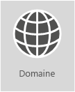

# <a name="external-domain-name-system-records-for-office-365"></a><span data-ttu-id="723c8-103">Enregistrements DNS externes pour Office 365</span><span class="sxs-lookup"><span data-stu-id="723c8-103">Reference: External Domain Name System records for Office 365</span></span>

 <span data-ttu-id="723c8-104">**Résumé :** liste de références des enregistrements DNS à utiliser lorsque vous planifiez un déploiement d’Office 365.</span><span class="sxs-lookup"><span data-stu-id="723c8-104">Summary: Reference list of DNS records to use when planning an intricate  O365_W14_2nd deployment.</span></span>
  
|||
|:-----|:-----|
||<span data-ttu-id="723c8-p101">**Vous voulez afficher une liste personnalisée des enregistrements DNS pour votre organisation Office 365 ? ** Vous pouvez [trouver ici les informations nécessaires pour créer des enregistrements DNS Office 365](https://support.office.microsoft.com/fr-FR/article/Gather-the-information-you-need-to-create-Office-365-DNS-records-77f90d4a-dc7f-4f09-8972-c1b03ea85a67) pour votre domaine dans Office 365.  </span><span class="sxs-lookup"><span data-stu-id="723c8-p101">**Want to see a customized list of DNS records for your Office 365 organization?** You can [find the info you need to create Office 365 DNS records](https://support.office.microsoft.com/fr-FR/article/Gather-the-information-you-need-to-create-Office-365-DNS-records-77f90d4a-dc7f-4f09-8972-c1b03ea85a67) for your domain in Office 365.  </span></span><br/> <span data-ttu-id="723c8-p102">**Avez besoin d’aide détaillée pour ajouter ces enregistrements  sur le DNS de l’hébergeur de votre domaine, tel que GoDaddy ou eNom ?** [Vous trouverez des liens vers des instructions détaillées pour plusieurs hôtes DNS](https://go.microsoft.com/fwlink/?LinkId=286745).</span><span class="sxs-lookup"><span data-stu-id="723c8-p102">**Need step-by-step help to add these records at your domain's DNS host, such as GoDaddy or eNom?** [Find links to step-by-step instructions for many popular DNS hosts](https://go.microsoft.com/fwlink/?LinkId=286745).  </span></span><br/> <span data-ttu-id="723c8-110">**Retournez sur **[ planification réseau et optimisation des performances pour Office 365](https://aka.ms/tune).</span><span class="sxs-lookup"><span data-stu-id="723c8-110">Network planning and performance tuning for Office 365</span></span>  <br/> |

 <span data-ttu-id="723c8-p103">**Vous souhaitez utiliser la liste de référence pour votre  déploiement personnalisé ?** La liste ci-dessous peut être utilisée comme référence pour votre déploiement Office 365 personnalisé. Vous devrez sélectionner les enregistrements qui s’appliquent à votre organisation et renseigner les valeurs appropriées.</span><span class="sxs-lookup"><span data-stu-id="723c8-p103">Sticking around to use the reference list for your own custom deployment? The below list should be used as a reference for your custom O365_W14_2nd deployment. You will need to select which records apply to your organization and fill in the appropriate values.</span></span>
  
<span data-ttu-id="723c8-p104">Les enregistrements SPF et MX sont souvent les plus difficiles à comprendre. Nous avons mis à jour les instructions concernant les enregistrements SPF à la fin de cet article. Il est important de ne pas oublier que *vous ne pouvez avoir qu’un seul enregistrement SPF pour votre domaine*. Vous pouvez avoir plusieurs enregistrements MX ; toutefois, c’est souvent ce qui entraîne des problèmes de remise de messages. L’utilisation d’un enregistrement MX unique qui dirige le courrier électronique vers un seul système de messagerie supprime un grand nombre de ces problèmes potentiels.</span><span class="sxs-lookup"><span data-stu-id="723c8-p104">Often the SPF and MX records are the hardest to figure out. We’ve updated our SPF records guidance at the end of this article. The important thing to remember is that you can only have a single SPF record for your domain. You can have multiple MX records; however, that often is what causes problems for mail delivery. Having a single MX record that directs email to one mail system removes many of those potential problems.</span></span>
  
<span data-ttu-id="723c8-p105">Les sections ci-dessous sont organisées par service dans Office 365. Pour afficher une liste personnalisée des enregistrements DNS Office 365 pour votre domaine, connectez-vous à Office 365 pour [recueillir les informations nécessaires pour créer des enregistrements DNS Office 365](https://support.office.com/article/77f90d4a-dc7f-4f09-8972-c1b03ea85a67).</span><span class="sxs-lookup"><span data-stu-id="723c8-p105">The sections below are organized by service in Office 365. If you want to see a customized list of DNS records for your Office 365 organization, check out the article  Gather the information you need to create Office 365 DNS records https://support.office.microsoft.com/article/Gather-the-information-you-need-to-create-Office-365-DNS-records-77f90d4a-dc7f-4f09-8972-c1b03ea85a67  .</span></span>
  
## <a name="external-dns-records-required-for-office-365-core-services"></a><span data-ttu-id="723c8-120">Enregistrements DNS externes requis pour Office 365 (services principaux) :</span><span class="sxs-lookup"><span data-stu-id="723c8-120">External DNS records required for Office 365 (core services):</span></span>
<span data-ttu-id="723c8-121"><a name="BKMK_ReqdCore"> </a></span><span class="sxs-lookup"><span data-stu-id="723c8-121"></span></span>

<span data-ttu-id="723c8-p106">Chaque client Office 365 doit ajouter deux enregistrements à son serveur DNS externe. Le premier enregistrement CNAME garantit que Office 365 peut diriger les stations de travail vers la plateforme d’identité appropriée. Le second enregistrement requis est un enregistrement qui sert à prouver que vous possédez votre nom de domaine.</span><span class="sxs-lookup"><span data-stu-id="723c8-p106">Every O365_W14_2nd customer needs to add two records to their external DNS. The first CNAME ensures O365_W14_2nd can direct workstations to the appropriate identity platform. The second record that is required is a record to prove you own your domain name.</span></span> 
  
||||
|:-----|:-----|:-----|
|<span data-ttu-id="723c8-125">**Enregistrement DNS**</span><span class="sxs-lookup"><span data-stu-id="723c8-125">**DNS record**</span></span> <br/> |<span data-ttu-id="723c8-126">**Objectif**</span><span class="sxs-lookup"><span data-stu-id="723c8-126">**Purpose**</span></span> <br/> |<span data-ttu-id="723c8-127">**Valeur à utiliser**</span><span class="sxs-lookup"><span data-stu-id="723c8-127">**Value to use**</span></span> <br/> |
|<span data-ttu-id="723c8-128">**CNAME**</span><span class="sxs-lookup"><span data-stu-id="723c8-128">**CNAME**</span></span> <br/> <span data-ttu-id="723c8-129">**(Suite)**</span><span class="sxs-lookup"><span data-stu-id="723c8-129">**(Suite)**</span></span> <br/> |<span data-ttu-id="723c8-p107">Utilisé par Office 365 pour l'authentification directe auprès de la plateforme d'identité correcte.[Plus d’informations](https://go.microsoft.com/fwlink/p/?LinkId=322005)</span><span class="sxs-lookup"><span data-stu-id="723c8-p107">Used by O365_W14_2nd to direct authentication to the correct identity platform  More Information http://go.microsoft.com/fwlink/?LinkId=322005 </span></span> <br/> [!NOTE]  <span data-ttu-id="723c8-132">Cette CNAME s’applique uniquement à Office 365 géré par 21Vianet.</span><span class="sxs-lookup"><span data-stu-id="723c8-132">This CNAME only applies to Office 365 operated by 21Vianet.</span></span>   |<span data-ttu-id="723c8-133">**Alias :** msoid</span><span class="sxs-lookup"><span data-stu-id="723c8-133">**Alias:** msoid</span></span>  <br/> <span data-ttu-id="723c8-134">**Cible :** clientconfig.microsoftonline-p.net</span><span class="sxs-lookup"><span data-stu-id="723c8-134">**Target:** clientconfig.microsoftonline-p.net</span></span>  <br/> |
|<span data-ttu-id="723c8-135">**TXT**</span><span class="sxs-lookup"><span data-stu-id="723c8-135">**txt**</span></span> <br/> <span data-ttu-id="723c8-136">**(Vérification du domaine)**</span><span class="sxs-lookup"><span data-stu-id="723c8-136">**(Domain verification)**</span></span> <br/> |<span data-ttu-id="723c8-p108">Utilisées par Office 365 uniquement ce vous êtes le propriétaire vérifier votre domaine. Il n’affecte aucun autre élément.</span><span class="sxs-lookup"><span data-stu-id="723c8-p108">Used by O365_W14_2nd to verify only that you own your domain. It doesn’t affect anything else.</span></span>  <br/> |<span data-ttu-id="723c8-139">**Hôte :** @ (ou de certains fournisseurs d’hébergement DNS, votre nom de domaine)</span><span class="sxs-lookup"><span data-stu-id="723c8-139">**Host:** @ (or, for some DNS hosting providers, your domain name)</span></span>  <br/> <span data-ttu-id="723c8-140">**Valeur TXT :** _une chaîne de texte fournie par_ Office 365</span><span class="sxs-lookup"><span data-stu-id="723c8-140">TXT Value: A text string provided by  O365_W14_2nd</span></span>  <br/> <span data-ttu-id="723c8-141">L’Assistant **Office 365**pour configurer un domaine fournit les valeurs à utiliser pour créer cet enregistrement.</span><span class="sxs-lookup"><span data-stu-id="723c8-141">The O365_W14_2nd Add a domain wizard provides the values that you use to create this record.</span></span>  <br/> |

## <a name="external-dns-records-required-for-email-in-office-365-exchange-online"></a><span data-ttu-id="723c8-142">Enregistrements DNS externes requis pour la messagerie électronique dans Office 365 (Exchange Online)</span><span class="sxs-lookup"><span data-stu-id="723c8-142">External DNS records required for email in Office 365 (Exchange Online)</span></span>
<span data-ttu-id="723c8-143"><a name="BKMK_ReqdCore"> </a></span><span class="sxs-lookup"><span data-stu-id="723c8-143"></span></span>

<span data-ttu-id="723c8-p109">Emailing dans Office 365 nécessite plusieurs enregistrements. Les trois principaux que les clients doivent utiliser sont les enregistrements de découverte automatique, MX et SPF.</span><span class="sxs-lookup"><span data-stu-id="723c8-p109">MO_ExchangeOnline_2nd requires several different records, the three primary records that all customers should use are the Autodiscover, MX, & SPF records.</span></span>
  
- <span data-ttu-id="723c8-146">**L’enregistrement de découverte automatique **permet aux ordinateurs clients de rechercher automatiquement Exchange et de configurer correctement le client.</span><span class="sxs-lookup"><span data-stu-id="723c8-146">**The Autodiscover record** allows client computers to automatically find Exchange and configure the client properly.</span></span>

- <span data-ttu-id="723c8-p110">**L’enregistrement MX** indique aux autres systèmes de messagerie où envoyer un courrier électronique pour votre domaine.  *Lorsque vous transférez votre courrier électronique vers Office 365, en mettant à jour les enregistrement MX de votre domaine, tous les messages envoyés à ce domaine arriveront dans Office 365. * (Voulez-vous simplement faire passer quelques adresses de messagerie dans Office 365 ? Vous pouvez [piloter Office 365 avec quelques adresses de messagerie sur votre domaine personnalisé](https://support.office.com/article/39cee536-6a03-40cf-b9c1-f301bb6001d7).)</span><span class="sxs-lookup"><span data-stu-id="723c8-p110">**The MX record** tells other mail systems where to send email for your domain.  *When you change your email to Office 365, by updating your domain's MX record, ALL email sent to that domain will start coming to Office 365.*  (Do you just want to switch a few email addresses to Office 365? You can [Pilot Office 365 with a few email addresses on your custom domain](https://support.office.com/article/39cee536-6a03-40cf-b9c1-f301bb6001d7).)</span></span>

- <span data-ttu-id="723c8-p111">**L’enregistrement TXT pour SPF** est utilisé par les systèmes de messagerie du destinataire pour valider que vous approuvez le serveur d’envoi de votre message. Cela permet d’éviter les problèmes tels que l’usurpation d’identité et le hameçonnage de messagerie. Voir les [enregistrements DNS externes requis pour SPF](external-domain-name-system-records.md#BKMK_SPFrecords) dans cet article d’aide pour comprendre ce que vous incluez dans votre enregistrement.</span><span class="sxs-lookup"><span data-stu-id="723c8-p111">**The TXT record for SPF** is used by recipient email systems to validate that the server sending your email is one that you approve. This helps prevent problems like email spoofing and phishing. See the [External DNS records required for SPF](external-domain-name-system-records.md#BKMK_SPFrecords) in this article for help understanding what to include in your record.</span></span>

<span data-ttu-id="723c8-154">Les clients email qui utilisent la fédération Exchange auront un enregistrement CNAME et TXT supplémentaire en bas de tableau.</span><span class="sxs-lookup"><span data-stu-id="723c8-154">MO_ExchangeOnline_2nd customers who are using Exchange Federation will also have an additional CNAME and TXT record listed at the bottom of the table.</span></span>
  
||||
|:-----|:-----|:-----|
|<span data-ttu-id="723c8-155">**Enregistrement DNS**</span><span class="sxs-lookup"><span data-stu-id="723c8-155">**DNS record**</span></span> <br/> |<span data-ttu-id="723c8-156">**Objectif**</span><span class="sxs-lookup"><span data-stu-id="723c8-156">**Purpose**</span></span> <br/> |<span data-ttu-id="723c8-157">**Valeur à utiliser**</span><span class="sxs-lookup"><span data-stu-id="723c8-157">**Value to use**</span></span> <br/> |
|<span data-ttu-id="723c8-158">**CNAME**</span><span class="sxs-lookup"><span data-stu-id="723c8-158">**CNAME**</span></span> <br/> <span data-ttu-id="723c8-159">**(Exchange Online)**</span><span class="sxs-lookup"><span data-stu-id="723c8-159">**Exchange Online**</span></span> <br/> |<span data-ttu-id="723c8-p112">Aide les clients Outlook à se connecter facilement au service Exchange Online en utilisant le service de découverte automatique. La découverte automatique trouve automatiquement l’hôte Exchange Server approprié et configure Outlook pour les utilisateurs.</span><span class="sxs-lookup"><span data-stu-id="723c8-p112">Helps Outlook  clients to easily connect to the MO_ExchangeOnline_2nd service by using the Autodiscover service. Autodiscover automatically finds the correct Exchange Server host and configures Outlook for users.</span></span>  <br/> |<span data-ttu-id="723c8-162">**Alias :** autodiscover</span><span class="sxs-lookup"><span data-stu-id="723c8-162">**Alias:** autodiscover</span></span>  <br/> <span data-ttu-id="723c8-163">**Cible :** autodiscover.outlook.com</span><span class="sxs-lookup"><span data-stu-id="723c8-163">**Target:** autodiscover.outlook.com</span></span>  <br/> |
|<span data-ttu-id="723c8-164">**MX**</span><span class="sxs-lookup"><span data-stu-id="723c8-164">**MX**</span></span> <br/> <span data-ttu-id="723c8-165">**(Exchange Online)**</span><span class="sxs-lookup"><span data-stu-id="723c8-165">**Exchange Online**</span></span> <br/> |<span data-ttu-id="723c8-166">Envoie le courrier entrant pour votre domaine vers le service Exchange Online dans Office 365.</span><span class="sxs-lookup"><span data-stu-id="723c8-166">Sends incoming mail for your domain to the MO_ExchangeOnline_2nd service in O365_W14_2nd.</span></span>  <br/> [!NOTE] <span data-ttu-id="723c8-167">Une fois le courrier électronique envoyé vers Exchange Online, vous devez supprimer les enregistrements MX qui pointent vers votre ancien système.</span><span class="sxs-lookup"><span data-stu-id="723c8-167">Once email is flowing to Exchange Online, you should remove the MX records that are pointing to your old system.</span></span>   |<span data-ttu-id="723c8-168">**Domaine :** par exemple, contoso.com</span><span class="sxs-lookup"><span data-stu-id="723c8-168">Domain (for example, contoso.com)</span></span>  <br/> <span data-ttu-id="723c8-169">**Serveur de courrier cible :**\<jeton MX\>. mail.protection.outlook.com</span><span class="sxs-lookup"><span data-stu-id="723c8-169">**Target email server:**\<MX token\>.mail.protection.outlook.com</span></span>  <br/> <span data-ttu-id="723c8-170">**Préférence/priorité :** inférieur à d’autres enregistrements MX (Cela garantit que le courrier est remis à Exchange Online) : par exemple, 1 ou 'faible'</span><span class="sxs-lookup"><span data-stu-id="723c8-170">**Preference/Priority:** lower than any other MX records (this ensures mail is delivered to Exchange Online) - for example 1 or 'low'</span></span>  <br/>  <span data-ttu-id="723c8-171">Trouver votre \<jeton MX\> en procédant comme suit :</span><span class="sxs-lookup"><span data-stu-id="723c8-171">Find your <MX token> by following these steps:</span></span>  <br/>  <span data-ttu-id="723c8-172">Connectez-vous à Office 365, accédez à administrateur Office 365 \> domaines.</span><span class="sxs-lookup"><span data-stu-id="723c8-172">Sign in to Office 365, go to Office 365 admin \> Domains.</span></span>  <br/>  <span data-ttu-id="723c8-173">Dans la colonne Action pour votre domaine, sélectionnez Corriger les problèmes.</span><span class="sxs-lookup"><span data-stu-id="723c8-173">In the Action column for your domain, choose Fix issues.</span></span>  <br/>  <span data-ttu-id="723c8-174">Dans la section Enregistrements MX, choisissez Que dois-je corriger ?</span><span class="sxs-lookup"><span data-stu-id="723c8-174">In the MX records section, choose What do I fix?</span></span>  <br/>  <span data-ttu-id="723c8-175">Suivez les instructions de cette page pour mettre à jour votre enregistrement MX.</span><span class="sxs-lookup"><span data-stu-id="723c8-175">Follow the directions on this page to update your MX record.</span></span>  <br/> [<span data-ttu-id="723c8-176">Quelle est la priorité MX ?</span><span class="sxs-lookup"><span data-stu-id="723c8-176">What is MX priority?</span></span>](https://go.microsoft.com/fwlink/p/?LinkId=396471) <br/> |
|<span data-ttu-id="723c8-177">**SPF (TXT)**</span><span class="sxs-lookup"><span data-stu-id="723c8-177">**SPF (TXT)**</span></span> <br/> <span data-ttu-id="723c8-178">(Exchange Online)</span><span class="sxs-lookup"><span data-stu-id="723c8-178">Exchange Online</span></span>  <br/> |<span data-ttu-id="723c8-p113">Aide à empêcher d'autres personnes d'utiliser votre domaine pour envoyer des messages indésirables ou malveillants. Les enregistrements SPF fonctionnent en identifiant les serveurs autorisés à envoyer des messages à partir de votre domaine.</span><span class="sxs-lookup"><span data-stu-id="723c8-p113">Helps to prevent other people from using your domain to send spam or other malicious email. Sender policy framework (SPF) records work by identifying the servers that are authorized to send email from your domain.</span></span>  <br/> |[<span data-ttu-id="723c8-181">Enregistrements DNS externes requis pour SPF</span><span class="sxs-lookup"><span data-stu-id="723c8-181">External DNS records required for SPF</span></span>](external-domain-name-system-records.md#BKMK_SPFrecords) <br/> |
|<span data-ttu-id="723c8-182">**TXT**</span><span class="sxs-lookup"><span data-stu-id="723c8-182">**txt**</span></span> <br/> <span data-ttu-id="723c8-183">**(Fédération Exchange)**</span><span class="sxs-lookup"><span data-stu-id="723c8-183">**(Exchange federation)**</span></span> <br/> |<span data-ttu-id="723c8-184">Utilisé pour la fédération Exchange en cas de déploiement hybride.</span><span class="sxs-lookup"><span data-stu-id="723c8-184">Used for Exchange federation for hybrid deployment.</span></span>  <br/> |<span data-ttu-id="723c8-185">**Enregistrement TXT 1 :** par exemple, contoso.com et texte associé personnalisé, texte de hachage de vérification de domaine associé généré de façon personnalisée (par exemple, Y96nu89138789315669824)</span><span class="sxs-lookup"><span data-stu-id="723c8-185">**TXT record 1:** For example, contoso.com and associated custom-generated, domain-proof hash text (for example, Y96nu89138789315669824)</span></span>  <br/> <span data-ttu-id="723c8-186">**Enregistrement TXT 2 :** par exemple, exchangedelegation.contoso.com et le texte de hachage de vérification de domaine associé personnalisé (par exemple, Y3259071352452626169)</span><span class="sxs-lookup"><span data-stu-id="723c8-186">**TXT record 2:** For example, exchangedelegation.contoso.com and associated custom-generated, domain-proof hash text (for example, Y3259071352452626169)</span></span>  <br/> |
|<span data-ttu-id="723c8-187">**CNAME**</span><span class="sxs-lookup"><span data-stu-id="723c8-187">**CNAME**</span></span> <br/> <span data-ttu-id="723c8-188">** (Fédération exchange) **</span><span class="sxs-lookup"><span data-stu-id="723c8-188">** (Exchange federation) **</span></span> <br/> |<span data-ttu-id="723c8-p114">Aide les clients Outlook à se connecter facilement au service Exchange Online en utilisant le service de découverte automatique quand votre société utilise la fédération Exchange. La découverte automatique trouve automatiquement l’hôte Exchange Server approprié et configure Outlook pour vos utilisateurs.</span><span class="sxs-lookup"><span data-stu-id="723c8-p114">Helps Outlook clients to easily connect to the ExchOnline service by using the Autodiscover service when your company is using Exchange federation. Autodiscover automatically finds the correct Exchange Server host and configures Outlook for your users.</span></span>  <br/> |<span data-ttu-id="723c8-191">**Alias :** par exemple, Autodiscover.service.contoso.com</span><span class="sxs-lookup"><span data-stu-id="723c8-191">**Alias:** For example, Autodiscover.service.contoso.com</span></span>  <br/> <span data-ttu-id="723c8-192">**Cible :** autodiscover.outlook.com</span><span class="sxs-lookup"><span data-stu-id="723c8-192">**Target:** autodiscover.outlook.com</span></span>  <br/> |

## <a name="external-dns-records-required-for-skype-for-business-online"></a><span data-ttu-id="723c8-193">Enregistrements DNS externes requis pour Skype Entreprise Online</span><span class="sxs-lookup"><span data-stu-id="723c8-193">External DNS records required for Skype for Business Online</span></span>
<span data-ttu-id="723c8-194"><a name="BKMK_ReqdCore"> </a></span><span class="sxs-lookup"><span data-stu-id="723c8-194"></span></span>

<span data-ttu-id="723c8-195">Il existe des étapes spécifiques à suivre lorsque vous [plages d’adresses IP et URL Office 365](https://support.office.com/article/8548a211-3fe7-47cb-abb1-355ea5aa88a2#BKMK_LYO) pour vous assurer que votre réseau configuré correctement.</span><span class="sxs-lookup"><span data-stu-id="723c8-195">There are specific steps to take when you [Office 365 URLs and IP address ranges](https://support.office.com/article/8548a211-3fe7-47cb-abb1-355ea5aa88a2#BKMK_LYO) to make sure your network configured correctly.</span></span>
  
||||
|:-----|:-----|:-----|
|<span data-ttu-id="723c8-196">**Enregistrement DNS**</span><span class="sxs-lookup"><span data-stu-id="723c8-196">**DNS record**</span></span> <br/> |<span data-ttu-id="723c8-197">**Objectif**</span><span class="sxs-lookup"><span data-stu-id="723c8-197">**Purpose**</span></span> <br/> |<span data-ttu-id="723c8-198">**Valeur à utiliser**</span><span class="sxs-lookup"><span data-stu-id="723c8-198">**Value to use**</span></span> <br/> |
|<span data-ttu-id="723c8-199">**SRV**</span><span class="sxs-lookup"><span data-stu-id="723c8-199">**SRV**</span></span> <br/> <span data-ttu-id="723c8-200">**(Skype Entreprise Online)**</span><span class="sxs-lookup"><span data-stu-id="723c8-200">**Skype for Business Online**</span></span> <br/> |<span data-ttu-id="723c8-p115">Permet à votre domaine Office 365 de partager des fonctionnalités (MI) messagerie instantanée avec des clients externes en activant la fédération SIP. En savoir plus sur [URL Office 365 et plages d’adresses](https://support.office.com/article/8548a211-3fe7-47cb-abb1-355ea5aa88a2#BKMK_LYO).  </span><span class="sxs-lookup"><span data-stu-id="723c8-p115">Allows your Office 365 domain to share instant messaging (IM) features with external clients by enabling SIP federation. Read more about [Office 365 URLs and IP address ranges](https://support.office.com/article/8548a211-3fe7-47cb-abb1-355ea5aa88a2#BKMK_LYO).  </span></span><br/> |<span data-ttu-id="723c8-203">**Service :**_sipfederationtls</span><span class="sxs-lookup"><span data-stu-id="723c8-203">**Service:**_sipfederationtls</span></span>  <br/> <span data-ttu-id="723c8-204">**Protocole :** _TCP</span><span class="sxs-lookup"><span data-stu-id="723c8-204">Protocol: ._tcp</span></span>  <br/> <span data-ttu-id="723c8-205">**Priorité :** 100</span><span class="sxs-lookup"><span data-stu-id="723c8-205">**Priority:** 100</span></span>  <br/> <span data-ttu-id="723c8-206">**Poids :** 1</span><span class="sxs-lookup"><span data-stu-id="723c8-206">**Weight:** 1</span></span>  <br/> <span data-ttu-id="723c8-207">**Port :** 5061</span><span class="sxs-lookup"><span data-stu-id="723c8-207">**Port:** 5061</span></span>  <br/> <span data-ttu-id="723c8-208">**Cible :** Sipfed.online.lync.com</span><span class="sxs-lookup"><span data-stu-id="723c8-208">**Target:** Sipfed.online.lync.com</span></span>  <br/> <span data-ttu-id="723c8-209">> [!NOTE]> Si le pare-feu ou le serveur proxy bloque les recherches SRV sur un DNS externe, vous devez ajouter cet enregistrement à l'enregistrement DNS interne.</span><span class="sxs-lookup"><span data-stu-id="723c8-209">If the firewall or proxy server blocks SRV lookups on an external DNS, you should add this record to the internal DNS record.</span></span>   |
|<span data-ttu-id="723c8-210">**SRV**</span><span class="sxs-lookup"><span data-stu-id="723c8-210">**SRV**</span></span> <br/> <span data-ttu-id="723c8-211">**(Skype Entreprise Online)**</span><span class="sxs-lookup"><span data-stu-id="723c8-211">**Skype for Business Online**</span></span> <br/> |<span data-ttu-id="723c8-212">Utilisé par Skype Entreprise Online pour coordonner le flux d’informations entre des clients Lync.</span><span class="sxs-lookup"><span data-stu-id="723c8-212">Used by Microsoft_Lync_Online_2nd to coordinate the flow of information between Lync clients.</span></span>  <br/> |<span data-ttu-id="723c8-213">**Service :**_sip</span><span class="sxs-lookup"><span data-stu-id="723c8-213">**Service:**_sip</span></span>  <br/> <span data-ttu-id="723c8-214">**Protocole :**_TLS</span><span class="sxs-lookup"><span data-stu-id="723c8-214">**Protocol:**_TLS</span></span>  <br/> <span data-ttu-id="723c8-215">**Priorité :** 100</span><span class="sxs-lookup"><span data-stu-id="723c8-215">**Priority:** 100</span></span>  <br/> <span data-ttu-id="723c8-216">**Poids :** 1</span><span class="sxs-lookup"><span data-stu-id="723c8-216">**Weight:** 1</span></span>  <br/> <span data-ttu-id="723c8-217">**Port :**  443</span><span class="sxs-lookup"><span data-stu-id="723c8-217">**Port**   443</span></span>  <br/> <span data-ttu-id="723c8-218">**Cible :** sipdir.online.lync.com</span><span class="sxs-lookup"><span data-stu-id="723c8-218">**Target:** sipdir.online.lync.com</span></span>  <br/> |
|<span data-ttu-id="723c8-219">**CNAME**</span><span class="sxs-lookup"><span data-stu-id="723c8-219">**CNAME**</span></span> <br/> <span data-ttu-id="723c8-220">**(Skype Entreprise Online)**</span><span class="sxs-lookup"><span data-stu-id="723c8-220">**Skype for Business Online**</span></span> <br/> |<span data-ttu-id="723c8-221">Utilisé par le client Lync pour trouver le service Skype Entreprise Online et se connecter.</span><span class="sxs-lookup"><span data-stu-id="723c8-221">Used by the Lync client to help find the Microsoft_Lync_Online_2nd service and sign in.</span></span>  <br/> |<span data-ttu-id="723c8-222">**Alias :** sip</span><span class="sxs-lookup"><span data-stu-id="723c8-222">**Alias:** sip</span></span>  <br/> <span data-ttu-id="723c8-223">**Cible :** sipdir.online.lync.com</span><span class="sxs-lookup"><span data-stu-id="723c8-223">**Target:** sipdir.online.lync.com</span></span>  <br/> <span data-ttu-id="723c8-224">Pour plus d’informations, voir [Office 365 URL et plages d’adresses IP ](https://support.office.com/article/8548a211-3fe7-47cb-abb1-355ea5aa88a2#BKMK_LYO).</span><span class="sxs-lookup"><span data-stu-id="723c8-224">For more information, see [Office 365 URLs and IP address ranges](https://support.office.com/article/8548a211-3fe7-47cb-abb1-355ea5aa88a2#BKMK_LYO).</span></span>  <br/> |
|<span data-ttu-id="723c8-225">**CNAME**</span><span class="sxs-lookup"><span data-stu-id="723c8-225">**CNAME**</span></span> <br/> <span data-ttu-id="723c8-226">**(Skype Entreprise Online)**</span><span class="sxs-lookup"><span data-stu-id="723c8-226">**Skype for Business Online**</span></span> <br/> |<span data-ttu-id="723c8-227">Utilisé par le client Lync mobile pour trouver le service Skype Entreprise Online et se connecter.</span><span class="sxs-lookup"><span data-stu-id="723c8-227">Used by the Lync mobile client to help find the Microsoft_Lync_Online_2nd service and sign in.</span></span>  <br/> |<span data-ttu-id="723c8-228">**Alias :** lyncdiscover</span><span class="sxs-lookup"><span data-stu-id="723c8-228">**Alias:** lyncdiscover</span></span>  <br/> <span data-ttu-id="723c8-229">**Cible :** webdir.online.lync.com</span><span class="sxs-lookup"><span data-stu-id="723c8-229">**Target:** webdir.online.lync.com</span></span>  <br/> |

## <a name="external-dns-records-required-for-sharepoint-online"></a><span data-ttu-id="723c8-230">Enregistrements DNS externes requis pour SharePoint Online</span><span class="sxs-lookup"><span data-stu-id="723c8-230">External DNS records required for SharePoint Online</span></span>
<span data-ttu-id="723c8-231"><a name="BKMK_ReqdCore"> </a></span><span class="sxs-lookup"><span data-stu-id="723c8-231"></span></span>

<span data-ttu-id="723c8-p116">SharePoint Online ne nécessite un enregistrement DNS que si votre organisation utilise SharePoint en ligne pour envoyer du courrier électronique aux personnes externes. Dans ce cas, vérifiez que vous avez configuré [l’enregistrement DNS externe requis pour SPF](external-domain-name-system-records.md#BKMK_SPFrecords) afin que le courrier électronique puisse être remis.</span><span class="sxs-lookup"><span data-stu-id="723c8-p116">SharePoint Online only requires a DNS record if your organization usesSharePoint Online to send email to people externally. In this case, make sure you've set up [External DNS records required for SPF](external-domain-name-system-records.md#BKMK_SPFrecords) so the mail can be delivered.</span></span>
  
## <a name="external-dns-records-required-for-office-365-single-sign-on"></a><span data-ttu-id="723c8-234">Enregistrements DNS externes requis pour authentification unique Office 365</span><span class="sxs-lookup"><span data-stu-id="723c8-234">External DNS records required for Office 365 Single Sign-On</span></span>
<span data-ttu-id="723c8-235"><a name="BKMK_ReqdCore"> </a></span><span class="sxs-lookup"><span data-stu-id="723c8-235"></span></span>

||||
|:-----|:-----|:-----|
|<span data-ttu-id="723c8-236">**Enregistrement DNS**</span><span class="sxs-lookup"><span data-stu-id="723c8-236">**DNS record**</span></span> <br/> |<span data-ttu-id="723c8-237">**Objectif**</span><span class="sxs-lookup"><span data-stu-id="723c8-237">**Purpose**</span></span> <br/> |<span data-ttu-id="723c8-238">**Valeur à utiliser**</span><span class="sxs-lookup"><span data-stu-id="723c8-238">**Value to use**</span></span> <br/> |
|<span data-ttu-id="723c8-239">**Hôte (A)**</span><span class="sxs-lookup"><span data-stu-id="723c8-239">**Host (A)**</span></span> <br/> |<span data-ttu-id="723c8-p117">Utilisé pour l’authentification unique (SSO). Il fournit le point de terminaison pour que vos utilisateurs hors site (et vos utilisateurs locaux, si vous le souhaitez) puissent se connecter à vos serveurs proxy de fédération Active Directory Federation Services (AD FS) ou une adresse IP virtuelle (VIP) avec équilibrage de charge.</span><span class="sxs-lookup"><span data-stu-id="723c8-p117">Used for single sign-on (SSO). It provides the endpoint for your off-premises users (and on-premises users, if you like) to connect to your  Active Directory Federation Services (AD FS) federation server proxies or load-balanced virtual IP (VIP).</span></span>  <br/> |<span data-ttu-id="723c8-242">**Cible :** par exemple, sts.contoso.com</span><span class="sxs-lookup"><span data-stu-id="723c8-242">**Target:** For example, sts.contoso.com</span></span>  <br/> |

## <a name="external-dns-records-required-for-spf"></a><span data-ttu-id="723c8-243">Enregistrements DNS externes requis pour SPF</span><span class="sxs-lookup"><span data-stu-id="723c8-243">External DNS records required for SharePoint Online</span></span>
<span data-ttu-id="723c8-244"><a name="BKMK_SPFrecords"> </a></span><span class="sxs-lookup"><span data-stu-id="723c8-244"></span></span>

> [!IMPORTANT]
> <span data-ttu-id="723c8-p118"> SPF est conçu pour éviter l’usurpation mais il existe des techniques d’usurpation contre lesquelles SPF ne peut pas vous protéger. Afin de vous protéger contre ces techniques, une fois que vous avez configuré SPF, vous devez également configurer DKIM et DMARC pour Office 365. Consultez [Use DKIM to validate outbound email sent from your domain in Office 365](https://technet.microsoft.com/fr-FR/library/mt695945%28v=exchg.150%29.aspx) pour commencer. Ensuite, consultez la rubrique [Use DMARC to validate email in Office 365](https://technet.microsoft.com/fr-FR/library/mt734386%28v=exchg.150%29.aspx).</span><span class="sxs-lookup"><span data-stu-id="723c8-p118">SPF is designed to help prevent spoofing, but there are spoofing techniques that SPF cannot protect against. In order to protect against these, once you have set up SPF, you should also configure DKIM and DMARC for Office 365. To get started, see [Use DKIM to validate outbound email sent from your domain in Office 365](https://technet.microsoft.com/fr-FR/library/mt695945%28v=exchg.150%29.aspx). Next, see [Use DMARC to validate email in Office 365](https://technet.microsoft.com/fr-FR/library/mt734386%28v=exchg.150%29.aspx).</span></span>
  
<span data-ttu-id="723c8-p119">Les enregistrements SPF texte contribuent à empêcher d’autres personnes d’utiliser votre domaine pour envoyer des messages indésirables ou malveillants. Les enregistrements SPF (Sender Policy Framework) fonctionnent en identifiant les serveurs autorisés à envoyer des messages à partir de votre domaine.</span><span class="sxs-lookup"><span data-stu-id="723c8-p119">SPF records help to prevent other people from using your domain to send spam or other malicious email. Sender policy framework (SPF) records work by identifying the servers that are authorized to send email from your domain.</span></span>
  
<span data-ttu-id="723c8-p120">Vous ne pouvez avoir qu’un seul enregistrement SPF (autrement dit, un enregistrement TXT qui définit le SPF) associé à votre domaine. Cet enregistrement unique peut avoir quelques inclusions différentes, mais les recherches DNS qui en résultent ne peuvent pas être supérieures à 10 (Cela permet d’éviter les attaques par déni de service). Reportez-vous au tableau et autres exemples ci-dessous pour créer ou mettre à jour les valeurs d’enregistrement SPF appropriées pour votre environnement.</span><span class="sxs-lookup"><span data-stu-id="723c8-p120">You can only have one SPF record (that is, a TXT record that defines SPF) for your domain. That single record can have a few different inclusions but the total DNS lookups that result can't be more than 10 (this helps prevent denial of service attacks). See the table and other examples below to help you create or update the right SPF record values for your environment.</span></span>
  
### <a name="structure-of-an-spf-record"></a><span data-ttu-id="723c8-254">Structure d'un enregistrement SPF</span><span class="sxs-lookup"><span data-stu-id="723c8-254">Structure of an SPF record</span></span>

<span data-ttu-id="723c8-p121">Tous les enregistrements SPF contiennent trois parties : la déclaration qu’il s’agit d’un enregistrement SPF, les domaines et les adresses IP qui doivent envoyer le courrier électronique, et une règle de mise en œuvre. Vous devez disposer des trois pour avoir un enregistrement SPF valide. Voici un exemple d’enregistrement SPF courant pour Office 365 lorsque vous utilisez les emails Exchange Online :</span><span class="sxs-lookup"><span data-stu-id="723c8-p121">All SPF records contain three parts, the declaration that it is an SPF record, the domains & IP addresses that should be sending email, and an enforcement rule. You need all three to have a valid SPF record. Here’s an example of the most common SPF record for Office 365:</span></span>
  
```
TXT Name @
Values: v=spf1 include:spf.protection.outlook.com -all
```

<span data-ttu-id="723c8-p122">Un système de messagerie recevant un message électronique à partir de votre domaine examine l’enregistrement SPF, et si le serveur de messagerie qui a envoyé le message était un serveur Office 365, le message est accepté. Si le serveur qui a envoyé le message était votre ancien système de messagerie ou un système malveillant sur Internet, par exemple, la vérification SPF peut échouer et le message ne sera pas remis. Ce type de vérification empêche l’usurpation d’identité et le hameçonnage.</span><span class="sxs-lookup"><span data-stu-id="723c8-p122">An email system that receives an email from your domain looks at the SPF record, and if the email server that sent the message was an Office 365 server, the message is accepted. If the server that sent the message was your old mail system or a malicious system on the Internet, for example, the SPF check might fail and the message wouldn't be delivered. Checks like this help prevents spoofing and phishing messages.</span></span>
  
### <a name="choose-the-spf-record-structure-you-need"></a><span data-ttu-id="723c8-261">Choisir la structure d’enregistrement SPF dont vous avez besoin</span><span class="sxs-lookup"><span data-stu-id="723c8-261">Choose the SPF record structure you need</span></span>

<span data-ttu-id="723c8-262">Pour les scénarios où vous n’utilisez pas seulement les emails Exchange Online pour Office 365 (par exemple, lorsque vous utilisez le courrier électronique en provenance de SharePoint Online), utilisez le tableau suivant pour déterminer les éléments à inclure dans la valeur de l’enregistrement.</span><span class="sxs-lookup"><span data-stu-id="723c8-262">For scenarios where you're not just using Exchange Online email for Office 365 (for example, when you use email originating from SharePoint Online as well), use the following table to determine what to include in the value of the record.</span></span>
  
> [!NOTE]
> <span data-ttu-id="723c8-p123">Si votre scénario est complexe et inclut, par exemple, les serveurs de messagerie edge pour la gestion du trafic de messagerie à travers votre pare-feu, vous devez configurer un enregistrement SPF plus détaillé. Découvrez comment : [configurer les enregistrements SPF dans Office 365 pour éviter l’usurpation](https://go.microsoft.com/fwlink/?LinkId=787656). Vous pouvez également découvrir beaucoup plus sur le fonctionnement du SPF avec Office 365 en lisant [comment Office 365 utilise l’expéditeur SPF (Sender Policy Framework) pour éviter l’usurpation](https://go.microsoft.com/fwlink/?LinkId=787065).</span><span class="sxs-lookup"><span data-stu-id="723c8-p123">If you have a complicated scenario that includes, for example, edge email servers for managing email traffic across your firewall, you'll have a more detailed SPF record to set up. Learn how: [Set up SPF records in Office 365 to help prevent spoofing](https://go.microsoft.com/fwlink/?LinkId=787656). You can also learn much more about how SPF works with Office 365 by reading [How Office 365 uses Sender Policy Framework (SPF) to help prevent spoofing](https://go.microsoft.com/fwlink/?LinkId=787065).</span></span>
  
|||||
|:-----|:-----|:-----|:-----|
||<span data-ttu-id="723c8-266">Si vous utilisez...</span><span class="sxs-lookup"><span data-stu-id="723c8-266">If you're using...</span></span>  <br/> |<span data-ttu-id="723c8-267">Objectif</span><span class="sxs-lookup"><span data-stu-id="723c8-267">Purpose</span></span>  <br/> |<span data-ttu-id="723c8-268">Ajoutez ces inclusions</span><span class="sxs-lookup"><span data-stu-id="723c8-268">Add these includes</span></span>  <br/> |
|<span data-ttu-id="723c8-269">1</span><span class="sxs-lookup"><span data-stu-id="723c8-269">-1</span></span>  <br/> |<span data-ttu-id="723c8-270">Tous les systèmes de messagerie (obligatoire)</span><span class="sxs-lookup"><span data-stu-id="723c8-270">All email systems (required)</span></span>  <br/> |<span data-ttu-id="723c8-271">Tous les enregistrements SPF commencent par cette valeur</span><span class="sxs-lookup"><span data-stu-id="723c8-271">All SPF records start with this value</span></span>  <br/> |<span data-ttu-id="723c8-272">v=spf1</span><span class="sxs-lookup"><span data-stu-id="723c8-272">v=spf1</span></span>  <br/> |
|<span data-ttu-id="723c8-273">2</span><span class="sxs-lookup"><span data-stu-id="723c8-273">2\.</span></span>  <br/> |<span data-ttu-id="723c8-274">Exchange Online (courant)</span><span class="sxs-lookup"><span data-stu-id="723c8-274">Exchange Online (common)</span></span>  <br/> |<span data-ttu-id="723c8-275">Utilisez uniquement avec Exchange Online</span><span class="sxs-lookup"><span data-stu-id="723c8-275">Use with just Exchange Online</span></span>  <br/> |<span data-ttu-id="723c8-276">include:spf.protection.outlook.com</span><span class="sxs-lookup"><span data-stu-id="723c8-276">v=spf1 include:spf.protection.outlook.com –all</span></span>  <br/> |
|<span data-ttu-id="723c8-277">3</span><span class="sxs-lookup"><span data-stu-id="723c8-277">3\.</span></span>  <br/> |<span data-ttu-id="723c8-278">SharePoint Online et Exchange Online (courant)</span><span class="sxs-lookup"><span data-stu-id="723c8-278">If you use SharePoint Online and Exchange Online together.</span></span>  <br/> |<span data-ttu-id="723c8-279">Utilisation avec Exchange Online et SharePoint Online</span><span class="sxs-lookup"><span data-stu-id="723c8-279">Lync Server with Exchange Online and SharePoint Online</span></span>  <br/> |<span data-ttu-id="723c8-280">include:sharepointonline.com</span><span class="sxs-lookup"><span data-stu-id="723c8-280">include:sharepointonline.com</span></span>  <br/> |
|<span data-ttu-id="723c8-281">4</span><span class="sxs-lookup"><span data-stu-id="723c8-281">4\.</span></span>  <br/> |<span data-ttu-id="723c8-282">Un système de messagerie tiers (moins courant)</span><span class="sxs-lookup"><span data-stu-id="723c8-282">A third party email system (less common)</span></span>  <br/> ||<span data-ttu-id="723c8-283">inclure :email système tel que mail.contoso.com\></span><span class="sxs-lookup"><span data-stu-id="723c8-283">include:\<email system like mail.contoso.com\></span></span>  <br/> |
|<span data-ttu-id="723c8-284">5</span><span class="sxs-lookup"><span data-stu-id="723c8-284">5\.</span></span>  <br/> |<span data-ttu-id="723c8-285">Le système de messagerie du site (moins courant)</span><span class="sxs-lookup"><span data-stu-id="723c8-285">On-premises mail system (less common)</span></span>  <br/> |<span data-ttu-id="723c8-286">À utiliser si vous avez recours à Exchange Online Protection ou Exchange Online et un autre système de messagerie</span><span class="sxs-lookup"><span data-stu-id="723c8-286">Use if you’re using Exchange Online Protection or Exchange Online plus another mail system</span></span>  <br/> |<span data-ttu-id="723c8-287">IP4 :\<0.0.0.0\></span><span class="sxs-lookup"><span data-stu-id="723c8-287">ip4:\<0.0.0.0\></span></span>  <br/> <span data-ttu-id="723c8-288">ip6 :\< : : \></span><span class="sxs-lookup"><span data-stu-id="723c8-288">ip6:\< : : \></span></span>  <br/> <span data-ttu-id="723c8-289">inclure :\<mail.contoso.com\></span><span class="sxs-lookup"><span data-stu-id="723c8-289">FQDN\< mail.contoso.com</span></span>  <br/> <span data-ttu-id="723c8-290">La valeur entre crochets (\<\>) doit être les autres systèmes de messagerie chargés d’envoyer les emails pour votre domaine.</span><span class="sxs-lookup"><span data-stu-id="723c8-290">The value in brackets (\<\>) should be other mail systems that will send email for your domain.</span></span>  <br/> |
|<span data-ttu-id="723c8-291">6</span><span class="sxs-lookup"><span data-stu-id="723c8-291">6\.</span></span>  <br/> |<span data-ttu-id="723c8-292">Tous les systèmes de messagerie (obligatoire)</span><span class="sxs-lookup"><span data-stu-id="723c8-292">All email systems (required)</span></span>  <br/> ||<span data-ttu-id="723c8-293">-all</span><span class="sxs-lookup"><span data-stu-id="723c8-293">-all</span></span>  <br/> |

### <a name="example-adding-to-an-existing-spf-record"></a><span data-ttu-id="723c8-294">Exemple : Ajout à un enregistrement SPF existant</span><span class="sxs-lookup"><span data-stu-id="723c8-294">Example: Adding to an existing SPF record</span></span>
<span data-ttu-id="723c8-295"><a name="bkmk_addtospf"> </a></span><span class="sxs-lookup"><span data-stu-id="723c8-295"></span></span>

<span data-ttu-id="723c8-p124">Si vous avez déjà un enregistrement SPF, vous devez ajouter ou mettre à jour des valeurs pour Office 365. Par exemple, supposons que votre enregistrement SPF existant pour contoso.com est le suivant :</span><span class="sxs-lookup"><span data-stu-id="723c8-p124">If you already have an SPF record, you'll need to add or update values for Office 365. For example, say your existing SPF record for contoso.com is this:</span></span>
  
```
TXT Name @
Values: v=spf1 ip4:60.200.100.30 include:spf.protection.outlook.com -all
```

<span data-ttu-id="723c8-p125">Maintenant vous mettez à jour votre enregistrement SPF pour Office 365, par exemple, pour inclure le courrier électronique en provenance de SharePoint Online. Vous allez modifier votre enregistrement actuel pour avoir un seul enregistrement SPF qui inclut les valeurs dont vous avez besoin. Pour Office 365, « sharepointonline.com » spécifié dans un enregistrement SPF inclut le courrier électronique à partir d’Exchange Online (Outlook) et SharePoint Online vous remplacez la valeur « spf.protection.outlook.com » d’origine.</span><span class="sxs-lookup"><span data-stu-id="723c8-p125">Now you're updating your SPF record for Office 365, for example, to include email that originates from SharePoint Online. You'll edit your current record so you have a single SPF record that includes the values that you need. For Office 365, "sharepointonline.com" in an SPF record includes email from both Exchange Online (Outlook) and SharePoint Online, so you replace the original "spf.protection.outlook.com" value.</span></span>
  
<span data-ttu-id="723c8-301">Correct :</span><span class="sxs-lookup"><span data-stu-id="723c8-301">Correct</span></span>
  
```
TXT Name @
Values: v=spf1 ip4:60.200.100.30 include:sharepointonline.com -all
```

<span data-ttu-id="723c8-302">Incorrect :</span><span class="sxs-lookup"><span data-stu-id="723c8-302">Incorrect</span></span>
  
```
Record 1:
TXT Name @
Values: v=spf1 ip4:60.200.100.30 include:spf.protection.outlook.com -all
Record 2:
Values: v=spf1 include:sharepointonline.com -all
```

### <a name="more-examples-of-common-spf-values"></a><span data-ttu-id="723c8-303">Autres exemples de valeurs SPF standard</span><span class="sxs-lookup"><span data-stu-id="723c8-303">More examples of common SPF values</span></span>
<span data-ttu-id="723c8-304"><a name="bkmk_addtospf"> </a></span><span class="sxs-lookup"><span data-stu-id="723c8-304"></span></span>

<span data-ttu-id="723c8-p126">Si vous utilisez la suite complète Office 365 et MailChimp pour envoyer du courrier électronique marketing en votre nom, votre enregistrement SPF sur contoso.com peut ressembler au suivant, lequel utilise les lignes 1, 3, 4 et 6 du tableau ci-dessus. N’oubliez pas que les lignes 1 et 6 sont obligatoires. « sharepointonline.com » inclut Exchange (Outlook) et la messagerie mail SharePoint.</span><span class="sxs-lookup"><span data-stu-id="723c8-p126">If you are using the full Office 365 suite and are using MailChimp to send marketing emails on your behalf, your SPF record at contoso.com might look like the following, which uses rows 1, 3, 4, and 6 from the table above. Remember, rows 1 and 6 are required, and "sharepointonline.com" includes both Exchange (Outlook) and SharePoint email.</span></span>
  
```
TXT Name @
Values: v=spf1 include:sharepointonline.com include:servers.mcsv.net -all
```

<span data-ttu-id="723c8-307">Sinon, si vous avez une configuration Exchange hybride où le courrier électronique a été envoyé à la fois à partir d’Office 365 et du système de messagerie du site, votre enregistrement SPF sur contoso.com peut se présenter comme ceci :</span><span class="sxs-lookup"><span data-stu-id="723c8-307">Alternatively, if you had an Exchange Hybrid configuration where email was being sent from both Office 365 and your on-premises mail system, your SPF record at contoso.com might look like this:</span></span>
  
```
TXT Name @
Values: v=spf1 include:sharepointonline.com include:mail.contoso.com -all
```

<span data-ttu-id="723c8-p127">Voici quelques exemples courants qui peuvent vous aider à adapter votre enregistrement SPF existant lorsque vous ajoutez votre domaine à Office 365 pour le courrier électronique. Si votre scénario est complexe et inclut, par exemple, les serveurs de messagerie edge pour la gestion du trafic de messagerie à travers votre pare-feu, vous devez configurer un enregistrement SPF plus détaillé. Découvrez comment : [configurer les enregistrements SPF dans Office 365 pour éviter l’usurpation](https://go.microsoft.com/fwlink/?LinkId=787656).</span><span class="sxs-lookup"><span data-stu-id="723c8-p127">These are some common examples that can help you adapt your existing SPF record when you add your domain to Office 365 for email. If you have a complicated scenario that includes, for example, edge email servers for managing email traffic across your firewall, you'll have a more detailed SPF record to set up. Learn how: [Set up SPF records in Office 365 to help prevent spoofing](https://go.microsoft.com/fwlink/?LinkId=787656).</span></span>
  
<span data-ttu-id="723c8-311">Voici un lien que vous pouvez utiliser pour revenir : [https://aka.ms/o365edns](https://aka.ms/o365edns)</span><span class="sxs-lookup"><span data-stu-id="723c8-311">Here's a short link you can use to come back: [https://aka.ms/o365edns](https://aka.ms/o365edns)</span></span>
