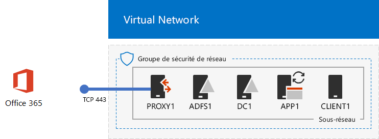
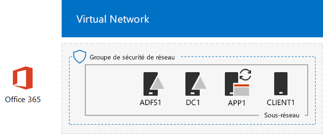

# <a name="federated-identity-for-your-office-365-devtest-environment"></a><span data-ttu-id="b43d2-103">Identité fédérée pour votre environnement de développement/test Office 365</span><span class="sxs-lookup"><span data-stu-id="b43d2-103">Federated identity for your Office 365 dev/test environment</span></span>

 <span data-ttu-id="b43d2-104">**Résumé** : Configurez l’authentification fédérée pour votre environnement de développement/test Office 365.</span><span class="sxs-lookup"><span data-stu-id="b43d2-104">**Summary:** Configure federated authentication for your Office 365 dev/test environment.</span></span>
  
<span data-ttu-id="b43d2-p101">Office 365 prend en charge l’identité fédérée. Cela signifie qu’au lieu d’effectuer la validation des informations d’identification, Office 365 renvoie l’utilisateur qui se connecte à un serveur d’authentification fédérée approuvé par Office 365. Si les informations d’identification de l’utilisateur sont correctes, le serveur d’authentification fédérée émet un jeton de sécurité que le client envoie ensuite à Office 365 comme preuve d’authentification. L’identité fédérée autorise le déchargement et la montée en charge de l’authentification pour un abonnement Office 365, ainsi que l’authentification avancée et les scénarios de sécurité.</span><span class="sxs-lookup"><span data-stu-id="b43d2-p101">Office 365 supports federated identity. This means that instead of performing the validation of credentials itself, Office 365 refers the connecting user to a federated authentication server that Office 365 trusts. If the user's credentials are correct, the federated authentication server issues a security token that the client then sends to Office 365 as proof of authentication. Federated identity allows for the offloading and scaling up of authentication for an Office 365 subscription and advanced authentication and security scenarios.</span></span>
  
<span data-ttu-id="b43d2-109">Cet article explique comment configurer l’authentification fédérée pour l’environnement de développement/test Office 365, pour le résultat suivant :</span><span class="sxs-lookup"><span data-stu-id="b43d2-109">This article describes how you can configure federated authentication for the Office 365 dev/test environment, resulting in the following:</span></span>
  
**<span data-ttu-id="b43d2-110">Figure 1: L’authentification fédérée pour l’environnement de développement/test Office 365</span><span class="sxs-lookup"><span data-stu-id="b43d2-110">Figure 1: The federated authentication for Office 365 dev/test environment</span></span>**


  
<span data-ttu-id="b43d2-112">La configuration illustrée dans la figure 1 est constituée des éléments suivants :</span><span class="sxs-lookup"><span data-stu-id="b43d2-112">The configuration shown in Figure 1 consists of:</span></span> 
  
- <span data-ttu-id="b43d2-113">Un abonnement d’évaluation Office 365 E5, qui arrive à expiration 30 jours après sa création.</span><span class="sxs-lookup"><span data-stu-id="b43d2-113">An Office 365 E5 Trial Subscription, which expires 30 days from when you create it.</span></span>
    
- <span data-ttu-id="b43d2-p102">Un intranet d’organisation simplifié et connecté à Internet, composé de cinq machines virtuelles sur un sous-réseau d’un réseau virtuel Azure (DC1, APP1, CLIENT1, ADFS1 et PROXY1). Azure AD Connect s’exécute sur APP1 pour synchroniser la liste de comptes dans le domaine AD DS (Active Directory Domain Services) avec Office 365. PROXY1 reçoit les demandes d’authentification entrantes. ADFS1 valide les informations d’identification avec DC1 et émet des jetons de sécurité.</span><span class="sxs-lookup"><span data-stu-id="b43d2-p102">A simplified organization intranet connected to the Internet, consisting of five virtual machines on a subnet of an Azure virtual network (DC1, APP1, CLIENT1, ADFS1, and PROXY1). Azure AD Connect runs on APP1 to synchronize the list of accounts in the Windows Server AD domain to Office 365. PROXY1 receives the incoming authentication requests. ADFS1 validates credentials with DC1 and issues security tokens.</span></span>
    
<span data-ttu-id="b43d2-118">Les cinq phases de configuration de cet environnement de développement/test sont les suivantes :</span><span class="sxs-lookup"><span data-stu-id="b43d2-118">There are five phases to setting up this dev/test environment:</span></span>
  
1. <span data-ttu-id="b43d2-119">Créez l’environnement de développement/test Office 365 d’entreprise simulé avec DirSync.</span><span class="sxs-lookup"><span data-stu-id="b43d2-119">Create the simulated enterprise Office 365 dev/test environment with DirSync.</span></span>
    
2. <span data-ttu-id="b43d2-120">Créez le serveur AD FS (ADFS1).</span><span class="sxs-lookup"><span data-stu-id="b43d2-120">Create the AD FS server (ADFS1).</span></span>
    
3. <span data-ttu-id="b43d2-121">Créez le serveur proxy web (PROXY1).</span><span class="sxs-lookup"><span data-stu-id="b43d2-121">Create the web proxy server (PROXY1).</span></span>
    
4. <span data-ttu-id="b43d2-122">Créez un certificat auto-signé et configurez ADFS1 et PROXY1.</span><span class="sxs-lookup"><span data-stu-id="b43d2-122">Create a self-signed certificate and configure ADFS1 and PROXY1.</span></span>
    
5. <span data-ttu-id="b43d2-123">Configurez Office 365 pour l’identité fédérée.</span><span class="sxs-lookup"><span data-stu-id="b43d2-123">Configure Office 365 for federated identity.</span></span>
    
<span data-ttu-id="b43d2-124">Pour connaître toutes les étapes d’un déploiement de production d’authentification fédérée pour Office 365 dans Azure, consultez la rubrique [Deploy high availability federated authentication for Office 365 in Azure](deploy-high-availability-federated-authentication-for-office-365-in-azure.md).</span><span class="sxs-lookup"><span data-stu-id="b43d2-124">To step through a production deployment of federated authentication for Office 365 in Azure, see [Deploy high availability federated authentication for Office 365 in Azure](deploy-high-availability-federated-authentication-for-office-365-in-azure.md).</span></span>
  
> [!NOTE]
> <span data-ttu-id="b43d2-125">Vous ne pouvez pas configurer cet environnement de développement/test avec un abonnement à la version d’évaluation d’Azure.</span><span class="sxs-lookup"><span data-stu-id="b43d2-125">You cannot configure this dev/test environment with an Azure Trial subscription.</span></span> 
  
> [!TIP]
> <span data-ttu-id="b43d2-126">Cliquez [ici](http://aka.ms/catlgstack) pour afficher le plan de tous les articles dans le Guide de Laboratoire Test Office 365.</span><span class="sxs-lookup"><span data-stu-id="b43d2-126">Click [here](http://aka.ms/catlgstack) for a visual map to all the articles in the Microsoft 365 Enterprise Test Lab Guide stack.</span></span>
  
## <a name="phase-1-create-the-simulated-enterprise-office-365-devtest-environment-with-dirsync"></a><span data-ttu-id="b43d2-127">Phase 1 : Création de l’environnement de développement/test Office 365 d’entreprise simulé avec DirSync</span><span class="sxs-lookup"><span data-stu-id="b43d2-127">Phase 1: Create the simulated enterprise Office 365 dev/test environment with DirSync</span></span>

<span data-ttu-id="b43d2-128">Suivez les instructions de la rubrique [Synchronisation d’annuaires pour votre environnement de développement/test Office 365](dirsync-for-your-office-365-dev-test-environment.md) pour créer l’environnement de développement/test Office 365 d’entreprise simulé avec APP1 en tant que serveur DirSync et l’identité synchronisée entre Office 365 et les comptes AD DS sur DC1.</span><span class="sxs-lookup"><span data-stu-id="b43d2-128">Follow the instructions in [Directory synchronization for your Office 365 dev/test environment](dirsync-for-your-office-365-dev-test-environment.md) to create the simulated enterprise Office 365 dev/test environment with APP1 as the DirSync server and synchronized identity between Office 365 and the Windows Server AD accounts on DC1.</span></span>
  
<span data-ttu-id="b43d2-p103">Ensuite, créez un nom de domaine DNS public en fonction de votre nom de domaine actuel et ajoutez-le à votre abonnement Office 365. Nous vous recommandons d’utiliser le nom **testlab.**\<votre domaine public>. Par exemple, si votre nom de domaine public est contoso.com, ajoutez le nom de domaine public testlab.contoso.com.</span><span class="sxs-lookup"><span data-stu-id="b43d2-p103">Next, create a new public DNS domain name based on your current domain name and add it to your Office 365 subscription. We recommend using the name **testlab.**\<your public domain>. For example, if your public domain name is contoso.com, add the public domain name testlab.contoso.com.</span></span>
  
<span data-ttu-id="b43d2-132">Pour obtenir des instructions sur la création d’enregistrements DNS corrects dans votre fournisseur DNS et l’ajout du domaine à votre abonnement à la version d’évaluation d’Office 365, consultez la rubrique relative à l’[ajout d’utilisateurs et de domaines à Office 365](https://support.office.com/article/Add-users-and-domain-to-Office-365-6383f56d-3d09-4dcb-9b41-b5f5a5efd611).</span><span class="sxs-lookup"><span data-stu-id="b43d2-132">For instructions on how to create the correct DNS records in your DNS provider and add the domain to your Office 365 trial subscription, see [Add users and domain to Office 365](https://support.office.com/article/Add-users-and-domain-to-Office-365-6383f56d-3d09-4dcb-9b41-b5f5a5efd611).</span></span> 
  
<span data-ttu-id="b43d2-133">Voici la configuration finale.</span><span class="sxs-lookup"><span data-stu-id="b43d2-133">Here is your resulting configuration.</span></span>
  
**<span data-ttu-id="b43d2-134">Figure 2 : Synchronisation d’annuaires pour l’environnement de développement/test Office 365</span><span class="sxs-lookup"><span data-stu-id="b43d2-134">Figure 2: Directory synchronization for the Office 365 dev/test environment</span></span>**


  
<span data-ttu-id="b43d2-136">La figure 2 illustre la synchronisation d’annuaires pour l’environnement de développement/test Office 365, qui comprend Office 365, ainsi que les machines virtuelles CLIENT1, APP1 et DC1 dans un réseau virtuel Azure.</span><span class="sxs-lookup"><span data-stu-id="b43d2-136">Figure 2 shows the directory synchronizationc for Office 365 dev/test environment, which includes Office 365 and CLIENT1, APP1, and DC1 virtual machines in an Azure virtual network.</span></span>
  
## <a name="phase-2-create-the-ad-fs-server"></a><span data-ttu-id="b43d2-137">Phase 2 : Création du serveur AD FS</span><span class="sxs-lookup"><span data-stu-id="b43d2-137">Phase 2: Create the AD FS server</span></span>

<span data-ttu-id="b43d2-138">Un serveur AD FS fournit une authentification fédérée entre Office 365 et les comptes dans le domaine corp.contoso.com hébergé sur DC1.</span><span class="sxs-lookup"><span data-stu-id="b43d2-138">An AD FS server provides federated authentication between Office 365 and the accounts in the corp.contoso.com domain hosted on DC1.</span></span>
  
<span data-ttu-id="b43d2-139">Pour créer une machine virtuelle Azure pour ADFS1, indiquez le nom de votre abonnement et de votre groupe de ressources, ainsi que l’emplacement Azure de votre configuration de base, puis exécutez ces commandes à l’invite de commandes Azure PowerShell sur votre ordinateur local.</span><span class="sxs-lookup"><span data-stu-id="b43d2-139">To create an Azure virtual machine for ADFS1, fill in the name of your subscription and the resource group and Azure location for your Base Configuration, and then run these commands at the Azure PowerShell command prompt on your local computer.</span></span>
  
```
$subscrName="<your Azure subscription name>"
$rgName="<the resource group name of your Base Configuration>"
Connect-AzAccount
Select-AzSubscription -SubscriptionName $subscrName
$staticIP="10.0.0.100"
$locName=(Get-AzResourceGroup -Name $rgName).Location
$vnet=Get-AzVirtualNetwork -Name TestLab -ResourceGroupName $rgName
$pip = New-AzPublicIpAddress -Name ADFS1-PIP -ResourceGroupName $rgName -Location $locName -AllocationMethod Dynamic
$nic = New-AzNetworkInterface -Name ADFS1-NIC -ResourceGroupName $rgName -Location $locName -SubnetId $vnet.Subnets[0].Id -PublicIpAddressId $pip.Id -PrivateIpAddress $staticIP
$vm=New-AzVMConfig -VMName ADFS1 -VMSize Standard_D2_v2
$cred=Get-Credential -Message "Type the name and password of the local administrator account for ADFS1."
$vm=Set-AzVMOperatingSystem -VM $vm -Windows -ComputerName ADFS1 -Credential $cred -ProvisionVMAgent -EnableAutoUpdate
$vm=Set-AzVMSourceImage -VM $vm -PublisherName MicrosoftWindowsServer -Offer WindowsServer -Skus 2016-Datacenter -Version "latest"
$vm=Add-AzVMNetworkInterface -VM $vm -Id $nic.Id
$vm=Set-AzVMOSDisk -VM $vm -Name "ADFS-OS" -DiskSizeInGB 128 -CreateOption FromImage -StorageAccountType "Standard_LRS"
New-AzVM -ResourceGroupName $rgName -Location $locName -VM $vm
```
<!--
> [!TIP]
> Click [here](https://gallery.technet.microsoft.com/PowerShell-commands-for-f79bc2c2?redir=0) for a text file that has all the PowerShell commands in this article.
-->
  
<span data-ttu-id="b43d2-140">Ensuite, utilisez le [portail Azure](http://portal.azure.com) pour vous connecter à la machine virtuelle ADFS1 à l’aide du nom de compte d’administrateur local ADFS1 et de votre mot de passe, puis ouvrez une invite de commande Windows PowerShell.</span><span class="sxs-lookup"><span data-stu-id="b43d2-140">Next, use the [Azure portal](http://portal.azure.com) to connect to the ADFS1 virtual machine using the ADFS1 local administrator account name and password, and then open a Windows PowerShell command prompt.</span></span>
  
<span data-ttu-id="b43d2-141">Pour vérifier la résolution du nom et la communication réseau entre ADFS1 et DC1, exécutez la commande **ping dc1.corp.contoso.com** et vérifiez qu’il y a quatre réponses.</span><span class="sxs-lookup"><span data-stu-id="b43d2-141">To check name resolution and network communication between ADFS1 and DC1, run the **ping dc1.corp.contoso.com** command and check that there are four replies.</span></span>
  
<span data-ttu-id="b43d2-142">Ensuite, associez la machine virtuelle ADFS1 au domaine CORP avec ces commandes à l’invite Windows PowerShell sur ADFS1.</span><span class="sxs-lookup"><span data-stu-id="b43d2-142">Next, join the ADFS1 virtual machine to the CORP domain with these commands at the Windows PowerShell prompt on ADFS1.</span></span>
  
```
$cred=Get-Credential -UserName "CORP\User1" -Message "Type the User1 account password."
Add-Computer -DomainName corp.contoso.com -Credential $cred
Restart-Computer
```

<span data-ttu-id="b43d2-143">Voici la configuration finale.</span><span class="sxs-lookup"><span data-stu-id="b43d2-143">Here is your resulting configuration.</span></span>
  
**<span data-ttu-id="b43d2-144">Figure 3 : Ajout du serveur AD FS</span><span class="sxs-lookup"><span data-stu-id="b43d2-144">Figure 3: Adding the AD FS server</span></span>**


  
<span data-ttu-id="b43d2-146">La figure 3 illustre l’ajout du serveur ADFS1 à DirSync pour l’environnement de développement/test Office 365.</span><span class="sxs-lookup"><span data-stu-id="b43d2-146">Figure 3 shows the addition of the ADFS1 server to the DirSync for Office 365 dev/test environment.</span></span>
  
## <a name="phase-3-create-the-web-proxy-server"></a><span data-ttu-id="b43d2-147">Phase 3 : création du serveur proxy web (PROXY1)</span><span class="sxs-lookup"><span data-stu-id="b43d2-147">Phase 3: Create the web proxy server</span></span>

<span data-ttu-id="b43d2-148">PROXY1 permet le traitement proxy des messages d’authentification entre les utilisateurs tentant de s’authentifier et ADFS1.</span><span class="sxs-lookup"><span data-stu-id="b43d2-148">PROXY1 provides proxying of authentication messages between users trying to authenticate and ADFS1.</span></span>
  
<span data-ttu-id="b43d2-149">Pour créer une machine virtuelle Azure pour PROXY1, indiquez le nom de votre groupe de ressources et l’emplacement Azure, puis exécutez ces commandes à l’invite de commande Azure PowerShell sur votre ordinateur local.</span><span class="sxs-lookup"><span data-stu-id="b43d2-149">To create an Azure virtual machine for PROXY1, fill in the name of your resource group and Azure location, and then run these commands at the Azure PowerShell command prompt on your local computer.</span></span>
  
```
$rgName="<the resource group name of your Base Configuration>"
$staticIP="10.0.0.101"
$locName=(Get-AzResourceGroup -Name $rgName).Location
$vnet=Get-AzVirtualNetwork -Name TestLab -ResourceGroupName $rgName
$pip = New-AzPublicIpAddress -Name PROXY1-PIP -ResourceGroupName $rgName -Location $locName -AllocationMethod Static
$nic = New-AzNetworkInterface -Name PROXY1-NIC -ResourceGroupName $rgName -Location $locName -SubnetId $vnet.Subnets[0].Id -PublicIpAddressId $pip.Id -PrivateIpAddress $staticIP
$vm=New-AzVMConfig -VMName PROXY1 -VMSize Standard_D2_v2
$cred=Get-Credential -Message "Type the name and password of the local administrator account for PROXY1."
$vm=Set-AzVMOperatingSystem -VM $vm -Windows -ComputerName PROXY1 -Credential $cred -ProvisionVMAgent -EnableAutoUpdate
$vm=Set-AzVMSourceImage -VM $vm -PublisherName MicrosoftWindowsServer -Offer WindowsServer -Skus 2016-Datacenter -Version "latest"
$vm=Add-AzVMNetworkInterface -VM $vm -Id $nic.Id
$vm=Set-AzVMOSDisk -VM $vm -Name "PROXY1-OS" -DiskSizeInGB 128 -CreateOption FromImage -StorageAccountType "Standard_LRS"
New-AzVM -ResourceGroupName $rgName -Location $locName -VM $vm
```

> [!NOTE]
> <span data-ttu-id="b43d2-150">Une adresse IP publique statique est affectée à PROXY1, car vous créez un enregistrement DNS public qui pointe vers celle-ci et elle ne doit pas être modifiée lorsque vous redémarrez la machine virtuelle PROXY1.</span><span class="sxs-lookup"><span data-stu-id="b43d2-150">PROXY1 is assigned a static public IP address because you will create a public DNS record that points to it and it must not change when you restart the PROXY1 virtual machine.</span></span> 
  
<span data-ttu-id="b43d2-p104">Ensuite, ajoutez une règle au groupe de sécurité réseau pour le sous-réseau CorpNet afin d’autoriser le trafic entrant non sollicité provenant d’Internet et allant vers l’adresse IP privée de PROXY1 et le port TCP 443. Exécutez ces commandes dans l’invite de commande Azure PowerShell sur votre ordinateur local.</span><span class="sxs-lookup"><span data-stu-id="b43d2-p104">Next, add a rule to the network security group for the CorpNet subnet to allow unsolicited inbound traffic from the Internet to PROXY1's private IP address and TCP port 443. Run these commands at the Azure PowerShell command prompt on your local computer.</span></span>
  
```
$rgName="<the resource group name of your Base Configuration>"
Get-AzNetworkSecurityGroup -Name CorpNet -ResourceGroupName $rgName | Add-AzNetworkSecurityRuleConfig -Name "HTTPS-to-PROXY1" -Description "Allow TCP 443 to PROXY1" -Access "Allow" -Protocol "Tcp" -Direction "Inbound" -Priority 101 -SourceAddressPrefix "Internet" -SourcePortRange "*" -DestinationAddressPrefix "10.0.0.101" -DestinationPortRange "443" | Set-AzNetworkSecurityGroup
```

<span data-ttu-id="b43d2-153">Ensuite, utilisez le [portail Azure](http://portal.azure.com) pour vous connecter à la machine virtuelle PROXY1 à l’aide du nom de compte d’administrateur local PROXY1 et de votre mot de passe, puis ouvrez une invite de commande Windows PowerShell sur PROXY1.</span><span class="sxs-lookup"><span data-stu-id="b43d2-153">Next, use the [Azure portal](http://portal.azure.com) to connect to the PROXY1 virtual machine using the PROXY1 local administrator account name and password, and then open a Windows PowerShell command prompt on PROXY1.</span></span>
  
<span data-ttu-id="b43d2-154">Pour vérifier la résolution du nom et la communication réseau entre PROXY1 et DC1, exécutez la commande **ping dc1.corp.contoso.com** et vérifiez qu’il y a quatre réponses.</span><span class="sxs-lookup"><span data-stu-id="b43d2-154">To check name resolution and network communication between PROXY1 and DC1, run the **ping dc1.corp.contoso.com** command and check that there are four replies.</span></span>
  
<span data-ttu-id="b43d2-155">Ensuite, associez la machine virtuelle PROXY1 au domaine CORP avec ces commandes à l’invite Windows PowerShell sur PROXY1.</span><span class="sxs-lookup"><span data-stu-id="b43d2-155">Next, join the PROXY1 virtual machine to the CORP domain with these commands at the Windows PowerShell prompt on PROXY1.</span></span>
  
```
$cred=Get-Credential -UserName "CORP\User1" -Message "Type the User1 account password."
Add-Computer -DomainName corp.contoso.com -Credential $cred
Restart-Computer
```

<span data-ttu-id="b43d2-156">Affichez l’adresse IP publique de PROXY1 avec ces commandes Azure PowerShell sur votre ordinateur local :</span><span class="sxs-lookup"><span data-stu-id="b43d2-156">Display the public IP address of PROXY1 with these Azure PowerShell commands on your local computer:</span></span>
  
```
Write-Host (Get-AzPublicIpaddress -Name "PROXY1-PIP" -ResourceGroup $rgName).IPAddress
```

<span data-ttu-id="b43d2-p105">Ensuite, utilisez votre fournisseur DNS public et créez un enregistrement A DNS public pour **fs.testlab.**\<<votre nom de domaine DNS> qui résout l’adresse IP affichée par la commande **Write-Host**. **fs.testlab.**\<votre nom de domaine DNS> est désigné ci-après en tant que *nom de domaine complet du service FS (Federation Service)*.</span><span class="sxs-lookup"><span data-stu-id="b43d2-p105">Next, work with your public DNS provider and create a new public DNS A record for **fs.testlab.**\<your DNS domain name> that resolves to the IP address displayed by the **Write-Host** command. The **fs.testlab.**\<your DNS domain name> is hereafter referred to as the  *federation service FQDN*  .</span></span>
  
<span data-ttu-id="b43d2-159">Ensuite, utilisez le [portail Azure](http://portal.azure.com) pour vous connecter à la machine virtuelle DC1 à l’aide des informations d’identification de CORP\\User1, puis exécutez les commandes suivantes à une invite de commande Windows PowerShell de niveau administrateur :</span><span class="sxs-lookup"><span data-stu-id="b43d2-159">Next, use the [Azure portal](http://portal.azure.com) to connect to the DC1 virtual machine using the CORP\\User1 credentials, and then run the following commands at an administrator-level Windows PowerShell command prompt:</span></span>
  
```
$testZone="<the FQDN of your testlab domain from phase 1, example: testlab.contoso.com>"
$testZoneFile= $testZone + ".dns"
Add-DnsServerPrimaryZone -Name $testZone -ZoneFile $testZoneFile
Add-DnsServerResourceRecordA -Name "fs" -ZoneName $testZone -AllowUpdateAny -IPv4Address "10.0.0.100" -TimeToLive 01:00:00
```

<span data-ttu-id="b43d2-160">Ces commandes créent un enregistrement A DNS pour votre nom de domaine complet du service FS (Federation Service) que les machines virtuelles sur le réseau virtuel Azure peuvent résoudre sur l’adresse IP privée d’ADFS1.</span><span class="sxs-lookup"><span data-stu-id="b43d2-160">These commands create a DNS A record for your federation service FQDN that virtual machines on the Azure virtual network can resolve to ADFS1's private IP address.</span></span>
  
<span data-ttu-id="b43d2-161">Voici la configuration finale.</span><span class="sxs-lookup"><span data-stu-id="b43d2-161">Here is your resulting configuration.</span></span>
  
**<span data-ttu-id="b43d2-162">Figure 4 : Ajout du serveur proxy d’application web</span><span class="sxs-lookup"><span data-stu-id="b43d2-162">Figure 4: Adding the web application proxy server</span></span>**


  
<span data-ttu-id="b43d2-164">La figure 4 illustre l’ajout du serveur PROXY1.</span><span class="sxs-lookup"><span data-stu-id="b43d2-164">Figure 4 shows the addition of the PROXY1 server.</span></span>
  
## <a name="phase-4-create-a-self-signed-certificate-and-configure-adfs1-and-proxy1"></a><span data-ttu-id="b43d2-165">Phase 4 : création d’un certificat auto-signé et configuration d’ADFS1 et de PROXY1</span><span class="sxs-lookup"><span data-stu-id="b43d2-165">Phase 4: Create a self-signed certificate and configure ADFS1 and PROXY1</span></span>

<span data-ttu-id="b43d2-166">Au cours de cette phase, vous créez un certificat numérique auto-signé pour votre nom de domaine complet du service FS (Federation Service) et vous configurez ADFS1 et PROXY1 en tant que batterie de serveurs AD FS.</span><span class="sxs-lookup"><span data-stu-id="b43d2-166">In this phase, you create a self-signed digital certificate for your federation service FQDN and configure ADFS1 and PROXY1 as an AD FS farm.</span></span>
  
<span data-ttu-id="b43d2-167">Tout d’abord, utilisez le [portail Azure](http://portal.azure.com) pour vous connecter à la machine virtuelle DC1 à l’aide des informations d’identification de CORP\\User1, puis ouvrez une invite de commande Windows PowerShell de niveau administrateur.</span><span class="sxs-lookup"><span data-stu-id="b43d2-167">First, use the [Azure portal](http://portal.azure.com) to connect to the DC1 virtual machine using the CORP\\User1 credentials, and then open an administrator-level Windows PowerShell command prompt.</span></span>
  
<span data-ttu-id="b43d2-168">Ensuite, créez un compte de service AD FS avec cette commande à l’invite de commande Windows PowerShell sur DC1 :</span><span class="sxs-lookup"><span data-stu-id="b43d2-168">Next, create AD FS service account with this command at the Windows PowerShell command prompt on DC1:</span></span>
  
```
New-ADUser -SamAccountName ADFS-Service -AccountPassword (read-host "Set user password" -assecurestring) -name "ADFS-Service" -enabled $true -PasswordNeverExpires $true -ChangePasswordAtLogon $false
```

<span data-ttu-id="b43d2-p106">Notez que cette commande vous invite à indiquer le mot de passe du compte. Choisissez un mot de passe fort et enregistrez-le dans un emplacement sécurisé. Vous en aurez besoin pour cette phase et la phase 5.</span><span class="sxs-lookup"><span data-stu-id="b43d2-p106">Note that this command prompts you to supply the account password. Choose a strong password and record it in a secured location. You will need it for this phase and Phase 5.</span></span>
  
<span data-ttu-id="b43d2-p107">Utilisez le [portail Azure](http://portal.azure.com) pour vous connecter à la machine virtuelle ADFS1 à l’aide des informations d’identification de CORP\\User1. Ouvrez une invite de commande Windows PowerShell de niveau administrateur sur ADFS1, indiquez votre nom de domaine complet du service FS (Federation Service), puis exécutez ces commandes pour créer un certificat auto-signé :</span><span class="sxs-lookup"><span data-stu-id="b43d2-p107">Use the [Azure portal](http://portal.azure.com) to connect to the ADFS1 virtual machine using the CORP\\User1 credentials. Open an administrator-level Windows PowerShell command prompt on ADFS1, fill in your federation service FQDN, and then run these commands to create a self-signed certificate:</span></span>
  
```
$fedServiceFQDN="<federation service FQDN>"
New-SelfSignedCertificate -DnsName $fedServiceFQDN -CertStoreLocation "cert:\LocalMachine\My"
New-Item -path c:\Certs -type directory
New-SmbShare -name Certs -path c:\Certs -changeaccess CORP\User1
```

<span data-ttu-id="b43d2-174">Ensuite, utilisez ces étapes pour enregistrer le nouveau certificat auto-signé en tant que fichier.</span><span class="sxs-lookup"><span data-stu-id="b43d2-174">Next, use these steps to save the new self-signed certificate as a file.</span></span>
  
1. <span data-ttu-id="b43d2-175">Cliquez sur **Démarrer**, tapez **mmc.exe**, puis appuyez sur **Entrée**.</span><span class="sxs-lookup"><span data-stu-id="b43d2-175">Click **Start**, type **mmc.exe**, and then press **Enter**.</span></span>
    
2. <span data-ttu-id="b43d2-176">Cliquez sur **Fichier > Ajouter/Supprimer un composant logiciel enfichable**.</span><span class="sxs-lookup"><span data-stu-id="b43d2-176">Click **File > Add/Remove Snap-in**.</span></span>
    
3. <span data-ttu-id="b43d2-177">Dans **Ajouter ou supprimer des composants logiciels enfichables**, double-cliquez sur **Certificats** dans la liste des composants logiciels enfichables disponibles, cliquez sur **Compte d’ordinateur**, puis sur **Suivant**.</span><span class="sxs-lookup"><span data-stu-id="b43d2-177">In **Add or Remove Snap-ins**, double-click **Certificates** in the list of available snap-ins, click **Computer account**, and then click **Next**.</span></span>
    
4. <span data-ttu-id="b43d2-178">Dans **Sélectionner un ordinateur**, cliquez sur **Terminer**, puis sur **OK**.</span><span class="sxs-lookup"><span data-stu-id="b43d2-178">In **Select Computer**, click **Finish**, and then click **OK**.</span></span>
    
5. <span data-ttu-id="b43d2-179">Dans le volet d’arborescence, ouvrez **Certificats (ordinateur local) > Personnel > Certificats**.</span><span class="sxs-lookup"><span data-stu-id="b43d2-179">In the tree pane, open **Certificates (Local Computer) > Personal > Certificates**.</span></span>
    
6. <span data-ttu-id="b43d2-180">Cliquez sur le certificat avec votre nom de domaine complet du service FS (Federation Service) avec le bouton droit de la souris, cliquez sur **Toutes les tâches**, puis sur **Exporter**.</span><span class="sxs-lookup"><span data-stu-id="b43d2-180">Right-click the certificate with your federation service FQDN, click **All tasks**, and then click **Export**.</span></span>
    
7. <span data-ttu-id="b43d2-181">Dans la page **Bienvenue**, cliquez sur **Suivant**.</span><span class="sxs-lookup"><span data-stu-id="b43d2-181">On the **Welcome** page, click **Next**.</span></span>
    
8. <span data-ttu-id="b43d2-182">Sur la page \*\*Exporter la clé privée \*\*, cliquez sur **Oui**, puis sur **Suivant**.</span><span class="sxs-lookup"><span data-stu-id="b43d2-182">On the **Export Private Key** page, click **Yes**, and then click **Next**.</span></span>
    
9. <span data-ttu-id="b43d2-183">Sur la page **Format du fichier d’exportation**, cliquez sur **Exporter toutes les propriétés étendues**, puis sur **Suivant**.</span><span class="sxs-lookup"><span data-stu-id="b43d2-183">On the **Export File Format** page, click **Export all extended properties**, and then click **Next**.</span></span>
    
10. <span data-ttu-id="b43d2-184">Sur la page **Sécurité**, cliquez sur **Mot de passe** et saisissez un mot de passe dans **Mot de passe** et dans **Confirmer le mot de passe**.</span><span class="sxs-lookup"><span data-stu-id="b43d2-184">On the **Security** page, click **Password** and type a password in **Password** and **Confirm password.**</span></span>
    
11. <span data-ttu-id="b43d2-185">Sur la page **Fichier à exporter**, cliquez sur **Parcourir**.</span><span class="sxs-lookup"><span data-stu-id="b43d2-185">On the **File to Export** page, click **Browse**.</span></span>
    
12. <span data-ttu-id="b43d2-186">Accédez au dossier **C:\\Certs**, saisissez **SSL** dans **Nom de fichier**, puis cliquez sur **Enregistrer.**</span><span class="sxs-lookup"><span data-stu-id="b43d2-186">Browse to the **C:\\Certs** folder, type **SSL** in **File name**, and then click **Save.**</span></span>
    
13. <span data-ttu-id="b43d2-187">Sur la page **Fichier à exporter**, cliquez sur **Suivant**.</span><span class="sxs-lookup"><span data-stu-id="b43d2-187">On the **File to Export** page, click **Next**.</span></span>
    
14. <span data-ttu-id="b43d2-p108">Sur la page **Fin de l’Assistant Exportation de certificat**, cliquez sur **Terminer**. À l’invite, cliquez sur **OK**.</span><span class="sxs-lookup"><span data-stu-id="b43d2-p108">On the **Completing the Certificate Export Wizard** page, click **Finish**. When prompted, click **OK**.</span></span>
    
<span data-ttu-id="b43d2-190">Ensuite, installez le service AD FS avec cette commande à l’invite de commande Windows PowerShell sur ADFS1 :</span><span class="sxs-lookup"><span data-stu-id="b43d2-190">Next, install the AD FS service with this command at the Windows PowerShell command prompt on ADFS1:</span></span>
  
```
Install-WindowsFeature ADFS-Federation -IncludeManagementTools
```

<span data-ttu-id="b43d2-191">Attendez la fin de l’installation.</span><span class="sxs-lookup"><span data-stu-id="b43d2-191">Wait for the installation to complete.</span></span>
  
<span data-ttu-id="b43d2-192">Ensuite, configurez le service AD FS en suivant ces étapes :</span><span class="sxs-lookup"><span data-stu-id="b43d2-192">Next, configure the AD FS service with these steps:</span></span>
  
1. <span data-ttu-id="b43d2-193">Cliquez sur **Démarrer**, puis sur l’icône **Gestionnaire de serveur**.</span><span class="sxs-lookup"><span data-stu-id="b43d2-193">Click **Start**, and then click the **Server Manager** icon.</span></span>
    
2. <span data-ttu-id="b43d2-194">Dans le volet d’arborescence du Gestionnaire de serveur, cliquez sur **AD FS**.</span><span class="sxs-lookup"><span data-stu-id="b43d2-194">In the tree pane of Server Manager, click **AD FS**.</span></span>
    
3. <span data-ttu-id="b43d2-195">Dans la barre d’outils en haut de l’écran, cliquez sur le symbole d’avertissement orange, puis sur **Configurez le service FS (Federation Service) sur ce serveur**.</span><span class="sxs-lookup"><span data-stu-id="b43d2-195">In the tool bar at the top, click the orange caution symbol, and then click **Configure the federation service on this server**.</span></span>
    
4. <span data-ttu-id="b43d2-196">Sur la page d’**accueil** de l’Assistant Configuration des services de fédération Active Directory (AD FS), cliquez sur **Suivant**.</span><span class="sxs-lookup"><span data-stu-id="b43d2-196">On the **Welcome** page of the Active Directory Federation Services Configuration Wizard, click **Next**.</span></span>
    
5. <span data-ttu-id="b43d2-197">Sur la page **Connexion à AD FS**, cliquez sur **Suivant**.</span><span class="sxs-lookup"><span data-stu-id="b43d2-197">On the **Connect to AD DS** page, click **Next**.</span></span>
    
6. <span data-ttu-id="b43d2-198">Sur la page **Spécifier les propriétés de service** :</span><span class="sxs-lookup"><span data-stu-id="b43d2-198">On the **Specify Service Properties** page:</span></span>
    
  - <span data-ttu-id="b43d2-199">Pour **Certificat SSL**, cliquez sur la flèche vers le bas, puis sur le certificat avec votre nom de domaine complet du service FS (Federation Service).</span><span class="sxs-lookup"><span data-stu-id="b43d2-199">For **SSL Certificate**, click the down arrow, and then click the certificate with the name of your federation service FQDN.</span></span>
    
  - <span data-ttu-id="b43d2-200">Dans **Nom complet du service FS**, saisissez le nom de votre organisation fictive.</span><span class="sxs-lookup"><span data-stu-id="b43d2-200">In **Federation Service Display Name**, type the name of your fictional organization.</span></span>
    
  - <span data-ttu-id="b43d2-201">Cliquez sur **Suivant**.</span><span class="sxs-lookup"><span data-stu-id="b43d2-201">Click **Next**.</span></span>
    
7. <span data-ttu-id="b43d2-202">Sur la page **Spécifier un compte de service**, cliquez sur **Sélectionner** pour **Nom du compte**.</span><span class="sxs-lookup"><span data-stu-id="b43d2-202">On the **Specify Service Account** page, click **Select** for **Account name**.</span></span>
    
8. <span data-ttu-id="b43d2-203">Dans **Sélectionner l’utilisateur ou le compte de service**, saisissez **ADFS-Service**, cliquez sur **Vérifier les noms**, puis cliquez sur **OK**.</span><span class="sxs-lookup"><span data-stu-id="b43d2-203">In **Select User or Service Account**, type **ADFS-Service**, click **Check Names**, and then click **OK**.</span></span>
    
9. <span data-ttu-id="b43d2-204">Dans **Mot de passe de compte**, saisissez le mot de passe du compte ADFS-Service, puis cliquez sur **Suivant**.</span><span class="sxs-lookup"><span data-stu-id="b43d2-204">In **Account Password**, type the password for the ADFS-Service account, and then click **Next**.</span></span>
    
10. <span data-ttu-id="b43d2-205">Sur la page **Spécifier une base de données de configuration**, cliquez sur **Suivant**.</span><span class="sxs-lookup"><span data-stu-id="b43d2-205">On the **Specify Configuration Database** page, click **Next**.</span></span>
    
11. <span data-ttu-id="b43d2-206">Sur la page **Examiner les options**, cliquez sur **Suivant**.</span><span class="sxs-lookup"><span data-stu-id="b43d2-206">On the **Review Options** page, click **Next**.</span></span>
    
12. <span data-ttu-id="b43d2-207">Sur la page **Vérifications des conditions préalables**, cliquez sur **Configurer**.</span><span class="sxs-lookup"><span data-stu-id="b43d2-207">On the **Pre-requisite Checks** page, click **Configure**.</span></span>
    
13. <span data-ttu-id="b43d2-208">Sur la page **Résultats**, cliquez sur **Fermer**.</span><span class="sxs-lookup"><span data-stu-id="b43d2-208">On the **Results** page, click **Close**.</span></span>
    
14. <span data-ttu-id="b43d2-209">Cliquez sur **Démarrer**, puis sur l’icône de démarrage, choisissez **Redémarrer**, puis **Continuer**.</span><span class="sxs-lookup"><span data-stu-id="b43d2-209">Click **Start**, click the power icon, click **Restart**, and then click **Continue**.</span></span>
    
<span data-ttu-id="b43d2-210">À partir du [portail Azure](http://portal.azure.com), connectez-vous à PROXY1 avec les informations d’identification du compte CORP\\User1.</span><span class="sxs-lookup"><span data-stu-id="b43d2-210">From the [Azure portal](http://portal.azure.com), connect to PROXY1 with the CORP\\User1 account credentials.</span></span>
  
<span data-ttu-id="b43d2-211">Ensuite, suivez ces étapes pour installer le certificat auto-signé et configurer PROXY1.</span><span class="sxs-lookup"><span data-stu-id="b43d2-211">Next, use these steps to install the self-signed certificate and configure PROXY1.</span></span>
  
1. <span data-ttu-id="b43d2-212">Cliquez sur **Démarrer**, tapez **mmc.exe**, puis appuyez sur **Entrée**.</span><span class="sxs-lookup"><span data-stu-id="b43d2-212">Click **Start**, type **mmc.exe**, and then press **Enter**.</span></span>
    
2. <span data-ttu-id="b43d2-213">Cliquez sur **Fichier > Ajouter/Supprimer un composant logiciel enfichable**.</span><span class="sxs-lookup"><span data-stu-id="b43d2-213">Click **File > Add/Remove Snap-in**.</span></span>
    
3. <span data-ttu-id="b43d2-214">Dans **Ajouter ou supprimer des composants logiciels enfichables**, double-cliquez sur **Certificats** dans la liste des composants logiciels enfichables disponibles, cliquez sur **Compte d’ordinateur**, puis sur **Suivant**.</span><span class="sxs-lookup"><span data-stu-id="b43d2-214">In **Add or Remove Snap-ins**, double-click **Certificates** in the list of available snap-ins, click **Computer account**, and then click **Next**.</span></span>
    
4. <span data-ttu-id="b43d2-215">Dans **Sélectionner un ordinateur**, cliquez sur **Terminer**, puis sur **OK**.</span><span class="sxs-lookup"><span data-stu-id="b43d2-215">In **Select Computer**, click **Finish**, and then click **OK**.</span></span>
    
5. <span data-ttu-id="b43d2-216">Dans le volet d’arborescence, ouvrez **Certificats (ordinateur local) > Personnel > Certificats**.</span><span class="sxs-lookup"><span data-stu-id="b43d2-216">In the tree pane, open **Certificates (Local Computer) > Personal > Certificates**.</span></span>
    
6. <span data-ttu-id="b43d2-217">Cliquez avec le bouton droit sur **Personnel**, cliquez sur **Toutes les tâches**, puis sur **Importer**.</span><span class="sxs-lookup"><span data-stu-id="b43d2-217">Right-click **Personal**, click **All tasks**, and then click **Import**.</span></span>
    
7. <span data-ttu-id="b43d2-218">Dans la page **Bienvenue**, cliquez sur **Suivant**.</span><span class="sxs-lookup"><span data-stu-id="b43d2-218">On the **Welcome** page, click **Next**.</span></span>
    
8. <span data-ttu-id="b43d2-219">Sur la page **Fichier à importer**, saisissez **\\\\adfs1\\certs\\ssl.pfx**, puis cliquez sur **Suivant**.</span><span class="sxs-lookup"><span data-stu-id="b43d2-219">On the **File to Import** page, type **\\\\adfs1\\certs\\ssl.pfx**, and then click **Next**.</span></span>
    
9. <span data-ttu-id="b43d2-220">Sur la page **Protection de clé privée**, saisissez le mot de passe du certificat dans **Mot de passe**, puis cliquez sur **Suivant.**</span><span class="sxs-lookup"><span data-stu-id="b43d2-220">On the **Private key protection** page, type the certificate password in **Password**, and then click **Next.**</span></span>
    
10. <span data-ttu-id="b43d2-221">Sur la page **Magasin de certificats**, cliquez sur **Suivant**.</span><span class="sxs-lookup"><span data-stu-id="b43d2-221">On the **Certificate store** page, click **Next.**</span></span>
    
11. <span data-ttu-id="b43d2-222">Sur la page **Achèvement**, cliquez sur **Terminer**.</span><span class="sxs-lookup"><span data-stu-id="b43d2-222">On the **Completing** page, click **Finish**.</span></span>
    
12. <span data-ttu-id="b43d2-223">Sur la page **Magasin de certificats**, cliquez sur **Suivant**.</span><span class="sxs-lookup"><span data-stu-id="b43d2-223">On the **Certificate Store** page, click **Next**.</span></span>
    
13. <span data-ttu-id="b43d2-224">À l’invite, cliquez sur **OK**.</span><span class="sxs-lookup"><span data-stu-id="b43d2-224">When prompted, click **OK**.</span></span>
    
14. <span data-ttu-id="b43d2-225">Cliquez sur **Certificats** dans le volet d’arborescence.</span><span class="sxs-lookup"><span data-stu-id="b43d2-225">Click **Certificates** in the tree pane.</span></span>
    
15. <span data-ttu-id="b43d2-226">Cliquez sur le certificat avec le bouton droit de la souris, puis cliquez sur **Copier**.</span><span class="sxs-lookup"><span data-stu-id="b43d2-226">Right-click the certificate, and then click **Copy**.</span></span>
    
16. <span data-ttu-id="b43d2-227">Dans le volet d’arborescence, ouvrez **Autorités de certification racines de confiance > Certificats**.</span><span class="sxs-lookup"><span data-stu-id="b43d2-227">In the tree pane, open **Trusted Root Certification Authorities > Certificates**.</span></span>
    
17. <span data-ttu-id="b43d2-228">Placez le pointeur de la souris au-dessous de la liste des certificats installés, cliquez avec le bouton droit, puis cliquez sur **Coller**.</span><span class="sxs-lookup"><span data-stu-id="b43d2-228">Move your mouse pointer below the list of installed certificates, right-click, and then click **Paste**.</span></span>
    
<span data-ttu-id="b43d2-229">Ouvrez une invite de commande PowerShell de niveau administrateur et exécutez les commandes suivantes :</span><span class="sxs-lookup"><span data-stu-id="b43d2-229">Open an administrator-level PowerShell command prompt and run the following command:</span></span>
  
```
Install-WindowsFeature Web-Application-Proxy -IncludeManagementTools
```

<span data-ttu-id="b43d2-230">Attendez la fin de l’installation.</span><span class="sxs-lookup"><span data-stu-id="b43d2-230">Wait for the installation to complete.</span></span>
  
<span data-ttu-id="b43d2-231">Suivez ces étapes pour configurer le service de proxy d’application web de manière à ce qu’il utilise ADFS1 comme serveur de fédération :</span><span class="sxs-lookup"><span data-stu-id="b43d2-231">Use these steps to configure the web application proxy service to use ADFS1 as its federation server:</span></span>
  
1. <span data-ttu-id="b43d2-232">Cliquez sur **Démarrer**, puis sur **Gestionnaire de serveur**.</span><span class="sxs-lookup"><span data-stu-id="b43d2-232">Click **Start**, and then click **Server Manager**.</span></span>
    
2. <span data-ttu-id="b43d2-233">Dans le volet d’arborescence, cliquez sur **Accès distant**.</span><span class="sxs-lookup"><span data-stu-id="b43d2-233">In the tree pane, click **Remote Access**.</span></span>
    
3. <span data-ttu-id="b43d2-234">Dans la barre d’outils en haut de l’écran, cliquez sur le symbole d’avertissement orange, puis sur **Ouvrir l’Assistant Proxy d’application web**.</span><span class="sxs-lookup"><span data-stu-id="b43d2-234">In the tool bar at the top, click the orange caution symbol, and then click **Open the Web Application Proxy Wizard**.</span></span>
    
4. <span data-ttu-id="b43d2-235">Sur la page d’**accueil** de l’Assistant Configuration de proxy d’application web, cliquez sur **Suivant**.</span><span class="sxs-lookup"><span data-stu-id="b43d2-235">On the **Welcome** page of the Web Application Proxy Configuration Wizard, click **Next**.</span></span>
    
5. <span data-ttu-id="b43d2-236">Sur la page **Serveur de fédération** :</span><span class="sxs-lookup"><span data-stu-id="b43d2-236">On the **Federation Server** page:</span></span>
    
  - <span data-ttu-id="b43d2-237">Saisissez votre nom de domaine complet du service FS (Federation Service) dans **Nom du service FS (Federation Service)**.</span><span class="sxs-lookup"><span data-stu-id="b43d2-237">Type your federation service FQDN in **Federation service name**.</span></span>
    
  - <span data-ttu-id="b43d2-238">Saisissez **CORP\\User1** dans **Nom d’utilisateur**.</span><span class="sxs-lookup"><span data-stu-id="b43d2-238">Type **CORP\\User1** in **User name**.</span></span>
    
  - <span data-ttu-id="b43d2-239">Saisissez le mot de passe du compte User1 dans **Mot de passe**.</span><span class="sxs-lookup"><span data-stu-id="b43d2-239">Type the password for the User1 account in **Password**.</span></span>
    
  - <span data-ttu-id="b43d2-240">Cliquez sur **Suivant**.</span><span class="sxs-lookup"><span data-stu-id="b43d2-240">Click **Next**.</span></span>
    
6. <span data-ttu-id="b43d2-241">Sur la page **Certificats de proxy AD FS**, cliquez sur la flèche vers le bas, cliquez sur le certificat avec votre nom de domaine complet du service FS (Federation Service), puis sur **Suivant**.</span><span class="sxs-lookup"><span data-stu-id="b43d2-241">On the **AD FS Proxy Certificate** page, click the down arrow, click the certificate with your federation service FQDN, and then click **Next**.</span></span>
    
7. <span data-ttu-id="b43d2-242">Sur la page **Confirmation**, cliquez sur **Configurer**.</span><span class="sxs-lookup"><span data-stu-id="b43d2-242">On the **Confirmation** page, click **Configure**.</span></span>
    
8. <span data-ttu-id="b43d2-243">Sur la page **Résultats**, cliquez sur **Fermer**.</span><span class="sxs-lookup"><span data-stu-id="b43d2-243">On the **Results** page, click **Close**.</span></span>
    
## <a name="phase-5-configure-office-365-for-federated-identity"></a><span data-ttu-id="b43d2-244">Phase 5 : Configuration d’Office 365 pour l’identité fédérée</span><span class="sxs-lookup"><span data-stu-id="b43d2-244">Phase 5: Configure Office 365 for federated identity</span></span>

<span data-ttu-id="b43d2-245">Utilisez le [portail Azure](http://portal.azure.com) pour vous connecter à la machine virtuelle APP1 avec les informations d’identification du compte CORP\\User1.</span><span class="sxs-lookup"><span data-stu-id="b43d2-245">Use the [Azure portal](http://portal.azure.com) to connect to the APP1 virtual machine with the CORP\\User1 account credentials.</span></span>
  
<span data-ttu-id="b43d2-246">Suivez ces étapes pour configurer Azure AD Connect et votre abonnement Office 365 pour l’authentification fédérée :</span><span class="sxs-lookup"><span data-stu-id="b43d2-246">Use these steps to configure Azure AD Connect and your Office 365 subscription for federated authentication:</span></span>
  
1. <span data-ttu-id="b43d2-247">Sur le bureau, double-cliquez sur **Azure AD Connect**.</span><span class="sxs-lookup"><span data-stu-id="b43d2-247">From the desktop, double-click **Azure AD Connect**.</span></span>
    
2. <span data-ttu-id="b43d2-248">Sur la page **Bienvenue dans Azure AD Connect**, cliquez sur **Configurer**.</span><span class="sxs-lookup"><span data-stu-id="b43d2-248">On the **Welcome to Azure AD Connect** page, click **Configure**.</span></span>
    
3. <span data-ttu-id="b43d2-249">Sur la page **Tâches supplémentaires**, cliquez sur **Modifier la connexion utilisateur**, puis sur **Suivant**.</span><span class="sxs-lookup"><span data-stu-id="b43d2-249">On the **Additional tasks** page, click **Change user sign-in**, and then click **Next**.</span></span>
    
4. <span data-ttu-id="b43d2-250">Sur la page **Connexion à Azure AD**, saisissez vos nom de compte et mot de passe d’administrateur général Office 365, puis cliquez sur **Suivant**.</span><span class="sxs-lookup"><span data-stu-id="b43d2-250">On the **Connect to Azure AD** page, type your Office 365 global administrator account name and password, and then click **Next**.</span></span>
    
5. <span data-ttu-id="b43d2-251">Sur la page **Connexion utilisateur**, cliquez sur **Fédération avec AD FS**, puis sur **Suivant**.</span><span class="sxs-lookup"><span data-stu-id="b43d2-251">On the **User sign-in** page, click **Federation with AD FS**, and then click **Next**.</span></span>
    
6. <span data-ttu-id="b43d2-252">Sur la page **Batterie de serveurs AD FS**, cliquez sur **Utiliser une batterie de serveurs AD FS existante**, saisissez **ADFS1** dans **Nom du serveur**, puis cliquez sur **Suivant**.</span><span class="sxs-lookup"><span data-stu-id="b43d2-252">On the **AD FS farm** page, click **Use an existing AD FS farm**, type **ADFS1** in **Server Name**, and then click **Next**.</span></span>
    
7. <span data-ttu-id="b43d2-253">Lorsque vous êtes invité à entrer les informations d’identification du serveur, saisissez les informations d’identification du compte CORP\\User1, puis cliquez sur **OK**.</span><span class="sxs-lookup"><span data-stu-id="b43d2-253">When prompted for server credentials, enter the credentials of the CORP\\User1 account, and then click **OK**.</span></span>
    
8. <span data-ttu-id="b43d2-254">Sur la page des informations d’identification **Administrateur de domaine**, saisissez **CORP\\User1** dans **Nom d’utilisateur** et le mot de passe du compte dans **Mot de passe**, puis cliquez sur **Suivant**.</span><span class="sxs-lookup"><span data-stu-id="b43d2-254">On the **Domain Administrator** credentials page, type **CORP\\User1** in **Username** and the account password in **Password**, and then click **Next**.</span></span>
    
9. <span data-ttu-id="b43d2-255">Sur la page **Compte de service AD FS**, saisissez **CORP\\ADFS-Service** dans **Nom d’utilisateur du domaine** et le mot de passe du compte dans **Mot de passe utilisateur du domaine**, puis cliquez sur **Suivant**.</span><span class="sxs-lookup"><span data-stu-id="b43d2-255">On the **AD FS service account** page, type **CORP\\ADFS-Service** in **Domain Username** and the account password in **Domain User Password**, and then click **Next**.</span></span>
    
10. <span data-ttu-id="b43d2-256">Sur la page **Domaine Azure AD**, dans **Domaine**, sélectionnez le nom du domaine que vous avez précédemment créé et ajouté à votre abonnement Office 365 lors de la phase 1, puis cliquez sur **Suivant**.</span><span class="sxs-lookup"><span data-stu-id="b43d2-256">On the **Azure AD Domain** page, in **Domain**, select the name of the domain you previously created and added to your Office 365 subscription in Phase 1, and then click **Next**.</span></span>
    
11. <span data-ttu-id="b43d2-257">Sur la page **Prêt à configurer**, cliquez sur **Configurer**.</span><span class="sxs-lookup"><span data-stu-id="b43d2-257">On the **Ready to configure** page, click **Configure**.</span></span>
    
12. <span data-ttu-id="b43d2-258">Sur la page **Installation terminée**, cliquez sur **Vérifier**.</span><span class="sxs-lookup"><span data-stu-id="b43d2-258">On the **Installation complete** page, click **Verify**.</span></span>
    
    <span data-ttu-id="b43d2-259">Vous devriez voir des messages vous indiquant que les configurations intranet et Internet ont été vérifiées.</span><span class="sxs-lookup"><span data-stu-id="b43d2-259">You should see messages indicating that both the intranet and Internet configuration was verified.</span></span>
    
13. <span data-ttu-id="b43d2-260">Sur la page **Installation terminée**, cliquez sur **Quitter**.</span><span class="sxs-lookup"><span data-stu-id="b43d2-260">On the **Installation complete** page, click **Exit**.</span></span>
    
<span data-ttu-id="b43d2-261">Pour vérifier que l’authentification fédérée fonctionne, procédez comme suit :</span><span class="sxs-lookup"><span data-stu-id="b43d2-261">To demonstrate that federated authentication is working:</span></span>
  
1. <span data-ttu-id="b43d2-262">Ouvrez une nouvelle instance privée de votre navigateur sur votre ordinateur local et accédez à [https://admin.microsoft.com](https://admin.microsoft.com).</span><span class="sxs-lookup"><span data-stu-id="b43d2-262">Open a new private instance of your browser on your local computer and go to [https://admin.microsoft.com](https://admin.microsoft.com).</span></span>
    
2. <span data-ttu-id="b43d2-263">Pour les informations d’identification de connexion, saisissez le domaine **user1@**\< créé lors de la phase 1>.</span><span class="sxs-lookup"><span data-stu-id="b43d2-263">For the sign-in credentials, type **user1@**\<the domain created in Phase 1>.</span></span> 
    
    <span data-ttu-id="b43d2-p109">Par exemple, si votre domaine de test est **testlab.contoso.com**, vous saisissez **user1@testlab.contoso.com**. Appuyez sur la touche de tabulation ou autorisez Office 365 à vous rediriger automatiquement.</span><span class="sxs-lookup"><span data-stu-id="b43d2-p109">For example, if your test domain is testlab.contoso.com, you would type user1@testlab.contoso.com. Press TAB or allow Office 365 to automatically redirect you.</span></span>
    
    <span data-ttu-id="b43d2-p110">Une page **Votre connexion n’est pas privée** devrait s’afficher. Cette page s’affiche, car vous avez installé sur ADFS1 un certificat auto-signé que votre ordinateur de bureau ne peut pas valider. Dans un déploiement de production d’authentification fédérée, vous utiliseriez un certificat provenant d’une autorité de certification approuvée et vos utilisateurs ne verraient pas cette page.</span><span class="sxs-lookup"><span data-stu-id="b43d2-p110">You should now see a **Your connection is not private** page. You are seeing this because you installed a self-signed certificate on ADFS1 that your desktop computer cannot validate. In a production deployment of federated authentication, you would use a certificate from a trusted certification authority and your users would not see this page.</span></span>
    
3. <span data-ttu-id="b43d2-269">Sur la page **Votre connexion n’est pas privée**, cliquez sur **Avancé**, puis sur **Continuer avec \<votre nom de domaine complet du service FS (Federation Service)>**.</span><span class="sxs-lookup"><span data-stu-id="b43d2-269">On the **Your connection is not private** page, click **Advanced**, and then click **Proceed to \<your federation service FQDN>**.</span></span> 
    
4. <span data-ttu-id="b43d2-270">Sur la page contenant le nom de votre organisation fictive, connectez-vous avec les éléments suivants :</span><span class="sxs-lookup"><span data-stu-id="b43d2-270">On the page with the name of your fictional organization, sign in with the following:</span></span>
    
  - <span data-ttu-id="b43d2-271">**CORP\\User1** pour le nom ;</span><span class="sxs-lookup"><span data-stu-id="b43d2-271">**CORP\\User1** for the name</span></span>
    
  - <span data-ttu-id="b43d2-272">le mot de passe du compte User1.</span><span class="sxs-lookup"><span data-stu-id="b43d2-272">The password for the User1 account</span></span>
    
    <span data-ttu-id="b43d2-273">Vous devez voir la **page d’accueil Microsoft Office**.</span><span class="sxs-lookup"><span data-stu-id="b43d2-273">You should see the **Microsoft Office Home** page.</span></span>
    
<span data-ttu-id="b43d2-p111">Cette procédure montre que votre abonnement à la version d’évaluation d’Office 365 est fédéré avec le domaine corp.contoso.com AD DS hébergé sur DC1. Voici les principes de base du processus d’authentification :</span><span class="sxs-lookup"><span data-stu-id="b43d2-p111">This procedure demonstrates that your Office 365 trial subscription is federated with the Windows Server AD corp.contoso.com domain hosted on DC1. Here are the basics of the authentication process:</span></span>
  
1. <span data-ttu-id="b43d2-276">Lorsque vous utilisez le domaine fédéré que vous avez créé à la phase 1 dans le nom de compte de connexion, Office 365 redirige votre navigateur vers votre nom de domaine complet du service FS (Federation Service) et PROXY1.</span><span class="sxs-lookup"><span data-stu-id="b43d2-276">When you use the federated domain that you created in Phase 1 within the sign-in account name, Office 365 redirects your browser to your federation service FQDN and PROXY1.</span></span>
    
2. <span data-ttu-id="b43d2-277">PROXY1 envoie la page de connexion de l’entreprise fictive à votre ordinateur local.</span><span class="sxs-lookup"><span data-stu-id="b43d2-277">PROXY1 sends your local computer the fictional company sign-in page.</span></span>
    
3. <span data-ttu-id="b43d2-278">Lorsque vous envoyez CORP\\User1 et le mot de passe à PROXY1, il les transfère à ADFS1.</span><span class="sxs-lookup"><span data-stu-id="b43d2-278">When you send CORP\\User1 and the password to PROXY1, it forwards them to ADFS1.</span></span>
    
4. <span data-ttu-id="b43d2-279">ADFS1 valide CORP\\User1 et le mot de passe avec DC1 et envoie un jeton de sécurité à votre ordinateur local.</span><span class="sxs-lookup"><span data-stu-id="b43d2-279">ADFS1 validates CORP\\User1 and the password with DC1 and sends your local computer a security token.</span></span>
    
5. <span data-ttu-id="b43d2-280">Votre ordinateur local envoie le jeton de sécurité à Office 365.</span><span class="sxs-lookup"><span data-stu-id="b43d2-280">Your local computer sends the security token to Office 365.</span></span>
    
6. <span data-ttu-id="b43d2-281">Office 365 confirme que le jeton de sécurité a été créé par ADFS1 et autorise l’accès.</span><span class="sxs-lookup"><span data-stu-id="b43d2-281">Office 365 validates that the security token was created by ADFS1 and allows access.</span></span>
    
<span data-ttu-id="b43d2-p112">Votre abonnement à la version d’évaluation d’Office 365 est désormais configuré avec l’authentification fédérée. Vous pouvez utiliser cet environnement de développement/test pour les scénarios d’authentification avancés.</span><span class="sxs-lookup"><span data-stu-id="b43d2-p112">Your Office 365 trial subscription is now configured with federated authentication. You can use this dev/test environment for advanced authentication scenarios.</span></span>
  
## <a name="next-step"></a><span data-ttu-id="b43d2-284">Étape suivante</span><span class="sxs-lookup"><span data-stu-id="b43d2-284">Next Step</span></span>

<span data-ttu-id="b43d2-285">Quand vous êtes prêt à déployer l’authentification fédérée haute disponibilité pour environnements de production pour Office 365 dans Azure, consultez la rubrique [Deploy high availability federated authentication for Office 365 in Azure](deploy-high-availability-federated-authentication-for-office-365-in-azure.md).</span><span class="sxs-lookup"><span data-stu-id="b43d2-285">When you are ready to deploy production-ready, high availability federated authentication for Office 365 in Azure, see [Deploy high availability federated authentication for Office 365 in Azure](deploy-high-availability-federated-authentication-for-office-365-in-azure.md).</span></span>
  
## <a name="see-also"></a><span data-ttu-id="b43d2-286">Voir aussi</span><span class="sxs-lookup"><span data-stu-id="b43d2-286">See Also</span></span>

[<span data-ttu-id="b43d2-287">Guides de laboratoire de test d’adoption cloud</span><span class="sxs-lookup"><span data-stu-id="b43d2-287">Cloud adoption Test Lab Guides (TLGs)</span></span>](cloud-adoption-test-lab-guides-tlgs.md)
  
[<span data-ttu-id="b43d2-288">Environnement de développement/test de configuration de base</span><span class="sxs-lookup"><span data-stu-id="b43d2-288">Base Configuration dev/test environment</span></span>](base-configuration-dev-test-environment.md)
  
[<span data-ttu-id="b43d2-289">Environnement de développement/test Office 365</span><span class="sxs-lookup"><span data-stu-id="b43d2-289">Office 365 dev/test environment</span></span>](office-365-dev-test-environment.md)
  
[<span data-ttu-id="b43d2-290">Adoption du cloud et solutions hybrides</span><span class="sxs-lookup"><span data-stu-id="b43d2-290">Cloud adoption and hybrid solutions</span></span>](cloud-adoption-and-hybrid-solutions.md)
  
[<span data-ttu-id="b43d2-291">Déployer une authentification fédérée haute disponibilité pour Office 365 dans Azure</span><span class="sxs-lookup"><span data-stu-id="b43d2-291">Deploy high availability federated authentication for Office 365 in Azure</span></span>](deploy-high-availability-federated-authentication-for-office-365-in-azure.md)


