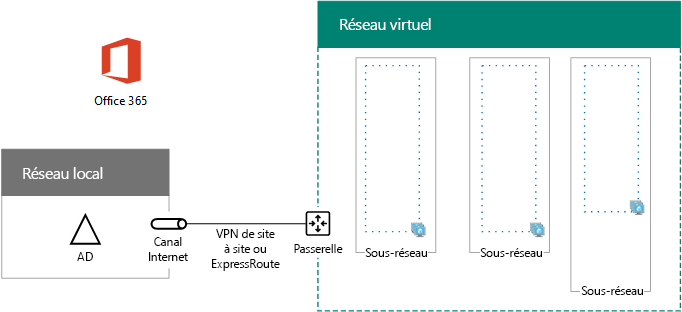

# <a name="high-availability-federated-authentication-phase-1-configure-azure"></a><span data-ttu-id="7252c-103">Authentification fédérée haute disponibilité, phase 1 : Configurer Azure</span><span class="sxs-lookup"><span data-stu-id="7252c-103">High availability federated authentication Phase 1: Configure Azure</span></span>

 <span data-ttu-id="7252c-104">**Résumé :** Configurer l’infrastructure de Microsoft Azure pour authentifier les hôtes haute disponibilité fédérée pour Office 365.</span><span class="sxs-lookup"><span data-stu-id="7252c-104">**Summary:** Configure the Microsoft Azure infrastructure to host high availability federated authentication for Office 365.</span></span>
  
<span data-ttu-id="7252c-p101">Dans cette phase, vous créez les groupes de ressources, les comptes de stockage, les jeux virtuels de réseau (VNet) et la disponibilité dans Azure qui hébergera les ordinateurs virtuels dans les phases 2, 3 et 4. Vous devez terminer cette phase avant de passer à [haute disponibilité fédérés d’authentification Phase 2 : configurer les contrôleurs de domaine](high-availability-federated-authentication-phase-2-configure-domain-controllers.md). Pour toutes les phases, reportez-vous à la section [authentification fédérée de haute disponibilité déploiement pour Office 365 dans Azure](deploy-high-availability-federated-authentication-for-office-365-in-azure.md) .</span><span class="sxs-lookup"><span data-stu-id="7252c-p101">In this phase, you create the resource groups, storage accounts, virtual network (VNet), and availability sets in Azure that will host the virtual machines in phases 2, 3, and 4. You must complete this phase before moving on to [High availability federated authentication Phase 2: Configure domain controllers](high-availability-federated-authentication-phase-2-configure-domain-controllers.md). See [Deploy high availability federated authentication for Office 365 in Azure](deploy-high-availability-federated-authentication-for-office-365-in-azure.md) for all of the phases.</span></span>
  
<span data-ttu-id="7252c-108">Azure doit être configurée avec les composants de base :</span><span class="sxs-lookup"><span data-stu-id="7252c-108">Azure must be provisioned with these basic components:</span></span>
  
- <span data-ttu-id="7252c-109">Groupes de ressources</span><span class="sxs-lookup"><span data-stu-id="7252c-109">Resource groups</span></span>
    
- <span data-ttu-id="7252c-110">Un réseau virtuel Azure intersites (VNet) avec des sous-réseaux pour l’hébergement des machines virtuelles Azure</span><span class="sxs-lookup"><span data-stu-id="7252c-110">A cross-premises Azure virtual network (VNet) with subnets for hosting the Azure virtual machines</span></span>
    
- <span data-ttu-id="7252c-111">Groupes de sécurité réseau pour effectuer l’isolation des sous-réseaux</span><span class="sxs-lookup"><span data-stu-id="7252c-111">Network security groups for performing subnet isolation</span></span>
    
- <span data-ttu-id="7252c-112">Groupes à haute disponibilité</span><span class="sxs-lookup"><span data-stu-id="7252c-112">Availability sets</span></span>
    
## <a name="configure-azure-components"></a><span data-ttu-id="7252c-113">Configurer les composants Azure</span><span class="sxs-lookup"><span data-stu-id="7252c-113">Configure Azure components</span></span>

<span data-ttu-id="7252c-p102">Avant de commencer la configuration des composants d’Azure, renseignez les tableaux ci-dessous. Pour vous aider dans les procédures de configuration d’Azure, imprimer cette section et notez les informations nécessaires ou copier cette section à un document et le remplir. Pour les paramètres de le VNet, indiquez dans le tableau V.</span><span class="sxs-lookup"><span data-stu-id="7252c-p102">Before you begin configuring Azure components, fill in the following tables. To assist you in the procedures for configuring Azure, print this section and write down the needed information or copy this section to a document and fill it in. For the settings of the VNet, fill in Table V.</span></span>
  
|<span data-ttu-id="7252c-117">**Élément**</span><span class="sxs-lookup"><span data-stu-id="7252c-117">**Item**</span></span>|<span data-ttu-id="7252c-118">**Paramètre de configuration**</span><span class="sxs-lookup"><span data-stu-id="7252c-118">**Configuration setting**</span></span>|<span data-ttu-id="7252c-119">**Description**</span><span class="sxs-lookup"><span data-stu-id="7252c-119">**Description**</span></span>|<span data-ttu-id="7252c-120">**Valeur**</span><span class="sxs-lookup"><span data-stu-id="7252c-120">**Value**</span></span>|
|:-----|:-----|:-----|:-----|
|<span data-ttu-id="7252c-121">1.</span><span class="sxs-lookup"><span data-stu-id="7252c-121">1.</span></span>  <br/> |<span data-ttu-id="7252c-122">Nom du réseau virtuel</span><span class="sxs-lookup"><span data-stu-id="7252c-122">VNet name</span></span>  <br/> |<span data-ttu-id="7252c-123">Un nom à attribuer au réseau virtuel (exemple FedAuthNet).</span><span class="sxs-lookup"><span data-stu-id="7252c-123">A name to assign to the VNet (example FedAuthNet).</span></span>  <br/> |<span data-ttu-id="7252c-124">_______________________________</span><span class="sxs-lookup"><span data-stu-id="7252c-124"></span></span>  <br/> |
|<span data-ttu-id="7252c-125">2.</span><span class="sxs-lookup"><span data-stu-id="7252c-125">2.</span></span>  <br/> |<span data-ttu-id="7252c-126">Emplacement de VNet</span><span class="sxs-lookup"><span data-stu-id="7252c-126">VNet location</span></span>  <br/> |<span data-ttu-id="7252c-127">Le centre de données Azure régional qui contiendra le réseau virtuel.</span><span class="sxs-lookup"><span data-stu-id="7252c-127">The regional Azure datacenter that will contain the virtual network.</span></span>  <br/> |<span data-ttu-id="7252c-128">_______________________________</span><span class="sxs-lookup"><span data-stu-id="7252c-128"></span></span>  <br/> |
|<span data-ttu-id="7252c-129">3.</span><span class="sxs-lookup"><span data-stu-id="7252c-129">3.</span></span>  <br/> |<span data-ttu-id="7252c-130">Adresse IP du périphérique VPN</span><span class="sxs-lookup"><span data-stu-id="7252c-130">VPN device IP address</span></span>  <br/> |<span data-ttu-id="7252c-131">Adresse IPv4 publique de l’interface de votre périphérique VPN sur Internet. </span><span class="sxs-lookup"><span data-stu-id="7252c-131">The public IPv4 address of your VPN device's interface on the Internet.</span></span>  <br/> |<span data-ttu-id="7252c-132">_______________________________</span><span class="sxs-lookup"><span data-stu-id="7252c-132"></span></span>  <br/> |
|<span data-ttu-id="7252c-133">4.</span><span class="sxs-lookup"><span data-stu-id="7252c-133">4.</span></span>  <br/> |<span data-ttu-id="7252c-134">Espace d’adressage du réseau virtuel</span><span class="sxs-lookup"><span data-stu-id="7252c-134">VNet address space</span></span>  <br/> |<span data-ttu-id="7252c-p103">Espace d’adressage du réseau virtuel. Renseignez-vous auprès de votre service informatique pour déterminer cet espace d’adressage.</span><span class="sxs-lookup"><span data-stu-id="7252c-p103">The address space for the virtual network. Work with your IT department to determine this address space.</span></span>  <br/> |<span data-ttu-id="7252c-137">_______________________________</span><span class="sxs-lookup"><span data-stu-id="7252c-137"></span></span>  <br/> |
|<span data-ttu-id="7252c-138">5.</span><span class="sxs-lookup"><span data-stu-id="7252c-138">5.</span></span>  <br/> |<span data-ttu-id="7252c-139">Clé partagée IPsec</span><span class="sxs-lookup"><span data-stu-id="7252c-139">IPsec shared key</span></span>  <br/> |<span data-ttu-id="7252c-p104">32 caractères alphanumérique, aléatoire chaîne qui sera utilisée pour authentifier les deux côtés de la connexion VPN de site à site. Fonctionne avec votre service informatique ou un service de sécurité afin de déterminer la valeur de cette clé. Alternativement, consultez [créer une chaîne aléatoire pour une clé pré-partagée IPsec](http://social.technet.microsoft.com/wiki/contents/articles/32330.create-a-random-string-for-an-ipsec-preshared-key.aspx).</span><span class="sxs-lookup"><span data-stu-id="7252c-p104">A 32-character random, alphanumeric string that will be used to authenticate both sides of the site-to-site VPN connection. Work with your IT or security department to determine this key value. Alternately, see [Create a random string for an IPsec preshared key](http://social.technet.microsoft.com/wiki/contents/articles/32330.create-a-random-string-for-an-ipsec-preshared-key.aspx).  </span></span><br/> |<span data-ttu-id="7252c-143">_______________________________</span><span class="sxs-lookup"><span data-stu-id="7252c-143"></span></span>  <br/> |
   
 <span data-ttu-id="7252c-144">**Tableau V : configuration de réseau virtuel entre différents locaux**</span><span class="sxs-lookup"><span data-stu-id="7252c-144">**Table V: Cross-premises virtual network configuration**</span></span>
  
<span data-ttu-id="7252c-p105">Remplissez ensuite le Tableau S pour les sous-réseaux de cette solution. Tous les espaces d’adressage doivent être au format de routage CIDR (Classless Interdomain Routing), également appelé format de préfixe de réseau. Par exemple, 10.24.64.0/20.</span><span class="sxs-lookup"><span data-stu-id="7252c-p105">Next, fill in Table S for the subnets of this solution. All address spaces should be in Classless Interdomain Routing (CIDR) format, also known as network prefix format. An example is 10.24.64.0/20.</span></span>
  
<span data-ttu-id="7252c-p106">Pour les trois premiers sous-réseaux, indiquez un nom et un espace d’adressage IP unique fondé sur l’espace d’adressage de réseau virtuel. Pour le sous-réseau de passerelle, déterminez l’espace d’adressage 27 bits (avec une longueur de préfixe de /27) pour le sous-réseau de passerelle Azure en procédant comme suit :</span><span class="sxs-lookup"><span data-stu-id="7252c-p106">For the first three subnets, specify a name and a single IP address space based on the virtual network address space. For the gateway subnet, determine the 27-bit address space (with a /27 prefix length) for the Azure gateway subnet with the following:</span></span>
  
1. <span data-ttu-id="7252c-150">Définissez la variable bits de l’espace d’adressage du réseau virtuel sur 1, jusqu’aux bits utilisés par le sous-réseau de passerelle, puis définissez les autres sur 0.</span><span class="sxs-lookup"><span data-stu-id="7252c-150">Set the variable bits in the address space of the VNet to 1, up to the bits being used by the gateway subnet, then set the remaining bits to 0.</span></span>
    
2. <span data-ttu-id="7252c-151">Convertissez les bits résultants en nombres décimaux et exprimez-les sous forme d’espace d’adressage, en définissant la longueur du préfixe sur une valeur équivalente à la taille du sous-réseau de passerelle.</span><span class="sxs-lookup"><span data-stu-id="7252c-151">Convert the resulting bits to decimal and express it as an address space with the prefix length set to the size of the gateway subnet.</span></span>
    
<span data-ttu-id="7252c-152">Consultez le [calculateur d’espace adresse des sous-réseaux de la passerelle Azure](https://gallery.technet.microsoft.com/scriptcenter/Address-prefix-calculator-a94b6eed) pour un bloc de commande PowerShell et une application de console C# ou Python qui effectue ce calcul pour vous.</span><span class="sxs-lookup"><span data-stu-id="7252c-152">See [Address space calculator for Azure gateway subnets](https://gallery.technet.microsoft.com/scriptcenter/Address-prefix-calculator-a94b6eed) for a PowerShell command block and C# or Python console application that performs this calculation for you.</span></span>
  
<span data-ttu-id="7252c-153">Renseignez-vous auprès de votre service informatique pour déterminer ces espaces d’adressage à partir de l’espace d’adressage de réseau virtuel.</span><span class="sxs-lookup"><span data-stu-id="7252c-153">Work with your IT department to determine these address spaces from the virtual network address space.</span></span>
  
|<span data-ttu-id="7252c-154">**Élément**</span><span class="sxs-lookup"><span data-stu-id="7252c-154">**Item**</span></span>|<span data-ttu-id="7252c-155">**Nom du sous-réseau**</span><span class="sxs-lookup"><span data-stu-id="7252c-155">**Subnet name**</span></span>|<span data-ttu-id="7252c-156">**Espace d'adressage de sous-réseau**</span><span class="sxs-lookup"><span data-stu-id="7252c-156">**Subnet address space**</span></span>|<span data-ttu-id="7252c-157">**Objectif**</span><span class="sxs-lookup"><span data-stu-id="7252c-157">**Purpose**</span></span>|
|:-----|:-----|:-----|:-----|
|<span data-ttu-id="7252c-158">1.</span><span class="sxs-lookup"><span data-stu-id="7252c-158">1.</span></span>  <br/> |<span data-ttu-id="7252c-159">_______________________________</span><span class="sxs-lookup"><span data-stu-id="7252c-159"></span></span>  <br/> |<span data-ttu-id="7252c-160">_______________________________</span><span class="sxs-lookup"><span data-stu-id="7252c-160"></span></span>  <br/> |<span data-ttu-id="7252c-161">Le sous-réseau utilisé par le contrôleur de domaine Windows Server Active Directory (AD) et les machines virtuelles du serveur DirSync.</span><span class="sxs-lookup"><span data-stu-id="7252c-161">The subnet used by the Windows Server Active Directory (AD) domain controller and DirSync server virtual machines (VMs).</span></span>  <br/> |
|<span data-ttu-id="7252c-162">2.</span><span class="sxs-lookup"><span data-stu-id="7252c-162">2.</span></span>  <br/> |<span data-ttu-id="7252c-163">_______________________________</span><span class="sxs-lookup"><span data-stu-id="7252c-163"></span></span>  <br/> |<span data-ttu-id="7252c-164">_______________________________</span><span class="sxs-lookup"><span data-stu-id="7252c-164"></span></span>  <br/> |<span data-ttu-id="7252c-165">Le sous-réseau utilisé par les machines virtuelles AD FS.</span><span class="sxs-lookup"><span data-stu-id="7252c-165">The subnet used by the AD FS VMs.</span></span>  <br/> |
|<span data-ttu-id="7252c-166">3.</span><span class="sxs-lookup"><span data-stu-id="7252c-166">3.</span></span>  <br/> |<span data-ttu-id="7252c-167">_______________________________</span><span class="sxs-lookup"><span data-stu-id="7252c-167"></span></span>  <br/> |<span data-ttu-id="7252c-168">_______________________________</span><span class="sxs-lookup"><span data-stu-id="7252c-168"></span></span>  <br/> |<span data-ttu-id="7252c-169">Le sous-réseau utilisé par les machines virtuelles du proxy d’application web.</span><span class="sxs-lookup"><span data-stu-id="7252c-169">The subnet used by the web application proxy VMs.</span></span>  <br/> |
|<span data-ttu-id="7252c-170">4.</span><span class="sxs-lookup"><span data-stu-id="7252c-170">4.</span></span>  <br/> |<span data-ttu-id="7252c-171">GatewaySubnet</span><span class="sxs-lookup"><span data-stu-id="7252c-171">GatewaySubnet</span></span>  <br/> |<span data-ttu-id="7252c-172">_______________________________</span><span class="sxs-lookup"><span data-stu-id="7252c-172"></span></span>  <br/> |<span data-ttu-id="7252c-173">Sous-réseau utilisé par les machines virtuelles de la passerelle Azure.</span><span class="sxs-lookup"><span data-stu-id="7252c-173">The subnet used by the Azure gateway VMs.</span></span>  <br/> |
   
 <span data-ttu-id="7252c-174">**Tableau S : sous-réseaux dans le réseau virtuel**</span><span class="sxs-lookup"><span data-stu-id="7252c-174">**Table S: Subnets in the virtual network**</span></span>
  
<span data-ttu-id="7252c-175">Ensuite, renseignez le Tableau I pour les adresses IP statiques affectées à des machines virtuelles et à des instances d’équilibreur de charge.</span><span class="sxs-lookup"><span data-stu-id="7252c-175">Next, fill in Table I for the static IP addresses assigned to virtual machines and load balancer instances.</span></span>
  
|<span data-ttu-id="7252c-176">**Élément**</span><span class="sxs-lookup"><span data-stu-id="7252c-176">**Item**</span></span>|<span data-ttu-id="7252c-177">**Objectif**</span><span class="sxs-lookup"><span data-stu-id="7252c-177">**Purpose**</span></span>|<span data-ttu-id="7252c-178">**Adresse IP du sous-réseau**</span><span class="sxs-lookup"><span data-stu-id="7252c-178">**IP address on the subnet**</span></span>|<span data-ttu-id="7252c-179">**Valeur**</span><span class="sxs-lookup"><span data-stu-id="7252c-179">**Value**</span></span>|
|:-----|:-----|:-----|:-----|
|<span data-ttu-id="7252c-180">1.</span><span class="sxs-lookup"><span data-stu-id="7252c-180">1.</span></span>  <br/> |<span data-ttu-id="7252c-181">Adresse IP statique du premier contrôleur de domaine</span><span class="sxs-lookup"><span data-stu-id="7252c-181">Static IP address of the first domain controller</span></span>  <br/> |<span data-ttu-id="7252c-182">La quatrième adresse IP possible pour l’espace d’adressage du sous-réseau défini dans l’Élément 1 du Tableau S.</span><span class="sxs-lookup"><span data-stu-id="7252c-182">The fourth possible IP address for the address space of the subnet defined in Item 1 of Table S.</span></span>  <br/> |<span data-ttu-id="7252c-183">_______________________________</span><span class="sxs-lookup"><span data-stu-id="7252c-183"></span></span>  <br/> |
|<span data-ttu-id="7252c-184">2.</span><span class="sxs-lookup"><span data-stu-id="7252c-184">2.</span></span>  <br/> |<span data-ttu-id="7252c-185">Adresse IP statique du deuxième contrôleur de domaine</span><span class="sxs-lookup"><span data-stu-id="7252c-185">Static IP address of the second domain controller</span></span>  <br/> |<span data-ttu-id="7252c-186">La cinquième adresse IP possible pour l’espace d’adressage du sous-réseau défini dans l’Élément 1 du Tableau S.</span><span class="sxs-lookup"><span data-stu-id="7252c-186">The fifth possible IP address for the address space of the subnet defined in Item 1 of Table S.</span></span>  <br/> |<span data-ttu-id="7252c-187">_______________________________</span><span class="sxs-lookup"><span data-stu-id="7252c-187"></span></span>  <br/> |
|<span data-ttu-id="7252c-188">3.</span><span class="sxs-lookup"><span data-stu-id="7252c-188">3.</span></span>  <br/> |<span data-ttu-id="7252c-189">Adresse IP statique du serveur DirSync</span><span class="sxs-lookup"><span data-stu-id="7252c-189">Static IP address of the DirSync server</span></span>  <br/> |<span data-ttu-id="7252c-190">La sixième adresse IP possible pour l’espace d’adressage du sous-réseau défini dans l’Élément 1 du Tableau S. </span><span class="sxs-lookup"><span data-stu-id="7252c-190">The sixth possible IP address for the address space of the subnet defined in Item 1 of Table S.</span></span>  <br/> |<span data-ttu-id="7252c-191">_______________________________</span><span class="sxs-lookup"><span data-stu-id="7252c-191"></span></span>  <br/> |
|<span data-ttu-id="7252c-192">4.</span><span class="sxs-lookup"><span data-stu-id="7252c-192">4.</span></span>  <br/> |<span data-ttu-id="7252c-193">Adresse IP statique de l’équilibreur de charge interne des serveurs AD FS</span><span class="sxs-lookup"><span data-stu-id="7252c-193">Static IP address of the internal load balancer for the AD FS servers</span></span>  <br/> |<span data-ttu-id="7252c-194">La quatrième adresse IP possible pour l’espace d’adressage du sous-réseau défini dans l’Élément 2 du Tableau S.</span><span class="sxs-lookup"><span data-stu-id="7252c-194">The fourth possible IP address for the address space of the subnet defined in Item 2 of Table S.</span></span>  <br/> |<span data-ttu-id="7252c-195">_______________________________</span><span class="sxs-lookup"><span data-stu-id="7252c-195"></span></span>  <br/> |
|<span data-ttu-id="7252c-196">5.</span><span class="sxs-lookup"><span data-stu-id="7252c-196">5.</span></span>  <br/> |<span data-ttu-id="7252c-197">Adresse IP statique du premier serveur AD FS</span><span class="sxs-lookup"><span data-stu-id="7252c-197">Static IP address of the first AD FS server</span></span>  <br/> |<span data-ttu-id="7252c-198">La cinquième adresse IP possible pour l’espace d’adressage du sous-réseau défini dans l’Élément 2 du Tableau S.</span><span class="sxs-lookup"><span data-stu-id="7252c-198">The fifth possible IP address for the address space of the subnet defined in Item 2 of Table S.</span></span>  <br/> |<span data-ttu-id="7252c-199">_______________________________</span><span class="sxs-lookup"><span data-stu-id="7252c-199"></span></span>  <br/> |
|<span data-ttu-id="7252c-200">6.</span><span class="sxs-lookup"><span data-stu-id="7252c-200">6.</span></span>  <br/> |<span data-ttu-id="7252c-201">Adresse IP statique du deuxième serveur AD FS</span><span class="sxs-lookup"><span data-stu-id="7252c-201">Static IP address of the second AD FS server</span></span>  <br/> |<span data-ttu-id="7252c-202">La sixième adresse IP possible pour l’espace d’adressage du sous-réseau défini dans l’Élément 2 du Tableau S.</span><span class="sxs-lookup"><span data-stu-id="7252c-202">The sixth possible IP address for the address space of the subnet defined in Item 2 of Table S.</span></span>  <br/> |<span data-ttu-id="7252c-203">_______________________________</span><span class="sxs-lookup"><span data-stu-id="7252c-203"></span></span>  <br/> |
|<span data-ttu-id="7252c-204">7.</span><span class="sxs-lookup"><span data-stu-id="7252c-204">7.</span></span>  <br/> |<span data-ttu-id="7252c-205">Adresse IP statique du premier serveur proxy d’application web</span><span class="sxs-lookup"><span data-stu-id="7252c-205">Static IP address of the first web application proxy server</span></span>  <br/> |<span data-ttu-id="7252c-206">La quatrième adresse IP possible pour l’espace d’adressage du sous-réseau défini dans l’Élément 3 du Tableau S.</span><span class="sxs-lookup"><span data-stu-id="7252c-206">The fourth possible IP address for the address space of the subnet defined in Item 3 of Table S.</span></span>  <br/> |<span data-ttu-id="7252c-207">_______________________________</span><span class="sxs-lookup"><span data-stu-id="7252c-207"></span></span>  <br/> |
|<span data-ttu-id="7252c-208">8.</span><span class="sxs-lookup"><span data-stu-id="7252c-208">8.</span></span>  <br/> |<span data-ttu-id="7252c-209">Adresse IP statique du deuxième serveur proxy d’application web</span><span class="sxs-lookup"><span data-stu-id="7252c-209">Static IP address of the second web application proxy server</span></span>  <br/> |<span data-ttu-id="7252c-210">La cinquième adresse IP possible pour l’espace d’adressage du sous-réseau défini dans l’Élément 3 du Tableau S.</span><span class="sxs-lookup"><span data-stu-id="7252c-210">The fifth possible IP address for the address space of the subnet defined in Item 3 of Table S.</span></span>  <br/> |<span data-ttu-id="7252c-211">_______________________________</span><span class="sxs-lookup"><span data-stu-id="7252c-211"></span></span>  <br/> |
   
 <span data-ttu-id="7252c-212">**Table i : statique adresses du réseau virtuel**</span><span class="sxs-lookup"><span data-stu-id="7252c-212">**Table I: Static IP addresses in the virtual network**</span></span>
  
<span data-ttu-id="7252c-213">Pour deux serveurs DNS (Domain Name System) de votre réseau local que vous souhaitez utiliser lors de la configuration initiale des contrôleurs de domaine dans votre réseau virtuel, renseignez le tableau D. Renseignez-vous auprès de votre service informatique pour déterminer cette liste.</span><span class="sxs-lookup"><span data-stu-id="7252c-213">For two Domain Name System (DNS) servers in your on-premises network that you want to use when initially setting up the domain controllers in your virtual network, fill in Table D. Work with your IT department to determine this list.</span></span>
  
|<span data-ttu-id="7252c-214">**Élément**</span><span class="sxs-lookup"><span data-stu-id="7252c-214">**Item**</span></span>|<span data-ttu-id="7252c-215">**Nom convivial du serveur DNS**</span><span class="sxs-lookup"><span data-stu-id="7252c-215">**DNS server friendly name**</span></span>|<span data-ttu-id="7252c-216">**Adresse IP du serveur DNS**</span><span class="sxs-lookup"><span data-stu-id="7252c-216">**DNS server IP address**</span></span>|
|:-----|:-----|:-----|
|<span data-ttu-id="7252c-217">1.</span><span class="sxs-lookup"><span data-stu-id="7252c-217">1.</span></span>  <br/> |<span data-ttu-id="7252c-218">_______________________________</span><span class="sxs-lookup"><span data-stu-id="7252c-218"></span></span>  <br/> |<span data-ttu-id="7252c-219">_______________________________</span><span class="sxs-lookup"><span data-stu-id="7252c-219"></span></span>  <br/> |
|<span data-ttu-id="7252c-220">2.</span><span class="sxs-lookup"><span data-stu-id="7252c-220">2.</span></span>  <br/> |<span data-ttu-id="7252c-221">_______________________________</span><span class="sxs-lookup"><span data-stu-id="7252c-221"></span></span>  <br/> |<span data-ttu-id="7252c-222">_______________________________</span><span class="sxs-lookup"><span data-stu-id="7252c-222"></span></span>  <br/> |
   
 <span data-ttu-id="7252c-223">**Tableau D : serveurs DNS locaux**</span><span class="sxs-lookup"><span data-stu-id="7252c-223">**Table D: On-premises DNS servers**</span></span>
  
<span data-ttu-id="7252c-p107">Pour acheminer les paquets du réseau virtuel intersites vers le réseau de votre organisation par le biais de la connexion VPN de site à site, vous devez configurer le réseau virtuel avec un réseau local qui contient la liste des espaces d’adressage (utilisant la notation CIDR) pour l’ensemble des emplacements qui doivent être atteints sur le réseau local de votre organisation. La liste des espaces d’adressage qui définissent votre réseau local doit être unique et ne doit pas se chevaucher avec l’espace d’adressage utilisé pour d’autres réseaux virtuels ou d’autres réseaux locaux.</span><span class="sxs-lookup"><span data-stu-id="7252c-p107">To route packets from the cross-premises network to your organization network across the site-to-site VPN connection, you must configure the virtual network with a local network that contains a list of the address spaces (in CIDR notation) for all of the reachable locations on your organization's on-premises network. The list of address spaces that define your local network must be unique and must not overlap with the address space used for other virtual networks or other local networks.</span></span>
  
<span data-ttu-id="7252c-p108">Pour l’ensemble des espaces d’adressage du réseau local, remplissez le tableau L. Notez que le tableau comporte trois entrées vides, mais vous aurez généralement besoin d’en ajouter. Renseignez-vous auprès de votre service informatique pour déterminer cette liste d’espaces d’adressage.</span><span class="sxs-lookup"><span data-stu-id="7252c-p108">For the set of local network address spaces, fill in Table L. Note that three blank entries are listed but you will typically need more. Work with your IT department to determine this list of address spaces.</span></span>
  
|<span data-ttu-id="7252c-228">**Élément**</span><span class="sxs-lookup"><span data-stu-id="7252c-228">**Item**</span></span>|<span data-ttu-id="7252c-229">**Espace d'adressage du réseau local**</span><span class="sxs-lookup"><span data-stu-id="7252c-229">**Local network address space**</span></span>|
|:-----|:-----|
|<span data-ttu-id="7252c-230">1.</span><span class="sxs-lookup"><span data-stu-id="7252c-230">1.</span></span>  <br/> |<span data-ttu-id="7252c-231">_______________________________</span><span class="sxs-lookup"><span data-stu-id="7252c-231"></span></span>  <br/> |
|<span data-ttu-id="7252c-232">2.</span><span class="sxs-lookup"><span data-stu-id="7252c-232">2.</span></span>  <br/> |<span data-ttu-id="7252c-233">_______________________________</span><span class="sxs-lookup"><span data-stu-id="7252c-233"></span></span>  <br/> |
|<span data-ttu-id="7252c-234">3.</span><span class="sxs-lookup"><span data-stu-id="7252c-234">3.</span></span>  <br/> |<span data-ttu-id="7252c-235">_______________________________</span><span class="sxs-lookup"><span data-stu-id="7252c-235"></span></span>  <br/> |
   
 <span data-ttu-id="7252c-236">**Tableau L : préfixes d'adresse pour le réseau local**</span><span class="sxs-lookup"><span data-stu-id="7252c-236">**Table L: Address prefixes for the local network**</span></span>
  
<span data-ttu-id="7252c-237">Commençons à présent à créer l’infrastructure Azure pour héberger votre authentification fédérée pour Office 365.</span><span class="sxs-lookup"><span data-stu-id="7252c-237">Now let's begin building the Azure infrastructure to host your federated authentication for Office 365.</span></span>
  
> [!NOTE]
> <span data-ttu-id="7252c-p109">La commande suivante définit utiliser la dernière version de PowerShell d’Azure. Reportez-vous à la section [mise en route avec les applets de commande PowerShell d’Azure](https://docs.microsoft.com/en-us/powershell/azureps-cmdlets-docs/).</span><span class="sxs-lookup"><span data-stu-id="7252c-p109">The following command sets use the latest version of Azure PowerShell. See [Get started with Azure PowerShell cmdlets](https://docs.microsoft.com/en-us/powershell/azureps-cmdlets-docs/).</span></span> 
  
<span data-ttu-id="7252c-240">Tout d’abord, démarrez une invite PowerShell Azure et connectez-vous à votre compte.</span><span class="sxs-lookup"><span data-stu-id="7252c-240">First, start an Azure PowerShell prompt and login to your account.</span></span>
  
```
Login-AzureRMAccount
```

> [!TIP]
> <span data-ttu-id="7252c-241">Pour un fichier texte qui contient toutes les commandes de PowerShell dans cet article et un classeur Microsoft Excel configuration qui génère des blocs de commande PowerShell prête à exécuter en fonction de vos paramètres personnalisés, consultez la [l’authentification fédérée pour Office 365 dans Kit de déploiement d’Azure](https://gallery.technet.microsoft.com/Federated-Authentication-8a9f1664).</span><span class="sxs-lookup"><span data-stu-id="7252c-241">For a text file that contains all of the PowerShell commands in this article and a Microsoft Excel configuration workbook that generates ready-to-run PowerShell command blocks based on your custom settings, see the [Federated Authentication for Office 365 in Azure Deployment Kit](https://gallery.technet.microsoft.com/Federated-Authentication-8a9f1664).</span></span> 
  
<span data-ttu-id="7252c-242">Obtenez le nom de votre abonnement à l'aide de la commande suivante.</span><span class="sxs-lookup"><span data-stu-id="7252c-242">Get your subscription name using the following command.</span></span>
  
```
Get-AzureRMSubscription | Sort Name | Select Name
```

<span data-ttu-id="7252c-243">Pour les versions antérieures de PowerShell d’Azure, utilisez plutôt cette commande.</span><span class="sxs-lookup"><span data-stu-id="7252c-243">For older versions of Azure PowerShell, use this command instead.</span></span>
  
```
Get-AzureRMSubscription | Sort Name | Select SubscriptionName
```

<span data-ttu-id="7252c-p110">Définissez votre abonnement Azure. Remplacez tout entre guillemets, y compris la \< et > caractères, avec le nom correct.</span><span class="sxs-lookup"><span data-stu-id="7252c-p110">Set your Azure subscription. Replace everything within the quotes, including the \< and > characters, with the correct name.</span></span>
  
```
$subscr="<subscription name>"
Get-AzureRmSubscription -SubscriptionName $subscr | Select-AzureRmSubscription
```

<span data-ttu-id="7252c-p111">Ensuite, vous allez créer les nouveaux groupes de ressources. Pour déterminer un ensemble unique de noms de groupes de ressources, utilisez cette commande pour répertorier vos groupes de ressources existants.</span><span class="sxs-lookup"><span data-stu-id="7252c-p111">Next, create the new resource groups. To determine a unique set of resource group names, use this command to list your existing resource groups.</span></span>
  
```
Get-AzureRMResourceGroup | Sort ResourceGroupName | Select ResourceGroupName
```

<span data-ttu-id="7252c-248">Renseignez le tableau suivant pour l’ensemble unique de noms de groupes de ressources.</span><span class="sxs-lookup"><span data-stu-id="7252c-248">Fill in the following table for the set of unique resource group names.</span></span>
  
|<span data-ttu-id="7252c-249">**Élément**</span><span class="sxs-lookup"><span data-stu-id="7252c-249">**Item**</span></span>|<span data-ttu-id="7252c-250">**Nom du groupe de ressources**</span><span class="sxs-lookup"><span data-stu-id="7252c-250">**Resource group name**</span></span>|<span data-ttu-id="7252c-251">**Objectif**</span><span class="sxs-lookup"><span data-stu-id="7252c-251">**Purpose**</span></span>|
|:-----|:-----|:-----|
|<span data-ttu-id="7252c-252">1.</span><span class="sxs-lookup"><span data-stu-id="7252c-252">1.</span></span>  <br/> |<span data-ttu-id="7252c-253">_______________________________</span><span class="sxs-lookup"><span data-stu-id="7252c-253"></span></span>  <br/> |<span data-ttu-id="7252c-254">Contrôleurs de domaine</span><span class="sxs-lookup"><span data-stu-id="7252c-254">Domain controllers</span></span>  <br/> |
|<span data-ttu-id="7252c-255">2.</span><span class="sxs-lookup"><span data-stu-id="7252c-255">2.</span></span>  <br/> |<span data-ttu-id="7252c-256">_______________________________</span><span class="sxs-lookup"><span data-stu-id="7252c-256"></span></span>  <br/> |<span data-ttu-id="7252c-257">Serveurs AD FS</span><span class="sxs-lookup"><span data-stu-id="7252c-257">AD FS servers</span></span>  <br/> |
|<span data-ttu-id="7252c-258">3.</span><span class="sxs-lookup"><span data-stu-id="7252c-258">3.</span></span>  <br/> |<span data-ttu-id="7252c-259">_______________________________</span><span class="sxs-lookup"><span data-stu-id="7252c-259"></span></span>  <br/> |<span data-ttu-id="7252c-260">Serveurs proxy d’application web</span><span class="sxs-lookup"><span data-stu-id="7252c-260">Web application proxy servers</span></span>  <br/> |
|<span data-ttu-id="7252c-261">4.</span><span class="sxs-lookup"><span data-stu-id="7252c-261">4.</span></span>  <br/> |<span data-ttu-id="7252c-262">_______________________________</span><span class="sxs-lookup"><span data-stu-id="7252c-262"></span></span>  <br/> |<span data-ttu-id="7252c-263">Éléments de l’infrastructure</span><span class="sxs-lookup"><span data-stu-id="7252c-263">Infrastructure elements</span></span>  <br/> |
   
 <span data-ttu-id="7252c-264">**Table R: les groupes de ressources**</span><span class="sxs-lookup"><span data-stu-id="7252c-264">**Table R: Resource groups**</span></span>
  
<span data-ttu-id="7252c-265">Créez vos nouveaux groupes de ressources avec ces commandes.</span><span class="sxs-lookup"><span data-stu-id="7252c-265">Create your new resource groups with these commands.</span></span>
  
```
$locName="<an Azure location, such as West US>"
$rgName="<Table R - Item 1 - Name column>"
New-AzureRMResourceGroup -Name $rgName -Location $locName
$rgName="<Table R - Item 2 - Name column>"
New-AzureRMResourceGroup -Name $rgName -Location $locName
$rgName="<Table R - Item 3 - Name column>"
New-AzureRMResourceGroup -Name $rgName -Location $locName
$rgName="<Table R - Item 4 - Name column>"
New-AzureRMResourceGroup -Name $rgName -Location $locName
```

<span data-ttu-id="7252c-266">Créez ensuite le réseau virtuel Azure et ses sous-réseaux.</span><span class="sxs-lookup"><span data-stu-id="7252c-266">Next, you create the Azure virtual network and its subnets.</span></span>
  
```
$rgName="<Table R - Item 4 - Resource group name column>"
$locName="<your Azure location>"
$vnetName="<Table V - Item 1 - Value column>"
$vnetAddrPrefix="<Table V - Item 4 - Value column>"
$dnsServers=@( "<Table D - Item 1 - DNS server IP address column>", "<Table D - Item 2 - DNS server IP address column>" )
# Get the shortened version of the location
$locShortName=(Get-AzureRmResourceGroup -Name $rgName).Location

# Create the subnets
$subnet1Name="<Table S - Item 1 - Subnet name column>"
$subnet1Prefix="<Table S - Item 1 - Subnet address space column>"
$subnet1=New-AzureRMVirtualNetworkSubnetConfig -Name $subnet1Name -AddressPrefix $subnet1Prefix
$subnet2Name="<Table S - Item 2 - Subnet name column>"
$subnet2Prefix="<Table S - Item 2 - Subnet address space column>"
$subnet2=New-AzureRMVirtualNetworkSubnetConfig -Name $subnet2Name -AddressPrefix $subnet2Prefix
$subnet3Name="<Table S - Item 3 - Subnet name column>"
$subnet3Prefix="<Table S - Item 3 - Subnet address space column>"
$subnet3=New-AzureRMVirtualNetworkSubnetConfig -Name $subnet3Name -AddressPrefix $subnet3Prefix
$gwSubnet4Prefix="<Table S - Item 4 - Subnet address space column>"
$gwSubnet=New-AzureRMVirtualNetworkSubnetConfig -Name "GatewaySubnet" -AddressPrefix $gwSubnet4Prefix

# Create the virtual network
New-AzureRMVirtualNetwork -Name $vnetName -ResourceGroupName $rgName -Location $locName -AddressPrefix $vnetAddrPrefix -Subnet $gwSubnet,$subnet1,$subnet2,$subnet3 -DNSServer $dnsServers

```

<span data-ttu-id="7252c-p112">Ensuite, vous créez le réseau pour chaque sous-réseau contenant des ordinateurs virtuels, les groupes de sécurité. Pour effectuer l’isolation de sous-réseau, vous pouvez ajouter des règles pour les types spécifiques de trafic autorisé ou refusé au groupe de sécurité réseau d’un sous-réseau.</span><span class="sxs-lookup"><span data-stu-id="7252c-p112">Next, you create network security groups for each subnet that contains virtual machines. To perform subnet isolation, you can add rules for the specific types of traffic allowed or denied to the network security group of a subnet.</span></span>
  
```
# Create network security groups
$vnet=Get-AzureRMVirtualNetwork -ResourceGroupName $rgName -Name $vnetName

New-AzureRMNetworkSecurityGroup -Name $subnet1Name -ResourceGroupName $rgName -Location $locShortName
$nsg=Get-AzureRMNetworkSecurityGroup -Name $subnet1Name -ResourceGroupName $rgName
Set-AzureRMVirtualNetworkSubnetConfig -VirtualNetwork $vnet -Name $subnet1Name -AddressPrefix $subnet1Prefix -NetworkSecurityGroup $nsg

New-AzureRMNetworkSecurityGroup -Name $subnet2Name -ResourceGroupName $rgName -Location $locShortName
$nsg=Get-AzureRMNetworkSecurityGroup -Name $subnet2Name -ResourceGroupName $rgName
Set-AzureRMVirtualNetworkSubnetConfig -VirtualNetwork $vnet -Name $subnet2Name -AddressPrefix $subnet2Prefix -NetworkSecurityGroup $nsg

New-AzureRMNetworkSecurityGroup -Name $subnet3Name -ResourceGroupName $rgName -Location $locShortName
$nsg=Get-AzureRMNetworkSecurityGroup -Name $subnet3Name -ResourceGroupName $rgName
Set-AzureRMVirtualNetworkSubnetConfig -VirtualNetwork $vnet -Name $subnet3Name -AddressPrefix $subnet3Prefix -NetworkSecurityGroup $nsg
```

<span data-ttu-id="7252c-269">Utilisez ces commandes pour créer les passerelles pour la connexion VPN de site à site.</span><span class="sxs-lookup"><span data-stu-id="7252c-269">Next, use these commands to create the gateways for the site-to-site VPN connection.</span></span>
  
```
$rgName="<Table R - Item 4 - Resource group name column>"
$locName="<Azure location>"
$vnetName="<Table V - Item 1 - Value column>"
$vnet=Get-AzureRMVirtualNetwork -Name $vnetName -ResourceGroupName $rgName
$subnet=Get-AzureRmVirtualNetworkSubnetConfig -VirtualNetwork $vnet -Name "GatewaySubnet"

# Attach a virtual network gateway to a public IP address and the gateway subnet
$publicGatewayVipName="PublicIPAddress"
$vnetGatewayIpConfigName="PublicIPConfig"
New-AzureRMPublicIpAddress -Name $vnetGatewayIpConfigName -ResourceGroupName $rgName -Location $locName -AllocationMethod Dynamic
$publicGatewayVip=Get-AzureRMPublicIpAddress -Name $vnetGatewayIpConfigName -ResourceGroupName $rgName
$vnetGatewayIpConfig=New-AzureRMVirtualNetworkGatewayIpConfig -Name $vnetGatewayIpConfigName -PublicIpAddressId $publicGatewayVip.Id -Subnet $subnet

# Create the Azure gateway
$vnetGatewayName="AzureGateway"
$vnetGateway=New-AzureRMVirtualNetworkGateway -Name $vnetGatewayName -ResourceGroupName $rgName -Location $locName -GatewayType Vpn -VpnType RouteBased -IpConfigurations $vnetGatewayIpConfig

# Create the gateway for the local network
$localGatewayName="LocalNetGateway"
$localGatewayIP="<Table V - Item 3 - Value column>"
$localNetworkPrefix=@( <comma-separated, double-quote enclosed list of the local network address prefixes from Table L, example: "10.1.0.0/24", "10.2.0.0/24"> )
$localGateway=New-AzureRMLocalNetworkGateway -Name $localGatewayName -ResourceGroupName $rgName -Location $locName -GatewayIpAddress $localGatewayIP -AddressPrefix $localNetworkPrefix

# Define the Azure virtual network VPN connection
$vnetConnectionName="S2SConnection"
$vnetConnectionKey="<Table V - Item 5 - Value column>"
$vnetConnection=New-AzureRMVirtualNetworkGatewayConnection -Name $vnetConnectionName -ResourceGroupName $rgName -Location $locName -ConnectionType IPsec -SharedKey $vnetConnectionKey -VirtualNetworkGateway1 $vnetGateway -LocalNetworkGateway2 $localGateway

```

> [!NOTE]
> <span data-ttu-id="7252c-p113">Authentification fédérée des utilisateurs individuels ne repose pas sur toutes les ressources locales. Toutefois, si cette connexion VPN de site à site devient indisponible, les contrôleurs de domaine dans le VNet ne recevront pas les mises à jour des comptes d’utilisateurs et de groupes dans l’Active Directory du serveur Windows local. Pour vous assurer que cela ne se produit pas, vous pouvez configurer la haute disponibilité pour votre connexion VPN de site à site. Pour plus d’informations, reportez-vous à la section [hautement disponible coexistence et VNet à VNet connectivité](https://docs.microsoft.com/azure/vpn-gateway/vpn-gateway-highlyavailable)</span><span class="sxs-lookup"><span data-stu-id="7252c-p113">Federated authentication of individual users does not rely on any on-premises resources. However, if this site-to-site VPN connection becomes unavailable, the domain controllers in the VNet will not receive updates to user accounts and groups made in the on-premises Windows Server AD. To ensure this does not happen, you can configure high availability for your site-to-site VPN connection. For more information, see [Highly Available Cross-Premises and VNet-to-VNet Connectivity](https://docs.microsoft.com/azure/vpn-gateway/vpn-gateway-highlyavailable)</span></span>
  
<span data-ttu-id="7252c-274">Ensuite, enregistrez l’adresse IPv4 publique de la passerelle VPN Azure pour votre réseau virtuel à partir de l’affichage de cette commande :</span><span class="sxs-lookup"><span data-stu-id="7252c-274">Next, record the public IPv4 address of the Azure VPN gateway for your virtual network from the display of this command:</span></span>
  
```
Get-AzureRMPublicIpAddress -Name $publicGatewayVipName -ResourceGroupName $rgName
```

<span data-ttu-id="7252c-p114">Ensuite, configurez votre périphérique VPN local pour se connecter à la passerelle VPN d’Azure. Pour plus d’informations, voir [configurer l’appareil VPN](https://docs.microsoft.com/azure/vpn-gateway/vpn-gateway-about-vpn-devices).</span><span class="sxs-lookup"><span data-stu-id="7252c-p114">Next, configure your on-premises VPN device to connect to the Azure VPN gateway. For more information, see [Configure your VPN device](https://docs.microsoft.com/azure/vpn-gateway/vpn-gateway-about-vpn-devices).</span></span>
  
<span data-ttu-id="7252c-277">Pour configurer votre périphérique VPN local, vous avez besoin des éléments suivants :</span><span class="sxs-lookup"><span data-stu-id="7252c-277">To configure your on-premises VPN device, you will need the following:</span></span>
  
- <span data-ttu-id="7252c-278">L’adresse IPv4 publique de la passerelle VPN Azure.</span><span class="sxs-lookup"><span data-stu-id="7252c-278">The public IPv4 address of the Azure VPN gateway.</span></span>
    
- <span data-ttu-id="7252c-279">La clé pré-partagée IPsec pour la connexion VPN de site à site (colonne de Table V - article 5 - valeur).</span><span class="sxs-lookup"><span data-stu-id="7252c-279">The IPsec pre-shared key for the site-to-site VPN connection (Table V - Item 5 - Value column).</span></span>
    
<span data-ttu-id="7252c-p115">Ensuite, vérifiez que l’espace d’adressage du réseau virtuel est accessible à partir de votre réseau local. Pour cela, il convient généralement d’ajouter un chemin de routage correspondant à l’espace d’adressage du réseau virtuel à votre périphérique VPN puis d’annoncer ce chemin de routage au reste de l’infrastructure de routage du réseau de votre organisation. Renseignez-vous auprès de votre service informatique pour savoir comment procéder.</span><span class="sxs-lookup"><span data-stu-id="7252c-p115">Next, ensure that the address space of the virtual network is reachable from your on-premises network. This is usually done by adding a route corresponding to the virtual network address space to your VPN device and then advertising that route to the rest of the routing infrastructure of your organization network. Work with your IT department to determine how to do this.</span></span>
  
<span data-ttu-id="7252c-p116">Ensuite, définissez les noms des trois groupes de disponibilité. Remplissez le Tableau A. </span><span class="sxs-lookup"><span data-stu-id="7252c-p116">Next, define the names of three availability sets. Fill out Table A.</span></span> 
  
|<span data-ttu-id="7252c-285">**Élément**</span><span class="sxs-lookup"><span data-stu-id="7252c-285">**Item**</span></span>|<span data-ttu-id="7252c-286">**Objectif**</span><span class="sxs-lookup"><span data-stu-id="7252c-286">**Purpose**</span></span>|<span data-ttu-id="7252c-287">**Nom du jeu de disponibilité**</span><span class="sxs-lookup"><span data-stu-id="7252c-287">**Availability set name**</span></span>|
|:-----|:-----|:-----|
|<span data-ttu-id="7252c-288">1.</span><span class="sxs-lookup"><span data-stu-id="7252c-288">1.</span></span>  <br/> |<span data-ttu-id="7252c-289">Contrôleurs de domaine</span><span class="sxs-lookup"><span data-stu-id="7252c-289">Domain controllers</span></span>  <br/> |<span data-ttu-id="7252c-290">_______________________________</span><span class="sxs-lookup"><span data-stu-id="7252c-290"></span></span>  <br/> |
|<span data-ttu-id="7252c-291">2.</span><span class="sxs-lookup"><span data-stu-id="7252c-291">2.</span></span>  <br/> |<span data-ttu-id="7252c-292">Serveurs AD FS</span><span class="sxs-lookup"><span data-stu-id="7252c-292">AD FS servers</span></span>  <br/> |<span data-ttu-id="7252c-293">_______________________________</span><span class="sxs-lookup"><span data-stu-id="7252c-293"></span></span>  <br/> |
|<span data-ttu-id="7252c-294">3.</span><span class="sxs-lookup"><span data-stu-id="7252c-294">3.</span></span>  <br/> |<span data-ttu-id="7252c-295">Serveurs proxy d’application web</span><span class="sxs-lookup"><span data-stu-id="7252c-295">Web application proxy servers</span></span>  <br/> |<span data-ttu-id="7252c-296">_______________________________</span><span class="sxs-lookup"><span data-stu-id="7252c-296"></span></span>  <br/> |
   
 <span data-ttu-id="7252c-297">**Jeux de table a : disponibilité**</span><span class="sxs-lookup"><span data-stu-id="7252c-297">**Table A: Availability sets**</span></span>
  
<span data-ttu-id="7252c-298">Vous aurez besoin de ces noms lorsque vous créerez les machines virtuelles aux phases 2, 3 et 4.</span><span class="sxs-lookup"><span data-stu-id="7252c-298">You will need these names when you create the virtual machines in phases 2, 3, and 4.</span></span>
  
<span data-ttu-id="7252c-299">Créez les nouveaux groupes de disponibilité avec ces commandes Azure PowerShell.</span><span class="sxs-lookup"><span data-stu-id="7252c-299">Create the new availability sets with these Azure PowerShell commands.</span></span>
  
```
$locName="<the Azure location for your new resource group>"
$rgName="<Table R - Item 1 - Resource group name column>"
$avName="<Table A - Item 1 - Availability set name column>"
New-AzureRMAvailabilitySet -Name $avName -ResourceGroupName $rgName -Location $locName
$rgName="<Table R - Item 2 - Resource group name column>"
$avName="<Table A - Item 2 - Availability set name column>"
New-AzureRMAvailabilitySet -Name $avName -ResourceGroupName $rgName -Location $locName
$rgName="<Table R - Item 3 - Resource group name column>"
$avName="<Table A - Item 3 - Availability set name column>"
New-AzureRMAvailabilitySet -Name $avName -ResourceGroupName $rgName -Location $locName
```

<span data-ttu-id="7252c-300">Voici la configuration obtenue à la fin de cette phase.</span><span class="sxs-lookup"><span data-stu-id="7252c-300">This is the configuration resulting from the successful completion of this phase.</span></span>
  
<span data-ttu-id="7252c-301">**Phase 1 : Infrastructure Azure pour l’authentification fédérée de haute disponibilité pour Office 365**</span><span class="sxs-lookup"><span data-stu-id="7252c-301">**Phase 1: The Azure infrastructure for high availability federated authentication for Office 365**</span></span>


  
## <a name="next-step"></a><span data-ttu-id="7252c-303">Étape suivante</span><span class="sxs-lookup"><span data-stu-id="7252c-303">Next step</span></span>

<span data-ttu-id="7252c-304">Utilisation [haute disponibilité fédérés d’authentification Phase 2 : configurer les contrôleurs de domaine](high-availability-federated-authentication-phase-2-configure-domain-controllers.md) pour poursuivre la configuration de cette charge de travail.</span><span class="sxs-lookup"><span data-stu-id="7252c-304">Use [High availability federated authentication Phase 2: Configure domain controllers](high-availability-federated-authentication-phase-2-configure-domain-controllers.md) to continue with the configuration of this workload.</span></span>
  
## <a name="see-also"></a><span data-ttu-id="7252c-305">See Also</span><span class="sxs-lookup"><span data-stu-id="7252c-305">See Also</span></span>

[<span data-ttu-id="7252c-306">Déployer une authentification fédérée haute disponibilité pour Office 365 dans Azure</span><span class="sxs-lookup"><span data-stu-id="7252c-306">Deploy high availability federated authentication for Office 365 in Azure</span></span>](deploy-high-availability-federated-authentication-for-office-365-in-azure.md)
  
[<span data-ttu-id="7252c-307">Identité fédérée pour votre environnement de développement/test Office 365</span><span class="sxs-lookup"><span data-stu-id="7252c-307">Federated identity for your Office 365 dev/test environment</span></span>](federated-identity-for-your-office-365-dev-test-environment.md)
  
[<span data-ttu-id="7252c-308">Adoption du cloud et solutions hybrides</span><span class="sxs-lookup"><span data-stu-id="7252c-308">Cloud adoption and hybrid solutions</span></span>](cloud-adoption-and-hybrid-solutions.md)

[<span data-ttu-id="7252c-309">Identité fédérée pour Office 365</span><span class="sxs-lookup"><span data-stu-id="7252c-309">Federated identity for Office 365</span></span>](https://support.office.com/article/Understanding-Office-365-identity-and-Azure-Active-Directory-06a189e7-5ec6-4af2-94bf-a22ea225a7a9#bk_federated)


