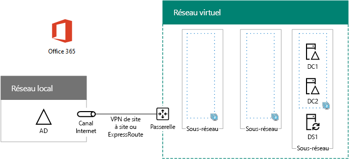

# <a name="high-availability-federated-authentication-phase-2-configure-domain-controllers"></a>Authentification fédérée haute disponibilité, phase 2 : Configurer les contrôleurs de domaine

 **Résumé :** Configurez les contrôleurs de domaine et le serveur DirSync pour votre authentification fédérée haute disponibilité pour Office 365 dans Microsoft Azure.
  
Au cours de cette phase de déploiement de la haute disponibilité pour l’authentification fédérée Office 365 dans les services d’infrastructure Azure, vous configurez deux contrôleurs de domaine et le serveur DirSync dans le réseau virtuel Azure. Les requêtes web client d’authentification peuvent ensuite être authentifiées dans le réseau virtuel Azure, plutôt que d’envoyer ce trafic d’authentification sur le VPN de site à site à votre réseau local.
  
> [!NOTE]
> Active Directory Federation Services (AD FS) ne peut pas utiliser les services de domaine Active Directory d’Azure comme substitut pour les contrôleurs de domaine Windows Server AD. 
  
Vous devez effectuer cette phase avant de passer à [haute disponibilité fédérés authentification Phase 3 : configurer les serveurs AD FS](high-availability-federated-authentication-phase-3-configure-ad-fs-servers.md). Voir [authentification fédérée de déploiement haute disponibilité pour Office 365 dans Azure](deploy-high-availability-federated-authentication-for-office-365-in-azure.md) pour toutes les phases.
  
## <a name="create-the-domain-controller-virtual-machines-in-azure"></a>Créer les machines virtuelles du contrôleur de domaine dans Azure

Tout d'abord, vous devez remplir la colonne du **nom de la machine virtuelle** du tableau M et modifier les tailles de machine virtuelle selon vos besoins dans la colonne **Taille minimale**.
  
|**Élément**|**Nom de la machine virtuelle**|**Image de la galerie**|**Type de stockage**|**Taille minimale**|
|:-----|:-----|:-----|:-----|:-----|
|1.  <br/> | (premier contrôleur de domaine, par exemple DC1)  <br/> |Windows Server 2016 Datacenter  <br/> |Standard_LRS  <br/> |Standard_D2  <br/> |
|2.  <br/> | (deuxième contrôleur de domaine, par exemple DC2)  <br/> |Windows Server 2016 Datacenter  <br/> |Standard_LRS  <br/> |Standard_D2  <br/> |
|3.  <br/> |(Serveur de synchronisation d’annuaire, exemple DS1)  <br/> |Windows Server 2016 Datacenter  <br/> |Standard_LRS  <br/> |Standard_D2  <br/> |
|4.  <br/> |(le premier serveur d’AD FS, exemple ADFS1)  <br/> |Windows Server 2016 Datacenter  <br/> |Standard_LRS  <br/> |Standard_D2  <br/> |
|5.  <br/> |(le second serveur d’AD FS, exemple ADFS2)  <br/> |Windows Server 2016 Datacenter  <br/> |Standard_LRS  <br/> |Standard_D2  <br/> |
|6.  <br/> |(première application serveur proxy web, exemple WEB1)  <br/> |Windows Server 2016 Datacenter  <br/> |Standard_LRS  <br/> |Standard_D2  <br/> |
|7.  <br/> |(deuxième application serveur proxy web, exemple WEB2)  <br/> |Windows Server 2016 Datacenter  <br/> |Standard_LRS  <br/> |Standard_D2  <br/> |
   
 **Tableau M - ordinateurs virtuels pour l’authentification fédérée de haute disponibilité pour Office 365 dans Azure**
  
Pour obtenir la liste complète des tailles de machine virtuelle, reportez-vous à la rubrique [Tailles des machines virtuelles Windows dans Azure](https://docs.microsoft.com/azure/virtual-machines/virtual-machines-windows-sizes).
  
Le bloc de commande PowerShell Azure suivant crée les ordinateurs virtuels pour les deux contrôleurs de domaine. Spécifiez les valeurs pour les variables, suppression de la \< et > caractères. Notez que ce bloc de commande PowerShell Azure utilise des valeurs dans les tableaux suivants :
  
- Tableau M, pour vos machines virtuelles
    
- Tableau R, pour vos groupes de ressources
    
- Tableau V, pour vos paramètres de réseau virtuel
    
- Tableau S, pour vos sous-réseaux
    
- Tableau I, pour vos adresses IP statiques
    
- Tableau A, pour vos groupes à haute disponibilité
    
Rappel défini de Tables R, V, S, I et dans [haute disponibilité fédérés authentification Phase 1 : Azure configurer](high-availability-federated-authentication-phase-1-configure-azure.md).
  
> [!NOTE]
> Les ensembles de commandes suivants utilisent la dernière version d'Azure PowerShell. Reportez-vous à la rubrique relative à la [prise en main des cmdlets Azure PowerShell](https://docs.microsoft.com/en-us/powershell/azureps-cmdlets-docs/). 
  
Lorsque vous avez indiqué toutes les valeurs correctes, exécutez le bloc résultant à l’invite de commandes Azure PowerShell ou dans l’environnement d'écriture de scripts intégré de Windows PowerShell (ISE) sur votre ordinateur local.
  
> [!TIP]
> Pour un fichier texte qui contient toutes les commandes PowerShell dans cet article et un classeur Microsoft Excel configuration qui génère des blocs de commande PowerShell prête à exécuter en fonction de vos paramètres personnalisés, voir l’authentification fédérée pour Office 365 [dans Kit de déploiement Azure](https://gallery.technet.microsoft.com/Federated-Authentication-8a9f1664). 
  
```
# Set up variables common to both virtual machines
$locName="<your Azure location>"
$vnetName="<Table V - Item 1 - Value column>"
$subnetName="<Table S - Item 1 - Value column>"
$avName="<Table A - Item 1 - Availability set name column>"
$rgNameTier="<Table R - Item 1 - Resource group name column>"
$rgNameInfra="<Table R - Item 4 - Resource group name column>"

$rgName=$rgNameInfra
$vnet=Get-AzureRMVirtualNetwork -Name $vnetName -ResourceGroupName $rgName
$subnet=Get-AzureRmVirtualNetworkSubnetConfig -VirtualNetwork $vnet -Name $subnetName

$rgName=$rgNameTier
$avSet=Get-AzureRMAvailabilitySet -Name $avName -ResourceGroupName $rgName 

# Create the first domain controller
$vmName="<Table M - Item 1 - Virtual machine name column>"
$vmSize="<Table M - Item 1 - Minimum size column>"
$staticIP="<Table I - Item 1 - Value column>"
$diskStorageType="<Table M - Item 1 - Storage type column>"
$diskSize=<size of the extra disk for Windows Server AD data in GB>

$nic=New-AzureRMNetworkInterface -Name ($vmName +"-NIC") -ResourceGroupName $rgName -Location $locName -Subnet $subnet -PrivateIpAddress $staticIP
$vm=New-AzureRMVMConfig -VMName $vmName -VMSize $vmSize -AvailabilitySetId $avset.Id
$vm=Set-AzureRmVMOSDisk -VM $vm -Name ($vmName +"-OS") -DiskSizeInGB 128 -CreateOption FromImage -StorageAccountType $diskStorageType
$diskConfig=New-AzureRmDiskConfig -AccountType $diskStorageType -Location $locName -CreateOption Empty -DiskSizeGB $diskSize
$dataDisk1=New-AzureRmDisk -DiskName ($vmName + "-DataDisk1") -Disk $diskConfig -ResourceGroupName $rgName
$vm=Add-AzureRmVMDataDisk -VM $vm -Name ($vmName + "-DataDisk1") -CreateOption Attach -ManagedDiskId $dataDisk1.Id -Lun 1
$cred=Get-Credential -Message "Type the name and password of the local administrator account for the first domain controller." 
$vm=Set-AzureRMVMOperatingSystem -VM $vm -Windows -ComputerName $vmName -Credential $cred -ProvisionVMAgent -EnableAutoUpdate
$vm=Set-AzureRMVMSourceImage -VM $vm -PublisherName MicrosoftWindowsServer -Offer WindowsServer -Skus 2016-Datacenter -Version "latest"
$vm=Add-AzureRMVMNetworkInterface -VM $vm -Id $nic.Id
New-AzureRMVM -ResourceGroupName $rgName -Location $locName -VM $vm

# Create the second domain controller
$vmName="<Table M - Item 2 - Virtual machine name column>"
$vmSize="<Table M - Item 2 - Minimum size column>"
$staticIP="<Table I - Item 2 - Value column>"
$diskStorageType="<Table M - Item 2 - Storage type column>"
$diskSize=<size of the extra disk for Windows Server AD data in GB>

$nic=New-AzureRMNetworkInterface -Name ($vmName +"-NIC") -ResourceGroupName $rgName -Location $locName -Subnet $subnet -PrivateIpAddress $staticIP
$vm=New-AzureRMVMConfig -VMName $vmName -VMSize $vmSize -AvailabilitySetId $avset.Id
$vm=Set-AzureRmVMOSDisk -VM $vm -Name ($vmName +"-OS") -DiskSizeInGB 128 -CreateOption FromImage -StorageAccountType $diskStorageType
$diskConfig=New-AzureRmDiskConfig -AccountType $diskStorageType -Location $locName -CreateOption Empty -DiskSizeGB $diskSize
$dataDisk1=New-AzureRmDisk -DiskName ($vmName + "-DataDisk1") -Disk $diskConfig -ResourceGroupName $rgName
$vm=Add-AzureRmVMDataDisk -VM $vm -Name ($vmName + "-DataDisk1") -CreateOption Attach -ManagedDiskId $dataDisk1.Id -Lun 1
$cred=Get-Credential -Message "Type the name and password of the local administrator account for the second domain controller." 
$vm=Set-AzureRMVMOperatingSystem -VM $vm -Windows -ComputerName $vmName -Credential $cred -ProvisionVMAgent -EnableAutoUpdate
$vm=Set-AzureRMVMSourceImage -VM $vm -PublisherName MicrosoftWindowsServer -Offer WindowsServer -Skus 2016-Datacenter -Version "latest"
$vm=Add-AzureRMVMNetworkInterface -VM $vm -Id $nic.Id
New-AzureRMVM -ResourceGroupName $rgName -Location $locName -VM $vm

# Create the DirSync server
$vmName="<Table M - Item 3 - Virtual machine name column>"
$vmSize="<Table M - Item 3 - Minimum size column>"
$staticIP="<Table I - Item 3 - Value column>"
$diskStorageType="<Table M - Item 3 - Storage type column>"

$nic=New-AzureRMNetworkInterface -Name ($vmName +"-NIC") -ResourceGroupName $rgName -Location $locName -Subnet $subnet -PrivateIpAddress $staticIP
$vm=New-AzureRMVMConfig -VMName $vmName -VMSize $vmSize

$cred=Get-Credential -Message "Type the name and password of the local administrator account for the DirSync server." 
$vm=Set-AzureRMVMOperatingSystem -VM $vm -Windows -ComputerName $vmName -Credential $cred -ProvisionVMAgent -EnableAutoUpdate
$vm=Set-AzureRMVMSourceImage -VM $vm -PublisherName MicrosoftWindowsServer -Offer WindowsServer -Skus 2016-Datacenter -Version "latest"
$vm=Add-AzureRMVMNetworkInterface -VM $vm -Id $nic.Id
$vm=Set-AzureRmVMOSDisk -VM $vm -Name ($vmName +"-OS") -DiskSizeInGB 128 -CreateOption FromImage -StorageAccountType $diskStorageType
New-AzureRMVM -ResourceGroupName $rgName -Location $locName -VM $vm
```

> [!NOTE]
> Étant donné que ces machines virtuelles sont pour une application intranet, ils ne sont pas attribués une adresse IP publique ou une étiquette de nom de domaine DNS et exposés à Internet. Cependant, cela signifie également que vous ne pouvez pas vous connecter à leur à partir du portail Azure. L’option **connexion** n’est pas disponible lorsque vous affichez les propriétés de l’ordinateur virtuel. Utilisez l’accessoire connexion Bureau à distance ou un autre outil de bureau à distance pour se connecter à l’ordinateur virtuel à l’aide de son privé IP adresse intranet ou le nom DNS.
  
## <a name="configure-the-first-domain-controller"></a>Configurer le premier contrôleur de domaine

Utilisez le client Bureau à distance de votre choix et créez une connexion de Bureau à distance pour la machine virtuelle du premier contrôleur de domaine. Utilisez son nom d’ordinateur ou son nom DNS intranet et les informations d’identification du compte Administrateur local.
  
Ensuite, ajoutez le disque de données supplémentaires pour le premier contrôleur de domaine avec cette commande à partir d’un Windows PowerShell invite de commandes **sur le premier ordinateur virtuel de contrôleur domaine**:
  
```
Get-Disk | Where PartitionStyle -eq "RAW" | Initialize-Disk -PartitionStyle MBR -PassThru | New-Partition -AssignDriveLetter -UseMaximumSize | Format-Volume -FileSystem NTFS -NewFileSystemLabel "WSAD Data"
```

Ensuite, testez la connectivité du premier contrôleur de domaine vers des emplacements du réseau de votre organisation à l'aide de la commande **ping** pour effectuer un test ping des noms et des adresses IP des ressources du réseau de votre organisation.
  
Cette procédure permet de vérifier que la résolution de noms DNS fonctionne correctement (que la machine virtuelle est configurée correctement avec les serveurs DNS locaux) et que des paquets peuvent être envoyés vers et depuis le réseau virtuel intersites. Si ce test de base échoue, contactez votre service informatique pour résoudre les problèmes de résolution de noms DNS et de livraison de paquets.
  
Ensuite, à partir de l’invite de commandes Windows PowerShell sur le premier contrôleur de domaine, exécutez les commandes suivantes :
  
```
$domname="<DNS domain name of the domain for which this computer will be a domain controller, such as corp.contoso.com>"
$cred = Get-Credential -Message "Enter credentials of an account with permission to join a new domain controller to the domain"
Install-WindowsFeature AD-Domain-Services -IncludeManagementTools
Install-ADDSDomainController -InstallDns -DomainName $domname  -DatabasePath "F:\NTDS" -SysvolPath "F:\SYSVOL" -LogPath "F:\Logs" -Credential $cred
```

Vous êtes invité à fournir les informations d’identification d’un compte Administrateur de domaine. L’ordinateur redémarre.
  
## <a name="configure-the-second-domain-controller"></a>Configurer le deuxième contrôleur de domaine

Utilisez le client Bureau à distance de votre choix et créez une connexion de Bureau à distance pour la machine virtuelle du deuxième contrôleur de domaine. Utilisez son nom d’ordinateur ou son nom DNS intranet et les informations d’identification du compte Administrateur local.
  
Ensuite, vous devez ajouter le disque de données supplémentaires au deuxième contrôleur de domaine avec cette commande à partir d’un Windows PowerShell invite de commandes **sur l’ordinateur virtuel de contrôleur de deuxième domaine**:
  
```
Get-Disk | Where PartitionStyle -eq "RAW" | Initialize-Disk -PartitionStyle MBR -PassThru | New-Partition -AssignDriveLetter -UseMaximumSize | Format-Volume -FileSystem NTFS -NewFileSystemLabel "WSAD Data"
```

Ensuite, exécutez les commandes suivantes :
  
```
$domname="<DNS domain name of the domain for which this computer will be a domain controller, such as corp.contoso.com>"
$cred = Get-Credential -Message "Enter credentials of an account with permission to join a new domain controller to the domain"
Install-WindowsFeature AD-Domain-Services -IncludeManagementTools
Install-ADDSDomainController -InstallDns -DomainName $domname  -DatabasePath "F:\NTDS" -SysvolPath "F:\SYSVOL" -LogPath "F:\Logs" -Credential $cred

```

Vous êtes invité à fournir les informations d’identification d’un compte Administrateur de domaine. L’ordinateur redémarre.
  
Ensuite, vous devez mettre à jour les serveurs DNS pour votre réseau virtuel afin que Azure affecte les machines virtuelles les adresses IP de deux nouveaux contrôleurs de domaine à utiliser en tant que leurs serveurs DNS. Renseignez les variables, puis exécutez ces commandes à partir d’une invite de commandes Windows PowerShell sur votre ordinateur local :
  
```
$rgName="<Table R - Item 4 - Resource group name column>"
$adrgName="<Table R - Item 1 - Resource group name column>"
$locName="<your Azure location>"
$vnetName="<Table V - Item 1 - Value column>"
$onpremDNSIP1="<Table D - Item 1 - DNS server IP address column>"
$onpremDNSIP2="<Table D - Item 2 - DNS server IP address column>"
$staticIP1="<Table I - Item 1 - Value column>"
$staticIP2="<Table I - Item 2 - Value column>"
$firstDCName="<Table M - Item 1 - Virtual machine name column>"
$secondDCName="<Table M - Item 2 - Virtual machine name column>"

$vnet=Get-AzureRMVirtualNetwork -ResourceGroupName $rgName -Name $vnetName
$vnet.DhcpOptions.DnsServers.Add($staticIP1)
$vnet.DhcpOptions.DnsServers.Add($staticIP2) 
$vnet.DhcpOptions.DnsServers.Remove($onpremDNSIP1)
$vnet.DhcpOptions.DnsServers.Remove($onpremDNSIP2) 
Set-AzureRMVirtualNetwork -VirtualNetwork $vnet
Restart-AzureRMVM -ResourceGroupName $adrgName -Name $firstDCName
Restart-AzureRMVM -ResourceGroupName $adrgName -Name $secondDCName
```

Notez que nous redémarrons les deux contrôleurs de domaine afin qu’ils ne soient pas configurés avec les serveurs DNS locaux comme serveurs DNS. Comme ils sont tous les deux des serveurs DNS, ils ont été automatiquement configurés avec les serveurs DNS locaux comme redirecteurs DNS lorsqu’ils ont été promus comme contrôleurs de domaine.
  
Ensuite, nous devons créer un site de réplication Active Directory pour vérifier que les serveurs du réseau virtuel Azure utilisent les contrôleurs de domaine locaux. Connectez-vous à l’un des contrôleurs de domaine avec un compte Administrateur de domaine et exécutez les commandes suivantes à partir d’une invite de commandes Windows PowerShell au niveau de l’administrateur :
  
```
$vnet="<Table V - Item 1 - Value column>"
$vnetSpace="<Table V - Item 4 - Value column>"
New-ADReplicationSite -Name $vnet 
New-ADReplicationSubnet -Name $vnetSpace -Site $vnet
```

## <a name="configure-the-dirsync-server"></a>Configurer le serveur de DirSync

Utiliser le client Bureau à distance de votre choix et créer une connexion Bureau à distance à l’ordinateur virtuel de serveur DirSync. Utilisez son nom d’ordinateur ou DNS intranet et les informations d’identification du compte d’administrateur local.
  
Ensuite, associez-la au domaine Windows Server AD approprié avec ces commandes à l’invite Windows PowerShell.
  
```
$domName="<Windows Server AD domain name to join, such as corp.contoso.com>"
$cred=Get-Credential -Message "Type the name and password of a domain acccount."
Add-Computer -DomainName $domName -Credential $cred
Restart-Computer
```

Lorsque cette phase est terminée, voici la configuration résultante, avec les noms d’ordinateur de l’espace réservé.
  
**Phase 2 : Les contrôleurs de domaine et le serveur DirSync pour votre infrastructure d’authentification fédérée haute disponibilité dans Azure.**


  
## <a name="next-step"></a>Étape suivante

Utilisez [High availability federated authentication Phase 3: Configure AD FS servers](high-availability-federated-authentication-phase-3-configure-ad-fs-servers.md) pour poursuivre la configuration de cette charge de travail.
  
## <a name="see-also"></a>Voir aussi

[Déployer une authentification fédérée haute disponibilité pour Office 365 dans Azure](deploy-high-availability-federated-authentication-for-office-365-in-azure.md)
  
[Identité fédérée pour votre environnement de développement/test Office 365](federated-identity-for-your-office-365-dev-test-environment.md)
  
[Adoption du cloud et solutions hybrides](cloud-adoption-and-hybrid-solutions.md)

[Identité fédérée pour Office 365](https://support.office.com/article/Understanding-Office-365-identity-and-Azure-Active-Directory-06a189e7-5ec6-4af2-94bf-a22ea225a7a9#bk_federated)


