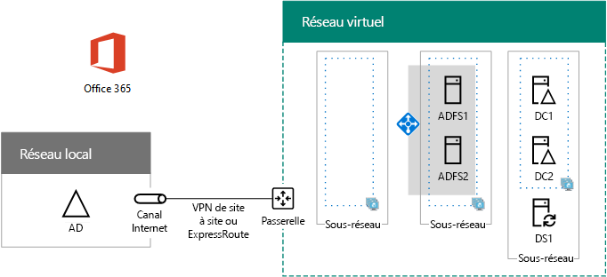

# <a name="high-availability-federated-authentication-phase-3-configure-ad-fs-servers"></a>Authentification fédérée haute disponibilité, phase 3 : Configurer les serveurs AD FS

 **Résumé :** Créez et configurez les serveurs Active Directory Federation Services (ADFS) pour l’authentification fédérée de haute disponibilité pour Office 365 dans Microsoft Azure.
  
Au cours de cette phase du déploiement de la haute disponibilité pour l’authentification fédérée Office 365 dans les services d’infrastructure Azure, vous avez créé un équilibreur de charge interne et deux serveurs AD FS.
  
Vous devez terminer cette phase avant de passer à [haute disponibilité fédérés d’authentification Phase 4 : configurer le proxy de l’application web](high-availability-federated-authentication-phase-4-configure-web-application-pro.md). Pour toutes les phases, reportez-vous à la section [authentification fédérée de haute disponibilité déploiement pour Office 365 dans Azure](deploy-high-availability-federated-authentication-for-office-365-in-azure.md) .
  
## <a name="create-the-ad-fs-server-virtual-machines-in-azure"></a>Créer les machines virtuelles du serveur AD FS dans Azure

Utilisez le bloc de commandes PowerShell suivant pour créer les machines virtuelles pour les deux serveurs AD FS. Cet ensemble de commandes PowerShell utilise des valeurs provenant des tableaux suivants :
  
- Tableau M, pour vos machines virtuelles
    
- Tableau R, pour vos groupes de ressources
    
- Tableau V, pour vos paramètres de réseau virtuel
    
- Tableau S, pour vos sous-réseaux
    
- Tableau I, pour vos adresses IP statiques
    
- Tableau A, pour vos groupes à haute disponibilité
    
Rappeler que vous avez défini le tableau M dans [haute disponibilité fédérés d’authentification Phase 2 : configurer les contrôleurs de domaine](high-availability-federated-authentication-phase-2-configure-domain-controllers.md) et Tables R, V, S, I et dans [haute disponibilité fédérés d’authentification Phase 1 : configurer les Azure](high-availability-federated-authentication-phase-1-configure-azure.md).
  
> [!NOTE]
> La commande suivante définit utiliser la dernière version de PowerShell d’Azure. Reportez-vous à la section [mise en route avec les applets de commande PowerShell d’Azure](https://docs.microsoft.com/en-us/powershell/azureps-cmdlets-docs/). 
  
Tout d’abord, vous créez un équilibreur de charge d’interne Azure pour la publicité de deux serveurs FS. Spécifiez les valeurs pour les variables, suppression de la \< et > caractères. Lorsque vous avez fourni toutes les valeurs sont correctes, exécuter le bloc résultant à l’invite de commande PowerShell de Azure ou dans PowerShell ISE.
  
> [!TIP]
> Pour un fichier texte qui contient toutes les commandes de PowerShell dans cet article et un classeur Microsoft Excel configuration qui génère des blocs de commande PowerShell prête à exécuter en fonction de vos paramètres personnalisés, consultez la [l’authentification fédérée pour Office 365 dans Kit de déploiement d’Azure](https://gallery.technet.microsoft.com/Federated-Authentication-8a9f1664). 
  
```
# Set up key variables
$locName="<your Azure location>"
$vnetName="<Table V - Item 1 - Value column>"
$subnetName="<Table R - Item 2 - Subnet name column>"
$privIP="<Table I - Item 4 - Value column>"
$rgName=<Table R - Item 4 - Resource group name column>"

$vnet=Get-AzureRMVirtualNetwork -Name $vnetName -ResourceGroupName $rgName
$subnet=Get-AzureRmVirtualNetworkSubnetConfig -VirtualNetwork $vnet -Name $subnetName

$frontendIP=New-AzureRMLoadBalancerFrontendIpConfig -Name "ADFSServers-LBFE" -PrivateIPAddress $privIP -Subnet $subnet
$beAddressPool=New-AzureRMLoadBalancerBackendAddressPoolConfig -Name "ADFSServers-LBBE"

$healthProbe=New-AzureRMLoadBalancerProbeConfig -Name WebServersProbe -Protocol "TCP" -Port 443 -IntervalInSeconds 15 -ProbeCount 2
$lbrule=New-AzureRMLoadBalancerRuleConfig -Name "HTTPSTraffic" -FrontendIpConfiguration $frontendIP -BackendAddressPool $beAddressPool -Probe $healthProbe -Protocol "TCP" -FrontendPort 443 -BackendPort 443
New-AzureRMLoadBalancer -ResourceGroupName $rgName -Name "ADFSServers" -Location $locName -LoadBalancingRule $lbrule -BackendAddressPool $beAddressPool -Probe $healthProbe -FrontendIpConfiguration $frontendIP
```

Créez ensuite les machines virtuelles du serveur AD FS.
  
Lorsque vous avez fourni toutes les valeurs correctes, exécutez le bloc obtenu à l’invite de commandes Azure PowerShell ou dans le PowerShell ISE.
  
```
# Set up variables common to both virtual machines
$locName="<your Azure location>"
$vnetName="<Table V - Item 1 - Value column>"
$subnetName="<Table R - Item 2 - Subnet name column>"
$avName="<Table A - Item 2 - Availability set name column>"
$rgNameTier="<Table R - Item 2 - Resource group name column>"
$rgNameInfra="<Table R - Item 4 - Resource group name column>"

$rgName=$rgNameInfra
$vnet=Get-AzureRMVirtualNetwork -Name $vnetName -ResourceGroupName $rgName
$subnet=Get-AzureRmVirtualNetworkSubnetConfig -VirtualNetwork $vnet -Name $subnetName
$backendSubnet=Get-AzureRMVirtualNetworkSubnetConfig -Name $subnetName -VirtualNetwork $vnet
$webLB=Get-AzureRMLoadBalancer -ResourceGroupName $rgName -Name "ADFSServers"

$rgName=$rgNameTier
$avSet=Get-AzureRMAvailabilitySet -Name $avName -ResourceGroupName $rgName

# Create the first ADFS server virtual machine
$vmName="<Table M - Item 4 - Virtual machine name column>"
$vmSize="<Table M - Item 4 - Minimum size column>"
$staticIP="<Table I - Item 5 - Value column>"
$diskStorageType="<Table M - Item 4 - Storage type column>"

$nic=New-AzureRMNetworkInterface -Name ($vmName +"-NIC") -ResourceGroupName $rgName -Location $locName -Subnet $backendSubnet -LoadBalancerBackendAddressPool $webLB.BackendAddressPools[0] -PrivateIpAddress $staticIP
$vm=New-AzureRMVMConfig -VMName $vmName -VMSize $vmSize -AvailabilitySetId $avset.Id

$cred=Get-Credential -Message "Type the name and password of the local administrator account for the first AD FS server." 
$vm=Set-AzureRMVMOperatingSystem -VM $vm -Windows -ComputerName $vmName -Credential $cred -ProvisionVMAgent -EnableAutoUpdate
$vm=Set-AzureRMVMSourceImage -VM $vm -PublisherName MicrosoftWindowsServer -Offer WindowsServer -Skus 2016-Datacenter -Version "latest"
$vm=Add-AzureRMVMNetworkInterface -VM $vm -Id $nic.Id
$vm=Set-AzureRmVMOSDisk -VM $vm -Name ($vmName +"-OS") -DiskSizeInGB 128 -CreateOption FromImage -StorageAccountType $diskStorageType
New-AzureRMVM -ResourceGroupName $rgName -Location $locName -VM $vm

# Create the second AD FS virtual machine
$vmName="<Table M - Item 5 - Virtual machine name column>"
$vmSize="<Table M - Item 5 - Minimum size column>"
$staticIP="<Table I - Item 6 - Value column>"
$diskStorageType="<Table M - Item 5 - Storage type column>"

$nic=New-AzureRMNetworkInterface -Name ($vmName +"-NIC") -ResourceGroupName $rgName -Location $locName  -Subnet $backendSubnet -LoadBalancerBackendAddressPool $webLB.BackendAddressPools[0] -PrivateIpAddress $staticIP
$vm=New-AzureRMVMConfig -VMName $vmName -VMSize $vmSize -AvailabilitySetId $avset.Id

$cred=Get-Credential -Message "Type the name and password of the local administrator account for the second AD FS server." 
$vm=Set-AzureRMVMOperatingSystem -VM $vm -Windows -ComputerName $vmName -Credential $cred -ProvisionVMAgent -EnableAutoUpdate
$vm=Set-AzureRMVMSourceImage -VM $vm -PublisherName MicrosoftWindowsServer -Offer WindowsServer -Skus 2016-Datacenter -Version "latest"
$vm=Add-AzureRMVMNetworkInterface -VM $vm -Id $nic.Id
$vm=Set-AzureRmVMOSDisk -VM $vm -Name ($vmName +"-OS") -DiskSizeInGB 128 -CreateOption FromImage -StorageAccountType $diskStorageType
New-AzureRMVM -ResourceGroupName $rgName -Location $locName -VM $vm

```

> [!NOTE]
> Étant donné que ces machines virtuelles sont d’une application intranet, elles ne sont pas affectés une adresse IP publique ou une étiquette de nom de domaine DNS et exposés à Internet. Cependant, cela signifie également que vous ne peut pas y connecter à partir du portail Azure. L’option **se connecter** n’est pas disponible lorsque vous affichez les propriétés de l’ordinateur virtuel. Utilisez l’accessoire de connexion Bureau à distance ou un autre outil de bureau à distance pour vous connecter à l’ordinateur virtuel à l’aide de son privé IP adresse intranet ou le nom DNS.
  
Pour chaque machine virtuelle, utilisez le client Bureau à distance de votre choix et créez une connexion de Bureau à distance. Utilisez son nom d’ordinateur ou son nom DNS intranet et les informations d’identification du compte Administrateur local.
  
Pour chaque machine virtuelle, associez la machine virtuelle au domaine Windows Server AD avec ces commandes à l’invite Windows PowerShell.
  
```
$domName="<Windows Server AD domain name to join, such as corp.contoso.com>"
$cred=Get-Credential -Message "Type the name and password of a domain acccount."
Add-Computer -DomainName $domName -Credential $cred
Restart-Computer
```

Lorsque cette phase est terminée, voici la configuration résultante, avec les noms d’ordinateur de l’espace réservé.
  
**Phase 3 : Serveurs AD FS et équilibreur de charge interne pour votre infrastructure d’authentification fédérée de haute disponibilité dans Azure**


  
## <a name="next-step"></a>Étape suivante

Utilisation [haute disponibilité fédérés d’authentification Phase 4 : configurer le proxy de l’application web](high-availability-federated-authentication-phase-4-configure-web-application-pro.md) pour continuer la configuration de cette charge de travail.
  
## <a name="see-also"></a>Voir aussi

[Déployer une authentification fédérée haute disponibilité pour Office 365 dans Azure](deploy-high-availability-federated-authentication-for-office-365-in-azure.md)
  
[Identité fédérée pour votre environnement de développement/test Office 365](federated-identity-for-your-office-365-dev-test-environment.md)


