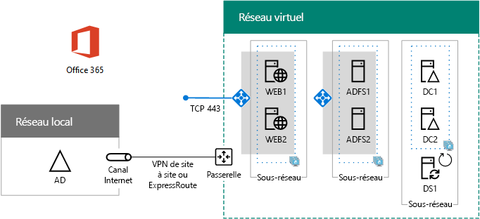

# Authentification fédérée haute disponibilité, phase 5 : Configurer l'authentification fédérée pour Office 365High availability federated authentication Phase 5: Configure federated authentication for Office 365

 **Résumé :** Configurer Azure AD Connect pour votre authentification fédérée haute disponibilité pour Office 365 dans Microsoft Azure.**Summary:** Configure Azure AD Connect for your high availability federated authentication for Office 365 in Microsoft Azure.
 
Au cours de cette phase finale du déploiement de l'authentification fédérée haute disponibilité pour Office 365 dans les services d'infrastructure Azure, vous obtenez et installez un certificat émis par une autorité de certification publique, vérifiez votre configuration et installez et exécutez Azure AD Connect sur le serveur DirSync. Azure AD Connect configure votre abonnement Office 365, vos services Active Directory Federation Services (AD FS) et les serveurs proxy d'application web pour l'authentification fédérée.In this final phase of deploying high availability federated authentication for Office 365 in Azure infrastructure services, you get and install a certificate issued by a public certification authority, verify your configuration, and then install and run Azure AD Connect on the DirSync server. Azure AD Connect configures your Office 365 subscription and your Active Directory Federation Services (AD FS) and web application proxy servers for federated authentication.
  
Reportez-vous à la rubrique [Déployer une authentification fédérée haute disponibilité pour Office 365 dans Azure](deploy-high-availability-federated-authentication-for-office-365-in-azure.md) pour toutes les phases.See [Deploy high availability federated authentication for Office 365 in Azure](deploy-high-availability-federated-authentication-for-office-365-in-azure.md) for all of the phases.
  
## Obtenir un certificat public et le copier sur le serveur DirSyncGet a public certificate and copy it to the DirSync server

Obtenez auprès d’une autorité de certification publique un certificat numérique avec les propriétés suivantes :Get a digital certificate from a public certification authority with the following properties:
  
- Un certificat X.509 approprié pour créer des connexions SSL.An X.509 certificate suitable for creating SSL connections.
    
- La propriété étendue d’autre nom de sujet (Subject Alternative Name, SAN) est définie sur le nom de domaine complet du service de fédération (exemple : fs.contoso.com).The Subject Alternative Name (SAN) extended property is set to your federation service FQDN (example: fs.contoso.com).
    
- Le certificat doit contenir la clé privée et être stocké au format PFX.The certificate must have the private key and be stored in PFX format.
    
Par ailleurs, les ordinateurs et appareils de votre organisation doivent approuver l'autorité de certification publique qui émet le certificat numérique. Pour cela, vous devez installer un certificat racine de l'autorité de certification publique dans la banque Autorités de certification racines de confiance de vos ordinateurs et appareils. Sur les ordinateurs exécutant Microsoft Windows, un ensemble de certificats de ce type est installé pour les autorités de certification couramment utilisées. Si le certificat racine de votre autorité de certification publique n'est pas déjà installé, vous devez le déployer sur les ordinateurs et les appareils de votre organisation.Additionally, your organization computers and devices must trust the public certification authority that is issuing the digital certificate. This trust is established by having a root certificate from the public certification authority installed in the trusted root certification authorities store on your computers and devices. Computers running Microsoft Windows typically have a set of these types of certificates installed from commonly-used certification authorities. If the root certificate from your public certification authority is not already installed, you must deploy this to the computers and devices of your organization.
  
Pour plus d'informations sur les certificats requis pour l'authentification fédérée, consultez la rubrique [Configuration requise pour l'installation et la configuration de la fédération](https://docs.microsoft.com/azure/active-directory/connect/active-directory-aadconnect-prerequisites#prerequisites-for-federation-installation-and-configuration).For more information about certificate requirements for federated authentication, see [Prerequisites for federation installation and configuration](https://docs.microsoft.com/azure/active-directory/connect/active-directory-aadconnect-prerequisites#prerequisites-for-federation-installation-and-configuration).
  
Lorsque vous recevez le certificat, copiez-le dans un dossier sur le lecteur C: du serveur DirSync. Par exemple, nommez le fichier SSL.pfx et stockez-le dans le dossier C:\\Certs du serveur DirSync.When you receive the certificate, copy it to a folder on the C: drive of the DirSync server. For example, name the file SSL.pfx and store it in the C:\\Certs folder on the DirSync server.
  
## Vérifier votre configurationVerify your configuration

Vous devez maintenant être prêt à configurer Azure AD Connect et l'authentification fédérée pour Office 365. Pour vous en assurer, utilisez la liste de vérification suivante :You should now be ready to configure Azure AD Connect and federated authentication for Office 365. To ensure that you are, here is a checklist:
  
- Le domaine public de votre organisation a été ajouté à votre abonnement Office 365.Your organization's public domain is added to your Office 365 subscription.
    
- Les comptes d'utilisateur Office 365 de votre organisation sont configurés sur le nom de domaine public de votre organisation et peuvent se connecter.Your organization's Office 365 user accounts are configured to your organization's public domain name and can successfully sign in.
    
- Vous avez déterminé le nom de domaine complet d’un service de fédération à partir de votre nom de domaine public.You have determined a federation service FQDN based your public domain name.
    
- Un enregistrement DNS A public au nom de domaine complet de votre service de fédération pointe vers l’adresse IP publique de l’équilibreur de charge Azure connecté à Internet pour les serveurs proxy d’application web.A public DNS A record for your federation service FQDN points to the public IP address of the Internet-facing Azure load balancer for the web application proxy servers.
    
- Un enregistrement DNS A privé au nom de domaine complet de votre service de fédération pointe vers l’adresse IP privée de l’équilibreur de charge Azure interne pour les serveurs AD FS.A private DNS A record for your federation service FQDN points to the private IP address of the internal Azure load balancer for the AD FS servers.
    
- Un certificat numérique émis par une autorité de certification publique pour les connexions SSL avec le SAN défini sur le nom de domaine complet de votre service de fédération est un fichier PFX stocké sur votre serveur DirSync.A public certification authority-isssued digital certificate suitable for SSL connections with the SAN set to your federation service FQDN is a PFX file stored on your DirSync server.
    
- Le certificat racine de l'autorité de certification publique est installé dans la banque Autorités de certification racines de confiance de vos ordinateurs et appareils.The root certificate for the public certification authority is installed in the Trusted Root Certification Authorities store on your computers and devices.
    
Voici un exemple pour l’organisation Contoso :Here is an example for the Contoso organization:
  
**Exemple de configuration pour une infrastructure d'authentification fédérée haute disponibilité dans Azure****An example configuration for a high availability federated authentication infrastructure in Azure**

  
## Exécutez Azure AD Connect pour configurer l’authentification fédéréeRun Azure AD Connect to configure federated authentication

L’outil Azure AD Connect configure les serveurs AD FS, les serveurs proxy d’application web et Office 365 pour l’authentification fédérée en procédant comme suit :The Azure AD Connect tool configures the AD FS servers, the web application proxy servers, and Office 365 for federated authentication with these steps:
  
1. Créez une connexion Bureau à distance vers votre serveur DirSync avec un compte de domaine qui possède des privilèges d'administrateur local.Create a remote desktop connection to your DirSync server with a domain account that has local administrator privileges.
    
2. Sur le bureau du serveur DirSync, ouvrez Internet Explorer et accédez à [https://aka.ms/aadconnect](https://aka.ms/aadconnect).From the desktop of the DirSync server, open Internet Explorer and go to [https://aka.ms/aadconnect](https://aka.ms/aadconnect).
    
3. Sur la page de **Microsoft Azure Active Directory Connect**, cliquez sur **Télécharger**, puis cliquez sur **Exécuter**.On the **Microsoft Azure Active Directory Connect** page, click **Download**, and then click **Run**.
    
4. Sur la page **Bienvenue dans Azure AD Connect**, cliquez sur **J'accepte**, puis sur **Continuer**.On the **Welcome to Azure AD Connect** page, click **I agree**, and then click **Continue.**
    
5. Sur la page **Configuration rapide**, cliquez sur **Personnaliser**.On the **Express Settings** page, click **Customize**.
    
6. Sur la page **Installer les composants nécessaires**, cliquez sur **Installer**.On the **Install required components** page, click **Install**.
    
7. Sur la page **Connexion utilisateur**, cliquez sur **Fédération avec AD FS**, puis sur **Suivant**.On the **User sign-in** page, click **Federation with AD FS**, and then click **Next**.
    
8. Sur la page **Connexion à Azure AD**, saisissez le nom et le mot de passe d'un administrateur général de votre abonnement Office 365, puis cliquez sur **Suivant**.On the **Connect to Azure AD** page, type the name and password of a global administrator account for your Office 365 subscription, and then click **Next**.
    
9. Sur la page **Connecter vos répertoires**, assurez-vous que votre forêt Windows Server AD locale est sélectionnée dans **Forêt**, entrez le nom et le mot de passe d'un compte d'administrateur de domaine, cliquez sur **Ajouter un répertoire**, puis sur **Suivant**.On the **Connect your directories** page, ensure that your on-premises Windows Server AD forest is selected in **Forest**, type the name and password of a domain administrator account, click **Add Directory**, and then click **Next**.
    
10. Sur la page **Configuration la connexion à Azure AD**, cliquez sur **Suivant**.On the **Azure AD sign-in configuration** page, click **Next**.
    
11. Sur la page **Filtrage par domaine ou unité d'organisation**, cliquez sur **Suivant**.On the **Domain and OU filtering** page, click **Next**.
    
12. Sur la page **Identification de manière unique de vos utilisateurs**, cliquez sur **Suivant**.On the **Uniquely identifying your users** page, click **Next**.
    
13. Sur la page **Filtrer les utilisateurs et appareils**, cliquez sur **Suivant**.On the **Filter users and devices** page, click **Next**.
    
14. Sur la page **Fonctionnalités facultatives**, cliquez sur **Suivant**.On the **Optional features** page, click **Next**.
    
15. Sur la page **Batterie de serveurs AD FS**, cliquez sur **Configurer une nouvelle batterie AD FS**.On the **AD FS farm** page, click **Configure a new AD FS farm**.
    
16. Cliquez sur **Parcourir** et spécifiez l'emplacement et le nom du certificat SSL de l''autorité de certification publique.Click **Browse** and specify the location and name of the SSL certificate from the public certification authority.
    
17. Lorsque vous y êtes invité, entrez le mot de passe du certificat, puis cliquez sur **OK**.When prompted, type the certificate password, and then click **OK**.
    
18. Vérifiez que le **nom de sujet** et le **nom du service de fédération** sont définis sur le nom de domaine complet de votre service de fédération, puis cliquez sur **Suivant**.Verify that the **Subject Name** and **Federation Service Name** are set to your federation service FQDN, and then click **Next**.
    
19. Sur la page **Serveurs AD FS**, entrez le nom de votre premier serveur AD FS (Tableau M - Élément 4 - Colonne Nom de machine virtuelle), puis cliquez sur **Ajouter**.On the **AD FS servers** page, type your first AD FS server's name (Table M - Item 4 - Virtual machine name column), and then click **Add**.
    
20. Entrez le nom de votre deuxième serveur AD FS deuxième (Tableau M - élément 5 - colonne Nom de machine virtuelle), cliquez sur **Ajouter**, puis sur **Suivant**.Type your second AD FS server's name (Table M - Item 5 - Virtual machine name column), click **Add**, and then click **Next**.
    
21. Sur la page **Serveurs proxy d'application Web**, entrez le nom de votre premier serveur proxy d'application Web (Tableau M - Élément 6 - Colonne Nom de machine virtuelle), puis cliquez sur **Ajouter**.On the **Web Application Proxy servers** page, type your first web application proxy server's name (Table M - Item 6 - Virtual machine name column), and then click **Add**.
    
22. Entrez le nom de votre deuxième serveur proxy d'application web (Tableau M - élément 7 - colonne Nom de machine virtuelle), cliquez sur **Ajouter**, puis sur **Suivant**.Type your second web application proxy server's name (Table M - Item 7 - Virtual machine name column), click **Add**, and then click **Next**.
    
23. Sur la page **Informations d'identification d'administrateur de domaine**, saisissez le nom d'utilisateur et le mot de passe d'un compte d'administrateur de domaine, puis cliquez sur **Suivant**.On the **Domain Administrator credentials** page, type the user name and password of a domain administrator account, and then click **Next**.
    
24. Sur la page **Compte de service AD DS**, saisissez le nom d'utilisateur et le mot de passe d'un compte d'administrateur d'entreprise, puis cliquez sur **Suivant**.On the **AD FS service account** page, type the user name and password of an enterprise administrator account, and then click **Next**.
    
25. Sur la page **Domaine Azure AD**, sous **Domaine**, sélectionnez le nom de domaine DNS de votre organisation, puis sur cliquez sur **Suivant**.On the **Azure AD Domain** page, in **Domain**, select your organization's DNS domain name, and then click **Next**.
    
26. Sur la page **Prêt à configurer**, cliquez sur **Installer**.On the **Ready to configure** page, click **Install**.
    
27. Sur la page **Installation terminée**, cliquez sur **Vérifier**. Vous devriez voir deux messages vous indiquant que les configurations intranet et Internet ont été vérifiées.On the **Installation complete** page, click **Verify**. You should see two messages indicating that both the intranet and Internet configuration was successfully verified.
    
  - Le message intranet doit répertorier l’adresse IP privée de l’équilibreur de charge Azure interne pour vos serveurs AD FS.The intranet message should list the private IP address of your Azure internal load balancer for your AD FS servers.
    
  - Le message Internet doit répertorier l’adresse IP publique de l’équilibreur de charge Azure connecté à Internet pour vos serveurs proxy d’application web.The Internet message should list the public IP address of your Azure Internet-facing load balancer for your web application proxy servers.
    
28. Sur la page **Installation terminée**, cliquez sur **Quitter**.On the **Installation complete** page, click **Exit**.
    
Voici la configuration finale, avec les noms d’espace réservé pour les serveurs.Here is the final configuration, with placeholder names for the servers.
  
**Phase 5 : Configuration finale d'une infrastructure d'authentification fédérée haute disponibilité dans Azure****Phase 5: The final configuration of a high availability federated authentication infrastructure in Azure**

  
Votre infrastructure d’authentification fédérée haute disponibilité pour Office 365 dans Azure est prête.Your high availability federated authentication infrastructure for Office 365 in Azure is complete.
  
## Voir aussiSee Also

[Déployer une authentification fédérée haute disponibilité pour Office 365 dans AzureDeploy high availability federated authentication for Office 365 in Azure](deploy-high-availability-federated-authentication-for-office-365-in-azure.md)
  
[Identité fédérée pour votre environnement de développement/test Office 365Federated identity for your Office 365 dev/test environment](federated-identity-for-your-office-365-dev-test-environment.md)
  
[Adoption du cloud et solutions hybridesCloud adoption and hybrid solutions](cloud-adoption-and-hybrid-solutions.md)

[Identité fédérée pour Office 365Federated identity for Office 365](https://support.office.com/article/Understanding-Office-365-identity-and-Azure-Active-Directory-06a189e7-5ec6-4af2-94bf-a22ea225a7a9#bk_federated)

