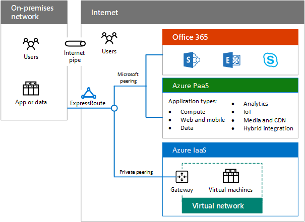

# Présentation du cloud hybrideHybrid cloud overview

 **Résumé :** Comprendre la définition et les éléments du cloud hybride Microsoft.**Summary:** Understand the definition and elements of Microsoft hybrid cloud.
  
Le cloud hybride utilise des ressources de calcul ou de stockage sur votre réseau local et dans le cloud. Vous pouvez utiliser le cloud hybride pour migrer votre entreprise et ses besoins en ressources informatiques vers le cloud, ou intégrer des services et plateformes cloud à votre infrastructure locale existante dans le cadre de la mise en œuvre de votre stratégie informatique globale.Hybrid cloud uses compute or storage resources on your on-premises network and in the cloud. You can use hybrid cloud as a path to migrate your business and its IT needs to the cloud or integrate cloud platforms and services with your existing on-premises infrastructure as part of your overall IT strategy.
  
## Cloud hybride MicrosoftMicrosoft hybrid cloud

Le cloud hybride Microsoft représente un ensemble de scénarios professionnels qui combinent une plateforme cloud Microsoft à un composant local, par exemple :Microsoft hybrid cloud is a set of business scenarios that combine a Microsoft cloud platform with an on-premises component, such as: 
  
- Obtention de résultats de recherche pour du contenu stocké dans une batterie SharePoint locale et dans SharePoint Online dans Office 365.Getting search results from content both in an on-premises SharePoint farm and in SharePoint Online in Office 365.
    
- Application mobile exécutée dans Azure qui interroge un magasin de données local.A mobile app running in Azure that queries an on-premises data store.
    
- Charge de travail informatique sur un intranet exécutée sur des ordinateurs virtuels Azure.An intranet IT workload running on Azure virtual machines.
    
**Figure 1 : Composants du cloud hybride Microsoft****Figure 1: Components of the Microsoft hybrid cloud**

  
La figure 1 présente les composants du cloud hybride Microsoft, d’un réseau local à l’ensemble des services Office 365, Paas Azure et IaaS Azure disponibles sur Internet ou une connexion ExpressRoute.Figure 1 shows the components of the Microsoft hybrid cloud, from an on-premises network to the set of Office 365, Azure Platform as a Service (PaaS), and Azure Infrastructure as a Service (IaaS) services available across the Internet or an ExpressRoute connection.
  
Étant donné que Microsoft propose l’une des solutions cloud les plus complètes sur le marché (Software as a Service (SaaS), Platform as a Service (PaaS) et Infrastructure as a Service (IaaS), vous pouvez :Because Microsoft has the most complete cloud solution in the marketplace—including Software as a Service (SaaS), PaaS, and IaaS—you can:
  
- tirer parti des investissements que vous avez effectués dans votre environnement local lorsque vous migrez des charges de travail et des applications vers le cloud ;Leverage your existing on-premises investments as you migrate workloads and applications to the cloud.
    
- incorporer des scénarios de cloud hybride dans votre planification informatique à long terme, par exemple, lorsque des réglementations ou des politiques vous empêchent de déplacer des données ou des charges de travail spécifiques vers le cloud ;Incorporate hybrid cloud scenarios into your long-term IT plans, for example, when regulations or policies do not permit moving specific data or workloads to the cloud.
    
- créer des scénarios hybrides supplémentaires qui incluent plusieurs services et plateformes cloud de Microsoft.Create additional hybrid scenarios that include multiple Microsoft cloud services and platforms.
    
Les scénarios de cloud hybride utilisant les services cloud Microsoft dépendent de la plateforme utilisée.Scenarios for hybrid cloud with Microsoft cloud services vary with the platform.
  
- SaaSSaaS
    
    Services Microsoft SaaS incluent Office 365 et Microsoft Dynamics 365 Intune Microsoft. Scénarios de nuage hybride avec Microsoft SaaS combinent ces services avec les services locaux ou des applications. Par exemple, Exchange Online en cours d’exécution dans Office 365 peut être intégré avec Skype pour 2019 Business qui est déployé localement.Microsoft SaaS services include Office 365, Microsoft Intune, and Microsoft Dynamics 365. Hybrid cloud scenarios with Microsoft SaaS combine these services with on-premises services or applications. For example, Exchange Online running in Office 365 can be integrated with Skype for Business 2019 that is deployed on-premises.
    
- Azure PaaSAzure PaaS
    
    Les services PaaS de Microsoft Azure permettent de créer des applications basées sur le cloud. Les scénarios de cloud hybride avec les services PaaS Azure combinent une application PaaS Azure aux applications ou ressources locales. Par exemple, une application PaaS Azure peut interroger en toute sécurité une banque de données locale afin d'obtenir les informations nécessaires à afficher pour les utilisateurs de l'application mobile.Microsoft Azure PaaS services allow you to create cloud-based applications. Hybrid cloud scenarios with Azure PaaS services combine an Azure PaaS app with on-premises resources or applications. For example, an Azure PaaS app could securely query an on-premises data store for information needed to display to mobile app users.
    
- Azure IaaSAzure IaaS
    
    Les services IaaS Azure permettent de créer et d'exécuter des charges de travail informatiques basées sur serveur dans le cloud, et non dans votre centre de données local. Les scénarios de cloud hybride avec les services IaaS Azure sont généralement constitués d'une charge de travail informatique qui s'exécute sur des ordinateurs virtuels et qui est connectée en toute transparence à votre réseau local. Les utilisateurs locaux ne verront pas la différence.Azure IaaS services allow you to build and run server-based IT workloads in the cloud, rather than in your on-premises datacenter. Hybrid cloud scenarios with Azure IaaS services typically consist of an IT workload that runs on virtual machines that is transparently connected to your on-premises network. Your on-premises users will not notice the difference.
    
## Éléments du cloud hybrideElements of hybrid cloud

Vous devez tenir compte des éléments suivants lorsque vous planifiez et implémentez des scénarios de cloud hybride utilisant des plateformes et services cloud Microsoft.You must account for the following elements when planning and implementing hybrid cloud scenarios with Microsoft cloud platforms and services.
  
- RéseauNetworking
    
    Dans le cadre de scénarios de cloud hybride, la mise en réseau inclut la connectivité aux plateformes et services cloud de Microsoft et suffisamment de bande passante pour conserver les performances en cas de pic au niveau des charges. Pour plus d'informations, voir [Mise en réseau cloud Microsoft pour les architectes d'entreprise](microsoft-cloud-networking-for-enterprise-architects.md).Networking for hybrid cloud scenarios includes the connectivity to Microsoft cloud platforms and services and enough bandwidth to be performant under peak loads. For more information, see [Microsoft Cloud Networking for Enterprise Architects](microsoft-cloud-networking-for-enterprise-architects.md).
    
- IdentityIdentity
    
    Dans le cadre de scénarios hybrides SaaS et PaaS Azure, l'identité peut inclure Azure AD en tant que fournisseur d'identité commun, qui peut alors être synchronisé avec Windows Server AD en local, ou fédéré avec Windows Server AD ou d'autres fournisseurs d'identité. Vous pouvez également étendre votre infrastructure d'identité locale pour IaaS Azure. Pour plus d'informations, voir [Identité cloud Microsoft pour les architectes d'entreprise](microsoft-cloud-it-architecture-resources.md#identity).Identity for SaaS and Azure PaaS hybrid scenarios can include Azure AD as a common identity provider, which can be synchronized with your on-premises Windows Server AD, or federated with Windows Server AD or other identity providers. You can also extend your on-premises Identity infrastructure to Azure IaaS. For more information, see [Microsoft Cloud Identity for Enterprise Architects](microsoft-cloud-it-architecture-resources.md#identity).
    
- SécuritéSecurity
    
    Dans le cadre de scénarios cloud hybrides, la sécurité inclut la protection et la gestion de vos identités, la protection des données, la gestion des privilèges d'administrateur, la sensibilisation aux menaces et l'implémentation de stratégies de gouvernance et de sécurité. Pour plus d'informations, voir [Sécurité cloud Microsoft pour les architectes d'entreprise](microsoft-cloud-it-architecture-resources.md#security).Security for hybrid cloud scenarios includes protection and management for your identities, data protection, administrative privilege management, threat awareness, and the implementation of governance and security policies. For more information, see [Microsoft Cloud Security for Enterprise Architects](microsoft-cloud-it-architecture-resources.md#security).
    
- GestionManagement
    
    Dans le cadre de scénarios cloud hybrides, la gestion inclut la capacité à assurer l'entretien des paramètres, données, comptes, stratégies et autorisations, ainsi qu'à assurer la surveillance continue de l'état d'intégrité des éléments du scénario et de ses performances. Vous pouvez également utiliser le même ensemble d'outils, tels que Systems Management Server, pour la gestion des ordinateurs virtuels dans IaaS Azure.Management for hybrid cloud scenarios includes the ability to maintain settings, data, accounts, policies, and permissions and to monitor the ongoing health of the elements of the scenario and its performance. You can also use the same tool set, such as Systems Management Server, for managing virtual machines in Azure IaaS.
    
## Voir aussiSee Also

[Cloud hybride Microsoft pour les architectes d'entrepriseMicrosoft Hybrid Cloud for Enterprise Architects](microsoft-hybrid-cloud-for-enterprise-architects.md)
  
[Ressources relatives à l'architecture informatique du cloud MicrosoftMicrosoft Cloud IT architecture resources](microsoft-cloud-it-architecture-resources.md)

