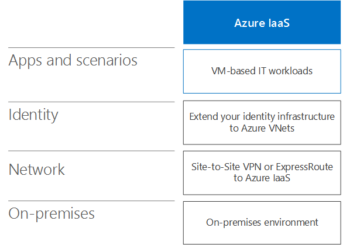

# Scénarios de cloud hybride pour Azure IaaS

 **Résumé :** Comprendre l’architecture de hybride et les scénarios de l’Infrastructure de Microsoft en tant que Service (IaaS)-en fonction des offres de cloud dans Azure.
  
Étendez votre infrastructure de calcul et d’identité au cloud en hébergeant des charges de travail informatiques exécutées dans des réseaux virtuels Azure intersites.  
  
## Architecture de scénario hybride pour les services IaaS Azure

La figure 1 présente l’architecture des scénarios hybrides IaaS de Microsoft dans Azure.
  
**Figure 1 : Scénarios hybrides Microsoft IaaS dans Azure**

  
Pour chaque couche de l’architecture :
  
- Applications et scénarios
    
    Une charge de travail informatique est généralement une application multiniveau à haut niveau de disponibilité qui est composée d’ordinateurs virtuels Azure.
    
- Identity
    
    Ajoutez des serveurs d’identité, tels que des contrôleurs de domaine Windows Server AD, à l’ensemble de serveurs exécutés dans les réseaux virtuels Azure à des fins d’authentification locale.
    
- Réseau
    
    Utilisez une connexion VPN de site à site via Internet ou une connexion ExpressRoute avec homologation privée vers les services IaaS Azure.
    
- Sur site
    
    Contient des serveurs d’identité qui sont synchronisés avec les serveurs d’identité exécutés dans Azure. Peut également contenir des ressources auxquelles les ordinateurs virtuels exécutés dans Azure peuvent accéder, telles que le stockage et l’infrastructure de gestion des systèmes.
    
## Serveur de synchronisation d’annuaire pour Office 365

Le fait d’exécuter votre serveur de synchronisation d’annuaire à partir d’un réseau virtuel Azure, comme illustré dans la figure 2, est un exemple d’extension de votre infrastructure informatique et d’identité dans le cloud.
  
**Figure 2 : serveur de synchronisation d’annuaire pour Office 365 dans Azure IaaS**

  
Dans la Figure 2, un réseau local héberge une infrastructure Windows Server Active Directory, avec un serveur proxy et un routeur au bord. Le routeur se connecte à une passerelle Azure sur le bord d’un VNet Azure avec une connexion de site à ExpressRoute à distance ou VPN. À l’intérieur de la VNet, un serveur de synchronisation d’annuaire exécute Azure AD se connecter.
  
Un serveur de synchronisation d’annuaire pour Office 365 synchronise la liste des comptes dans Windows Server AD avec le client Azure AD d’un abonnement Office 365.
  
Un serveur de synchronisation d’annuaire est un serveur Windows qui exécute Azure AD Connect. Pour accélérer l’approvisionnement ou réduire le nombre de serveurs locaux de votre organisation, déployez votre serveur de synchronisation d’annuaire dans un réseau virtuel dans Azure IaaS.
  
Le serveur de synchronisation d’annuaire interroge Windows Server AD pour connaître les modifications, puis les synchronise avec l’abonnement Office 365.
  
Pour plus d’informations, voir [Déployer Office 365 la synchronisation d’annuaires dans Microsoft Azure](deploy-office-365-directory-synchronization-dirsync-in-microsoft-azure.md).
  
## Application métier

La figure 3 illustre la configuration d’une application métier basée sur un serveur exécutée dans Azure IaaS.
  
**Figure 3 : Application métier dans Azure IaaS**

  
Dans la Figure 3, un réseau local héberge des utilisateurs et une infrastructure d’identité. Il est connecté à une passerelle Azure IaaS avec une connexion ExpressRoute ou VPN de site à site. Azure IaaS héberge un réseau virtuel qui contient les serveurs de l’application métier.
  
Vous pouvez créer des applications métier exécutées sur des ordinateurs virtuels Azure qui résident sur des sous-réseaux d’un réseau virtuel Azure dans un centre de données Azure (également appelé « emplacement »). 

  
Étant donné que vous cherchez à étendre votre infrastructure locale à Azure, vous devez attribuer un espace d’adressage privé unique à vos réseaux virtuels et mettre à jour vos tables de routage locales afin de veiller à ce que chaque réseau virtuel soit accessible.
  
Une fois connectés, ces ordinateurs virtuels peuvent être gérés via des connexions Bureau à distance ou via votre logiciel de gestion de systèmes, tout comme vos serveurs locaux.
  
En configurant des ports exposés publiquement, des utilisateurs mobile ou distants peuvent également accéder à ces ordinateurs virtuels via Internet.
  
Pour consulter une configuration avec preuve de concept, reportez-vous à la rubrique [Simulated cross-premises virtual network in Azure](simulated-cross-premises-virtual-network-in-azure.md).
  
Les attributs des applications métier hébergées sur des ordinateurs virtuels Azure sont les suivants :
  
- Multiniveau
    
    Les applications métier classiques utilisent une approche à plusieurs niveaux. Les ensembles de serveurs fournissent des fonctionnalités de traitement des identités et des base de données, de traitement logique et applicatif ainsi que des serveurs web frontaux réservés à l’accès des employés ou des clients.  
    
- Disponibilité élevée
    
    Les applications métier classiques offrent une disponibilité élevée en utilisant plusieurs serveurs dans chaque niveau. Azure IaaS fournit un SLA de disponibilité de 99,9 % pour les serveurs des groupes à haute disponibilité Azure.  
    
- Répartition de la charge
    
    Pour répartir la charge de trafic réseau entre plusieurs serveurs dans un niveau, vous pouvez utiliser un équilibreur de charge Azure accessible sur Internet ou interne. Vous pouvez aussi utiliser un équilibreur de charge dédié disponible sur le marketplace Azure.
    
- Sécurité
    
    Pour protéger les serveurs du trafic entrant non sollicité provenant d’Internet, vous pouvez utiliser des groupes de sécurité réseau Azure. Vous pouvez définir un trafic autorisé ou refusé pour un sous-réseau ou l’interface réseau d’un ordinateur virtuel individuel.
    
## Batterie SharePoint Server 2016 dans Azure

Une batterie de serveurs SharePoint Server 2016 est un exemple d’application métier hautement disponible à plusieurs niveaux dans Azure, comme illustré dans la figure 4.
  
**Figure 4 : Batterie SharePoint Server 2016 à disponibilité élevée dans Azure IaaS**

  
Dans la figure 4, un réseau local héberge des utilisateurs et une infrastructure d’identité. Il est connecté à une passerelle Azure IaaS avec une connexion ExpressRoute ou VPN de site à site. Le réseau virtuel Azure contient les serveurs de la batterie SharePoint Server 2016, qui inclut des niveaux séparés pour les serveurs frontaux, les serveurs d’applications, le cluster SQL Server et les contrôleurs de domaine.
  
Cette configuration a les attributs suivants des applications métier dans Azure :  
  
- Niveaux
    
    Les serveurs exécutant différents rôles au sein de la batterie créent les niveaux et chaque niveau possède son propre sous-réseau.

    
- Disponibilité élevée
    
    Obtenue à l’aide de plusieurs serveurs dans chaque niveau et en plaçant tous les serveurs d’un niveau dans le même groupe à disponibilité élevée.
    
- Répartition de la charge
    
    Les équilibreurs de charge Azure internes distribuent le trafic web client entrant vers les serveurs frontaux (WEB1 et WEB2) et vers l’adresse IP d’écouteur du cluster SQL Server (SQL1 SQL2 et MN1).
    
- Security
    
    Les groupes de sécurité réseau pour chaque sous-réseau vous permettent de configurer le trafic entrant et sortant autorisé.
    
Suivez cette procédure pour une adoption réussie :
  
1. Évaluer et expérimenter
    
    Voir [SharePoint Server 2016 dans Microsoft Azure](https://docs.microsoft.com/SharePoint/administration/sharepoint-server-2016-in-microsoft-azure) pour comprendre les avantages de l’exécution de SharePoint Server 2016 dans Azure.
    
    Voir [Intranet SharePoint Server 2016 dans l’environnement de développement/test Azure](https://docs.microsoft.com/SharePoint/administration/intranet-sharepoint-server-2016-in-azure-dev-test-environment) pour créer un environnement de développement/test simulé
    
2. Conception
    
    Voir la [conception d’une batterie de serveurs SharePoint Server 2016 dans Azure](https://docs.microsoft.com/SharePoint/administration/designing-a-sharepoint-server-2016-farm-in-azure) pour parcourir un processus pour déterminer l’ensemble des réseaux Azure IaaS, compute et éléments de stockage pour héberger votre batterie de serveurs et de leurs paramètres.
    
3. Déployer
    
    Consultez [déploiement de SharePoint Server 2016 avec les groupes de disponibilité AlwaysOn SQL Server dans Azure](https://docs.microsoft.com/SharePoint/administration/deploying-sharepoint-server-2016-with-sql-server-alwayson-availability-groups-in) afin de parcourir la configuration de bout en bout de la batterie de serveurs haute disponibilité dans cinq phases.
    
## Identité fédérée pour Office 365 dans Azure

Un autre exemple d’une application métier à plusieurs niveaux, hautement disponible dans Azure est l’identité fédérée pour Office 365.
  
**La figure 5 : Une infrastructure identité fédérée de haute disponibilité pour Office 365 dans Azure IaaS**

  
Dans la Figure 5, un réseau local héberge une infrastructure d’identité et les utilisateurs. Il est connecté à une passerelle Azure IaaS avec une connexion de site à ExpressRoute à distance ou VPN. Le VNet Azure contient les serveurs proxy, les serveurs d’Active Directory Federation Services (ADFS) et les contrôleurs de domaine Windows Server Active Directory (AD).
  
Cette configuration a les attributs suivants des applications métier dans Azure : 
  
- **Couches :** Il existe des couches pour les serveurs proxy web, serveurs AD FS et contrôleurs de domaine Windows Server Active Directory.
    
- **Répartition de la charge :** Un équilibreur de charge Azure externe distribue les demandes d’authentification client entrantes vers les serveurs proxy web et un équilibreur de charge Azure interne distribue les demandes d’authentification pour les serveurs AD FS.
    
Suivez cette procédure pour une adoption réussie :
  
1. Évaluer et expérimenter
    
    Consultez l' [identité fédérée pour votre environnement de développement/test Office 365](federated-identity-for-your-office-365-dev-test-environment.md) pour créer un environnement de développement/test simulé pour l’authentification fédérée avec Office 365.
    
2. Déployer
    
    Voir [authentification fédérée de déploiement haute disponibilité pour Office 365 dans Azure](deploy-high-availability-federated-authentication-for-office-365-in-azure.md) afin de parcourir la configuration de bout en bout de la haute disponibilité infrastructure AD FS dans cinq phases.
    
    
## Voir aussi

[Cloud hybride Microsoft pour les architectes d'entreprise](microsoft-hybrid-cloud-for-enterprise-architects.md)
  
[Ressources relatives à l'architecture informatique du cloud Microsoft](microsoft-cloud-it-architecture-resources.md)

