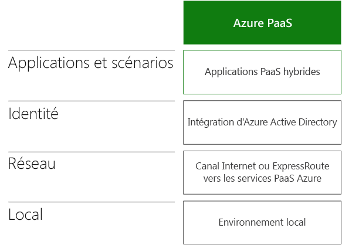
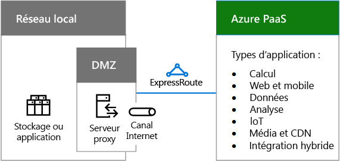
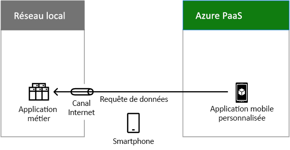
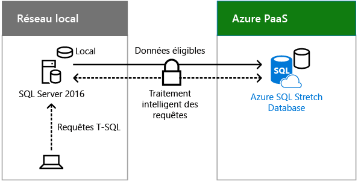

# Scénarios de cloud hybride pour les services PaaS Azure

 **Résumé :** Comprendre l'architecture hybride et les scénarios pour les offres cloud PaaS de Microsoft dans Azure.
  
Combinez des données locales ou des ressources de calcul à des applications nouvelles ou converties exécutées dans les services PaaS Azure. Vous pouvez ainsi tirer parti des performances, de la fiabilité et de la dimension du cloud tout en offrant une prise en charge optimale aux utilisateurs mobiles. 
  
## Architecture de scénario hybride pour les services PaaS Azure

La Figure 1 présente l'architecture des scénarios hybrides PaaS de Microsoft dans Azure.
  
**Figure 1 : Scénarios hybrides Microsoft PaaS dans Azure**

  
Pour chaque couche de l'architecture :
  
- Applications et scénarios
    
    Une application PaaS hybride est exécutée dans Azure et utilise les ressources de calcul ou de stockage locales.
    
- Identity
    
    Se compose de la synchronisation d'annuaires ou de la fédération avec un fournisseur d'identité tiers.
    
- Réseau
    
    Se compose de votre canal Internet existant ou d'une connexion ExpressRoute avec homologation publique pour Azure PaaS. Vous devez inclure un moyen pour l'application Azure PaaS d'accéder à la ressource de calcul ou de stockage locale.
    
- Sur site
    
    Se compose d'une infrastructure d'identité et de sécurité et d'applications métier ou de serveurs de bases de données existants auxquels une application Azure PaaS peut accéder en toute sécurité.
    
## Application hybride Azure PaaS

La Figure 2 illustre la configuration d'une application hybride exécutée dans Azure.
  
**Figure 2 : Application hybride Azure PaaS**

  
Dans la Figure 2, un réseau local héberge le stockage ou des applications sur des serveurs et une zone DMZ contenant un serveur proxy. Il est connecté à des services Azure PaaS via Internet ou avec une connexion ExpressRoute.
  
Une organisation peut mettre ses ressources de calcul ou de stockage à disposition de l'application Azure PaaS hybride :
  
- en hébergeant les ressources sur des serveurs dans la zone DMZ ;
    
- en hébergeant un serveur proxy inverse dans la zone DMZ, ce qui permet d'envoyer des requêtes HTTPS entrantes et authentifiées à la ressource locale.
    
L'application Azure peut utiliser les informations d'identification des sources suivantes :
  
- Azure AD. Elles peuvent alors être synchronisées avec votre fournisseur d'identité local, tel que Windows Server AD.
    
- Fournisseur d'identité tiers.
    
### Exemple d'application Azure PaaS hybride

La Figure 3 illustre un exemple d'application hybride exécutée dans Azure.
  
**Figure 3 : Exemple d'application hybride Azure PaaS**

  
Dans la Figure 3, un réseau local héberge une application métier. Azure PaaS héberge une application mobile personnalisée. Un smartphone sur Internet accède à l'application mobile personnalisée dans Azure, qui envoie des demandes de données à l'application métier locale.
  
Cet exemple d'application Azure PaaS hybride est une application mobile personnalisée qui propose des informations de contact à jour concernant les employés. Le scénario hybride de bout en bout se compose de :
  
- Un application pour smartphone qui, pour fonctionner, nécessite des informations d'identification locales et validées.
    
- Une application mobile personnalisée exécutée dans les services PaaS Azure, qui demande des informations concernant des employés spécifiques en fonction de requêtes envoyées par l'application pour smartphone d'un utilisateur.
    
- Un serveur proxy inverse dans la zone DMZ qui valide l'application mobile personnalisée et transfère la requête.
    
- Une batterie de serveurs d'applications métier qui gère la requête de contact. Elle est soumise aux autorisations du compte de l'utilisateur.
    
Étant donné que le fournisseur d'identité local a été synchronisé avec Azure AD, l'application mobile personnalisée et l'application métier peuvent valider le nom du compte de l'utilisateur qui envoie la requête.
  
## Stretch Database avec SQL Server 2016

Stretch Database est une fonctionnalité de SQL Server 2016 qui vous permet de déplacer des données froides de façon transparente et sécurisée, telles que des données d'entreprise fermées dans une table volumineuse qui contient des informations sur les commandes client, vers une base de données SQL Stretch dans Azure.
  
Dans le cadre d'une extension, le contenu d'une instance SQL Server, d'une base de données ou d'une table unique est la combinaison de données locales stockées sur un serveur SQL Server 2016 à des données distantes dans Azure. Les données pouvant faire l'objet d'une extension sont automatiquement déplacées vers Azure par SQL Server 2016.
  
La Figure 4 illustre Stretch Database avec SQL Server 2016.
  
**Figure 4 : Stretch Database avec SQL Server 2016**

  
Dans la Figure 4, un réseau local héberge un serveur exécutant SQL Server 2016 avec une petite base de données locale. Azure PaaS héberge une instance d'Azure SQL Server Stretch Database avec la partie étendue de la base de données. Les requêtes T-SQL provenant d'un utilisateur local envoyées à SQL Server local sont transférées en toute sécurité à Azure SQL Stretch Database, qui renvoie les résultats à l'utilisateur étant à l'origine de la requête.
  
 Les requêtes de l'utilisateur qui incluent les données historiques sont transférés en toute transparence à Azure SQL Stretch Database. Les requêtes ne doivent pas être réécrites, même si la table fait l'objet d'une extension.
  
Stretch Database est une solution rentable qui offre un stockage à long terme et un accès transparent aux données historiques. Elle résout également les problèmes de performances et de disponibilité qui peuvent survenir lorsque les tables deviennent très volumineuses.
  
Pour plus d'informations, voir [Stretch Database](https://msdn.microsoft.com/fr-fr/library/dn935011.aspx).
  
## See Also

#### 

[Cloud hybride Microsoft pour les architectes d'entreprise](microsoft-hybrid-cloud-for-enterprise-architects.md)
  
[Ressources relatives à l'architecture informatique du cloud Microsoft](microsoft-cloud-it-architecture-resources.md)
#### 

[Feuille de route Enterprise Cloud de Microsoft : ressources pour les décideurs](https://sway.com/FJ2xsyWtkJc2taRD)

