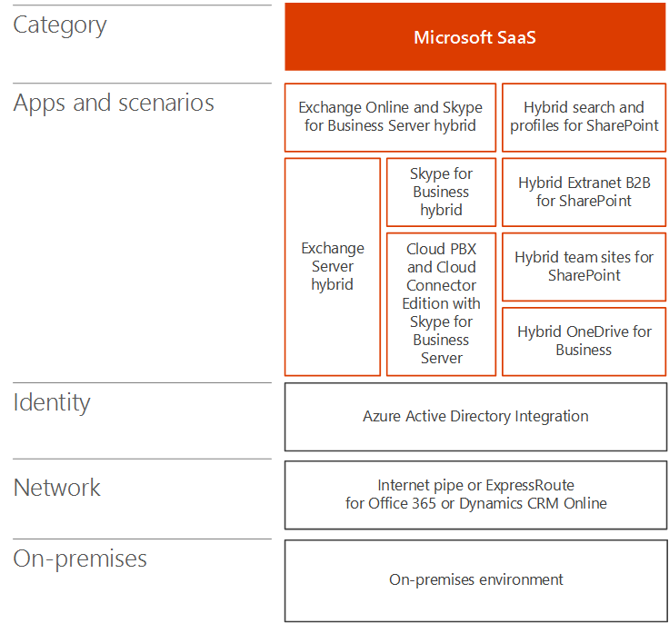
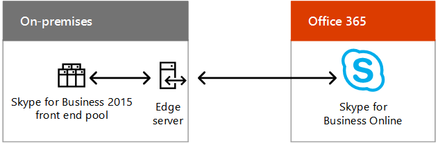

# Scénarios de cloud hybride pour Microsoft SaaS (Office 365)

 **Résumé:** Comprendre l'architecture hybride et les scénarios pour les offres Cloud SaaS de Microsoft (Office 365).
  
Combinez des déploiements locaux d’Exchange, de SharePoint ou de Skype Entreprise à leur équivalent dans Office 365 dans le cadre d’une migration cloud ou d’une stratégie d’intégration à long terme.
  
## Architecture de scénario hybride pour les services SaaS Microsoft

La figure 1 présente l’architecture des scénarios hybrides SaaS de Microsoft pour Office 365.
  
**Figure 1 : Scénarios hybrides Microsoft SaaS pour Office 365**

  
Pour chaque couche de l’architecture :
  
- Applications et scénarios
    
    Il existe plusieurs scénarios hybrides SaaS au niveau des produits serveur Office et de leur équivalent dans Office 365 :
    
  - Exchange Server combiné à Exchange Online (Exchange Server hybride)
    
  - Skype Entreprise Server combiné à Skype Entreprise Online et aux nouveaux scénarios PBX cloud et édition Cloud Connector
    
  - SharePoint Server 2019, SharePoint Server 2016 ou SharePoint Server 2013 combiné à SharePoint Online (plusieurs scénarios)
    
    Vous pouvez également mettre en place Exchange Online avec Skype Entreprise Server en local (scénario hybride de produit croisé).
    
- Identité
    
    Peut inclure la synchronisation d'annuaires avec vos services de domaine Active Directory (AD DS) locaux. Enfin, vous pouvez configurer Azure AD pour la fédération avec un fournisseur d’identité tiers.
    
- Réseau
    
    Se compose de votre canal Internet existant ou d’une connexion ExpressRoute avec homologation Microsoft pour Office 365 ou Dynamics 365.
    
- Sur site
    
    Peut être composé de serveurs existants pour Exchange, SharePoint et Skype Entreprise, qui doivent être mis à jour vers la dernière version disponible. Vous pouvez les combiner à leurs équivalents Office 365 pour des scénarios hybrides.
    
Configurer votre propre environnement de développement/test Office 365, reportez-vous à la rubrique [office 365 Test Lab guides](cloud-adoption-test-lab-guides-tlgs.md).
  
## Skype entreprise hybride

Skype entreprise hybride vous permet de combiner un déploiement local existant avec Skype entreprise online. Certains utilisateurs sont hébergés en local et d’autres sont hébergés en ligne, mais ils partagent tous le même domaine SIP (Session Initiation Protocol), tel que contoso.com. Vous pouvez utiliser cette configuration hybride pour migrer progressivement un environnement local vers Office 365 en respectant votre planning. Skype entreprise peut également être intégré à [Exchange Online](https://docs.microsoft.com/skypeforbusiness/skype-for-business-hybrid-solutions/integration-with-exchange-and-sharepoint).
  
**Figure 2: configuration hybride Skype entreprise**

  
La figure 2 illustre la configuration hybride de Skype entreprise, constituée d'un pool frontal Skype entreprise local et d'un serveur Edge communiquant avec Skype entreprise Online dans Office 365.
  
Pour plus d'informations, voir [planifier une connectivité hybride entre Skype entreprise Server et Skype entreprise Online](https://docs.microsoft.com/skypeforbusiness/skype-for-business-hybrid-solutions/plan-hybrid-connectivity).
    
## PBX cloud avec Skype Entreprise Server

Le Cloud PBX avec Skype entreprise Server vous permet de passer d'un déploiement local de Skype entreprise Server à une topologie avec une connectivité PSTN (réseau téléphonique commuté) locale. 
  
**Figure 3 : PBX cloud avec Skype Entreprise Server**

  
La figure 3 illustre la configuration de PBX Cloud avec Skype entreprise Server, constituée d'un PBX local ou d'une passerelle Telco, d'un serveur Skype entreprise et du RTC connecté au PBX Cloud Microsoft dans Office 365, qui inclut Skype entreprise Online.
  
Les utilisateurs au sein de l’organisation qui sont hébergés dans le cloud peuvent recevoir des services PBX (Private Branch Exchange) du cloud Microsoft qui incluent la signalisation et la messagerie vocale, mais la connectivité RTC (tonalité) est fournie via la fonctionnalité Voix Entreprise de votre déploiement Skype Entreprise Server local.
  
Il s'agit d'un excellent exemple de configuration hybride qui vous permet de migrer progressivement vers un service basé sur un nuage. Vous pouvez conserver les fonctionnalités vocales de vos utilisateurs lorsque vous commencez à les déplacer vers Skype Entreprise Online. Vous pouvez déplacer vos utilisateurs comme vous le souhaitez, sachant que leurs fonctionnalités vocales continueront, indépendamment de l’endroit où elles sont hébergées. 
  
Pour plus d'informations, voir [planifier une connectivité hybride entre Skype entreprise Server et Skype entreprise Online](https://docs.microsoft.com/skypeforbusiness/skype-for-business-hybrid-solutions/plan-hybrid-connectivity).
  
Si vous n’avez pas encore mis en place un déploiement Lync Server ou Skype Entreprise Server, vous pouvez utiliser l’édition Cloud Connector de Skype Entreprise. Il s’agit d’un ensemble complet d’ordinateurs virtuels qui implémentent une connectivité RTC locale avec la fonctionnalité PBX cloud.
  
Pour plus d'informations, reportez-vous à la rubrique [plan for Skype for Business Cloud Connector Edition](https://docs.microsoft.com/skypeforbusiness/skype-for-business-hybrid-solutions/plan-your-phone-system-cloud-pbx-solution/plan-skype-for-business-cloud-connector-edition).

  
## Environnement hybride SharePoint

SharePoint hybride combine SharePoint Online dans Office 365 à votre batterie SharePoint locale. Vous pouvez ainsi profiter des avantages des deux environnements au travers d’une expérience connectée.
  
**Figure 4 : Configuration hybride SharePoint**

  
La figure 4 illustre la configuration hybride de SharePoint, constituée d'une batterie de serveurs SharePoint locale communiquant avec SharePoint Online dans Office 365.
  
Scénarios SharePoint hybrides
  
- [OneDrive Entreprise hybride](https://docs.microsoft.com/SharePoint/hybrid/configure-hybrid-onedrive-for-businessroadmap)
    
- [B2B extranet hybride](https://docs.microsoft.com/sharepoint/create-b2b-extranet)
    
- [Recherche hybride](https://docs.microsoft.com/SharePoint/hybrid/configure-cloud-hybrid-searchroadmap)
    
- [Profils hybrides](https://docs.microsoft.com/SharePoint/hybrid/plan-hybrid-profiles)
    
- [Sélecteur hybride](https://docs.microsoft.com/SharePoint/hybrid/hybrid-picker-in-the-sharepoint-online-admin-center)
    
    La mise en œuvre de scénarios hybrides est un jeu d’enfant à l’aide des Assistants, car ils permettent d’automatiser la configuration hybride. Ces derniers sont disponibles dans le Centre d’administration SharePoint Online dans Office 365.
    
- [Lanceur d’applications hybride extensible](https://docs.microsoft.com/SharePoint/hybrid/the-extensible-hybrid-app-launcher)
    
    Cette fonctionnalité permet aux utilisateurs d’afficher et d’utiliser les applications Office 365 Video et Delve ainsi que des expériences dans les pages de leur batterie SharePoint locale.
    
Tous ces scénarios SharePoint hybrides, à l’exception du lanceur d’applications hybride extensible, sont disponibles pour les utilisateurs de SharePoint 2016 et SharePoint 2013.
  
## Exchange Server 2016 hybride

Avec Exchange Server 2016 hybride, vous pouvez tirer parti du potentiel d’Exchange Online dans Office 365 pour les utilisateurs en ligne tandis que les utilisateurs locaux continueront à utiliser l’infrastructure Exchange Server existante.  
  
**Figure 5 : Configuration hybride Exchange 2016**

  
La figure 5 illustre la configuration hybride Exchange 2016, constituée de serveurs de boîtes aux lettres Exchange locaux communiquant avec Exchange Online Protection et les boîtes aux lettres dans Office 365.
  
Certains utilisateurs ont recours à un serveur de messagerie local tandis que d’autres utilisent Exchange Online, mais ils partagent tous le même espace d’adressage de messagerie.  
  
Cette configuration hybride :
  
- tire parti de votre infrastructure Exchange Server existante pendant que vous effectuez une migration progressive vers Exchange Online en respectant votre planning ;
    
- vous permet de prendre en charge les sites distants sans investir dans une infrastructure de succursale ;
    
- vous permet d’acheminer le courrier électronique Internet entrant via Exchange Online Protection dans Office 365 ;
    
- répond aux besoins des sociétés multinationales possédant des filiales qui exigent que les données soient hébergées sur site.
    
Vous pouvez également intégrer cette configuration hybride à d’autres applications Microsoft Office 365, notamment Skype Entreprise Online et SharePoint Online.
  
Pour plus d'informations, consultez la rubrique [déploiements hybrides Exchange Server](https://docs.microsoft.com/exchange/exchange-hybrid).
  
## Voir aussi

[Cloud hybride Microsoft pour les architectes d’entreprise](microsoft-hybrid-cloud-for-enterprise-architects.md)
  
[Ressources relatives à l'architecture informatique du cloud Microsoft](microsoft-cloud-it-architecture-resources.md)

