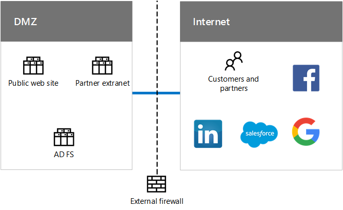

# Identité de Contoso CorporationIdentity for the Contoso Corporation

 **Résumé :** Comprendre comment Contoso tire parti des IDaaS distribué géographiquement et fournit l’authentification redondante pour ses utilisateurs.**Summary:** Understand how Contoso takes advantage of IDaaS and provides geographically distributed and redundant authentication for its users.
  
Microsoft fournit une identité en tant que Service (IDaaS) dans ses offres en nuage. Pour adopter une infrastructure cloud-inclus, solution de IDaaS de Contoso doit tirer parti de leur fournisseur d’identité sur site et inclure l’authentification fédérée avec leurs fournisseurs d’identité tiers approuvé existant.Microsoft provides an Identity as a Service (IDaaS) across its cloud offerings. To adopt a cloud-inclusive infrastructure, Contoso's IDaaS solution must leverage their on-premises identity provider and include federated authentication with their existing trusted, third-party identity providers.
  
## Forêt de Windows Server, Active Directory de ContosoContoso's Windows Server AD forest

Contoso utilise une seule forêt de Windows Server Active Directory (AD) pour contoso.com avec sept domaines, un pour chaque région du monde. Le siège social, bureaux régionaux centralisés et bureaux satellites contiennent des contrôleurs de domaine pour l’authentification locale et d’autorisation.Contoso uses a single Windows Server Active Directory (AD) forest for contoso.com with seven domains, one for each region of the world. The headquarters, regional hub offices, and satellite offices contain domain controllers for local authentication and authorization.
  
**Figure 1 : De Contoso forêt et les domaines dans le monde entier****Figure 1: Contoso's forest and domains worldwide**

  
La Figure 1 présente la forêt et les domaines régionaux de Contoso dans les régions du monde où se trouvent des centres régionaux.Figure 1 shows the Contoso forest with regional domains for the different parts of the world that contain regional hubs.
  
Contoso souhaite utiliser les comptes et les groupes de la forêt contoso.com pour faciliter l’authentification et l’autorisation de ses applications et de ses charges de travail dans le cloud.Contoso wants to use the accounts and groups in the contoso.com forest for authentication and authorization for its cloud-based apps and workloads.
  
## Infrastructure d’authentification fédérée de ContosoContoso's federated authentication infrastructure

Contoso permet de :Contoso allows:
  
- Les clients ont le droit d’utiliser leurs comptes Microsoft, Facebook ou Google Mail pour se connecter à leur site web public.Customers to use their Microsoft, Facebook, or Google Mail accounts to sign in to their public web site.
    
- Les fournisseurs et les partenaires peuvent utiliser leurs comptes LinkedIn, Salesforce ou Google Mail pour se connecter à l’extranet des partenaires.Vendors and partners to use their LinkedIn, Salesforce, or Google Mail accounts to sign in to the partner extranet.
    
**Figure 2 : L’authentification pour les clients et les partenaires fédérée prise en charge de Contoso****Figure 2: Contoso's support for federated authentication for customers and partners**

  
La Figure 2 montre que le DMZ de Contoso comprend un site web public, un partenaire extranet et des serveurs AD FS. Le DMZ est connecté à Internet, qui contient des clients, des partenaires et des services Internet.Figure 2 shows the Contoso DMZ containing a public web site, a partner extranet, and a set of AD FS servers. The DMZ is connected to the Internet that contains customers and partners and Internet services.
  
Les serveurs AD FS du DMZ utilisent leurs informations d’identification client pour se connecter au site web public et leurs informations d’identification partenaire pour accéder à l’extranet des partenaires.Active Directory Federation Services (AD FS) servers in the DMZ authenticate customer credentials for access to the public web site and partner credentials for access to the partner extranet.
  
Lorsque Contoso passe son site web public pour un Azure Web App et les partenaires extranet à Dynamics 365, ils veulent continuer à utiliser ces fournisseurs d’identité tiers pour leurs clients et leurs partenaires. Cela sera effectué en configurant la fédération entre les locataires Contoso AD Azure et ces fournisseurs d’identité tiers.When Contoso transitions its public web site to an Azure Web App and partner extranet to Dynamics 365, they want to continue to use these third-party identity providers for their customers and partners. This will be accomplished by configuring federation between Contoso Azure AD tenants and these third-party identity providers.
  
## Synchronisation d’annuaire de la forêt de Windows Server, Active Directory de ContosoDirectory synchronization for Contoso's Windows Server AD forest

Contoso a déployé l’outil Azure Connect de publicité sur un cluster de serveurs dans son centre de données de Paris. Azure Connect de publicité synchronise les modifications apportées à la forêt Active Directory de Windows Server de contoso.com avec le locataire AD Azure partagé par Office 365, EMS, Dynamics 365 et abonnements Azure de Contoso. Pour plus d’informations sur les abonnements, les licences, les comptes d’utilisateurs et les locataires, consultez [abonnements, des licences et des comptes d’utilisateurs pour la société Contoso](subscriptions-licenses-and-user-accounts-for-the-contoso-corporation.md).Contoso has deployed the Azure AD Connect tool on a cluster of servers in its Paris datacenter. Azure AD Connect synchronizes changes to the contoso.com Windows Server AD forest with the Azure AD tenant shared by Contoso's Office 365, EMS, Dynamics 365, and Azure subscriptions. For more information about subscriptions, licenses, user accounts, and tenants, see [Subscriptions, licenses, and user accounts for the Contoso Corporation](subscriptions-licenses-and-user-accounts-for-the-contoso-corporation.md).
  
**Figure 3 : Infrastructure de synchronisation d’annuaire de Contoso****Figure 3: Contoso's directory synchronization infrastructure**

  
La Figure 3 montre un cluster de serveurs exécutant Azure AD Connect qui synchronise la forêt Windows Server AD de Contoso avec le client Azure AD.Figure 3 shows a cluster of servers running Azure AD Connect synchronizing the Contoso Windows Server AD forest with the Azure AD tenant.
  
Contoso a configuré l’authentification fédérée, qui offre une ouverture de session unique pour les employés de Contoso. Lorsqu’un utilisateur est déjà connecté à la forêt Active Directory de Windows Server de contoso.com accède à une ressource de cloud Microsoft SaaS ou PaaS, ils ne demandera un mot de passe.Contoso has configured federated authentication, which provides single sign-on for Contoso's workers. When a user that has already signed in to the contoso.com Windows Server AD forest accesses a Microsoft SaaS or PaaS cloud resource, they will not be prompted for a password.
  
## Répartition géographique du trafic d’authentification de ContosoGeographical distribution of Contoso authentication traffic

Pour mieux prendre en charge ses employés mobiles et distants, Contoso a déployé des ensembles de serveurs d’authentification dans ses bureaux régionaux. Cette infrastructure distribue la charge et fournit la redondance et des performances supérieures lors de l’authentification des informations d’identification de l’utilisateur pour accéder aux offres de nuage de Microsoft qui utilisent le locataire AD Azure commun.To better support its mobile and remote workforce, Contoso has deployed sets of authentication servers in its regional offices. This infrastructure distributes the load and provides redundancy and higher performance when authenticating user credentials for access to Microsoft cloud offerings that use the common Azure AD tenant.
  
Pour répartir la charge des demandes d’authentification, Contoso a configuré Azure Traffic Manager avec un profil qui utilise la méthode de routage des performances qui fait référence aux clients qui s’authentifient auprès de l’ensemble de serveurs régionaux le plus proche. To distribute the load of authentication requests, Contoso has configured Azure Traffic Manager with a profile that uses the performance routing method, which refers authenticating clients to the regionally closest set of authentication servers. 
  
**Figure 4 : La répartition géographique du trafic d’authentification pour les bureaux régionaux****Figure 4: Geographical distribution of authentication traffic for regional offices**

  
La Figure 4 illustre les couches des ordinateurs clients et d’Azure Traffic Manager et des serveurs d’authentification des succursales. Chaque succursale utilise des proxys web et des serveurs AD FS pour authentifier les informations d’identification des utilisateurs avec les contrôleurs de domaine Windows Server AD.Figure 4 shows the layers of client computers, Azure Traffic Manager, and authentication servers in regional offices. Each regional office uses web proxies and AD FS servers to authenticate user credentials with Windows Server AD domain controllers.
  
Exemple de processus d’authentification :Authentication process example:
  
1. L’ordinateur client établit une communication avec une page web dans la location d’Office 365 en Europe (par exemple, sharepoint.contoso.com).The client computer initiates communication with a web page in the Office 365 tenancy in Europe (such as sharepoint.contoso.com).
    
2. Office 365 renvoie une demande de preuve d’authentification. La requête contient l’URL à contacter pour l’authentification.Office 365 sends back a request to send proof of authentication. The request contains the URL to contact for authentication.
    
3. L’ordinateur client tente d’associer le nom DNS de l’URL à une adresse IP existante.The client computer attempts to resolve the DNS name in the URL to an IP address.
    
4. Azure Traffic Manager reçoit la requête DNS et répond à l’ordinateur client avec l’adresse IP d’un serveur proxy d’applications web dans la succursale la plus proche de l’ordinateur client.Azure Traffic Manager receives the DNS query and responds to the client computer with the IP address of a web application proxy server in the regional office that is closest to the client computer.
    
5.  L’ordinateur client envoie une demande d’authentification à un serveur proxy web application qui transmet la demande à un serveur ADFS.The client computer sends an authentication request to a web application proxy server, which forwards the request to an AD FS server.
    
6. Le serveur AD FS demande les informations d’identification depuis l’ordinateur client.The AD FS server requests the user credentials from the client computer.
    
7. L’ordinateur client envoie les données d’identification de l’utilisateur sans les demander à celui-ci.The client computer sends the user credentials without prompting the user.
    
8. Le serveur AD FS valide les informations d’identification à l’aide d’un contrôleur de domaine Windows Server AD dans la succursale et renvoie un jeton de sécurité à l’ordinateur client.The AD FS server validates the credentials with a Windows Server AD domain controller in the regional office and returns a security token to the client computer.
    
9. L’ordinateur client envoie le jeton de sécurité à Office 365.The client computer sends the security token to Office 365.
    
10. Une fois la validation réussie, Office 365 met le jeton de sécurité dans le cache et envoie à l’ordinateur client la page web demandée à l’étape 1.After successful validation, Office 365 caches the security token and sends the web page requested in step 1 to the client computer.
    
## Redondance de l’infrastructure d’authentification du siège social dans Azure IaaSRedundancy for the headquarters authentication infrastructure in Azure IaaS

Pour assurer la redondance pour les travailleurs mobiles et à distance, le siège de Paris contenant 15 000 travailleurs, Contoso a déployé un second ensemble de proxys d’applications et de serveurs AD FS dans Azure IaaS.To provide redundancy for the remote and mobile workers of the Paris headquarters that contains 15,000 workers, Contoso has deployed a second set of application proxies and AD FS servers in Azure IaaS.
  
**Figure 5 : Infrastructure d’authentification redondante Azure IaaS****Figure 5: Redundant authentication infrastructure in Azure IaaS**

  
La Figure 5 montre les proxys web et les serveurs AD FS du DMZ et les autres proxys web et serveurs AD FS du réseau virtuel Azure intersites.Figure 5 shows web proxies and AD FS servers in the DMZ and an additional set of each in a cross-premises Azure virtual network.
  
Lorsque les serveurs d’authentification principaux du DMZ du siège deviennent indisponibles, le service informatique bascule vers l’infrastructure redondante déployée dans Azure IaaS. Les demandes d’authentification suivantes envoyées depuis les ordinateurs du siège parisien utilisent l’infrastructure d’Azure IaaS jusqu’à ce que le problème de disponibilité soit résolu.When the primary authentication servers in the headquarters DMZ become unavailable, IT staff switch over to the redundant set deployed in Azure IaaS. Subsequent authentication requests from Paris office computers use the set in Azure IaaS until the availability problem is corrected.
  
Pour basculer vers les serveurs de secours et revenir aux serveurs principaux, Contoso met à jour le profil Azure Traffic Manager associé au site parisien afin d’utiliser un autre ensemble d’adresses IP pour les proxys d’applications web :To switch over and switch back, Contoso updates the Azure Traffic Manager profile for the Paris region to use a different set of IP addresses for the web application proxies:
  
- Lorsque les serveurs d’authentification de DMZ sont disponibles, utilisez les adresses IP des serveurs de la zone DMZ.When the DMZ authentication servers are available, use the IP addresses of the servers in the DMZ.
    
- Lorsque les serveurs d’authentification du DMZ ne sont pas disponibles, les adresses IP des serveurs dans Azure IaaS sont utilisées.When the DMZ authentication servers are not available, use the IP addresses of the servers in Azure IaaS.
    
## See AlsoSee Also

[Contoso dans le cloud de MicrosoftContoso in the Microsoft Cloud](contoso-in-the-microsoft-cloud.md)
  
[Ressources relatives à l'architecture informatique du cloud MicrosoftMicrosoft Cloud IT architecture resources](microsoft-cloud-it-architecture-resources.md)

[Identité de Cloud Microsoft pour Enterprise ArchitectsMicrosoft Cloud Identity for Enterprise Architects](http://aka.ms/cloudarchidentity)
  
[Identité et Protection des périphériques pour Office 365Identity and Device Protection for Office 365](http://aka.ms/o365protect_device)
  
[Feuille de route Enterprise Cloud de Microsoft : ressources pour les décideursMicrosoft's Enterprise Cloud Roadmap: Resources for IT Decision Makers](https://sway.com/FJ2xsyWtkJc2taRD)

