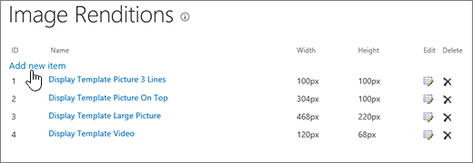

# Optimisation des images pour SharePoint OnlineImage optimization for SharePoint Online

La vitesse de chargement d’une page Web dépend de la taille combinée de tous les composants requis pour afficher la page, y compris les images, HTML, JavaScript et CSS. Les images sont idéal pour rendre votre site plus attrayant, mais leur taille peut affecter les performances. En optimisant vos images avec la compression de redimensionnement et l’utilisation de sprites, vous pouvez décaler les effets des images de très grande taille. À l’aide d’images SharePoint, vous pouvez télécharger une seule grande image et afficher des sections de l’image, ce qui lui permet d’être réutilisé plutôt que rechargé.The loading speed of a webpage depends on the combined size of all the components required to render the page including images, HTML, JavaScript, and CSS. Images are a great way to make your site more appealing, but their size can affect performance. By optimizing your images with compression and resizing, and using sprites, you can offset the effects of very large images. Using SharePoint image renditions, you can upload a single large image, and display sections of the image allowing it to be reused rather than reloaded.
  
## Utilisation d’images-objets pour accélérer le chargement d’images dans SharePoint OnlineUsing sprites to speed up image loading in SharePoint Online

|||
|:-----|:-----|
| Un sprite image contient plusieurs images plus petites. À l’aide de CSS sélectionnez une partie de l’image composite à afficher sur un composant particulier de la page avec le positionnement absolu. En fait, vous déplacez une image autour de la page au lieu de chargement de plusieurs images et afficher une petite partie de cette image dans une fenêtre de petite taille où la partie de l’image sprite est affichée à l’utilisateur final. SharePoint Online utilise sprites pour afficher ses diverses icônes dans le spcommon.png sprite.An image sprite contains many smaller images. Using CSS you select a part of the composite image to display on a particular part of the page with absolute positioning. Basically, you move a single image around the page instead of loading multiple images, and make a small part of that image visible through a small window where the required part of the sprite image is shown to the end user. SharePoint Online uses sprites to display its various icons in the sprite spcommon.png.     Ce qui est traité ici :What's covered here:     Compression d’imageImage compression     Optimisation des imagesImage optimization     Images SharePointSharePoint image renditions    ||
   
Cela peut accroître les performances car vous téléchargez uniquement une image au lieu de plusieurs et puis mettre en cache et réutilisez cette image. Même si l’image n’est pas mis en cache, organisez une image au lieu de plusieurs images, cette méthode réduit le nombre total de demandes HTTP vers le serveur qui permet de réduire le temps de chargement de page. Il s’agit vraiment d’un formulaire de regroupement de l’image. Il s’agit très utile si les images ne changeant pas très souvent, par exemple, des icônes, comme illustré dans l’exemple ci-dessus SharePoint. Vous pouvez l’utilisation [Web Essentials](http://vswebessentials.com/), un projet de fournisseur tiers, open source, en fonction de la Communauté pour y parvenir facilement dans Microsoft Visual Studio. Pour plus d’informations, voir [réduction et regroupement dans SharePoint Online](https://go.microsoft.com/fwlink/?LinkId=708698).This can increase performance because you download only one image instead of several and then cache and reuse that image. Even if the image does not remain cached, by having a single image instead of multiple images, this method reduces the total number of HTTP requests to the server which will reduce page loading times. This is really a form of image bundling. This is a very useful technique if the images are not changing very often, for example, icons, as shown in the SharePoint example provided above. You can how to use [Web Essentials](http://vswebessentials.com/), a third-party, open-source, community-based project to achieve this easily in Microsoft Visual Studio. For more information, see [Minification and bundling in SharePoint Online](https://go.microsoft.com/fwlink/?LinkId=708698).
  
## Utilisation de l’optimisation et de la compression d’images pour accélérer le chargement de pages dans SharePointUsing image compression and optimization to speed up page loading in SharePoint

L’optimisation et la compression d’images consistent à réduire la taille des fichiers images que vous utilisez sur votre site. Bien souvent, la meilleure façon de réduire la taille d’une image est de l’ajuster aux dimensions maximales auxquelles elle sera affichée sur le site. Il est inutile de conserver les dimensions d’une image si elle ne sera affichée que dans des proportions inférieures. Pour réduire facilement et rapidement la taille de votre page, assurez-vous que les dimensions des images sont correctes à l’aide d’un éditeur d’images.Image compression and optimization is about reducing the file size of the images you use on your site. Often, the best technique to reduce the size of an image is to resize the image to the maximum dimensions that it will be viewed on the site. There is no sense in having an image larger than it will ever be viewed. Making sure images are of the correct dimensions using an image editor is a quick and easy way to reduce the size of your page.
  
Une fois que les images sont la taille, l’étape suivante consiste à optimiser la compression de ces images. Il existe différents outils à utiliser pour la compression et optimisation, y compris la galerie de photos et des outils tiers. La clé sur compression consiste à réduire la taille du fichier autant que possible sans perte de la qualité visible pour les utilisateurs finaux. Veillez à que tester vos fichiers compressés sur un affichage haute définition pour s’assurer qu’ils seront toujours regarder la bonne.Once images are the right size, the next step is to optimize the compression of these images. There are various tools available to use for compression and optimization, including Photo Gallery and third-party tools. The key to compression is to reduce the file size as much as possible without losing any discernible quality for end users. Make sure you test your compressed files on a high-definition display to ensure they will still look good.
  
## Accélération du téléchargement des pages à l’aide des rendus d’image SharePointSpeed up page downloads by using SharePoint image renditions

Rendus d’image sont une fonctionnalité dans SharePoint Online qui permet de traiter les différentes versions d’images basées sur les dimensions de l’image prédéfinies. Ceci est particulièrement important lors du contenu image générés par l’utilisateur ou les dimensions de l’image tels que la largeur et hauteur sont résolues par la CSS sur le site. Même si une image est résolue en CSS, l’image de la solution complète est encore chargée. Dans ce cas, la taille du fichier peut être réduite à l’aide de rendus d’image.Image renditions are a feature in SharePoint Online that allows you to serve up different versions of images based on pre-defined image dimensions. This is especially important when there is user-generated image content or the image dimensions such as width and height are fixed by the CSS on the site. Even if an image is fixed by CSS, the full resolution image is still loaded. In this case the file size can be reduced by using image renditions.
  
> [!NOTE]
> Formats associés sont disponibles pour SharePoint uniquement lorsque la publication est activée. Vous pouvez activer la publication sous paramètres \> paramètres du Site \> gérer les fonctionnalités des sites \> publication Office SharePoint Server. L’option n’apparaît pas dans le cas contraire.Renditions are only available for SharePoint when publishing is enabled. You can enable publishing under Settings \> Site Settings \> Manage site features \> SharePoint Server Publishing. The option will not appear otherwise. 
  
Le redimensionnement par rendu d’image fonctionne comme suit : à partir de la plus petite dimension que vous définissez (largeur ou hauteur), l’autre dimension est automatiquement redimensionnée selon les proportions verrouillées. Par défaut, l’image sera rognée à partir du centre selon les dimensions restantes. Par exemple, si vous définissez un rendu de 100 px de large et de 50 px de haut et que l’image d’origine fait 1 000 px de large et 800 px de haut, elle sera redimensionnée de sorte que la dimension à 800 px soit réduite à 50 px et que la dimension à 1 000 px atteigne les 62,5 px par rognage à partir du centre de l’image.The image rendition resizing works by taking the smallest dimension you define, either width or height, and then resizing the image so that the other dimension is automatically resized based on the locked aspect ratio. By default, it will crop the image from the center by the remaining dimensions. For example, if you define a rendition of 100px wide and 50px high and your original image is 1000px wide and 800px high, it will be resized so that the 800px dimension is now 50px and the 1000px dimension (now 62.5px) is cropped from the center of the image.
  
Les étapes sont relativement simples, mais pour que vous puissiez utiliser les rendus sur les images, les rendus doivent se trouver sur le site SharePoint avant que vous ajoutiez les images. En outre, les fonctionnalités d’infrastructure de publication de SharePoint Server (au niveau de la collection de sites) et de publication de SharePoint Server (au niveau du site) doivent être activées.The steps are relatively simple but for images to use the renditions, the renditions need to be on the SharePoint site before you add the images. In addition, you also need to have the SharePoint Server Publishing Infrastructure (Site Collection Level) and SharePoint Server Publishing (Site Level) features turned on.
  
 **Ajouter un rendu d’image pour accélérer le chargement de la page****Add an image rendition to speed up page loading**
  
1. Vérifiez que le compte d’utilisateur qui exécute cette procédure, au minimum, les autorisations de conception pour le site de niveau supérieur de la collection de sites, et que le site est en cours de publication vers une page Web.Verify that the user account that is performing this procedure has, at minimum, Design permissions to the top-level site of the site collection, and that the site is being published to a webpage.
    
2. Dans un navigateur web, accédez au site de niveau supérieur de la collection de sites de publication.In a web browser, go to the top-level site of the publishing site collection.
    
3. Cliquez sur l’icône **Paramètres**.Choose the **Settings** icon. 
    
4. Sur la page **Paramètres du site**, dans la section **Aspect**, vous verrez les rendus d’image intégrés.On the **Site Settings** page, in the **Look and Feel** section, you will see the built-in image renditions. 
    
    Vous pouvez utiliser les rendus standard ou choisir **Rendus d’image** pour en créer un.You can use the out of the box renditions or choose **Image Renditions** to create a new one. 
    
    
  
5. Sur la page **Rendus d’image**, sélectionnez **Ajouter un nouvel élément**.On the **Image Renditions** page, choose **Add new item**.
    
    
  
6. Sur la page **Nouveau rendu d’image**, dans la zone **Nom**, saisissez le nom du rendu.On the **New Image Rendition** page, in the **Name** box, enter a name for the rendition. 
    
7. Dans les zones de texte **Largeur** et **Hauteur**, entrez la largeur et la hauteur, en pixels, du rendu, puis cliquez sur **Enregistrer**.In the **Width** and **Height** text boxes, enter the width and height, in pixels, of the rendition, and then choose **Save**.
    
    
  
## Rognage personnalisé avec les rendus d’image dans SharePointCustom cropping with image renditions in SharePoint

Par défaut, un rendu d’image est généré à partir du centre de l’image. Vous pouvez régler le rendu d’image pour des images individuelles par les rogner la partie de l’image que vous souhaitez utiliser. Vous pouvez rogner les images individuellement, par le rendu. Rognage les images accélère la page chargement en utilisant le cache blob de SharePoint pour créer une version de l’image pour chaque format associé. Ainsi, la charge du serveur est réduite, car l’image est redimensionnée uniquement une seule fois et est prêt à répondre aux utilisateurs finaux plusieurs fois. Pour plus d’informations sur la façon de rogner un rendu d’image, voir [Rogner un rendu d’image](https://go.microsoft.com/fwlink/p/?LinkId=525626).By default, an image rendition is generated from the center of the image. You can adjust the image rendition for individual images by cropping the portion of the image that you want to use. You can crop the images on an individual basis, per rendition. Cropping the images speeds up page loading by using SharePoint's blob cache to create a version of the image for each rendition. This way the server load is reduced because the image is only resized once and is then ready to serve to end users multiple times. For more information on how to crop an image rendition, see [Crop an image rendition](https://go.microsoft.com/fwlink/p/?LinkId=525626).
  

