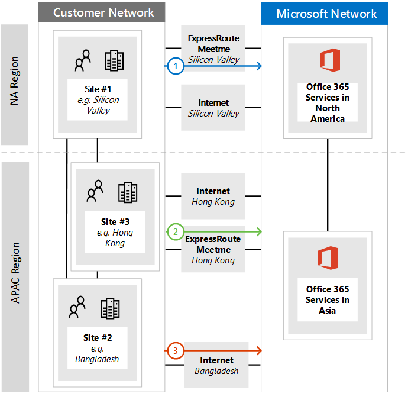
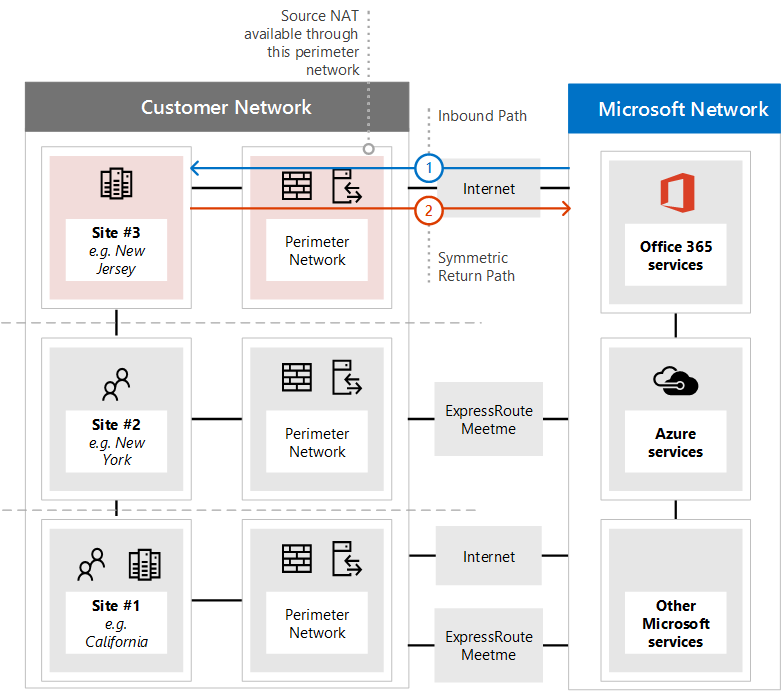

# <a name="implementing-expressroute-for-office-365"></a>Implémentation d’ExpressRoute pour Office 365

ExpressRoute pour Office 365 fournit un autre chemin de routage vers internet nombreuses vis-à-vis des services Office 365. L’architecture de ExpressRoute pour Office 365 est basé sur l’annonce des préfixes IP publiques des services Office 365 qui sont déjà accessibles sur Internet dans votre circuits ExpressRoute mis en service pour la redistribution ultérieure de ces préfixes IP dans votre réseau. ExpressRoute vous activez efficacement plusieurs différents chemins de routage, via internet et ExpressRoute, pour de nombreux services Office 365. Cet état de routage sur votre réseau peut représenter un changement important pour la conception de topologie de votre réseau interne.
  
 **État :** Guide complet v2
  
Vous devez planifier avec soin votre ExpressRoute d’implémentation Office 365 pour prendre en charge de la complexité du réseau d’avoir injecter votre réseau de base et internet des itinéraires de routage disponibles par le biais à la fois un circuit dédié. Si vous et votre équipe de ne pas effectuer la planification et test dans ce guide, il existe un risque élevé, que vous risquez de rencontrer intermittent ou une perte totale de connectivité à Office 365 services lorsque le circuit ExpressRoute est activé.
  
Pour que la réussite de l’implémentation, vous devez analyser les besoins de votre infrastructure, aboutir évaluation réseau détaillé et concevoir, planifier le déploiement d’une manière intermédiaire et mieux contrôlée avec soin et créer un plan de test et de validation détaillée. Pour un environnement distribué de grande taille, il n’est pas rare de voir les implémentations de couvrir plusieurs mois. Ce guide est conçu pour vous aider à planifier.
  
Déploiements à grandes échelle réussies peuvent prendre de six mois dans la planification et comportent généralement des membres de l’équipe à partir de nombreux domaines de l’organisation, y compris la mise en réseau, les administrateurs de serveur Proxy et de pare-feu, les administrateurs Office 365, sécurité, prise en charge de l’utilisateur final, project gestion et soutien de la direction. Votre investissement dans le processus de planification permet de réduire la probabilité que vous risquez de rencontrer des échecs de déploiement résultant dans le temps d’arrêt ou de résolution des problèmes complexes et coûteux.
  
Nous pensons que les conditions préalables suivantes à effectuer avant le démarrage de ce guide de mise en œuvre.
  
1. Vous avez terminé une évaluation du réseau pour déterminer si ExpressRoute est recommandé et approuvé.

2. Vous avez sélectionné un fournisseur de services réseau ExpressRoute. Recherchez plus d’informations sur les [partenaires ExpressRoute et emplacements homologation](https://azure.microsoft.com/documentation/articles/expressroute-locations/).

3. Vous avez déjà lu et comprenez la [documentation ExpressRoute](https://azure.microsoft.com/documentation/services/expressroute/) et votre réseau interne est en mesure de satisfaire ExpressRoute préalables bout en bout.

4. Votre équipe a lire toutes les instructions publique et la documentation à l’adresse [https://aka.ms/expressrouteoffice365](https://aka.ms/expressrouteoffice365), [https://aka.ms/ert](https://aka.ms/ert)et suivi de la série [ExpressRoute Azure pour Office 365 formation](https://channel9.msdn.com/series/aer) sur Channel 9 pour mieux comprendre des détails techniques critiques, y compris :

      - Dépendances des services SaaS internet.

      - Comment éviter les itinéraires asymétriques et gèrent le routage complexes.

      - Découvrez comment intégrer des contrôles au niveau de l’application, disponibilité et la sécurité du périmètre.

## <a name="begin-by-gathering-requirements"></a>Commencez par collecter les besoins
<a name="requirements"> </a>

Commencez par déterminer les fonctionnalités et les services que vous envisagez d’adopter au sein de votre organisation. Vous devez déterminer les fonctionnalités des différents services Office 365 vont être utilisées et les emplacements de votre réseau devant héberger des personnes à l’aide de ces fonctionnalités. Avec le catalogue des scénarios, vous devez ajouter le réseau d’attributs que chacune de ces scénarios nécessitent ; tels que les flux de trafic réseau entrant et sortant et si les points de terminaison Office 365 sont disponibles via ExpressRoute ou non.
  
Pour collecter les besoins de votre organisation :
  
- Catalogue le trafic réseau entrant et sortant pour les services Office 365 à l’aide de votre organisation. Pour la description du flux nécessitant différents scénarios d’Office 365, consultez la page de plages d’adresse IP et les URL d’Office 365.

- Regroupez les informations de topologie du réseau existant affichant les détails de votre topologie et dorsale principale WAN interne, connectivité de sites satellites, connectivité des utilisateurs dernière nautique, routage aux points de sortie de périmètre de réseau et les services de proxy.

  - Identifiez les points de terminaison de service entrant sur les diagrammes de réseau Office 365 et autres services Microsoft seront connectera, affichant internet et chemins d’accès de connexion ExpressRoute proposés.

  - Identifiez tous les emplacements de l’utilisateur sur plusieurs sites géographiques et connectivité WAN entre les emplacements ainsi que les emplacements qui ne possèdent un sortant vers internet et les emplacements qui sont proposés à une sortie à un emplacement homologation ExpressRoute.

  - Identifiez tous les périphériques de bord, tels que les serveurs proxy, pare-feu et ainsi de suite et leur relation avec les flux via Internet et ExpressRoute du catalogue.

  - Si les utilisateurs finaux auront accès les services Office 365 via le routage direct ou proxy d’application indirect pour les flux d’Internet et ExpressRoute du document.

- Ajouter l’emplacement de votre client et de répondre aux-me emplacements au diagramme réseau.

- Évaluer les réseau attendue et observée latence caractéristiques de performances et à partir d’emplacements utilisateur principales vers Office 365. N’oubliez pas que Office 365 est un ensemble global et distribué de services et les utilisateurs doivent se connecter à des emplacements peuvent être différents de l’emplacement de leurs clients. Pour cette raison, il est recommandé pour mesurer et optimiser pour la latence entre l’utilisateur et le bord le plus proche du réseau global Microsoft via des connexions ExpressRoute et Internet. Vous pouvez utiliser les résultats de l’évaluation du réseau à l’aide de cette tâche.

- Sécurité de réseau d’entreprise et les exigences de haute disponibilité qui doivent être remplies avec la nouvelle connexion ExpressRoute de liste. Par exemple, comment continuer à accéder à Office 365 en cas de défaillance du circuit ExpressRoute ou sortie Internet.

- Document réseau Office 365 entrant et sortant s’enchaîne utilisera le chemin d’accès Internet et qui utilisent ExpressRoute. Les caractéristiques des emplacements géographiques de vos utilisateurs et les détails de la topologie de votre réseau local peuvent nécessiter le plan doit être différente de l’emplacement d’un utilisateur à un autre.

### <a name="catalog-your-outbound-and-inbound-network-traffic"></a>Le trafic réseau entrant et sortant du catalogue
<a name="trafficCatalog"> </a>

Pour réduire la complexité de réseau de routage et d’autres, nous vous recommandons d’utiliser uniquement ExpressRoute pour Office 365 pour les flux de trafic réseau qui sont requis pour accéder via une connexion dédiée en raison d’exigences réglementaires ou en tant que le résultat de l’évaluation du réseau. En outre, nous vous recommandons de préparer la portée du flux de trafic réseau sortant et entrant de routage et approche des ExpressRoute comme stades distinctes du projet d’implémentation. Déployer ExpressRoute pour Office 365 pour les flux de trafic réseau sortant et laisser le flux de trafic réseau entrant sur Internet peut aider à contrôler l’augmentation de topologique complexité et les risques d’introduction supplémentaires initiées par l’utilisateur juste asymétrique possibilités de routage.
  
Votre catalogue de trafic réseau doit contenir des listes de toutes les connexions réseau entrantes et sortantes que vous aurez entre votre réseau local et de Microsoft.
  
- Flux de trafic réseau sortant sont les scénarios où une connexion est initiée à partir de votre environnement sur site, tels que des clients internes ou des serveurs, avec une destination des services Microsoft. Ces connexions peuvent être directement vers Office 365 ou indirects, tels que lorsque la connexion accède via des serveurs proxy, pare-feu ou autres équipements réseau sur le chemin d’accès à Office 365.

- Flux de trafic réseau entrant sont les scénarios où une connexion est établie à partir du cloud Microsoft à un hôte local. Ces connexions généralement doivent passer par le pare-feu et autres infrastructure de sécurité qui nécessite de stratégie de sécurité du client pour les flux d’origines en externe.

Lisez la section **symétrie d’itinéraire de garantie** de l’article [routage avec ExpressRoute pour Office 365](https://support.office.com/article/Routing-with-ExpressRoute-for-Office-365-e1da26c6-2d39-4379-af6f-4da213218408) pour déterminer quels services seront envoyer le trafic entrant et recherchez la colonne marquée **ExpressRoute pour Office 365** dans le [Office 365 points de terminaison](https://support.office.com/article/Office-365-URLs-and-IP-address-ranges-8548a211-3fe7-47cb-abb1-355ea5aa88a2) article de référence pour déterminer le reste des informations de connectivité.
  
Pour chaque service qui nécessite une connexion sortante, vous souhaiterez décrire la connectivité prévue pour le service, notamment le routage de réseau, les configurations de proxy, des paquets, et les besoins en bande passante.
  
Pour chaque service qui nécessite une connexion entrante, vous aurez besoin des informations supplémentaires. Serveurs dans le nuage Microsoft seront connecteront à votre réseau local. Pour garantir que les connexions sont correctement effectuées, vous souhaiterez décrivent tous les aspects de la connectivité, y compris ; les entrées DNS publiques pour les services qui acceptent les connexions entrantes, le routage CIDR mis en forme des adresses IP IPv4, les équipements de fournisseur de services Internet sont impliqué, et comment entrant NAT ou NAT source est gérée pour ces connexions.
  
Les connexions entrantes doivent être examinées indépendamment si elles vous connectez via internet ou ExpressRoute pour garantir un routage asymétrique n’a pas été introduite. Dans certains cas, locale que services Office 365 établir des connexions entrantes à mai également des points de terminaison doivent accessible par d’autres services non Microsoft et de Microsoft. Il est essentiel que l’activation ExpressRoute à ces services Office 365 à des fins de routage n’arrêt autres scénarios. Dans de nombreux cas, les clients peuvent doivent implémenter les modifications spécifiques à leur réseau interne, telles que NAT, afin de garantir un flux entrant à partir de Microsoft symétrique après que ExpressRoute est activée en fonction de source.
  
Voici un exemple du niveau de détail requis. Dans ce cas Exchange hybride serait acheminer vers le système local sur ExpressRoute.

|**Propriété de connexion**|**Valeur**|
|:-----|:-----|
|**Direction du trafic réseau** <br/> |Entrant  <br/> |
|**Service** <br/> |Environnement Exchange hybride  <br/> |
|**Public point de terminaison Office 365 (source)** <br/> |Exchange Online (adresses IP)  <br/> |
|**Public point de terminaison local (de destination)** <br/> |5.5.5.5  <br/> |
|**Publique entrée DNS (Internet)** <br/> |Autodiscover.contoso.com  <br/> |
|**Ce point de terminaison local est utilisé pour par d’autres services de Microsoft (non - Office 365)** <br/> |Non  <br/> |
|**Ce point de terminaison local sera utilisé par les utilisateurs/systèmes sur Internet** <br/> |Oui  <br/> |
|**Systèmes internes publiés par le biais de points de terminaison publics** <br/> |Rôle d’accès au client Exchange Server (localement) 192.168.101, 192.168.102, 192.168.103  <br/> |
|**Publication IP du point de terminaison public** <br/> |**Internet**: 5.5.0.0/16  <br/> **Pour ExpressRoute**: 5.5.5.0/24  <br/> |
|**Contrôles de sécurité/périmètre** <br/> |**Chemin d’accès Internet**: DeviceID_002  <br/> **Chemin d’accès ExpressRoute**: DeviceID_003  <br/> |
|**Haute disponibilité** <br/> |Actif/actif entre 2 mondial géo-redondant  <br/> Circuits ExpressRoute - Chicago et Dallas  <br/> |
|**Contrôle symétrie de chemin d’accès** <br/> |**Méthode**: Source de NAT  <br/> **Chemin d’accès Internet**: NAT Source connexions entrantes vers 192.168.5.5  <br/> |**Chemin d’accès ExpressRoute**: connexions NAT Source 192.168.1.0 (Chicago) et 192.168.2.0 (Dallas)  <br/> |

Voici un exemple d’un service est sortant uniquement :
|**Propriété de connexion**|**Valeur**|
|:-----|:-----|
|**Direction du trafic réseau** <br/> |Sortant  <br/> |
|**Service** <br/> |SharePoint Online  <br/> |
|**Point de terminaison local (source)** <br/> |Station de travail utilisateur  <br/> |
|**Public point de terminaison Office 365 (destination)** <br/> |SharePoint Online (adresses IP)  <br/> |
|**Publique entrée DNS (Internet)** <br/> |\*. sharepoint.com (et autres noms de domaine complets)  <br/> |
|**Références du CDN** <br/> |CDN.sharepointonline.com (et les autres noms de domaine complets) - adresses IP gérés par des fournisseurs CDN)  <br/> |
|**Publication IP et NAT en cours d’utilisation** <br/> |**Chemin d’accès/Source Internet NAT**: 1.1.1.0/24  <br/> **Chemin d’accès de ExpressRoute/NAT Source**: 1.1.2.0/24 (Chicago) et 1.1.3.0/24 (Dallas)  <br/> |
|**Méthode de connexion** <br/> |**Internet**: via un proxy de couche 7 (fichier .pac)  <br/> **ExpressRoute**: routage (aucun proxy) direct  <br/> |
|**Contrôles de sécurité/périmètre** <br/> |**Chemin d’accès Internet**: DeviceID_002  <br/> **Chemin d’accès ExpressRoute**: DeviceID_003  <br/> |
|**Haute disponibilité** <br/> |**Chemin d’accès Internet**: sortie internet redondants  <br/> **Chemin d’accès ExpressRoute**: actif/actif 'chaud pommes' routage entre 2 circuits ExpressRoute mondial géo-redondant - Chicago et Dallas  <br/> |
|**Contrôle symétrie de chemin d’accès** <br/> |**Méthode**: Source de NAT pour toutes les connexions  <br/> |

### <a name="your-network-topology-design-with-regional-connectivity"></a>Votre conception de topologie réseau avec connectivité régionale
<a name="topology"> </a>

Une fois que vous comprenez les services et les flux de trafic réseau associé, vous pouvez créer un diagramme de réseau qui intègre ces nouvelles contraintes de connectivité et illustre les modifications que vous effectuerez à utiliser ExpressRoute pour Office 365. Votre diagramme doit inclure :
  
1. Tous les emplacements de l’utilisateur où Office 365 et autres services seront accessible à partir de.

2. Tous les d’internet et des points de sortie ExpressRoute.

3. Tous les entrants et sortants périphériques de gérer la connectivité et s’en déconnecter du réseau, y compris les routeurs, les pare-feu, les serveurs proxy d’application et détection/prévention des intrusions.

4. Destinations internes pour tout le trafic entrant, tels que des serveurs ADFS internes qui accepte les connexions des serveurs proxy AD FS web application.

5. Catalogue de tous les sous-réseaux IP qui sera publié

6. Identifier chaque emplacement où utilisateurs accèderont Office 365 à partir d’et la conférence de liste-me les emplacements qui seront utilisés pour ExpressRoute.

7. Emplacements et parties de votre topologie de réseau interne, où les préfixes Microsoft IP tirées ExpressRoute seront acceptés, filtré et propagés à.

8. La topologie du réseau doit illustrent l’emplacement géographique de chaque segment de réseau et comment il se connecte à Microsoft network sur ExpressRoute et/ou Internet.

Le diagramme ci-dessous illustre chaque emplacement où personnes utiliseront Office 365 à partir d’ainsi que les publications de routage entrantes et sortantes vers Office 365.
  

  
Pour le trafic sortant, les personnes accéder à Office 365 dans une des trois manières :
  
1. Via une conférence-me emplacement en Amérique du Nord pour les personnes de Californie.

2. Via une conférence-me emplacement de Hong Kong pour les personnes à Hong Kong.

3. Via internet au Bangladesh où il y a moins de personnes et aucune circuit ExpressRoute mis en service.


  
De même, le trafic réseau entrant à partir d’Office 365 renvoie une des trois manières :
  
1. Via une conférence-me emplacement en Amérique du Nord pour les personnes de Californie.

2. Via une conférence-me emplacement de Hong Kong pour les personnes à Hong Kong.

3. Via internet au Bangladesh où il y a moins de personnes et aucune circuit ExpressRoute mis en service.


  
### <a name="determine-the-appropriate-meet-me-location"></a>Déterminer la conférence approprié-me emplacement

La sélection de conférence-me emplacements qui sont à l’emplacement physique où votre circuit ExpressRoute connecte votre réseau pour le réseau Microsoft, est influencée par les emplacements où personnes auront accès à Office 365 à partir de. Comme une offre SaaS, Office 365 ne fonctionne pas dans le modèle régional IaaS ou PaaS de la même manière Azure. Au lieu de cela, Office 365 est un ensemble distribué de services de collaboration, où les utilisateurs doivent se connecter aux points de terminaison dans plusieurs centres de données et les régions, qui sont peut-être pas nécessairement dans le même emplacement ou la région où se trouve client de l’utilisateur.
  
Cela signifie que vous devrez prendre lors de la sélection de répondre à l’élément le plus important-me emplacements pour ExpressRoute pour Office 365 est où les personnes de votre organisation doivent se connecter à partir de. La recommandation générale de connectivité Office 365 optimale est implémenter le routage, afin que les demandes des utilisateurs aux services Office 365 sont transmises sur le réseau Microsoft sur le chemin d’accès réseau le plus court, cela est également souvent en cours appelé routage « chaud pommes ». Par exemple, si la plupart des utilisateurs Office 365 sont dans un ou deux emplacements, sélectionnez meet-me les emplacements qui se trouvent dans la proximité le plus proche à l’emplacement de ces utilisateurs seront créer la conception optimale. Si votre société dispose de grands nombres d’utilisateurs dans plusieurs zones différentes, vous souhaiterez peut-être envisager plusieurs circuits ExpressRoute et respecter-me emplacements. Pour certains de vos emplacements d’utilisateur, le chemin d’accès plus court/optimale en réseau et de Microsoft Office 365, peut-être pas par le biais de votre réunion WAN et ExpressRoute interne-me points, mais par le biais d’Internet.
  
Souvent, il existe plusieurs meet-me les emplacements qui peuvent être sélectionnés dans une zone de proximité relative à vos utilisateurs. Remplissez le tableau suivant pour prendre des décisions.

|**Planifiées meet ExpressRoute-me emplacements en Californie et New York**||
|:-----|:-----|
|Emplacement  <br/> |Nombre de personnes  <br/> |Attendre la latence réseau Microsoft sortie Internet  <br/> |Temps de latence escompté au réseau Microsoft sur ExpressRoute  <br/> |
|Los Angeles  <br/> |10 000  <br/> |~ 15 MS  <br/> |environ 10 ms (via Silicon Valley)  <br/> |
|Washington DC  <br/> |15 000  <br/> |~ 20 MS  <br/> |environ 10 ms (via New York)  <br/> |
|Dallas  <br/> |5,000  <br/> |~ 15 MS  <br/> |~ 40ms (via New York)  <br/> |

Une fois que l’architecture de réseau globale affichant la région d’Office 365, fournisseur de services réseau ExpressRoute satisfaire-me emplacements et la quantité de personnes par emplacement a été développé, il peut être utilisé pour déterminer si les optimisations peuvent être établies. Peut également afficher hairpin globale connexions réseau où le trafic achemine vers un emplacement distant afin d’obtenir la conférence-me emplacement. Si un « hairpin » sur le réseau global est découvert qu’il doit être converti avant de poursuivre. Soit trouver une autre conférence-me emplacement ou utilisation sélectives points de sortie Internet atelier pour éviter le « hairpin ».
  
Le premier schéma montre un exemple d’un client avec deux emplacements physiques en Amérique du Nord. Vous pouvez voir les informations sur les bureaux, les emplacements de client Office 365, et répondent à plusieurs options pour ExpressRoute-me emplacements. Dans cet exemple, le client a sélectionné la conférence-me emplacement basé sur deux principes, dans l’ordre :
  
1. Proche aux personnes dans leur organisation.

2. Le plus proche à proximité d’un centre de données Microsoft où se trouve Office 365.


  
Développer ce concept légèrement plus, le second diagramme correspond à une clientèle multinationale exemple rencontré avec des informations similaires et la prise de décisions. Ce client a un petit dans Bangladesh avec uniquement une petite équipe de dix personnes consacré au croissance leur empreinte dans la région. Il existe une conférence-me emplacement dans un centre de données Microsoft avec Office 365 Chennai hébergé dans Chennai donc une conférence-me emplacement serait logique ; Toutefois, pour 10 personnes, du circuit supplémentaire est fastidieux. Lorsque vous examinez votre réseau, vous devez déterminer si la latence de l’envoyer le trafic réseau de votre réseau est plus efficace que les dépenses du capital afin d’acquérir une autre circuit ExpressRoute.
  
Également les dix personnes Bangladesh peuvent se heurter à améliorer les performances avec le trafic réseau envoyé via internet au réseau Microsoft qu’ils serait routage sur leur réseau interne que nous a montré dans les diagrammes d’introduction et reproduite ci-dessous.
  

  
## <a name="create-your-expressroute-for-office-365-implementation-plan"></a>Créer votre ExpressRoute pour le plan d’implémentation Office 365
<a name="implementation"> </a>

Votre plan d’implémentation doit inclure à la fois les détails techniques de configuration ExpressRoute, ainsi que les détails de la configuration de tous les autres infrastructure sur votre réseau, telles que les suivantes.
  
- Planifier les services partagés entre ExpressRoute et Internet.

- Planifier la bande passante, de sécurité, de haute disponibilité et de basculement.

- Conception de routage entrant et sortant, y compris les optimisations de chemin d’accès de routage appropriés pour différents emplacements

- Déterminer combien les itinéraires ExpressRoute va être publiés dans votre réseau et quel est le mécanisme pour les clients sélectionner le chemin d’accès Internet ou ExpressRoute ; par exemple, direct proxy de routage ou de l’application.

- Plan d’enregistrer les modifications DNS, y compris les entrées de [Contrôle Sender Policy Framework](https://technet.microsoft.com/library/dn789058%28v=exchg.150%29.aspx) .

- Planifier la stratégie NAT, y compris la source du trafic entrante et sortante NAT.

### <a name="plan-your-routing-with-both-internet-and-expressroute-network-paths"></a>Planifier votre routage avec internet et des chemins d’accès réseau ExpressRoute
<a name="paths"> </a>

- Pour votre déploiement initial, tous les services entrants, telles que les e-mails entrants ou connectivité hybride, sont recommandés d’utiliser internet.

- Planifier l’utilisateur final client LAN routage, telles que la [configuration d’un fichier PAC/WPAD](https://aka.ms/manageo365endpoints), itinéraire par défaut, les serveurs proxy et les annonces de routage BGP.

- Planifier le routage de périmètre, y compris les serveurs proxy, des pare-feu et des proxys dans le nuage.

### <a name="plan-your-bandwidth-security-high-availability-and-failover"></a>Planifier votre bande passante, de sécurité, une haute disponibilité et basculement
<a name="availability"> </a>

Créer un plan pour la bande passante requise pour chaque charge de travail Office 365 principal. Estimer séparément Exchange Online, SharePoint Online et Skype pour les besoins en bande passante Business en ligne. Vous pouvez utiliser les calculateurs estimation, que nous avons fourni pour Exchange Online et Skype pour les entreprises comme point de départ ; Toutefois, un test pilote avec un échantillon représentant des profils utilisateur et emplacements est nécessaire pour bien comprendre les besoins en bande passante de votre organisation.
  
Ajouter la gestion à chaque internet et l’emplacement de sortie de ExpressRoute à votre plan de sécurité, n’oubliez pas toutes les connexions ExpressRoute vers Office 365 utilisent peering public et doivent être sécurisées conformément aux stratégies de sécurité votre entreprise de la connexion externe réseaux.
  
Ajouter des détails à votre plan sur les personnes seront affectés par le type de panne et comment ces personnes seront en mesure d’effectuer leur travail à leur capacité maximale de la manière la plus simple.
  
#### <a name="plan-bandwidth-requirements-including-skype-for-business-requirements-on-jitter-latency-congestion-and-headroom"></a>Planifier les besoins en bande passante, notamment Skype pour les impératifs de gigue, la latence, Congestion et capacité de traitement supplémentaire
  
Skype pour Business Online dispose également des exigences de réseau supplémentaires spécifiques qui sont détaillées dans l’article de [la qualité des médias et des performances pour la connectivité réseau dans Skype pour Business Online](https://support.office.com/article/Media-Quality-and-Network-Connectivity-Performance-in-Skype-for-Business-Online-5fe3e01b-34cf-44e0-b897-b0b2a83f0917).
  
Lisez la section **planification de la bande passante pour Azure ExpressRoute** dans la [planification de réseau avec ExpressRoute pour Office 365](https://support.office.com/article/Network-planning-with-ExpressRoute-for-Office-365-103208f1-e788-4601-aa45-504f896511cd).
  
Lorsque vous effectuez une évaluation de la bande passante avec les utilisateurs du pilote, vous pouvez utiliser notre guide ; [Réglage des performances de office 365 à l’aide de lignes de base et l’historique des performances](https://support.office.com/article/Office-365-performance-tuning-using-baselines-and-performance-history-1492cb94-bd62-43e6-b8d0-2a61ed88ebae).
  
#### <a name="plan-for-high-availability-requirements"></a>Planifier des exigences de haute disponibilité
  
Créez un plan pour une haute disponibilité répondre à vos besoins et intégrer cela dans votre diagramme de topologie réseau mis à jour. Lisez la section **haute disponibilité et basculement avec Azure ExpressRoute** dans la [planification de réseau avec ExpressRoute pour Office 365](https://support.office.com/article/Network-planning-with-ExpressRoute-for-Office-365-103208f1-e788-4601-aa45-504f896511cd).
  
#### <a name="plan-for-network-security-requirements"></a>Planifier en matière de sécurité réseau
  
Créer un plan pour répondre à vos besoins de sécurité réseau et intégrer cela dans votre diagramme de topologie réseau mis à jour. Lisez la section **application des contrôles de sécurité pour ExpressRoute Azure pour Office 365 scénarios** de [planification de réseau avec ExpressRoute pour Office 365](https://support.office.com/article/Network-planning-with-ExpressRoute-for-Office-365-103208f1-e788-4601-aa45-504f896511cd).
  
### <a name="design-outbound-service-connectivity"></a>Conception de connectivité du service sortant
<a name="outbound"> </a>

ExpressRoute pour Office 365 a *sortant* configuration réseau requise est peut-être inconnu. Plus précisément, les adresses IP qui représentent les utilisateurs et les réseaux vers Office 365 et d’agissent comme les points de terminaison source pour les connexions réseau sortantes vers Microsoft doivent respecter les exigences spécifiques décrites ci-dessous.
  
1. Les points de terminaison doivent être des adresses IP publiques, qui sont enregistrés pour votre société ou opérateur fournissant une connectivité ExpressRoute pour vous.

2. Les points de terminaison doivent être publiés à Microsoft et validée/acceptées par ExpressRoute.

3. Les points de terminaison ne doivent pas être publiés sur Internet avec la métrique de routage même ou plus par défaut.

4. Les points de terminaison ne doivent pas être utilisés pour connectivité à Microsoft services qui ne sont pas configurés sur ExpressRoute.

Si la conception de votre réseau ne répond pas à ces exigences, il est un risque élevé, que vos utilisateurs subiront des problèmes de connectivité à Office 365 et d’autres services Microsoft en raison d’itinéraire noir holing ou routage asymétrique. Cela se produit lorsque les demandes de services de Microsoft sont routés sur ExpressRoute, mais réponses sont acheminés via internet, ou inversement, et les réponses sont supprimés par les périphériques réseau dynamique telles que les pare-feu.
  
Vous pouvez utiliser pour remplir les conditions ci-dessus la méthode la plus courante consiste à utiliser NAT, implémentée en tant que partie de votre réseau ou fourni par votre opérateur ExpressRoute source. NAT source permet d’extraire les détails et l’adressage IP privé de votre réseau à internet à partir de ExpressRoute et ; associé à des annonces de routage IP correctes, fournissent un mécanisme simple pour garantir la symétrie de chemin d’accès. Si vous utilisez des périphériques réseau dynamique qui sont spécifiques aux emplacements homologation ExpressRoute, vous devez implémenter NAT des pools distincts pour chaque ExpressRoute peering pour garantir la symétrie de chemin d’accès.
  
En savoir plus sur les [exigences ExpressRoute NAT](https://azure.microsoft.com/documentation/articles/expressroute-nat/).
  
Ajoutez les modifications pour la connectivité sortante pour le diagramme de topologie réseau.
  
### <a name="design-inbound-service-connectivity"></a>Conception de connectivité du service entrant
<a name="inbound"> </a>

La plupart des déploiements d’entreprise Office 365 supposent une forme de connectivité entrante à partir d’Office 365 pour les services locaux, tels que Exchange, SharePoint et Skype pour Business scénarios hybrides, les migrations de boîtes aux lettres et l’authentification à l’aide d’ADFS infrastructure. Lorsque ExpressRoute vous activez un chemin de routage supplémentaire entre votre réseau local et de Microsoft pour la connectivité sortante, ces connexions entrantes par inadvertance peuvent être affectées par le routage asymétrique, même si vous souhaitez que les flux de continue à utilisation d’Internet. Quelques précautions décrites ci-dessous sont recommandées pour Assurez-vous qu’il existe qu'aucun impact sur Internet en fonction de flux entrants à partir d’Office 365 pour les systèmes locaux.
  
Pour réduire les risques de routage asymétrique pour les flux de trafic réseau entrant, toutes les connexions entrantes doivent utiliser NAT source avant qu’ils sont acheminés en segments de votre réseau qui ont une visibilité routage ExpressRoute. Si les connexions entrantes sont autorisées sur un segment de réseau avec routage visibilité ExpressRoute sans NAT source, entreront les demandes provenant d’Office 365 à partir d’internet, mais la réponse revenant à Office 365 préfèrent la ExpressRoute chemin d’accès réseau sur le réseau Microsoft, à l’origine de routage asymétrique.
  
Vous pouvez envisager une de ces modèles suivantes afin de répondre à cette exigence :
  
1. Effectuer NAT source avant que les demandes sont routés vers votre réseau interne à l’aide de l’équipement réseau telles que des pare-feu ou équilibreurs sur le chemin d’accès de charge à partir d’Internet à vos systèmes locaux.

2. Vérifiez que les itinéraires ExpressRoute ne sont pas propagées aux segments réseau où services entrants, par exemple avant de serveurs frontaux ou inverse systèmes proxy, gestion Internet résident.

Explicitement accounting pour ces scénarios dans votre réseau et de la sécurité de tout le trafic réseau entrant au-dessus de l’aide d’Internet afin de réduire le déploiement et les risques opérationnels de routage asymétrique.
  
Il peut arriver, vous pouvez choisir pour diriger des flux entrants sur des connexions ExpressRoute. Pour ces scénarios, jetez les considérations supplémentaires suivantes en compte.
  
1. Office 365 peut uniquement cible locale points de terminaison qui utilisent des adresses IP publique. Cela signifie que même si locale entrant du point de terminaison est exposé uniquement vers Office 365 sur ExpressRoute, il doit toujours avoir des adresses IP publiques qui lui est associé.

2. Résolution de noms DNS que les services Office 365 effectuer pour résoudre les points de terminaison local se produire à l’aide du DNS public. Cela signifie que vous devez enregistrer le nom de domaine complet des points de terminaison service entrantes à des mappages IP sur Internet.

3. Afin de recevoir des connexions réseau entrantes sur ExpressRoute, les sous-réseaux IP publiques pour ces points de terminaison doivent être publié sur Microsoft sur ExpressRoute.

4. Évaluer avec soin les flux de trafic réseau entrant pour vous assurer que la sécurité appropriée et contrôles réseau leur sont appliquées conformément aux votre sécurité et les stratégies de réseau.

5. Une fois votre local entrantes des points de terminaison sont publiés sur Microsoft sur ExpressRoute, ExpressRoute efficacement devient le chemin de routage par défaut pour les points de terminaison pour tous les services Microsoft, notamment Office 365. Cela signifie que les sous-réseaux du point de terminaison doit uniquement être utilisé pour les communications avec les services Office 365 et aucun autre service sur le réseau Microsoft. Dans le cas contraire, votre conception entraînera un routage asymétrique où les connexions entrantes à partir d’autres Microsoft services préfèrent Router entrant sur ExpressRoute, tandis que le chemin de retour utilise Internet.

6. Dans l’événement un ExpressRoute circuit ou répondent à-me emplacement est en panne, vous devez vous assurer de l’environnement local entrantes des points de terminaison sont toujours disponibles pour accepter les demandes via un chemin d’accès réseau distincte. Cela signifie pour ces points de terminaison par le biais des circuits ExpressRoute plusieurs sous-réseaux de publicités.

7. Nous vous recommandons d’application source NAT pour tous les flux de trafic réseau entrant entrant de votre réseau via ExpressRoute, en particulier lorsque ces flux dépassent les périphériques réseau dynamique tels que des pare-feu.

8. Certains services sur site, telles que le proxy AD FS ou de découverte automatique Exchange, peuvent recevoir les demandes entrantes à partir des services Office 365 et les utilisateurs d’Internet. Pour ces demandes Office 365 ciblera le même nom de domaine complet en tant que les demandes des utilisateurs via Internet. Permettant de connexions utilisateur entrantes à partir d’internet ces points de terminaison locaux, tout en forçant connexions Office 365 à utiliser ExpressRoute, représente la complexité de routage importante. Pour la plupart des clients la mise en œuvre des scénarios de ce type complexes sur ExpressRoute n’est pas recommandée en raison des considérations opérationnelles. Cette surcharge supplémentaire inclut, la gestion des risques de routage asymétrique et vous devez gérer soigneusement des publicités et des stratégies de routage entre plusieurs dimensions.

### <a name="update-your-network-topology-plan-to-show-how-you-would-avoid-asymmetric-routes"></a>Mettre à jour votre plan de la topologie réseau pour afficher vous le feriez comment éviter itinéraires asymétriques
<a name="asymmetric"> </a>

Vous souhaitez éviter le routage asymétrique pour vous assurer que les personnes de votre organisation peuvent en toute transparence Office 365 ainsi que d’autres services importants sur internet. Il existe deux configurations de courants les clients disposent de provoquer le routage asymétrique. Est maintenant l’occasion pour passer en revue la configuration réseau que vous envisagez d’utiliser et de vérifier si un de ces scénarios de routage asymétriques peut exister.
  
Pour commencer, nous allons examiner quelques situations différentes associées au diagramme de réseau suivant. Dans ce diagramme, tous les serveurs qui reçoivent des demandes entrantes, telles que ADFS ou local hybride serveurs se trouvent dans le centre de données New Jersey et sont publiés sur internet.
  
1. Alors que le réseau de périmètre est sécurisé, aucune NAT Source n’est disponible pour les demandes entrantes.

2. Les serveurs dans le centre de données New Jersey sont en mesure de voir internet et itinéraires ExpressRoute.


  
Nous avons également des suggestions sur la façon de les résoudre.
  
#### <a name="problem-1-cloud-to-on-premises-connection-over-the-internet"></a>Problème 1 : Nuage à connexion locale via Internet
  
Le diagramme suivant illustre le chemin d’accès réseau asymétrique prise lors de la configuration de votre réseau ne fournit pas NAT pour les demandes entrantes à partir du cloud Microsoft via internet.
  
1. La requête entrante à partir d’Office 365 extrait l’adresse IP du point de terminaison local DNS public et envoie la demande à votre réseau de périmètre.

2. Dans cette configuration défectueuse, il n’existe aucune NAT Source configuré ou disponible sur le réseau de périmètre où le trafic est envoyé entraînant l’adresse IP source réel d’adresses utilisé comme destination de retour.

  - Le serveur de votre réseau achemine le trafic de retour à Office 365 via une connexion de réseau ExpressRoute disponible.

  - Le résultat est un chemin d’accès asymétrique pour ce flux vers Office 365, entraînant une interruption de connexion.


  
##### <a name="solution-1a-source-nat"></a>Solution 1 : Source de NAT
  
Ajout d’un NAT source simplement à la requête entrante résout ce réseau mal configuré. Dans ce diagramme :
  
1. La requête entrante continue à entrer via le réseau de périmètre du centre de données New Jersey. Cette fois-ci NAT Source est disponible.

2. Les itinéraires de communications server vers l’adresse IP NAT Source au lieu de l’adresse IP d’origine, ce qui entraîne la réponse renvoi sur le même chemin d’accès réseau associé à la réponse.


  
##### <a name="solution-1b-route-scoping"></a>1 b solution : gamme étendue
  
Autrement, vous pouvez choisir à ne pas autoriser le BGP ExpressRoute préfixes être publié, supprimer le chemin d’accès de substitution réseau pour les ordinateurs. Dans ce diagramme :
  
1. La requête entrante continue à entrer via le réseau de périmètre du centre de données New Jersey. Cette fois-ci préfixes publiés à partir de Microsoft sur le circuit ExpressRoute ne sont pas disponibles au centre de données New Jersey.

2. La réponse à partir des itinéraires server vers l’adresse IP associée à l’adresse IP d’origine sur l’itinéraire uniquement disponible, entraînant la réponse renvoi sur le même chemin d’accès réseau.


  
#### <a name="problem-2-cloud-to-on-premises-connection-over-expressroute"></a>Problème 2 : Nuage à connexion locale sur ExpressRoute
  
Le diagramme suivant illustre le chemin d’accès réseau asymétrique prise lors de la configuration de votre réseau ne fournit pas NAT pour les demandes entrantes à partir du cloud Microsoft sur ExpressRoute.
  
1. La requête entrante à partir d’Office 365 extrait l’adresse IP DNS et envoie la demande à votre réseau de périmètre.

2. Dans cette configuration défectueuse, il n’existe aucune NAT Source configuré ou disponible sur le réseau de périmètre où le trafic est envoyé entraînant l’adresse IP source réel d’adresses utilisé comme destination de retour.

  - L’ordinateur sur votre réseau achemine le trafic de retour vers Office 365 via une connexion de réseau ExpressRoute disponible.

  - Le résultat est une connexion à Office 365 asymétrique.


  
##### <a name="solution-2-source-nat"></a>Solution 2 : Source NAT
  
Ajout d’un NAT source simplement à la requête entrante résout ce réseau mal configuré. Dans ce diagramme :
  
1. La requête entrante continue à entrer via le réseau de périmètre du centre de données de New York. Cette fois-ci NAT Source est disponible.

2. Les itinéraires de communications server vers l’adresse IP NAT Source au lieu de l’adresse IP d’origine, ce qui entraîne la réponse renvoi sur le même chemin d’accès réseau associé à la réponse.


  
### <a name="paper-verify-that-the-network-design-has-path-symmetry"></a>Blanc Vérifiez que symétrie de chemin d’accès à la conception du réseau

À ce stade, vous devez vérifier sur du papier que votre plan d’implémentation offre symétrie itinéraire pour les différents scénarios dans lesquels vous allez utiliser Office 365. Vous devez identifier l’itinéraire réseau spécifique qui doit être effectuée lorsqu’une personne utilise différentes fonctionnalités du service. À partir du réseau local et le routage WAN, les périphériques de périmètre, pour le chemin d’accès de la connectivité ; ExpressRoute ou internet et sur la connexion au point de terminaison en ligne.
  
Vous devez pour cela pour tous les services Office 365 réseau qui ont été précédemment identifiés en tant que services adopte de votre organisation.
  
Il permet d’effectuer cette procédure, blanc d’itinéraires à une autre personne. Expliquez leur où chaque tronçon de réseau est prévu pour obtenir son itinéraire suivant du serveur et assurez-vous que vous êtes familiarisé avec les chemins de routage. N’oubliez pas que ExpressRoute fournira toujours un itinéraire plus étendue pour les adresses IP des serveurs Microsoft en lui attribuant un coût inférieur itinéraire un itinéraire par défaut d’Internet.
  
### <a name="design-client-connectivity-configuration"></a>Configuration de connectivité Client de conception
<a name="asymmetric"> </a>


  
Si vous utilisez un serveur proxy pour internet lié le trafic puis vous devez ajuster les PAC ou des fichiers de configuration de client pour les ordinateurs clients sur votre réseau sont correctement configurés pour envoyer le trafic ExpressRoute souhaité à Office 365 sans en transit votre serveur proxy et le trafic, notamment certains types de trafic Office 365, est envoyée au serveur proxy approprié. Lisez notre guide sur [la gestion des points de terminaison Office 365](https://aka.ms/manageo365endpoints) par exemple fichiers PAC.
  
> [!NOTE]
> Les points de terminaison modifier fréquemment, aussi souvent que toutes les semaines. Vous ne devez effectuer des modifications basées sur les services et les fonctionnalités de que votre organisation a adopté pour réduire le nombre de modifications, que vous devez vous restent en cours. Soyez très attentif à la **Date d’effet** dans le flux RSS dans laquelle les modifications sont annoncées et un enregistrement est conservé d’au-delà de modifications, IP toutes les adresses sont annoncées ne peut-être pas être publié ou supprimé de la publication, jusqu'à ce que la date d’effet est atteinte.
  
## <a name="build-your-deployment-and-testing-procedures"></a>Créer votre déploiement et les procédures de test
<a name="testing"> </a>

Votre plan d’implémentation doit inclure à la fois test et planification de la restauration. Si votre implémentation ne fonctionne pas comme prévu, le plan doit être conçu pour avoir une incidence sur le moins de personnes avant que des problèmes sont découverts. Voici quelques principes de haut niveau que votre plan doit prendre en compte.
  
1. Préparer l’intégration réseau segment et utilisateur service pour réduire l’interruption.

2. Plan de test des itinéraires avec traceroute et TCP se connecter à partir d’un hôte connecté internet distinct.

3. De préférence, des services entrants et sortants doivent être réalisés sur un réseau de test isolé avec un client de test Office 365.

      - Vous pouvez également tester peut être effectuée sur un réseau de production si le client n’est pas encore utilisant Office 365 ou se trouve dans le pilote.

      - Test peut également être exécutée pendant une panne de production qui est réservée pour le test et de surveillance uniquement.

      - Vous pouvez également test est possible en vérifiant les itinéraires pour chaque service sur chaque nœud du routeur couche 3. Cet automne back doit uniquement être utilisé si aucun autre test n’est possible dans la mesure où peut entraîner un manque de test physique.

### <a name="build-your-deployment-procedures"></a>Créer des procédures de votre déploiement

Les procédures de votre déploiement doivent déployer à de petits groupes de personnes dans les étapes permettant de test avant de déployer sur les plus grands groupes de personnes. Voici plusieurs méthodes pour préparer le déploiement de ExpressRoute.
  
1. Configurer ExpressRoute avec Microsoft peering et ont transféré à un seul hôte uniquement pour les annonces de routage transférées à des fins de tests.

2. Annoncer les itinéraires au réseau ExpressRoute à un seul segment de réseau dans un premier temps, développez les annonces de routage par un segment de réseau ou la région.

3. Si le déploiement d’Office 365 pour la première fois, vous pouvez utiliser le déploiement du réseau ExpressRoute comme un pilote pour un petit nombre de personnes.

4. Si vous utilisez des serveurs proxy, vous pouvez également configurer un fichier PAC de test pour diriger un petit nombre de personnes à ExpressRoute avec le test et les commentaires avant d’ajouter d’autres.

Votre plan d’implémentation doit répertorier chacune des procédures de déploiement qui doivent être prises ou les commandes qui doivent être utilisés pour déployer la configuration réseau. Lorsque le temps d’indisponibilité du réseau arrive toutes les modifications effectuées soit à partir du plan de déploiement écrit qui a été écrit à l’avance et l’homologue de révision. Consultez nos conseils sur la configuration technique de ExpressRoute.
  
- Mise à jour vos enregistrements SPF TXT si vous avez modifié les adresses IP des serveurs locaux qui continueront à envoyer un message électronique.

- Mise à jour des entrées DNS pour les serveurs locaux si vous avez modifié les adresses IP pour prendre en charge une nouvelle configuration NAT.

- Vérifiez que vous êtes inscrit pour le flux RSS pour les notifications de point de terminaison Office 365 gérer les configurations de routage ou proxy.

Une fois votre déploiement ExpressRoute terminé les procédures décrites dans le plan de test doivent être exécutées. Résultats pour chaque procédure doivent être enregistrés. Vous devez inclure des procédures de restauration de l’environnement de production d’origine dans les résultats de plan de test indiquent que l’implémentation n’a pas réussie les événements.
  
### <a name="build-your-test-procedures"></a>Créer vos propres procédures de test

Vos procédures de tests doivent comporter des tests pour chaque service réseau entrants et sortants pour Office 365 à la fois à l’aide ExpressRoute et ceux qui ne le pourront pas. Les procédures doivent inclure les tests à partir de chaque emplacement réseau unique, y compris les utilisateurs qui ne sont pas local dans le réseau d’entreprise.
  
Voici quelques exemples d’activités de test.
  
1. Une commande ping à partir de votre routeur local sur votre routeur d’opérateur réseau.

2. Valider les 500 + Office 365 et CRM Online l’adresse IP des publications sont reçues par votre routeur local.

3. Valider votre entrant et sortant NAT fonctionne entre ExpressRoute et le réseau interne.

4. Vérifiez que votre NAT que les itinéraires sont publiés à partir de votre routeur.

5. Valider que ExpressRoute a accepté votre préfixes annoncés.

      - Utilisez l’applet de commande suivante pour vérifier les publicités homologation :

      ```PowerShell
      Get-AzureRmExpressRouteCircuitRouteTable -DevicePath Primary -ExpressRouteCircuitName TestER -ResourceGroupName RG -PeeringType MicrosoftPeering
      ```

6. Valider votre public IP NAT plage n’est pas publiée à Microsoft par le biais d’autres ExpressRoute ou par circuit de réseau Internet public sauf si c’est un sous-ensemble spécifique d’une plus grande plage comme dans l’exemple précédent.

7. Circuits ExpressRoute sont associés, vérifiez que les deux sessions BGP sont en cours d’exécution.

8. Configurer un hôte unique à l’intérieur de votre NAT et permet de tester la connectivité entre le nouveau circuit pour l’hôte outlook.office365.com ping, tracert et tcpping. Autrement, vous pouvez utiliser un outil tel que Wireshark ou les Moniteur réseau Microsoft 3.4 sur un port mises en miroir pour le MSEE pour valider vous êtes en mesure de se connecter à l’adresse IP associée à outlook.office365.com.

9. Testez les fonctionnalités de niveau application pour Exchange Online.

  - Test Outlook est en mesure de se connecter à Exchange Online et envoyer/recevoir du courrier électronique.

  - Test Outlook est en mesure d’utiliser le mode en ligne.

  - Tester la fonctionnalité de connectivité et d’envoi/réception smartphone.

10. Testez les fonctionnalités de niveau application pour SharePoint Online

  - Test OneDrive pour le client de synchronisation.

  - Tester l’accès web SharePoint Online.

11. Tester la fonctionnalité de niveau application pour Skype pour les scénarios d’appel :

  - Joindre la téléconférence en tant qu’utilisateur authentifié [inviter initiée par l’utilisateur final].

  - Inviter un utilisateur à la téléconférence [inviter envoyé à partir de MCU].

  - Joindre la conférence en tant qu’utilisateur anonyme à l’aide de la Skype pour l’application web d’entreprise.

  - Joindre la téléconférence à partir de votre connexion à PC, téléphone IP et votre appareil mobile.

  - L’appel à un utilisateur fédéré o appel PSTN Validation : appel est terminé, la qualité des appels est acceptable, temps de connexion est acceptable.

  - Vérifiez le statut de présence des contacts est mis à jour pour les deux membres du client et des utilisateurs fédérés.

### <a name="common-problems"></a>Problèmes courants

Routage asymétrique est le problème de mise en œuvre les plus courants. Voici quelques sources courantes à rechercher :
  
- À l’aide d’une topologie de routage réseau ouvert ou plat sans source NAT en place.

- Utilisez ne pas SNAT à acheminer vers entrant connexions des services via internet et ExpressRoute.

- Test ne pas services entrants sur ExpressRoute sur un réseau de test avant le déploiement à grande échelle.

## <a name="deploying-expressroute-connectivity-through-your-network"></a>Déploiement de connectivité ExpressRoute par le biais de votre réseau
<a name="testing"> </a>

Préparer votre déploiement à un seul segment de réseau à la fois, progressivement présentant la connectivité aux différentes parties du réseau à un plan de restauration pour chaque nouveau segment réseau. Si votre déploiement est aligné sur un déploiement d’Office 365, déployez d’abord à vos utilisateurs pilotes Office 365 et étendre à partir de là.
  
Première pour votre test, puis de production :
  
- Exécutez les étapes du déploiement pour activer ExpressRoute.

- Testez votre voir que les itinéraires de communications réseau sont comme prévu.

- Effectuer un test sur chaque service entrant et sortant.

- Restauration si vous rencontrez des problèmes.

### <a name="set-up-a-test-connection-to-expressroute-with-a-test-network-segment"></a>Configurer une connexion de test à ExpressRoute avec un segment de réseau de test

Maintenant que vous avez le plan sur du papier, il est temps de tester à petite échelle. Dans ce test vous établit une connexion ExpressRoute unique avec Microsoft Peering à un sous-réseau de test sur votre réseau local. Vous pouvez configurer un [client d’évaluation d’Office 365](https://go.microsoft.com/fwlink/p/?LinkID=403802) avec une connectivité vers et depuis le sous-réseau de test et inclure tous les services sortants et entrants que vous souhaitez utiliser en production du sous-réseau de test. Configurer le DNS pour le segment de réseau de test et établir tous les services entrants et sortants. Exécuter votre plan de test et vérifiez que vous êtes familiarisé avec le routage pour chaque service et la propagation de l’itinéraire.
  
### <a name="execute-the-deployment-and-test-plans"></a>Exécuter des plans de déploiement et test

Comme éléments décrits ci-dessus terminées, désactivez les zones réalisé et de garantir et votre équipe révisé avant l’exécution de votre déploiement et test plans.
  
- Liste des services sortants et entrants qui sont impliqués dans la modification du réseau.

- Diagramme d’architecture réseau globale avec sortie internet et conférence ExpressRoute-me emplacements.

- Diagramme de routage réseau illustrant les chemins d’accès réseau utilisés pour chaque service déployé.

- Un plan de déploiement par étapes d’implémenter les modifications et la restauration si nécessaire.

- Un plan de test pour les tests de chaque service Office 365 et de réseau.

- Terminé la validation de papier d’itinéraires de production de services entrants et sortants.

- Un test terminé dans un segment de réseau de test, y compris le test de la disponibilité.

Choisissez une fenêtre d’interruption qui est suffisante pour exécuter le plan de déploiement complet et le plan de test, le temps disponible pour résoudre les problèmes et d’heure pour le déploiement si nécessaire.
  
> [!CAUTION]
> En raison de la complexité de routage sur internet et ExpressRoute, il est recommandé que le temps supplémentaire est ajouté à cette fenêtre pour gérer la résolution des problèmes de routage complexes.
  
### <a name="configure-qos-for-skype-for-business-online"></a>Configurer la QoS pour Skype pour les entreprises en ligne

QoS est nécessaire pour obtenir les avantages de voix et de réunion pour Skype pour Business Online. Vous pouvez configurer la qualité de service après avoir vérifié que la connexion réseau ExpressRoute ne bloque pas un de vos autres access du service Office 365. Configuration pour QoS est décrite dans l’article [ExpressRoute et QoS dans Skype pour Business Online](https://support.office.com/article/ExpressRoute-and-QoS-in-Skype-for-Business-Online-20c654da-30ee-4e4f-a764-8b7d8844431d) .
  
## <a name="troubleshooting-your-implementation"></a>Résolution des problèmes de votre mise en œuvre
<a name="troubleshooting"> </a>

La première chose à rechercher est aux étapes décrites dans ce guide de mise en œuvre, éventuels dans votre plan d’implémentation ? Revenir en arrière et exécutez plus petit réseau test si possible pour répliquer l’erreur et déboguer il.
  
Quelles entrants ou sortants services a échoué lors du test. Obtenir les adresses IP et les sous-réseaux spécifiquement pour chacun des services qui ont échoué. Continuez et parcourir le diagramme de topologie réseau sur papier et valider le routage. Valider spécifiquement où le routage ExpressRoute est publié sur, testez ce routage pendant la panne si possible avec les traces.
  
Exécutez PSPing avec le suivi du réseau à chaque point de terminaison client et évaluer les adresses IP source et de destination pour valider qu’ils sont comme prévu. Exécuter telnet à un hôte de messagerie que vous exposez sur le port 25 et vérifiez que SNAT est masquage de l’adresse IP source d’origine si ce comportement est normal.
  
N’oubliez pas que lors du déploiement d’Office 365 avec une connexion ExpressRoute que vous devez vous assurer de la configuration réseau pour ExpressRoute est conçu de manière optimale et vous avez également optimisé les autres composants de votre réseau, tels que les ordinateurs clients. Outre l’utilisation de ce guide de planification pour résoudre les étapes que vous avez éventuellement manquées, nous avons également écrit un [plan pour Office 365 dépannage des performances](https://support.office.com/article/Performance-troubleshooting-plan-for-Office-365-e241e5d9-b1d8-4f1d-a5c8-4106b7325f8c) .
  
Voici un lien court, que vous pouvez utiliser pour revenir :[https://aka.ms/implementexpressroute365](https://aka.ms/implementexpressroute365)
  
## <a name="related-topics"></a>Voir aussi

[Connectivité réseau à Office 365](network-connectivity.md)
  
[Azure ExpressRoute pour Office 365](azure-expressroute.md)
  
[Gestion d’ExpressRoute pour la connectivité d’Office 365](managing-expressroute-for-connectivity.md)
  
[Routage avec ExpressRoute pour Office 365](routing-with-expressroute.md)
  
[Planification de réseau avec ExpressRoute pour Office 365](network-planning-with-expressroute.md)
  
[Utilisation de communautés BGP dans ExpressRoute pour les scénarios d’Office 365 (preview)](bgp-communities-in-expressroute.md)
  
[La qualité des médias et des performances pour la connectivité réseau dans Skype pour les entreprises en ligne](https://support.office.com/article/5fe3e01b-34cf-44e0-b897-b0b2a83f0917)
  
[Optimisation de votre réseau pour Skype pour Business Online](https://support.office.com/article/b363bdca-b00d-4150-96c3-ec7eab5a8a43)
  
[ExpressRoute et QoS dans Skype pour les entreprises en ligne](https://support.office.com/article/20c654da-30ee-4e4f-a764-8b7d8844431d)
  
[Flux des appels à l’aide de ExpressRoute](https://support.office.com/article/413acb29-ad83-4393-9402-51d88e7561ab)
  
[Réglage des performances Office 365 à l’aide du planning de référence et de l’historique des performances](performance-tuning-using-baselines-and-history.md)
  
[Plan de résolution des problèmes de performances pour Office 365](performance-troubleshooting-plan.md)
  
[URL et plages d’adresses IP Office 365](https://support.office.com/article/8548a211-3fe7-47cb-abb1-355ea5aa88a2)
  
[Réseau Office 365 et réglage des performances](network-planning-and-performance.md)
