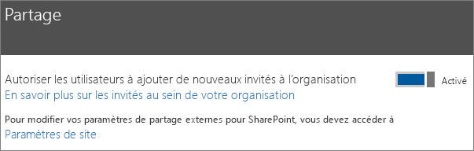
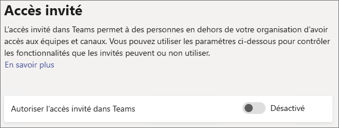
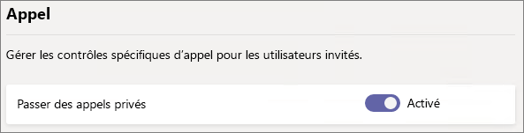
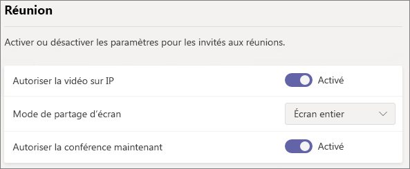
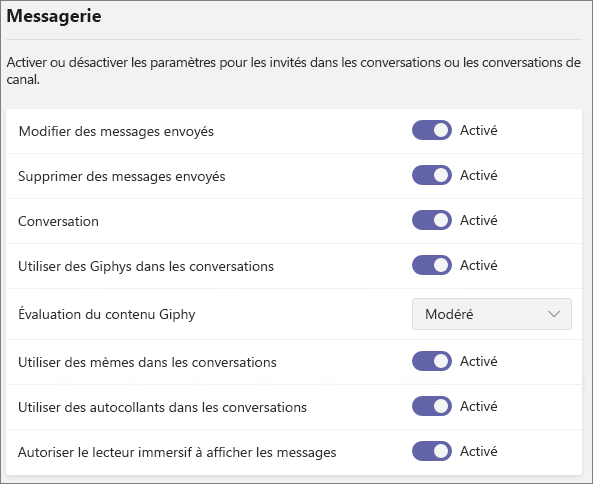
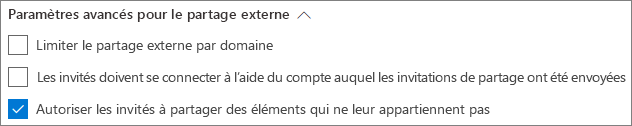
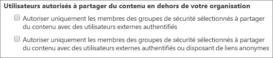

# Informations de référence sur les paramètres de partage d’invités de Microsoft 365Microsoft 365 guest sharing settings reference

Cet article fournit des informations de référence sur les différents paramètres qui peuvent affecter le partage d’invités pour les charges de travail Microsoft 365 : Teams, Groupes Office 365, SharePoint et OneDrive.This article provides a reference for the various settings that can affect guest sharing for the Microsoft 365 workloads: Teams, Office 365 Groups, SharePoint, and OneDrive. Ces paramètres se retrouvent dans les centres d’administration Azure Active Directory, Microsoft 365, Teams et SharePoint.These settings are located in the Azure Active Directory, Microsoft 365, Teams, and SharePoint admin centers.

## Azure Active DirectoryAzure Active Directory

**Rôle d’administrateur :** administrateur général**Admin role:** Global administrator

Azure Active Directory est le service d’annuaire utilisé par Microsoft 365.Azure Active Directory is the directory service used by  Microsoft 365. Les paramètres de relations organisationnelles Azure Active Directory affectent directement le partage dans Teams, Groupes Office 365, SharePoint et OneDrive.The Azure Active Directory Organizational relationships settings directly affect sharing in Teams, Office 365 Groups, SharePoint, and OneDrive.

> [!NOTE]
> Ces paramètres n’affectent SharePoint que lorsque [l’intégration de SharePoint et OneDrive avec Azure AD B2B (préversion)](https://docs.microsoft.com/sharepoint/sharepoint-azureb2b-integration-preview) a été configurée.These settings only affect SharePoint when [SharePoint and OneDrive integration with Azure AD B2B (Preview)](https://docs.microsoft.com/sharepoint/sharepoint-azureb2b-integration-preview) has been configured. Le tableau ci-dessous part du principe que cette intégration a été configuré.The table below assumes that this has been configured.

### Paramètres de relations organisationnellesOrganizational relationships settings

**Navigation :** [Centre d’administration Azure Active Directory](https://aad.portal.azure.com) > Azure Active Directory > Relations organisationnelles**Navigation:** [Azure Active Directory admin center](https://aad.portal.azure.com) > Azure Active Directory > Organizational relationships > Settings

|**Paramètre****Setting**|**Par défaut****Default**|**Description****Description**|
|:-----|:-----|:-----|
|Les autorisations des utilisateurs invités sont limitéesGuest users permissions are limited|OuiYes|Ce paramètre affecte les tâches d’annuaire qu’un invité peut effectuer.This setting affects the directory tasks that a guest can perform.|
|Les administrateurs et les utilisateurs membres du rôle Inviteur d’invités peuvent envoyer des invitationsAdmins and users in the guest inviter role can invite|OuiYes|Lorsque ce paramètre est défini sur **Oui**, les administrateurs peuvent inviter des invités via Azure AD et via des expériences de partage Microsoft 365 telles que Teams et SharePoint. Quand il est défini sur **Non**, ils ne le peuvent pas.When set to **Yes**, admins can invite guests via Azure AD and via  Microsoft 365 sharing experiences such as Teams and SharePoint; when set to **No**, they cannot.|
|Les membres peuvent inviterMembers can invite|OuiYes|Lorsque ce paramètre est défini sur **Oui**, les membres Azure AD peuvent inviter des invités via Azure AD. Quand il est défini sur **Non**, ils ne le peuvent pas.When set to **Yes**, Azure AD members can invite guests via Azure AD; when set to **No**, they cannot. Lorsqu’il est défini sur **Oui**, les membres de Groupes Office 365 peuvent inviter des invités avec l’approbation du propriétaire. Quand il est défini sur **Non**, les membres de Groupes Office 365 peuvent inviter des invités avec l’approbation du propriétaire, à la condition que celui-ci soit administrateur global.When set to **Yes**, Office 365 Group members can invite guests with owner approval; when set to **No**, Office 365 Group members can invite guests with owner approval but owners must be global administrators to approve.   Notez que l’option **Les membres peuvent inviter** fait référence aux membres d’Azure AD (par opposition aux invités), non à des membres de site ou de groupe dans Microsoft 365.Note that **Members can invite** refers to members in Azure AD (as opposed to guests) and not to site or group members in  Microsoft 365.   Elle produit le même effet que le paramètre **Autoriser les utilisateurs à ajouter de nouveaux invités à l’organisation** de Sécurité et confidentialité dans Microsoft 365.This is identical to the **Let users add new guests to the organization** setting in Microsoft 365 Security & privacy.|
|Les invités peuvent inviterGuests can invite|OuiYes|Lorsque ce paramètre est défini sur **Oui**, les invités figurant dans l’annuaire peuvent inviter d’autres invités à collaborer sur des ressources Azure AD, ainsi que sur les fichiers et dossiers SharePoint et OneDrive. Quand il est défini sur **Non**, ils ne le peuvent pas.When set to **Yes**, guests in the directory can invite other guests to collaborate on Azure AD resources and on files and folders in SharePoint and OneDrive; when set to **No**, they cannot.   Notez que, pour que les invités puissent partager des fichiers et dossiers avec d’autres invités, le paramètre **Permettre aux utilisateurs externes de trouver des comptes d’utilisateurs dans l’annuaire en tapant des correspondances d’adresse de courrier exactes** doit être activé dans le Centre d’administration SharePoint.Note that **Allow external users to find user accounts in the directory by typing in exact email address matches** must be turned on in the SharePoint admin center for guests to share files and folders with other guests.|
|Activer le code secret à usage unique du courrier pour les invités (préversion)Enable Email One-Time Passcode for guests (Preview)|NonNo|Lorsque ce paramètre est défini sur **Oui**, les invités ne disposant pas d’un compte de service administré (MSA) ou d’un compte professionnel ou scolaire peuvent s’[authentifier auprès d’Azure AD à l’aide d’un code secret à usage unique](https://docs.microsoft.com/azure/active-directory/b2b/one-time-passcode). Quand il est défini sur **Non**, les utilisateurs doivent créer un compte Microsoft pour s’authentifier.When set to **Yes**, guests without an MSA or a work or school account can [authenticate with Azure AD using a one-time passcode](https://docs.microsoft.com/azure/active-directory/b2b/one-time-passcode); when set to **No**, users will need to create a Microsoft account in order to authenticate. Pour fonctionner, ce paramètre doit être défini sur **Oui** pour l’[intégration de SharePoint et de OneDrive avec Azure AD B2B (préversion)](https://docs.microsoft.com/sharepoint/sharepoint-azureb2b-integration-preview).This setting must be set to **Yes** for [SharePoint and OneDrive integration with Azure AD B2B (Preview)](https://docs.microsoft.com/sharepoint/sharepoint-azureb2b-integration-preview) to work.|
|Restrictions de collaborationCollaboration restrictions|Autoriser l’envoi d’invitations à tout domaineAllow invitations to be sent to any domain|Ce paramètre vous permet de spécifier une liste de domaines dont le partage est autorisé ou bloqué.This setting allows you to specify a list of allowed or blocked domains for sharing. Lorsque des domaines autorisés sont spécifiés, des invitations de partage ne peuvent être envoyées qu’à ces domaines.When allowed domains are specified, then sharing invitations can only be sent to those domains. Lorsque des domaines refusés sont spécifiés, des invitations de partage ne peuvent pas être envoyées à ces domaines.When denied domains are specified, then sharing invitations cannot be sent to those domains.   Ce paramètre affecte les expériences de partage Microsoft 365 telles que Teams et SharePoint.This setting affects  Microsoft 365 sharing experiences such as Teams and SharePoint. Vous pouvez autoriser ou bloquer des domaines de façon plus précise à l’aide de la fonctionnalité de filtrage par domaine dans SharePoint ou Teams.You can allow or block domains at a more granular level by using domain filtering in SharePoint or Teams.|

Ces paramètres affectent la manière dont les utilisateurs sont invités à l’annuaire.These settings affect how users are invited to the directory. Il n’affectent pas le partage avec des invités figurant déjà dans l’annuaire.They do not affect sharing with guests who are already in the directory.

## Microsoft 365Microsoft 365

**Rôle d’administrateur :** administrateur général**Admin role:** Global administrator

Le Centre d’administration Microsoft 365 comporte des paramètres de niveau organisation pour le partage et les Groupes Office 365.The Microsoft 365 admin center has organization-level settings for sharing and for Office 365 Groups.

### PartageSharing

**Navigation :** [Centre d’administration Microsoft 365](https://admin.microsoft.com) > Paramètres > Sécurité et confidentialité > Partage**Navigation:** [Microsoft 365 admin center](https://admin.microsoft.com) > Settings > Security & privacy > Sharing

|**Paramètre****Setting**|**Par défaut****Default**|**Description****Description**|
|:-----|:-----|:-----|
|Autoriser les utilisateurs à ajouter de nouveaux invités à l’organisationLet users add new guests to the organization|ActivéOn|Lorsque ce paramètre est défini sur **Oui**, les membres Azure AD peuvent inviter des invités via Azure AD. Quand il est défini sur **Non**, ils ne le peuvent pas.When set to **Yes**, Azure AD members can invite guests via Azure AD; when set to **No**, they cannot. Lorsqu’il est défini sur **Oui**, les membres de Groupes Office 365 peuvent inviter des invités avec l’approbation du propriétaire. Quand il est défini sur **Non**, les membres de Groupes Office 365 peuvent inviter des invités avec l’approbation du propriétaire, à la condition que celui-ci soit administrateur global.When set to **Yes**, Office 365 Group members can invite guests with owner approval; when set to **No**, Office 365 Group members can invite guests with owner approval but owners must be global administrators to approve.   Notez que l’option **Les membres peuvent inviter** fait référence aux membres d’Azure AD (par opposition aux invités), non à des membres de site ou de groupe dans Microsoft 365.Note that **Members can invite** refers to members in Azure AD (as opposed to guests) and not to site or gorup members in  Microsoft 365.   Il produit le même effet que le paramètre **Les membres peuvent inviter** dans les paramètres de relations organisationnelles Azure Active Directory.This is identical to the **Members can invite** setting in Azure Active Directory Organizational relationships settings.|

### Groupes Office 365Office 365 Groups

**Navigation :** [Centre d’administration Microsoft 365](https://admin.microsoft.com) > Paramètres > Services et compléments > Groupes Office 365**Navigation:** [Microsoft 365 admin center](https://admin.microsoft.com) > Settings > Services & add-ins > Office 365 Groups

|**Paramètre****Setting**|**Par défaut****Default**|**Description****Description**|
|:-----|:-----|:-----|
|Permettre aux membres du groupe extérieurs à votre organisation d’accéder au contenu du groupeLet group members outside your organization access group content|ActivéOn|Lorsque ce paramètre est défini sur **Activé**, les invités peuvent accéder au contenu des groupes. Quand il est défini sur **Désactivé**, ils ne le peuvent pas.When set to **On**, guests can access groups content; when set to **Off**, they can't. Ce paramètre doit être **Activé** pour tout scénario dans lequel des utilisateurs invités interagissent avec Groupes Office 365 ou Teams.This setting should be **On** for any scenario where guest users are interacting with Office 365 Groups or Teams.|
|Permettre aux propriétaires de groupe d’ajouter des personnes en dehors de votre organisation aux groupesLet group owners add people outside your organization to groups|ActivéOn|Lorsque ce paramètre est **Activé**, les propriétaires de Groupes Office 365 ou d’équipes Teams peuvent inviter de nouveaux invités à rejoindre le groupe.When **On**, Owners of Office 365 Groups or Teams can invite new guests to the group. Quand il est **Désactivé**, les propriétaires peuvent inviter que des invités figurant déjà dans l’annuaire.When **Off**, owners can only invite guests who are already in the directory.|

Ces paramètres s’appliquent au niveau de l’organisation.These settings are at the organization level. Pour en savoir plus sur la modification de ces paramètres au niveau du groupe à l’aide de PowerShell, consultez [Créer des paramètres pour un groupe spécifique](https://docs.microsoft.com/azure/active-directory/users-groups-roles/groups-settings-cmdlets#create-settings-for-a-specific-group).See [Create settings for a specific group](https://docs.microsoft.com/azure/active-directory/users-groups-roles/groups-settings-cmdlets#create-settings-for-a-specific-group) for information about how to change these settings at the group level by using PowerShell.

## TeamsTeams

Le commutateur d’accès invité principal de Teams, **Autoriser l’accès invité dans Teams**, doit être **Activé** pour que les autres paramètres d’invité soient disponibles.The Teams master guest access switch, **Allow guest access in Teams**, must be **On** for the other guest settings to be available.

**Rôle d’administrateur :** Administrateur du service Teams**Admin role:** Teams service administrator

### Accès invitéGuest access

**Navigation :** [Centre d’administration Teams](https://admin.teams.microsoft.com) > Paramètres à l’échelle de l’organisation > Accès invité**Navigation:** [Teams admin center](https://admin.teams.microsoft.com) > Org-wide settings > Guest access

|**Paramètre****Setting**|**Par défaut****Default**|**Description****Description**|
|:-----|:-----|:-----|
|Autoriser l’accès invité dans TeamsAllow guest access in Teams|DésactivéOff|Active ou désactive l’accès invité dans Teams.Turns guest access on or off for Teams overall. Une fois ce paramètre modifié, la prise d’effet de la modification peut prendre jusqu’à 24 heures .This setting can take 24 hours to take effect once changed.|

### Appel d’invitéGuest calling

**Navigation :** [Centre d’administration Teams](https://admin.teams.microsoft.com) > Paramètres à l’échelle de l’organisation > Accès invité**Navigation:** [Teams admin center](https://admin.teams.microsoft.com) > Org-wide settings > Guest access

|**Paramètre****Setting**|**Par défaut****Default**|**Description****Description**|
|:-----|:-----|:-----|
|Passer des appels privésMake private calls|ActivéOn|Lorsque ce paramètre est **Activé**, les invités peuvent passer des appels de poste à poste dans Teams. Quand il est **Désactivé**, ils ne le peuvent pas.When **On**, guests can make peer-to-peer calls in Teams; when **Off**, they can't.|

### Réunion d’invitéGuest meeting

**Navigation :** [Centre d’administration Teams](https://admin.teams.microsoft.com) > Paramètres à l’échelle de l’organisation > Accès invité**Navigation:** [Teams admin center](https://admin.teams.microsoft.com) > Org-wide settings > Guest access

|**Paramètre****Setting**|**Par défaut****Default**|**Description****Description**|
|:-----|:-----|:-----|
|Autoriser la vidéo sur IPAllow IP video|ActivéOn|Lorsque ce paramètre est **Activé**, les invités peuvent utiliser la vidéo pour leurs appels et réunions. Quand il est **Désactivé**, ils ne le peuvent pas.When **On**, guests can use video in their calls and meetings; when **Off**, they can't.|
|Mode de partage d’écranScreen sharing mode|Écran entierEntire screen|Lorsque ce paramètre est **Désactivé**, les invités ne peuvent pas partager leur écran dans Teams.When **Disabled**, guests can't share their screens in Teams. Quand il est défini sur **Application unique**, les invités ne peuvent partager qu’une seule application sur leur écran.When set to **Single application**, guests can only share a single application on their screen. Quand il est défini sur **Écran entier**, les invités peuvent choisir de partager une application ou leur écran entier.When set to **Entire screen**, guests can choose to share an applicaion or their entire screen.|
|Autoriser la conférence maintenantAllow Meet Now|ActivéOn|Lorsque ce paramètre est **Activé**, les invités peuvent utiliser la fonctionnalité Conférence maintenant dans Teams. Quand il est **Désactivé**, ils ne le peuvent pas.When **On**, guests can use the Meet Now feature in Teams; when **Off**, they can't.|

### Messagerie d’invitéGuest messaging

**Navigation :** [Centre d’administration Teams](https://admin.teams.microsoft.com) > Paramètres à l’échelle de l’organisation > Accès invité**Navigation:** [Teams admin center](https://admin.teams.microsoft.com) > Org-wide settings > Guest access

|**Paramètre****Setting**|**Par défaut****Default**|**Description****Description**|
|:-----|:-----|:-----|
|Modifier des messages envoyésEdit sent messages|ActivéOn|Lorsque ce paramètre est **Activé**, les invités peuvent modifier des messages qu’ils ont envoyés. Quand il est **Désactivé**, ils ne le peuvent pas.When **On**, guests can edit messages they previously sent; when **Off**, they can't.|
|Supprimer des messages envoyésDelete sent messages|ActivéOn|Lorsque ce paramètre est **Activé**, les invités peuvent supprimer des messages qu’ils ont envoyés. Quand il est **Désactivé**, ils ne le peuvent pas.When **On**, guests can delete messages they previously sent; when **Off**, they can't.|
|ConversationChat|ActivéOn|Lorsque ce paramètre est **Activé**, les invités peuvent utiliser la conversation dans Teams. Quand il est **Désactivé**, ils ne le peuvent pas.When **On**, guests can use chat in Teams; when **Off**, they can't.|
|Utiliser des images Giphy dans les conversationsUse Giphys in conversations|ActivéOn|Lorsque ce paramètre est **Activé**, les invités peuvent utiliser des images Giphy dans les conversations. Quand il est **Désactivé**, ils ne le peuvent pas.When **On**, guests can use Giphys in conversations; when **Off**, they can't.|
|Évaluation du contenu GiphyGiphy content rating|ModéréModerate|Lorsque ce paramètre est défini sur **Autoriser tout le contenu**, les invités peuvent insérer les images Giphy de leur choix dans les conversations, quelle que soit l’évaluation du contenu.When set to **Allow all content**, guests will can insert all Giphys in chats, regardless of the content rating. Lorsque ce paramètre est défini sur **Modéré**, les invités peuvent insérer des images Giphy dans les conversations, mais sont modérément restreints en lien avec le contenu adulte.Wnen set to **Moderate** guests can insert Giphys in chats, but will be moderately restricted from adult content. Lorsque ce paramètre est défini sur **Strict**, les invités peuvent insérer des images Giphy dans les conversations, mais ne peuvent pas insérer de contenu adulte.When set to **Strict** guests can insert Giphys in chats, but will be restricted from inserting adult content.|
|Utiliser des mèmes dans les conversationsUse Memes in conversations|ActivéOn|Lorsque ce paramètre est **Activé**, les invités peuvent utiliser des mèmes dans les conversations. Quand il est **Désactivé**, ils ne le peuvent pas.When **On**, guests can use memes in conversations; when **Off**, they can't.|
|Utiliser des autocollants dans les conversationsUser stickers in conversations|ActivéOn|Lorsque ce paramètre est **Activé**, les invités peuvent utiliser des autocollants dans les conversations. Quand il est **Désactivé**, ils ne le peuvent pas.When **On**, guests can use stickers in conversations; when **Off**, they can't.|
|Autoriser le lecteur immersif à afficher les messagesAllow immersive reader for viewing messages|ActivéOn|Lorsque ce paramètre est **Activé**, les invités peuvent afficher des messages dans le lecteur immersif. Quand il est **Désactivé**, ils ne le peuvent pas.When **On**, guests can view messages in Immersive Reader; when **Off**, they can't.|

## SharePoint et OneDrive (niveau organisation)SharePoint and OneDrive (organization-level)

**Rôle d’administrateur :** Administrateur SharePoint**Admin role:** SharePoint administrator

Ces paramètres affectent tous les sites au sein de l’organisation.These settings affect all of the sites in the organization. Ils n’affectent pas directement les solutions Groupes Office 365 ou Teams, mais nous vous recommandons de les aligner sur les paramètres de celles-ci afin d’éviter de perturber l’expérience utilisateurThey do not affect Office 365 Groups or Teams directly, however we recommend that you align these settings with the settings for Office 365 Groups and Teams to avoid user experience issues. (par exemple, si le partage d’invités est autorisé dans Teams mais pas dans SharePoint, les invités dans Teams n’ont pas accès à l’onglet Fichiers, car les fichiers de Teams sont stockés sur SharePoint).(For example, if guest sharing is allowed in Teams but not SharePoint, then guests in Teams will not have access to the Files tab because Teams files are stored in SharePoint.)

### Paramètres de partage dans SharePoint et OneDriveSharePoint and OneDrive sharing settings

Étant donné que OneDrive est une hiérarchie de sites au sein de SharePoint, les paramètres de partage au niveau de l’organisation affectent directement OneDrive tout comme les autres sites SharePoint.Because OneDrive is a hierarchy of sites within SharePoint, the organization-level sharing settings directly affect OneDrive just as they do other SharePoint sites.

**Navigation :** Centre d’administration SharePoint > Partage**Navigation:** SharePoint admin center > Sharing

|**Paramètre****Setting**|**Par défaut****Default**|**Description****Description**|
|:-----|:-----|:-----|
|SharePointSharePoint|Tout le mondeAnyone|Spécifie les autorisations de partage les plus permissives accordées pour les sites SharePoint.Specifies the most permissive sharing permissions allowed for SharePoint sites.|
|OneDriveOneDrive|Tout le mondeAnyone|Spécifie les autorisations de partage les plus permissives accordées pour les sites OneDrive.Specifies the most permissive sharing permissions allowed for OneDrive sites. Ce paramètre ne peut pas être plus permissif que le paramètre SharePoint.This setting cannot be more permissive than the SharePoint setting.|

### Paramètres de partage avancé de SharePoint et OneDriveSharePoint and OneDrive advanced sharing settings

**Navigation :** Centre d’administration SharePoint > Partage**Navigation:** SharePoint admin center > Sharing

|**Paramètre****Setting**|**Par défaut****Default**|**Description****Description**|
|:-----|:-----|:-----|
|Limiter le partage externe par domaineLimit external sharing by domain|DésactivéOff|Ce paramètre vous permet de spécifier une liste de domaines dont le partage est autorisé ou bloqué.This setting allows you to specify a list of allowed or blocked domains for sharing. Lorsque des domaines autorisés sont spécifiés, des invitations de partage ne peuvent être envoyées qu’à ces domaines.When allowed domains are specified, then sharing invitations can only be sent to those domains. Lorsque des domaines refusés sont spécifiés, des invitations de partage ne peuvent pas être envoyées à ces domaines.When denied domains are specified, then sharing invitations cannot be sent to those domains.   Ce paramètre affecte tous les sites SharePoint et OneDrive au sein de l’organisation.This setting affects all SharePoint and OneDrive sites in the organization.|
|Les invités doivent se connecter à l’aide du compte auquel les invitations de partage ont été envoyéesGuests must sign in using the same account to which sharing invitations are sent|DésactivéOff|Empêche les invités d’utiliser des invitations de partage de sites à l’aide d’une envoyer un e-mail différente de celle à laquelle l’invitation a été envoyée.Prevents guests from redeeming site sharing invitations using a different email address than the invitation was sent to.  L’[intégration de SharePoint et de OneDrive avec Azure AD B2B (préversion)](https://docs.microsoft.com/sharepoint/sharepoint-azureb2b-integration-preview) n’utilise pas ce paramètre parce que tous les invités sont ajoutés à l’annuaire en fonction de l’adresse e-mail à laquelle l’invitation a été envoyée.[SharePoint and OneDrive integration with Azure AD B2B (Preview)](https://docs.microsoft.com/sharepoint/sharepoint-azureb2b-integration-preview) does not use this setting because all guests are added to the directory based on the email address that the invitation was sent to. D’autres adresses e-mail ne peuvent pas être utilisées pour accéder au site.Alternate email addresses cannot be used to access the site.|
|Autoriser les invités à partager des éléments qui ne leur appartiennent pasAllow guests to share items they don't own|ActivéOn|Lorsque ce paramètre est **Activé**, les invités peuvent partager des éléments dont ils ne sont pas propriétaires avec d’autres utilisateurs ou invités. Quand il est **Désactivé**, ils ne le peuvent pas.When **On**, guests can share items that they don't own with other users or guests; when **Off** they cannot. Les invités peuvent toujours partager des éléments sur lesquels ils disposent d’un contrôle total.Guests can always share items for which they have full control.|

### Paramètres de lien de fichier et de dossier SharePoint et OneDriveSharePoint and OneDrive file and folder link settings

Lorsque des fichiers et dossiers sont partagés sur SharePoint et OneDrive, les destinataires du partage reçoivent un lien contenant des autorisations sur ces fichiers ou dossiers, au lieu de se voir accorder un accès direct à ceux-ci.When files and folders are shared in SharePoint and OneDrive, sharing recipients are sent a link with permissions to the file or folder rather than being granted direct access to the file or folder themselves. Plusieurs types de liens sont disponibles et vous pouvez choisir le type de lien par défaut présenté aux utilisateurs qui partagent un fichier ou dossier.Several types of links are available, and you can choose the default link type presented to users when they share a file or folder. Vous pouvez également définir des autorisations et des options d’expiration pour les liens *Tout le monde*.You can also set permissions and expiration options for *Anyone* links.

**Navigation :** Centre d’administration SharePoint > Partage**Navigation:** SharePoint admin center > Sharing

|**Paramètre****Setting**|**Par défaut****Default**|**Description****Description**|
|:-----|:-----|:-----|
|Liens de fichiers et dossiersFile and folder links|Toute personne disposant du lienAnyone with this link|Spécifie le lien de partage affiché par défaut quand un utilisateur partage un fichier ou dossier.Specifies which sharing link is shown by default when a user shares a file or folder. Les utilisateurs peuvent modifier l’option avant de partager s’ils le souhaitent.Users can change the option before sharing if they want. Si le paramètre par défaut est **Toute personne disposant du lien** et que le mode de partage *Tout le monde* n’est pas autorisé pour un site donné, l’option par défaut **Uniquement les membres de votre organisation** est affichée pour ce site.If the default is set to **Anyone with the link** and *Anyone* sharing is not allowed for a given site, then **Only people in your organization** will be shown as the default for that site.|
|Ces liens doivent expirer dans le nombre de jours suivantThese links must expire within this many days|Désactivé (pas d’expiration)Off (no expiration)|Spécifie le nombre de jours à l’issue desquels un lien *Tout le monde* expire après sa création.Specifies the number of days after an *Anyone* link is created that it expires. Il n’est pas possible de renouveler des liens qui ont expiré.Expired links cannot be renewed. Si vous devez continuer à partager après l’expiration du lien, créez un nouveau lien.Create a new link if you need to continue sharing past the expiration.|
|Autorisations d’accès aux fichiersFile permissions|Afficher et modifierView and edit slide notes|Spécifie les niveaux d’autorisation d’accès au fichier disponibles pour les utilisateurs lors de la création d’un lien accessible à *Tout le monde*.Specifies the file permission levels available to users when creating an *Anyone* link. Si **Affichage** est sélectionné, les utilisateurs ne peuvent créer des liens de fichiers accessibles à *Tout le monde* qu’avec des autorisations d’affichage.If **View** is selected, then users can only create *Anyone* file links with view permissions. Si l’option **Afficher et modifier** est activée, les utilisateurs ont le choix entre les autorisations Afficher et Afficher et modifier quand ils créent le lien.If **View, and edit** is selected, then users can choose between view and view and edit permissions when they create the link.|
|Autorisations d’accès aux dossiersFolder permissions|Afficher, modifier et chargerView, edit, and upload|Spécifie les niveaux d’autorisation d’accès au dossier disponibles pour les utilisateurs lors de la création d’un lien accessible à *Tout le monde*.Specifies the folder permission levels available to users when creating an *Anyone* link. Si **Affichage** est sélectionné, les utilisateurs ne peuvent créer des liens de dossiers accessibles à *Tout le monde* qu’avec des autorisations d’affichage.If **View** is selected, then users can only create *Anyone* folder links with view permissions. Si l’option **Afficher, modifier et charger** est activée, les utilisateurs ont le choix entre les autorisations Afficher, Modifier et Charger quand ils créent le lien.If **View, edit, and upload** is selected, then users can choose between view and view, edit, and upload permissions when they creat the link.|

### Paramètres de groupe de sécurité dans SharePoint et OneDriveSharePoint and OneDrive security group settings

Si vous souhaitez limiter le nombre de personnes pouvant partager avec des invités dans SharePoint et OneDrive, vous le pouvez en limitant le partage aux personnes appartenant à des groupes de sécurité spécifiés.If you want to limit who can share with guests in SharePoint and OneDrive, you can do so by limiting sharing to people in specified security groups. Ces paramètres n’affectent pas le partage via Groupes Office 365 et Teams.These settings do not affect sharing via Office 365 Groups or Teams. Des invités invités via un groupe ou une équipe auraient également accès au site associé, même si le partage de documents et de dossiers ne pourrait être effectué que par des personnes appartenant aux groupes de sécurité spécifiés.Guests invited via a group or team would also have access to the associated site, though document and folder sharing could only be done by people in the specified security groups.

**Navigation :** Centre d’administration SharePoint > Partage > Limiter le partage externe avec des groupes de sécurité spécifiques**Navigation:** SharePoint admin center > Sharing > Limit external sharing to specific security groups

|**Paramètre****Setting**|**Par défaut****Default**|**Description****Description**|
|:-----|:-----|:-----|
|Autoriser uniquement les membres des groupes de sécurité sélectionnés à partager du contenu avec des utilisateurs externes authentifiésnote the security groups listed for Let only users in selected security groups share with authenticated external users.|DésactivéOff|Lorsque ce paramètre est **Activé**, seules les personnes appartenant aux groupes de sécurité spécifiés peuvent partager avec des utilisateurs externes.When **On**, only the people in the specified security groups can share with external users. Seuls des liens *Personnes spécifiques* sont disponibles.Only *Specific people* links are available. Le partage avec *Tout le monde* est désactivé sauf si le paramètre **Autoriser uniquement les membres des groupes de sécurité sélectionnés à partager du contenu avec des utilisateurs externes authentifiés ou disposant de liens anonymes** est également **Activé**.*Anyone* sharing is effectively disabled unless **Let only users in selected security groups share with authenticated external users and using anonymous links** is also **On**|
|Autoriser uniquement les membres des groupes de sécurité sélectionnés à partager du contenu avec des utilisateurs externes authentifiés ou disposant de liens anonymesnote the security groups listed for Let only users in selected security groups share with authenticated external users and using anonymous links.|DésactivéOff|Lorsque le paramètre est **Activé**, seules les personnes appartenant aux groupes de sécurité spécifiés peuvent partager avec des invités.When **On**, only the people in the specified security groups can share with guests. Les liens *Tout le monde* et *Personnes spécifiques* sont disponibles.Both *Anyone* and *Specific people* links are available.|

Ces deux paramètres peuvent être utilisés en même temps.Both of these settings can be used at the same time. Si un utilisateur appartient à des groupes de sécurité spécifiés pour les deux paramètres, le niveau d’autorisation le plus élevé prévaut (*Tout le monde* plus *Utilisateur spécifique*).If a user is in security groups specified for both settings, then the greater permission level prevails (*Anyone* plus *Specific user*).

## SharePoint (au niveau du site)SharePoint (site level)

**Rôle d’administrateur :** Administrateur SharePoint**Admin role:** SharePoint administrator

### Partage de siteSite sharing

Vous pouvez définir des autorisations de partage d’invités pour chaque site dans SharePoint.You can set guest sharing permissions for each site in SharePoint. Ce paramètre s’applique tant au partage de site qu’au partage de fichier et de dossier.This setting applies to both site sharing and file and folder sharing. (Le partage avec *Tout le monde* n’est pas disponible pour le partage de site.(*Anyone* sharing is not available for site sharing. Si vous choisissez **Tout le monde**, les utilisateurs peuvent partager des fichiers et dossiers en utilisant des liens accessibles à *Tout le monde*, et le site proprement dit avec des invités nouveaux et existants.)If you choose **Anyone**, users will be able to share files and folders by using *Anyone* links, and the site itself with new and existing guests.)

**Navigation :** Centre d’administration SharePoint > Sites actifs > sélectionnez le site > Partage**Navigation:** SharePoint admin center > Active sites > select the site > Sharing

|**Paramètre****Setting**|**Par défaut****Default**|**Description****Description**|
|:-----|:-----|:-----|
|Le contenu du site peut être partagé avecSite content can be shared with|Varie en fonction du type de site (voir le tableau ci-dessous)Varies by site type (see the table below)|Indique le type de partage externe autorisé pour ce site.Indicates the type of external sharing allowed for this site. Les options disponibles dépendent des paramètres de partage au niveau de l’organisation pour SharePoint.Options available here are subject to the organization-level sharing settings for SharePoint.|

Étant donné que ces paramètres dépendent des paramètres définis à l’échelle de l’organisation pour SharePoint, le paramètre de partage effectif pour le site peut changer si le paramètre au niveau de l’organisation change.Because these settings are subject to the organization-wide settings for SharePoint, the effective sharing setting for the site may change if the organization-level setting changes. Si vous choisissez un paramètre ici et que le niveau de l’organisation est défini ultérieurement sur une valeur plus restrictive, ce site fonctionnera conformément à cette valeur plus restrictive.If you choose a setting here and the organization-level is later set to a more restrictive value, then this site will operate at that more restrictive value. Par exemple, si vous choisissez **Tout le monde** et que le paramètre au niveau de l’organisation est défini ultérieurement sur **Invités nouveaux et existants**, ce site n’autorisera que des invités nouveaux et existants.For example, if you choose **Anyone** and the organization-level setting is later set to **New and existing guests**, then this site will only allow new and existing guests. Si le paramètre au niveau de l’organisation est ensuite redéfini sur **Tout le monde**, ce site autorisera de nouveau les liens *Tout le monde*.If the organization-level setting is then set back to **Anyone**, this site would again allow *Anyone* links.

Le tableau ci-dessous présente le paramètre de partage par défaut pour chaque type de site.The table below shows the default sharing setting for each site type.

|**Type de site****Site Type**|**Paramètre de partage par défaut****Default sharing setting**|
|:-----|:-----|
|ClassiqueClassic.|**Uniquement les membres de votre organisation****Only people in your organization**|
|OneDriveOneDrive|**Tout le monde****Anyone**|
|Sites connectés au groupe (notamment Teams)Group-connected sites (including Teams)|**Invités nouveaux et existants** si le paramètre de la solution Groupes Office 365 **Autoriser les propriétaires de groupe à ajouter des personnes à l’extérieur de l’organisation aux groupes** est **Activé**. Dans le cas contraire, **Invités existants uniquement****New and existing guests** if the Office 365 Groups setting **Let group owners add people outside the organization to groups** is **On**; otherwise **Existing guests only**|
|CommunicationCommunication sites|**Uniquement les membres de votre organisation****Only people in your organization**|
|Sites modernes sans groupe (#STS3 TeamSite)Modern sites with no group (#STS3 TeamSite)|**Uniquement les membres de votre organisation****Only people in your organization**|

## Voir aussiSee also

[Vue d’ensemble du partage externe dans SharePoint et OneDriveSharePoint and OneDrive external sharing overview](https://docs.microsoft.com/sharepoint/external-sharing-overview)

[Accès invité dans Microsoft TeamsGuest access in Teams](https://docs.microsoft.com/MicrosoftTeams/guest-access)

[Ajout d’invités à des Groupes Office 365Adding guests to Office 365 Groups](https://support.office.com/article/bfc7a840-868f-4fd6-a390-f347bf51aff6)
