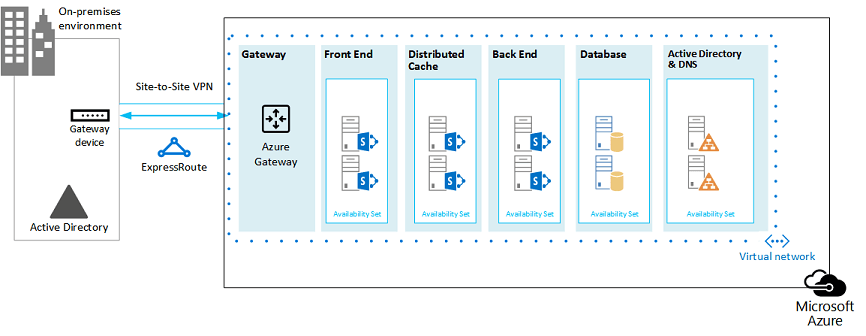

# Architectures Microsoft Azure pour SharePoint 2013Microsoft Azure Architectures for SharePoint 2013

 **Résumé :** Les solutions SharePoint 2013 peuvent être hébergées sur des machines virtuelles Microsoft Azure. Découvrez quels types de solution sont adaptés et comment configurer Microsoft Azure pour en héberger une.**Summary:** SharePoint 2013 solutions can be hosted in Microsoft Azure virtual machines. Learn which type of solutions are a good fit and how to set up Microsoft Azure to host one.
  
Azure est un environnement propice à l'hébergement d'une solution SharePoint Server 2013. Dans la plupart des cas, nous vous recommandons Office 365, mais une batterie de serveurs SharePoint Server hébergée dans Azure peut être une bonne option pour des solutions spécifiques. Cet article explique comment créer des solutions SharePoint adaptées à la plateforme Azure. Les deux solutions spécifiques suivantes sont utilisées comme exemples :Azure is a good environment for hosting a SharePoint Server 2013 solution. In most cases, we recommend Office 365, but a SharePoint Server farm hosted in Azure can be a good option for specific solutions. This article describes how to architect SharePoint solutions so they are a good fit in the Azure platform. The following two specific solutions are used as examples:
  
- [Récupération d'urgence SharePoint Server 2013 dans Microsoft AzureSharePoint Server 2013 Disaster Recovery in Microsoft Azure](sharepoint-server-2013-disaster-recovery-in-microsoft-azure.md)
    
- [Sites Internet dans Microsoft Azure qui utilisent SharePoint Server 2013Internet Sites in Microsoft Azure using SharePoint Server 2013](internet-sites-in-microsoft-azure-using-sharepoint-server-2013.md)
    
## Solutions SharePoint recommandées pour la solution Azure Infrastructure ServicesRecommended SharePoint solutions for Azure Infrastructure Services

Les services d'infrastructure Azure sont une option intéressante pour l'hébergement de solutions SharePoint. Certaines solutions sont plus adaptées à cette plateforme que d'autres. Le tableau suivant présente les solutions recommandées.Azure infrastructure services is a compelling option for hosting SharePoint solutions. Some solutions are a better fit for this platform than others. The following table shows recommended solutions.
  
|**Solution****Solution**|**Pourquoi cette solution est recommandée pour Azure****Why this solution is recommended for Azure**|
|:-----|:-----|
|Environnements de test et de développementDevelopment and test environments    |Il est facile de créer et de gérer ces environnements.It's easy to create and manage these environments.    |
|Récupération d'urgence de batteries de serveurs SharePoint locales sur AzureDisaster recovery of on-premises SharePoint farms to Azure    |**Centre de données secondaire hébergé** Utilisez Azure au lieu d'investir dans un centre de données secondaire dans une autre région.**Hosted secondary datacenter** Use Azure instead of investing in a secondary datacenter in a different region.   **Environnements de récupération d'urgence à moindre coût** Tenez à jour et payez pour moins de ressources qu'un environnement de récupération d'urgence local. Le nombre de ressources dépend de l'environnement de récupération d'urgence choisi : reprise progressive, secours semi-automatique ou serveur de secours.**Lower-cost disaster-recovery environments** Maintain and pay for fewer resources than an on-premises disaster recovery environment. The number of resources depends on the disaster recovery environment you choose: cold standby, warm standby, or hot standby.   **Plateforme plus flexible** En cas d'incident, augmentez facilement la taille des instances de votre batterie SharePoint de récupération pour répondre aux exigences de charge. Diminuez la taille des instances lorsque vous n'avez plus besoin des ressources.**More elastic platform** In the event of a disaster, easily scale-out your recovery SharePoint farm to meet load requirements. Scale in when you no longer need the resources.   Voir [Récupération d'urgence SharePoint Server 2013 dans Microsoft Azure](sharepoint-server-2013-disaster-recovery-in-microsoft-azure.md).See [SharePoint Server 2013 Disaster Recovery in Microsoft Azure](sharepoint-server-2013-disaster-recovery-in-microsoft-azure.md).    |
|Sites accessibles sur Internet qui utilisent des fonctionnalités et une échelle non disponibles dans Office 365Internet-facing sites that use features and scale not available in Office 365    |**Concentrez vos efforts** Concentrez-vous sur le développement d'un site de qualité plutôt que sur la construction d'une infrastructure.**Focus your efforts** Concentrate on building a great site rather than building infrastructure.   **Tirez parti de l'élasticité dans Azure** Redimensionnez la batterie de serveurs pour qu'elle soit adaptée à la demande en ajoutant de nouveaux serveurs et payez uniquement pour les ressources dont vous avez besoin. L'allocation de machine dynamique n'est pas prise en charge (mise à l'échelle automatique).**Take advantage of elasticity in Azure** Size the farm for the demand by adding new servers, and pay only for resources you need. Dynamic machine allocation is not supported (auto scale).   **Utilisez Azure Active Directory (AD)** Tirez parti d'Azure AD pour les comptes client.**Use Azure Active Directory (AD)** Take advantage of Azure AD for customer accounts.   **Ajoutez des fonctionnalités SharePoint non disponibles dans Office 365** Ajoutez des fonctionnalités d'analyse web et de création de rapports détaillés.**Add SharePoint functionality not available in Office 365** Add deep reporting and web analytics.   Voir [Sites Internet dans Microsoft Azure qui utilisent SharePoint Server 2013](internet-sites-in-microsoft-azure-using-sharepoint-server-2013.md).See [Internet Sites in Microsoft Azure using SharePoint Server 2013](internet-sites-in-microsoft-azure-using-sharepoint-server-2013.md).    |
|Batteries de serveurs d'application pour prendre en charge Office 365 ou les environnements locauxApp farms to support Office 365 or on-premises environments    |**Créez, testez et hébergez des applications** dans Azure pour prendre en charge à la fois les environnements locaux et cloud.**Build, test, and host apps** in Azure to support both on-premises and cloud environments.   **Hébergez ce rôle** dans Azure au lieu d'acheter du nouveau matériel pour les environnements locaux.**Host this role** in Azure instead of buying new hardware for on-premises environments.   |
   
Pour des solutions et des charges de travail de collaboration et intranet, envisagez les options suivantes :For intranet and collaboration solutions and workloads, consider the following options:
  
- Déterminez si Office 365 répond aux besoins de votre entreprise ou peut faire partie de la solution. Office 365 fournit un riche ensemble de fonctionnalités qui est toujours à jour.Determine if Office 365 meets your business requirements or can be part of the solution. Office 365 provides a rich feature set that is always up to date.
    
- Si Office 365 ne répond pas aux besoins de votre entreprise, envisagez une implémentation standard de SharePoint 2013 en local par Microsoft Consulting Services (MCS). Une architecture standard peut représenter pour vous une solution plus rapide, moins onéreuse et plus simple à prendre en charge qu'une architecture personnalisée.If Office 365 does not meet all your business requirements, consider a standard implementation of SharePoint 2013 on premises from Microsoft Consulting Services (MCS). A standard architecture can be a quicker, cheaper, and easier solution for you to support than a customized one. 
    
- Si une implémentation standard ne répond pas aux besoins de votre entreprise, envisagez une solution locale personnalisée.If a standard implementation doesn't meet your business requirements, consider a customized on-premises solution.
    
- Si l'utilisation d'une plateforme cloud est importante pour les besoins de votre entreprise, envisagez une implémentation standard ou personnalisée de SharePoint 2013 hébergé dans les services d'infrastructure Azure. Les solutions SharePoint sont beaucoup plus faciles à prendre en charge dans Azure que les autres plateformes cloud publiques Microsoft non natives.If using a cloud platform is important for your business requirements, consider a standard or customized implementation of SharePoint 2013 hosted in Azure infrastructure services. SharePoint solutions are much easier to support in Azure than other non-native Microsoft public cloud platforms.
    
## Avant de concevoir l’environnement AzureBefore you design the Azure environment

Bien que cet article utilise des exemples de topologies SharePoint, vous pouvez utiliser ces concepts de conception avec n'importe quelle topologie de batterie de serveurs SharePoint. Avant de concevoir l'environnement Azure, suivez les instructions suivantes en matière de topologie, d'architecture, de capacité et de performances pour concevoir la batterie de serveurs SharePoint :While this article uses example SharePoint topologies, you can use these design concepts with any SharePoint farm topology. Before you design the Azure environment, use the following topology, architecture, capacity, and performance guidance to design the SharePoint farm:
  
- [Conception de l'architecture pour les professionnels de l'informatique SharePoint 2013Architecture design for SharePoint 2013 IT pros](https://technet.microsoft.com/sharepoint/fp123594.aspx)
    
- [Plan for performance and capacity management in SharePoint Server 2013Plan for performance and capacity management in SharePoint Server 2013](https://technet.microsoft.com/library/8dd52916-f77d-4444-b593-1f7d6f330e5f.aspx)
    
## Déterminer le type de domaine Active DirectoryDetermine the Active Directory domain type

Chaque batterie de serveurs SharePoint Server s'appuie sur Active Directory pour fournir des comptes d'administration pour la configuration de batterie de serveurs. Pour le moment, deux options sont disponibles pour les solutions SharePoint dans Azure. Celles-ci sont décrites dans le tableau suivant.Each SharePoint Server farm relies on Active Directory to provide administrative accounts for farm setup. At this time, there are two options for SharePoint solutions in Azure. These are described in the following table.
  
|**Option****Option**|**Description****Description**|
|:-----|:-----|
|Domaine dédiéDedicated domain    |Vous pouvez déployer un domaine Active Directory dédié et isolé vers Azure pour prendre en charge votre batterie de serveurs SharePoint. Il s'agit d'un bon choix pour les sites Internet destinés au public.You can deploy a dedicated and isolated Active Directory domain to Azure to support your SharePoint farm. This is a good choice for public-facing Internet sites.    |
|Étendre le domaine local via une connexion entre différents locauxExtend the on-premises domain through a cross-premises connection    |Lorsque vous étendez le domaine local via une connexion entre différents locaux, les utilisateurs accèdent à la batterie de serveurs SharePoint via votre intranet comme si elle était hébergée en local. Vous pouvez profiter de votre implémentation Active Directory et DNS locale.When you extend the on-premises domain through a cross-premises connection, users access the SharePoint farm via your intranet as if it were hosted on-premises. You can take advantage of your on-premises Active Directory and DNS implementation.    Une connexion entre différents locaux est requise pour la création d'un environnement de récupération d'urgence dans Azure vers lequel basculer à partir de votre batterie de serveurs locale.A cross-premises connection is required for building a disaster-recovery environment in Azure to fail over to from your on-premises farm.    |
   
Cet article comprend des concepts de conception pour l'extension du domaine local via une connexion entre différents locaux. Si votre solution utilise un domaine dédié, vous n'avez pas besoin d'une connexion entre différents locaux.This article includes design concepts for extending the on-premises domain through a cross-premises connection. If your solution uses a dedicated domain, you don't need a cross-premises connection.
  
## Concevoir le réseau virtuelDesign the virtual network

Vous avez tout d'abord besoin d'un réseau virtuel dans Azure, qui inclut des sous-réseaux sur lesquels placer vos machines virtuelles. Le réseau virtuel a besoin d'un espace d'adressage IP privé, dont vous affectez certaines parties aux sous-réseaux.First you need a virtual network in Azure, which includes subnets on which you will place your virtual machines. The virtual network needs a private IP address space, portions of which you assign to the subnets.
  
Si vous étendez votre réseau local à Azure via une connexion entre différents locaux (requise pour un environnement de récupération d'urgence), vous devez choisir un espace d'adressage privé qui ne soit pas déjà utilisé dans le réseau de votre organisation. Il peut inclure votre environnement local et d'autres réseaux virtuels Azure.If you are extending your on-premises network to Azure through a cross-premises connection (required for a disaster recovery environment), you must choose a private address space that is not already in use elsewhere in your organization network, which can include your on-premises environment and other Azure virtual networks. 
  
**Figure 1 : environnement local avec un réseau virtuel dans Azure****Figure 1: On-premises environment with a virtual network in Azure**

  
Dans ce schéma :In this diagram:
  
- Un réseau virtuel dans Azure et l'environnement local sont illustrés côte à côte. Les deux environnements ne sont pas encore connectés par une connexion entre différents locaux, qui peut être une connexion VPN de site à site ou ExpressRoute.A virtual network in Azure is illustrated side-by-side to the on-premises environment. The two environments are not yet connected by a cross-premises connection, which can be a site-to-site VPN connection or ExpressRoute.
    
- À ce stade, le réseau virtuel inclut uniquement les sous-réseaux, mais pas d’autres éléments architecturaux. Un sous-réseau héberge la passerelle Azure et d’autres hébergent les niveaux de la batterie de serveurs SharePoint, avec un sous-réseau supplémentaire pour Active Directory et le DNS.At this point, the virtual network just includes the subnets and no other architectural elements. One subnet will host the Azure gateway and other subnets host the tiers of the SharePoint farm, with an additional one for Active Directory and DNS.
    
## Ajouter une connectivité entre différents locauxAdd cross-premises connectivity

L'étape de déploiement suivante consiste à créer la connexion entre différents locaux (si cela s'applique à votre solution). Pour les connexions entre différents locaux, une passerelle Azure réside dans un sous-réseau de passerelle distinct que vous devez créer et auquel vous devez affecter un espace d'adressage.The next deployment step is to create the cross-premises connection (if this applies to your solution). For cross-premises connections, a Azure gateway resides in a separate gateway subnet, which you must create and assign an address space. 
  
Lorsque vous planifiez une connexion entre différents locaux, vous définissez et créez une passerelle Azure et la connexion à un périphérique de passerelle local.When you plan for a cross-premises connection, you define and create an Azure gateway and connection to an on-premises gateway device.
  
**Figure 2 : utilisation d'une passerelle Azure et d'un périphérique de passerelle local pour fournir une connectivité de site à site entre l'environnement local et Azure****Figure 2: Using an Azure gateway and an on-premises gateway device to provide site-to-site connectivity between the on-premises environment and Azure**

  
Dans ce schéma :In this diagram:
  
- Par rapport au schéma précédent, l’environnement local est connecté au réseau virtuel Azure via une connexion entre les différents locaux, qui peut être une connexion VPN de site à site ou ExpressRoute.Adding to the previous diagram, the on-premises environment is connected to the Azure virtual network by a cross-premise connection, which can be a site-to-site VPN connection or ExpressRoute.
    
- Une passerelle Azure se trouve sur un sous-réseau de passerelle.An Azure gateway is on a gateway subnet.
    
- L’environnement local inclut un périphérique de passerelle, tel qu’un routeur ou un serveur VPN.The on-premises environment includes a gateway device, such as a router or VPN server.
    
Pour plus d'informations sur la planification et la création d'un réseau virtuel entre différents locaux, voir [Connecter un réseau local à Microsoft Azure Virtual Network](connect-an-on-premises-network-to-a-microsoft-azure-virtual-network.md).For additional information to plan for and create a cross-premises virtual network, see [Connect an on-premises network to a Microsoft Azure virtual network](connect-an-on-premises-network-to-a-microsoft-azure-virtual-network.md).
  
## Ajouter des services de domaine Active Directory (AD DS) et du DNSAdd Active Directory Domain Services (AD DS) and DNS

Pour une récupération d'urgence dans Azure, déployez Windows Server AD et un DNS dans une configuration hybride où Windows Server AD est déployé à la fois en local et sur des machines virtuelles Azure.For disaster recovery in Azure, you deploy Windows Server AD and DNS in a hybrid scenario where Windows Server AD is deployed both on-premises and on Azure virtual machines.
  
**Figure 3 : configuration de domaine Active Directory hybride****Figure 3: Hybrid Active Directory domain configuration**

  
Ce schéma, qui s’appuie sur les schémas précédents, ajoute deux machines virtuelles à un sous-réseau Windows Server AD et DNS. Ces machines virtuelles sont des serveurs DNS et des contrôleurs de domaine répliqués. Elles constituent une extension de l’environnement Windows Server AD local.This diagram builds on the previous diagrams by adding two virtual machines to a Windows Server AD and DNS subnet. These virtual machines are replica domain controllers and DNS servers. They are an extension of the on-premises Windows Server AD environment. 
  
Le tableau suivant fournit des recommandations concernant la configuration de ces machines virtuelles dans Azure. Utilisez-les comme point de départ pour la conception de votre propre environnement, même pour un domaine dédié où votre environnement Azure ne communique pas avec votre environnement local.The following table provides configuration recommendations for these virtual machines in Azure. Use these as a starting point for designing your own environment—even for a dedicated domain where your Azure environment doesn't communicate with your on-premises environment.
  
|**Élément****Item**|**Configuration****Configuration**|
|:-----|:-----|
|Taille de machine virtuelle dans AzureVirtual machine size in Azure    |Taille A1 ou A2 du niveau StandardA1 or A2 size in the Standard tier    |
|Système d’exploitationOperating system    |Windows Server 2012 R2Windows Server 2012 R2    |
|Rôle Active DirectoryActive Directory role    |Contrôleur de domaine AD DS désigné comme serveur de catalogue global. Cette configuration réduit le trafic sortant sur la connexion entre différents locaux.AD DS domain controller designated as a global catalog server. This configuration reduces egress traffic across the cross-premises connection.    Dans un environnement multidomaine avec des taux élevés de changement (cela n'est pas courant), configurez les contrôleurs de domaine en local pour qu'ils ne se synchronisent pas avec les serveurs de catalogue global dans Azure, afin de réduire le trafic de réplication.In a multidomain environment with high rates of change (this is not common), configure domain controllers on premises not to sync with the global catalog servers in Azure, to reduce replication traffic.    |
|Rôle DNSDNS role    |Installez et configurez le service Serveur DNS sur les contrôleurs de domaine.Install and configure the DNS Server service on the domain controllers.    |
|Disques de donnéesData disks    |Placez SYSVOL, les journaux et la base de données Active Directory sur les disques de données Azure supplémentaires. Ne les placez pas sur le disque du système d'exploitation ou sur les disques temporaires fournis par Azure.Place the Active Directory database, logs, and SYSVOL on additional Azure data disks. Do not place these on the operating system disk or the temporary disks provided by Azure.    |
|Adresses IPIP addresses    |Utilisez des adresses IP statiques et configurez le réseau virtuel pour affecter ces adresses aux machines virtuelles du réseau virtuel une fois que les contrôleurs de domaine ont été configurés.Use static IP addresses and configure the virtual network to assign these addresses to the virtual machines in the virtual network after the domain controllers have been configured.    |
   
> [!IMPORTANT]
> Avant de déployer Active Directory dans Azure, consultez la rubrique [Recommandations en matière de déploiement de Windows Server Active Directory sur des machines virtuelles Azure](https://go.microsoft.com/fwlink/p/?linkid=392681). Ces recommandations vous aideront à déterminer si une architecture différente ou des paramètres de configuration différents sont nécessaires pour votre solution.Before you deploy Active Directory in Azure, read [Guidelines for Deploying Windows Server Active Directory on Azure Virtual Machines](https://go.microsoft.com/fwlink/p/?linkid=392681). These help you determine if a different architecture or different configuration settings are needed for your solution. 
  
## Ajouter la batterie de serveurs SharePointAdd the SharePoint farm

Placez les machines virtuelles de la batterie de serveurs SharePoint dans des niveaux des sous-réseaux appropriés.Place the virtual machines of the SharePoint farm in tiers on the appropriate subnets.
  
**Figure 4 : placement des machines virtuelles SharePoint****Figure 4: Placement of SharePoint virtual machines**

  
Ce schéma, qui s’appuie sur les schémas précédents, ajoute les rôles de serveur de batterie de serveurs SharePoint dans leurs niveaux respectifs.This diagram builds on the previous diagrams by adding the SharePoint farm server roles in their respective tiers.
  
- Deux machines virtuelles de base de données exécutant SQL Server créent le niveau de base de données.Two database virtual machines running SQL Server create the database tier.
    
- Deux machines virtuelles exécutant SharePoint Server 2013 pour chacun des niveaux suivants : serveurs frontaux, serveurs de cache distribué et serveurs principaux.Two virtual machines running SharePoint Server 2013 for each of the following tiers: front end servers, distributed cache servers, and back end servers.
    
## Concevoir et ajuster les rôles serveur pour les groupes à haute disponibilité et les domaines d’erreurDesign and fine tune server roles for availability sets and fault domains

Un domaine d'erreur est un regroupement de matériel dans lequel les instances de rôle s'exécutent. Les machines virtuelles d'un même domaine d'erreur peuvent être mises à jour par l'infrastructure Azure en même temps. Elles peuvent également échouer en même temps, car elles partagent le même rack. Pour éviter d'avoir deux machines virtuelles sur le même domaine d'erreur, vous pouvez configurer vos machines virtuelles en tant que groupe à haute disponibilité, ce qui garantit que chaque machine virtuelle se trouve dans un domaine d'erreur différent. Si trois machines virtuelles sont configurées en tant que groupe à haute disponibilité, Azure garantit qu'un maximum de deux machines virtuelles sont situées dans le même domaine d'erreur.A fault domain is a grouping of hardware in which role instances run. Virtual machines within the same fault domain can be updated by the Azure infrastructure at the same time. Or, they can fail at the same time because they share the same rack. To avoid the risk of having two virtual machines on the same fault domain, you can configure your virtual machines as an availability set, which ensures that each virtual machine is in a different fault domain. If three virtual machines are configured as an availability set, Azure guarantees that no more than two of the virtual machines are located in the same fault domain.
  
Lorsque vous concevez l'architecture Azure pour une batterie de serveurs SharePoint, configurez des rôles serveur identiques pour qu'ils fassent partie d'un groupe à haute disponibilité. Ceci garantit que vos machines virtuelles sont réparties sur plusieurs domaines d'erreur.When you design the Azure architecture for a SharePoint farm, configure identical server roles to be part of an availability set. This ensures that your virtual machines are spread across multiple fault domains.
  
**Figure 5 : utilisation de groupes à haute disponibilité Azure pour fournir une haute disponibilité aux niveaux de batterie de serveurs SharePoint****Figure 5: Use Azure Availability Sets to provide high availability for the SharePoint farm tiers**

  
Ce schéma appelle la configuration des groupes à haute disponibilité au sein de l'infrastructure Azure. Chacun des rôles suivants partage un groupe à haute disponibilité distinct :This diagram calls out the configuration of availability sets within the Azure infrastructure. Each of the following roles share a separate availability set:
  
- Active Directory et DNSActive Directory and DNS
    
- Base de donnéesDatabase
    
- Serveur principalBack end
    
- Cache distribuéDistribute cache
    
- Serveur frontalFront end
    
La batterie de serveurs SharePoint doit peut-être être ajustée dans la plateforme Azure. Pour assurer la haute disponibilité de tous les composants, assurez-vous que les rôles serveur sont configurés de manière identique.The SharePoint farm might need to be fine tuned in the Azure platform. To ensure high availability of all components, ensure that the server roles are all configured identically.
  
Voici un exemple qui montre une architecture de sites Internet standard remplissant les objectifs spécifiques de performances et de capacité. Cet exemple est inclus dans le modèle d'architecture suivant : [Architectures de recherche de sites Internet pour SharePoint Server 2013](https://go.microsoft.com/fwlink/p/?LinkId=261519).Here is an example that shows a standard Internet Sites architecture that meets specific capacity and performance goals. This example is featured in the following architecture model: [Internet Sites Search Architectures for SharePoint Server 2013](https://go.microsoft.com/fwlink/p/?LinkId=261519).
  
**Figure 6 : exemple de planification pour les objectifs de capacité et de performances dans une batterie de serveurs à trois niveaux****Figure 6: Planning example for capacity and performance goals in a three-tier farm**

  
Dans ce schéma :In this diagram:
  
- Une batterie de serveurs à trois niveaux est représentée : serveurs web, serveurs d’applications et serveurs de base de données.A three-tier farm is represented: web servers, application servers, and database servers.
    
- Les trois serveurs web sont configurés de manière identique avec plusieurs composants.The three web servers are configured identically with multiple components.
    
- Les deux serveurs de base de données sont configurés de manière identique.The two database servers are configured identically.
    
- Les trois serveurs d'applications ne sont pas configurés de manière identique. Ces rôles serveur exigent un ajustement pour les groupes à haute disponibilité dans Azure.The three application servers are not configured identically. These server roles require fine tuning for availability sets in Azure.
    
Examinons de plus près le niveau Serveur d'applications.Let's look closer at the application server tier.
  
**Figure 7 : niveau Serveur d'applications avant ajustement****Figure 7: Application server tier before fine tuning**

  
Dans ce schéma :In this diagram:
  
- Trois serveurs sont inclus dans le niveau Application.Three servers are included in the application tier.
    
- Le premier serveur inclut quatre composants.The first server includes four components.
    
- Le deuxième serveur inclut trois composants.The second server includes three components.
    
- Le troisième serveur inclut deux composants.The third server includes two components.
    
Vous déterminez le nombre de composants d'après les cibles de performances et de capacité de la batterie de serveurs. Pour adapter cette architecture à Azure, nous allons répliquer quatre composants sur les trois serveurs. Ceci augmente le nombre de composants au-delà de ce qui est nécessaire pour atteindre les objectifs de performances et de capacité. En échange, cette conception garantit la haute disponibilité des quatre composants dans la plateforme Azure lorsque ces trois machines virtuelles sont affectées à un groupe à haute disponibilité.You determine the number of components by the performance and capacity targets for the farm. To adapt this architecture for Azure, we'll replicate the four components across all three servers. This increases the number of components beyond what is necessary for performance and capacity. The tradeoff is that this design ensures high availability of all four components in the Azure platform when these three virtual machines are assigned to an availability set.
  
**Figure 8 : niveau Serveur d'applications après ajustement****Figure 8: Application server tier after fine tuning**

  
Ce schéma montre les trois serveurs d’applications configurés de façon identique avec les quatre mêmes composants.This diagram shows all three application servers configured identically with the same four components.
  
Lorsque nous ajoutons des groupes à haute disponibilité aux niveaux de la batterie de serveurs SharePoint, l’implémentation est terminée.When we add availability sets to the tiers of the SharePoint farm, the implementation is complete.
  
**Figure 9 : batterie de serveurs SharePoint terminée dans les services d'infrastructure Azure****Figure 9: The completed SharePoint farm in Azure infrastructure services**

  
Ce schéma illustre la batterie de serveurs SharePoint implémentée dans les services d’infrastructure Azure, avec des groupes à haute disponibilité pour fournir des domaines d’erreur pour les serveurs de chaque niveau.This diagram shows the SharePoint farm implemented in Azure infrastructure services, with availability sets to provide fault domains for the servers in each tier.
  
**Participer à la discussion****Join the discussion**

|**Contactez-nous****Contact us**|**Description****Description**|
|:-----|:-----|
|**De quelles solutions avez-vous besoin ?****What cloud adoption content do you need?**   |Nous sommes en train de créer du contenu pour les solutions qui s'étendent sur plusieurs produits et services Microsoft. Donnez-nous votre avis sur nos solutions entre serveurs ou demandez des solutions spécifiques en envoyant un courrier électronique à [MODAcontent@microsoft.com](mailto:cloudadopt@microsoft.com?Subject=[Cloud%20Adoption%20Content%20Feedback]:%20).We are creating content for cloud adoption that spans multiple Microsoft cloud platforms and services. Let us know what you think about our cloud adoption content, or ask for specific content by sending email to [cloudadopt@microsoft.com](mailto:cloudadopt@microsoft.com?Subject=[Cloud%20Adoption%20Content%20Feedback]:%20).    |
|**Participer à la discussion sur les solutions****Join the cloud adoption discussion**   |Si vous êtes passionné par les solutions basées sur le cloud, rejoignez le conseil consultatif de l’adoption cloud (CAAB) pour interagir avec une communauté vaste et dynamique de développeurs de contenu Microsoft, de professionnels du secteur et de clients venant du monde entier. Pour participer, ajoutez-vous en tant que membre de l’espace [CAAB (Conseil consultatif de l’adoption cloud)](https://aka.ms/caab) de la communauté Microsoft Tech et envoyez-nous un message électronique à l’adresse [CAAB@microsoft.com](mailto:caab@microsoft.com?Subject=I%20just%20joined%20the%20Cloud%20Adoption%20Advisory%20Board!). Tout le monde peut lire le contenu lié à la communauté sur le [blog CAAB](https://blogs.technet.com/b/solutions_advisory_board/). Toutefois, les membres CAAB reçoivent des invitations à des webinaires privés qui décrivent les nouvelles solutions et ressources relatives à l’adoption cloud.If you are passionate about cloud-based solutions, consider joining the Cloud Adoption Advisory Board (CAAB) to connect with a larger, vibrant community of Microsoft content developers, industry professionals, and customers from around the globe. To join, add yourself as a member of the [CAAB (Cloud Adoption Advisory Board) space](https://aka.ms/caab) of the Microsoft Tech Community and send us a quick email at[CAAB@microsoft.com](mailto:caab@microsoft.com?Subject=I%20just%20joined%20the%20Cloud%20Adoption%20Advisory%20Board!). Anyone can read community-related content on the [CAAB blog](https://blogs.technet.com/b/solutions_advisory_board/). However, CAAB members get invitations to private webinars that describe new cloud adoption resources and solutions.    |
|**Obtenir l'illustration que vous voyez ici****Get the art you see here**   |Si vous voulez obtenir une copie modifiable de l’illustration que vous voyez dans cet article, nous serons ravis de vous l’envoyer. Envoyez-nous votre demande par courrier électronique, en incluant l’URL et le titre de l’illustration, à [cloudadopt@microsoft.com](mailto:cloudadopt@microsoft.com?subject=[Art%20Request]:%20).If you want an editable copy of the art you see in this article, we'll be glad to send it to you. Email your request, including the URL and title of the art, to [cloudadopt@microsoft.com](mailto:cloudadopt@microsoft.com?subject=[Art%20Request]:%20).    |
   
## Voir aussiSee Also

[Adoption du cloud et solutions hybridesCloud adoption and hybrid solutions](cloud-adoption-and-hybrid-solutions.md)
  
[Sites Internet dans Microsoft Azure qui utilisent SharePoint Server 2013Internet Sites in Microsoft Azure using SharePoint Server 2013](internet-sites-in-microsoft-azure-using-sharepoint-server-2013.md)
  
[Récupération d'urgence SharePoint Server 2013 dans Microsoft AzureSharePoint Server 2013 Disaster Recovery in Microsoft Azure](sharepoint-server-2013-disaster-recovery-in-microsoft-azure.md)

