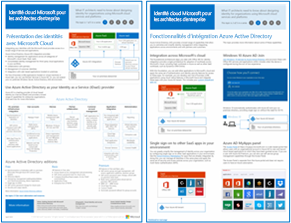
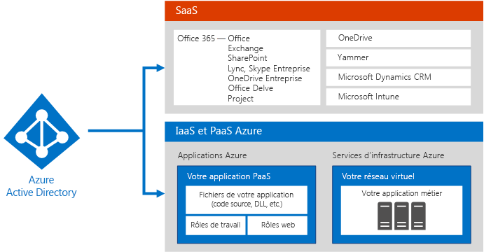
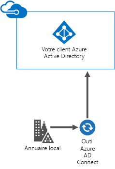
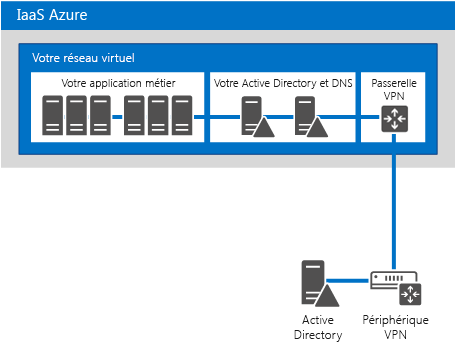
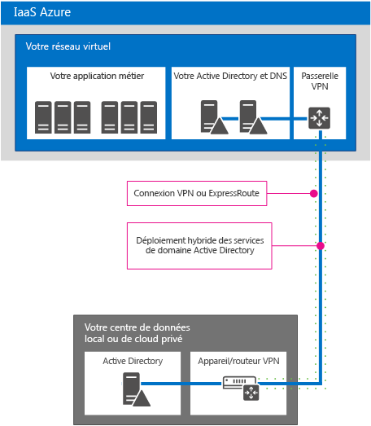
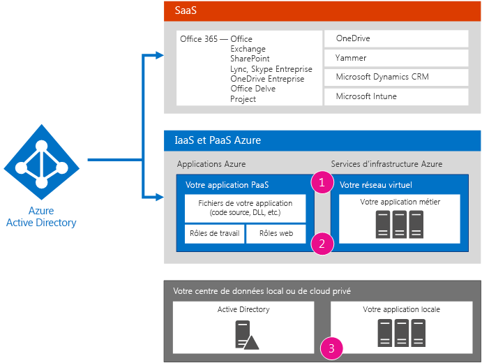
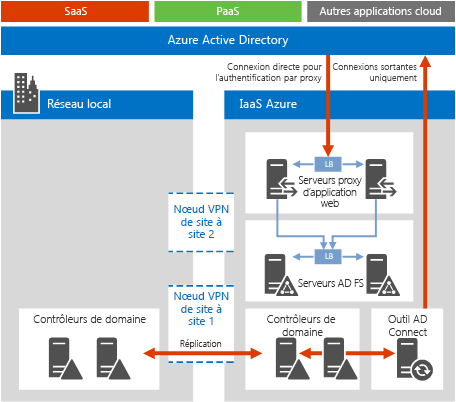
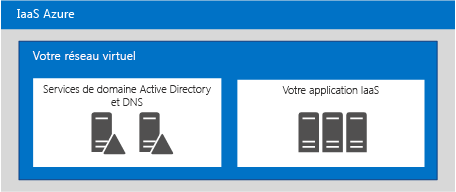

# Identité cloud Microsoft pour les architectes d’entreprise

 **Résumé :** Concevez votre solution d'identité pour plateformes et services cloud Microsoft.
  
Cet article explique ce que les architectes informatiques doivent savoir sur la conception d’identité pour les organisations utilisant des plateformes et des services cloud Microsoft. Vous pouvez également afficher le contenu de cet article sous forme d’affiche à 5 pages et l’imprimer au format tabloïd (également appelé format comptable, 11 x 17 ou A3).
  

  
[PDF](https://go.microsoft.com/fwlink/p/?LinkId=524586) | [Visio]((https://download.microsoft.com/download/2/3/8/238228E6-9017-4F6C-BD3C-5559E6708F82/MSFT_cloud_architecture_identity.vsd)) | [Plus de langues](https://www.microsoft.com/download/details.aspx?id=54431)
  
Vous pouvez également afficher tous les modèles dans les [Ressources relatives à l'architecture informatique du cloud Microsoft](microsoft-cloud-it-architecture-resources.md) et consulter la [feuille de route Enterprise Cloud de Microsoft (ressources pour les décideurs informatiques)]((https://aka.ms/cloudarchitecture)).
  
> [!NOTE]
> Cet article reflète la version de janvier 2016 de l’affiche **Identité cloud Microsoft pour les architectes d’entreprise**. Il ne contient pas les modifications apportées à la version d’avril 2016 ou aux versions ultérieures de l’affiche.
  
## Conception d’identité pour le cloud Microsoft

L’intégration de vos identités avec le cloud Microsoft fournit un accès à un large éventail d’options de plateforme et de services cloud. Il existe deux options principales :
  
- Vous pouvez réaliser une intégration avec Microsoft Azure Active Directory (AD). Cette opération implique de synchroniser vos comptes locaux avec Azure Active Directory, le fournisseur d’identité pour le cloud Microsoft.
    
- Vous pouvez étendre votre environnement de services de domaine Active Directory (AD DS) local vers des machines virtuelles exécutées dans les services d’infrastructure de Microsoft Azure.
    

  
 **Figure 1 : Options pour la création d'identités dans le cloud**
  
La figure 1 montre bien qu’Azure AD est le fournisseur d’identité pour les services Saas (Software as a Service - logiciel en tant que service) de Microsoft et les applications PaaS (Platform as a Service - plateforme en tant que service) et la façon dont les applications métier peuvent utiliser les services AD DS. 
  
### Azure Active Directory

Microsoft Azure Active Directory est le service de gestion de l'accès et de l'identité hébergé sur le cloud de Microsoft. Il s'agit d'un outil central pour les plateformes et les services cloud de Microsoft. L'intégration à Azure Active Directory permet d'accéder à tous les services SaaS de Microsoft à l'aide de votre ensemble actuel de comptes et de mots de passe. Cette intégration fournit également une identité basée sur le cloud pour les applications PaaS Azure. 
  
> [!NOTE]
> Même avec Azure AD, les services de domaine Active Directory en local restent nécessaires pour les entreprises ou les machines virtuelles utilisant Windows et exécutées dans l'IaaS (Infrastructure as a Service - infrastructure en tant que Service) Azure. 
  
Il existe trois éditions d'Azure Active Directory : gratuite, de base et Premium. 
  
||||
|:-----|:-----|:-----|
|**Gratuit**   |**Basique**   |**Premium**   |
| 	Gestion de comptes d’utilisateur    Synchronisation avec des répertoires locaux    Authentification unique pour Azure, Office 365 et des milliers d’autres applications SaaS populaires, telles que Salesforce, Workday, Concur, DocuSign, Google Apps, Box, ServiceNow, Dropbox et bien d’autres   | Comprend toutes les fonctionnalités de l’édition gratuite, plus :    Insertion de la marque de votre entreprise    Accès aux applications par groupes    Réinitialisation du mot de passe en libre-service    Contrat de niveau de service entreprise de 99,9 %   | Inclut toutes les fonctionnalités des éditions gratuite et de base, plus :    Gestion des groupes en libre-service    	Alertes et rapports de sécurité avancés    	Authentification multifacteur    Réinitialisation du mot de passe avec écriture conditionnelle vers l’instance AD DS locale    Synchronisation bidirectionnelle avec l’outil Azure AD Connect    Proxy d’application Azure AD    	Microsoft Forefront Identity Manager (MIM)   |
   
Pour plus d'informations sur les versions, voir [Éditions d'Azure Active Directory](https://go.microsoft.com/fwlink/p/?LinkId=524280).
  
### Option 1 : intégration à Azure Active Directory

La plupart des organisations synchronisent un ensemble standard d’objets et d’attributs avec leur client Azure Active Directory. L’outil Azure AD Connect synchronise vos comptes entre votre instance AD DS locale et un client Azure Active Directory.
  

  
 **Figure 2 : Intégration à Azure AD**
  
La figure 2 montre comment l’outil Azure AD Connect obtient les modifications apportées dans AD DS et les envoie à votre client Azure Active Directory. Dans ce cas, votre client Azure AD est une copie hébergée dans le cloud du contenu d’un répertoire local essentiel.
  
De nombreuses organisations utilisent les services AD DS comme fournisseur d’identité local. Vous pouvez utiliser un autre type de fournisseur d’identité local (par exemple, avec le protocole LDAP) et effectuer une synchronisation vers Azure Active Directory.
  
### Option 2 : extension des services AD DS à Azure

L’extension des services AD DS à des machines virtuelles exécutée dans les services d’infrastructure Azure prend en charge un ensemble de solutions et d’applications différent de la synchronisation avec Azure Active Directory. En voici deux :
  
- Prend en charge des solutions cloud qui requièrent l’authentification Kerberos ou NTLM, ou des machines virtuelles jointes à un domaine AD DS.
    
- Offre un plus grand potentiel d’intégration pour les applications et les services cloud sur les plateformes et services cloud de Microsoft.
    

  
 **Figure 3 : Extension d'AD DS à Azure**
  
La figure 3 présente un contrôleur de domaine AD DS connecté à un réseau virtuel Azure via un périphérique VPN local et une passerelle VPN Azure. Le réseau virtuel Azure contient des serveurs dédiés à une application métier, ainsi que son propre jeu de contrôleurs de domaine AD DS.
  
### Plus d’informations

- [Synchronizing your directory with Office 365 is easy](https://go.microsoft.com/fwlink/p/?LinkId=524281)
    
- [Infographie : Gestion des identités et des accès dans le cloud](https://go.microsoft.com/fwlink/p/?LinkId=524282)
    
- [Azure Active Directory](https://go.microsoft.com/fwlink/p/?LinkId=524283)
    
## Intégrer vos comptes AD DS avec Microsoft Azure Active Directory

En synchronisant vos comptes AD DS locaux avec Azure Active Directory, vos utilisateurs peuvent les utiliser pour accéder à :
  
- L’ensemble des services Saas Microsoft (Office 365, Microsoft Intune et Dynamics CRM Online)
    
- Vos applications exécutées dans la PaaS Azure
    
Il existe deux façons de configurer cette intégration :
  
- Synchronisation d’annuaire et de mot de passe
    
- Fédération et authentification unique
    
Commencez par l’option la plus simple qui répond à vos besoins. Vous pouvez changer, si nécessaire.
  
> [!NOTE]
> L’utilisation de comptes exclusivement dédiés au cloud (qui ne s’intègrent pas avec votre instance AD DS locale) n’est pas recommandée pour les grandes organisations. 
  
### Synchronisation d’annuaire et de mot de passe

Cette option est la plus simple et requiert uniquement un serveur qui exécute l’outil Azure AD Connect. 
  

  
 **Figure 4 : Configuration de la synchronisation d'annuaire et de mot de passe**
  
La figure 4 présente un centre de données de cloud privé ou local avec un contrôleur de domaine AD DS. Un serveur qui exécute l’outil Azure AD Connect synchronise la liste des noms de compte avec Azure Active Directory.
  
Avec cette option :
  
- Les comptes d’utilisateurs sont synchronisés de votre instance AD DS locale (ou d’un autre fournisseur d’identité) vers votre client Azure Active Directory. Le répertoire local reste la source de référence pour les comptes et vous gérez toutes les modifications apportées aux comptes à partir de cet emplacement.
    
- Azure AD exécute toutes les tâches d’authentification pour les services SaaS de Microsoft et les applications PaaS Azure.
    
- Vous pouvez également configurer la synchronisation pour plusieurs forêts AD DS.
    
Avec la synchronisation de mot de passe
  
- Les utilisateurs sont invités à entrer un mot de passe lorsqu’ils accèdent aux services cloud, qui est le même mot de passe que pour les ressources locales.
    
- Les mots de passe utilisateur ne sont jamais envoyés à Azure Active Directory sous forme de texte en clair. Un hachage du mot de passe est utilisé. Il est techniquement impossible de déchiffrer ou de reconstituer le hachage du mot de passe et d’obtenir ce dernier en texte clair. 
    
Avec Multi-Factor Authentication (MFA) :
  
- Vous pouvez utiliser les fonctionnalités MFA de base proposées par Office 365.
    
- Les développeurs d’applications PaaS Azure peuvent tirer parti du service Multi-Factor Authentication Azure.
    
La synchronisation d’annuaire n’offre pas d’intégration avec les solutions MFA locales.
  
### Fédération et authentification unique

Cette option requiert une infrastructure et des serveurs supplémentaires. 
  

  
 **Figure 5 : Serveurs requis pour l'authentification fédérée**
  
la figure 5 présente l’ensemble de composants nécessaires pour l’authentification fédérée. Azure AD contacte un proxy d’application web, qui transmet la demande d’authentification à un serveur Active Directory Federation Services (AD FS), qui transfère la demande à un contrôleur de domaine AD DS à des fins d’évaluation et de réponse. Un serveur qui exécute l’outil Azure AD Connect synchronise la liste des noms de comptes d’AD DS vers Azure AD.
  
La fédération offre les fonctionnalités d’entreprise supplémentaires suivantes :
  
- Toutes les demandes d’authentification envoyées à Azure AD sont transférées à AD FS et soumises au fournisseur d’identité local via AD FS.
    
- Fonctionne avec les fournisseurs d’identité autres que Microsoft.
    
- La synchronisation de hachage de mot de passe peut servir de sauvegarde de connexion pour la connexion fédérée (par exemple, si l’authentification fédérée échoue).
    
Utilisez la fédération dans les cas suivants :
  
- L’authentification unique est requise. Avec l’authentification unique, les utilisateurs ne sont pas invités à entrer des informations d’identification (nom d’utilisateur ou mot de passe) lorsqu’ils accèdent à un service cloud.
    
- AD FS est déjà déployé.
    
- Vous utilisez un fournisseur d’identité tiers.
    
- Vous utilisez Forefront Identity Manager 2010 R2 (ne prend pas en charge la synchronisation de hachage de mot de passe).
    
- Vous disposez d’une carte à puce intégrée locale ou d’une autre solution MFA.
    
- Vous devez réaliser des audits de connexion et/ou désactiver des comptes.
    
- Votre organisation requiert des restrictions des connexions client par heures de travail ou emplacement réseau.
    
- Vous devez vous conformer aux normes FIPS (Federal Information Processing Standards).
    
L’authentification fédérée nécessite un plus grand investissement dans l’infrastructure locale.
  
- Les serveurs locaux doivent être accessibles sur Internet via un pare-feu d’entreprise. Microsoft recommande d’utiliser des serveurs de proxy d’application web déployés dans votre réseau de périmètre.
    
- Nécessite du matériel, des licences et des opérations pour les serveurs AD FS, des serveurs de proxy AD FS ou des serveurs proxy d’application web, des pare-feux et des programmes d’équilibrage de charge. 
    
- La disponibilité et les performances sont importantes pour être sûr que les utilisateurs peuvent accéder à Office 365 et à d’autres applications cloud.
    
### Plus d’informations

- [Synchronizing your directory with Office 365 is easy](https://go.microsoft.com/fwlink/p/?LinkId=524281)
    
- [Préparer la mise en service des utilisateurs via la synchronisation d'annuaires vers Office 365](https://go.microsoft.com/fwlink/p/?LinkId=524284)
    
- [Multi-Factor Authentication pour Office 365](https://go.microsoft.com/fwlink/p/?LinkID=392012)
    
- [Azure Multi-Factor Authentication](https://go.microsoft.com/fwlink/p/?LinkId=524285)
    
- [TechEd 2014 : Directory Integration: Creating One Directory with Active Directory and Azure Active Directory](https://go.microsoft.com/fwlink/p/?LinkId=524286)
    
## Extension des services AD DS à Azure

L’extension d’AD DS à Azure est la première étape pour la prise en charge d’applications métier exécutées sur des machines virtuelles dans les services d’infrastructure Azure, et fournit les avantages suivants :
  
- Prise en charge des solutions cloud qui requièrent l’authentification Kerberos ou NTLM, ou des machines virtuelles jointes à un domaine AD DS.
    
- Possibilités d’intégration supplémentaires pour les services et applications cloud, qui peuvent être ajoutées à tout moment.
    

  
 **Figure 6 : Extension d'AD DS à un réseau virtuel Azure**
  
La figure 6 présente un centre de données de cloud privé ou local, avec AD DS connecté à un réseau virtuel Azure via une connexion ExpressRoute ou VPN de site à site. Le réseau virtuel Azure contient des serveurs dédiés à une application métier, ainsi que son propre jeu de contrôleurs de domaine AD DS. Cette configuration constitue un déploiement hybride d’AD DS en local et dans les services d’infrastructure Azure. Elle requiert :
  
- Un réseau virtuel Azure.
    
- Une connexion entre un routeur ou un périphérique de réseau privé virtuel (VPN) local et une passerelle VPN Azure.
    
- L’utilisation d’une partie de votre espace d’adressage IP local pour les machines virtuelles du réseau virtuel.
    
- Le déploiement d’un ou de plusieurs contrôleurs de domaine dans le réseau virtuel désignés comme serveurs de catalogue global (permet de réduire le trafic sortant sur la connexion VPN).
    
Cette architecture d’identité prend en charge un ensemble de solutions et d’applications différent de la synchronisation avec Azure Active Directory.
  
### Options de connexion de l’environnement local vers Azure

Pour connecter votre réseau local à un réseau virtuel Azure, vous pouvez utiliser les méthodes suivantes :
  
- Une connexion VPN de site à site, qui permet de connecter de 1 à 10 sites (y compris d'autres réseaux virtuels Azure) à un même réseau virtuel Azure.
    
- ExpressRoute, une liaison de réseau étendu privée et sécurisée vers Azure, assurée par un fournisseur de services de réseau et de centre de données partenaire. Les connexions ExpressRoute permettent de bénéficier d’une plus grande fiabilité, d’une meilleure bande passante et de temps de latence inférieurs.
    
### Plus d’informations

- [À propos des connexions sécurisées entre locaux pour les réseaux virtuels](https://go.microsoft.com/fwlink/p/?LinkId=524293)
    
- [Présentation technique d'ExpressRoute](https://go.microsoft.com/fwlink/?LinkID=392081)
    
- [Recommandations en matière de déploiement de Windows Server Active Directory sur des machines virtuelles Windows Azure](https://go.microsoft.com/fwlink/p/?LinkId=524295)
    
## Intégration de vos applications avec des identités cloud

Lorsque vous concevez et développez des applications destinées au cloud, vous devez mettre en place un processus d’authentification cohérent pour les utilisateurs, notamment concernant les informations d’identification requises. Par exemple, lorsque vous utilisez des informations d’identification Windows, que ce soit pour Azure Active Directory ou une instance AD DS étendue, veillez à ce que les utilisateurs puissent s’authentifier rapidement et se concentrer ainsi sur leurs tâches.
  

  
 **Figure 7 : Intégration des applications avec des identités cloud**
  
La figure 7 présente les trois options disponibles pour l’intégration de votre application avec des identités cloud.
  
1. Enregistrez vos applications hébergées dans le cloud auprès d’Azure Active Directory.
    
    Consultez l'article MSDN [Intégration d'applications dans Azure Active Directory](https://go.microsoft.com/fwlink/p/?LinkId=524303). Cette opération vous permet d'utiliser Azure Active Directory pour authentifier l'accès à votre application PaaS, ainsi que d'autoriser des utilisateurs ou des administrateurs à octroyer des droits sur votre application à d'autres utilisateurs afin que ces derniers puissent accéder à du contenu en leur nom à partir d'autres services cloud, comme, Office 365. Vous pouvez obtenir des détails supplémentaires et des exemples de code dans l'article MSDN [Scénarios d'authentification pour Azure AD](https://go.microsoft.com/fwlink/p/?LinkId=524304). 
    
2. Les applications qui requièrent une authentification par programmation pour accéder à une application sécurisée par AD SD, AD FS sur Windows Server 2012 R2 ou Azure Active Directory peuvent utiliser les outils suivants :
    
  - L'[API Azure AD Graph](https://go.microsoft.com/fwlink/p/?LinkId=524305)
    
  - [Active Directory Authentication Library (ADAL)](https://go.microsoft.com/fwlink/p/?LinkID=524297)
    
    L’API Azure AD Graph prend en charge OAuth et OpenID Connect. Elle fonctionne également avec les applications PaaS.
    
3. Configurez des applications métier ou locales exécutées sur des machines virtuelles dans un réseau virtuel Azure pour utiliser l'authentification Windows (NTLM ou Kerberos) directement. Cette option est celle qui offre la meilleure expérience utilisateur et requiert la configuration minimale pour les développeurs d'applications serveur.
    
### Exemple d’intégration d’applications

Une organisation crée une application ASP.NET qui expose un point de terminaison REST où d’autres applications peuvent obtenir les données de ventes les plus récentes. L’accès à ce point de terminaison REST est sécurisé avec Azure Active Directory. Pour que l’application ASP.NET envoie les données requises, les applications doivent fournir des informations d’identification qui peuvent être authentifiées par Azure AD. Les autres développeurs de l’organisation peuvent ensuite écrire des applications qui utilisent les données de ventes issues du point de terminaison REST.
  
Pour vous authentifier auprès d’Azure Active Directory et récupérer des données, ADAL gère le processus d’authentification et transmet le jeton d’accès à l’application afin qu’il puisse être utilisé pour accéder aux données de ventes. ADAL simplifie grandement l’obtention et l’analyse des jetons, des flux OAuth et d’autres éléments. ADAL est une solution technologique qui évolue rapidement. Les développeurs doivent donc aller chercher la version la plus récente sur NuGet.
  
## Déploiement de composants d’annuaire dans Azure

Vous pouvez déployer des composants d'annuaire, tels que des serveurs utilisés pour la synchronisation de mot de passe ou l'authentification fédérée, dans un réseau virtuel Azure plutôt que dans un centre de données local. Cette solution a certains avantages, en particulier si vous envisagez d'étendre les services AD DS à Azure.
  
Voici les composants d’annuaire qui peuvent être mis dans un réseau virtuel Azure :
  
- L’outil Azure AD Connect
    
- Les composants d’authentification fédérée
    
- Un environnement AD DS autonome
    
### L’outil AD Connect

L’outil Azure AD Connect peut être hébergé dans le cloud sur un réseau virtuel Azure. Le déploiement de cette charge de travail dans Azure présente les avantages suivants :
  
- Mise en service potentiellement plus rapide et réduction des coûts des opérations
    
- Disponibilité accrue
    

  
 **Figure 8 : Exécution de l'outil AD Connect dans Azure**
  
La figure 8 présente l’outil AD Connect, exécuté sur une machine virtuelle dans un réseau virtuel Azure, qui effectue une demande auprès d’un contrôleur de domaine AD DS local pour obtenir les modifications apportées aux comptes, puis envoie ces modifications à Office 365. Cette solution fonctionne avec :
  
- Les services Office 365.
    
- Les applications PaaS Azure disponibles sur Internet.
    
- Les applications métier d’Azure disponibles dans des environnements locaux via une connexion ExpressRoute ou VPN de site à site.
    
Pour plus d'informations, voir [Intégration de vos identités locales avec Azure Active Directory](https://go.microsoft.com/fwlink/p/?LinkId=524307).
  
### Infrastructure d’authentification fédérée

Si vous n'avez pas déjà déployé AD FS en local, penchez-vous sur les avantages offerts par le déploiement de cette charge de travail dans Azure :
  
- Offre une autonomie pour l’authentification pour les services cloud (aucune dépendance locale)
    
- Permet de réduire les serveurs et les outils hébergés en local
    
- Utilise une passerelle VPN de site à site sur un cluster de basculement à deux nœuds pour se connecter à Azure (nouveau)
    
- Utilise des listes de contrôle d’accès pour assurer que les serveurs de proxy d’application web puissent uniquement communiquer avec AD FS, et non avec les contrôleurs de domaine ou avec d’autres serveurs directement
    

  
 **Figure 9 : Déploiement de votre infrastructure d'authentification fédérée dans Azure**
  
La figure 9 présente un ensemble de contrôleurs de domaine locaux répliquant des informations AD DS avec un ensemble de contrôleurs de domaine situés dans un réseau virtuel Azure. L'outil Azure AD Connect exécuté sur un serveur du réseau virtuel Azure envoie une demande aux contrôleurs locaux pour obtenir les modifications, puis envoie ces modifications à Azure AD. Les demandes d'authentification auprès d'Azure AD émanant de services Saas de Microsoft, d'applications PaaS Azure et d'autres applications cloud sont transférées à un programme d'équilibrage de charge externe qui les transfère ensuite à un ensemble de serveurs Proxy d'application web. Les serveurs proxy d'application web transmettent la demande à un programme d'équilibrage de charge interne, lequel la transfère ensuite à un ensemble de serveurs AD FS. Les serveurs AD FS transfèrent alors la demande à un contrôleur de domaine pour valider les informations d'identification de d'envoi.
  
 Cette solution fonctionne avec :
  
- Les applications qui nécessitent Kerberos
    
- Tous les services SaaS de Microsoft
    
- Les applications Azure qui sont accessibles sur Internet
    
- Les applications IaaS ou PaaS d’Azure qui nécessitent l’authentification pour l’ensemble des comptes contenus dans l’instance AD DS de votre organisation
    
Pour plus d'informations, voir [Intégration de vos identités locales avec Azure Active Directory](https://go.microsoft.com/fwlink/p/?LinkId=524307).
  
### Environnement AD DS autonome dans un réseau virtuel Azure

Il n'est pas toujours nécessaire d'intégrer une application cloud avec votre environnement local. Par exemple, un domaine AD DS autonome placé dans un réseau virtuel Azure prend en charge les applications accessibles au public, telles que les sites Internet.
  

  
 **Figure 10 : Environnement AD DS autonome pour une application basée sur serveur**
  
La figure 10 présente un réseau virtuel Azure qui héberge un ensemble de serveurs AD DS, fournissant à la fois des services AD DS et DNS, et un ensemble de serveurs qui hébergent une application. Cette solution fonctionne avec :
  
- Les sites web et les applications connectées à Internet
    
- Les applications qui nécessitent l’authentification Kerberos ou NTLM
    
- Les applications exécutées sur des serveurs Windows qui nécessitent AD DS
    
Pour plus d'informations, voir [Intégration de vos identités locales avec Azure Active Directory](https://go.microsoft.com/fwlink/p/?LinkId=524307).
  
## Voir aussi

[Ressources relatives à l'architecture informatique du cloud Microsoft](microsoft-cloud-it-architecture-resources.md)

[Feuille de route Enterprise Cloud de Microsoft : ressources pour les décideurs]((https://sway.com/FJ2xsyWtkJc2taRD))

