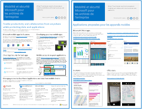
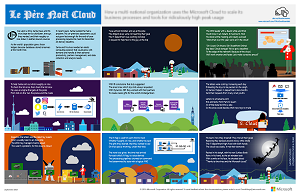
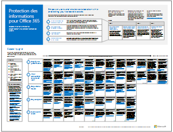
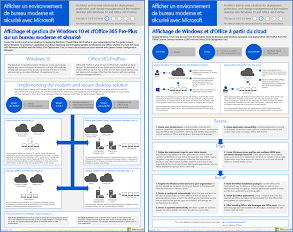

# Ressources relatives à l’architecture informatique du cloud MicrosoftMicrosoft Cloud IT architecture resources

 **Résumé :** Découvrez comment utiliser les plateformes et les services cloud Microsoft. Consultez notre feuille de route Enterprise Cloud, explorez notre série sur les architectures cloud et bien plus encore.**Summary:** Learn about Microsoft cloud services and platforms. Review our enterprise cloud roadmap, explore our cloud architecture series, and more.
  
Ces affiches et ces outils relatifs à l’architecture fournissent des informations sur les plateformes et services cloud Microsoft, y compris Office 365, Microsoft Azure, Microsoft Intune, Microsoft Dynamics 365, le centre de données de cloud privé et les solutions hybrides locales et cloud. Les architectes et décideurs informatiques peuvent utiliser ces ressources en vue d’identifier la solution idéale pour leurs charges de travail et lors de la prise de décisions concernant les composants d’infrastructure principaux, tels que la sécurité et l’identité.These architecture tools and posters give you information about Microsoft cloud services and platforms, including Office 365, Microsoft Azure, Microsoft Intune, Microsoft Dynamics 365, private cloud datacenter, and hybrid on-premises and cloud solutions. IT decision makers and architects can use these resources to determine the ideal solutions for their workloads and to make decisions about core infrastructure components such as identity and security. 
  
- **[Feuille de route de Microsoft Enterprise Cloud](microsoft-cloud-it-architecture-resources.md#roadmap)** (Sway)**[Microsoft's Enterprise Cloud Roadmap](microsoft-cloud-it-architecture-resources.md#roadmap)** (Sway)
    
- **[Série de cloud Microsoft pour les architectes d’entreprise](microsoft-cloud-it-architecture-resources.md#cloudarch)****[Microsoft Cloud for Enterprise Architects Series](microsoft-cloud-it-architecture-resources.md#cloudarch)** 
    - [Options offertes par les plateformes et les services cloud MicrosoftMicrosoft Cloud Services and Platform Options](microsoft-cloud-it-architecture-resources.md#platformoptions)
    - [Identité cloud Microsoft pour les architectes d’entrepriseMicrosoft Cloud Identity for Enterprise Architects](microsoft-cloud-it-architecture-resources.md#identity)
    - [Sécurité cloud Microsoft pour les architectes d’entrepriseMicrosoft Cloud Security for Enterprise Architects](microsoft-cloud-it-architecture-resources.md#security)
    - [Mise en réseau cloud Microsoft pour les architectes d'entrepriseMicrosoft Cloud Networking for Enterprise Architects](microsoft-cloud-it-architecture-resources.md#networking)
    - [Mobilité et sécurité Microsoft pour les architectes d’entrepriseMicrosoft Mobility and Security for Enterprise Architects](microsoft-cloud-it-architecture-resources.md#mobility)
    - [Stockage cloud Microsoft pour les architectes d'entrepriseMicrosoft Cloud Storage for Enterprise Architects](microsoft-cloud-it-architecture-resources.md#storage)
    - [Cloud hybride Microsoft pour les architectes d'entrepriseMicrosoft Hybrid Cloud for Enterprise Architects](microsoft-cloud-it-architecture-resources.md#hybrid)
    - [Contoso dans le cloud de MicrosoftContoso in the Microsoft Cloud](microsoft-cloud-it-architecture-resources.md#contoso)
    - [Attaques courantes et fonctionnalités Microsoft pour protéger votre organisationCommon attacks and Microsoft capabilities that protect your organizaion](#common-attacks-and-microsoft-capabilities-that-protect-your-organization)
    
- **[Série de solutions Office 365 Entreprise](microsoft-cloud-it-architecture-resources.md#BKMK_o365solutions)** :**[Office 365 Enterprise Solution Series](microsoft-cloud-it-architecture-resources.md#BKMK_o365solutions)**:
    - [Protection des informations pour Office 365Information Protection for Office 365](microsoft-cloud-it-architecture-resources.md#BKMK_infoprotect)
    - [Protection des appareils et de l’identité pour Office 365Identity and Device Protection for Office 365](microsoft-cloud-it-architecture-resources.md#BKMK_O365IDP)
    - [Solutions de protection des fichiers dans Office 365File Protection Solutions in Office 365](microsoft-cloud-it-architecture-resources.md#BKMK_O365fileprotect)
    - [Gestion des modifications pour les clients Office 365Change Management for Office 365 Clients](microsoft-cloud-it-architecture-resources.md#changemgmt)
    - [Déploiement d’un environnement de bureau moderne et sécurisé avec MicrosoftDeploy a modern and secure desktop with Microsoft](microsoft-cloud-it-architecture-resources.md#msd)
    
> [!TIP]
> La plupart des affiches sur cette page sont disponibles dans plusieurs langues, notamment en chinois, anglais, français, allemand, italien, japonais, coréen, portugais, russe et espagnol. Pour télécharger une affiche dans l'une de ces langues, cliquez sur le lien **Plus de langues** correspondant à cette affiche.Most of the posters on this page are available in multiple languages, including Chinese, English, French, German, Italian, Japanese, Korean, Portuguese, Russian, and Spanish. To download a poster in one of these languages, click the **More languages** link for that poster.
  
Faites-nous savoir ce que vous en pensez ! Envoyez-nous des courriers électroniques à l’adresse [cloudadopt@microsoft.com](mailto:cloudadopt@microsoft.com).Let us know what you think! Send us email at [cloudadopt@microsoft.com](mailto:cloudadopt@microsoft.com). 
  

## Feuille de route de Microsoft Enterprise CloudMicrosoft's Enterprise Cloud Roadmap

Consultez les affiches, les jeux d’icônes, les activités de la communauté et autres ressources qui décrivent la solution de cloud la plus complète du secteur.See the posters, icon sets, community venues, and other resources that describe the industry's most complete cloud solution.
  
|**Élément****Item**|**Description****Description**|
|:-----|:-----|
|[          ](https://aka.ms/cloudarchitecture)[          ](https://aka.ms/cloudarchitecture)   [Feuille de route de Microsoft Enterprise Cloud](https://aka.ms/cloudarchitecture) (https://aka.ms/cloudarchitecture)[Microsoft's Enterprise Cloud Roadmap](https://aka.ms/cloudarchitecture) (https://aka.ms/cloudarchitecture)   |Vivez l’expérience Sway en consultant ces ressources qui décrivent la solution de cloud la plus complète du secteur.Swipe through this Sway experience for the resources that describe the industry's most complete cloud solution.    |
   

## Série de cloud Microsoft pour les architectes d’entrepriseMicrosoft Cloud for Enterprise Architects Series

Ces affiches relatives à l'architecture cloud fournissent des informations sur les plateformes et services cloud Microsoft, y compris Office 365, Microsoft Azure, Microsoft Intune, Microsoft Dynamics CRM Online, le centre de données de cloud privé et les solutions hybrides locales et cloud. Les architectes et décisionnaires informatiques peuvent utiliser ces ressources en vue d'identifier la solution idéale pour leurs charges de travail et lors de la prise de décisions concernant les principaux composants d'infrastructure tels que la sécurité et l'identité.These cloud architecture posters give you information about Microsoft cloud services and platforms, including Office 365, Microsoft Azure, Microsoft Intune, Microsoft Dynamics CRM Online, private cloud datacenter, and hybrid on-premises and cloud solutions. IT decision makers and architects can use these resources to determine the ideal solutions for their workloads and to make decisions about core infrastructure components such as identity and security.
  

### Options offertes par les plateformes et les services cloud MicrosoftMicrosoft Cloud Services and Platform Options

Découvrez les principales différences entre les offres de plateformes et de services cloud Microsoft. Trouvez la solution qui vous convient le mieux.Learn key differences between Microsoft cloud services and platform offerings. Find the best fit for your solution.
  
|**Élément****Item**|**Description****Description**|
|:-----|:-----|
|[          ](https://www.microsoft.com/download/details.aspx?id=54432)[          ](https://www.microsoft.com/download/details.aspx?id=54432)   [PDF](https://go.microsoft.com/fwlink/p/?LinkId=524731)  \| [Visio](https://go.microsoft.com/fwlink/p/?LinkId=524732)  \| [Plus de langues](https://www.microsoft.com/download/details.aspx?id=54432)[PDF](https://go.microsoft.com/fwlink/p/?LinkId=524731)  \| [Visio](https://go.microsoft.com/fwlink/p/?LinkId=524732)  \| [More languages](https://www.microsoft.com/download/details.aspx?id=54432)   | Ce modèle décrit :This model describes: <ul><li>  Offres SaaS (Software as a Service), y compris Office 365Software as a Service (SaaS) offerings, including Office 365 </li><li>  Fonctionnalités PaaS (Platform as a Service) dans Microsoft AzurePlatform as a Service (PaaS) features in Microsoft Azure </li><li>  Fonctionnalités IaaS (Infrastructure as a Service) dans Microsoft AzureInfrastructure as a Service (IaaS) features in Microsoft Azure </li><li>  Fonctionnalités de centre de données de cloud privé avec Windows Server et System CenterPrivate cloud datacenter capabilities using Windows Server and System Center </li><li>  Découvrez comment le service informatique de Microsoft procède à la migration de ces services cloud et crée son propre cloud hybride.Learn how Microsoft's own IT department is migrating to these cloud services and building its hybrid cloud. </li></ul> |
   

### Identité cloud Microsoft pour les architectes d’entrepriseMicrosoft Cloud Identity for Enterprise Architects

Tout ce que les architectes informatiques doivent savoir sur la conception d’identité pour les organisations utilisant des plateformes et des services cloud Microsoft.What IT architects need to know about designing identity for organizations using Microsoft cloud services and platforms.
  
|**Élément****Item**|**Description****Description**|
|:-----|:-----|
|[          ](https://www.microsoft.com/download/details.aspx?id=54431)[          ](https://www.microsoft.com/download/details.aspx?id=54431)   [PDF](https://go.microsoft.com/fwlink/p/?LinkId=524586)  \| [Visio](https://download.microsoft.com/download/2/3/8/238228E6-9017-4F6C-BD3C-5559E6708F82/MSFT_cloud_architecture_identity.vsd)           \| [Plus de langues](https://www.microsoft.com/download/details.aspx?id=54431)[PDF](https://go.microsoft.com/fwlink/p/?LinkId=524586)  \| [Visio](https://download.microsoft.com/download/2/3/8/238228E6-9017-4F6C-BD3C-5559E6708F82/MSFT_cloud_architecture_identity.vsd)  \| [More languages](https://www.microsoft.com/download/details.aspx?id=54431)   | Ce modèle contient :This model contains: <ul><li>Introduction aux identités avec le cloud de MicrosoftIntroduction to identity with Microsoft’s cloud </li> <li>Fonctions IDaaS d’Azure ADAzure AD IDaaS capabilities </li><li>Intégration de comptes Active Directory Domain Services locaux avec Microsoft Azure Active DirectoryIntegrating on-premises Active Directory Domain Services accounts with Microsoft Azure Active Directory </li> <li>Placement de composants d’annuaire dans AzurePutting directory components in Azure </li><li>Options des services de domaine pour les charges de travail dans Azure IaaSDomain services options for workloads in Azure IaaS </li></ul>  |
   

### Sécurité cloud Microsoft pour les architectes d’entrepriseMicrosoft Cloud Security for Enterprise Architects

Tout ce que les architectes informatiques doivent savoir sur la sécurité dans les plateformes et les services cloud Microsoft.What IT architects need to know about security in Microsoft cloud services and platforms.
  
|**Élément****Item**|**Description****Description**|
|:-----|:-----|
|[          ](https://www.microsoft.com/download/details.aspx?id=48121)[          ](https://www.microsoft.com/download/details.aspx?id=48121)   [PDF](https://go.microsoft.com/fwlink/p/?linkid=842070)  \| [Visio](https://go.microsoft.com/fwlink/p/?LinkId=842071)  \| [Plus de langues](https://www.microsoft.com/download/details.aspx?id=48121)[PDF](https://go.microsoft.com/fwlink/p/?linkid=842070)  \| [Visio](https://go.microsoft.com/fwlink/p/?LinkId=842071)  \| [More languages](https://www.microsoft.com/download/details.aspx?id=48121)   | Ce modèle contient :This model contains: <ul><li>Rôle de Microsoft en tant que fournisseur de services et de plateformes sécurisésMicrosoft's role in providing secure services and platforms</li><li>Responsabilités du client pour limiter les risques de sécuritéCustomer responsibilities to mitigate security risks</li><li>Certifications de sécurité de premier planTop security certifications </li><li>Offres de sécurité fournies par les services de conseil de MicrosoftSecurity offerings provided by Microsoft consulting services </ul></li>Suivez le cours [La sécurité dans un monde orienté cloud](https://mva.microsoft.com/training-courses/security-in-a-cloudenabled-world-12725?l=CfLHobAcB_3904300474), un cours de la Microsoft Virtual Academy basé sur cette affiche relative à l’architecture.Take [Security in a Cloud-Enabled World](https://mva.microsoft.com/training-courses/security-in-a-cloudenabled-world-12725?l=CfLHobAcB_3904300474), a Microsoft Virtual Academy course based on this architecture poster.  |
   

### Mise en réseau cloud Microsoft pour les architectes d’entrepriseMicrosoft Cloud Networking for Enterprise Architects

Tout ce que les architectes informatiques doivent savoir sur la mise en réseau pour les plateformes et les services cloud Microsoft.What IT architects need to know about networking for Microsoft cloud services and platforms.
  
|**Élément****Item**|**Description****Description**|
|:-----|:-----|
|[          ](https://www.microsoft.com/download/details.aspx?id=54425)[          ](https://www.microsoft.com/download/details.aspx?id=54425)   [PDF](https://go.microsoft.com/fwlink/p/?linkid=842073)  \| [Visio](https://go.microsoft.com/fwlink/p/?linkid=842074)           \| [Article](https://technet.microsoft.com/library/mt733214.aspx)[PDF](https://go.microsoft.com/fwlink/p/?linkid=842073)  \| [Visio](https://go.microsoft.com/fwlink/p/?linkid=842074)           \| [Article](https://technet.microsoft.com/library/mt733214.aspx)  [Plus de langues](https://www.microsoft.com/download/details.aspx?id=54425)[More languages](https://www.microsoft.com/download/details.aspx?id=54425)   | Ce modèle contient les pages suivantes :This model contains the following pages: <ul><li> **Évolution de votre réseau pour la connectivité au cloud** La migration vers le cloud modifie le volume et la nature des flux de trafic internes et externes à un réseau d'entreprise. Elle a également une incidence sur les approches permettant de réduire les risques de sécurité.**Evolving your network for cloud connectivity** Cloud migration changes the volume and nature of traffic flows within and outside a corporate network. It also affects approaches to mitigating security risk. </li><li> **Éléments communs de la connectivité au cloud Microsoft** L'intégration de votre réseau au cloud Microsoft offre un accès optimal à une large gamme de services.**Common elements of Microsoft cloud connectivity** Integrating your networking with the Microsoft cloud provides optimal access to a broad range of services. </li><li> **ExpressRoute pour la connectivité cloud Microsoft** ExpressRoute fournit une connexion réseau haut débit privée et dédiée au cloud Microsoft.**ExpressRoute for Microsoft cloud connectivity** ExpressRoute provides a private, dedicated, high-throughput network connection to Microsoft's cloud. </li><li> **Conception de réseaux pour Microsoft SaaS (Office 365, Microsoft Intune et Dynamics CRM Online)** L'optimisation de votre réseau pour les services Microsoft SaaS nécessite une analyse approfondie d'Internet Edge, de vos périphériques client et des opérations informatiques courantes.**Designing networking for Microsoft SaaS (Office 365, Microsoft Intune, and Dynamics CRM Online)** Optimizing your network for Microsoft SaaS services requires careful analysis of your Internet edge, your client devices, and typical IT operations. </li><li> **Conception de réseaux pour Azure PaaS** L'optimisation du réseau pour les applications Azure PaaS requiert une bande passante Internet appropriée et peut nécessiter la distribution du trafic réseau sur plusieurs sites ou applications.**Designing networking for Azure PaaS** Optimizing networking for Azure PaaS apps requires adequate Internet bandwidth and can require the distribution of network traffic across multiple sites or apps. </li><li> **Conception de réseaux pour Azure IaaS** Suivez le processus de conception pour créer un réseau virtuel Azure optimal pour l'hébergement des charges de travail informatiques basées sur serveur IT, y compris les sous-réseaux, les espaces d'adressage, le routage, le DNS, l'équilibrage de charge et la connectivité avec votre réseau local, d'autres réseaux virtuels et Internet.**Designing networking for Azure IaaS** Step through the design process to create an optimal Azure virtual network (VNet) for hosting server-based IT workloads, including subnets, address spaces, routing, DNS, load balancing, and connectivity to your on-premises network, other VNets, and the Internet. </li></ul>   Suivez le cours [Optimiser votre réseau pour les offres Microsoft Cloud](https://aka.ms/optimizecloudnetworkingmva), un nouveau cours de la Microsoft Virtual Academy basé sur cette affiche relative à l’architecture.Take [Optimize Your Network for Microsoft Cloud Offerings](https://aka.ms/optimizecloudnetworkingmva), a new Microsoft Virtual Academy course based on this architecture poster.   |
   

### Mobilité et sécurité Microsoft pour les architectes d’entrepriseMicrosoft Mobility and Security for Enterprise Architects

Tout ce que les architectes informatiques doivent savoir sur la mobilité avec les plateformes et les services cloud Microsoft.What IT architects need to know about mobility with Microsoft cloud services and platforms.
  
|**Élément****Item**|**Description****Description**|
|:-----|:-----|
|[          ](https://www.microsoft.com/download/details.aspx?id=55023)[          ](https://www.microsoft.com/download/details.aspx?id=55023)   [PDF](https://go.microsoft.com/fwlink/p/?linkid=842076)  \| [Visio](https://go.microsoft.com/fwlink/p/?linkid=842077)  \| [Plus de langues](https://www.microsoft.com/download/details.aspx?id=55023)[PDF](https://go.microsoft.com/fwlink/p/?linkid=842076)  \| [Visio](https://go.microsoft.com/fwlink/p/?linkid=842077)  \| [More languages](https://www.microsoft.com/download/details.aspx?id=55023)   | Ce modèle contient :This model contains: <ul><li>Applications mobiles de premier plan pour les entreprisesTop mobile apps for business </li><li>Plateforme, services et ressources pour le développement d’applications mobilesPlatform, services, and resources for developing mobile apps </li><li>Gestion de l’accès aux applications et aux données cloud à partir d’appareils mobilesManaging access to cloud-based applications and data from mobile devices </li><li>Comparaison des fonctionnalités et de la plateforme prises en charge pour Office 365 MDM et Azure Active Directory Premium et IntuneComparison of capabilities and platform support for Office 365 MDM, Azure Active Directory Premium, and Intune </li></ul>  |
   

### Stockage cloud Microsoft pour les architectes d’entrepriseMicrosoft Cloud Storage for Enterprise Architects

Tout ce que les architectes informatiques doivent savoir sur les options de stockage dans les plateformes et les services cloud Microsoft.What IT architects need to know about storage options in Microsoft cloud services and platforms.
  
|**Élément****Item**|**Description****Description**|
|:-----|:-----|
|[          ](https://www.microsoft.com/download/details.aspx?id=49552)[          ](https://www.microsoft.com/download/details.aspx?id=49552)   [PDF](https://go.microsoft.com/fwlink/p/?linkid=842079)  \| [Visio](https://go.microsoft.com/fwlink/p/?linkid=842080)           \| [Article](hhttps://technet.microsoft.com/library/mt842597.aspx)[PDF](https://go.microsoft.com/fwlink/p/?linkid=842079)  \| [Visio](https://go.microsoft.com/fwlink/p/?linkid=842080)           \| [Article](hhttps://technet.microsoft.com/library/mt842597.aspx)  [Plus de langues](https://www.microsoft.com/download/details.aspx?id=49552)[More languages](https://www.microsoft.com/download/details.aspx?id=49552)   | Ce modèle contient :This model contains: <ul><li>Raisons de l’utilisation du stockage cloud et principaux scénariosReasons for using cloud storage and the key scenarios </li><li>Options de stockage cloud incluant des services existantsCloud storage options that are bundled with existing services </li><li>Options de stockage que vous pouvez utiliser comme point de départ pour votre solution de stockageStorage options that you can use as a starting point for your storage solution </li><li>Stockage des blocs de construction pour créer votre propre solution de stockage ou de stockage pour vos applicationsStorage building blocks to create your own storage solution or storage for your apps</li></ul> |
   

### Cloud hybride Microsoft pour les architectes d’entrepriseMicrosoft Hybrid Cloud for Enterprise Architects

Tout ce que les architectes informatiques doivent savoir sur le cloud hybride pour les plateformes et les services cloud Microsoft.What IT architects need to know about hybrid cloud for Microsoft services and platforms.
  
|**Élément****Item**|**Description****Description**|
|:-----|:-----|
|[          ](https://www.microsoft.com/download/details.aspx?id=54424)[          ](https://www.microsoft.com/download/details.aspx?id=54424)   [PDF](https://go.microsoft.com/fwlink/p/?linkid=842082)  \| [Visio](https://go.microsoft.com/fwlink/p/?linkid=842083)           \| [Article](https://technet.microsoft.com/library/mt750500.aspx)[PDF](https://go.microsoft.com/fwlink/p/?linkid=842082)  \| [Visio](https://go.microsoft.com/fwlink/p/?linkid=842083)           \| [Article](https://technet.microsoft.com/library/mt750500.aspx)  [Plus de langues](https://www.microsoft.com/download/details.aspx?id=54424)[More languages](https://www.microsoft.com/download/details.aspx?id=54424)   | Ce modèle contient les pages suivantes :This model contains the following pages: <ul><li> **Vue d'ensemble du cloud hybride** Offres du cloud Microsoft (SaaS, Azure PaaS et Azure IaaS) et leurs éléments communs.**Hybrid cloud overview** Microsoft's cloud offerings (SaaS, Azure PaaS, and Azure IaaS) and their common elements. </li><li> **Architecture des scénarios du cloud hybride de Microsoft** Diagramme d'architecture du cloud hybride pour les offres du cloud Microsoft, affichant les couches communes de l'infrastructure locale, le réseau et l'identité.**Architecture of Microsoft hybrid cloud scenarios** An architectural diagram of hybrid cloud for Microsoft's cloud offerings, showing the common layers of on-premises infrastructure, networking, and identity. </li><li> **Scénarios de cloud hybride pour Microsoft SaaS (Office 365)** Architecture de scénario SaaS hybride et descriptions des configurations hybrides clés pour Skype Entreprise, SharePoint Server et Exchange Server.**Hybrid cloud scenarios for Microsoft SaaS (Office 365)** The SaaS hybrid scenario architecture and descriptions of key hybrid configurations for Skype for Business, SharePoint Server, and Exchange Server. </li><li> **Scénarios de cloud hybride pour Azure PaaS** Architecture de scénario hybride pour Azure PaaS, description de l'application hybride Azure PaaS accompagnée d'un exemple et description de SQL Server 2016 Stretch Database.**Hybrid cloud scenarios for Azure PaaS** The Azure PaaS hybrid scenario architecture, the description of an Azure PaaS hybrid application with an example, and the description of SQL Server 2016 Stretch Database. </li><li> **Scénarios de cloud hybride pour Azure IaaS** Architecture de scénario hybride pour Azure IaaS et description d'une application métier hébergée dans Azure IaaS.**Hybrid cloud scenarios for Azure IaaS** The Azure IaaS hybrid scenario architecture and the description of a line of business (LOB) application hosted in Azure IaaS. </li></ul> |
   

### Contoso dans le cloud de MicrosoftContoso in the Microsoft Cloud

Comment une multinationale fictive mais représentative a mis en œuvre des offres de cloud Microsoft, notamment Office 365, Azure, Dynamics 365 et Intune.How a fictional but representative global organization has implemented Microsoft's cloud offerings, including Office 365, Azure, Dynamics 365, and Intune.
  
|**Élément****Item**|**Description****Description**|
|:-----|:-----|
|[          ](https://www.microsoft.com/download/details.aspx?id=54427)[          ](https://www.microsoft.com/download/details.aspx?id=54427)   [PDF](https://go.microsoft.com/fwlink/p/?linkid=842085)  \| [Visio](https://go.microsoft.com/fwlink/p/?linkid=842086)           \| [Article](https://technet.microsoft.com/library/mt775341.aspx)[PDF](https://go.microsoft.com/fwlink/p/?linkid=842085)  \| [Visio](https://go.microsoft.com/fwlink/p/?linkid=842086)           \| [Article](https://technet.microsoft.com/library/mt775341.aspx)  [Plus de langues](https://www.microsoft.com/download/details.aspx?id=54427)[More languages](https://www.microsoft.com/download/details.aspx?id=54427)   |Ce modèle contient :This model contains: <ul><li>Présentation de la société Contoso CorporationOverview of the Contoso Corporation </li><li>Infrastructure et besoins informatiques de ContosoContoso's IT infrastructure and needs </li><li>Mise en réseau cloud pour ContosoCloud networking for Contoso</li><li>Identité cloud pour ContosoCloud identity for Contoso</li><li>Abonnements, licences et comptes d’utilisateur ContosoContoso's subscriptions, licenses, and user accounts</li><li>Sécurité cloud pour ContosoCloud security for Contoso</li><li>Scénarios cloud d’entreprise pour ContosoEnterprise cloud scenarios for Contoso</li></ul>  |
   

### Attaques courantes et fonctionnalités Microsoft pour protéger votre organisationCommon attacks and Microsoft capabilities that protect your organization
Découvrez les cyberattaques les plus courantes et comment Microsoft peut aider votre organisation à chaque étape d’une attaque.Learn about the most common cyber attacks and how Microsoft can help your organization at every stage of an attack. 

|**Élément****Item**|**Description****Description**|
|:-----|:-----|
|   [PDF](http://download.microsoft.com/download/F/A/C/FACFC1E9-FA35-4DF1-943C-8D4237B4275B/MSFT_Cloud_architecture_security_commonattacks.pdf) \| [Visio](http://download.microsoft.com/download/F/A/C/FACFC1E9-FA35-4DF1-943C-8D4237B4275B/MSFT_Cloud_architecture_security_commonattacks.vsdx)[PDF](http://download.microsoft.com/download/F/A/C/FACFC1E9-FA35-4DF1-943C-8D4237B4275B/MSFT_Cloud_architecture_security_commonattacks.pdf) \| [Visio](http://download.microsoft.com/download/F/A/C/FACFC1E9-FA35-4DF1-943C-8D4237B4275B/MSFT_Cloud_architecture_security_commonattacks.vsdx)   | Cette affiche illustre le chemin des attaques courantes et décrit les fonctionnalités qui aident à arrêter les pirates à chaque étape d’une attaque.This poster illustrates the path of common attacks and describes which capabilities help stop attackers at each stage of an attack.  |

### Le Père Noël CloudThe Santa Cloud

Comment le Père Noël et ses elfes utilisent les offres cloud de Microsoft pour leurs livraisons annuelles.How Santa and his elves use Microsoft's cloud offerings to make their annual deliveries.
  
|**Élément****Item**|**Description****Description**|
|:-----|:-----|
|[          ](https://www.microsoft.com/download/details.aspx?id=55039)[          ](https://www.microsoft.com/download/details.aspx?id=55039)   [PDF](https://go.microsoft.com/fwlink/p/?linkid=842088)[PDF](https://go.microsoft.com/fwlink/p/?linkid=842088)   |Pour savoir qui a été sage ou méchant et quels cadeaux distribuer le 24 décembre, le Père Noël et son service informatique elfique utilisent Office 365, Azure, Dynamics 365 et Intune.To determine who is naughty and nice and the presents to deliver on December 24, Santa Claus and his elfin IT department use Office 365, Azure, Dynamics 365, and Intune.   |
   

## Série de solutions Office 365 EntrepriseOffice 365 Enterprise Solution Series

La série de solutions Office 365 Entreprise fournit des conseils pour la mise en œuvre des fonctionnalités d’Office 365, en particulier lorsque les fonctionnalités croisent la technologie.The Office 365 enterprise solution series provides guidance for implementing Office 365 capabilities, especially where capabilities cross technologies.
  

### Protection des informations pour Office 365Information Protection for Office 365

Fonctionnalités destinées aux entreprises pour la protection des ressources de l’entreprise.Capabilities for enterprise organizations to protect corporate assets.
  
|**Élément****Item**|**Description****Description**|
|:-----|:-----|
|[          ](https://www.microsoft.com/download/details.aspx?id=54429)[          ](https://www.microsoft.com/download/details.aspx?id=54429)   [PDF](http://download.microsoft.com/download/2/3/D/23D91386-8349-4F7A-9470-FD5AED861F16/MSFT_cloud_architecture_informationprotection.pdf)  \| [Visio](http://download.microsoft.com/download/2/3/D/23D91386-8349-4F7A-9470-FD5AED861F16/MSFT_cloud_architecture_informationprotection.vsd)  \| [Plus de langues](https://www.microsoft.com/download/details.aspx?id=54429)[PDF](http://download.microsoft.com/download/2/3/D/23D91386-8349-4F7A-9470-FD5AED861F16/MSFT_cloud_architecture_informationprotection.pdf)  \| [Visio](http://download.microsoft.com/download/2/3/D/23D91386-8349-4F7A-9470-FD5AED861F16/MSFT_cloud_architecture_informationprotection.vsd)  \| [More languages](https://www.microsoft.com/download/details.aspx?id=54429)   |Microsoft fournit un ensemble extrêmement complet de fonctionnalités permettant de protéger vos ressources d’entreprise. Ce modèle aide les organisations à adopter une approche méthodique lors de la planification des capacités à mettre en œuvre.Microsoft provides the most complete set of capabilities to protect your corporate assets. This model helps organizations take a methodical approach when planning which capabilities to implement.   |
   

### Protection des appareils et de l’identité pour Office 365Identity and Device Protection for Office 365

Fonctionnalités recommandées pour la protection des identités et des appareils qui accèdent à Office 365, autres services SaaS et applications locales publiées avec le proxy de d’application Azure AD.Recommended capabilities for protecting identities and devices that access Office 365, other SaaS services, and on-premises applications published with Azure AD Application Proxy.
  
|**Élément****Item**|**Description****Description**|
|:-----|:-----|
|[          ](https://www.microsoft.com/download/details.aspx?id=55032)[          ](https://www.microsoft.com/download/details.aspx?id=55032)   [PDF](https://go.microsoft.com/fwlink/p/?linkid=841656)  \| [Visio](https://go.microsoft.com/fwlink/p/?linkid=841657)  \| [Plus de langues](https://www.microsoft.com/download/details.aspx?id=55032)[PDF](https://go.microsoft.com/fwlink/p/?linkid=841656)  \| [Visio](https://go.microsoft.com/fwlink/p/?linkid=841657)  \| [More languages](https://www.microsoft.com/download/details.aspx?id=55032)   |Il est important d’utiliser des niveaux de protection cohérents pour l’ensemble de vos données, de vos identités et de vos appareils. Ce document présente les fonctionnalités comparables en vous fournissant davantage d’informations sur les fonctionnalités de protection des identités et des appareils.It's important to use consistent levels of protection across your data, identities, and devices. This document shows you which capabilities are comparable with more information on capabilities to protect identities and devices.    |
   

### Solutions de protection des fichiers dans Office 365File Protection Solutions in Office 365

Fonctionnalités recommandées pour la protection des fichiers dans Office 365 en fonction de trois niveaux de confidentialité différents.Recommended capabilities for protecting files in Office 365 based on three different sensitivity levels.
  
|**Élément****Item**|**Description****Description**|
|:-----|:-----|
|[          ](https://www.microsoft.com/download/details.aspx?id=55523)[          ](https://www.microsoft.com/download/details.aspx?id=55523)   [PDF](http://download.microsoft.com/download/7/8/9/789645A5-BD10-4541-BC33-F8D1EFF5E911/MSFT_cloud_architecture_O365 file protection.pdf)  \| [Visio](http://download.microsoft.com/download/7/8/9/789645A5-BD10-4541-BC33-F8D1EFF5E911/MSFT_cloud_architecture_O365%20file%20protection.vsdx)[PDF](http://download.microsoft.com/download/7/8/9/789645A5-BD10-4541-BC33-F8D1EFF5E911/MSFT_cloud_architecture_O365 file protection.pdf)  \| [Visio](http://download.microsoft.com/download/7/8/9/789645A5-BD10-4541-BC33-F8D1EFF5E911/MSFT_cloud_architecture_O365%20file%20protection.vsdx)   |Il est important d’utiliser des niveaux de protection cohérents pour l’ensemble de vos données, de vos identités et de vos appareils. Ce document présente les fonctionnalités comparables en vous fournissant davantage d’informations sur les fonctionnalités de protection des fichiers dans Office 365.It's important to use consistent levels of protection across your data, identities, and devices. This document shows you which capabilities are comparable with more information on capabilities to protect files in Office 365.    |
   

### Gestion des modifications pour les clients Office 365Change Management for Office 365 Clients

Tout ce que les architectes informatiques doivent savoir sur la gestion des publications pour les applications clientes Office 365 et Windows 10.What IT architects need to know about managing releases for the Office 365 client applications and Windows 10. 
  
|**Élément****Item**|**Description****Description**|
|:-----|:-----|
|[          ](https://www.microsoft.com/download/details.aspx?id=49141)[          ](https://www.microsoft.com/download/details.aspx?id=49141)   [PDF](https://go.microsoft.com/fwlink/p/?LinkId=626681) \| [Visio](https://go.microsoft.com/fwlink/p/?LinkId=626680) \| [Article             ](https://technet.microsoft.com/library/mt584223.aspx)[PDF](https://go.microsoft.com/fwlink/p/?LinkId=626681)  \| [Visio](https://go.microsoft.com/fwlink/p/?LinkId=626680)           \| [Article](https://technet.microsoft.com/library/mt584223.aspx)  [Plus de langues](https://www.microsoft.com/download/details.aspx?id=49141)[More languages](https://www.microsoft.com/download/details.aspx?id=49141)   | Ce modèle contient :This model contains: <ul><li>Modèle de service pour Windows 10 et les applications clientes Office 365The servicing model for Windows 10 and the Office 365 client applications </li><li>  Options de publicationRelease Options </li><li>  Cadences de publicationRelease Cadences </li><li>  Types de modificationsTypes of Changes </li><li>  Rôles et responsabilitésRoles and Responsibilities </li><li>  Gestion des déploiements de mise à jourManage Update Deployments </li></ul>   Afficher les informations sous forme d’article : [Gestion des modifications pour les clients Office 365](http://technet.microsoft.com/library/815fa1aa-0355-40b5-b7bc-cdf7d4610062.aspx).View the information in article form: [Change management for Office 365 clients](http://technet.microsoft.com/library/815fa1aa-0355-40b5-b7bc-cdf7d4610062.aspx).    |
   

### Déploiement d’un environnement de bureau moderne et sécurisé avec MicrosoftDeploy a modern and secure desktop with Microsoft

Que doivent savoir les architectes informatiques sur le déploiement et la gestion des mises à jour pour Office 365 ProPlus sur Windows 10.What IT architects need to know about deploying and managing updates for Office 365 ProPlus on Windows 10.
  
|**Élément****Item**|**Description****Description**|
|:-----|:-----|
|[          ](https://www.microsoft.com/download/details.aspx?id=55987)[          ](https://www.microsoft.com/download/details.aspx?id=55987)   [PDF](http://download.microsoft.com/download/4/E/9/4E90E227-770A-41D1-99FE-925A64D81A55/MSFT_modern_secure_desktop.pdf)  \| [Visio](http://download.microsoft.com/download/4/E/9/4E90E227-770A-41D1-99FE-925A64D81A55/MSFT_modern_secure_desktop.vsdx)[PDF](http://download.microsoft.com/download/4/E/9/4E90E227-770A-41D1-99FE-925A64D81A55/MSFT_modern_secure_desktop.pdf)  \| [Visio](http://download.microsoft.com/download/4/E/9/4E90E227-770A-41D1-99FE-925A64D81A55/MSFT_modern_secure_desktop.vsdx)   | Ce modèle contient :This model contains: <ul><li>  Le déploiement de Windows 10 et Office ProPlus à partir du cloud MicrosoftDeploying Windows 10 and Office ProPlus from the Microsoft cloud </li><li>  Le déploiement de Windows 10 et Office ProPlus avec System Center Configuration ManagerDeploying Windows 10 and Office ProPlus with System Center Configuration Manager </li><li>  La gestion des mises à jour pour Windows 10 et Office ProPlus à partir du cloud MicrosoftManaging updates for Windows 10 and Office ProPlus from the Microsoft cloud </li><li>  La gestion des mises à jour pour Windows 10 et Office ProPlus avec System Center Configuration ManagerManaging updates for Windows 10 and Office ProPlus with System Center Configuration Manager </li><li>  Les fonctionnalités de protection supplémentaires et prêtes à l’emploi de Windows 10Out-of-the-box and additional protection capabilities of Windows 10 </li></ul>  |
   
## Voir aussiSee Also

[Modèles architecturaux pour SharePoint, Exchange, Skype Entreprise et LyncArchitectural models for SharePoint, Exchange, Skype for Business, and Lync](architectural-models-for-sharepoint-exchange-skype-for-business-and-lync.md)
  
[Guides de laboratoire de test d’adoption cloudCloud adoption Test Lab Guides (TLGs)](cloud-adoption-test-lab-guides-tlgs.md)
  
[Solutions de sécuritéSecurity solutions](security-solutions.md)
  
[Solutions hybridesHybrid solutions](hybrid-solutions.md)

