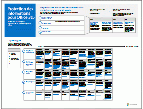

# Ressources relatives à l'architecture informatique du cloud Microsoft

 **Résumé :** Découvrez comment utiliser les plateformes et les services cloud Microsoft. Consultez notre feuille de route Enterprise Cloud, explorez notre série sur les architectures cloud et bien plus encore.
  
Ces affiches et ces outils relatifs à l'architecture fournissent des informations sur les plateformes et services cloud Microsoft, y compris Office 365,Microsoft Azure, Microsoft Intune, Microsoft Dynamics 365, le centre de données de cloud privé et les solutions hybrides locales et cloud. Les architectes et décisionnaires informatiques peuvent utiliser ces ressources en vue d'identifier la solution idéale pour leurs charges de travail et lors de la prise de décisions concernant les principaux composants d'infrastructure tels que la sécurité et l'identité. 
  
- **[Feuille de route de Microsoft Enterprise Cloud](microsoft-cloud-it-architecture-resources.md#roadmap)** (Sway)
    
- **[Série de cloud Microsoft pour les architectes d'entreprise](microsoft-cloud-it-architecture-resources.md#cloudarch)**: inclut les affiches[Options offertes par les plateformes et les services cloud Microsoft](microsoft-cloud-it-architecture-resources.md#platformoptions), [Identité cloud Microsoft pour les architectes d'entreprise](microsoft-cloud-it-architecture-resources.md#identity), [Sécurité cloud Microsoft pour les architectes d'entreprise](microsoft-cloud-it-architecture-resources.md#security), [Mise en réseau cloud Microsoft pour les architectes d'entreprise](microsoft-cloud-it-architecture-resources.md#networking), [Mobilité et sécurité Microsoft pour les architectes d'entreprise](microsoft-cloud-it-architecture-resources.md#mobility), [Stockage cloud Microsoft pour les architectes d'entreprise](microsoft-cloud-it-architecture-resources.md#storage), [Cloud hybride Microsoft pour les architectes d'entreprise](microsoft-cloud-it-architecture-resources.md#hybrid) et[Contoso dans le cloud de Microsoft](microsoft-cloud-it-architecture-resources.md#contoso).
    
- **[Série de solutions Office 365 Entreprise](microsoft-cloud-it-architecture-resources.md#BKMK_o365solutions)**: inclut[Protection des informations pour Office 365](microsoft-cloud-it-architecture-resources.md#BKMK_infoprotect), [Protection des appareils et de l'identité pour Office 365](microsoft-cloud-it-architecture-resources.md#BKMK_O365IDP), [Solutions de protection des fichiers dans Office 365](microsoft-cloud-it-architecture-resources.md#BKMK_O365fileprotect), [Gestion des modifications pour les clients Office 365](microsoft-cloud-it-architecture-resources.md#changemgmt) et[Déploiement d'un environnement de bureau moderne et sécurisé avec Microsoft](microsoft-cloud-it-architecture-resources.md#msd).
    
> [!TIP]
> La plupart des affiches sur cette page sont disponibles dans plusieurs langues, notamment en chinois, anglais, français, allemand, italien, japonais, coréen, portugais, russe et espagnol. Pour télécharger une affiche dans l'une de ces langues, cliquez sur le lien **Plus de langues** correspondant à cette affiche.
  
Dites-nous ce que vous en pensez ! Envoyez-nous un courrier électronique à l'adresse [cloudadopt@microsoft.com](mailto:cloudadopt@microsoft.com). 
  
## Feuille de route de Microsoft Enterprise Cloud

Consultez les affiches, les jeux d'icônes, les activités de la communauté et autres ressources qui décrivent la solution de cloud la plus complète du secteur.
  
|**Élément**|**Description**|
|:-----|:-----|
|[          ](https://aka.ms/cloudarchitecture)   [Feuille de route de Microsoft Enterprise Cloud](https://aka.ms/cloudarchitecture) (https://aka.ms/cloudarchitecture)   |Vivez l'expérience Sway en consultant ces ressources qui décrivent la solution de cloud la plus complète du secteur.    |
   
## Série de cloud Microsoft pour les architectes d'entreprise

Ces affiches relatives à l'architecture cloud fournissent des informations sur les plateformes et services cloud Microsoft, y compris Office 365, Microsoft Azure, Microsoft Intune, Microsoft Dynamics CRM Online, le centre de données de cloud privé et les solutions hybrides locales et cloud. Les architectes et décisionnaires informatiques peuvent utiliser ces ressources en vue d'identifier la solution idéale pour leurs charges de travail et lors de la prise de décisions concernant les principaux composants d'infrastructure tels que la sécurité et l'identité.
  
### Options offertes par les plateformes et les services cloud Microsoft

Découvrez les principales différences entre les offres de plateformes et de services cloud Microsoft. Trouvez la solution qui vous convient le mieux.
  
|**Élément**|**Description**|
|:-----|:-----|
|[          ](https://www.microsoft.com/download/details.aspx?id=54432)   [PDF](https://go.microsoft.com/fwlink/p/?LinkId=524731) |[Visio](https://go.microsoft.com/fwlink/p/?LinkId=524732) |[Plus de langues](https://www.microsoft.com/download/details.aspx?id=54432)   | Ce modèle décrit :    Offres SaaS (Software as a Service), y compris Office 365    Fonctionnalités PaaS (Platform as a Service) dans Microsoft Azure    Fonctionnalités IaaS (Infrastructure as a Service) dans Microsoft Azure    Fonctionnalités de centre de données de cloud privé avec Windows Server et System Center    Découvrez comment le service informatique de Microsoft procède à la migration de ces services cloud et crée son propre cloud hybride.   |
   
### Identité cloud Microsoft pour les architectes d'entreprise

Tout ce que les architectes informatiques doivent savoir sur la conception d'identité pour les organisations utilisant des plateformes et des services cloud Microsoft.
  
|**Élément**|**Description**|
|:-----|:-----|
|[          ](https://www.microsoft.com/download/details.aspx?id=54431)   [PDF](https://go.microsoft.com/fwlink/p/?LinkId=524586) |[Visio](https://download.microsoft.com/download/2/3/8/238228E6-9017-4F6C-BD3C-5559E6708F82/MSFT_cloud_architecture_identity.vsd)          [Article](https://technet.microsoft.com/library/mt613459.aspx) |[Plus de langues](https://www.microsoft.com/download/details.aspx?id=54431)   | Ce modèle contient :    Utilisation d'Azure AD pour vous identifier comme fournisseur de services (IDaaS)    Fonctionnalités IDaaS d'Azure AD    Intégration des comptes de service de domaine Active Directory locaux à Microsoft Azure Active Directory    Insertion de composants d'annuaire dans Azure    Options des services de domaine pour les charges de travail dans Azure IaaS    Consultez ces informations sous forme d'article :[Identité cloud Microsoft pour les architectes d'entreprise](microsoft-cloud-identity-for-enterprise-architects.md).    |
   
### Sécurité cloud Microsoft pour les architectes d'entreprise

Tout ce que les architectes informatiques doivent savoir sur la sécurité dans les plateformes et les services cloud Microsoft.
  
|**Élément**|**Description**|
|:-----|:-----|
|[          ](https://www.microsoft.com/download/details.aspx?id=48121)   [PDF](https://go.microsoft.com/fwlink/p/?linkid=842070) |[Visio](https://go.microsoft.com/fwlink/p/?LinkId=842071) |[Plus de langues](https://www.microsoft.com/download/details.aspx?id=48121)   | Ce modèle contient :    Rôle de Microsoft dans la livraison de plateformes et de services sécurisés    Responsabilités du client pour atténuer les risques de sécurité    Certifications de sécurité de niveau supérieur    Offres de sécurité fournies par Microsoft Consulting Services    Suivez le cours[La sécurité dans un monde orienté cloud](https://aka.ms/securecustomermva), un cours de la Microsoft Virtual Academy basé sur cette affiche relative à l'architecture.    |
   
### Mise en réseau cloud Microsoft pour les architectes d'entreprise

Tout ce que les architectes informatiques doivent savoir sur la mise en réseau pour les plateformes et les services cloud Microsoft.
  
|**Élément**|**Description**|
|:-----|:-----|
|[          ](https://www.microsoft.com/download/details.aspx?id=54425)   [PDF](https://go.microsoft.com/fwlink/p/?linkid=842073) |[Visio](https://go.microsoft.com/fwlink/p/?linkid=842074)          [Article](https://technet.microsoft.com/library/mt733214.aspx) |[Plus de langues](https://www.microsoft.com/download/details.aspx?id=54425)   | Ce modèle contient les pages suivantes :   **Évolution de votre réseau pour la connectivité au cloud** La migration vers le cloud modifie le volume et la nature des flux de trafic internes et externes à un réseau d'entreprise. Elle a également une incidence sur les approches permettant de réduire les risques de sécurité.   **Éléments communs de la connectivité au cloud Microsoft** L'intégration de votre réseau au cloud Microsoft offre un accès optimal à une large gamme de services.   **ExpressRoute pour la connectivité cloud Microsoft** ExpressRoute fournit une connexion réseau haut débit privée et dédiée au cloud Microsoft.   **Conception de réseaux pour Microsoft SaaS (Office 365, Microsoft Intune et Dynamics CRM Online)** L'optimisation de votre réseau pour les services Microsoft SaaS nécessite une analyse approfondie d'Internet Edge, de vos périphériques client et des opérations informatiques courantes.   **Conception de réseaux pour Azure PaaS** L'optimisation du réseau pour les applications Azure PaaS requiert une bande passante Internet appropriée et peut nécessiter la distribution du trafic réseau sur plusieurs sites ou applications.   **Conception de réseaux pour Azure IaaS** Suivez le processus de conception pour créer un réseau virtuel Azure optimal pour l'hébergement des charges de travail informatiques basées sur serveur IT, y compris les sous-réseaux, les espaces d'adressage, le routage, le DNS, l'équilibrage de charge et la connectivité avec votre réseau local, d'autres réseaux virtuels et Internet.    Suivez le cours[Optimiser votre réseau pour les offres Microsoft Cloud](https://aka.ms/optimizecloudnetworkingmva), un nouveau cours de la Microsoft Virtual Academy basé sur cette affiche relative à l'architecture.    |
   
### Mobilité et sécurité Microsoft pour les architectes d'entreprise

Tout ce que les architectes informatiques doivent savoir sur la mobilité avec les plateformes et les services cloud Microsoft.
  
|**Élément**|**Description**|
|:-----|:-----|
|[          ](https://www.microsoft.com/download/details.aspx?id=55023)   [PDF](https://go.microsoft.com/fwlink/p/?linkid=842076) |[Visio](https://go.microsoft.com/fwlink/p/?linkid=842077) |[Plus de langues](https://www.microsoft.com/download/details.aspx?id=55023)   | Microsoft prend en charge la productivité mobile avec des contrôles administratifs pour la protection des données et des applications.    Applications mobiles de Microsoft pour les entreprises.    Plateforme, services et ressources pour le développement d'applications mobiles.    Gestion de l'accès aux applications dans le cloud et aux données des appareils mobiles.    Comparaison des fonctionnalités et de la plateforme prises en charge pour Office 365 MDM et Azure Active Directory Premium et Intune.   |
   
### Stockage cloud Microsoft pour les architectes d'entreprise

Tout ce que les architectes informatiques doivent savoir sur les options de stockage dans les plateformes et les services cloud Microsoft.
  
|**Élément**|**Description**|
|:-----|:-----|
|[          ](https://www.microsoft.com/download/details.aspx?id=49552)   [PDF](https://go.microsoft.com/fwlink/p/?linkid=842079) |[Visio](https://go.microsoft.com/fwlink/p/?linkid=842080)          [Article](https://technet.microsoft.com/library/mt842597.aspx) |[Plus de langues](https://www.microsoft.com/download/details.aspx?id=49552)   | Ce modèle contient :    Raisons d'utiliser le stockage cloud et scénarios clés.    Options de stockage cloud clés en main regroupées avec des services existants, que vous pouvez utiliser immédiatement et avec une configuration minimale.    Options de stockage requises par certains assemblys que vous pouvez utiliser comme point de départ pour votre solution de stockage avec une configuration supplémentaire ou du codage pour obtenir une solution personnalisée.    Création dès le début avec des blocs de construction de stockage pour concevoir votre propre solution de stockage ou un espace de stockage pour vos applications à partir de zéro.   |
   
### Cloud hybride Microsoft pour les architectes d'entreprise

Tout ce que les architectes informatiques doivent savoir sur le cloud hybride pour les plateformes et les services cloud Microsoft.
  
|**Élément**|**Description**|
|:-----|:-----|
|[          ](https://www.microsoft.com/download/details.aspx?id=54424)   [PDF](https://go.microsoft.com/fwlink/p/?linkid=842082) |[Visio](https://go.microsoft.com/fwlink/p/?linkid=842083)          [Article](https://technet.microsoft.com/library/mt750500.aspx) |[Plus de langues](https://www.microsoft.com/download/details.aspx?id=54424)   | Ce modèle contient les pages suivantes :   **Vue d'ensemble du cloud hybride** Offres du cloud Microsoft (SaaS, Azure PaaS et Azure IaaS) et leurs éléments communs.   **Architecture des scénarios du cloud hybride de Microsoft** Diagramme d'architecture du cloud hybride pour les offres du cloud Microsoft, affichant les couches communes de l'infrastructure locale, le réseau et l'identité.   **Scénarios de cloud hybride pour Microsoft SaaS (Office 365)** Architecture de scénario SaaS hybride et descriptions des configurations hybrides clés pour Skype Entreprise, SharePoint Server et Exchange Server.   **Scénarios de cloud hybride pour Azure PaaS** Architecture de scénario hybride pour Azure PaaS, description de l'application hybride Azure PaaS accompagnée d'un exemple et description de SQL Server 2016 Stretch Database.   **Scénarios de cloud hybride pour Azure IaaS** Architecture de scénario hybride pour Azure IaaS et description d'une application métier hébergée dans Azure IaaS.   |
   
### Contoso dans le cloud de Microsoft

Comment une multinationale fictive mais représentative a mis en œuvre des offres de cloud Microsoft, notamment Office 365, Azure, Dynamics 365 et Intune.
  
|**Élément**|**Description**|
|:-----|:-----|
|[          ](https://www.microsoft.com/download/details.aspx?id=54427)   [PDF](https://go.microsoft.com/fwlink/p/?linkid=842085) |[Visio](https://go.microsoft.com/fwlink/p/?linkid=842086)          [Article](https://technet.microsoft.com/library/mt775341.aspx) |[Plus de langues](https://www.microsoft.com/download/details.aspx?id=54427)   |Examinez comment la société Contoso, un conglomérat de production international dont le siège se situe à Paris, adopte une infrastructure informatique incluse dans le cloud et a pris des décisions de conception majeures concernant la mise en réseau, l'identité et la sécurité.    |
   
### Le Père Noël Cloud

Comment le Père Noël et ses elfes utilisent les offres cloud de Microsoft pour leurs livraisons annuelles.
  
|**Élément**|**Description**|
|:-----|:-----|
|[          ](https://www.microsoft.com/download/details.aspx?id=55039)   [PDF](https://go.microsoft.com/fwlink/p/?linkid=842088)   |Pour savoir qui a été sage ou méchant et quels cadeaux distribuer le 24 décembre, le Père Noël et son service informatique elfique utilisent Office 365, Azure, Dynamics 365 et Intune.    |
   
## Série de solutions Office 365 Entreprise

La série de solutions Office 365 Entreprise fournit des conseils pour la mise en œuvre des fonctionnalités d'Office 365, en particulier lorsque les fonctionnalités croisent la technologie.
  
### Protection des informations pour Office 365

Fonctionnalités destinées aux entreprises pour la protection des ressources de l'entreprise.
  
|**Élément**|**Description**|
|:-----|:-----|
|[          ](https://www.microsoft.com/download/details.aspx?id=54429)   [PDF](http://download.microsoft.com/download/2/3/D/23D91386-8349-4F7A-9470-FD5AED861F16/MSFT_cloud_architecture_informationprotection.pdf) |[Visio](http://download.microsoft.com/download/2/3/D/23D91386-8349-4F7A-9470-FD5AED861F16/MSFT_cloud_architecture_informationprotection.vsd) |[Plus de langues](https://www.microsoft.com/download/details.aspx?id=54429)   |Microsoft fournit un ensemble extrêmement complet de fonctionnalités permettant de protéger vos ressources d'entreprise. Ce modèle aide les organisations à adopter une approche méthodique lors de la planification des capacités à mettre en œuvre.    |
   
### Protection des appareils et de l'identité pour Office 365

Fonctionnalités recommandées pour la protection des identités et des appareils qui accèdent à Office 365, autres services SaaS et applications locales publiées avec le proxy de d'application Azure AD.
  
|**Élément**|**Description**|
|:-----|:-----|
|[          ](https://www.microsoft.com/download/details.aspx?id=55032)   [PDF](https://go.microsoft.com/fwlink/p/?linkid=841656) |[Visio](https://go.microsoft.com/fwlink/p/?linkid=841657) |[Plus de langues](https://www.microsoft.com/download/details.aspx?id=55032)   |Il est important d'utiliser des niveaux de protection cohérents pour l'ensemble de vos données, de vos identités et de vos appareils. Ce document présente les fonctionnalités comparables en vous fournissant davantage d'informations sur les fonctionnalités de protection des identités et des appareils.    |
   
### Solutions de protection des fichiers dans Office 365

Fonctionnalités recommandées pour la protection des fichiers dans Office 365 en fonction de trois niveaux de confidentialité différents.
  
|**Élément**|**Description**|
|:-----|:-----|
|[          ](https://www.microsoft.com/download/details.aspx?id=55523)   [PDF](http://download.microsoft.com/download/7/8/9/789645A5-BD10-4541-BC33-F8D1EFF5E911/MSFT_cloud_architecture_O365 file protection.pdf) |[Visio](http://download.microsoft.com/download/7/8/9/789645A5-BD10-4541-BC33-F8D1EFF5E911/MSFT_cloud_architecture_O365%20file%20protection.vsdx)   |Il est important d'utiliser des niveaux de protection cohérents pour l'ensemble de vos données, de vos identités et de vos appareils. Ce document présente les fonctionnalités comparables en vous fournissant davantage d'informations sur les fonctionnalités de protection des fichiers dans Office 365.    |
   
### Gestion des modifications pour les clients Office 365

Tout ce que les architectes informatiques doivent savoir sur la gestion des publications de branche pour les applications clientes Office 365 et Windows 10. 
  
|**Élément**|**Description**|
|:-----|:-----|
|[          ](https://www.microsoft.com/download/details.aspx?id=49141)   [PDF](https://go.microsoft.com/fwlink/p/?LinkId=626681) |[Visio](https://go.microsoft.com/fwlink/p/?LinkId=626680)          [Article](https://technet.microsoft.com/library/mt584223.aspx) |[Plus de langues](https://www.microsoft.com/download/details.aspx?id=49141)   | Modèle de service pour Windows 10 et les applications clientes Office 365    Options de publication    Cadences de publication    Types de modifications    Rôles et responsabilités    Gestion des déploiements de mise à jour    Consultez ces informations sous forme d'article :[Change management for Office 365 clients](http://technet.microsoft.com/library/815fa1aa-0355-40b5-b7bc-cdf7d4610062.aspx).    |
   