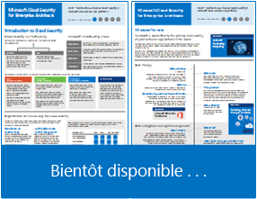
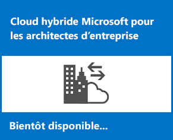
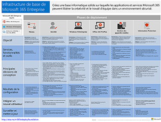
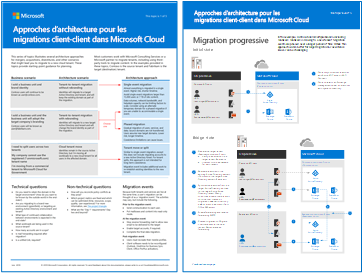
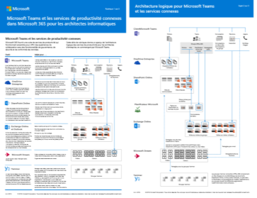
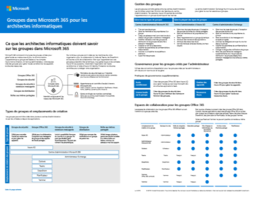
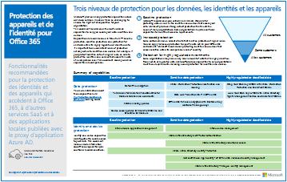
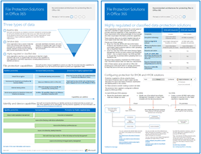
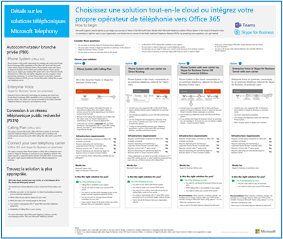

# Ressources relatives à l’architecture informatique du cloud Microsoft

 **Résumé** : apprenez les concepts de base de l’architecture cloud pour l’identité, la sécurité, la mise en réseau et l’hybridation Microsoft. Passez en revue les recommandations normatives pour la protection des fichiers, des identités et des appareils lors de l'utilisation du cloud de Microsoft. Apprenez à déployer un poste de travail moderne et sécurisé avec Windows 10 et Office ProPlus.
  
Ces affiches et outils relatifs à l’architecture fournissent des informations sur les services de cloud computing Microsoft (notamment Office 365, Windows 10, Azure Active Directory, Microsoft Intune, Microsoft Dynamics 365), mais aussi sur les solutions hybrides locales et cloud. Ces ressources permettent aux architectes et décisionnaires informatiques d’identifier la solution adaptée à leurs charges de travail et de prendre les décisions adéquates pour leurs composants d'infrastructure de base tels que l’identité et la sécurité. 
  
<!--**[Microsoft's Enterprise Cloud Roadmap](microsoft-cloud-it-architecture-resources.md#roadmap)** (Sway) -->
    
- **[Série de documents sur le cloud Microsoft pour les architectes d’entreprise](microsoft-cloud-it-architecture-resources.md#cloudarch)** 
    <!-- [Microsoft Cloud Services and Platform Options](microsoft-cloud-it-architecture-resources.md#platformoptions) -->
    - [L’identité dans le cloud Microsoft pour les architectes d’entreprise](microsoft-cloud-it-architecture-resources.md#identity)
    - [La sécurité dans le cloud Microsoft pour les architectes d’entreprise](microsoft-cloud-it-architecture-resources.md#security)
    - [La mise en réseau dans le cloud Microsoft pour les architectes d’entreprise](microsoft-cloud-it-architecture-resources.md#networking)
    - [L’hybridation dans le cloud Microsoft pour les architectes d’entreprise](microsoft-cloud-it-architecture-resources.md#hybrid)
    - [Les attaques courantes et les fonctionnalités Microsoft pour protéger votre organisation](#common-attacks-and-microsoft-capabilities-that-protect-your-organization)
    - [Infrastructure de base de Microsoft 365 Entreprise](#m365foundationinfra)
    - [Approches d’architecture pour les migrations client-client de Microsoft Cloud](#architecture-approaches-for-microsoft-cloud-tenant-to-tenant-migrations)
    
- **[Série de solutions Microsoft 365 Entreprise](microsoft-cloud-it-architecture-resources.md#BKMK_o365solutions)**:
    - [Microsoft Teams et services de productivité connexes dans Microsoft 365 pour les architectes informatique](#microsoft-teams-and-related-productivity-services-in-microsoft-365-for-it-architects)
    - [Groupes dans Microsoft 365 pour les architectes informatique](#groups-in-microsoft-365-for-it-architects)
    - [La protection des appareils et de l’identité pour Office 365](microsoft-cloud-it-architecture-resources.md#BKMK_O365IDP)
    - [Les solutions de protection des fichiers dans Office 365](microsoft-cloud-it-architecture-resources.md#BKMK_O365fileprotect)
    - [Protection des informations Office 365 pour le RGPD](#office-365-information-protection-for-gdpr)
    - [Conseils de sécurité Microsoft pour les campagnes électorales, les organisations à but non lucratif et d’autres organisations flexibles](#microsoft-security-guidance-for-political-campaigns-nonprofits-and-other-agile-organizations)
    - [Détails sur les solutions téléphoniques Microsoft Telephony](#microsoft-telephony-solutions) 
    - [Le déploiement d’un poste de travail moderne et sécurisé avec Microsoft](microsoft-cloud-it-architecture-resources.md#msd)
    
Faites-nous savoir ce que vous en pensez ! Écrivez-nous à l’adresse [cloudadopt@microsoft.com](mailto:cloudadopt@microsoft.com). 

<!--

## Microsoft's Enterprise Cloud Roadmap

See the posters, icon sets, community venues, and other resources that describe the industry's most complete cloud solution.
  
|**Item**|**Description**|
|:-----|:-----|
|[          ](https://aka.ms/cloudarchitecture)   [Microsoft's Enterprise Cloud Roadmap](https://aka.ms/cloudarchitecture) (https://aka.ms/cloudarchitecture)   |Swipe through this Sway experience for the resources that describe the industry's most complete cloud solution.    |
-->
  

##Série de documents sur le cloud Microsoft pour les architectes d’entreprise

Ces affiches relatives à l’architecture cloud fournissent des informations sur les services de cloud computing Microsoft (notamment Office 365, Azure Active Directory, Microsoft Intune, Microsoft Dynamics CRM Online), mais aussi sur les solutions hybrides locales et cloud. Ces ressources permettent aux architectes et décisionnaires informatiques d’identifier la solution adaptée à leurs charges de travail et de prendre les décisions adéquates pour leurs composants d'infrastructure de base tels que l’identité et la sécurité.

<!--  

### Microsoft Cloud Services and Platform Options

Learn key differences between Microsoft cloud services and platform offerings. Find the best fit for your solution.
  
|**Item**|**Description**|
|:-----|:-----|
|[          ](https://www.microsoft.com/download/details.aspx?id=54432)   [PDF](https://go.microsoft.com/fwlink/p/?LinkId=524731)  \| [Visio](https://go.microsoft.com/fwlink/p/?LinkId=524732)  \| [More languages](https://www.microsoft.com/download/details.aspx?id=54432)   | This model describes: <ul><li>  Software as a Service (SaaS) offerings, including Office 365 </li><li>  Platform as a Service (PaaS) features in Microsoft Azure </li><li>  Infrastructure as a Service (IaaS) features in Microsoft Azure </li><li>  Private cloud datacenter capabilities using Windows Server and System Center </li><li>  Learn how Microsoft's own IT department is migrating to these cloud services and building its hybrid cloud. </li></ul> |
-->

   

### L’identité dans le cloud Microsoft pour les architectes d’entreprise

Découvrez tout ce que les architectes informatiques doivent savoir sur la conception d’identité pour les organisations utilisant des plateformes et des services de cloud computing Microsoft.
  
|**Élément**|**Description**|
|:-----|:-----|
|[          ](https://www.microsoft.com/download/details.aspx?id=54431)   [PDF](https://go.microsoft.com/fwlink/p/?LinkId=524586)  \| [Visio](https://download.microsoft.com/download/2/3/8/238228E6-9017-4F6C-BD3C-5559E6708F82/MSFT_cloud_architecture_identity.vsd)           \| [Autres langues](https://www.microsoft.com/download/details.aspx?id=54431)   | Ce modèle contient : <ul><li>Introduction aux identités avec le cloud de Microsoft </li><li>Fonctions IDaaS d’Azure AD </li><li>Intégration de comptes Active Directory Domain Services locaux avec Microsoft Azure Active Directory </li><li>Placement de composants d’annuaire dans Azure </li><li>Options des services de domaine pour les charges de travail dans Azure IaaS </li></ul> |
   

### La sécurité dans le cloud Microsoft pour les architectes d’entreprise

Découvrez tout ce que les architectes informatiques doivent savoir sur la sécurité dans les plateformes et les services de cloud computing Microsoft.
  
|**Élément**|**Description**|
|:-----|:-----|
|[          ](https://www.microsoft.com/download/details.aspx?id=48121)   [PDF](https://go.microsoft.com/fwlink/p/?linkid=842070)  \| [Visio](https://go.microsoft.com/fwlink/p/?LinkId=842071)  \| [Autres langues](https://www.microsoft.com/download/details.aspx?id=48121)   | Ce modèle contient : <ul><li>Rôle de Microsoft en tant que fournisseur de services et de plateformes sécurisés</li><li>Responsabilités du client pour limiter les risques de sécurité</li><li>Certifications de sécurité de premier plan </li><li>Offres de sécurité fournies par les services de conseil de Microsoft </ul> |
   

### La mise en réseau dans le cloud Microsoft pour les architectes d’entreprise

Découvrez tout ce que les architectes informatiques doivent savoir sur la mise en réseau pour les plateformes et les services de cloud computing Microsoft.
  
|**Élément**|**Description**|
|:-----|:-----|
|   [PDF](media/Network-Poster/MSFT_cloud_architecture_networking.pdf)  \| [Visio](https://github.com/MicrosoftDocs/OfficeDocs-Enterprise/raw/live/Enterprise/media/Network-Poster/MSFT_cloud_architecture_networking.vsdx)   | Ce modèle contient : <ul><li> Évolution de votre réseau pour la connectivité cloud </li><li> Éléments courants de connectivité du cloud Microsoft </li><li> ExpressRoute pour la connectivité au cloud de Microsoft </li><li> Conception de réseaux pour Microsoft SaaS, Azure PaaS et Azure IaaS </li></ul>    |

### L’hybridation dans le cloud Microsoft pour les architectes d’entreprise

Tout ce que les architectes informatiques doivent savoir sur l’hybridation du cloud pour les plateformes et services Microsoft.
  
|**Élément**|**Description**|
|:-----|:-----|
|   [PDF](media/Hybrid-Poster/MSFT_cloud_architecture_hybrid.pdf)  \| [Visio](https://github.com/MicrosoftDocs/OfficeDocs-Enterprise/raw/live/Enterprise/media/Hybrid-Poster/MSFT_cloud_architecture_hybrid.vsdx)  | Ce modèle contient : <ul><li> Offres du cloud Microsoft (SaaS, Azure PaaS et Azure IaaS) et leurs éléments communs </li><li> Architecture de Cloud hybride pour les offres Cloud de Microsoft </li><li> Scénarios de cloud hybride pour les services SaaS Microsoft (Office 365), Azure PaaS et Azure IaaS </li></ul> |
   

### Attaques courantes et fonctionnalités Microsoft pour protéger votre organisation
Découvrez les cyberattaques les plus courantes et comment Microsoft peut aider votre organisation à chaque étape d’une attaque. 

|**Élément**|**Description**|
|:-----|:-----|
|   [PDF](https://download.microsoft.com/download/F/A/C/FACFC1E9-FA35-4DF1-943C-8D4237B4275B/MSFT_Cloud_architecture_security_commonattacks.pdf) \| [Visio](https://download.microsoft.com/download/F/A/C/FACFC1E9-FA35-4DF1-943C-8D4237B4275B/MSFT_Cloud_architecture_security_commonattacks.vsdx)   | Cette affiche illustre le chemin des attaques courantes et décrit les fonctionnalités qui aident à arrêter les pirates à chaque étape d’une attaque.  |

### Infrastructure de base de Microsoft 365 Entreprise

Obtenez un aperçu rapide de [l'infrastructure de base](https://docs.microsoft.com/microsoft-365/enterprise/deploy-foundation-infrastructure) pour Microsoft 365 Enterprise pour commencer votre déploiement.
  
|**Item**|**Description**|
|:-----|:-----|
|   [Consulter en ligne](https://aka.ms/m365efoundinfraposter) \| [PDF](https://github.com/MicrosoftDocs/microsoft-365-docs/raw/public/microsoft-365/media/deploy-foundation-infrastructure/Microsoft365EnterpriseFoundInfra.pdf)   | Cette affiche synthétise chaque phase de l’infrastructure de base en termes des objectifs, des fonctionnalités et des outils, des décisions de conception, des résultats de configuration, de l’intégration et du suivi et des mises à jour en continu.  | 

### Approches d’architecture pour les migrations client-client de Microsoft Cloud 
Cette série de rubriques illustre plusieurs approches d’architecture pour les fusions, les acquisitions, les scissions et d’autres scénarios susceptibles de vous amener à migrer vers un nouveau client cloud. Ces rubriques fournissent des conseils sur la planification de point de départ.

|**Item**|**Description**|
|:-----|:-----|
|   [PDF](downloads/Microsoft-365-tenant-to-tenant-migration.pdf) \| [Visio](https://github.com/MicrosoftDocs/OfficeDocs-Enterprise/raw/live/Enterprise/downloads/Microsoft-365-tenant-to-tenant-migration.vsdx)     |Ce modèle contient : <ul><li>Un mappage des scénarios d’entreprises aux approches de l’architecture</li><li>Considérations en matière de conception</li><li>Flux de migration à événement unique</li><li>Flux de migration à phases</li><li>Flux de déplacement ou de fractionnement du client</li></ul>|

## Série de solutions Microsoft 365 Entreprise

Ces documents sur la solution Office 365 Entreprise fournissent des conseils pour la mise en œuvre des fonctionnalités de Microsoft 365, en particulier lors de la mise en commun de nos fonctionnalités avec votre technologie.

### Microsoft Teams et services de productivité connexes dans Microsoft 365 pour les architectes informatique
L’architecture logique de services de productivité dans Microsoft 365, fonctionnant avec Microsoft Teams.

|**Item**|**Description**|
|:-----|:-----|
|   [PDF](downloads/msft-m365-teams-logical-architecture.pdf) \| [Visio](https://github.com/MicrosoftDocs/OfficeDocs-Enterprise/raw/live/Enterprise/downloads/msft-m365-teams-logical-architecture.vsdx)     |Microsoft fournit une suite de services de productivité qui fonctionnent ensemble pour fournir une expérience de collaboration avec la gouvernance des données, la sécurité et la conformité.    Cette série d’illustrations fournit une visibilité de l’architecture logique de services de productivité pour les architectes d’entreprise, fonctionnant avec Microsoft Teams.|

### Groupes dans Microsoft 365 pour les architectes informatique
Quels sont les besoins des architectes informatique concernant les groupes dans Microsoft 365

|**Item**|**Description**|
|:-----|:-----|
|   [PDF](downloads/msft-m365-groups.pdf) \| [Visio](https://github.com/MicrosoftDocs/OfficeDocs-Enterprise/raw/live/Enterprise/downloads/msft-m365-groups.vsdx) |Ces illustrations décrivent les différents types de groupes, la manière dont ceux-ci sont créés et gérés et quelques recommandations en matière de gouvernance.|

   

### Protection des appareils et de l’identité pour Office 365

Découvrez les fonctionnalités recommandées relatives à la protection des identités et des appareils qui accèdent à Office 365, aux autres services SaaS et applications locales publiées avec le proxy d’application Azure AD.
  
|**Élément**|**Description**|
|:-----|:-----|
|[          ](https://www.microsoft.com/download/details.aspx?id=55032)   [PDF](https://go.microsoft.com/fwlink/p/?linkid=841656)  \| [Visio](https://go.microsoft.com/fwlink/p/?linkid=841657)  \| [Autres langues](https://www.microsoft.com/download/details.aspx?id=55032)   |Il est important d’utiliser des niveaux de protection cohérents pour l’ensemble de vos données, de vos identités et de vos appareils. Ce document présente les fonctionnalités comparables en vous fournissant davantage d’informations sur les fonctionnalités de protection des identités et des appareils.    |
   

### Les solutions de protection de fichiers dans Office 365

Découvrez nos recommandations en matière de fonctionnalités pour la protection des fichiers dans Office 365 en fonction de trois niveaux de confidentialité différents.
  
|**Élément**|**Description**|
|:-----|:-----|
|[          ](https://www.microsoft.com/download/details.aspx?id=55523)   [PDF](https://go.microsoft.com/fwlink/?linkid=2004320)  \| [Visio](https://download.microsoft.com/download/7/8/9/789645A5-BD10-4541-BC33-F8D1EFF5E911/MSFT_cloud_architecture_O365%20file%20protection.vsdx)   |Il est important d’utiliser des niveaux de protection cohérents pour l’ensemble de vos données, de vos identités et de vos appareils. Ce document présente les fonctionnalités comparables en vous fournissant davantage d’informations sur les fonctionnalités de protection des fichiers dans Office 365.    |
   

### Protection des informations Office 365 pour le RGPD

Cette solution inclut des recommandations pour la découverte, la classification, la protection et la surveillance des données personnelles. Cette solution utilise le Règlement général sur la protection des données (RGPD) en tant qu’exemple, mais vous pouvez appliquer la même procédure pour vous conformer à de nombreuses autres réglementations.

|**Élément**|**Description**|
|:-----|:-----|
|    [PDF](https://download.microsoft.com/download/E/C/D/ECD5A339-EF10-4420-B3A9-99098884D716/MSFT_Cloud_architecture_information%20protection%20for%20GDPR.pdf) \| [Visio](https://download.microsoft.com/download/E/C/D/ECD5A339-EF10-4420-B3A9-99098884D716/MSFT_Cloud_architecture_information%20protection%20for%20GDPR.vsdx)    |Pour afficher ce contenu au format article, voir [Protection des informations Office 365 pour RGPD](https://docs.microsoft.com/Office365/SecurityCompliance/office-365-information-protection-for-gdpr).      |

### Conseils de Sécurité Microsoft pour les campagnes électorales, les organisations à but non lucratif et d’autres organisations flexibles 

Ce guide décrit comment implémenter un environnement cloud sécurisé. Ce guide des solutions peut être utilisé par n’importe quelle organisation. Il inclut une aide supplémentaire pour les organisations agiles avec des accès et des comptes d’invité BYOD. Vous pouvez utiliser ce guide comme point de départ pour concevoir votre propre environnement.

|**Élément**|**Description**|
|:-----|:-----|
|**Conseils de sécurité Microsoft pour les campagnes politiques**   [          ](https://download.microsoft.com/download/B/4/D/B4D520C3-4D0C-4B4D-BFB9-09F0651C2775/MSFT_Cloud_architecture_security%20for%20political%20campaigns.pdf)   [PDF](https://download.microsoft.com/download/B/4/D/B4D520C3-4D0C-4B4D-BFB9-09F0651C2775/MSFT_Cloud_architecture_security%20for%20political%20campaigns.pdf)  \| [Visio](https://download.microsoft.com/download/B/4/D/B4D520C3-4D0C-4B4D-BFB9-09F0651C2775/MSFT_Cloud_architecture_security%20for%20political%20campaigns.vsdx)   |Ce guide utilise un exemple d’organisation de campagne politique. Utilisez-le comme point de départ pour n’importe quel environnement.    |
|**Conseils de sécurité Microsoft pour les organisations à but non lucratif**   [          ](https://download.microsoft.com/download/9/4/3/94389612-C679-4061-8DF2-D9A15D72B65F/Microsoft_Cloud%20Architecture_Security%20for%20Nonprofits.pdf)   [PDF](https://download.microsoft.com/download/9/4/3/94389612-C679-4061-8DF2-D9A15D72B65F/Microsoft_Cloud%20Architecture_Security%20for%20Nonprofits.pdf)  \| [Visio](https://download.microsoft.com/download/9/4/3/94389612-C679-4061-8DF2-D9A15D72B65F/Microsoft_Cloud%20Architecture_Security%20for%20Nonprofits.vsdx)   |Ce guide a été légèrement révisé pour les organisations à but non lucratif. Par exemple, il répertorie les plans Office 365 pour les associations. Les consignes technique fournies sont les mêmes que dans le guide de solution de campagne politique.    |

Pour obtenir des recommandations pour commencer et des instructions de configuration, reportez-vous à [Conseils de sécurité Microsoft pour les campagnes électorales, les organisations à but non lucratif et d’autres organisations flexibles](https://docs.microsoft.com/Office365/SecurityCompliance/microsoft-security-guidance-for-political-campaigns-nonprofits-and-other-agile-o).

### Détails sur les solutions téléphoniques Microsoft Telephony

Microsoft prend en charge plusieurs options lorsque vous commencez vos premiers pas équipes dans le cloud Microsoft. Ce poster vous aide à décider si la solution de téléphonie Microsoft (Microsoft telephony: système téléphonique dans le cloud ou voix entreprise en local) est appropriée pour les utilisateurs dans votre organisation et comment votre organisation peut se connecter à la Public changé téléphone réseau (PSTN).

  
[PDF](https://github.com/MicrosoftDocs/OfficeDocs-SkypeForBusiness/blob/live/Teams/downloads/telephony-solutions/microsoft-telephony-solutions-12-18.pdf) | [Visio](https://github.com/MicrosoftDocs/OfficeDocs-SkypeForBusiness/blob/live/Teams/downloads/telephony-solutions/microsoft-telephony-solutions-12-18.vsdx) 

Pour plus d’informations, voir l’article pour ce poster : [Solutions de téléphonie Microsoft (Microsoft Telephony Solutions)](https://docs.microsoft.com/SkypeForBusiness/hybrid/msft-telephony-solutions).
  

### Déploiement d’un environnement de bureau moderne et sécurisé avec Microsoft

Que doivent savoir les architectes informatiques sur le déploiement et la gestion des mises à jour pour Office 365 ProPlus sur Windows 10.
  
|**Élément**|**Description**|
|:-----|:-----|
|[          ](https://www.microsoft.com/download/details.aspx?id=55987)   [PDF](https://download.microsoft.com/download/4/E/9/4E90E227-770A-41D1-99FE-925A64D81A55/MSFT_modern_secure_desktop.pdf)  \| [Visio](https://download.microsoft.com/download/4/E/9/4E90E227-770A-41D1-99FE-925A64D81A55/MSFT_modern_secure_desktop.vsdx)   | Ce modèle contient : <ul><li>  Le déploiement de Windows 10 et Office ProPlus à partir du cloud Microsoft </li><li>  Déploiement de Windows 10 et Office ProPlus avec Microsoft Endpoint Configuration Manager </li><li>  La gestion des mises à jour pour Windows 10 et Office ProPlus à partir du cloud Microsoft </li><li>  Gestion des mises à jour de Windows 10 et Office ProPlus avec Microsoft Endpoint Configuration Manager </li><li>  Les fonctionnalités de protection supplémentaires et prêtes à l’emploi de Windows 10 </li></ul>  |
   
## Voir aussi

[Modèles architecturaux pour SharePoint, Exchange, Skype Entreprise et Lync](architectural-models-for-sharepoint-exchange-skype-for-business-and-lync.md)
  
[Guides de laboratoire de test d’adoption cloud](cloud-adoption-test-lab-guides-tlgs.md)
  
[Solutions de sécurité](security-solutions.md)
  
[Solutions hybrides](hybrid-solutions.md)

